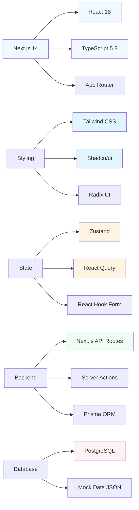
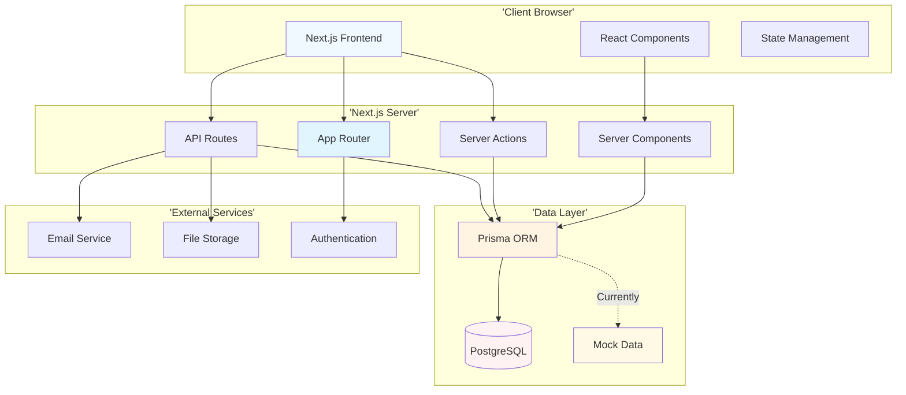
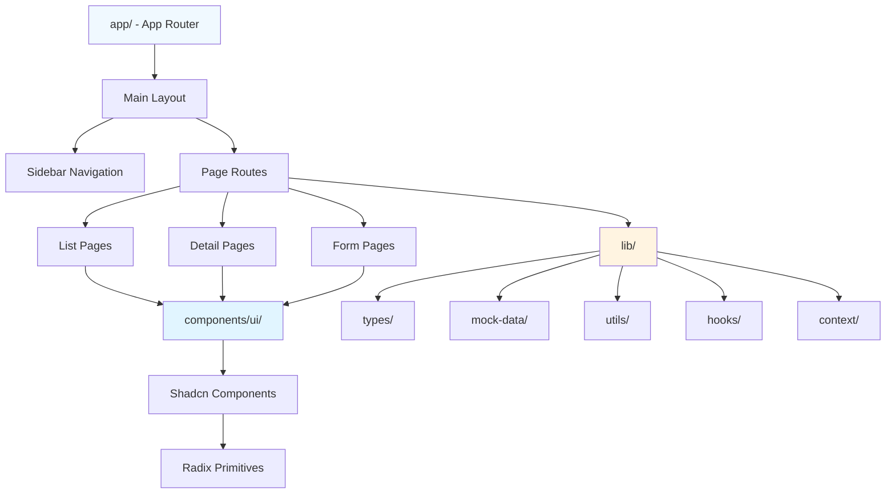
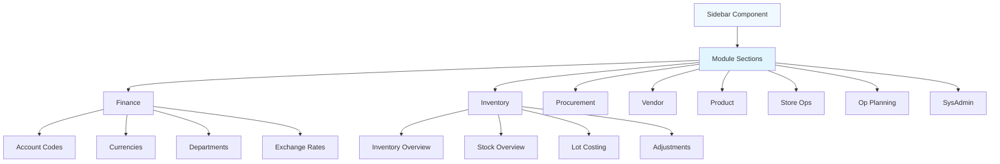
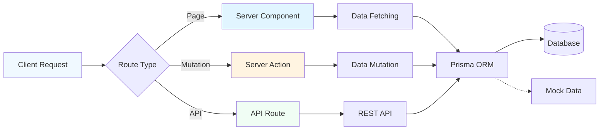
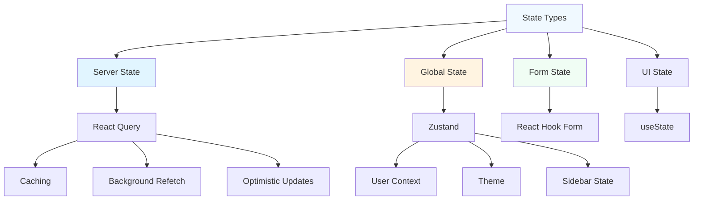
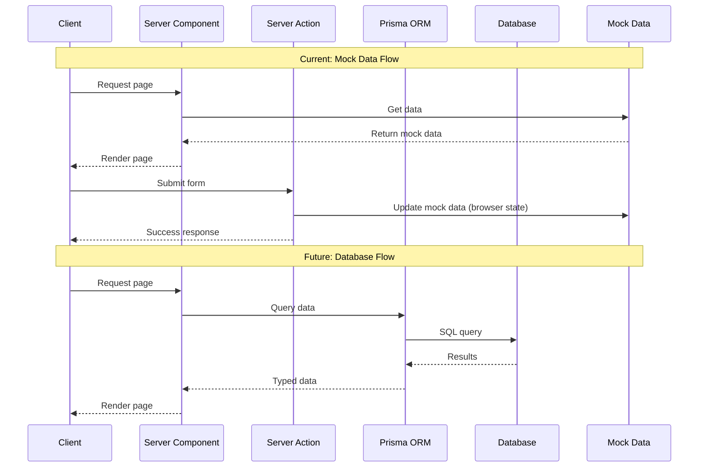
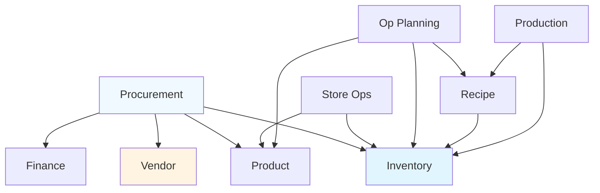
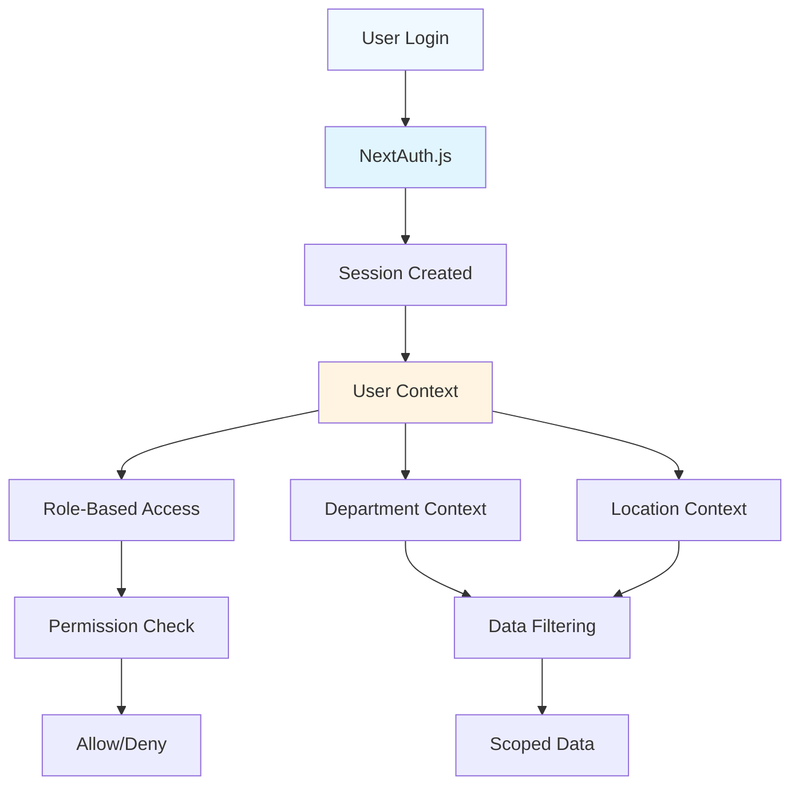
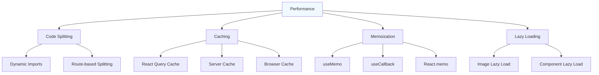

# Architecture Overview

**Comprehensive guide to Carmen ERP system architecture**, covering technical stack, design patterns, module organization, and architectural decisions.

## Document History

| Version | Date | Author | Changes |
|---------|------|--------|---------|
| 1.1.0 | 2025-12-10 | Documentation Team | Standardized reference number format (XXX-YYMM-NNNN) |
| 1.0.0 | 2025-11-19 | Documentation Team | Initial version |

---

## 📋 Table of Contents

1. [Technology Stack](#technology-stack)
2. [High-Level Architecture](#high-level-architecture)
3. [Frontend Architecture](#frontend-architecture)
4. [Backend Architecture](#backend-architecture)
5. [State Management](#state-management)
6. [Database Architecture](#database-architecture)
7. [Module Organization](#module-organization)
8. [Design Patterns](#design-patterns)
9. [Security Architecture](#security-architecture)
10. [Performance Considerations](#performance-considerations)

---

## Technology Stack

### Core Technologies



### Technology Details

| Layer | Technology | Version | Purpose |
|-------|------------|---------|---------|
| **Framework** | Next.js | 14.x | Full-stack React framework with App Router |
| **Language** | TypeScript | 5.8.2 | Type-safe development |
| **UI Library** | React | 18.x | Component-based UI |
| **Styling** | Tailwind CSS | 3.x | Utility-first CSS framework |
| **Components** | Shadcn/ui | Latest | Accessible component library |
| **Primitives** | Radix UI | Latest | Headless UI primitives |
| **Icons** | Lucide React | Latest | Icon library |
| **Global State** | Zustand | Latest | Lightweight state management |
| **Server State** | React Query | Latest | Data fetching and caching |
| **Forms** | React Hook Form | Latest | Performant form handling |
| **Validation** | Zod | Latest | Schema validation |
| **ORM** | Prisma | Latest | Database ORM |
| **Database** | PostgreSQL | 14+ | Relational database |
| **Testing** | Vitest | Latest | Unit testing framework |
| **Runtime** | Node.js | 20.14.0 | JavaScript runtime |

---

## High-Level Architecture

### System Architecture Diagram



### Architectural Layers

**1. Presentation Layer** (Client-Side):
- React components with Shadcn/ui
- Client-side state management (Zustand)
- Form handling (React Hook Form)
- Client-side routing and navigation

**2. Application Layer** (Server-Side):
- Next.js App Router for routing
- Server Components for data fetching
- Server Actions for mutations
- API Routes for REST endpoints

**3. Business Logic Layer**:
- Service layer (planned)
- Validation logic (Zod schemas)
- Business rule enforcement
- Workflow orchestration

**4. Data Access Layer**:
- Prisma ORM
- Repository pattern (planned)
- Query optimization
- Transaction management

**5. Data Layer**:
- PostgreSQL database (planned)
- Mock JSON data (current)
- File storage
- Caching layer

---

## Frontend Architecture

### Component Architecture



### Directory Structure

```
app/
├── (auth)/                      # Authentication routes
│   ├── login/
│   └── layout.tsx
│
├── (main)/                      # Main application
│   ├── layout.tsx               # Main layout with sidebar
│   ├── dashboard/               # Dashboard module
│   ├── procurement/             # Procurement module
│   │   ├── purchase-requests/
│   │   │   ├── page.tsx         # List view
│   │   │   ├── [id]/
│   │   │   │   └── page.tsx     # Detail view
│   │   │   └── new/
│   │   │       └── page.tsx     # Create form
│   │   ├── purchase-orders/
│   │   └── goods-received-notes/
│   │
│   ├── inventory-management/   # Inventory module
│   ├── vendor-management/       # Vendor module
│   ├── product-management/      # Product module
│   ├── operational-planning/    # Operations module
│   ├── store-operations/        # Store ops module
│   ├── finance/                 # Finance module
│   └── system-administration/   # Admin module
│
components/
├── ui/                          # Shadcn/ui components
│   ├── button.tsx
│   ├── input.tsx
│   ├── table.tsx
│   └── ...
│
└── Sidebar.tsx                  # Main navigation
```

### Component Patterns

#### 1. List Component Pattern

```typescript
// Standard pattern for list views
export function ItemListPage() {
  // State
  const [searchTerm, setSearchTerm] = useState('');
  const [sortConfig, setSortConfig] = useState<SortConfig>({
    field: 'name',
    direction: 'asc'
  });

  // Filtering and sorting with useMemo
  const filteredItems = useMemo(() => {
    return items
      .filter(item => matchesSearch(item, searchTerm))
      .sort((a, b) => sortItems(a, b, sortConfig));
  }, [items, searchTerm, sortConfig]);

  return (
    <div className="space-y-4">
      {/* Search and filters */}
      <SearchBar value={searchTerm} onChange={setSearchTerm} />

      {/* Sorted table */}
      <DataTable
        data={filteredItems}
        sortConfig={sortConfig}
        onSort={setSortConfig}
      />
    </div>
  );
}
```

#### 2. Detail View Pattern

```typescript
// Standard pattern for detail views
export async function ItemDetailPage({
  params
}: {
  params: { id: string }
}) {
  // Data fetching (Server Component)
  const item = await getItemById(params.id);

  if (!item) {
    notFound();
  }

  return (
    <div className="space-y-6">
      {/* Header with actions */}
      <DetailHeader item={item} />

      {/* Info sections */}
      <BasicInfo item={item} />
      <RelatedData itemId={item.id} />
    </div>
  );
}
```

#### 3. Form Component Pattern

```typescript
// Standard pattern for forms
const schema = z.object({
  name: z.string().min(1, 'Required'),
  email: z.string().email(),
});

type FormData = z.infer<typeof schema>;

export function ItemForm() {
  const form = useForm<FormData>({
    resolver: zodResolver(schema),
  });

  async function onSubmit(data: FormData) {
    // Server action
    const result = await createItem(data);

    if (result.success) {
      toast.success('Created successfully');
      router.push(`/items/${result.id}`);
    }
  }

  return (
    <Form {...form}>
      <form onSubmit={form.handleSubmit(onSubmit)}>
        {/* Form fields */}
      </form>
    </Form>
  );
}
```

### Navigation Architecture



**Sidebar Features**:
- 3-level nesting support
- Icon and description per item
- Responsive (collapsible on desktop, sheet on mobile)
- Active state indication
- Permission-based visibility

---

## Backend Architecture

### Server-Side Patterns

Carmen uses **Next.js 14 App Router** with a mix of Server Components, Server Actions, and API Routes.



### Server Components

**Purpose**: Server-side data fetching with automatic streaming

**Pattern**:
```typescript
// app/(main)/procurement/purchase-requests/page.tsx
export default async function PurchaseRequestsPage() {
  // Fetch data on server
  const requests = await getPurchaseRequests();

  return (
    <div>
      <PurchaseRequestList requests={requests} />
    </div>
  );
}
```

**Benefits**:
- Zero JavaScript sent to client for data fetching
- Automatic code splitting
- SEO-friendly
- Direct database access

### Server Actions

**Purpose**: Type-safe mutations without API routes

**Pattern**:
```typescript
// app/(main)/procurement/purchase-requests/actions.ts
'use server'

export async function createPurchaseRequest(data: PurchaseRequestInput) {
  // Validate
  const validated = schema.parse(data);

  // Create
  const request = await prisma.purchaseRequest.create({
    data: validated
  });

  // Revalidate
  revalidatePath('/procurement/purchase-requests');

  return { success: true, id: request.id };
}
```

**Benefits**:
- No API route needed
- Type-safe by default
- Automatic revalidation
- Progressive enhancement

### API Routes

**Purpose**: REST API endpoints for external integrations

**Pattern**:
```typescript
// app/api/purchase-requests/route.ts
export async function GET(request: Request) {
  const { searchParams } = new URL(request.url);
  const status = searchParams.get('status');

  const requests = await prisma.purchaseRequest.findMany({
    where: status ? { status } : undefined
  });

  return Response.json(requests);
}
```

**Use Cases**:
- External API integrations
- Webhooks
- Third-party service calls

---

## State Management

### State Management Strategy



### 1. Server State (React Query)

**Purpose**: Data from API/database with caching and synchronization

**Example**:
```typescript
// hooks/usePurchaseRequests.ts
export function usePurchaseRequests() {
  return useQuery({
    queryKey: ['purchase-requests'],
    queryFn: async () => {
      const response = await fetch('/api/purchase-requests');
      return response.json();
    },
    staleTime: 5 * 60 * 1000, // 5 minutes
  });
}
```

**Features**:
- Automatic caching
- Background refetching
- Optimistic updates
- Pagination support

### 2. Global State (Zustand)

**Purpose**: Application-wide state (user context, theme, UI preferences)

**Example**:
```typescript
// lib/context/user-context.tsx
export const useUserStore = create<UserState>((set) => ({
  user: null,
  activeRole: null,
  activeDepartment: null,
  activeLocation: null,

  setUser: (user) => set({ user }),
  setActiveRole: (role) => set({ activeRole: role }),
  setActiveDepartment: (dept) => set({ activeDepartment: dept }),
  setActiveLocation: (loc) => set({ activeLocation: loc }),
}));
```

**Use Cases**:
- User authentication state
- Current role/department/location context
- Theme preferences
- Sidebar open/closed state

### 3. Form State (React Hook Form)

**Purpose**: Form field values and validation

**Example**:
```typescript
const form = useForm<PurchaseRequestInput>({
  resolver: zodResolver(purchaseRequestSchema),
  defaultValues: {
    items: [{ product_id: '', quantity: 0, unit_id: '' }]
  }
});
```

**Features**:
- Type-safe field access
- Built-in validation
- Field arrays support
- Error handling

### 4. Local UI State (useState)

**Purpose**: Component-specific UI state

**Example**:
```typescript
const [isOpen, setIsOpen] = useState(false);
const [searchTerm, setSearchTerm] = useState('');
const [selectedTab, setSelectedTab] = useState('overview');
```

---

## Database Architecture

### Schema Structure

Carmen uses **two separate Prisma schemas**:

```mermaid
graph LR
    A[Carmen ERP] --> B[ABAC Schema]
    A --> C[ERP Schema]

    B --> D[/prisma/schema.prisma]
    C --> E[/docs/app/data-struc/schema.prisma]

    D --> F[18 Tables]
    E --> G[68 Tables]

    F --> H[User Management]
    F --> I[ABAC Permissions]
    F --> J[Audit Logging]

    G --> K[Business Data]
    G --> L[Finance]
    G --> M[Inventory]
    G --> N[Procurement]

    style B fill:#f0f9ff
    style C fill:#e1f5ff
    style F fill:#fff4e1
    style G fill:#f0fdf4
```

### ABAC Permission Schema

**Location**: `/prisma/schema.prisma`
**Purpose**: Attribute-Based Access Control
**Status**: ✅ Active in application

**Key Tables** (18 total):
- **User Management**: tb_user, tb_role, tb_permission
- **Departments**: tb_department, tb_location
- **ABAC**: tb_attribute, tb_policy, tb_resource, tb_action
- **Audit**: tb_audit_log, tb_user_session
- **Workflows**: tb_workflow, tb_workflow_step

### ERP Business Schema

**Location**: `/docs/app/data-struc/schema.prisma`
**Purpose**: Business data model documentation
**Status**: 📄 Documentation only (not yet connected)

**Module Tables** (68 existing, 23 missing):

| Module | Existing Tables | Missing Tables | Coverage |
|--------|----------------|----------------|----------|
| Finance | 8 | 0 | 100% |
| Inventory | 12 | 3 | 80% |
| Procurement | 8 | 0 | 100% |
| Vendor | 10 | 13 | 43% |
| Product | 5 | 0 | 100% |
| Store Ops | 6 | 0 | 100% |
| Op Planning | 8 | 0 | 100% |
| Production | 11 | 7 | 61% |

**Current Data Source**: Mock JSON data in `lib/mock-data/`

### Data Flow Architecture



**📖 [Complete Database Schema Guide](DATABASE-SCHEMA-GUIDE.md)**

---

## Module Organization

### Module Structure

Each business module follows a consistent structure:

```
module-name/
├── sub-module/
│   ├── page.tsx                 # List view (Server Component)
│   ├── [id]/
│   │   └── page.tsx             # Detail view (Server Component)
│   ├── new/
│   │   └── page.tsx             # Create form (Client Component)
│   ├── components/              # Module-specific components
│   │   ├── ItemList.tsx
│   │   ├── ItemDetail.tsx
│   │   └── ItemForm.tsx
│   ├── hooks/                   # Module-specific hooks
│   │   └── useItems.ts
│   ├── types/                   # Module-specific types (avoid, use lib/types)
│   └── actions.ts               # Server actions
```

### Module Dependencies



**Key Integration Points**:

1. **Procurement → Inventory**:
   - GRN creates inventory transactions
   - Lot numbers assigned
   - Stock levels updated

2. **Vendor → Procurement**:
   - Vendor price lists used in purchase requests
   - Vendor selection in purchase orders

3. **Recipe → Inventory**:
   - Recipe ingredients are inventory items
   - Recipe costing uses inventory costs

4. **Finance → Procurement**:
   - Multi-currency purchase orders
   - Exchange rate conversion

**📖 [Module Dependencies Reference](reference/MODULE-DEPENDENCIES.md)**

---

## Design Patterns

### 1. Repository Pattern (Planned)

**Purpose**: Abstract data access logic

```typescript
// lib/repositories/purchaseRequestRepository.ts
export class PurchaseRequestRepository {
  async findAll(filters?: Filters) {
    return prisma.purchaseRequest.findMany({
      where: buildWhereClause(filters),
      include: { items: true, department: true }
    });
  }

  async findById(id: string) {
    return prisma.purchaseRequest.findUnique({
      where: { id },
      include: { items: true }
    });
  }

  async create(data: PurchaseRequestInput) {
    return prisma.purchaseRequest.create({ data });
  }
}
```

### 2. Service Layer Pattern (Planned)

**Purpose**: Business logic encapsulation

```typescript
// lib/services/purchaseRequestService.ts
export class PurchaseRequestService {
  constructor(private repo: PurchaseRequestRepository) {}

  async createRequest(data: PurchaseRequestInput) {
    // Validate
    validatePurchaseRequest(data);

    // Check permissions
    await checkUserPermissions(/* ... */);

    // Create
    const request = await this.repo.create(data);

    // Trigger workflow
    await startApprovalWorkflow(request.id);

    return request;
  }
}
```

### 3. Factory Pattern

**Purpose**: Create complex objects with defaults

```typescript
// lib/mock-data/factories.ts
export function createMockVendor(overrides?: Partial<Vendor>): Vendor {
  return {
    id: uuid(),
    company_name: faker.company.name(),
    tax_id: faker.string.alphanumeric(10),
    is_active: true,
    created_at: new Date(),
    updated_at: new Date(),
    ...overrides
  };
}
```

### 4. Composition Pattern

**Purpose**: Build complex components from smaller ones

```typescript
export function PurchaseRequestDetail({ request }: Props) {
  return (
    <div className="space-y-6">
      <DetailHeader request={request} />
      <BasicInfo request={request} />
      <ItemsTable items={request.items} />
      <ApprovalHistory approvals={request.approvals} />
      <ActivityLog requestId={request.id} />
    </div>
  );
}
```

---

## Security Architecture

### Authentication & Authorization



**Security Layers**:

1. **Authentication**:
   - NextAuth.js for session management
   - JWT tokens for stateless auth
   - Secure cookie storage

2. **Authorization**:
   - ABAC (Attribute-Based Access Control)
   - Role-based permissions
   - Department/location scoping
   - Resource-level access control

3. **Data Protection**:
   - Input validation (Zod schemas)
   - SQL injection prevention (Prisma ORM)
   - XSS protection (React escaping)
   - CSRF protection (Next.js built-in)

4. **Audit Logging**:
   - User action tracking
   - Data change history
   - Security event logging

### Permission System

**Example Permission Check**:
```typescript
// Middleware or component
const canCreatePurchaseRequest = userHasPermission(
  user,
  'purchase_request:create',
  { department_id: activeDepartment.id }
);

if (!canCreatePurchaseRequest) {
  return <AccessDenied />;
}
```

---

## Performance Considerations

### Optimization Strategies



### 1. Code Splitting

**Automatic** (Next.js App Router):
- Each route is a separate bundle
- Only load code for current page

**Manual** (Dynamic imports):
```typescript
// Lazy load heavy components
const HeavyChart = dynamic(() => import('./HeavyChart'), {
  loading: () => <Spinner />,
  ssr: false
});
```

### 2. React Server Components

**Benefits**:
- Zero JavaScript for data fetching
- Streaming HTML
- Automatic code splitting
- Direct database access

**Pattern**:
```typescript
// Server Component (no 'use client')
export default async function Page() {
  const data = await getData(); // No client-side JS

  return (
    <div>
      <ServerComponent data={data} />
      <ClientComponent initialData={data} />
    </div>
  );
}
```

### 3. Memoization

**useMemo** for expensive calculations:
```typescript
const filteredItems = useMemo(() => {
  return items
    .filter(/* complex filter */)
    .sort(/* complex sort */);
}, [items, filters]);
```

**useCallback** for stable function references:
```typescript
const handleSort = useCallback((field: string) => {
  setSortConfig({ field, direction: 'asc' });
}, []);
```

### 4. Image Optimization

**Next.js Image Component**:
```typescript
import Image from 'next/image';

<Image
  src="/product.jpg"
  alt="Product"
  width={500}
  height={300}
  loading="lazy"
/>
```

**Benefits**:
- Automatic WebP conversion
- Lazy loading by default
- Responsive images
- Blur placeholder

### 5. Database Query Optimization

**Prisma Performance**:
```typescript
// Use select to limit fields
const items = await prisma.inventoryItem.findMany({
  select: {
    id: true,
    name: true,
    // Only needed fields
  }
});

// Use pagination
const items = await prisma.inventoryItem.findMany({
  take: 50,
  skip: page * 50
});
```

---

## 📚 Related Guides

**Core Documentation**:
- **[WIKI-HOME.md](WIKI-HOME.md)** - Documentation hub
- **[DEVELOPER-ONBOARDING.md](DEVELOPER-ONBOARDING.md)** - Complete onboarding
- **[MODULE-INDEX.md](MODULE-INDEX.md)** - All 247 documentation files
- **[DATABASE-SCHEMA-GUIDE.md](DATABASE-SCHEMA-GUIDE.md)** - Database schema navigation

**Practical Guides**:
- **[guides/COMPONENT-PATTERNS.md](guides/COMPONENT-PATTERNS.md)** - Component best practices
- **[guides/STATE-MANAGEMENT.md](guides/STATE-MANAGEMENT.md)** - State management patterns
- **[guides/FORM-HANDLING.md](guides/FORM-HANDLING.md)** - Form handling guide
- **[guides/WORKING-WITH-TYPES.md](guides/WORKING-WITH-TYPES.md)** - Type system guide

**Reference**:
- **[reference/MODULE-DEPENDENCIES.md](reference/MODULE-DEPENDENCIES.md)** - Inter-module relationships
- **[reference/NAMING-CONVENTIONS.md](reference/NAMING-CONVENTIONS.md)** - Naming standards
- **[CLAUDE.md](../../CLAUDE.md)** - Development guidelines

---

**Last Updated**: November 15, 2025

**🏠 [Back to Wiki Home](WIKI-HOME.md)** | **🚀 [Get Started](guides/GETTING-STARTED.md)** | **🗺️ [Module Index](MODULE-INDEX.md)**
