# Database Schema Guide

**Complete guide to navigating and understanding** Carmen ERP's database schema, including two separate schemas, table relationships, and implementation status.

---

## 📋 Table of Contents

1. [Schema Overview](#schema-overview)
2. [ABAC Permission Schema](#abac-permission-schema)
3. [ERP Business Schema](#erp-business-schema)
4. [Schema Coverage Status](#schema-coverage-status)
5. [Missing Tables](#missing-tables)
6. [Implementation Roadmap](#implementation-roadmap)
7. [Working with Prisma](#working-with-prisma)

---

## Schema Overview

### Two Separate Schemas

Carmen ERP uses **two independent Prisma schemas** serving different purposes:

```mermaid
graph LR
    A[Carmen ERP] --> B[ABAC Schema]
    A --> C[ERP Schema]

    B --> D[/prisma/schema.prisma]
    C --> E[/docs/app/data-struc/schema.prisma]

    D --> F[18 Tables]
    E --> G[68 Existing + 23 Missing]

    F --> H[✅ Active in App]
    G --> I[📄 Documentation Only]

    F --> J[User Management<br>ABAC Permissions<br>Audit Logging]

    G --> K[Business Data<br>Finance<br>Inventory<br>Procurement<br>Vendors<br>Products<br>Recipes]

    style B fill:#f0f9ff
    style C fill:#e1f5ff
    style H fill:#d1fae5
    style I fill:#fff9e6
```

### Schema Comparison

| Aspect | ABAC Schema | ERP Schema |
|--------|-------------|------------|
| **Location** | `/prisma/schema.prisma` | `/docs/app/data-struc/schema.prisma` |
| **Purpose** | Authentication, Authorization, Audit | Business data and operations |
| **Status** | ✅ Active in application | 📄 Documentation only |
| **Tables** | 18 tables | 68 existing, 23 missing |
| **Database** | Connected to PostgreSQL | Mock data (JSON) |
| **Generator** | Prisma Client | None (documentation) |
| **Migrations** | Active | Not yet created |

---

## ABAC Permission Schema

**File**: `/prisma/schema.prisma`

**Purpose**: Attribute-Based Access Control system for authentication, authorization, and audit logging.

**Status**: ✅ **Active in application**

## Document History

| Version | Date | Author | Changes |
|---------|------|--------|---------|
| 1.1.0 | 2025-12-10 | Documentation Team | Standardized reference number format (XXX-YYMM-NNNN) |
| 1.0.0 | 2025-11-19 | Documentation Team | Initial version |

---
### Schema Structure


### Tables (18 Total)

#### 1. User Management (5 tables)

**`tb_user`** - User accounts
```prisma
model User {
  id            String    @id @default(uuid())
  email         String    @unique
  password_hash String
  first_name    String
  last_name     String
  is_active     Boolean   @default(true)
  department_id String?
  location_id   String?
  created_at    DateTime  @default(now())
  updated_at    DateTime  @updatedAt

  department    Department?  @relation(fields: [department_id])
  location      Location?    @relation(fields: [location_id])
  roles         UserRole[]
  sessions      UserSession[]
  audit_logs    AuditLog[]
}
```

**`tb_role`** - User roles
**`tb_permission`** - System permissions
**`tb_user_role`** - User-to-role assignments
**`tb_role_permission`** - Role-to-permission grants

#### 2. Organization Structure (2 tables)

**`tb_department`** - Organizational departments
**`tb_location`** - Physical locations

#### 3. Session & Audit (2 tables)

**`tb_user_session`** - Active user sessions
**`tb_audit_log`** - Comprehensive audit trail

#### 4. ABAC System (5 tables)

**`tb_attribute`** - User/resource attributes
**`tb_policy`** - Access control policies
**`tb_resource`** - Protected resources
**`tb_action`** - Allowed actions
**`tb_policy_rule`** - Policy evaluation rules

#### 5. Workflow Engine (4 tables)

**`tb_workflow`** - Workflow definitions
**`tb_workflow_step`** - Workflow steps
**`tb_workflow_instance`** - Running workflows
**`tb_workflow_step_instance`** - Step execution tracking

### Key Features

**ABAC Permission System**:
- Role-based access control
- Attribute-based policies
- Department/location scoping
- Resource-level permissions

**Audit Logging**:
- All user actions logged
- Data change tracking
- Security event logging
- 7-year retention

**Workflow Engine**:
- Multi-level approval workflows
- Conditional branching
- Timeout handling
- Notification integration

**📖 [System Administration Documentation](system-administration/DD-system-administration.md)**

---

## ERP Business Schema

**File**: `/docs/app/data-struc/schema.prisma`

**Purpose**: Business data model for ERP operations (finance, inventory, procurement, vendors, etc.)

**Status**: 📄 **Documentation only** (not yet connected to application)

**Current Data Source**: Mock JSON data in `lib/mock-data/`

### Schema Statistics

| Metric | Value |
|--------|-------|
| **Total Documented Tables** | 68 existing + 23 missing = **91 total** |
| **Existing Tables** | 68 tables |
| **Missing Tables** | 16 required + 7 optional = **23 missing** |
| **Overall Coverage** | **77%** (68/91) |
| **Fully Covered Modules** | 6 modules (100% coverage) |
| **Partially Covered Modules** | 2 modules (43-80% coverage) |

### Module Organization

```mermaid
graph TD
    A[ERP Schema] --> B[Finance - 8 tables]
    A --> C[Inventory - 12 + 3 missing]
    A --> D[Procurement - 8 tables]
    A --> E[Vendor - 10 + 13 missing]
    A --> F[Product - 5 tables]
    A --> G[Store Ops - 6 tables]
    A --> H[Op Planning - 8 tables]
    A --> I[Production - 11 + 7 missing]

    style B fill:#d1fae5
    style C fill:#fff9e6
    style D fill:#d1fae5
    style E fill:#fef3f2
    style F fill:#d1fae5
    style G fill:#d1fae5
    style H fill:#d1fae5
    style I fill:#fff9e6

    B --> B1[✅ 100% Coverage]
    C --> C1[⚠️ 80% Coverage]
    D --> D1[✅ 100% Coverage]
    E --> E1[⚠️ 43% Coverage]
    F --> F1[✅ 100% Coverage]
    G --> G1[✅ 100% Coverage]
    H --> H1[✅ 100% Coverage]
    I --> I1[⚠️ 61% Coverage]
```



---

## Schema Coverage Status

### Fully Covered Modules (100% Coverage)

#### 1. Finance Management - 8 Tables

**Purpose**: Multi-currency accounting, exchange rates, departmental allocation

**Tables**:
- `tb_currency` - Currency definitions (USD, EUR, GBP, etc.)
- `tb_exchange_rate` - Exchange rate history
- `tb_department` - Department hierarchy
- `tb_account_code_mapping` - GL account mapping
- `tb_financial_year` - Fiscal year definitions
- `tb_financial_period` - Month/quarter periods
- `tb_budget` - Budget allocations
- `tb_budget_detail` - Budget line items

**Documentation**: **[DD-currency-management.md](finance/currency-management/DD-currency-management.md)**, **[DD-department-management.md](finance/department-management/DD-department-management.md)**

---

#### 2. Procurement Management - 8 Tables

**Purpose**: Purchase requests, orders, GRN, approvals

**Tables**:
- `tb_purchase_request` - Purchase request headers
- `tb_purchase_request_detail` - PR line items
- `tb_purchase_request_template` - Recurring PR templates
- `tb_purchase_request_template_detail` - Template line items
- `tb_purchase_order` - Purchase order headers
- `tb_purchase_order_detail` - PO line items
- `tb_goods_received_note` - GRN headers
- `tb_goods_received_note_detail` - GRN line items

**Key Relationships**:


**Documentation**: **[DD-purchase-requests.md](procurement/purchase-requests/DD-purchase-requests.md)**, **[PROCESS-procurement.md](procurement/PROCESS-procurement.md)**

---

#### 3. Product Management - 5 Tables

**Purpose**: Product catalog, categories, units of measure

**Tables**:
- `tb_product` - Product catalog
- `tb_product_category` - Hierarchical categories
- `tb_unit_of_measure` - Units (kg, liter, piece)
- `tb_product_unit_conversion` - Unit conversions
- `tb_product_supplier` - Preferred suppliers

**Documentation**: **[DD-products.md](product-management/products/DD-products.md)**

---

#### 4. Store Operations - 6 Tables

**Purpose**: Inter-store transfers, replenishment, wastage

**Tables**:
- `tb_store_requisition` - Store-to-store transfer requests
- `tb_store_requisition_detail` - Requisition line items
- `tb_stock_replenishment` - Auto-replenishment rules
- `tb_wastage_report` - Wastage tracking
- `tb_wastage_report_detail` - Wastage line items
- `tb_wastage_reason` - Wastage reason codes

**Documentation**: **[DD-store-requisitions.md](store-operations/store-requisitions/DD-store-requisitions.md)**

---

#### 5. Operational Planning - 8 Tables

**Purpose**: Recipe management, menu engineering, production planning

**Tables**:
- `tb_recipe` - Recipe definitions
- `tb_recipe_ingredient` - Recipe ingredients
- `tb_recipe_category` - Recipe categories
- `tb_cuisine_type` - Cuisine classifications
- `tb_menu_item` - Menu items
- `tb_menu_engineering` - Menu analysis data
- `tb_production_plan` - Production forecasts
- `tb_production_plan_detail` - Production line items

**Documentation**: **[DD-recipes.md](operational-planning/recipe-management/recipes/DD-recipes.md)**, **[DD-menu-engineering.md](operational-planning/menu-engineering/DD-menu-engineering.md)**

---

### Partially Covered Modules

#### 6. Inventory Management - 80% Coverage (12 existing, 3 missing)

**Purpose**: Stock tracking, lot-based costing, fractional inventory, adjustments

**Existing Tables** (12):
- `tb_inventory_item` - Inventory master data
- `tb_stock_level` - Real-time stock levels
- `tb_inventory_transaction` - All inventory movements
- `tb_inventory_transaction_cost_layer` - FIFO lot tracking
- `tb_lot` - Lot master data
- `tb_inventory_count` - Physical count headers
- `tb_inventory_count_detail` - Count line items
- `tb_inventory_adjustment` - Stock adjustments
- `tb_inventory_adjustment_detail` - Adjustment line items
- `tb_inventory_location` - Storage locations
- `tb_inventory_valuation_method` - Costing method config
- `tb_inventory_settings` - Inventory settings

**Missing Tables** (3) - ⚠️ **CRITICAL Priority**:

**`tb_costing_period`** - Monthly costing periods
```prisma
model CostingPeriod {
  id             String   @id @default(uuid())
  period_name    String   // "January 2025"
  start_date     DateTime
  end_date       DateTime
  status         String   // OPEN, CLOSED, LOCKED
  closed_at      DateTime?
  closed_by      String?

  @@index([status])
  @@index([start_date, end_date])
}
```

**`tb_period_average_cost_cache`** - Cached average costs
```prisma
model PeriodAverageCostCache {
  id                      String    @id @default(uuid())
  costing_period_id       String
  inventory_item_id       String
  location_id             String?
  opening_balance_qty     Decimal
  opening_balance_value   Decimal
  total_receipt_qty       Decimal
  total_receipt_value     Decimal
  average_cost_per_unit   Decimal   // Formula result

  @@unique([costing_period_id, inventory_item_id, location_id])
  @@index([inventory_item_id])
}
```

**`tb_period_close_log`** - Period close audit trail
```prisma
model PeriodCloseLog {
  id                String    @id @default(uuid())
  costing_period_id String
  step_number       Int
  step_name         String
  status            String    // SUCCESS, FAILED, SKIPPED
  started_at        DateTime
  completed_at      DateTime?
  error_message     String?
  items_processed   Int?

  @@index([costing_period_id])
}
```

**Implementation Priority**: CRITICAL (13-16 hours)

**Why Missing**: Periodic average costing is a different approach from FIFO lot-based costing. Current schema only supports FIFO.

**Pattern Comparison**:
```
FIFO (Lot-Based):
- lot_no: "LOT-2501-0001" (unique identifier)
- cost_per_unit: Specific to this lot
- Track each lot separately

Periodic Average:
- lot_no: NULL (no lot tracking)
- cost_per_unit: Period average for all receipts
- All transactions use same average cost
```

**Formula**:
```
average_cost = (opening_value + receipt_value) ÷ (opening_qty + receipt_qty)

Example:
  Receipt 1: 100 kg @ $10.00 = $1,000.00
  Receipt 2: 150 kg @ $12.50 = $1,875.00
  Receipt 3:  80 kg @ $11.00 = $880.00

  Total: 330 kg, $3,755.00
  Average: $11.3788/kg

  ✅ ALL transactions in period use $11.3788/kg
```

**Documentation**: **[DD-periodic-average-costing.md](inventory-management/periodic-average-costing/DD-periodic-average-costing.md)**, **[PROCESS-periodic-average-costing.md](inventory-management/periodic-average-costing/PROCESS-periodic-average-costing.md)**

---

#### 7. Vendor Management - 43% Coverage (10 existing, 13 missing)

**Purpose**: Vendor profiles, price lists, RFPs, vendor portal, certifications

**Existing Tables** (10):
- `tb_vendor` - Vendor master data
- `tb_vendor_contact` - Contact persons
- `tb_vendor_address` - Multiple addresses
- `tb_vendor_business_type` - Business classifications
- `tb_pricelist` - Vendor price lists
- `tb_pricelist_detail` - Price list items
- `tb_pricelist_template` - RFP templates
- `tb_pricelist_template_detail` - Template items
- `tb_request_for_pricing` - RFP headers (JSONB approach)
- `tb_request_for_pricing_detail` - RFP line items

**Missing Tables - Vendor Directory** (3) - ⚠️ **HIGH Priority**:

**`tb_vendor_certification`** - Certification tracking (3-4 hours)
- Track food safety certifications, licenses
- Expiry date alerts (60 days warning)
- Auto-status update to 'expired'
- Required for food vendor compliance

**`tb_vendor_document`** - Document management (4-5 hours)
- Store insurance certificates, contracts, licenses
- Document type classification
- Expiry tracking
- Version control

**`tb_vendor_rating`** - Vendor evaluation (5-6 hours)
- Quality, delivery, price ratings
- Rating history tracking
- Overall vendor score calculation
- Performance trending

**Missing Tables - Vendor Portal** (7) - ⚠️ **CRITICAL Priority**:

**Portal Architecture**: Separate Next.js app, NextAuth.js authentication, shared PostgreSQL database

**`tb_vendor_portal_user`** - Vendor user accounts (4-5 hours)
- Email/password authentication
- Bcrypt password hashing (cost factor 12)
- 2FA support (TOTP)
- Role: VENDOR_ADMIN, VENDOR_USER, VENDOR_VIEWER
- Status: ACTIVE, INACTIVE, SUSPENDED, LOCKED
- Rate limiting: 5 login attempts per 15 minutes
- Session expiry: 30 minutes inactivity

**`tb_vendor_portal_session`** - Session management (3-4 hours)
- JWT tokens with refresh tokens
- Device fingerprinting
- Concurrent session limits
- Session invalidation

**`tb_vendor_registration`** - Registration workflow (4-5 hours)
- Self-service registration
- E-signature for terms & conditions
- Admin approval required
- Registration status tracking

**`tb_vendor_document`** - Document management (4-5 hours)
- Upload insurance, licenses, certifications
- Virus scanning integration
- Document type classification
- Version control

**`tb_vendor_notification`** - In-portal notifications (3-4 hours)
- PO notifications
- RFP invitations
- Payment status updates
- Unread count tracking

**`tb_vendor_message`** - Message center (3-4 hours)
- Two-way messaging with buyers
- Message threading
- Attachment support
- Read receipts

**`tb_vendor_audit_log`** - Comprehensive audit trail (3-4 hours)
- All vendor portal actions logged
- IP address tracking
- User agent logging
- 7-year retention

**Total Portal Implementation**: 24-28 hours

**Security Requirements**:
- Encryption at rest: AES-256
- Encryption in transit: TLS 1.3
- Rate limiting: 100 requests per minute
- Data masking for sensitive fields
- Comprehensive audit logging

**Missing Tables - RFP Enhancement** (3) - ⚠️ **MEDIUM Priority** (Optional):

Current approach uses JSONB fields for vendor responses. These relational tables are optional enhancements for better querying and reporting.

**`tb_rfp_vendor_response`** - Vendor responses (3-4 hours)
**`tb_rfp_evaluation`** - Evaluation criteria (3-4 hours)
**`tb_rfp_award`** - Award decisions (2-3 hours)

**Total Missing (Vendor)**: 13 tables (3 + 7 + 3)

**Documentation**: **[DD-vendor-directory.md](vendor-management/vendor-directory/DD-vendor-directory.md)**, **[DD-vendor-portal.md](vendor-management/vendor-portal/DD-vendor-portal.md)**, **[TS-vendor-portal.md](vendor-management/vendor-portal/TS-vendor-portal.md)**

---

## Missing Tables Summary

### Complete List (23 Tables)

| Module | Table Name | Priority | Effort | Purpose |
|--------|-----------|----------|--------|---------|
| **Inventory** | tb_costing_period | CRITICAL | 4-5h | Monthly periods for averaging |
| **Inventory** | tb_period_average_cost_cache | CRITICAL | 5-6h | Cached average costs |
| **Inventory** | tb_period_close_log | CRITICAL | 4-5h | Audit trail for period closing |
| **Vendor** | tb_vendor_certification | HIGH | 3-4h | Certification tracking with alerts |
| **Vendor** | tb_vendor_document | HIGH | 4-5h | Document management |
| **Vendor** | tb_vendor_rating | HIGH | 5-6h | Vendor evaluation & ratings |
| **Vendor Portal** | tb_vendor_portal_user | CRITICAL | 4-5h | Vendor user accounts with 2FA |
| **Vendor Portal** | tb_vendor_portal_session | CRITICAL | 3-4h | Session management |
| **Vendor Portal** | tb_vendor_registration | CRITICAL | 4-5h | Registration workflow |
| **Vendor Portal** | tb_vendor_document | CRITICAL | 4-5h | Document upload with scanning |
| **Vendor Portal** | tb_vendor_notification | CRITICAL | 3-4h | In-portal notifications |
| **Vendor Portal** | tb_vendor_message | CRITICAL | 3-4h | Message center |
| **Vendor Portal** | tb_vendor_audit_log | CRITICAL | 3-4h | Comprehensive audit trail |
| **RFP** | tb_rfp_vendor_response | MEDIUM | 3-4h | Relational vendor responses (optional) |
| **RFP** | tb_rfp_evaluation | MEDIUM | 3-4h | Evaluation criteria (optional) |
| **RFP** | tb_rfp_award | MEDIUM | 2-3h | Award decisions (optional) |
| **Production** | 7 production-related tables | MEDIUM | TBD | Production module (not yet documented) |

### Implementation Priority

**Phase 1 - CRITICAL** (37-44 hours):
1. **Periodic Average Costing** (13-16 hours):
   - tb_costing_period
   - tb_period_average_cost_cache
   - tb_period_close_log

2. **Vendor Portal Core** (24-28 hours):
   - All 7 vendor portal tables
   - NextAuth.js integration
   - Security implementation

**Phase 2 - HIGH** (12-15 hours):
3. **Vendor Directory Enhancements**:
   - tb_vendor_certification
   - tb_vendor_document
   - tb_vendor_rating

**Phase 3 - MEDIUM** (8-10 hours):
4. **RFP Enhancements** (Optional):
   - tb_rfp_vendor_response
   - tb_rfp_evaluation
   - tb_rfp_award

**Total Effort**: 57-69 hours (database schema only)

**Application Logic**: Additional 100-150 hours estimated

**Testing & QA**: Additional 40-60 hours estimated

**📊 [Complete Gap Analysis](MISSING-TABLES-AND-FIELDS-SUMMARY.md)**

---

## Implementation Roadmap

### Current State


### Target State


### Migration Steps

**Step 1: Schema Consolidation** (8 hours)
- Review and merge ERP schema into `/prisma/schema.prisma`
- Resolve naming conflicts
- Validate relationships
- Generate Prisma Client

**Step 2: Missing Tables Implementation** (57-69 hours)
- Implement Phase 1 (CRITICAL): Periodic costing + Vendor portal
- Implement Phase 2 (HIGH): Vendor directory enhancements
- Implement Phase 3 (MEDIUM): RFP optional tables
- Write Prisma migrations
- Test in development environment

**Step 3: Data Migration Strategy** (16-24 hours)
- Design data seeding scripts
- Convert mock data factories to seed scripts
- Create test data sets
- Production data import strategy (if applicable)

**Step 4: Application Code Updates** (100-150 hours)
- Replace mock data imports with Prisma queries
- Update Server Components with database fetching
- Convert Server Actions to use Prisma
- Update type definitions
- Refactor components using new data structures

**Step 5: Testing & Validation** (40-60 hours)
- Unit tests for new functionality
- Integration tests for workflows
- Performance testing for queries
- Security testing for portal
- User acceptance testing

**Total Estimated Effort**: 221-311 hours (13-19 weeks with 1 developer)

**📋 [Implementation Plan Details](DATA-MIGRATION-COMPLETION-SUMMARY.md#next-steps--recommendations)**

---

## Working with Prisma

### Prisma Schema Basics

**Model Definition**:
```prisma
model PurchaseRequest {
  // Primary key
  id                String   @id @default(uuid())

  // Fields
  request_number    String   @unique
  request_date      DateTime
  status            String   // DRAFT, SUBMITTED, APPROVED, REJECTED
  total_amount      Decimal  @db.Decimal(15,2)
  notes             String?  @db.Text

  // Foreign keys
  department_id     String
  requested_by_id   String

  // Timestamps
  created_at        DateTime @default(now())
  updated_at        DateTime @updatedAt

  // Relations
  department        Department @relation(fields: [department_id])
  requested_by      User       @relation(fields: [requested_by_id])
  items             PurchaseRequestDetail[]
  approvals         Approval[]

  // Indexes
  @@index([status])
  @@index([request_date])
  @@index([department_id])
}
```

### Common Prisma Queries

**Find Many**:
```typescript
const requests = await prisma.purchaseRequest.findMany({
  where: {
    status: 'APPROVED',
    request_date: {
      gte: new Date('2025-01-01')
    }
  },
  include: {
    department: true,
    requested_by: {
      select: { first_name: true, last_name: true }
    },
    items: true
  },
  orderBy: {
    request_date: 'desc'
  },
  take: 50
});
```

**Create with Relations**:
```typescript
const request = await prisma.purchaseRequest.create({
  data: {
    request_number: 'PR-2501-0001',
    request_date: new Date(),
    status: 'DRAFT',
    department_id: departmentId,
    requested_by_id: userId,
    items: {
      create: [
        {
          product_id: productId1,
          quantity: 100,
          unit_id: unitId,
          unit_price: 10.50
        },
        {
          product_id: productId2,
          quantity: 50,
          unit_id: unitId,
          unit_price: 25.00
        }
      ]
    }
  },
  include: {
    items: true
  }
});
```

**Update**:
```typescript
const updated = await prisma.purchaseRequest.update({
  where: { id: requestId },
  data: {
    status: 'APPROVED',
    approved_at: new Date(),
    approved_by_id: approverId
  }
});
```

**Transaction**:
```typescript
const result = await prisma.$transaction(async (tx) => {
  // Update purchase order
  const po = await tx.purchaseOrder.update({
    where: { id: poId },
    data: { status: 'RECEIVED' }
  });

  // Create GRN
  const grn = await tx.goodsReceivedNote.create({
    data: {
      purchase_order_id: po.id,
      received_date: new Date(),
      status: 'DRAFT'
    }
  });

  // Create inventory transactions
  const transactions = await tx.inventoryTransaction.createMany({
    data: items.map(item => ({
      inventory_item_id: item.product_id,
      transaction_type: 'RECEIPT',
      quantity: item.quantity,
      grn_id: grn.id
    }))
  });

  return { po, grn, transactions };
});
```

### Prisma Best Practices

**1. Use Select to Limit Fields**:
```typescript
// Good: Only fetch needed fields
const items = await prisma.inventoryItem.findMany({
  select: {
    id: true,
    name: true,
    unit_price: true
  }
});

// Avoid: Fetching all fields when not needed
const items = await prisma.inventoryItem.findMany();
```

**2. Use Pagination**:
```typescript
const items = await prisma.inventoryItem.findMany({
  take: 50,
  skip: page * 50,
  orderBy: { created_at: 'desc' }
});
```

**3. Avoid N+1 Queries**:
```typescript
// Good: Use include to fetch relations
const requests = await prisma.purchaseRequest.findMany({
  include: {
    items: true,
    department: true
  }
});

// Bad: Separate queries for each relation
const requests = await prisma.purchaseRequest.findMany();
for (const request of requests) {
  request.items = await prisma.purchaseRequestDetail.findMany({
    where: { purchase_request_id: request.id }
  });
}
```

**4. Use Transactions for Multi-Step Operations**:
```typescript
// Always use transactions when multiple operations must succeed together
await prisma.$transaction([
  prisma.purchaseOrder.update(/* ... */),
  prisma.goodsReceivedNote.create(/* ... */),
  prisma.inventoryTransaction.createMany(/* ... */)
]);
```

---

## 📚 Related Documentation

**Schema Documentation**:
- **[MISSING-TABLES-AND-FIELDS-SUMMARY.md](MISSING-TABLES-AND-FIELDS-SUMMARY.md)** - Complete gap analysis
- **[DATA-MIGRATION-COMPLETION-SUMMARY.md](DATA-MIGRATION-COMPLETION-SUMMARY.md)** - Migration project summary
- **[SCHEMA-COVERAGE-REPORT.md](SCHEMA-COVERAGE-REPORT.md)** - Coverage by module

**Module DD Documents**:
- **Finance**: [DD-currency-management.md](finance/currency-management/DD-currency-management.md)
- **Inventory**: [DD-inventory-overview.md](inventory-management/inventory-overview/DD-inventory-overview.md)
- **Procurement**: [DD-purchase-requests.md](procurement/purchase-requests/DD-purchase-requests.md)
- **Vendor**: [DD-vendor-directory.md](vendor-management/vendor-directory/DD-vendor-directory.md)
- **Product**: [DD-products.md](product-management/products/DD-products.md)
- **Store Ops**: [DD-store-requisitions.md](store-operations/store-requisitions/DD-store-requisitions.md)
- **Op Planning**: [DD-recipes.md](operational-planning/recipe-management/recipes/DD-recipes.md)
- **SysAdmin**: [DD-system-administration.md](system-administration/DD-system-administration.md)

**Developer Guides**:
- **[WIKI-HOME.md](WIKI-HOME.md)** - Documentation hub
- **[DEVELOPER-ONBOARDING.md](DEVELOPER-ONBOARDING.md)** - Complete onboarding
- **[ARCHITECTURE-OVERVIEW.md](ARCHITECTURE-OVERVIEW.md)** - System architecture
- **[MODULE-INDEX.md](MODULE-INDEX.md)** - All 247 documentation files

---

**Last Updated**: November 15, 2025

**🏠 [Back to Wiki Home](WIKI-HOME.md)** | **🚀 [Get Started](guides/GETTING-STARTED.md)** | **🗺️ [Module Index](MODULE-INDEX.md)**
