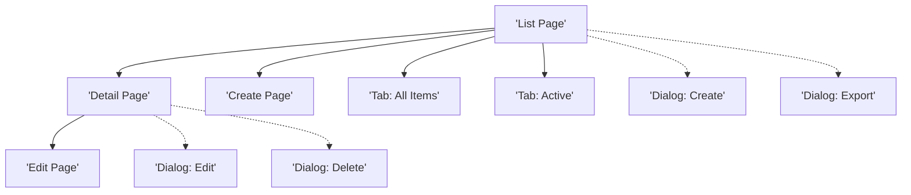

# TS Files Sitemap Audit Report

## Document History

| Version | Date | Author | Changes |
|---------|------|--------|---------|
| 1.1.0 | 2025-12-10 | Documentation Team | Standardized reference number format (XXX-YYMM-NNNN) |
| 1.0.0 | 2025-11-19 | Documentation Team | Initial sitemap audit report |

## Executive Summary

**Audit Date**: 2025-11-19
**Total TS Files**: 44
**Files with Complete Sitemaps**: 16 (36%)
**Files Missing Sitemaps**: 27 (61%)
**Files with Incomplete Sitemaps**: 1 (2%)

**Status**: 🔴 **Critical - 61% of TS files missing sitemap sections**

---

## Findings

### ✅ Complete Sitemaps (16 files)

These files have comprehensive sitemap sections including pages, tabs, and dialogues:

1. ✅ `finance/account-code-mapping/TS-account-code-mapping.md`
2. ✅ `finance/department-management/TS-department-management.md`
3. ✅ `finance/exchange-rate-management/TS-exchange-rate-management.md`
4. ✅ `inventory-management/inventory-adjustments/TS-inventory-adjustments.md`
5. ✅ `inventory-management/inventory-overview/TS-inventory-overview.md`
6. ✅ `inventory-management/physical-count-management/TS-physical-count-management.md`
7. ✅ `inventory-management/spot-check/TS-spot-check.md`
8. ✅ `inventory-management/stock-in/TS-stock-in.md`
9. ✅ `inventory-management/stock-overview/TS-stock-overview.md`
10. ✅ `procurement/goods-received-notes/TS-goods-received-note.md`
11. ✅ `procurement/purchase-orders/TS-purchase-orders.md`
12. ✅ `procurement/purchase-requests/TS-purchase-requests.md`
13. ✅ `store-operations/wastage-reporting/TS-wastage-reporting.md`
14. ✅ `system-administration/location-management/TS-location-management.md`
15. ✅ `system-administration/user-management/TS-user-management.md`
16. ✅ `template-guide/TS-template.md`

### ⚠️ Incomplete Sitemaps (1 file)

File has sitemap but missing dialogue/modal references:

1. ⚠️ `finance/currency-management/TS-currency-management.md` - Has sitemap but no dialogues/modals mentioned

### ❌ Missing Sitemaps (27 files)

These files completely lack sitemap sections and need to be created:

#### Inventory Management (3 files)
1. ❌ `inventory-management/fractional-inventory/TS-fractional-inventory.md`
2. ❌ `inventory-management/lot-based-costing/TS-lot-based-costing.md`
3. ❌ `inventory-management/period-end/TS-period-end.md`

#### Operational Planning (4 files)
4. ❌ `operational-planning/menu-engineering/TS-menu-engineering.md`
5. ❌ `operational-planning/recipe-management/categories/TS-categories.md`
6. ❌ `operational-planning/recipe-management/cuisine-types/TS-cuisine-types.md`
7. ❌ `operational-planning/recipe-management/recipes/TS-recipes.md`

#### Procurement (3 files)
8. ❌ `procurement/credit-note/TS-credit-note.md`
9. ❌ `procurement/my-approvals/TS-my-approvals.md`
10. ❌ `procurement/purchase-request-templates/TS-purchase-request-templates.md`

#### Product Management (3 files)
11. ❌ `product-management/categories/TS-categories.md`
12. ❌ `product-management/products/TS-products.md`
13. ❌ `product-management/units/TS-units.md`

#### Store Operations (2 files)
14. ❌ `store-operations/stock-replenishment/TS-stock-replenishment.md`
15. ❌ `store-operations/store-requisitions/TS-store-requisitions.md`

#### System Administration (7 files)
16. ❌ `system-administration/TS-system-administration.md`
17. ❌ `system-administration/business-rules/TS-business-rules.md`
18. ❌ `system-administration/monitoring/TS-monitoring.md`
19. ❌ `system-administration/permission-management/TS-permission-management.md`
20. ❌ `system-administration/settings/TS-settings.md`
21. ❌ `system-administration/system-integrations/TS-system-integrations.md`
22. ❌ `system-administration/workflow/TS-workflow.md`

#### Vendor Management (5 files)
23. ❌ `vendor-management/price-lists/TS-price-lists.md`
24. ❌ `vendor-management/pricelist-templates/TS-pricelist-templates.md`
25. ❌ `vendor-management/requests-for-pricing/TS-requests-for-pricing.md`
26. ❌ `vendor-management/vendor-directory/TS-vendor-directory.md`
27. ❌ `vendor-management/vendor-portal/TS-vendor-portal.md`

---

## Required Sitemap Components

Based on analysis of complete TS files, a comprehensive sitemap should include:

### 1. Overview Section
- Brief description of navigation structure
- User workflow summary
- Module purpose context

### 2. Page Hierarchy Diagram (Mermaid)
Visual representation showing:
- Main pages (List, Detail, Create, Edit)
- Page tabs
- Dialogues/modals
- Navigation flow between pages

Example structure:


### 3. Page Details
For each page, document:
- **Route**: Full URL path
- **File**: Component file name
- **Purpose**: What the page does
- **Sections**: Major UI sections
- **Tabs** (if applicable): Tab names and content
- **Dialogues**: Modal/dialog components used

### 4. Dialogue/Modal Specifications
For each dialogue:
- **Trigger**: What opens the dialogue
- **Purpose**: What the dialogue does
- **Fields**: Form fields or content
- **Actions**: Available buttons/actions
- **Validation**: Validation rules

---

## Impact Analysis

### User Experience Impact
- **Documentation Gap**: Developers cannot easily understand navigation structure
- **Onboarding**: New team members lack clear page flow documentation
- **Testing**: QA teams missing comprehensive test coverage checklist

### Development Impact
- **Code Organization**: Unclear component hierarchy
- **Route Planning**: Missing URL structure documentation
- **Dialog Management**: No central reference for modal components

### Maintenance Impact
- **Updates**: Difficult to identify all affected pages when making changes
- **Refactoring**: No clear map of component dependencies
- **Feature Addition**: Cannot easily identify where new features fit

---

## Recommendations

### Immediate Actions (Priority 1)

1. **Add Basic Sitemaps to All 27 Missing Files**
   - Use standardized template
   - Include minimum: List page, Detail page, main dialogues
   - Estimated effort: 2-3 hours

2. **Fix Incomplete Sitemap**
   - Add dialogue/modal references to currency-management TS
   - Estimated effort: 15 minutes

### Short-term Actions (Priority 2)

3. **Enhance Existing Sitemaps**
   - Add missing tabs for 16 complete files
   - Verify all dialogues are documented
   - Estimated effort: 4-5 hours

4. **Create Sitemap Template Generator**
   - Automated script to generate sitemap scaffolds
   - Based on BR file analysis
   - Estimated effort: 3-4 hours

### Long-term Actions (Priority 3)

5. **Establish Sitemap Standards**
   - Document sitemap requirements in TS template
   - Add sitemap checklist to PR review process
   - Estimated effort: 2 hours

6. **Regular Audits**
   - Quarterly sitemap completeness audits
   - Automated validation in CI/CD
   - Estimated effort: 1 hour setup, 30 min/quarter

---

## Standardized Sitemap Template

Below is the standard template to be added to all missing TS files:

```markdown
## Sitemap

### Overview
This section provides a complete navigation structure of all pages, tabs, and dialogues in the {Sub-Module Name} sub-module.

### Page Hierarchy

\```mermaid
graph TD
    ListPage['List Page<br>({route})']
    CreatePage['Create Page<br>({route}/new)']
    DetailPage["Detail Page<br>({route}/[id])"]
    EditPage["Edit Page<br>({route}/[id]/edit)"]

    %% List Page Tabs
    ListPage --> ListTab1['Tab: All Items']
    ListPage --> ListTab2['Tab: Active']
    ListPage --> ListTab3['Tab: Archived']

    %% List Page Dialogues
    ListPage -.-> ListDialog1['Dialog: Quick Create']
    ListPage -.-> ListDialog2['Dialog: Bulk Actions']
    ListPage -.-> ListDialog3['Dialog: Export']
    ListPage -.-> ListDialog4['Dialog: Filter']

    %% Detail Page Tabs
    DetailPage --> DetailTab1['Tab: Overview']
    DetailPage --> DetailTab2['Tab: History']
    DetailPage --> DetailTab3['Tab: Activity Log']

    %% Detail Page Dialogues
    DetailPage -.-> DetailDialog1['Dialog: Edit']
    DetailPage -.-> DetailDialog2['Dialog: Delete Confirm']
    DetailPage -.-> DetailDialog3['Dialog: Status Change']

    %% Create/Edit Dialogues
    CreatePage -.-> CreateDialog1['Dialog: Cancel Confirm']
    CreatePage -.-> CreateDialog2['Dialog: Save Draft']

    EditPage -.-> EditDialog1['Dialog: Discard Changes']
    EditPage -.-> EditDialog2['Dialog: Save Draft']

    %% Navigation Flow
    ListPage --> DetailPage
    ListPage --> CreatePage
    DetailPage --> EditPage
    CreatePage --> DetailPage
    EditPage --> DetailPage

    style ListPage fill:#e1f5ff
    style CreatePage fill:#fff4e1
    style DetailPage fill:#e8f5e9
    style EditPage fill:#fce4ec
\```

### Pages

#### 1. List Page
**Route**: `{route}`
**File**: `page.tsx`
**Purpose**: Display paginated list of all {entities}

**Sections**:
- Header: Title, breadcrumbs, primary actions
- Filters: Quick filters, advanced filter panel
- Search: Global search with autocomplete
- Data Table: Sortable columns, row actions, bulk selection
- Pagination: Page size selector, page navigation

**Tabs**:
- **All Items**: Complete list of all {entities}
- **Active**: Filter active items only
- **Archived**: View archived items

**Dialogues**:
- **Quick Create**: Fast creation form with essential fields only
- **Bulk Actions**: Multi-select actions (delete, export, status change)
- **Export**: Export data in various formats (CSV, Excel, PDF)
- **Filter**: Advanced filtering with multiple criteria

#### 2. Detail Page
**Route**: `{route}/[id]`
**File**: `[id]/page.tsx`
**Purpose**: Display comprehensive {entity} details

**Sections**:
- Header: Breadcrumbs, {entity} title, action buttons
- Info Cards: Multiple cards showing different aspects
- Related Data: Associated records and relationships

**Tabs**:
- **Overview**: Key information and summary
- **History**: Change history and audit trail
- **Activity Log**: User actions and system events

**Dialogues**:
- **Edit**: Navigate to edit form
- **Delete Confirm**: Confirmation before deletion
- **Status Change**: Change {entity} status with reason

#### 3. Create Page
**Route**: `{route}/new`
**File**: `new/page.tsx`
**Purpose**: Create new {entity}

**Sections**:
- Form Header: Title, Save/Cancel actions
- Form Fields: All required and optional fields
- Validation: Real-time field validation

**Dialogues**:
- **Cancel Confirm**: Confirm discarding unsaved changes
- **Save Draft**: Save incomplete form as draft

#### 4. Edit Page
**Route**: `{route}/[id]/edit`
**File**: `[id]/edit/page.tsx`
**Purpose**: Modify existing {entity}

**Sections**:
- Form Header: Title, Save/Cancel/Delete actions
- Form Fields: Pre-populated with existing data
- Change Tracking: Highlight modified fields

**Dialogues**:
- **Discard Changes**: Confirm discarding modifications
- **Save Draft**: Save changes as draft
```

---

## Next Steps

1. ✅ Create this audit report
2. ⏳ Generate sitemap sections for all 27 missing files
3. ⏳ Insert sitemaps into TS files
4. ⏳ Fix incomplete sitemap (currency-management)
5. ⏳ Verify all sitemaps complete
6. ⏳ Update TS template with sitemap requirements

---

**Report Generated**: 2025-11-19
**Generated By**: TS Sitemap Audit Script
**Script Location**: `/Users/peak/Documents/GitHub/carmen/check_ts_sitemaps.py`
