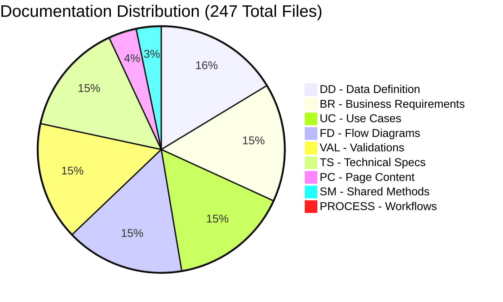

# Carmen ERP Documentation Wiki

**Welcome to the Carmen ERP Documentation Hub** - Your comprehensive guide to understanding, developing, and extending the Carmen hospitality ERP system.

## Document History

| Version | Date | Author | Changes |
|---------|------|--------|---------|
| 1.1.0 | 2025-12-10 | Documentation Team | Standardized reference number format (XXX-YYMM-NNNN) |
| 1.0.0 | 2025-11-19 | Documentation Team | Initial version |

---

## 🚀 Quick Start

**New to Carmen?** Start here:

1. **[Getting Started Guide](guides/GETTING-STARTED.md)** - 15-minute quick start
2. **[Developer Onboarding](DEVELOPER-ONBOARDING.md)** - Complete onboarding journey
3. **[Architecture Overview](ARCHITECTURE-OVERVIEW.md)** - System design and patterns
4. **[Database Schema Guide](DATABASE-SCHEMA-GUIDE.md)** - Data model navigation

**Need to find something?**
- **[Module Index](MODULE-INDEX.md)** - Browse all 247 documentation files
- **[Finding Documentation Guide](guides/FINDING-DOCUMENTATION.md)** - Learn our documentation system

---

## 📚 Documentation Types

Carmen uses 7 specialized document types to cover all aspects of the system:

| Type | Purpose | Count | Example |
|------|---------|-------|---------|
| **DD** | Data Definition - Database schemas, tables, fields, relationships | 40 | [DD-vendors.md](vendor-management/vendors/DD-vendors.md) |
| **BR** | Business Requirements - Functional requirements and rules | 38 | [BR-vendors.md](vendor-management/vendors/BR-vendors.md) |
| **TS** | Technical Specification - Implementation details, APIs, algorithms | 36 | [TS-vendors.md](vendor-management/vendors/TS-vendors.md) |
| **UC** | Use Cases - User workflows and scenarios | 38 | [UC-vendors.md](vendor-management/vendors/UC-vendors.md) |
| **FD** | Flow Diagrams - Visual process flows (Mermaid) | 38 | [FD-vendors.md](vendor-management/vendors/FD-vendors.md) |
| **VAL** | Validations - Business rules and data validation | 38 | [VAL-vendors.md](vendor-management/vendors/VAL-vendors.md) |
| **PROCESS** | Process Documentation - End-to-end workflows | 2 | [PROCESS-procurement.md](procurement/PROCESS-procurement.md) |

**Learn more**: [Document Types Explained](reference/DOCUMENT-TYPES-EXPLAINED.md)

---

## 🏗️ System Architecture

```mermaid
graph TB
    subgraph 'Frontend Layer'
        A[Next.js 14 App Router]
        B[React Components]
        C[Shadcn/ui + Tailwind]
    end

    subgraph 'State Management'
        D[Zustand - Global State]
        E[React Query - Server State]
        F[React Hook Form - Form State]
    end

    subgraph 'Backend Layer'
        G[Next.js API Routes]
        H[Server Actions]
        I[Prisma ORM]
    end

    subgraph 'Data Layer'
        J[(PostgreSQL Database)]
        K[Mock Data - JSON]
    end

    subgraph 'Business Modules'
        L[Finance]
        M[Inventory Management]
        N[Procurement]
        O[Vendor Management]
        P[Product Management]
        Q[Store Operations]
        R[Operational Planning]
        S[System Administration]
    end

    A --> B
    B --> C
    B --> D
    B --> E
    B --> F
    G --> I
    H --> I
    I --> J
    I -.-> K

    A --> L
    A --> M
    A --> N
    A --> O
    A --> P
    A --> Q
    A --> R
    A --> S

    style J fill:#e1f5ff
    style K fill:#fff4e1
    style A fill:#f0f9ff
    style L fill:#f0fdf4
    style M fill:#f0fdf4
    style N fill:#f0fdf4
    style O fill:#f0fdf4
    style P fill:#f0fdf4
    style Q fill:#f0fdf4
    style R fill:#f0fdf4
    style S fill:#f0fdf4
```

**[→ Detailed Architecture Guide](ARCHITECTURE-OVERVIEW.md)**

---

## 🗂️ Business Modules

Carmen is organized into 8 major business modules. Each module has comprehensive documentation covering all aspects from data models to user workflows.

### 💰 Finance Management
**Purpose**: Multi-currency accounting, exchange rates, departmental cost tracking

**Key Features**:
- Multi-currency support with real-time exchange rates
- Department-based cost allocation
- Account code mapping for GL integration
- Currency conversion tracking

**Documentation** (20 docs):
- **[DD-account-code-mapping.md](finance/account-code-mapping/DD-account-code-mapping.md)** - GL account mapping
- **[DD-currency-management.md](finance/currency-management/DD-currency-management.md)** - Currency definitions
- **[DD-department-management.md](finance/department-management/DD-department-management.md)** - Department hierarchy
- **[DD-exchange-rate-management.md](finance/exchange-rate-management/DD-exchange-rate-management.md)** - Exchange rate tracking
- [→ View all Finance docs](MODULE-INDEX.md#finance-management)

**Database Tables**: 8 tables | **Status**: 100% coverage

---

### 📦 Inventory Management
**Purpose**: Stock tracking, lot-based costing, fractional inventory, adjustments

**Key Features**:
- FIFO lot-based cost tracking
- Periodic average costing (proposed)
- Fractional quantity support (0.5 kg, 2.3 liters)
- Stock adjustments with approval workflows
- Real-time inventory valuation

**Documentation** (30 docs):
- **[DD-inventory-overview.md](inventory-management/inventory-overview/DD-inventory-overview.md)** - Core inventory data model
- **[DD-lot-based-costing.md](inventory-management/lot-based-costing/DD-lot-based-costing.md)** - FIFO costing system
- **[DD-periodic-average-costing.md](inventory-management/periodic-average-costing/DD-periodic-average-costing.md)** - Period-based costing (⚠️ 3 missing tables)
- **[DD-fractional-inventory.md](inventory-management/fractional-inventory/DD-fractional-inventory.md)** - Fractional quantity handling
- **[DD-inventory-adjustments.md](inventory-management/inventory-adjustments/DD-inventory-adjustments.md)** - Stock adjustment workflows
- **[DD-stock-overview.md](inventory-management/stock-overview/DD-stock-overview.md)** - Stock level monitoring
- [→ View all Inventory docs](MODULE-INDEX.md#inventory-management)

**Database Tables**: 12 existing, 3 missing | **Status**: 80% coverage

---

### 🛒 Procurement Management
**Purpose**: Purchase requests, orders, GRN (Goods Receipt Notes), approvals

**Key Features**:
- Multi-level approval workflows
- Purchase request templates for recurring orders
- GRN with quality inspection
- Vendor comparison and selection
- Purchase order tracking

**Documentation** (18 docs):
- **[DD-purchase-requests.md](procurement/purchase-requests/DD-purchase-requests.md)** - Purchase request workflows
- **[DD-purchase-orders.md](procurement/purchase-orders/DD-purchase-orders.md)** - PO creation and tracking
- **[DD-purchase-request-templates.md](procurement/purchase-request-templates/DD-purchase-request-templates.md)** - Template management
- **[DD-my-approvals.md](procurement/my-approvals/DD-my-approvals.md)** - Approval workflows
- **[PROCESS-procurement.md](procurement/PROCESS-procurement.md)** - End-to-end procurement process
- [→ View all Procurement docs](MODULE-INDEX.md#procurement-management)

**Database Tables**: 8 tables | **Status**: 100% coverage

---

### 🤝 Vendor Management
**Purpose**: Vendor profiles, price lists, RFPs, vendor portal, certifications

**Key Features**:
- Vendor directory with contact management
- Price list with tiered pricing
- Request for Pricing (RFP) workflows
- Vendor certification tracking with expiry alerts
- Self-service vendor portal (proposed)

**Documentation** (30 docs):
- **[DD-vendor-directory.md](vendor-management/vendor-directory/DD-vendor-directory.md)** - Vendor profiles (⚠️ 3 missing tables)
- **[DD-price-lists.md](vendor-management/price-lists/DD-price-lists.md)** - Vendor pricing
- **[DD-pricelist-templates.md](vendor-management/pricelist-templates/DD-pricelist-templates.md)** - RFP templates
- **[DD-requests-for-pricing.md](vendor-management/requests-for-pricing/DD-requests-for-pricing.md)** - RFP workflows (⚠️ 3 optional enhancement tables)
- **[DD-vendor-portal.md](vendor-management/vendor-portal/DD-vendor-portal.md)** - Self-service portal (⚠️ 7 missing tables)
- [→ View all Vendor docs](MODULE-INDEX.md#vendor-management)

**Database Tables**: 10 existing, 13 missing | **Status**: 43% coverage

---

### 🏷️ Product Management
**Purpose**: Product catalog, categories, units of measure, specifications

**Key Features**:
- Hierarchical category structure
- Multi-unit support (kg, liter, piece, box)
- Product specifications and variants
- SKU management
- Product lifecycle tracking

**Documentation** (12 docs):
- **[DD-products.md](product-management/products/DD-products.md)** - Product catalog
- **[DD-categories.md](product-management/categories/DD-categories.md)** - Category hierarchy
- **[DD-units.md](product-management/units/DD-units.md)** - Unit of measure definitions
- [→ View all Product docs](MODULE-INDEX.md#product-management)

**Database Tables**: 5 tables | **Status**: 100% coverage

---

### 🏪 Store Operations
**Purpose**: Store requisitions, stock replenishment, wastage reporting

**Key Features**:
- Store-to-store requisitions
- Automated stock replenishment based on min/max levels
- Wastage tracking with reason codes
- Transfer approvals and receiving
- Store-level inventory control

**Documentation** (18 docs):
- **[DD-store-requisitions.md](store-operations/store-requisitions/DD-store-requisitions.md)** - Inter-store transfers
- **[DD-stock-replenishment.md](store-operations/stock-replenishment/DD-stock-replenishment.md)** - Auto-replenishment
- **[DD-wastage-reporting.md](store-operations/wastage-reporting/DD-wastage-reporting.md)** - Wastage tracking
- [→ View all Store Operations docs](MODULE-INDEX.md#store-operations)

**Database Tables**: 6 tables | **Status**: 100% coverage

---

### 👨‍🍳 Operational Planning
**Purpose**: Recipe management, menu engineering, production forecasting

**Key Features**:
- Recipe with ingredient specifications
- Recipe costing and margin analysis
- Menu engineering (star, plow-horse, puzzle, dog classification)
- Production planning and forecasting
- Recipe versioning

**Documentation** (24 docs):
- **[DD-recipes.md](operational-planning/recipe-management/recipes/DD-recipes.md)** - Recipe specifications
- **[DD-categories.md](operational-planning/recipe-management/categories/DD-categories.md)** - Recipe categories
- **[DD-cuisine-types.md](operational-planning/recipe-management/cuisine-types/DD-cuisine-types.md)** - Cuisine classification
- **[DD-menu-engineering.md](operational-planning/menu-engineering/DD-menu-engineering.md)** - Menu optimization
- [→ View all Operational Planning docs](MODULE-INDEX.md#operational-planning)

**Database Tables**: 8 tables | **Status**: 100% coverage

---

### ⚙️ System Administration
**Purpose**: User management, roles, permissions, workflows, audit logs

**Key Features**:
- ABAC (Attribute-Based Access Control) permission system
- Role and department-based access
- Workflow configuration
- Audit logging
- User activity tracking

**Documentation** (6 docs):
- **[DD-system-administration.md](system-administration/DD-system-administration.md)** - User and permission management
- [→ View all System Administration docs](MODULE-INDEX.md#system-administration)

**Database Tables**: 18 tables (separate schema: `/prisma/schema.prisma`) | **Status**: 100% coverage

---

## 🧭 Developer Guides

### Getting Started
- **[Getting Started](guides/GETTING-STARTED.md)** - 15-minute quick start guide
- **[Finding Documentation](guides/FINDING-DOCUMENTATION.md)** - Navigate the documentation system
- **[Understanding Module Structure](guides/UNDERSTANDING-MODULE-STRUCTURE.md)** - Module organization patterns

### Working with Code
- **[Working with Types](guides/WORKING-WITH-TYPES.md)** - Centralized type system (`lib/types/`)
- **[Working with Mock Data](guides/WORKING-WITH-MOCK-DATA.md)** - Mock data factories (`lib/mock-data/`)
- **[Component Patterns](guides/COMPONENT-PATTERNS.md)** - Standard component structures
- **[Form Handling](guides/FORM-HANDLING.md)** - React Hook Form + Zod patterns
- **[State Management](guides/STATE-MANAGEMENT.md)** - Zustand and React Query usage

### Reference
- **[Document Types Explained](reference/DOCUMENT-TYPES-EXPLAINED.md)** - DD, BR, TS, UC, FD, VAL guide
- **[Naming Conventions](reference/NAMING-CONVENTIONS.md)** - File, variable, component naming
- **[Module Dependencies](reference/MODULE-DEPENDENCIES.md)** - Inter-module relationships
- **[Glossary](reference/GLOSSARY.md)** - Carmen-specific terminology

---

## 🗃️ Database Schema

Carmen uses a **unified PostgreSQL database** with Prisma ORM. Currently, the application runs on **mock data** with two separate schema files:

### Schema Files

| Schema File | Purpose | Tables | Status |
|-------------|---------|--------|--------|
| **`/prisma/schema.prisma`** | ABAC Permission System | 18 | ✅ Active in app |
| **`/docs/app/data-struc/schema.prisma`** | ERP Business Data | 68 | 📄 Documentation only |

### Schema Coverage Status

**Fully Covered Modules** (100% coverage):
- Finance Management (8 tables)
- Procurement Management (8 tables)
- Product Management (5 tables)
- Store Operations (6 tables)
- Operational Planning (8 tables)
- System Administration (18 tables - separate schema)

**Partially Covered Modules** (43-80% coverage):
- **Inventory Management**: 12 existing, 3 missing (Periodic Average Costing tables)
- **Vendor Management**: 10 existing, 13 missing (Portal + Directory enhancements)

### Missing Tables Summary

**16 Required Tables** + **7 Optional Enhancement Tables** = **23 Total Missing**

| Module | Missing Tables | Priority | Implementation Effort |
|--------|---------------|----------|---------------------|
| Vendor Portal | 7 | CRITICAL | 24-28 hours |
| Vendor Directory | 3 | HIGH | 12-15 hours |
| Periodic Average Costing | 3 | CRITICAL | 13-16 hours |
| RFP Enhancement | 3 | MEDIUM | 8-10 hours |

**📊 [View Complete Gap Analysis](MISSING-TABLES-AND-FIELDS-SUMMARY.md)**

**🗺️ [Navigate Database Schema](DATABASE-SCHEMA-GUIDE.md)**

---

## 📖 Documentation Statistics

**Total Documentation**: 247 files across 8 modules and 36 sub-modules

**Documentation Depth**: Up to 4 levels of nesting

**Coverage Analysis**:
- **Complete Modules**: 6 modules (100% schema coverage)
- **Partial Modules**: 2 modules (43-80% schema coverage)
- **Missing Tables Documented**: 23 tables with complete specifications

---

## 🔍 Search and Navigation

### By Document Type
- [All Data Definitions (DD)](MODULE-INDEX.md#all-data-definitions)
- [All Business Requirements (BR)](MODULE-INDEX.md#all-business-requirements)
- [All Technical Specifications (TS)](MODULE-INDEX.md#all-technical-specifications)
- [All Use Cases (UC)](MODULE-INDEX.md#all-use-cases)
- [All Flow Diagrams (FD)](MODULE-INDEX.md#all-flow-diagrams)
- [All Validations (VAL)](MODULE-INDEX.md#all-validations)

### By Module
- [Finance Management (20 docs)](MODULE-INDEX.md#finance-management)
- [Inventory Management (30 docs)](MODULE-INDEX.md#inventory-management)
- [Procurement Management (18 docs)](MODULE-INDEX.md#procurement-management)
- [Vendor Management (30 docs)](MODULE-INDEX.md#vendor-management)
- [Product Management (12 docs)](MODULE-INDEX.md#product-management)
- [Store Operations (18 docs)](MODULE-INDEX.md#store-operations)
- [Operational Planning (24 docs)](MODULE-INDEX.md#operational-planning)
- [System Administration (6 docs)](MODULE-INDEX.md#system-administration)

### By Feature
- [User Authentication & Authorization](system-administration/DD-system-administration.md)
- [Multi-Currency Support](finance/currency-management/DD-currency-management.md)
- [Lot-Based Inventory Costing](inventory-management/lot-based-costing/DD-lot-based-costing.md)
- [Approval Workflows](procurement/my-approvals/DD-my-approvals.md)
- [Vendor Price Lists](vendor-management/price-lists/DD-price-lists.md)
- [Recipe Management](operational-planning/recipe-management/recipes/DD-recipes.md)
- [Stock Replenishment](store-operations/stock-replenishment/DD-stock-replenishment.md)

---

## 🚧 Implementation Roadmap

### Phase 1: Database Schema Implementation (57-69 hours)
**Priority**: CRITICAL

1. **Periodic Average Costing** (13-16 hours)
   - `tb_costing_period` - Monthly costing periods
   - `tb_period_average_cost_cache` - Cached average costs
   - `tb_period_close_log` - Period close audit trail

2. **Vendor Portal Core** (24-28 hours)
   - 7 portal-specific tables for vendor self-service
   - NextAuth.js integration
   - Security and audit logging

3. **Vendor Directory Enhancements** (12-15 hours)
   - `tb_vendor_certification` - Certification tracking
   - `tb_vendor_document` - Document management
   - `tb_vendor_rating` - Vendor evaluation

4. **RFP Enhancements** (8-10 hours) - OPTIONAL
   - Relational tables for vendor responses
   - Evaluation and award tracking
   - Alternative to current JSONB approach

### Phase 2: Application Logic (100-150 hours)
- Period-based costing calculations
- Vendor portal features
- Certification expiry alerts
- RFP workflow improvements

### Phase 3: Testing & QA (40-60 hours)
- Unit tests for new functionality
- Integration tests for workflows
- Performance testing
- Security testing

**📋 [View Complete Implementation Plan](DATA-MIGRATION-COMPLETION-SUMMARY.md#next-steps--recommendations)**

---

## 🆘 Getting Help

### Quick References
- **Technical Issues**: Check [Architecture Overview](ARCHITECTURE-OVERVIEW.md)
- **Database Questions**: See [Database Schema Guide](DATABASE-SCHEMA-GUIDE.md)
- **Module Questions**: Browse [Module Index](MODULE-INDEX.md)
- **Terminology**: Consult [Glossary](reference/GLOSSARY.md)

### Related Resources
- **[Main CLAUDE.md](../../CLAUDE.md)** - Claude Code instructions
- **[Main README.md](../../README.md)** - Project overview
- **[Package.json](../../package.json)** - Dependencies and scripts

---

## 📝 Documentation Maintenance

This wiki is maintained alongside the codebase. When making changes:

1. **Update Relevant DD Documents** when modifying database schema
2. **Update BR Documents** when changing business rules
3. **Update TS Documents** when modifying implementation
4. **Update UC Documents** when changing user workflows
5. **Keep Cross-References Accurate** across all document types

**Last Updated**: November 15, 2025
**Total Documentation Files**: 247
**Schema Coverage**: 77% (68 existing tables, 23 missing tables documented)
**Project Status**: Development (Mock Data Phase)

---

**🏠 [Back to Top](#carmen-erp-documentation-wiki)** | **📚 [Full Module Index](MODULE-INDEX.md)** | **🚀 [Get Started](guides/GETTING-STARTED.md)**
