# Flow Diagrams: Account Code Mapping

## Module Information
- **Module**: Finance
- **Sub-Module**: Account Code Mapping
- **Version**: 1.0.0
- **Last Updated**: 2025-11-12
- **Owner**: Finance & Accounting Team
- **Status**: Draft

## Document History
| Version | Date | Author | Changes |
|---------|------|--------|---------|
| 1.1.0 | 2025-12-10 | Documentation Team | Standardized reference number format (XXX-YYMM-NNNN) |
| 1.0.0 | 2025-11-12 | Documentation Team | Initial version |

---

## Overview

This document provides comprehensive visual representations of the Account Code Mapping module's workflows, data flows, and integrations. The diagrams cover the complete financial posting lifecycle from Chart of Accounts setup through automated journal entry generation, manual posting, period closing, and financial reporting. These flows support the business objectives of automated financial posting, multi-dimensional accounting, and period-based financial management.

**Related Documents**:
- [Business Requirements](./BR-account-code-mapping.md)
- [Use Cases](./UC-account-code-mapping.md)
- [Technical Specification](./TS-account-code-mapping.md)
- [Data Schema](./DS-account-code-mapping.md)
- [Validations](./VAL-account-code-mapping.md)

---

## Diagram Index

| Diagram | Type | Purpose | Complexity |
|---------|------|---------|------------|
| [High-Level Process Flow](#high-level-process-flow) | Process | Complete financial posting lifecycle | Medium |
| [Automated Posting Flow](#automated-journal-entry-generation-flow) | Process | Auto-generate JE from transactions | High |
| [Manual Posting Flow](#manual-journal-entry-posting-flow) | Process | Manual JE creation and posting | Medium |
| [Mapping Rule Evaluation](#mapping-rule-evaluation-flow) | Process | Rule matching algorithm | High |
| [Period Close Process](#period-close-process-flow) | Process | Month/quarter/year-end close | High |
| [Data Flow Diagram](#data-flow-diagram) | Data | Data movement through system | Medium |
| [Sequence Diagrams](#sequence-diagrams) | Interaction | Component interactions | High |
| [State Diagrams](#state-diagrams) | State | Status transitions | Medium |
| [Integration Flows](#integration-flows) | Integration | External system interactions | High |
| [Reconciliation Flow](#account-reconciliation-flow) | Process | GL to sub-ledger reconciliation | Medium |

---

## Process Flows

### High-Level Process Flow

**Purpose**: End-to-end financial management process from COA setup through reporting

**Actors**: CFO, Controller, Accountant, Posting Engine, External Systems

**Trigger**: Organization setup or fiscal period operations

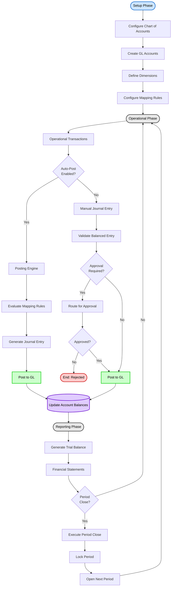

**Flow Steps**:

1. **Setup Phase**: Initial configuration of financial system
   - Configure COA structure and accounting standards
   - Create GL account hierarchy
   - Define dimensions (department, location, cost center, etc.)
   - Configure mapping rules for automated posting

2. **Operational Phase**: Day-to-day transaction processing
   - Operational transactions occur (GRN, invoices, payments)
   - Auto-posting: Posting Engine evaluates rules and generates JEs
   - Manual posting: Accountants create JEs with validation
   - All entries post to GL and update account balances

3. **Reporting Phase**: Financial reporting and period management
   - Generate trial balance and financial statements
   - Execute period close process
   - Lock period and open next period
   - Cycle returns to operational phase

---

### Automated Journal Entry Generation Flow

**Purpose**: Automatically generate and post journal entries from operational transactions

**Actors**: Posting Engine, Mapping Rule Engine, GL Database, External Systems

**Trigger**: Operational transaction posted (GRN, invoice, payment, etc.)

```mermaid
flowchart TD
    Start([Transaction Posted]) --> Event[/Event Published to Queue/]
    Event --> Consumer[Posting Engine Consumes Event]
    Consumer --> Fetch[Retrieve Transaction Details]

    Fetch --> Check1{Transaction<br>Already Posted?}
    Check1 -->|Yes| Duplicate([Ignore Duplicate])
    Check1 -->|No| Continue1[Continue Processing]

    Continue1 --> Check2{Period<br>Open?}
    Check2 -->|No| Error1[/Error: Period Closed/]
    Error1 --> Queue1[(Add to Error Queue)]
    Queue1 --> Notify1[/Notify Finance Team/]

    Check2 -->|Yes| CallMapping[Call Mapping Rule Engine]
    CallMapping --> EvalRules[Evaluate Rules by Priority]

    EvalRules --> Match{Rule<br>Matched?}
    Match -->|No| Unmapped[(Add to Unmapped Queue)]
    Unmapped --> Notify2[/Notify Finance Team/]
    Notify2 --> End1([End: Manual Review Required])

    Match -->|Yes| GetAccounts[Get Account Assignments]
    GetAccounts --> GetDims[Get Dimension Mappings]

    GetDims --> Construct[Construct Journal Entry Lines]
    Construct --> AddTax{Taxable<br>Transaction?}
    AddTax -->|Yes| TaxLine[Add Tax Line]
    AddTax -->|No| Continue2[Continue]
    TaxLine --> Continue2

    Continue2 --> MultiCurr{Foreign<br>Currency?}
    MultiCurr -->|Yes| Convert[Convert to Base Currency]
    MultiCurr -->|No| Continue3[Continue]
    Convert --> Continue3

    Continue3 --> Validate[Validate Balanced Entry]
    Validate --> Balanced{Debits =<br>Credits?}
    Balanced -->|No| Error2[/Error: Unbalanced Entry/]
    Error2 --> Queue2[(Add to Error Queue)]
    Queue2 --> Notify3[/Notify Finance Team/]

    Balanced -->|Yes| Lock[Optimistic Locking Check]
    Lock --> Conflict{Concurrent<br>Posting?}
    Conflict -->|Yes| Retry{Retry<br>Count < 3?}
    Retry -->|Yes| Wait[Wait with Backoff]
    Wait --> Lock
    Retry -->|No| Error3[/Error: Concurrent Conflict/]
    Error3 --> Queue2

    Conflict -->|No| BeginTx[Begin Database Transaction]
    BeginTx --> InsertHeader[Insert Journal Entry Header]
    InsertHeader --> InsertLines[Insert Journal Entry Lines]
    InsertLines --> UpdateBalances[Update Account Balances]
    UpdateBalances --> LinkSource[Link to Source Transaction]
    LinkSource --> Commit[Commit Transaction]

    Commit --> Published[/Publish JE Posted Event/]
    Published --> UpdateViews[Update Materialized Views]
    UpdateViews --> Notifications[/Send Notifications/]
    Notifications --> Success([End: Success])

    style Start fill:#cce5ff,stroke:#0066cc,stroke-width:2px,color:#000
    style Success fill:#ccffcc,stroke:#00cc00,stroke-width:2px,color:#000
    style End1 fill:#ffe0b3,stroke:#cc6600,stroke-width:2px,color:#000
    style Duplicate fill:#e8e8e8,stroke:#333,stroke-width:2px,color:#000
    style Error1 fill:#ffcccc,stroke:#cc0000,stroke-width:2px,color:#000
    style Error2 fill:#ffcccc,stroke:#cc0000,stroke-width:2px,color:#000
    style Error3 fill:#ffcccc,stroke:#cc0000,stroke-width:2px,color:#000
    style Unmapped fill:#ffe0b3,stroke:#cc6600,stroke-width:2px,color:#000
    style Queue1 fill:#e0ccff,stroke:#6600cc,stroke-width:2px,color:#000
    style Queue2 fill:#e0ccff,stroke:#6600cc,stroke-width:2px,color:#000
    style BeginTx fill:#e0ccff,stroke:#6600cc,stroke-width:2px,color:#000
```

**Decision Points**:

| Decision | Criteria | Outcome |
|----------|----------|---------|
| Already Posted | Check source_document_id exists in journal_entries | Skip duplicate/Continue |
| Period Open | Check period status = 'Open' | Error/Continue |
| Rule Matched | Evaluate criteria against transaction | Unmapped/Account assignments |
| Taxable | Check transaction type and tax code | Add tax line/Skip |
| Foreign Currency | Check currency != base currency | Convert/Use as-is |
| Balanced | Sum(debits) = Sum(credits) | Error/Continue |
| Concurrent Posting | Version mismatch on update | Retry/Proceed |

**Exception Handling**:
- **Period Closed**: Add to error queue, notify finance team for period reopen or next period posting
- **No Rule Match**: Add to unmapped transaction queue for manual review and rule creation
- **Unbalanced Entry**: Add to error queue with details, investigate mapping rule configuration
- **Concurrent Conflict**: Retry 3 times with exponential backoff, then error queue
- **Database Failure**: Rollback transaction, log error, retry in next batch

---

### Manual Journal Entry Posting Flow

**Purpose**: Guide accountants through manual journal entry creation and posting

**Actors**: Accountant, Controller (for approval), GL Database

**Trigger**: Accountant initiates manual JE creation

```mermaid
flowchart TD
    Start([Accountant Opens JE Form]) --> Header[Enter Header Information]
    Header --> Line1[Add First Debit Line]
    Line1 --> Account1[Select Account]
    Account1 --> Amount1[Enter Amount]
    Amount1 --> Dims1[Assign Dimensions]

    Dims1 --> Line2[Add First Credit Line]
    Line2 --> Account2[Select Account]
    Account2 --> Amount2[Enter Amount]
    Amount2 --> Dims2[Assign Dimensions]

    Dims2 --> More{More<br>Lines?}
    More -->|Yes| AddLine[Add Another Line]
    AddLine --> SelectType{Debit or<br>Credit?}
    SelectType -->|Debit| Account1
    SelectType -->|Credit| Account2

    More -->|No| Calculate[Calculate Balance]
    Calculate --> Balanced{Debits =<br>Credits?}
    Balanced -->|No| Warning[/Show Balance Warning/]
    Warning --> Dims2

    Balanced -->|Yes| Attach{Attach<br>Documents?}
    Attach -->|Yes| Upload[Upload Supporting Docs]
    Attach -->|No| Continue1[Continue]
    Upload --> Continue1

    Continue1 --> Notes{Add<br>Notes?}
    Notes -->|Yes| AddNotes[Enter Internal Notes]
    Notes -->|No| Continue2[Continue]
    AddNotes --> Continue2

    Continue2 --> Submit[Click Post Journal Entry]
    Submit --> ValidateClient[Client-Side Validation]

    ValidateClient --> ClientOK{Valid?}
    ClientOK -->|No| ShowErrors[/Display Validation Errors/]
    ShowErrors --> Header

    ClientOK -->|Yes| ServerAction[Call Server Action]
    ServerAction --> ValidateServer[Server-Side Validation]

    ValidateServer --> ServerOK{Valid?}
    ServerOK -->|No| ReturnErrors[/Return Validation Errors/]
    ReturnErrors --> ShowErrors

    ServerOK -->|Yes| PeriodCheck{Period<br>Open?}
    PeriodCheck -->|No| ErrorPeriod[/Error: Period Closed/]
    ErrorPeriod --> ShowErrors

    PeriodCheck -->|Yes| AccountCheck{All Accounts<br>Active?}
    AccountCheck -->|No| ErrorAccount[/Error: Inactive Account/]
    ErrorAccount --> ShowErrors

    AccountCheck -->|Yes| AuthCheck{Amount Exceeds<br>User Authority?}
    AuthCheck -->|Yes| RouteApproval[Route for Approval]
    RouteApproval --> WaitApproval[Status: Pending Approval]
    WaitApproval --> Approver[Controller Reviews]
    Approver --> ApprovalDecision{Approved?}
    ApprovalDecision -->|No| Rejected([End: Rejected])
    ApprovalDecision -->|Yes| PostEntry[Post to GL]

    AuthCheck -->|No| PostEntry
    PostEntry --> BeginTx[Begin Transaction]
    BeginTx --> InsertHeader[Insert JE Header]
    InsertHeader --> InsertLines[Insert JE Lines]
    InsertLines --> UpdateBalances[Update Account Balances]
    UpdateBalances --> AuditLog[Record Audit Trail]
    AuditLog --> Commit[Commit Transaction]

    Commit --> Success[/Success Notification/]
    Success --> Redirect[Redirect to JE Detail Page]
    Redirect --> End([End: Success])

    style Start fill:#cce5ff,stroke:#0066cc,stroke-width:2px,color:#000
    style End fill:#ccffcc,stroke:#00cc00,stroke-width:2px,color:#000
    style Rejected fill:#ffcccc,stroke:#cc0000,stroke-width:2px,color:#000
    style ErrorPeriod fill:#ffcccc,stroke:#cc0000,stroke-width:2px,color:#000
    style ErrorAccount fill:#ffcccc,stroke:#cc0000,stroke-width:2px,color:#000
    style ShowErrors fill:#ffe0b3,stroke:#cc6600,stroke-width:2px,color:#000
    style PostEntry fill:#ccffcc,stroke:#00cc00,stroke-width:2px,color:#000
    style BeginTx fill:#e0ccff,stroke:#6600cc,stroke-width:2px,color:#000
```

**Flow Steps**:

1. **Entry Creation**: Accountant opens form and enters header (date, description)
2. **Line Items**: Add debit and credit lines with accounts, amounts, dimensions
3. **Balance Validation**: System calculates and enforces balanced entry
4. **Attachments**: Optional upload of supporting documents
5. **Submission**: Client and server validation
6. **Period Check**: Verify period is open for posting
7. **Account Check**: Verify all accounts are active
8. **Authority Check**: Determine if approval required based on amount
9. **Approval (if required)**: Route to controller for review
10. **Posting**: Insert header and lines, update balances atomically
11. **Success**: Display confirmation and redirect to detail page

---

### Mapping Rule Evaluation Flow

**Purpose**: Determine which GL accounts to use for a transaction based on mapping rules

**Actors**: Mapping Rule Engine, GL Database

**Trigger**: Posting Engine requests account assignment

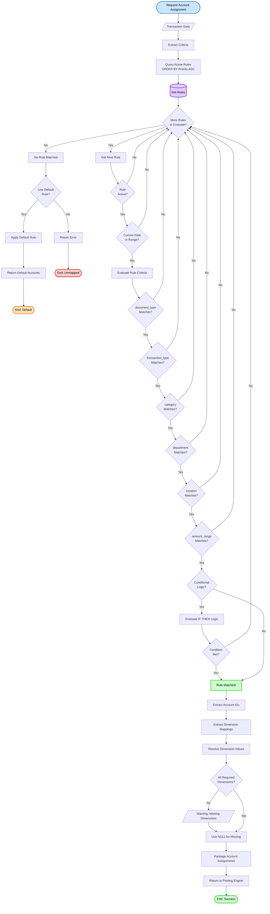

**Rule Evaluation Logic**:

1. **Priority Order**: Rules evaluated in ascending priority order (1, 2, 3...)
2. **First Match Wins**: Once a rule matches all criteria, return immediately
3. **Criteria Logic**: AND logic (all criteria must match) or OR logic (any criteria match)
4. **Conditional Logic**: IF-THEN rules for complex scenarios (e.g., imported goods add duty account)
5. **Dimension Resolution**: Map transaction attributes to dimension values
6. **Default Fallback**: If no rules match, use default rule or return unmapped error

**Criteria Matching**:
- **Exact Match**: Field value must equal criterion value
- **IN List**: Field value must be in list of allowed values
- **Range Match**: Field value must be within min/max range (for amounts)
- **Null/Any**: NULL criterion means "match any value" (wildcard)

---

### Period Close Process Flow

**Purpose**: Guide finance team through comprehensive period close process

**Actors**: Controller, Accountant, System Background Jobs

**Trigger**: End of accounting period (month, quarter, year)

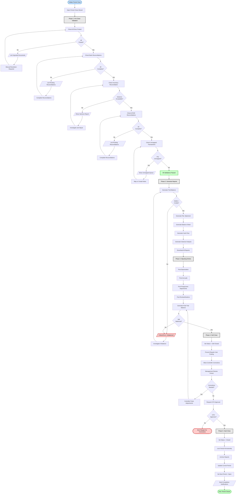

**Phase Descriptions**:

**Phase 1: Pre-Close Validation** (2-3 days)
- Verify all operational documents posted to GL
- Complete bank reconciliations (variances < $100)
- Complete inventory reconciliation (variances < $1000 or 0.5%)
- Complete AP/AR reconciliations (match to sub-ledgers)
- Resolve all unmapped transactions (create rules or manual JEs)
- Generate validation report with all checkpoints

**Phase 2: Generate Reports** (0.5 day)
- Generate and verify trial balance (debits = credits)
- Generate Profit & Loss statement
- Generate Balance Sheet
- Generate Cash Flow statement
- Generate variance analysis vs. budget and prior period
- Download and distribute reports to management

**Phase 3: Adjusting Entries** (1-2 days)
- Post automated depreciation for fixed assets
- Post accruals for expenses incurred but not invoiced
- Post prepayment adjustments and deferrals
- Post reclassification entries for correct classification
- Generate final trial balance with adjustments

**Phase 4: Soft Close** (2-3 days)
- Set period status to "Soft Closed"
- Block regular user posting (only controllers can post)
- Allow management review and corrections
- Post any final adjustments identified in review
- Request CFO approval to proceed to hard close

**Phase 5: Hard Close** (0.5 day)
- Set period status to "Closed" (permanent lock)
- Prevent all posting to period (requires CFO to reopen)
- Archive all period reports
- Update current period pointer to next period
- Open next period for new transactions
- Send completion notifications to finance team

**Total Duration**: Typically 6-9 days depending on organization complexity

---

## Data Flow Diagram

### Level 0: Context Diagram

**Purpose**: Show the Account Code Mapping system in context with external entities

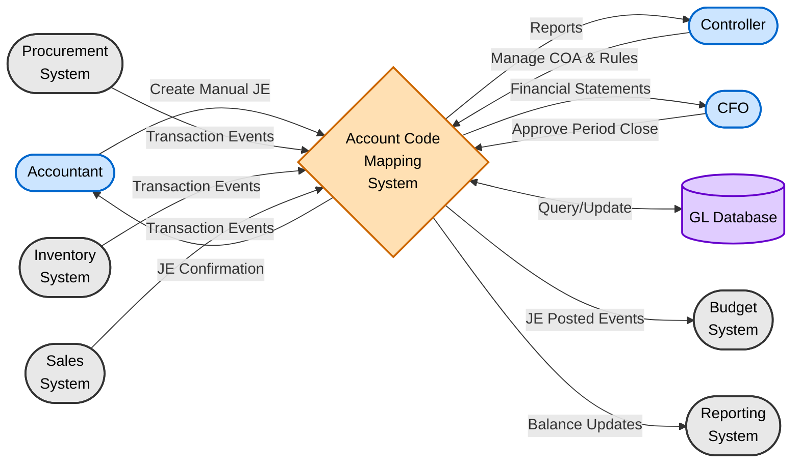

**External Entities**:
- **Accountant**: Create manual journal entries, reconcile accounts
- **Controller**: Manage COA structure, configure mapping rules, execute period close
- **CFO**: Approve period close, review financial statements
- **Procurement System**: Publishes GRN, invoice, payment events for auto-posting
- **Inventory System**: Publishes adjustment, transfer, count events for auto-posting
- **Sales System**: Publishes invoice, receipt events for auto-posting
- **Budget System**: Consumes JE events to update budget vs. actual
- **Reporting System**: Consumes balance updates for dashboards and analytics
- **GL Database**: Persistent storage for all financial data

---

### Level 1: System Decomposition

**Purpose**: Decompose Account Code Mapping system into major subsystems

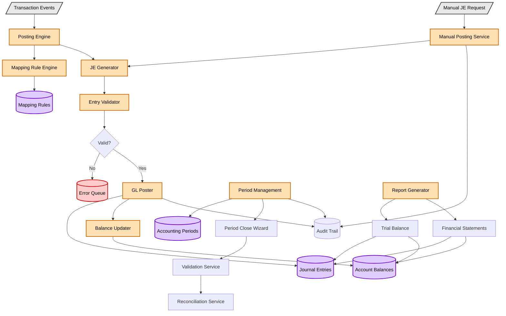

**Subsystem Descriptions**:

1. **Posting Engine**: Consumes operational transaction events, orchestrates auto-posting
2. **Mapping Rule Engine**: Evaluates mapping rules to determine account assignments
3. **JE Generator**: Constructs balanced journal entries with dimensions
4. **Entry Validator**: Validates entries against business rules before posting
5. **GL Poster**: Posts entries to database and updates account balances
6. **Balance Updater**: Maintains current account balances by dimension
7. **Period Management**: Controls period lifecycle and close process
8. **Validation Service**: Pre-close validation checks
9. **Reconciliation Service**: GL to sub-ledger reconciliation
10. **Report Generator**: Produces trial balance and financial statements

---

## Sequence Diagrams

### Sequence 1: Automated Posting from GRN

**Purpose**: Show component interactions for auto-posting a GRN transaction

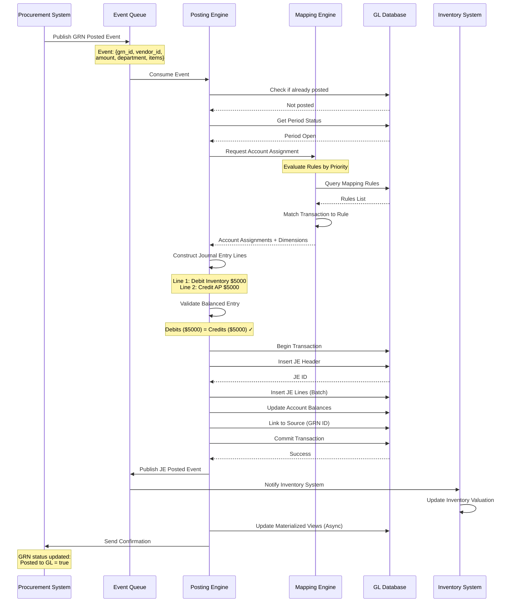

**Key Interactions**:
1. Procurement publishes GRN event to queue
2. Posting Engine consumes event and checks preconditions
3. Mapping Engine evaluates rules and returns account assignments
4. Posting Engine constructs and validates journal entry
5. Database transaction inserts entry and updates balances atomically
6. Event published for downstream systems (Inventory, Budget, Reporting)
7. Confirmation sent back to source system

---

### Sequence 2: Manual Journal Entry with Approval

**Purpose**: Show component interactions for manual JE requiring approval

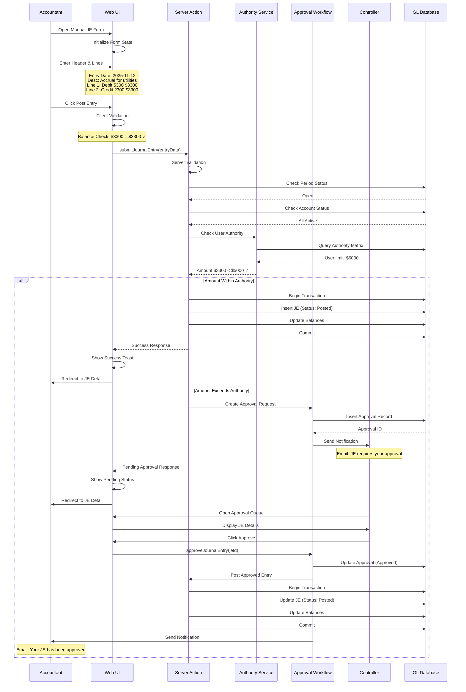

**Approval Decision Points**:
- **Within Authority**: Post immediately (status = Posted)
- **Exceeds Authority**: Create approval request (status = Pending Approval)
- **Approval Granted**: Update to Posted, post to GL
- **Approval Rejected**: Update to Rejected, notify accountant

---

## State Diagrams

### State 1: Journal Entry Status

**Purpose**: Show valid status transitions for journal entries

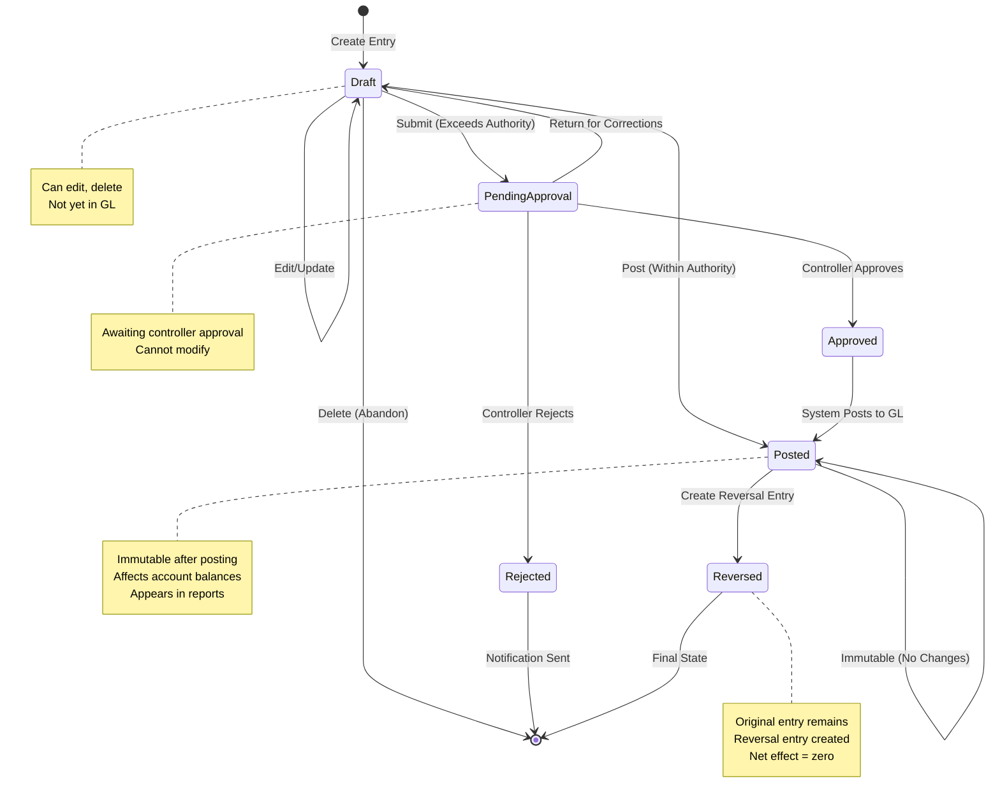

**Status Definitions**:
- **Draft**: Entry created but not submitted, can be edited or deleted
- **Pending Approval**: Submitted for approval, waiting for controller decision
- **Approved**: Controller approved, system will post to GL
- **Rejected**: Controller rejected, no GL impact
- **Posted**: Entry posted to GL, immutable, affects balances
- **Reversed**: Entry has been reversed by subsequent reversal entry

---

### State 2: Accounting Period Status

**Purpose**: Show valid status transitions for accounting periods

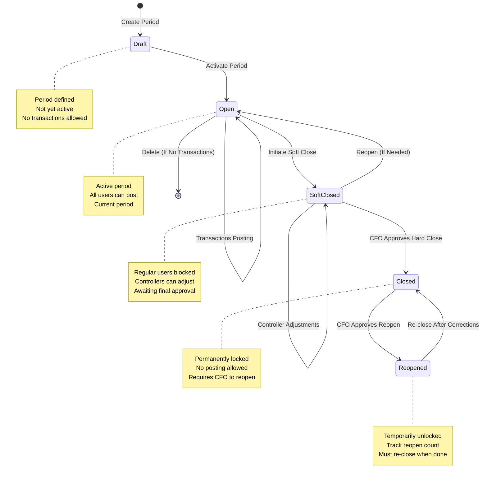

**Status Definitions**:
- **Draft**: Period created but not activated
- **Open**: Active period accepting all transactions
- **Soft Closed**: Preliminary close, only controllers can post
- **Closed**: Permanently closed, no posting allowed
- **Reopened**: Temporarily reopened for corrections, must re-close

---

## Integration Flows

### Integration 1: Procurement System Integration

**Purpose**: Show end-to-end flow from procurement transaction to GL posting

```mermaid
flowchart LR
    subgraph Procurement
        PR[Purchase Request] --> Approve1{Approved?}
        Approve1 -->|Yes| PO[Purchase Order]
        PO --> Send[Send to Vendor]
        Send --> Receive[Receive Goods]
        Receive --> GRN[Create GRN]
        GRN --> PostGRN[Post GRN]
    end

    subgraph Events
        PostGRN --> Event1[/Publish GRN Posted Event/]
    end

    subgraph Finance
        Event1 --> PE[Posting Engine]
        PE --> Map1[Map to Accounts]
        Map1 --> JE1[Generate JE]
        JE1 --> Line1[Debit: Inventory]
        JE1 --> Line2[Credit: AP]
        Line1 --> Post1[Post to GL]
        Line2 --> Post1
        Post1 --> Balance1[(Update Balances)]
    end

    subgraph Inventory
        Balance1 --> Event2[/JE Posted Event/]
        Event2 --> UpdateInv[Update Inventory Valuation]
    end

    subgraph Reporting
        Balance1 --> Event3[/Balance Update Event/]
        Event3 --> Dashboard[Update Dashboards]
    end

    style PR fill:#e8e8e8,stroke:#333,stroke-width:2px,color:#000
    style GRN fill:#ccffcc,stroke:#00cc00,stroke-width:2px,color:#000
    style Event1 fill:#ffe0b3,stroke:#cc6600,stroke-width:2px,color:#000
    style PE fill:#ffe0b3,stroke:#cc6600,stroke-width:2px,color:#000
    style Post1 fill:#ccffcc,stroke:#00cc00,stroke-width:2px,color:#000
    style Balance1 fill:#e0ccff,stroke:#6600cc,stroke-width:2px,color:#000
```

**Integration Points**:
1. **GRN Posted**: Procurement publishes event when GRN is posted
2. **Auto-Posting**: Finance consumes event and generates JE
3. **Inventory Update**: Inventory updates valuation from JE posted event
4. **Reporting**: Dashboards refresh from balance update events

---

### Integration 2: Inventory System Integration

**Purpose**: Show flow from inventory transaction to GL posting

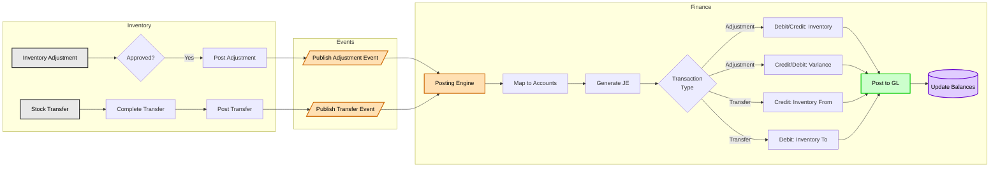

**Transaction Types**:
- **Adjustment**: Increase/decrease inventory with variance account
- **Transfer**: Move inventory between locations (same total value)
- **Count Variance**: Adjust to physical count results
- **Scrap/Wastage**: Reduce inventory with expense account

---

### Account Reconciliation Flow

**Purpose**: Reconcile GL account balance with sub-ledger total

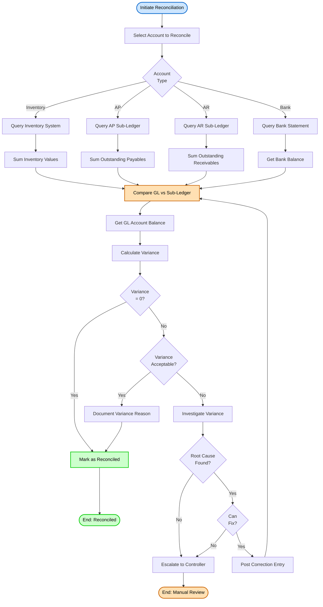

**Reconciliation Types**:
- **Inventory**: GL Inventory account vs. Inventory System total valuation
- **Accounts Payable**: GL AP account vs. Outstanding vendor invoices
- **Accounts Receivable**: GL AR account vs. Outstanding customer invoices
- **Bank**: GL Cash account vs. Bank statement balance
- **Variance Tolerance**: $100 or 0.5% of balance (whichever is smaller)

---

## Appendix

### Diagram Legend

**Shape Meanings**:
- **Rounded Rectangle**: Start/End points
- **Rectangle**: Process steps
- **Diamond**: Decision points
- **Parallelogram**: Input/Output
- **Cylinder**: Database storage
- **Cloud**: External systems

**Color Meanings**:
- **Light Blue** (#cce5ff): Start points, actors
- **Light Green** (#ccffcc): Success outcomes
- **Light Red** (#ffcccc): Error outcomes
- **Light Orange** (#ffe0b3): Warnings, processes
- **Light Purple** (#e0ccff): Database operations
- **Light Gray** (#e8e8e8): Standard processes

### Related Documents
- [Business Requirements](./BR-account-code-mapping.md)
- [Use Cases](./UC-account-code-mapping.md)
- [Technical Specification](./TS-account-code-mapping.md)
- [Data Schema](./DS-account-code-mapping.md)
- [Validations](./VAL-account-code-mapping.md)

---

**Document End**
