# Technical Specification: Account Code Mapping

## Module Information
- **Module**: Finance
- **Sub-Module**: Account Code Mapping
- **Route**: `/finance/account-code-mapping`
- **Version**: 1.0.0
- **Last Updated**: 2025-11-12
- **Owner**: Finance & Accounting Team
- **Status**: Draft

## Document History
| Version | Date | Author | Changes |
|---------|------|--------|---------|
| 1.1.0 | 2025-12-10 | Documentation Team | Standardized reference number format (XXX-YYMM-NNNN) |
| 1.0.0 | 2025-11-12 | Documentation Team | Initial version |

---

## Overview

The Account Code Mapping module implements an event-driven financial posting engine that automatically generates journal entries from operational transactions. The architecture follows a microservices pattern with the Posting Engine as the core service, consuming events from operational modules (Procurement, Inventory, Sales) via message queues and producing journal entries through a sophisticated mapping rule engine.

The technical implementation emphasizes accuracy through double-entry bookkeeping enforcement, auditability through immutable journal entries with hash chains, and performance through asynchronous processing with guaranteed delivery. Security is enforced through role-based access control, approval workflows for sensitive operations, and complete audit trails.

**⚠️ IMPORTANT: This is a Technical Specification Document - TEXT FORMAT ONLY**

**Related Documents**:
- [Business Requirements](./BR-account-code-mapping.md)
- [Use Cases](./UC-account-code-mapping.md)
- [Data Schema](./DS-account-code-mapping.md)
- [Flow Diagrams](./FD-account-code-mapping.md)
- [Validations](./VAL-account-code-mapping.md)

---

## Architecture

### High-Level Architecture

```
┌─────────────────────────────────────────────────────────────────┐
│                      Client Layer (Browser)                      │
│  ┌────────────┐  ┌────────────┐  ┌────────────┐  ┌──────────┐ │
│  │    COA     │  │  Mapping   │  │  Journal   │  │  Period  │ │
│  │ Management │  │   Rules    │  │  Entries   │  │  Close   │ │
│  └────────────┘  └────────────┘  └────────────┘  └──────────┘ │
└────────────┬─────────────────────────────────────────────────────┘
             │ HTTPS / Server Actions
             ▼
┌─────────────────────────────────────────────────────────────────┐
│              Application Layer (Next.js Server)                  │
│  ┌──────────────────────────────────────────────────────────┐  │
│  │                    Server Actions                        │  │
│  │  - createAccount      - createMappingRule                │  │
│  │  - postJournalEntry   - closePeriod                      │  │
│  │  - updateCOA          - reconcileAccount                 │  │
│  └──────────────────────────────────────────────────────────┘  │
│           │                    │                    │            │
│           ▼                    ▼                    ▼            │
│  ┌──────────────────────────────────────────────────────────┐  │
│  │              Business Logic Services                      │  │
│  │  - Posting Engine Service   - Mapping Rule Engine        │  │
│  │  - Period Close Service     - Reconciliation Service     │  │
│  │  - Authority Service        - Multi-Currency Service     │  │
│  └──────────────────────────────────────────────────────────┘  │
└────────────┬─────────────────────────────────────────────────────┘
             │ Event Queue (RabbitMQ / Redis Streams)
             ▼
┌─────────────────────────────────────────────────────────────────┐
│                         Data Layer                               │
│                  (PostgreSQL via Supabase)                       │
│  ┌──────────────────────────────────────────────────────────┐  │
│  │                     Core Tables                           │  │
│  │  - chart_of_accounts        - gl_accounts                │  │
│  │  - mapping_rules            - journal_entries            │  │
│  │  - journal_entry_lines      - accounting_periods         │  │
│  │  - account_dimensions       - reconciliations            │  │
│  └──────────────────────────────────────────────────────────┘  │
│  ┌──────────────┐  ┌──────────────┐  ┌──────────────┐         │
│  │  Functions   │  │  Triggers    │  │ Materialized │         │
│  │  & Procedures│  │              │  │    Views     │         │
│  └──────────────┘  └──────────────┘  └──────────────┘         │
└────────────┬─────────────────────────────────────────────────────┘
             │
             ▼
┌─────────────────────────────────────────────────────────────────┐
│                  External Integrations                           │
│  ┌──────────────┐  ┌──────────────┐  ┌──────────────┐         │
│  │ Procurement  │  │  Inventory   │  │    Sales     │         │
│  │   System     │  │   System     │  │   System     │         │
│  └──────────────┘  └──────────────┘  └──────────────┘         │
│  ┌──────────────┐  ┌──────────────┐  ┌──────────────┐         │
│  │   Budget     │  │    Payroll   │  │    Fixed     │         │
│  │   System     │  │   System     │  │    Assets    │         │
│  └──────────────┘  └──────────────┘  └──────────────┘         │
└─────────────────────────────────────────────────────────────────┘
```

### Component Architecture

**Frontend Layer**
- **Page Components**: Server Components for COA management, mapping rules, journal entry forms, period close wizard
- **UI Components**: Client Components for interactive account selection, rule configuration, dimension assignment
- **State Management**: Zustand for form state and UI preferences, React Query for financial data with strict caching
- **Form Handling**: React Hook Form with Zod for journal entry validation, balanced entry enforcement

**Backend Layer - Posting Engine**
- **Event Consumer**: Subscribes to operational transaction events (GRN posted, invoice created, payment made)
- **Mapping Rule Engine**: Evaluates transaction against mapping rules, returns account assignments with dimensions
- **Journal Entry Generator**: Constructs balanced journal entries with automatic tax and currency handling
- **Batch Processor**: Processes multiple transactions in parallel (1000+ per minute throughput)
- **Error Handler**: Manages unmapped transactions, validation failures, and posting conflicts

**Backend Layer - Period Management**
- **Period Close Service**: Orchestrates multi-phase period close with validation gates
- **Reconciliation Service**: Compares GL balances with sub-ledger totals, identifies variances
- **Depreciation Service**: Calculates and posts monthly depreciation entries
- **Accrual Service**: Generates and posts accrual and reversal entries

**Data Layer**
- **PostgreSQL Database**: ACID transactions for financial data integrity
- **Immutable Journal Entries**: Append-only tables, reversals instead of updates
- **Stored Functions**: Complex period close logic, multi-currency calculations, SLA tracking
- **Materialized Views**: Pre-aggregated trial balance, account balances by dimension
- **Audit Tables**: Complete change history with 7-year retention

---

## Technology Stack

### Frontend
- **Framework**: Next.js 14.2+ (App Router)
- **UI Library**: React 18.2+
- **Styling**: Tailwind CSS 3.4+, Shadcn/ui
- **State Management**: Zustand 4.4+ (UI), React Query 5.17+ (server state)
- **Form Handling**: React Hook Form 7.48+, Zod 3.22+
- **Icons**: Lucide React 0.263+
- **Date Handling**: date-fns 3.0+
- **Charting**: Recharts 2.10+ (financial reports)

### Backend
- **Runtime**: Node.js 20.14.0+
- **Framework**: Next.js 14.2+ Server Actions
- **Database**: PostgreSQL 14+ (Supabase)
- **ORM**: Prisma 5.8+
- **Message Queue**: Redis 7+ (Bull queues for event processing)
- **Authentication**: Supabase Auth with RLS
- **File Storage**: Supabase Storage (supporting documents)
- **Background Jobs**: Vercel Cron (depreciation, SLA monitoring)

### Testing
- **Unit Tests**: Vitest 1.0+
- **Integration Tests**: Vitest with test database
- **E2E Tests**: Playwright 1.40+

### DevOps
- **Version Control**: Git with GitHub
- **CI/CD**: GitHub Actions
- **Hosting**: Vercel
- **Monitoring**: Sentry (errors), Vercel Analytics (performance)

---

## Component Structure

### Directory Structure

```
app/(main)/finance/account-code-mapping/
├── page.tsx                          # COA list page
├── coa/
│   ├── page.tsx                      # COA management
│   ├── [id]/page.tsx                 # Account detail
│   ├── new/page.tsx                  # Create account
│   └── structure/page.tsx            # COA structure view
├── mapping-rules/
│   ├── page.tsx                      # Mapping rules list
│   ├── [id]/page.tsx                 # Rule detail
│   └── new/page.tsx                  # Create rule
├── journal-entries/
│   ├── page.tsx                      # Journal entries list
│   ├── [id]/page.tsx                 # Entry detail
│   └── new/page.tsx                  # Manual JE form
├── periods/
│   ├── page.tsx                      # Period management
│   └── close/page.tsx                # Period close wizard
├── reconciliation/
│   └── page.tsx                      # Reconciliation dashboard
├── components/
│   ├── COATree.tsx                   # Hierarchical COA view
│   ├── AccountSelector.tsx           # Account picker with search
│   ├── MappingRuleForm.tsx           # Rule configuration form
│   ├── MappingRuleTest.tsx           # Test rule against transactions
│   ├── JournalEntryForm.tsx          # Manual JE form
│   ├── JournalEntryLines.tsx         # JE line items with balance check
│   ├── DimensionPicker.tsx           # Dimension assignment
│   ├── PeriodCloseWizard.tsx         # Multi-step period close
│   ├── ReconciliationPanel.tsx       # Reconciliation interface
│   ├── TrialBalance.tsx              # Trial balance report
│   ├── AccountBalances.tsx           # Account balances by dimension
│   └── UnmappedTransactions.tsx      # Unmapped transaction queue
├── types.ts                          # Finance type definitions
├── actions.ts                        # Server Actions
├── hooks/
│   ├── useAccounts.ts                # Account data fetching
│   ├── useMappingRules.ts            # Mapping rules management
│   ├── useJournalEntries.ts          # JE data and posting
│   ├── usePeriods.ts                 # Period management
│   └── useReconciliation.ts          # Reconciliation operations
└── lib/
    ├── posting-engine.ts             # Core posting logic
    ├── mapping-engine.ts             # Rule evaluation engine
    ├── period-service.ts             # Period close logic
    ├── reconciliation-service.ts     # Reconciliation logic
    ├── multi-currency.ts             # Currency handling
    └── dimension-service.ts          # Dimension management
```

### Key Components

#### COA Management Page
**File**: `coa/page.tsx` (Server Component)
**Purpose**: Manage Chart of Accounts structure
**Responsibilities**: Display hierarchical COA tree, support drag-drop reordering, inline editing of accounts, bulk import/export

#### Mapping Rule Form
**File**: `MappingRuleForm.tsx` (Client Component)
**Purpose**: Configure transaction mapping rules
**Responsibilities**:
- Define matching criteria (transaction type, document type, category, department, location)
- Configure GL accounts (debit, credit, tax accounts)
- Assign dimensions (department, location, cost center, project)
- Define priority and conditional logic
- Test rule against historical transactions

#### Journal Entry Form
**File**: `JournalEntryForm.tsx` (Client Component)
**Purpose**: Create manual journal entries
**Responsibilities**:
- Add/remove journal entry lines dynamically
- Real-time balance calculation (debits must equal credits)
- Account selection with auto-complete and recent accounts
- Dimension assignment per line
- Attachment upload (supporting documents)
- Draft saving with auto-save every 30 seconds
- Approval routing for entries exceeding user authority

#### Period Close Wizard
**File**: `PeriodCloseWizard.tsx` (Client Component)
**Purpose**: Guide accountants through period close process
**Responsibilities**:
- Phase 1: Pre-close validation (check all documents posted, reconciliations complete)
- Phase 2: Generate reports (trial balance, P&L, balance sheet)
- Phase 3: Post adjusting entries (depreciation, accruals)
- Phase 4: Soft close (allow corrections)
- Phase 5: Hard close (lock period permanently)
- Progress tracking with checkpoint saving

---

## Sitemap

### Page Hierarchy

```mermaid
graph TD
    A['Finance Module'] --> B['COA Management']
    A --> C['Mapping Rules']
    A --> D['Journal Entries']
    A --> E['Period Management']
    A --> F['Reconciliation']

    B --> B1['COA List']
    B --> B2['Account Detail']
    B --> B3['Create Account']
    B --> B4['COA Structure View']

    C --> C1['Rules List']
    C --> C2['Rule Detail']
    C --> C3['Create Rule']
    C --> C4['Test Rule']

    D --> D1['Entries List']
    D --> D2['Entry Detail']
    D --> D3['Manual Entry Form']
    D --> D4['Unmapped Queue']

    E --> E1['Period List']
    E --> E2['Close Wizard']
    E --> E3['Reopen Request']

    F --> F1['Recon Dashboard']
    F --> F2['Account Recon']
    F --> F3['Variance Analysis']
```



---

## Data Flow

### Automated Journal Entry Generation

```
Operational Transaction Posted
    ↓
Event Published to Queue
    ↓
Posting Engine Consumes Event
    ↓
Retrieve Transaction Details (document, line items, dimensions)
    ↓
Call Mapping Rule Engine
    ↓
Evaluate Rules by Priority (specific to general)
    ↓
Return Account Assignments + Dimensions
    ↓
Construct Journal Entry Lines
    ↓
Calculate Tax Lines (if applicable)
    ↓
Multi-Currency Conversion (if foreign currency)
    ↓
Validate Balanced Entry (debits = credits)
    ↓
Check Period Status (open vs closed)
    ↓
Optimistic Locking Check (concurrent posting)
    ↓
Begin Database Transaction
    ↓
Insert Journal Entry Header
    ↓
Insert Journal Entry Lines
    ↓
Update Account Balances (atomic)
    ↓
Link to Source Transaction
    ↓
Commit Transaction
    ↓
Publish "JE Posted" Event
    ↓
Update Materialized Views (async)
    ↓
Send Notifications (if configured)
```

### Manual Journal Entry Posting

```
User Completes JE Form
    ↓
Client-Side Validation (Zod schema, balanced check)
    ↓
Submit to Server Action
    ↓
Server-Side Validation (re-validate all rules)
    ↓
Authority Check (amount vs user limit)
    ↓
If exceeds authority → Approval Routing
    ↓
If within authority → Direct Posting
    ↓
Database Transaction (same as automated)
    ↓
Success Response with JE ID
    ↓
Redirect to Entry Detail Page
```

### Period Close Process

```
User Initiates Period Close
    ↓
Phase 1: Pre-Close Validation
    ├─ All operational documents posted ✓
    ├─ Bank reconciliations complete ✓
    ├─ Inventory reconciliation complete ✓
    ├─ AP/AR reconciliations complete ✓
    └─ No unmapped transactions ✓
    ↓
Phase 2: Generate Pre-Close Reports
    ├─ Trial Balance (debits = credits check)
    ├─ P&L Statement
    ├─ Balance Sheet
    ├─ Cash Flow Statement
    └─ Variance Analysis
    ↓
Phase 3: Post Adjusting Entries
    ├─ Depreciation (automated)
    ├─ Accruals (automated + manual)
    ├─ Prepayment adjustments
    └─ Reclassifications
    ↓
Phase 4: Soft Close
    ├─ Set period status = "Soft Closed"
    ├─ Prevent regular user posting
    ├─ Allow controller corrections
    └─ Management review checkpoint
    ↓
Phase 5: Hard Close
    ├─ Final approval (CFO/Controller)
    ├─ Set period status = "Closed"
    ├─ Prevent all posting
    ├─ Update current period
    ├─ Archive reports
    └─ Send completion notifications
```

---

## Server Actions

### Chart of Accounts Actions

#### createAccount
**Purpose**: Create new GL account
**Input**: Account code, name, type, parent account, dimensions
**Validation**: Code uniqueness, parent exists, valid account type
**Returns**: Created account with full hierarchy path

#### updateAccount
**Purpose**: Update account details
**Input**: Account ID, updated fields
**Validation**: Cannot change account type if has transactions, cannot create circular hierarchy
**Returns**: Updated account

#### deactivateAccount
**Purpose**: Deactivate account (soft delete)
**Input**: Account ID, effective date
**Validation**: No open transactions after effective date, has alternative account for redirection
**Returns**: Success confirmation

### Mapping Rule Actions

#### createMappingRule
**Purpose**: Create transaction mapping rule
**Input**: Rule name, priority, criteria, account assignments, dimensions
**Validation**: Priority unique, accounts exist and active, dimension configuration valid
**Returns**: Created rule with generated ID

#### testMappingRule
**Purpose**: Test rule against historical transactions
**Input**: Rule ID or rule definition, date range
**Process**: Query transactions matching criteria, apply rule logic, return sample mapped results
**Returns**: Array of sample transactions with proposed account assignments

#### evaluateMappingRules
**Purpose**: Find matching rule for transaction
**Input**: Transaction data (type, document type, category, department, location, amount)
**Process**: Query rules ordered by priority, evaluate criteria in sequence, return first match
**Returns**: Account assignments with dimensions

### Journal Entry Actions

#### createManualJournalEntry
**Purpose**: Post manual journal entry
**Input**: Entry date, description, lines (account, amount, debit/credit, dimensions), attachments
**Validation**: Balanced entry, open period, active accounts, authority check
**Process**: If exceeds authority → route for approval, otherwise post immediately
**Returns**: Journal entry ID, status (posted or pending approval)

#### autoGenerateJournalEntry
**Purpose**: Generate JE from operational transaction
**Input**: Transaction event (document ID, type, amount, details)
**Process**: Call mapping engine, construct JE, validate, post
**Returns**: Journal entry ID or error with unmapped transaction queue ID

#### reverseJournalEntry
**Purpose**: Create reversal entry
**Input**: Original entry ID, reversal date, reason
**Validation**: Original entry exists and posted, reversal date >= original date, reversal date in open period
**Process**: Create mirror entry with opposite debit/credit, link to original
**Returns**: Reversal entry ID

### Period Management Actions

#### closePeriod
**Purpose**: Execute period close process
**Input**: Period ID, phase (validation, soft close, hard close)
**Validation**: All validation checks pass for phase advancement
**Process**: Execute phase-specific operations, update period status, log checkpoint
**Returns**: Phase completion status, validation results, next phase requirements

#### reopenPeriod
**Purpose**: Reopen closed period (requires approval)
**Input**: Period ID, reason, requested by user
**Validation**: Requires CFO approval, period was closed, no subsequent periods closed
**Process**: Create reopen request, route for approval, log audit trail
**Returns**: Request ID, approval status

### Reconciliation Actions

#### reconcileAccount
**Purpose**: Reconcile GL account with sub-ledger
**Input**: Account ID, period, sub-ledger type (inventory/AP/AR/bank)
**Process**: Compare GL balance with sub-ledger total, identify variances, generate variance report
**Returns**: Reconciliation record with variance details

---

## Database Schema Overview

**NOTE**: Detailed database definitions are in the [Data Schema (DS) document](./DS-account-code-mapping.md).

### Core Tables

#### chart_of_accounts
**Purpose**: Chart of Accounts configurations
**Key Fields**: COA ID, name, accounting standard, structure config, active status

#### gl_accounts
**Purpose**: General Ledger accounts
**Key Fields**: Account code, name, type, parent account, balance tracking, active status

#### mapping_rules
**Purpose**: Transaction-to-account mapping rules
**Key Fields**: Priority, criteria (JSON), account assignments, dimension mappings, active status

#### journal_entries
**Purpose**: Journal entry headers
**Key Fields**: Entry number, date, period, description, source type, status, total amount

#### journal_entry_lines
**Purpose**: Journal entry line items
**Key Fields**: Entry ID, line number, account, debit/credit amount, dimensions, description

#### accounting_periods
**Purpose**: Fiscal periods
**Key Fields**: Period code, start/end dates, status (open/soft closed/closed), fiscal year

#### account_balances
**Purpose**: Current account balances by dimension
**Key Fields**: Account, period, dimensions, debit/credit balance, balance date

### Materialized Views

#### mv_trial_balance
**Purpose**: Pre-calculated trial balance
**Refresh**: After each posting batch (every 5 minutes)
**Contents**: Account code, name, type, debit total, credit total, net balance

#### mv_account_balances_by_dimension
**Purpose**: Account balances grouped by dimension combinations
**Refresh**: Daily at midnight, on-demand for reports
**Contents**: Account, dimension values, period, balance

### Stored Functions

#### fn_post_journal_entry
**Purpose**: Atomic journal entry posting
**Parameters**: Entry data, line items
**Returns**: Entry ID or error
**Logic**: Validate balanced, insert header and lines, update balances, all in transaction

#### fn_calculate_account_balance
**Purpose**: Calculate account balance for period
**Parameters**: Account ID, period, dimension filters
**Returns**: Balance amount
**Logic**: Sum all entry lines for account in period range, apply dimension filters

#### fn_evaluate_mapping_rule
**Purpose**: Evaluate transaction against rule
**Parameters**: Transaction data, rule ID
**Returns**: Boolean (matches/doesn't match)
**Logic**: Check each criterion in rule definition against transaction attributes

---

## State Management

### Global State (Zustand)

**Purpose**: UI state shared across finance components
**State Properties**:
- selected account (for filtering JEs)
- selected period (for report generation)
- dimension filters (department, location, cost center, project)
- UI preferences (tree view vs list view, show inactive accounts)

### Server State (React Query)

**Query Keys Structure**:
- `['accounts']` - All accounts
- `['accounts', accountId]` - Single account
- `['accounts', 'active']` - Active accounts only
- `['mapping-rules', { priority }]` - Rules by priority
- `['journal-entries', { period, status }]` - Entries filtered
- `['periods', { fiscalYear }]` - Periods by year
- `['trial-balance', { period }]` - Trial balance report

**Cache Strategy**:
- COA: Cache for 1 hour (rarely changes)
- Mapping Rules: Cache for 30 minutes
- Journal Entries: Cache for 5 minutes with background refetch
- Reports: Cache for 15 minutes
- Balances: Cache for 10 minutes

**Invalidation Strategy**:
- On account create/update: Invalidate `['accounts']`
- On JE post: Invalidate `['journal-entries']`, `['trial-balance']`, `['account-balances']`
- On period close: Invalidate all financial queries
- On mapping rule change: Invalidate `['mapping-rules']`

---

## Security Implementation

### Authentication
- Supabase Auth with JWT tokens
- Session timeout: 8 hours with activity extension
- Multi-factor authentication required for period close and large entries

### Authorization

**Role-Based Access Control**:
- **Accountant**: View all, post JEs within authority ($10,000)
- **Senior Accountant**: Post JEs within authority ($50,000), manage mapping rules
- **Controller**: Post JEs within authority ($250,000), soft close periods, reopen periods
- **CFO**: Unlimited JE authority, hard close periods, approve COA changes
- **Auditor**: Read-only access to all, export reports

**Approval Workflows**:
- Manual JEs exceeding user authority route to next level
- Mapping rule changes require controller approval
- Period reopen requires CFO approval
- COA structural changes require CFO approval

### Data Protection
- Input validation on all Server Actions (Zod schemas)
- SQL injection prevention through Prisma ORM
- XSS protection through React's automatic escaping
- CSRF protection via Next.js built-in tokens

### Audit Logging

**All operations logged**:
- Entity type and ID
- Action type (CREATE, UPDATE, POST, CLOSE, REVERSE)
- User ID and IP address
- Before/after values (for updates)
- Timestamp with timezone

**Audit Table**: `audit_logs` (append-only, 7-year retention)

**Immutability Enforcement**:
- Journal entries are immutable after posting (reversals instead of edits)
- Audit logs are append-only with database-level restrictions
- Hash chain for journal entries (each entry references previous entry hash)

---

## Error Handling

### Client-Side Error Handling

**Validation Errors**: Display field-specific messages inline, highlight invalid fields, disable submit until resolved

**Balance Errors**: For journal entries, show real-time balance calculation, highlight imbalance amount, suggest corrections

**Navigation Errors**: Redirect to login on auth errors, show access denied for authorization errors, provide back button

**Network Errors**: Show retry option, preserve form data in local storage, restore on reconnect

### Server-Side Error Handling

**Posting Errors**: Rollback entire transaction, log error details, create unmapped transaction record for review

**Period Closed Errors**: Prevent posting, show clear message with period status, suggest opening next period

**Concurrent Posting Errors**: Detect optimistic locking conflicts, retry with exponential backoff (3 attempts)

**Integration Errors**: Queue for retry, send alert to finance team, log failure details

---

## Performance Optimization

### Frontend Optimization
- **Code Splitting**: Dynamic imports for report components, wizard steps
- **Memoization**: useMemo for trial balance calculations, account tree building
- **Debouncing**: Account search with 300ms delay
- **Virtual Scrolling**: For long JE line lists (>100 lines)

### Backend Optimization
- **Database Indexing**: Composite indexes on (account_id, period, posting_date)
- **Materialized Views**: Pre-calculate trial balance, account balances
- **Query Optimization**: Use Prisma select to fetch only needed fields
- **Batch Processing**: Process events in batches of 100
- **Connection Pooling**: Maintain 20-connection pool to database

### Posting Engine Performance
- **Target**: 1000 transactions per minute
- **Parallel Processing**: 10 worker threads
- **Queue Management**: Separate queues by priority (urgent, normal, low)
- **Error Isolation**: Failed transactions don't block others
- **Monitoring**: Track processing rate, queue depth, error rate

---

## Testing Strategy

### Unit Tests
**Coverage Target**: >85%
**Focus**:
- Mapping rule evaluation logic
- Journal entry balance validation
- Multi-currency calculations
- Dimension assignment logic
- Authority checks

### Integration Tests
**Coverage Target**: >75%
**Focus**:
- Complete posting workflow (event → JE → balance update)
- Period close process (all phases)
- Reconciliation process
- Approval routing

### E2E Tests
**Framework**: Playwright
**Critical Paths**:
- Create account and post first JE
- Configure mapping rule and verify auto-posting
- Post manual JE with multiple lines
- Execute complete period close
- Generate financial reports

---

## Deployment Configuration

### Environment Variables

```env
# Database
DATABASE_URL="postgresql://..."
DIRECT_URL="postgresql://..."

# Queue
REDIS_URL="redis://..."

# Authentication
NEXTAUTH_SECRET="..."
NEXTAUTH_URL="..."

# Feature Flags
ENABLE_AUTO_POSTING="true"
ENABLE_MULTI_CURRENCY="true"
POSTING_BATCH_SIZE="100"
```

### Database Migrations

Migrations managed through Prisma:
- Sequential numbered migrations
- Automated rollback on failure
- Test migrations in staging first

---

## Monitoring and Logging

### Application Logging
**Log Levels**:
- Info: Successful posting, period close completion
- Warning: Unmapped transactions, variance detected
- Error: Posting failures, validation errors, integration failures

**Log Aggregation**: Centralized logging to LogTail with structured JSON

### Performance Monitoring
- **Posting Engine**: Track throughput (TPS), error rate, queue depth
- **API Response Times**: Target <500ms for GET, <2s for POST
- **Database Queries**: Log slow queries (>1s)
- **Reports**: Track generation time, cache hit rate

### Alerts
- **Critical**: Posting engine down, database connection lost, period close failed
- **Warning**: Queue depth >1000, error rate >5%, slow queries detected
- **Info**: Period closed successfully, daily reconciliation complete

---

## Technical Debt

| Item | Priority | Effort | Notes |
|------|----------|--------|-------|
| Implement Redis caching for account balances | High | Medium | Reduce database load for balance queries |
| Add GraphQL API for external integrations | Medium | Large | Alternative to event queue for real-time integrations |
| Implement machine learning for rule suggestions | Low | Large | Suggest mapping rules based on historical patterns |
| Optimize trial balance materialized view refresh | Medium | Small | Incremental refresh instead of full rebuild |

---

## Appendix

### Related Documents
- [Business Requirements](./BR-account-code-mapping.md)
- [Use Cases](./UC-account-code-mapping.md)
- [Data Schema](./DS-account-code-mapping.md)
- [Flow Diagrams](./FD-account-code-mapping.md)
- [Validations](./VAL-account-code-mapping.md)

### Useful Commands

```bash
# Development
npm run dev

# Testing
npm run test
npm run test:integration

# Database
npx prisma migrate dev
npx prisma studio

# Queue Processing
npm run worker:start

# Reports
npm run generate-trial-balance
npm run period-close-validation
```

---

**Document End**
