# Flow Diagrams: Currency Management

## Module Information
- **Module**: Finance
- **Sub-Module**: Currency Management
- **Version**: 1.0.0
- **Last Updated**: 2025-11-12
- **Owner**: Finance & Treasury Team
- **Status**: Draft

## Document History
| Version | Date | Author | Changes |
|---------|------|--------|---------|
| 1.1.0 | 2025-12-10 | Documentation Team | Standardized reference number format (XXX-YYMM-NNNN) |
| 1.0.0 | 2025-11-12 | Documentation Team | Initial version |

---

## Overview

This document provides comprehensive visual representations of the Currency Management module's workflows, data flows, and integrations. The diagrams cover the complete multi-currency lifecycle from currency master setup through exchange rate management, foreign currency transaction processing, period-end revaluation, and IAS 21 compliance. These flows support the business objectives of automated multi-currency support, accurate exchange gain/loss calculation, and comprehensive currency risk management.

**Related Documents**:
- [Business Requirements](./BR-currency-management.md)
- [Use Cases](./UC-currency-management.md)
- [Technical Specification](./TS-currency-management.md)
- [Data Schema](./DS-currency-management.md)
- [Validations](./VAL-currency-management.md)

---

## Diagram Index

| Diagram | Type | Purpose | Complexity |
|---------|------|---------|------------|
| [High-Level Process Flow](#high-level-multi-currency-process-flow) | Process | Complete multi-currency lifecycle | Medium |
| [Exchange Rate Retrieval](#automatic-exchange-rate-retrieval-flow) | Process | Auto-retrieve rates from providers | High |
| [Manual Rate Entry](#manual-exchange-rate-entry-flow) | Process | Manual rate entry with approval | Medium |
| [Foreign Transaction Posting](#foreign-currency-transaction-posting-flow) | Process | Post foreign currency transactions | High |
| [Realized G/L Calculation](#realized-exchange-gain-loss-flow) | Process | Calculate and post realized gain/loss | High |
| [Period-End Revaluation](#period-end-currency-revaluation-flow) | Process | Period-end revaluation (7-phase wizard) | Complex |
| [Automatic Reversal](#automatic-reversal-posting-flow) | Process | Auto-reverse unrealized G/L | Medium |
| [Data Flow Diagram](#data-flow-diagram) | Data | Data movement through system | Medium |
| [Sequence Diagrams](#sequence-diagrams) | Interaction | Component interactions | High |
| [State Diagrams](#state-diagrams) | State | Status transitions | Medium |
| [Integration Flows](#integration-flows) | Integration | External system interactions | High |
| [Currency Conversion](#currency-conversion-flow) | Process | Real-time currency conversion | Low |

---

## Process Flows

### High-Level Multi-Currency Process Flow

**Purpose**: End-to-end multi-currency management from setup through reporting

**Actors**: CFO, Treasury Manager, Accountant, Exchange Rate Service, Currency Conversion Engine

**Trigger**: Organization setup or multi-currency operations

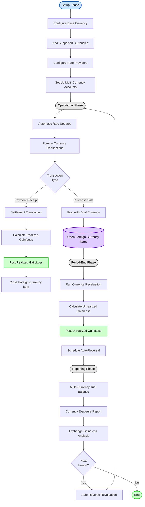

**Flow Steps**:

1. **Setup Phase**: Initial multi-currency configuration
   - Configure organization base currency (USD, SGD, etc.)
   - Add supported currencies (GBP, EUR, JPY, etc.)
   - Configure external rate providers (Bank of England, ECB)
   - Set up multi-currency bank accounts

2. **Operational Phase**: Day-to-day foreign currency operations
   - Automatic exchange rate updates (hourly/daily)
   - Post foreign currency transactions with dual currency recording
   - Settlement transactions calculate and post realized gain/loss
   - Open foreign currency items tracked for revaluation

3. **Period-End Phase**: Month-end revaluation process
   - Run currency revaluation for open balances
   - Calculate unrealized gain/loss on monetary items
   - Post unrealized gain/loss to GL
   - Schedule automatic reversal for next period

4. **Reporting Phase**: Financial reporting and next period
   - Generate multi-currency trial balance
   - Produce currency exposure reports
   - Analyze exchange gain/loss by currency
   - Auto-reverse revaluation at next period start

---

### Automatic Exchange Rate Retrieval Flow

**Purpose**: Automatically retrieve and validate exchange rates from external providers

**Actors**: Exchange Rate Service, Currency Providers (Bank of England, ECB, etc.), Redis Cache

**Trigger**: Scheduled job (hourly) or manual refresh request

```mermaid
flowchart TD
    Start([Scheduled Trigger:<br>Hourly Cron Job]) --> GetActive[Get Active Currencies]
    GetActive --> BuildPairs[Build Currency Pairs List]
    BuildPairs --> Pairs[/GBP/USD, EUR/USD, JPY/USD.../]

    Pairs --> LoopStart{For Each<br>Currency Pair}
    LoopStart --> GetProvider[Get Primary Provider]
    GetProvider --> Provider[/Bank of England API/]

    Provider --> CallAPI[HTTP GET Request]
    CallAPI --> CheckResponse{Response<br>OK?}

    CheckResponse -->|No| CheckFailure{Consecutive<br>Failures > 3?}
    CheckFailure -->|Yes| Failover[Switch to Backup Provider]
    Failover --> GetProvider
    CheckFailure -->|No| CacheCheck{Cached Rate<br>Available?}
    CacheCheck -->|Yes| UseCache[Use Cached Rate]
    UseCache --> FlagStale[Flag as Stale]
    FlagStale --> Continue1[Continue]
    CacheCheck -->|No| Alert1[/Alert: No Rate Available/]
    Alert1 --> Continue1

    CheckResponse -->|Yes| ParseJSON[Parse JSON Response]
    ParseJSON --> ExtractRate[Extract Exchange Rate]
    ExtractRate --> Rate[/1.27500000/]

    Rate --> Validate[Validate Rate]
    Validate --> CheckBounds{Rate Within<br>Bounds?}
    CheckBounds -->|No| Alert2[/Alert: Rate Out of Bounds/]
    Alert2 --> Continue1

    CheckBounds -->|Yes| CheckVariance{Variance from<br>Previous > 10%?}
    CheckVariance -->|Yes| FlagReview[Flag for Review]
    FlagReview --> Continue2[Continue]
    CheckVariance -->|No| Continue2

    Continue2 --> CheckApproval{Variance<br>> 5%?}
    CheckApproval -->|Yes| SetApproval[Set Requires_Approval = true]
    SetApproval --> Continue3[Continue]
    CheckApproval -->|No| Continue3

    Continue3 --> CalcInverse[Calculate Inverse Rate]
    CalcInverse --> BeginTx[Begin Database Transaction]
    BeginTx --> MarkOld[Mark Current Rate as Not Current]
    MarkOld --> Archive[Copy to Exchange_Rate_History]
    Archive --> InsertNew[Insert New Exchange Rate]
    InsertNew --> UpdateMeta[Update Provider Metadata]
    UpdateMeta --> Commit[Commit Transaction]

    Commit --> UpdateCache[Update Redis Cache]
    UpdateCache --> SetTTL[Set TTL = 1 Hour]
    SetTTL --> PublishEvent[/Publish RateUpdated Event/]
    PublishEvent --> LogSuccess[Log Successful Update]

    LogSuccess --> LoopEnd{More<br>Pairs?}
    LoopEnd -->|Yes| LoopStart
    LoopEnd -->|No| Summary[Generate Update Summary]
    Summary --> Metrics[Update Success Metrics]
    Metrics --> Success([End: Success])

    Continue1 --> LoopEnd

    style Start fill:#cce5ff,stroke:#0066cc,stroke-width:2px,color:#000
    style Success fill:#ccffcc,stroke:#00cc00,stroke-width:2px,color:#000
    style Alert1 fill:#ffcccc,stroke:#cc0000,stroke-width:2px,color:#000
    style Alert2 fill:#ffcccc,stroke:#cc0000,stroke-width:2px,color:#000
    style FlagStale fill:#ffe0b3,stroke:#cc6600,stroke-width:2px,color:#000
    style FlagReview fill:#ffe0b3,stroke:#cc6600,stroke-width:2px,color:#000
    style BeginTx fill:#e0ccff,stroke:#6600cc,stroke-width:2px,color:#000
    style UpdateCache fill:#e0ccff,stroke:#6600cc,stroke-width:2px,color:#000
```

**Decision Points**:

| Decision | Criteria | Outcome |
|----------|----------|---------|
| Response OK | HTTP status 200, valid JSON | Parse rate/Try backup provider |
| Consecutive Failures | failure_count > 3 | Failover to backup/Use cache |
| Cached Rate Available | Redis cache hit, age < 12 hours | Use stale rate/Alert no rate |
| Rate Within Bounds | 0.0001 <= rate <= 10,000 | Accept/Reject rate |
| Variance > 10% | ABS((new - old) / old) > 0.10 | Flag suspicious/Accept |
| Variance > 5% | ABS((new - old) / old) > 0.05 | Require approval/Auto-accept |

**Exception Handling**:
- **Provider API Down**: Automatic failover to backup provider (ECB, XE.com)
- **No Rate Available**: Use cached rate (if < 12 hours old), flag as stale, alert Treasury
- **Rate Out of Bounds**: Reject rate, alert Treasury Manager, use cached rate
- **Large Variance**: Flag for review, require manual approval before use
- **Database Failure**: Rollback transaction, retry 3 times, then alert

---

### Manual Exchange Rate Entry Flow

**Purpose**: Allow Treasury Manager to manually enter exchange rates with approval workflow

**Actors**: Treasury Manager, Controller (approval for high variance), GL Database

**Trigger**: Treasury Manager initiates manual rate entry

```mermaid
flowchart TD
    Start([Treasury Opens Rate Entry]) --> SelectPair[Select Currency Pair]
    SelectPair --> Pair[/GBP/USD/]
    Pair --> GetCurrent[Display Current Rate]
    GetCurrent --> Current[/Current: 1.2750/]

    Current --> EnterRate[Enter New Rate]
    EnterRate --> NewRate[/New Rate: 1.2800/]
    NewRate --> EnterReason[Enter Reason for Manual Entry]
    EnterReason --> Reason[/Bank API unavailable/]

    Reason --> SelectDate[Select Effective Date]
    SelectDate --> Date[/2025-11-12/]
    Date --> SelectTTL[Select TTL Duration]
    SelectTTL --> TTL[/6 hours/]

    TTL --> ClientVal[Client-Side Validation]
    ClientVal --> ClientOK{Valid?}
    ClientOK -->|No| ShowErrors1[/Display Validation Errors/]
    ShowErrors1 --> EnterRate

    ClientOK -->|Yes| Submit[Submit for Processing]
    Submit --> ServerVal[Server-Side Validation]
    ServerVal --> CheckPositive{Rate > 0?}
    CheckPositive -->|No| Error1[/Error: Rate must be positive/]
    Error1 --> ShowErrors2[/Return Validation Errors/]
    ShowErrors2 --> ShowErrors1

    CheckPositive -->|Yes| CheckBounds{Within<br>Bounds?}
    CheckBounds -->|No| Error2[/Error: Rate out of bounds/]
    Error2 --> ShowErrors2

    CheckBounds -->|Yes| CalcVariance[Calculate Variance from Current]
    CalcVariance --> Variance[/Variance: +0.39%/]
    Variance --> CheckVariance{Variance<br>> 5%?}

    CheckVariance -->|No| DirectPost[Set Approved = Auto]
    DirectPost --> Continue[Continue to Posting]

    CheckVariance -->|Yes| RouteApproval[Route for Controller Approval]
    RouteApproval --> SetPending[Set Status = Pending Approval]
    SetPending --> NotifyController[/Email Controller/]
    NotifyController --> WaitApproval([Wait for Approval])

    WaitApproval --> ControllerReview{Controller<br>Decision}
    ControllerReview -->|Reject| SetRejected[Set Status = Rejected]
    SetRejected --> NotifyRejected[/Notify Treasury Manager/]
    NotifyRejected --> End1([End: Rejected])

    ControllerReview -->|Approve| SetApproved[Set Status = Approved]
    SetApproved --> RecordApprover[Record Approver & Timestamp]
    RecordApprover --> Continue

    Continue --> BeginTx[Begin Database Transaction]
    BeginTx --> MarkOld[Mark Current Rate Not Current]
    MarkOld --> Archive[Copy to Exchange_Rate_History]
    Archive --> InsertNew[Insert New Rate Record]
    InsertNew --> SetManual[Set is_manual = true]
    SetManual --> Commit[Commit Transaction]

    Commit --> UpdateCache[Update Redis Cache]
    UpdateCache --> SetCacheTTL[Set Cache TTL]
    SetCacheTTL --> PublishEvent[/Publish RateUpdated Event/]
    PublishEvent --> LogAudit[Log Manual Rate Entry]
    LogAudit --> NotifySuccess[/Notify Treasury Manager/]
    NotifySuccess --> Success([End: Success])

    style Start fill:#cce5ff,stroke:#0066cc,stroke-width:2px,color:#000
    style Success fill:#ccffcc,stroke:#00cc00,stroke-width:2px,color:#000
    style End1 fill:#ffcccc,stroke:#cc0000,stroke-width:2px,color:#000
    style WaitApproval fill:#ffe0b3,stroke:#cc6600,stroke-width:2px,color:#000
    style Error1 fill:#ffcccc,stroke:#cc0000,stroke-width:2px,color:#000
    style Error2 fill:#ffcccc,stroke:#cc0000,stroke-width:2px,color:#000
    style BeginTx fill:#e0ccff,stroke:#6600cc,stroke-width:2px,color:#000
```

**Decision Points**:

| Decision | Criteria | Outcome |
|----------|----------|---------|
| Rate Positive | rate > 0 | Continue/Error |
| Within Bounds | 0.0001 <= rate <= 10,000 | Continue/Error |
| Variance > 5% | ABS((new - old) / old) > 0.05 | Require approval/Auto-approve |
| Controller Decision | Approved or Rejected | Continue/End rejected |

**Exception Handling**:
- **Invalid Rate**: Display clear validation error, suggest correct range
- **Approval Rejected**: Notify Treasury Manager, keep current rate, log rejection
- **Database Failure**: Rollback transaction, display error, allow retry
- **Cache Update Failure**: Rate posted to database but cache stale, background retry

---

### Foreign Currency Transaction Posting Flow

**Purpose**: Post foreign currency transactions with automatic dual currency recording and exchange rate application

**Actors**: Accountant, Currency Conversion Engine, Exchange Rate Service, Posting Engine

**Trigger**: Foreign currency transaction entry (invoice, payment, receipt)

```mermaid
flowchart TD
    Start([User Enters Foreign Transaction]) --> SelectVendor[Select Vendor/Customer]
    SelectVendor --> Vendor[/Fresh Farm Suppliers UK/]
    Vendor --> AutoCurrency[Auto-Detect Currency]
    AutoCurrency --> Currency[/GBP (Vendor Default)/]

    Currency --> EnterAmount[Enter Transaction Amount]
    EnterAmount --> Amount[/£900.00/]
    Amount --> EnterDate[Enter Transaction Date]
    EnterDate --> Date[/2025-11-12/]

    Date --> GetRate[Retrieve Exchange Rate]
    GetRate --> CheckCache{Rate in<br>Cache?}
    CheckCache -->|Yes| CacheRate[Use Cached Rate]
    CheckCache -->|No| DBRate[Query Database]
    DBRate --> RateFound{Rate<br>Found?}
    RateFound -->|No| Alert1[/Alert: No Rate Available/]
    Alert1 --> ManualOverride{Manual<br>Override?}
    ManualOverride -->|No| End1([Cancel Transaction])
    ManualOverride -->|Yes| EnterManualRate[Enter Manual Rate]
    EnterManualRate --> ManualRate[/1.2750/]
    ManualRate --> ManualReason[Enter Reason]
    ManualReason --> Continue1[Continue]

    RateFound -->|Yes| FetchRate[Fetch Rate Record]
    FetchRate --> Continue1
    CacheRate --> Continue1

    Continue1 --> Rate[/Rate: 1.2750 USD/GBP/]
    Rate --> DisplayRate[Display Exchange Rate to User]
    DisplayRate --> AllowOverride{User<br>Override?}
    AllowOverride -->|Yes| EnterManualRate
    AllowOverride -->|No| Continue2[Continue]

    Continue2 --> CalcBase[Calculate Base Currency Amount]
    CalcBase --> Calculation[£900.00 × 1.2750]
    Calculation --> BaseAmount[/$1,147.50 USD/]
    BaseAmount --> DisplayDual[Display Dual Currency]
    DisplayDual --> Display[/£900.00 GBP<br>$1,147.50 USD/]

    Display --> AddLines[Add Line Items]
    AddLines --> Lines[/Organic Vegetables: £500.00<br>Fresh Fruits: £400.00/]
    Lines --> CalcLineBase[Calculate Line Base Amounts]
    CalcLineBase --> LineBases[/Vegetables: $637.50<br>Fruits: $510.00/]

    LineBases --> Preview[Show Journal Entry Preview]
    Preview --> JE['Debit: 5100 COGS $1,147.50<br>Credit: 2100 AP $1,147.50']
    JE --> UserReview{User<br>Confirms?}
    UserReview -->|No| Edit([Return to Edit])
    Edit --> EnterAmount

    UserReview -->|Yes| Submit[Submit Transaction]
    Submit --> ServerVal[Server-Side Validation]
    ServerVal --> ValCurrency{Currency<br>Active?}
    ValCurrency -->|No| Error1[/Error: Currency inactive/]
    Error1 --> DisplayError[/Show Error Message/]

    ValCurrency -->|Yes| ValPeriod{Period<br>Open?}
    ValPeriod -->|No| Error2[/Error: Period closed/]
    Error2 --> DisplayError

    ValPeriod -->|Yes| ValRate{Rate<br>Valid?}
    ValRate -->|No| Error3[/Error: Invalid rate/]
    Error3 --> DisplayError

    ValRate -->|Yes| ValCalc{Base Amount<br>= Amount × Rate?}
    ValCalc -->|No| Error4[/Error: Calculation mismatch/]
    Error4 --> DisplayError

    ValCalc -->|Yes| BeginTx[Begin Database Transaction]
    BeginTx --> InsertTrans[Insert Foreign_Currency_Transaction]
    InsertTrans --> StoreRate[Store Exchange Rate Used]
    StoreRate --> StoreDual[Store Dual Currency Amounts]
    StoreDual --> CallPosting[Call Posting Engine]
    CallPosting --> GenerateJE[Generate Journal Entry]
    GenerateJE --> PostJE[Post Journal Entry to GL]
    PostJE --> UpdateAP[Update AP/AR Balance]
    UpdateAP --> LinkSource[Link JE to Source Transaction]
    LinkSource --> Commit[Commit Transaction]

    Commit --> PublishEvent[/Publish Transaction Posted Event/]
    PublishEvent --> UpdateViews[Update Materialized Views]
    UpdateViews --> Notify[/Send Notifications/]
    Notify --> Success([End: Success])

    DisplayError --> End1

    style Start fill:#cce5ff,stroke:#0066cc,stroke-width:2px,color:#000
    style Success fill:#ccffcc,stroke:#00cc00,stroke-width:2px,color:#000
    style End1 fill:#ffcccc,stroke:#cc0000,stroke-width:2px,color:#000
    style Edit fill:#ffe0b3,stroke:#cc6600,stroke-width:2px,color:#000
    style Error1 fill:#ffcccc,stroke:#cc0000,stroke-width:2px,color:#000
    style Error2 fill:#ffcccc,stroke:#cc0000,stroke-width:2px,color:#000
    style Error3 fill:#ffcccc,stroke:#cc0000,stroke-width:2px,color:#000
    style Error4 fill:#ffcccc,stroke:#cc0000,stroke-width:2px,color:#000
    style BeginTx fill:#e0ccff,stroke:#6600cc,stroke-width:2px,color:#000
```

**Decision Points**:

| Decision | Criteria | Outcome |
|----------|----------|---------|
| Rate in Cache | Redis cache hit with TTL < 1 hour | Use cached/Query DB |
| Rate Found | Exchange rate exists for date and pair | Use rate/Manual override |
| User Override | User clicks "Override Rate" | Enter manual/Use automatic |
| Currency Active | currency.is_active = true | Continue/Error |
| Period Open | accounting_period.status = 'Open' | Continue/Error |
| Rate Valid | 0.0001 <= rate <= 10,000 | Continue/Error |
| Calculation Match | ABS(base - amount * rate) <= 0.01 | Continue/Error |
| User Confirms | Review and approve JE preview | Submit/Edit |

---

### Realized Exchange Gain/Loss Flow

**Purpose**: Automatically calculate and post realized exchange gain or loss when foreign currency transaction is settled

**Actors**: Accountant, Currency Conversion Engine, Posting Engine, GL Database

**Trigger**: Foreign currency payment or receipt posted

```mermaid
flowchart TD
    Start([Payment/Receipt Posted]) --> GetTrans[Retrieve Original Transaction]
    GetTrans --> OrigTrans[/Invoice: £900.00 @ 1.2750<br>Original Base: $1,147.50/]

    OrigTrans --> GetPayment[Retrieve Payment Details]
    GetPayment --> Payment[/Payment: £900.00<br>Settlement Date: 2025-11-20/]

    Payment --> GetSettleRate[Get Settlement Exchange Rate]
    GetSettleRate --> SettleRate[/Settlement Rate: 1.2800/]
    SettleRate --> CalcSettleBase[Calculate Settlement Base Amount]
    CalcSettleBase --> Calculation[£900.00 × 1.2800]
    Calculation --> SettleBase[/$1,152.00 USD/]

    SettleBase --> CalcDiff[Calculate Difference]
    CalcDiff --> Diff1[Settlement Base - Original Base]
    Diff1 --> Diff2[$1,152.00 - $1,147.50]
    Diff2 --> Amount[/$4.50 USD/]

    Amount --> CheckSign{Difference<br>Sign}
    CheckSign -->|Positive| IsLoss[Realized Loss]
    CheckSign -->|Negative| IsGain[Realized Gain]
    CheckSign -->|Zero| NoGL([No Gain/Loss Entry])

    IsLoss --> LossAmount[/$4.50 Loss/]
    LossAmount --> GetLossAcct[Get Loss GL Account]
    GetLossAcct --> LossAcct[/7200 - Realized Exchange Loss/]
    LossAcct --> Continue1[Continue]

    IsGain --> GainAmount[/Convert to Positive/]
    GainAmount --> GetGainAcct[Get Gain GL Account]
    GetGainAcct --> GainAcct[/7200 - Realized Exchange Gain/]
    GainAcct --> Continue1

    Continue1 --> CheckMaterial{Amount<br>> $1,000?}
    CheckMaterial -->|Yes| FlagReview[Flag for Review]
    CheckMaterial -->|No| Continue2[Continue]
    FlagReview --> Continue2

    Continue2 --> BuildJE[Construct Journal Entry]
    BuildJE --> AddClearLine[Clear Original AP/AR]
    AddClearLine --> Line1[/Debit: 2100 AP $1,147.50/]
    Line1 --> AddGLLine{Gain or<br>Loss?}

    AddGLLine -->|Loss| DebitLoss[Debit Loss Account]
    DebitLoss --> Line2[/Debit: 7200 Loss $4.50/]
    Line2 --> Continue3[Continue]

    AddGLLine -->|Gain| CreditGain[Credit Gain Account]
    CreditGain --> Line3[/Credit: 7200 Gain $4.50/]
    Line3 --> Continue3

    Continue3 --> AddCashLine[Credit Cash Account]
    AddCashLine --> Line4[/Credit: 1111 Cash GBP $1,152.00/]
    Line4 --> ValidateJE[Validate Journal Entry]
    ValidateJE --> Balanced{Debits =<br>Credits?}
    Balanced -->|No| Error[/Error: Unbalanced Entry/]
    Error --> Alert[/Alert Finance Team/]

    Balanced -->|Yes| BeginTx[Begin Database Transaction]
    BeginTx --> InsertJE[Insert Journal Entry]
    InsertJE --> InsertLines[Insert JE Lines]
    InsertLines --> UpdateOrigTrans[Update Original Transaction]
    UpdateOrigTrans --> SetSettled[Set is_settled = true]
    SetSettled --> SetGainLoss[Set realized_gain_loss amount]
    SetGainLoss --> LogGainLoss[Insert Exchange_Gain_Loss_Log]
    LogGainLoss --> UpdateBalances[Update Account Balances]
    UpdateBalances --> Commit[Commit Transaction]

    Commit --> PublishEvent[/Publish GainLoss Posted Event/]
    PublishEvent --> UpdateReports[Update Gain/Loss Reports]
    UpdateReports --> Notify[/Notify Accountant/]
    Notify --> Success([End: Success])

    Alert --> End1([End: Error])
    NoGL --> Success

    style Start fill:#cce5ff,stroke:#0066cc,stroke-width:2px,color:#000
    style Success fill:#ccffcc,stroke:#00cc00,stroke-width:2px,color:#000
    style End1 fill:#ffcccc,stroke:#cc0000,stroke-width:2px,color:#000
    style NoGL fill:#e8e8e8,stroke:#333,stroke-width:2px,color:#000
    style FlagReview fill:#ffe0b3,stroke:#cc6600,stroke-width:2px,color:#000
    style Error fill:#ffcccc,stroke:#cc0000,stroke-width:2px,color:#000
    style BeginTx fill:#e0ccff,stroke:#6600cc,stroke-width:2px,color:#000
```

**Calculation Example**:
```
Original Transaction:
  Invoice Date: 2025-11-12
  Amount: £900.00 GBP
  Exchange Rate: 1.2750 USD/GBP
  Base Amount: £900.00 × 1.2750 = $1,147.50 USD

Settlement Transaction:
  Payment Date: 2025-11-20
  Amount: £900.00 GBP (same)
  Settlement Rate: 1.2800 USD/GBP (GBP strengthened)
  Settlement Base: £900.00 × 1.2800 = $1,152.00 USD

Realized Exchange Gain/Loss:
  Difference: $1,152.00 - $1,147.50 = $4.50
  Sign: Positive = Loss (paid more USD than originally recorded)

Journal Entry:
  Debit:  2100 - Accounts Payable     $1,147.50 (clear original)
  Debit:  7200 - Realized Exch Loss   $4.50 (recognize loss)
  Credit: 1111 - Cash GBP              $1,152.00 (cash outflow)
  Total:  $1,152.00 = $1,152.00 (balanced)
```

---

### Period-End Currency Revaluation Flow

**Purpose**: Execute comprehensive period-end currency revaluation with 7-phase wizard for IAS 21 compliance

**Actors**: Accountant, Revaluation Service, Exchange Rate Service, Posting Engine

**Trigger**: Month-end close process, typically by 5th business day

```mermaid
flowchart TD
    Start([Accountant Opens Revaluation]) --> Phase1[Phase 1: Configuration]
    Phase1 --> SelectPeriod[Select Accounting Period]
    SelectPeriod --> Period[/2025-11/]
    Period --> SelectDate[Select Revaluation Date]
    SelectDate --> Date[/2025-11-30/]
    Date --> SelectCurrencies[Select Currencies to Revalue]
    SelectCurrencies --> Currencies[/GBP, EUR, JPY/]
    Currencies --> SelectAccounts[Select Account Types]
    SelectAccounts --> Accounts[/AR, AP, Cash (Monetary Only)/]
    Accounts --> ConfirmConfig{Review<br>Configuration?}
    ConfirmConfig -->|No| Phase1
    ConfirmConfig -->|Yes| Phase2[Phase 2: Rate Retrieval]

    Phase2 --> RetrieveRates[Retrieve Period-End Rates]
    RetrieveRates --> CallAPI[Call Rate Providers]
    CallAPI --> RatesFound{All Rates<br>Retrieved?}
    RatesFound -->|No| MissingRates[/Display Missing Currencies/]
    MissingRates --> ManualEntry{Enter<br>Manually?}
    ManualEntry -->|No| CancelReval([Cancel Revaluation])
    ManualEntry -->|Yes| EnterManual[Enter Missing Rates]
    EnterManual --> RatesFound

    RatesFound -->|Yes| DisplayRates[Display Retrieved Rates]
    DisplayRates --> Rates[/GBP: 1.2800<br>EUR: 1.0850<br>JPY: 0.00690/]
    Rates --> RateSource[/Source: Bank of England, ECB, BOJ/]
    RateSource --> ConfirmRates{Approve<br>Rates?}
    ConfirmRates -->|No| EnterManual
    ConfirmRates -->|Yes| Phase3[Phase 3: Balance Identification]

    Phase3 --> QueryBalances[Query Open Foreign Balances]
    QueryBalances --> FilterMonetary[Filter Monetary Items Only]
    FilterMonetary --> ExcludeInventory[Exclude: Inventory, Fixed Assets]
    ExcludeInventory --> BalanceList[Display Open Balances]
    BalanceList --> Balances[/AR GBP: £15,000<br>AP EUR: €15,000<br>Cash GBP: £20,000/]
    Balances --> ReviewBalances{Review<br>Balances?}
    ReviewBalances -->|Issues| Resolve[Resolve Discrepancies]
    Resolve --> QueryBalances
    ReviewBalances -->|OK| Phase4[Phase 4: Calculation]

    Phase4 --> CalcReval[Calculate Revaluation Adjustments]
    CalcReval --> Loop[For Each Balance:]

    Loop --> Calc1['AR GBP £15,000:<br>Original: $19,100 @ various rates<br>Revalued: £15,000 × 1.2800 = $19,200<br>Unrealized Gain: $100']

    Calc1 --> Calc2['AP EUR €15,000:<br>Original: $16,200 @ 1.0800<br>Revalued: €15,000 × 1.0850 = $16,275<br>Unrealized Loss: $75']

    Calc2 --> Calc3['Cash GBP £20,000:<br>Original: $25,500 @ 1.2750<br>Revalued: £20,000 × 1.2800 = $25,600<br>Unrealized Gain: $100']

    Calc3 --> SumGains[Sum Total Gains]
    SumGains --> TotalGain[/$200/]
    TotalGain --> SumLosses[Sum Total Losses]
    SumLosses --> TotalLoss[/$75/]
    TotalLoss --> CalcNet[Calculate Net Gain/Loss]
    CalcNet --> NetAmount[/Net Gain: $125/]
    NetAmount --> DisplayCalc[Display Calculation Summary]
    DisplayCalc --> Phase5[Phase 5: Preview]

    Phase5 --> BuildJE[Construct Revaluation JE]
    BuildJE --> AddGainLines[Add Gain Entries]
    AddGainLines --> JEGains[/Debit: 1200 AR $100<br>Debit: 1110 Cash $100/]
    JEGains --> AddLossLines[Add Loss Entries]
    AddLossLines --> JELosses[/Debit: 7210 Unreal Loss $75<br>Credit: 2100 AP $75/]
    JELosses --> AddNetGain[Add Net Gain]
    AddNetGain --> JENet[/Credit: 7210 Unreal Gain $200/]
    JENet --> DisplayJE[Display Complete JE Preview]
    DisplayJE --> CheckMaterial{Net Impact<br>> $10,000?}
    CheckMaterial -->|Yes| RequireApproval[Require CFO Approval]
    RequireApproval --> WaitApproval[Status: Pending CFO Approval]
    WaitApproval --> CFOReview{CFO<br>Approves?}
    CFOReview -->|No| Rejected([End: Rejected])
    CFOReview -->|Yes| Continue1[Continue]
    CheckMaterial -->|No| Continue1

    Continue1 --> UserConfirm{Confirm<br>Post?}
    UserConfirm -->|No| Edit([Return to Edit])
    UserConfirm -->|Yes| Phase6[Phase 6: Posting]

    Phase6 --> BeginTx[Begin Database Transaction]
    BeginTx --> InsertReval[Insert Currency_Revaluations]
    InsertReval --> InsertLines[Insert Revaluation_Lines]
    InsertLines --> InsertJE[Insert Journal Entry]
    InsertJE --> InsertJELines[Insert JE Lines]
    InsertJELines --> UpdateBalances[Update Account Balances]
    UpdateBalances --> LogGainLoss[Insert Exchange_Gain_Loss_Log Entries]
    LogGainLoss --> Commit[Commit Transaction]

    Commit --> Phase7[Phase 7: Reversal Scheduling]
    Phase7 --> CalcReversalDate[Calculate Reversal Date]
    CalcReversalDate --> ReversalDate[/2025-12-01 (Next Period Start)/]
    ReversalDate --> CreateSchedule[Create Scheduled Job]
    CreateSchedule --> Job[/Cron: Daily at 00:00:00<br>Check if date = 2025-12-01/]
    Job --> SetFlag[Set automatic_reversal_scheduled = true]
    SetFlag --> UpdateStatus[Set Status = Posted]
    UpdateStatus --> PublishEvent[/Publish Revaluation Posted Event/]
    PublishEvent --> Notify[/Notify Accountant & CFO/]
    Notify --> Success([End: Success<br>Reversal Scheduled])

    CancelReval --> End1([End: Cancelled])
    Rejected --> End2([End: Rejected])
    Edit --> Phase5

    style Start fill:#cce5ff,stroke:#0066cc,stroke-width:2px,color:#000
    style Success fill:#ccffcc,stroke:#00cc00,stroke-width:2px,color:#000
    style End1 fill:#ffcccc,stroke:#cc0000,stroke-width:2px,color:#000
    style End2 fill:#ffcccc,stroke:#cc0000,stroke-width:2px,color:#000
    style Edit fill:#ffe0b3,stroke:#cc6600,stroke-width:2px,color:#000
    style CancelReval fill:#ffcccc,stroke:#cc0000,stroke-width:2px,color:#000
    style WaitApproval fill:#ffe0b3,stroke:#cc6600,stroke-width:2px,color:#000
    style BeginTx fill:#e0ccff,stroke:#6600cc,stroke-width:2px,color:#000
```

**7-Phase Wizard Steps**:

1. **Phase 1 - Configuration**:
   - Select accounting period (2025-11)
   - Select revaluation date (2025-11-30)
   - Choose currencies to revalue (GBP, EUR, JPY)
   - Select account types (AR, AP, Cash - monetary only)
   - Review configuration before proceeding

2. **Phase 2 - Rate Retrieval**:
   - Automatically retrieve period-end rates from providers
   - Display source (Bank of England, ECB, Bank of Japan)
   - Allow manual entry for missing rates
   - Require user approval of all rates before proceeding

3. **Phase 3 - Balance Identification**:
   - Query all open foreign currency balances
   - Filter for monetary items only (AR, AP, Cash)
   - Exclude non-monetary items (Inventory, Fixed Assets)
   - Display complete list for user review
   - Allow discrepancy resolution

4. **Phase 4 - Calculation**:
   - Calculate revaluation adjustment for each balance
   - Compare original base amount vs revalued amount
   - Determine unrealized gain or loss per account
   - Sum total gains and total losses
   - Calculate net gain/loss amount
   - Display calculation summary with detail

5. **Phase 5 - Preview**:
   - Construct complete journal entry
   - Show all debit and credit lines
   - Display net P&L impact
   - Require CFO approval if net impact > $10,000
   - Allow user to review and confirm before posting

6. **Phase 6 - Posting**:
   - Begin database transaction
   - Insert revaluation header and lines
   - Generate and post journal entry
   - Update account balances (base currency only)
   - Log all gain/loss entries for audit
   - Commit transaction atomically

7. **Phase 7 - Reversal Scheduling**:
   - Calculate next period start date (2025-12-01)
   - Create scheduled job for automatic reversal
   - Set automatic_reversal_scheduled flag
   - Update status to Posted
   - Notify Accountant and CFO of completion

---

### Automatic Reversal Posting Flow

**Purpose**: Automatically post reversal entry at start of next period to comply with IAS 21

**Actors**: Scheduled Job (Cron), Revaluation Service, Posting Engine

**Trigger**: Scheduled job on first day of month at 00:00:00 UTC

```mermaid
flowchart TD
    Start([Cron Job Triggers]) --> CheckDate{Today =<br>Reversal Date?}
    CheckDate -->|No| Skip([Skip - Not Time])
    CheckDate -->|Yes| QueryReval[Query Pending Reversals]

    QueryReval --> GetRevals[Get Revaluations with:<br>automatic_reversal_scheduled = true<br>reversal_scheduled_date = TODAY<br>reversed_by_id IS NULL]
    GetRevals --> Found{Revaluations<br>Found?}
    Found -->|No| NoneFound([No Reversals Needed])

    Found -->|Yes| Loop[For Each Revaluation:]
    Loop --> GetOriginal[Retrieve Original Revaluation]
    GetOriginal --> OrigReval[/Original ID: ...001<br>Date: 2025-11-30<br>Net Gain: $125/]

    OrigReval --> GetLines[Retrieve Revaluation Lines]
    GetLines --> Lines[/AR GBP: +$100<br>AP EUR: -$75<br>Cash GBP: +$100/]

    Lines --> CheckPeriod{Next Period<br>Open?}
    CheckPeriod -->|No| Alert1[/Alert: Period Not Open/]
    Alert1 --> Defer[Defer to Next Day]

    CheckPeriod -->|Yes| CreateReversal[Create Reversal Revaluation]
    CreateReversal --> SetDate[Set Date = TODAY]
    SetDate --> InvertAmounts[Invert All Amounts]
    InvertAmounts --> ReversalAmounts[/AR GBP: -$100<br>AP EUR: +$75<br>Cash GBP: -$100<br>Net: -$125/]

    ReversalAmounts --> SetFlags[Set Reversal Flags]
    SetFlags --> Flags[/is_reversal = true<br>reversal_of_id = ...001/]
    Flags --> BuildJE[Construct Reversal JE]
    BuildJE --> JE[/Debit: 7210 Unreal Gain $200<br>Debit: 2100 AP $75<br>Credit: 1200 AR $100<br>Credit: 1110 Cash $100<br>Credit: 7210 Unreal Loss $75/]

    JE --> Validate[Validate Balanced Entry]
    Validate --> Balanced{Debits =<br>Credits?}
    Balanced -->|No| Error[/Error: Unbalanced Reversal/]
    Error --> Alert2[/Alert Finance Team/]
    Alert2 --> End1([End: Error])

    Balanced -->|Yes| BeginTx[Begin Database Transaction]
    BeginTx --> InsertReversal[Insert Reversal Revaluation]
    InsertReversal --> InsertLines[Insert Reversal Lines]
    InsertLines --> InsertJE[Insert Journal Entry]
    InsertJE --> InsertJELines[Insert JE Lines]
    InsertJELines --> UpdateBalances[Update Account Balances]
    UpdateBalances --> LinkOriginal[Link reversal_of_id]
    LinkOriginal --> UpdateOriginal[Update Original: reversed_by_id]
    UpdateOriginal --> LogAudit[Log Automatic Reversal]
    LogAudit --> Commit[Commit Transaction]

    Commit --> PublishEvent[/Publish Reversal Posted Event/]
    PublishEvent --> UpdateReports[Update Financial Reports]
    UpdateReports --> Notify[/Notify Accountant/]
    Notify --> Success([End: Reversal Posted])

    Success --> MoreRevals{More<br>Reversals?}
    MoreRevals -->|Yes| Loop
    MoreRevals -->|No| Complete([All Reversals Complete])

    Defer --> End2([Defer to Next Run])

    style Start fill:#cce5ff,stroke:#0066cc,stroke-width:2px,color:#000
    style Success fill:#ccffcc,stroke:#00cc00,stroke-width:2px,color:#000
    style Complete fill:#ccffcc,stroke:#00cc00,stroke-width:2px,color:#000
    style Skip fill:#e8e8e8,stroke:#333,stroke-width:2px,color:#000
    style NoneFound fill:#e8e8e8,stroke:#333,stroke-width:2px,color:#000
    style End1 fill:#ffcccc,stroke:#cc0000,stroke-width:2px,color:#000
    style End2 fill:#ffe0b3,stroke:#cc6600,stroke-width:2px,color:#000
    style Error fill:#ffcccc,stroke:#cc0000,stroke-width:2px,color:#000
    style BeginTx fill:#e0ccff,stroke:#6600cc,stroke-width:2px,color:#000
```

**Reversal Logic**:
```
Original Revaluation (2025-11-30):
  AR GBP £15,000:  Debit  1200 $100 (Unrealized Gain)
  Cash GBP £20,000: Debit  1110 $100 (Unrealized Gain)
  AP EUR €15,000:  Credit 2100 $75  (Unrealized Loss reversed)
  Net P&L Impact:  Credit 7210 $125 (Net Unrealized Gain)

Reversal Entry (2025-12-01):
  AR GBP £15,000:  Credit 1200 $100 (Reverse gain)
  Cash GBP £20,000: Credit 1110 $100 (Reverse gain)
  AP EUR €15,000:  Debit  2100 $75  (Reverse loss)
  Net P&L Impact:  Debit  7210 $125 (Reverse net gain)

Result:
  - Account balances return to original (pre-revaluation) amounts
  - P&L impact reversed (net zero for the two-month period)
  - IAS 21 compliance achieved
  - Ready for new month's operations
```

---

### Currency Conversion Flow

**Purpose**: Real-time currency conversion for transaction entry and reporting

**Actors**: Currency Conversion Engine, Exchange Rate Service, Redis Cache

**Trigger**: User enters foreign currency amount or report generation

```mermaid
flowchart TD
    Start([Conversion Requested]) --> GetParams[Get Conversion Parameters]
    GetParams --> Params[/From: GBP<br>To: USD<br>Amount: £900.00<br>Date: 2025-11-12/]

    Params --> CheckCache{Rate in<br>Redis Cache?}
    CheckCache -->|Yes| CacheHit[Retrieve from Cache]
    CacheHit --> CheckTTL{TTL<br>Expired?}
    CheckTTL -->|No| UseCache[Use Cached Rate]
    CheckTTL -->|Yes| RefreshRate[Refresh from Database]

    CheckCache -->|No| RefreshRate
    RefreshRate --> DBQuery[Query Exchange_Rates Table]
    DBQuery --> RateFound{Rate<br>Found?}
    RateFound -->|No| Interpolate{Historical<br>Rate?}
    Interpolate -->|Yes| DoInterpolate[Interpolate from Nearby Dates]
    Interpolate -->|No| ErrorNoRate[/Error: No Rate Available/]
    DoInterpolate --> Continue1[Continue]

    RateFound -->|Yes| FetchRate[Fetch Rate Value]
    FetchRate --> Continue1

    Continue1 --> Rate[/Rate: 1.27500000/]
    Rate --> UpdateCache[Update Redis Cache]
    UpdateCache --> SetTTL[Set TTL = 1 Hour]
    SetTTL --> UseCache

    UseCache --> InitDecimal[Initialize Decimal.js]
    InitDecimal --> CreateAmount[Create Decimal Amount]
    CreateAmount --> DecAmount[/Decimal(900.00)/]
    DecAmount --> CreateRate[Create Decimal Rate]
    CreateRate --> DecRate[/Decimal(1.27500000)/]

    DecRate --> Multiply[Multiply with High Precision]
    Multiply --> Calc[/900.00 × 1.27500000/]
    Calc --> Result[/1147.50000000/]
    Result --> GetRounding[Get Currency Rounding Rule]
    GetRounding --> RoundRule[/standard, precision: 0.01/]
    RoundRule --> ApplyRounding[Apply Rounding]
    ApplyRounding --> Rounded[/$1,147.50 USD/]

    Rounded --> CheckTolerance{Rounding<br>Difference<br>> 0.01?}
    CheckTolerance -->|Yes| LogRounding[Log Rounding Difference]
    CheckTolerance -->|No| Continue2[Continue]
    LogRounding --> Continue2

    Continue2 --> IncrementUsage[Increment Rate Usage Count]
    IncrementUsage --> UpdateLastUsed[Update Last Used Timestamp]
    UpdateLastUsed --> ReturnResult[/Return Converted Amount/]
    ReturnResult --> Success([End: $1,147.50 USD])

    ErrorNoRate --> End1([End: Error])

    style Start fill:#cce5ff,stroke:#0066cc,stroke-width:2px,color:#000
    style Success fill:#ccffcc,stroke:#00cc00,stroke-width:2px,color:#000
    style End1 fill:#ffcccc,stroke:#cc0000,stroke-width:2px,color:#000
    style UpdateCache fill:#e0ccff,stroke:#6600cc,stroke-width:2px,color:#000
```

**Conversion Precision**:
- Use Decimal.js for all calculations (no floating point)
- Exchange rates stored with 8 decimal places (NUMERIC(18,8))
- Amounts stored with 2 decimal places (NUMERIC(15,2))
- Intermediate calculations use full precision
- Final rounding based on currency rules

**Caching Strategy**:
- Current rates: 1-hour TTL in Redis
- Historical rates: 24-hour TTL in Redis
- Cache key format: `exchange_rate:{from}:{to}:{date}`
- Cache miss: Query database and update cache
- Cache expiry: Automatic refresh from database

---

## Data Flow Diagram

### Level 0: Context Diagram

**Purpose**: Show Currency Management system in context with external entities

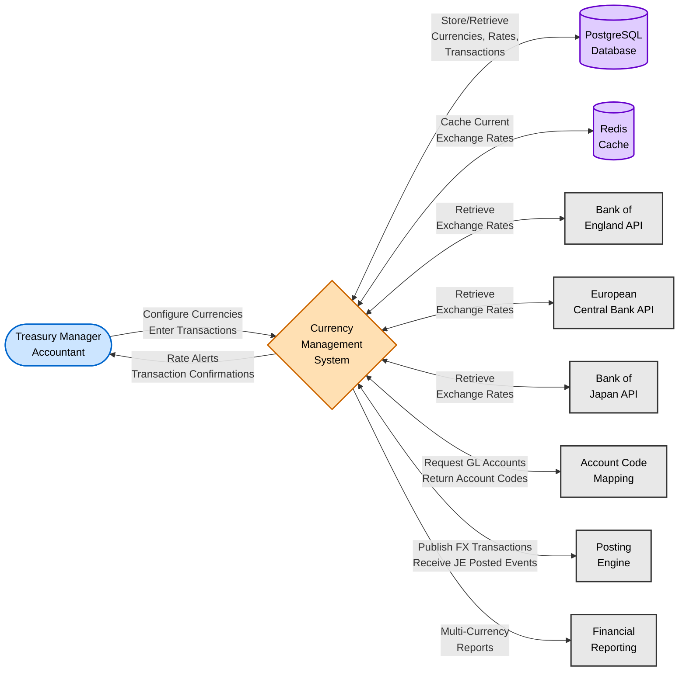

**External Entities**:
- **Users**: Treasury Managers configure rates and providers, Accountants process foreign transactions
- **Database**: PostgreSQL stores currencies, exchange rates, transactions, revaluations
- **Cache**: Redis caches current exchange rates for fast lookup
- **Rate Providers**: External APIs provide real-time and historical exchange rates
- **Account Code Mapping**: Integration for GL account retrieval
- **Posting Engine**: Integration for journal entry generation
- **Reporting**: Financial reports consume multi-currency data

---

### Level 1: System Decomposition

**Purpose**: Show major processes and data stores within Currency Management

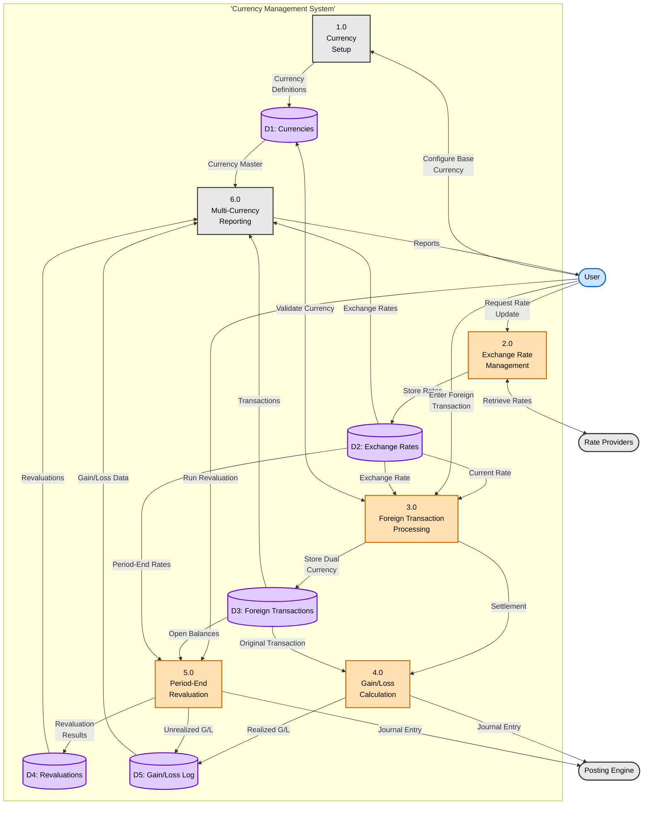

**Data Stores**:
- **D1: Currencies**: Currency master data (ISO 4217 codes, display formats, rounding rules)
- **D2: Exchange Rates**: Current and historical exchange rates with TTL and caching
- **D3: Foreign Transactions**: Dual currency transaction records with source traceability
- **D4: Revaluations**: Period-end revaluation headers and line items with reversals
- **D5: Gain/Loss Log**: Complete audit trail of realized and unrealized exchange impacts

**Processes**:
1. **1.0 Currency Setup**: Configure base currency, add supported currencies, set up display formats
2. **2.0 Exchange Rate Management**: Retrieve rates from providers, validate, cache, and store
3. **3.0 Foreign Transaction Processing**: Post transactions with dual currency recording
4. **4.0 Gain/Loss Calculation**: Calculate and post realized gains/losses on settlement
5. **5.0 Period-End Revaluation**: Run 7-phase revaluation wizard, post unrealized gains/losses
6. **6.0 Multi-Currency Reporting**: Generate trial balance, exposure, and gain/loss reports

---

## Sequence Diagrams

### Exchange Rate Retrieval Sequence

**Purpose**: Time-ordered sequence for automatic exchange rate retrieval

**Scenario**: Hourly scheduled job retrieves exchange rates for all active currency pairs

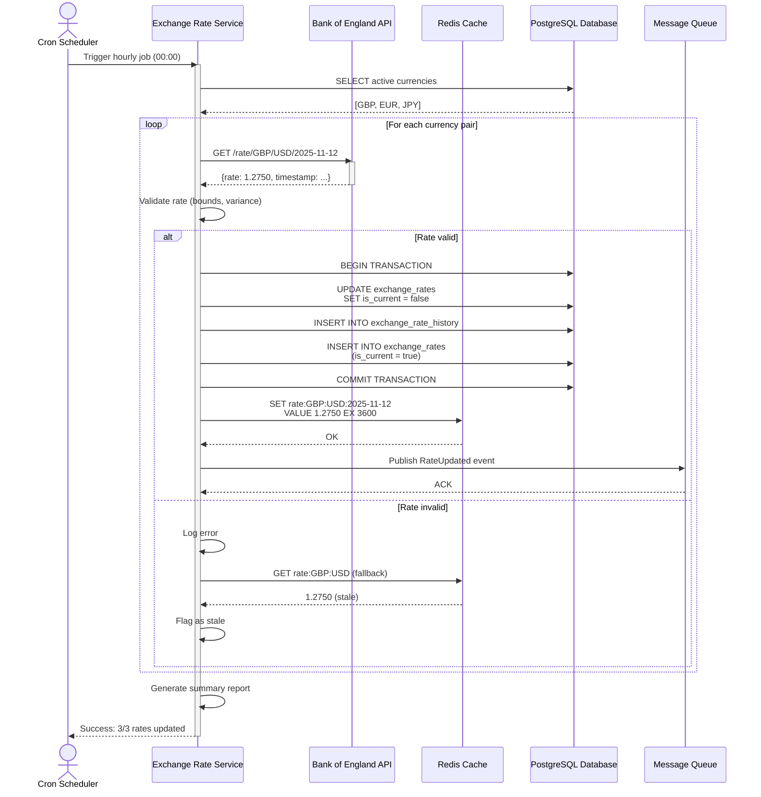

---

### Foreign Currency Transaction Posting Sequence

**Purpose**: Time-ordered sequence for posting foreign currency transaction with dual currency recording

**Scenario**: Accountant posts GBP invoice with automatic currency conversion and journal entry generation

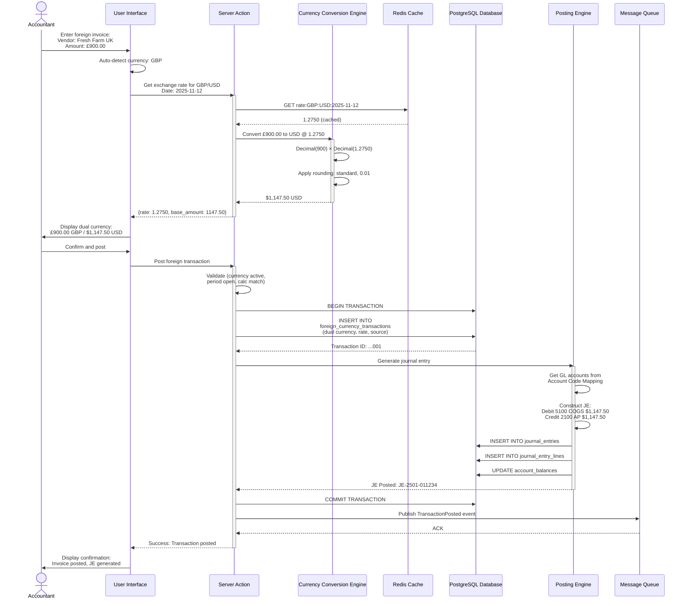

---

### Period-End Revaluation Sequence

**Purpose**: Time-ordered sequence for 7-phase period-end revaluation process

**Scenario**: Accountant executes month-end revaluation for November 2025

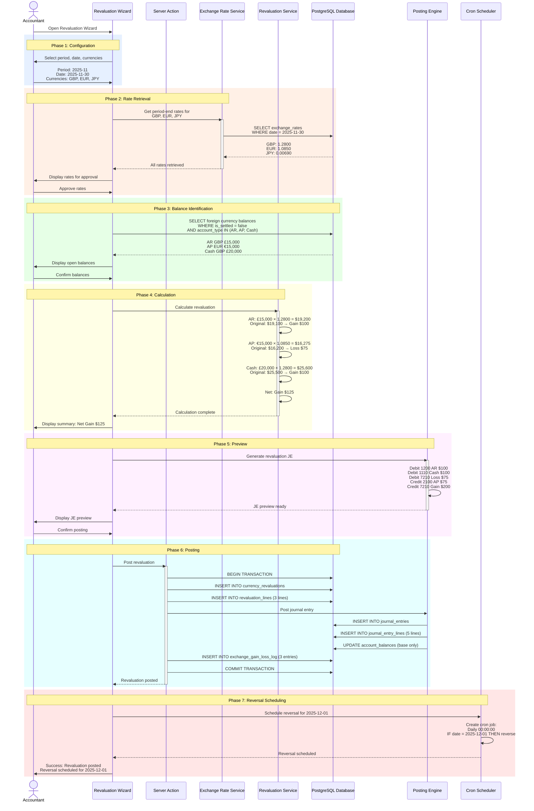

---

## State Diagrams

### Exchange Rate Lifecycle

**Purpose**: Show state transitions for exchange rate records

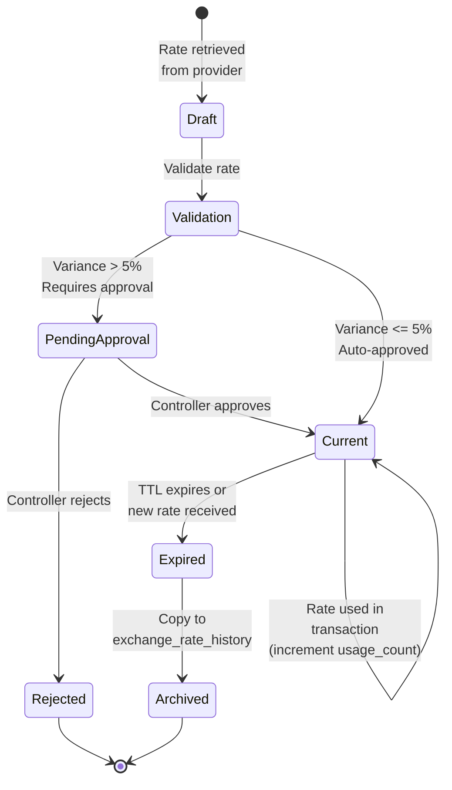

**State Descriptions**:
- **Draft**: Rate retrieved from provider, initial validation pending
- **Validation**: System validating rate bounds and variance
- **Pending Approval**: Manual approval required for high variance (>5%)
- **Current**: Active rate available for transactions, cached in Redis
- **Expired**: Rate TTL expired or superseded by newer rate
- **Archived**: Rate moved to exchange_rate_history for permanent storage
- **Rejected**: Manual rate rejected by approver

---

### Revaluation Status Lifecycle

**Purpose**: Show state transitions for currency revaluation process

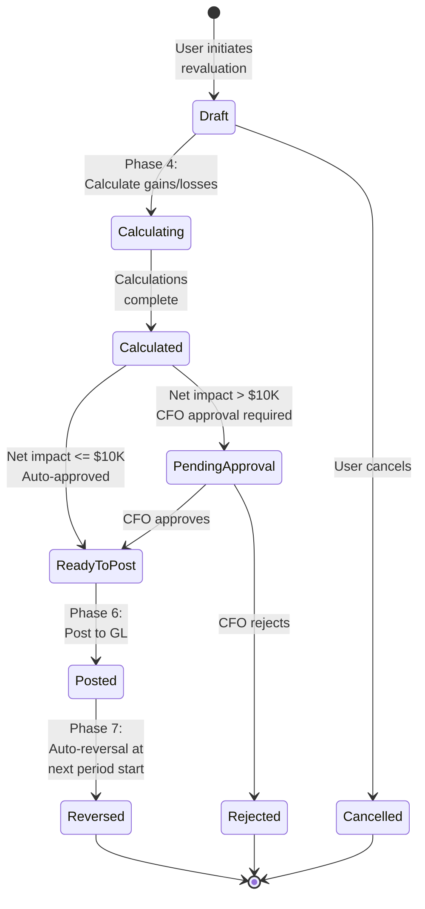

**State Descriptions**:
- **Draft**: Revaluation initiated, configuration in progress
- **Calculating**: System calculating revaluation adjustments
- **Calculated**: Calculations complete, ready for review
- **Pending Approval**: CFO approval required for material impact
- **Ready To Post**: Approved and ready for GL posting
- **Posted**: Journal entry posted, reversal scheduled
- **Reversed**: Automatic reversal posted in next period
- **Rejected**: CFO rejected revaluation
- **Cancelled**: User cancelled before posting

---

## Integration Flows

### Rate Provider Integration Flow

**Purpose**: Integration with external exchange rate provider APIs

**Systems**: Bank of England API, European Central Bank API, Bank of Japan API

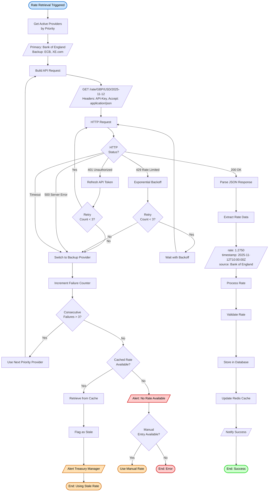

---

### Account Code Mapping Integration Flow

**Purpose**: Integration with Account Code Mapping for GL account retrieval

**Systems**: Currency Management, Account Code Mapping, Posting Engine

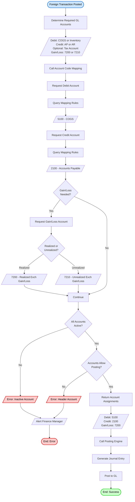

---

## Appendix: Diagram Legend

### Node Shapes
- **Rounded Rectangle** `([text])`: Start/End points
- **Rectangle** `[text]`: Process steps or activities
- **Diamond** `{text}`: Decision points or conditional logic
- **Parallelogram** `[/text/]`: Input/Output or data
- **Cylinder** `[(text)]`: Data storage or database
- **Rounded Edge Rectangle**: Subgraph or subsystem

### Colors (Standard)
- **Blue** `#cce5ff`: Start points, user actors
- **Green** `#ccffcc`: Success end points, completed actions
- **Red** `#ffcccc`: Error end points, failed actions
- **Orange** `#ffe0b3`: Warning states, pending approval
- **Purple** `#e0ccff`: Database operations, data storage
- **Gray** `#e8e8e8`: External systems, passive states

### Arrow Types
- **Solid Arrow** `-->`: Primary flow, forward progression
- **Dashed Arrow** `-.->`: Alternative flow, conditional path
- **Bidirectional** `<-->`: Two-way data exchange

---

**Document End**

> 📝 **Note to Implementers**:
> - All diagrams use Mermaid syntax for easy maintenance
> - Update diagrams when workflows change
> - Keep flows synchronized with Use Cases document
> - Validate flows against actual implementation
> - Test all exception paths and edge cases
> - Ensure state transitions are enforced in code
> - Monitor integration points for failures
> - Review diagrams during architecture reviews
