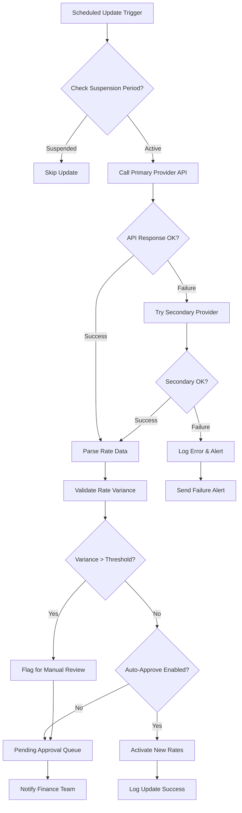

# Business Requirements: Exchange Rate Management

## Module Information
- **Module**: Finance
- **Sub-Module**: Exchange Rate Management
- **Route**: `/finance/exchange-rate-management`
- **Version**: 1.0.0
- **Last Updated**: 2025-01-13
- **Owner**: Finance Product Team
- **Status**: Draft

## Document History
| Version | Date | Author | Changes |
|---------|------|--------|---------|
| 1.1.0 | 2025-12-10 | Documentation Team | Standardized reference number format (XXX-YYMM-NNNN) |
| 1.0.0 | 2025-01-13 | Finance Product Team | Initial version |


## Overview

The Exchange Rate Management sub-module provides comprehensive functionality for managing currency exchange rates across the organization's multi-currency operations. It enables finance teams to maintain current and historical exchange rates, automate rate updates from external sources, perform currency conversions, and ensure accurate financial reporting across different currencies. This module is critical for organizations operating in multiple countries or dealing with international vendors and customers.

Exchange Rate Management integrates tightly with Currency Management for currency definitions, Account Code Mapping for posting exchange gains/losses, and all transaction modules (Procurement, Sales, Inventory) that require currency conversion capabilities. The module ensures compliance with IAS 21 standards for foreign exchange rate management and maintains complete audit trails for all rate changes.

## Business Objectives

1. Maintain accurate, up-to-date exchange rates for all supported currency pairs
2. Automate exchange rate updates from reliable external sources to reduce manual effort
3. Provide historical exchange rate tracking for period-specific financial reporting
4. Enable real-time currency conversion across all business transactions
5. Support cross-currency conversions through base currency when direct rates unavailable
6. Calculate and track exchange gains and losses for financial reporting
7. Ensure compliance with IAS 21 (The Effects of Changes in Foreign Exchange Rates)
8. Provide audit trail for all exchange rate changes and sources
9. Support multiple exchange rate types (spot, forward, hedging) for risk management
10. Enable currency revaluation for accurate period-end financial statements

## Key Stakeholders

### Primary Users
1. **Financial Controller / CFO**: Oversees exchange rate policy, approves rate sources, monitors currency exposure
2. **Finance Manager**: Manages exchange rate configurations, monitors rate accuracy, handles rate exceptions
3. **Treasury Manager**: Manages forward contracts, hedging strategies, monitors foreign exchange risk
4. **Accountant**: Enters manual rates when needed, performs currency revaluations, posts exchange adjustments

### System Users
1. **Purchasing Manager**: Views exchange rates for vendor currency decisions, uses rates for cost analysis
2. **Accounts Payable Clerk**: Uses exchange rates for foreign vendor payment processing
3. **Accounts Receivable Clerk**: Uses exchange rates for foreign customer invoice conversion
4. **Operations Manager**: Monitors exchange rate impact on procurement and inventory costs

### Supporting Roles
1. **External Auditor**: Verifies exchange rate sources and historical accuracy
2. **Internal Auditor**: Reviews exchange rate controls and approval processes
3. **Tax Accountant**: Uses exchange rates for tax calculation in multiple currencies
4. **Financial Analyst**: Analyzes currency trends and exchange rate impact on profitability

---

## Functional Requirements

### FR-EXRATE-001: Exchange Rate Master Data Management
**Priority**: Critical
**User Story**: As a Finance Manager, I want to maintain comprehensive exchange rate data for all currency pairs so that the system can accurately convert transactions between currencies.

**Requirements**:
- Exchange rate storage with source currency, target currency, rate, and effective date
- Support for multiple rate types: Spot, Forward, Average, Month-End, Year-End
- Bidirectional rate storage (USD→EUR and EUR→USD) with automatic calculation
- Rate source tracking (Manual, Bloomberg, Reuters, OpenExchangeRates, etc.)
- Effective date and time for rate applicability
- Rate status (Active, Historical, Pending Approval)
- Exchange rate precision (typically 6 decimal places for accuracy)
- Buy rate, Sell rate, and Mid rate support for different transaction types
- Spread/margin configuration for buy/sell rates
- Triangulation support for cross-currency conversions via base currency

**Exchange Rate Structure**:
```typescript
interface ExchangeRate {
  rate_id: string                          // Unique identifier
  source_currency: string                  // ISO 4217 code (USD, EUR, GBP)
  target_currency: string                  // ISO 4217 code
  exchange_rate: Decimal                   // Conversion rate (6 decimal places)
  inverse_rate: Decimal                    // Calculated inverse rate
  rate_type: 'spot' | 'forward' | 'average' | 'month_end' | 'year_end'
  rate_source: string                      // Source (Manual, Bloomberg, API)
  effective_date: DateTime                 // When rate becomes active
  effective_until?: DateTime               // When rate expires (for forward rates)
  buy_rate?: Decimal                       // Rate for buying target currency
  sell_rate?: Decimal                      // Rate for selling target currency
  mid_rate: Decimal                        // Middle rate (buy + sell) / 2
  spread_percentage?: Decimal              // Spread between buy/sell rates
  is_active: boolean                       // Currently active rate
  is_manual_entry: boolean                 // Manually entered vs automated
  approval_status: 'pending' | 'approved' | 'rejected'
  approved_by?: string                     // User who approved rate
  approved_date?: DateTime                 // Approval timestamp
  rate_provider_id?: string                // External provider reference
  confidence_level?: number                // Rate reliability (0-100)
  transaction_count?: number               // Transactions using this rate
  created_by: string
  created_date: DateTime
  modified_by?: string
  modified_date?: DateTime
  notes?: string
}
```

**Exchange Rate Examples**:
```yaml
Exchange Rate: USD to EUR (Spot Rate)
  Source Currency: USD
  Target Currency: EUR
  Exchange Rate: 0.921456 (1 USD = 0.921456 EUR)
  Inverse Rate: 1.085267 (1 EUR = 1.085267 USD)
  Rate Type: spot
  Effective Date: 2025-01-13 14:30:00 UTC
  Buy Rate: 0.919234 (2.4% spread)
  Sell Rate: 0.923678
  Mid Rate: 0.921456
  Source: Bloomberg API
  Status: Active, Approved

Exchange Rate: GBP to USD (Month-End Rate)
  Source Currency: GBP
  Target Currency: USD
  Exchange Rate: 1.267890
  Inverse Rate: 0.788832
  Rate Type: month_end
  Effective Date: 2024-12-31 23:59:59 UTC
  Rate Source: Manual Entry
  Status: Historical
  Used for: December 2024 revaluation

Exchange Rate: USD to JPY (Forward Rate)
  Source Currency: USD
  Target Currency: JPY
  Exchange Rate: 149.234500 (1 USD = 149.2345 JPY)
  Rate Type: forward
  Effective Date: 2025-01-13
  Effective Until: 2025-03-13 (90-day forward)
  Rate Source: Bank Forward Contract
  Contract Number: FWD-2501-001234
  Status: Active, Approved
```

**Acceptance Criteria**:
- Support minimum 200 currency pair combinations
- Exchange rates stored with 6 decimal place precision
- Automatic inverse rate calculation with validation
- Rate type filtering for different business purposes
- Historical rates maintained indefinitely for audit purposes
- Rate approval workflow for manual entries above threshold
- Bulk import supports CSV/Excel with validation
- API integration for automated rate updates from approved sources
- Exchange rate changes tracked in audit log with user attribution

**Related Requirements**: FR-CUR-001 (Currency Master Data), FR-EXRATE-002 (Rate Sources)

---

### FR-EXRATE-002: Automated Exchange Rate Updates
**Priority**: High
**User Story**: As a Finance Manager, I want exchange rates to update automatically from reliable external sources so that I don't have to manually enter rates daily and transactions always use current rates.

**Requirements**:
- Integration with external rate providers (Bloomberg, Reuters, OpenExchangeRates, etc.)
- Configurable update schedule (hourly, daily, real-time)
- Multiple rate source support with fallback mechanism
- Rate validation against previous rates (variance threshold alerts)
- Automatic activation of new rates based on business rules
- Failed update retry logic with exponential backoff
- Rate update audit log with source attribution
- Manual rate override capability for exceptions
- Rate source priority configuration
- Update suspension during critical periods (month-end, year-end)

**Supported Rate Providers**:
```yaml
Provider: OpenExchangeRates.org (Default for SMB)
  API Endpoint: https://openexchangerates.org/api/latest.json
  Update Frequency: Hourly (Free tier), Real-time (Paid tier)
  Currency Pairs: 200+ currencies
  Historical Data: Yes (Paid tier)
  Rate Type: Spot rates
  Reliability: 99.9% uptime
  Cost: Free for 1000 requests/month, Paid plans available
  Authentication: API Key

Provider: Bloomberg Terminal (Enterprise)
  API Endpoint: Bloomberg API
  Update Frequency: Real-time
  Currency Pairs: All major and exotic pairs
  Historical Data: Yes, 10+ years
  Rate Type: Spot, Forward, Swap
  Reliability: 99.99% uptime
  Cost: Enterprise license required
  Authentication: Bloomberg credentials

Provider: European Central Bank (ECB)
  API Endpoint: https://www.ecb.europa.eu/stats/eurofxref/
  Update Frequency: Daily (14:15 CET)
  Currency Pairs: EUR base, 30+ currencies
  Historical Data: Yes, from 1999
  Rate Type: Reference rates
  Reliability: High (official source)
  Cost: Free
  Authentication: None required

Provider: Central Bank API (Manual Configuration)
  Support: Federal Reserve, Bank of England, Bank of Japan, etc.
  Update Frequency: Daily official rates
  Currency Pairs: Varies by bank
  Historical Data: Yes, typically 5-10 years
  Rate Type: Official rates
  Reliability: High (government source)
  Cost: Free
  Authentication: Varies by provider
```

**Update Configuration**:
```typescript
interface RateUpdateConfig {
  config_id: string
  provider_name: string                    // OpenExchangeRates, Bloomberg, etc.
  is_primary: boolean                      // Primary source indicator
  priority_order: number                   // Fallback priority (1=highest)
  api_endpoint: string                     // Provider API URL
  api_key?: string                         // Authentication key
  update_schedule: 'realtime' | 'hourly' | 'daily' | 'manual'
  update_time?: string                     // HH:MM for daily updates
  enabled_currencies: string[]             // Currency codes to update
  rate_type: 'spot' | 'forward' | 'average'
  auto_approve: boolean                    // Skip approval for updates
  variance_threshold: number               // Max % change before alert (e.g., 5%)
  retry_attempts: number                   // Failed update retry count
  retry_delay_minutes: number              // Delay between retries
  suspension_periods: DateRange[]          // Periods to suspend updates
  last_update: DateTime
  last_success: DateTime
  last_failure?: DateTime
  failure_count: number
  is_active: boolean
}
```

**Update Workflow**:


**Acceptance Criteria**:
- Support minimum 3 external rate providers
- Update schedule configurable per provider
- Automatic failover to secondary provider on primary failure
- Rate variance >5% triggers manual review alert
- Failed updates retry 3 times with exponential backoff (1min, 5min, 15min)
- Update suspension configurable for critical periods
- All updates logged with source, timestamp, success/failure status
- Manual override capability maintains audit trail
- Provider health monitoring dashboard
- Real-time alerts for update failures

**Related Requirements**: FR-EXRATE-001 (Rate Storage), FR-EXRATE-003 (Manual Entry)

---

### FR-EXRATE-003: Manual Exchange Rate Entry
**Priority**: High
**User Story**: As a Finance Manager, I want to manually enter or adjust exchange rates when needed so that I can handle situations where automated rates are unavailable or incorrect.

**Requirements**:
- Manual rate entry form with source and target currency selection
- Effective date and time specification
- Rate type selection (Spot, Forward, Month-End, Year-End)
- Mandatory rate source documentation field
- Optional buy/sell rate entry with automatic mid-rate calculation
- Inverse rate automatic calculation with validation
- Approval workflow for rates above variance threshold
- Reason code requirement for manual entries during automated update periods
- Bulk rate entry via Excel template for multiple currency pairs
- Historical rate correction capability with audit trail
- Rate entry validation against recent historical rates

**Manual Entry Form**:
```yaml
Manual Exchange Rate Entry Screen:
  Header:
    - Title: "Manual Exchange Rate Entry"
    - Current Date/Time: Auto-populated
    - Entry User: Auto-populated from logged-in user

  Rate Details:
    - Source Currency: Dropdown (all active currencies)
    - Target Currency: Dropdown (filtered: not source currency)
    - Effective Date: Date picker (required)
    - Effective Time: Time picker (default: current time)
    - Rate Type: Radio buttons (Spot, Forward, Month-End, Year-End)
    - Effective Until: Date picker (required for Forward rates)

  Rate Values:
    - Exchange Rate: Decimal input (6 places) (required)
    - Inverse Rate: Auto-calculated, display only
    - Buy Rate: Decimal input (optional)
    - Sell Rate: Decimal input (optional)
    - Mid Rate: Auto-calculated if buy/sell provided
    - Spread %: Auto-calculated display

  Rate Source:
    - Rate Source: Dropdown (Manual, Bank Quote, Customer Request, etc.)
    - Source Reference: Text input (required - contract #, email, etc.)
    - Rate Provider: Text input (bank name, broker, etc.)
    - Reason for Manual Entry: Text area (required)
    - Supporting Document: File upload (optional)

  Validation:
    - Variance vs Last Rate: Auto-calculated display
    - Variance Alert: Warning if > 5% change
    - Historical Rate Check: Compare vs last 30 days

  Actions:
    - Submit for Approval (if variance > threshold)
    - Save and Activate (if auto-approve enabled)
    - Save as Draft
    - Cancel
```

**Approval Workflow**:
```yaml
Rate Approval Workflow:
  Trigger Conditions:
    - Manual rate variance > 5% from last rate
    - Manual entry during automated update period
    - Forward rate entry without contract reference
    - Month-end or year-end rate submission

  Approval Process:
    1. Entry:
       - User submits manual rate
       - System validates data completeness
       - Status set to "Pending Approval"

    2. Review:
       - Finance Manager notified via email
       - Reviewer checks rate against market sources
       - Supporting documentation reviewed
       - Reason for variance evaluated

    3. Decision:
       - Approve: Rate activated, transactions can use
       - Reject: Rate returned to submitter with comments
       - Request Revision: Additional info/documentation needed

    4. Activation:
       - Approved rates become active immediately
       - Previous rate moves to historical status
       - Audit log updated with approval chain
       - Notification sent to submitter

  Approval Limits:
    - Finance Clerk: Cannot approve (entry only)
    - Finance Manager: Approve up to 10% variance
    - Finance Controller: Approve up to 25% variance
    - CFO: Approve any variance with documentation
```

**Bulk Rate Entry Template**:
```csv
Source Currency,Target Currency,Exchange Rate,Rate Type,Effective Date,Rate Source,Reference,Notes
USD,EUR,0.921456,spot,2025-01-13,Bank Quote,QUOTE-12345,Daily rate from Citibank
USD,GBP,0.788901,spot,2025-01-13,Bank Quote,QUOTE-12345,Daily rate from Citibank
USD,JPY,149.234500,spot,2025-01-13,Bank Quote,QUOTE-12345,Daily rate from Citibank
EUR,GBP,0.856234,spot,2025-01-13,ECB,OFFICIAL,Cross rate from ECB
GBP,JPY,189.123456,spot,2025-01-13,Calculated,AUTO,Triangulated via USD
USD,CAD,1.345678,forward,2025-01-13,Forward Contract,FWD-2501-0001,90-day forward contract
```

**Acceptance Criteria**:
- Manual entry form validates all required fields
- Inverse rate calculated automatically with 6 decimal precision
- Variance >5% triggers approval workflow automatically
- Bulk entry supports minimum 50 currency pairs per upload
- Historical rate correction tracked with reason and approver
- Supporting documents stored with rate record
- Audit trail includes entry user, timestamps, approval chain
- Manual entry overrides automated rate for effective date
- Reason code mandatory for entries during automated update periods

**Related Requirements**: FR-EXRATE-001 (Rate Storage), FR-EXRATE-004 (Rate Approval)

---

### FR-EXRATE-004: Exchange Rate Approval and Validation
**Priority**: High
**User Story**: As a Financial Controller, I want to approve manual exchange rate entries that exceed variance thresholds so that I can ensure rate accuracy and prevent financial errors.

**Requirements**:
- Configurable variance thresholds by currency pair
- Automatic routing to appropriate approver based on variance level
- Approval queue dashboard with pending rates
- Rate comparison tools (current vs proposed, historical trends)
- Bulk approval capability for multiple rates
- Rejection workflow with comments and revision requests
- Approval time limits with escalation
- Email notifications for approval requests and decisions
- Mobile approval capability for urgent situations
- Approval delegation during absences

**Approval Dashboard**:
```yaml
Exchange Rate Approval Queue:
  Filters:
    - Status: Pending, Approved, Rejected
    - Submitter: User dropdown
    - Date Range: Date picker
    - Currency Pair: Multi-select
    - Variance Level: <5%, 5-10%, 10-25%, >25%

  List View Columns:
    - Submission Date/Time
    - Currency Pair (Source → Target)
    - Proposed Rate
    - Current Rate
    - Variance % (color-coded: green <5%, yellow 5-10%, red >10%)
    - Rate Type
    - Submitter Name
    - Reason/Notes (truncated with expand)
    - Days Pending (alert if >1 day)
    - Actions: View Details, Approve, Reject, Request Revision

  Bulk Actions:
    - Select multiple rates (checkbox)
    - Bulk Approve (with reason)
    - Bulk Reject (with reason)
    - Export to Excel

  Summary Statistics:
    - Total Pending: Count
    - Urgent (>24 hours): Count and alert
    - Average Approval Time: Hours
    - Rejection Rate: Percentage
```

**Rate Validation Checks**:
```typescript
interface RateValidation {
  // Automatic Validation Rules
  rules: {
    variance_check: {
      threshold: number                    // % variance limit
      compare_to: 'last_rate' | 'average_7day' | 'average_30day'
      action: 'approve' | 'flag' | 'reject'
    },

    triangulation_check: {
      enabled: boolean                     // Verify cross rates match
      tolerance: number                    // Acceptable variance %
      base_currency: string                // Currency for triangulation
    },

    market_rate_check: {
      enabled: boolean                     // Compare to external sources
      sources: string[]                    // Provider APIs to check
      tolerance: number                    // Acceptable variance %
    },

    historical_pattern: {
      enabled: boolean                     // Check against trends
      period_days: number                  // Historical period to analyze
      outlier_threshold: number            // Standard deviations
    },

    temporal_consistency: {
      enabled: boolean                     // Ensure rates make sense over time
      min_rate_change: number              // Minimum plausible change
      max_rate_change: number              // Maximum plausible change
    }
  },

  // Validation Results
  results: {
    passed: boolean
    warnings: ValidationWarning[]
    errors: ValidationError[]
    recommendations: string[]
  }
}
```

**Acceptance Criteria**:
- Variance thresholds configurable by currency pair
- Approval routing based on variance: <10% → Manager, 10-25% → Controller, >25% → CFO
- Pending rates older than 24 hours trigger escalation email
- Approval dashboard shows real-time pending count
- Bulk approval supports up to 50 rates at once
- Rejection requires mandatory comment (min 10 characters)
- Approval delegation transfers permissions for date range
- Mobile-responsive approval interface
- Approval decisions logged with timestamp and reason
- Approved rates activate within 1 minute

**Related Requirements**: FR-EXRATE-003 (Manual Entry), FR-EXRATE-007 (Audit Trail)

---

### FR-EXRATE-005: Real-Time Currency Conversion
**Priority**: Critical
**User Story**: As a Purchasing Manager, I want to see real-time currency conversions when creating purchase orders so that I can make informed decisions about foreign vendor pricing.

**Requirements**:
- Real-time conversion using current spot rates
- Conversion API available to all transaction modules
- Support for amount conversion in both directions
- Historical conversion using effective date rates
- Conversion metadata (rate used, rate source, conversion timestamp)
- Bulk conversion capability for multiple amounts
- Conversion with specific rate override option
- Conversion precision matching target currency decimal places
- Triangulation through base currency when direct rate unavailable
- Conversion rate caching for performance

**Conversion API Specification**:
```typescript
interface CurrencyConversion {
  // Conversion Request
  request: {
    amount: Decimal                        // Amount to convert
    source_currency: string                // ISO 4217 code
    target_currency: string                // ISO 4217 code
    conversion_date?: Date                 // Default: current date
    rate_type?: 'spot' | 'forward' | 'average' | 'month_end'
    use_buy_rate?: boolean                 // Use buy vs mid rate
    override_rate?: Decimal                // Manual rate override
  },

  // Conversion Response
  response: {
    source_amount: Decimal
    source_currency: string
    target_amount: Decimal                 // Rounded to currency precision
    target_currency: string
    exchange_rate: Decimal                 // Rate used (6 decimals)
    inverse_rate: Decimal
    rate_type: string
    rate_source: string                    // Provider or Manual
    conversion_path: string[]              // Direct or via triangulation
    conversion_timestamp: DateTime
    rate_effective_date: DateTime
    is_rate_current: boolean               // True if <24 hours old
    rate_age_hours: number
    confidence_level: number               // Rate reliability 0-100
  },

  // Conversion Metadata
  metadata: {
    conversion_id: string                  // Unique conversion reference
    requesting_module: string              // Procurement, Sales, etc.
    requesting_user: string
    transaction_reference?: string         // PR number, PO number, etc.
    is_cached: boolean                     // Rate from cache vs DB
    cache_hit_rate: number                 // Performance metric
  }
}
```

**Conversion Examples**:
```yaml
Example 1: Direct Conversion (USD to EUR)
  Input:
    Amount: 10,000.00 USD
    Target Currency: EUR
    Date: 2025-01-13

  Processing:
    - Look up USD→EUR spot rate: 0.921456
    - Calculate: 10,000.00 × 0.921456 = 9,214.56
    - Round to 2 decimals (EUR): 9,214.56 EUR

  Output:
    Source: 10,000.00 USD
    Target: 9,214.56 EUR
    Rate: 0.921456
    Path: Direct (USD→EUR)
    Source: Bloomberg API
    Date: 2025-01-13 14:30:00 UTC

Example 2: Triangulated Conversion (GBP to JPY)
  Input:
    Amount: 5,000.00 GBP
    Target Currency: JPY
    Date: 2025-01-13

  Processing:
    - Direct GBP→JPY rate not available
    - Triangulate via base currency (USD)
    - GBP→USD rate: 1.267890
    - USD→JPY rate: 149.234500
    - Calculate: 5,000.00 × 1.267890 × 149.234500 = 946,032.17
    - Round to 0 decimals (JPY): 946,032 JPY

  Output:
    Source: 5,000.00 GBP
    Target: 946,032 JPY
    Rate: 189.206435 (calculated)
    Path: Triangulated (GBP→USD→JPY)
    Source: Calculated from Bloomberg rates
    Date: 2025-01-13 14:30:00 UTC

Example 3: Historical Conversion (Month-End)
  Input:
    Amount: 50,000.00 USD
    Target Currency: EUR
    Date: 2024-12-31 (month-end revaluation)
    Rate Type: month_end

  Processing:
    - Look up USD→EUR month_end rate for Dec 2024: 0.938765
    - Calculate: 50,000.00 × 0.938765 = 46,938.25
    - Round to 2 decimals: 46,938.25 EUR

  Output:
    Source: 50,000.00 USD
    Target: 46,938.25 EUR
    Rate: 0.938765
    Rate Type: month_end
    Path: Direct (USD→EUR)
    Source: Manual Entry (December revaluation)
    Date: 2024-12-31 23:59:59 UTC
```

**Conversion Integration Points**:
```yaml
Procurement Module:
  - Purchase Request currency conversion for approval limits
  - Purchase Order total conversion for budget checking
  - Vendor price comparison across currencies
  - GRN amount conversion to base currency for posting

Sales Module:
  - Customer quote conversion to customer currency
  - Invoice amount conversion to base currency
  - Payment receipt conversion for reconciliation
  - Revenue recognition in base currency

Inventory Module:
  - Stock valuation in base currency
  - Inter-location transfer pricing across currencies
  - Inventory revaluation at period end
  - Cost of goods sold in base currency

Financial Reporting:
  - Trial balance conversion for multi-currency entities
  - Consolidated financial statements
  - Currency exposure reports
  - Exchange gain/loss calculations
```

**Acceptance Criteria**:
- Conversion response time <500ms for cached rates
- Conversion response time <2 seconds for non-cached rates
- Support conversion of amounts from 0.01 to 999,999,999.99
- Triangulation supported for any currency pair via base currency
- Conversion accuracy maintained to 6 decimal places during calculation
- Result rounded to target currency decimal places (0-4 decimals)
- Stale rate warning if rate >24 hours old
- Conversion API rate limit: 1000 requests/minute
- Batch conversion supports up to 100 amounts per request
- All conversions logged for audit with user and transaction context

**Related Requirements**: FR-EXRATE-001 (Rate Storage), FR-EXRATE-006 (Historical Rates)

---

### FR-EXRATE-006: Historical Exchange Rate Management
**Priority**: High
**User Story**: As an Accountant, I want to access historical exchange rates for any date so that I can perform period-specific revaluations and generate accurate historical financial reports.

**Requirements**:
- Complete historical rate storage with no data retention limits
- Historical rate query by currency pair and effective date
- Period-end rate storage (month-end, quarter-end, year-end)
- Historical rate export for external audits
- Rate reconstruction for missing historical data
- Historical trend analysis and visualization
- Rate effective date and time tracking
- Multiple rates per date (intraday rate changes)
- Historical rate immutability (no editing, only corrections with audit trail)
- Historical rate comparison tools

**Historical Rate Storage**:
```typescript
interface HistoricalRateRecord {
  rate_id: string                          // Immutable record ID
  source_currency: string
  target_currency: string
  exchange_rate: Decimal
  inverse_rate: Decimal
  rate_type: 'spot' | 'forward' | 'average' | 'month_end' | 'year_end'
  effective_date: DateTime                 // Rate became effective
  superseded_date?: DateTime               // When replaced by new rate
  is_current: boolean                      // Current active rate
  rate_source: string
  created_date: DateTime
  created_by: string
  transaction_count: number                // Transactions using this rate
  is_period_end: boolean                   // Flagged for period close
  period_type?: 'month' | 'quarter' | 'year'
  fiscal_period?: string                   // YYYY-MM for identification
  correction_of_rate_id?: string           // Reference to corrected rate
  correction_reason?: string
  is_correction: boolean
}
```

**Historical Rate Query API**:
```yaml
Query: Get Exchange Rate for Specific Date
  Parameters:
    - source_currency: USD (required)
    - target_currency: EUR (required)
    - effective_date: 2024-06-15 (required)
    - rate_type: spot (optional, default: spot)
    - time_of_day: 14:00 (optional, for intraday rates)

  Response:
    - exchange_rate: 0.934567
    - rate_source: Bloomberg API
    - effective_timestamp: 2024-06-15 14:00:00 UTC
    - confidence_level: 95
    - is_interpolated: false

  Fallback Logic:
    1. Exact match for date and time
    2. Most recent rate on same date
    3. Most recent rate before requested date
    4. Interpolate between nearest dates (optional)
    5. Return error if no rate found within 30 days

Query: Get Rate History for Period
  Parameters:
    - source_currency: USD
    - target_currency: EUR
    - start_date: 2024-01-01
    - end_date: 2024-12-31
    - frequency: daily | weekly | monthly

  Response:
    - Array of rate records with dates
    - Summary statistics: min, max, average, std deviation
    - Trend direction: appreciating | depreciating | stable
    - Volatility index: low | medium | high
    - Data completeness: percentage of days with rates

Query: Get Period-End Rates
  Parameters:
    - fiscal_year: 2024
    - period_type: month | quarter | year

  Response:
    - Array of period-end rates for all currency pairs
    - Period identifier (YYYY-MM)
    - Rate effective dates
    - Rate sources
    - Approval status
```

**Historical Rate Visualization**:
```yaml
Exchange Rate History Chart:
  Chart Type: Line chart with multiple series
  X-Axis: Date range (daily, weekly, monthly)
  Y-Axis: Exchange rate value

  Features:
    - Multiple currency pairs on same chart
    - Zoom in/out for different time periods
    - Hover tooltips with exact rate and date
    - Trend line overlay
    - Moving average (7-day, 30-day, 90-day)
    - Volatility bands
    - Period-end markers
    - Rate change annotations
    - Export chart as image or PDF

  Analysis Tools:
    - Percentage change calculation
    - High/low/average for period
    - Standard deviation
    - Currency correlation analysis
    - Forecasting (linear regression)
```

**Period-End Rate Process**:
```yaml
Month-End Rate Capture:
  Timing: Last business day of month at market close
  Process:
    1. System identifies month-end date
    2. Captures spot rates for all active currency pairs
    3. Marks rates with is_period_end = true
    4. Sets fiscal_period = YYYY-MM
    5. Routes to Finance Manager for approval
    6. Upon approval, locks rates for revaluation
    7. Notifies accounting team rates are ready

  Usage:
    - Foreign currency revaluation
    - Unrealized gain/loss calculation
    - Balance sheet translation
    - Income statement translation (average rate)
    - Financial statement consolidation

Year-End Rate Capture:
  Timing: Last business day of fiscal year
  Process:
    - Same as month-end but flagged as year-end
    - Additional verification by Financial Controller
    - External auditor notification
    - Permanent archival for compliance

  Usage:
    - Annual financial statement preparation
    - Tax reporting in multiple jurisdictions
    - Statutory reporting requirements
    - Audit evidence
```

**Historical Rate Correction**:
```yaml
Rate Correction Process:
  Trigger:
    - Discovery of incorrect historical rate
    - External audit finding
    - Internal review discrepancy

  Correction Workflow:
    1. Identify incorrect rate record
    2. Finance Manager creates correction request
    3. Document reason and supporting evidence
    4. Financial Controller approves correction
    5. System creates new rate record:
       - Same effective date as incorrect rate
       - Corrected exchange rate value
       - is_correction = true
       - correction_of_rate_id = original rate ID
       - correction_reason documented
    6. Original rate marked as corrected (not deleted)
    7. Impact analysis: transactions affected
    8. Revaluation of affected transactions (if material)
    9. Adjustment journal entries if needed
    10. Audit trail updated with correction chain

  Restrictions:
    - Cannot correct rates used in closed periods without CFO approval
    - Cannot correct rates for finalized tax returns
    - Cannot correct rates after external audit sign-off
```

**Acceptance Criteria**:
- Historical rates stored indefinitely (no archival or deletion)
- Query performance <2 seconds for any historical date
- Support date range queries up to 10 years
- Period-end rates automatically captured and flagged
- Rate history export in CSV, Excel, PDF formats
- Trend chart renders for any date range
- Historical rate corrections tracked with full audit trail
- Original incorrect rates preserved (marked as corrected, not deleted)
- Transaction count tracked per historical rate record
- API supports batch historical rate queries (up to 365 dates per request)

**Related Requirements**: FR-EXRATE-001 (Rate Storage), FR-EXRATE-007 (Audit Trail)

---

### FR-EXRATE-007: Exchange Rate Audit Trail
**Priority**: High
**User Story**: As a Financial Controller, I want complete audit logs of all exchange rate changes so that I can comply with financial regulations and respond to external audits.

**Requirements**:
- Complete audit trail for all rate create, update, approve, reject operations
- User attribution with timestamp for all actions
- Before/after values for rate changes
- IP address and session tracking
- Audit log retention for 7+ years
- Audit log export for external auditors
- Tamper-proof audit records (append-only)
- Audit search and filter capabilities
- Audit report generation
- Real-time audit notifications for critical changes

**Audit Log Structure**:
```typescript
interface ExchangeRateAuditLog {
  audit_id: string                         // Unique audit record ID
  event_timestamp: DateTime                // When event occurred
  event_type: 'create' | 'update' | 'approve' | 'reject' | 'delete' | 'correct'
  rate_id: string                          // Rate record affected
  source_currency: string
  target_currency: string

  // User Context
  user_id: string                          // User performing action
  user_name: string
  user_role: string
  user_department: string
  session_id: string
  ip_address: string
  user_agent: string                       // Browser/device info

  // Change Details
  field_changed?: string                   // Field that changed
  old_value?: string                       // Previous value
  new_value?: string                       // New value
  exchange_rate_old?: Decimal
  exchange_rate_new?: Decimal
  rate_type?: string
  effective_date?: DateTime

  // Context
  reason?: string                          // Why change was made
  approval_level?: string                  // Manager, Controller, CFO
  source_system?: string                   // Manual, API, Batch
  transaction_reference?: string           // Related transaction
  supporting_document_id?: string

  // Metadata
  severity: 'info' | 'warning' | 'critical'
  is_automated: boolean                    // System vs manual
  parent_audit_id?: string                 // For related events
  correction_flag: boolean                 // Historical correction
}
```

**Audit Event Types**:
```yaml
Event: RATE_CREATED
  Description: New exchange rate added to system
  Triggered By: Manual entry, automated update, bulk import
  Logged Data:
    - All rate fields (source, target, rate, type, effective date)
    - Rate source (manual, API, provider name)
    - User who created rate
    - Auto-approval status
  Severity: Info

Event: RATE_UPDATED
  Description: Existing rate modified
  Triggered By: Manual correction, automated refresh
  Logged Data:
    - Rate ID
    - Old vs new rate values (before/after)
    - All changed fields
    - Update reason
    - User and timestamp
  Severity: Warning

Event: RATE_APPROVED
  Description: Pending rate approved by authorized user
  Triggered By: Approval workflow completion
  Logged Data:
    - Rate details
    - Approver user and role
    - Approval comments
    - Time to approve (submission to approval)
  Severity: Info

Event: RATE_REJECTED
  Description: Pending rate rejected
  Triggered By: Approval workflow rejection
  Logged Data:
    - Rate details
    - Rejection reason (mandatory)
    - Rejecting user and role
    - Submitter notification sent
  Severity: Warning

Event: RATE_CORRECTED
  Description: Historical rate corrected
  Triggered By: Error correction process
  Logged Data:
    - Original rate ID
    - Corrected rate ID
    - Old vs new rate values
    - Correction reason
    - Supporting documentation
    - CFO/Controller approval
    - Affected transactions count
  Severity: Critical

Event: RATE_USED_IN_TRANSACTION
  Description: Rate used for currency conversion
  Triggered By: Transaction processing
  Logged Data:
    - Transaction module (Procurement, Sales, etc.)
    - Transaction reference (PR number, PO number)
    - Conversion amount and result
    - User initiating transaction
  Severity: Info

Event: AUTOMATED_UPDATE_FAILURE
  Description: Scheduled rate update failed
  Triggered By: API failure, network error, validation failure
  Logged Data:
    - Provider name
    - Error message and code
    - Retry attempt number
    - Fallback action taken
  Severity: Critical (alerts sent)

Event: VARIANCE_THRESHOLD_EXCEEDED
  Description: Rate variance beyond acceptable limit
  Triggered By: Automated validation check
  Logged Data:
    - Currency pair
    - Old rate vs new rate
    - Variance percentage
    - Routed to approval queue
  Severity: Warning
```

**Audit Trail Report**:
```yaml
Exchange Rate Audit Report:
  Report Period: User-selected date range

  Filters:
    - Event Type: Multi-select
    - Currency Pair: Multi-select
    - User: Multi-select
    - Severity: Info, Warning, Critical
    - Rate Source: Manual, API, Bulk

  Report Sections:
    1. Summary Statistics:
       - Total events in period
       - Events by type (count and %)
       - Events by user (top 10)
       - Critical events (highlighted)
       - Average approval time

    2. Detailed Event Log:
       - Chronological list of all events
       - Columns: Timestamp, Event Type, User, Currency Pair,
                  Old Value, New Value, Reason, Severity
       - Color-coded by severity
       - Expandable detail view

    3. Rate Change Timeline:
       - Visual timeline of rate changes for selected currency pair
       - Before/after rate values
       - Change percentage
       - User attribution

    4. User Activity Summary:
       - Actions by user
       - Approval patterns
       - Rejection rates
       - Average processing times

    5. Compliance Checklist:
       - All manual entries have documented reason: Yes/No
       - All approvals completed within SLA: Yes/No
       - All rejections have comments: Yes/No
       - No unauthorized changes detected: Yes/No
       - Audit trail integrity verified: Yes/No

  Export Options:
    - PDF (formatted report)
    - Excel (raw data)
    - CSV (raw data)
    - JSON (API integration)
```

**Audit Search Interface**:
```yaml
Audit Log Search:
  Search Criteria:
    - Free Text Search: Search across all text fields
    - Date Range: From/To date pickers
    - Currency Pair: Dropdown
    - Event Type: Multi-select checkboxes
    - User: Autocomplete dropdown
    - Rate ID: Exact match input
    - Transaction Reference: Exact match input
    - Severity Level: Radio buttons

  Advanced Filters:
    - IP Address: Text input
    - Rate Source: Dropdown
    - Approval Status: Approved, Rejected, Pending
    - Automated vs Manual: Toggle
    - Rate Variance: Min/max percentage

  Results Display:
    - Paginated list (50 per page)
    - Sort by any column
    - Expandable detail rows
    - Quick action buttons: View Details, Export, Email

  Saved Searches:
    - Save frequently used search criteria
    - Named saved searches
    - Share with team members
    - Schedule automated reports
```

**Acceptance Criteria**:
- Every rate operation creates audit log entry (100% coverage)
- Audit logs append-only (no update or delete operations)
- Audit search returns results in <3 seconds for any date range
- Audit log retention minimum 7 years (configurable to unlimited)
- Critical events (corrections, failures) trigger immediate email alerts
- Audit report generation <30 seconds for 1-year period
- Export supports PDF, Excel, CSV formats
- Tamper detection monitors audit log integrity
- User activity tracked with IP and session for security compliance
- Audit logs accessible to external auditors via secure export

**Related Requirements**: FR-EXRATE-004 (Approval), FR-EXRATE-006 (Historical Rates)

---

## Business Rules

### General Exchange Rate Rules

**BR-EXRATE-001**: Exchange rates must always be positive non-zero values.
- Zero or negative rates are mathematically invalid and indicate data errors.
- System must reject any rate entry with value ≤0.
- Exception: Rates very close to zero (e.g., hyperinflation scenarios) must be flagged for CFO approval.

**BR-EXRATE-002**: Inverse rate must always equal 1 divided by the primary rate within acceptable rounding tolerance.
- Inverse Rate = 1 / Exchange Rate
- Acceptable tolerance: ±0.000001 (±0.0001%)
- System automatically calculates and validates inverse rate.
- Inverse rate validation failure indicates calculation error and must be corrected before saving.

**BR-EXRATE-003**: A currency cannot have an exchange rate to itself.
- Source currency must differ from target currency.
- System must prevent entry of rates like USD→USD.
- Base currency exchange rate to itself always = 1.000000 (by definition).

**BR-EXRATE-004**: Only one active spot rate can exist per currency pair at any given time.
- New spot rate supersedes previous spot rate for same currency pair.
- Previous rate moves to historical status with superseded timestamp.
- Forward rates and period-end rates can coexist with spot rates (different rate types).

**BR-EXRATE-005**: Exchange rates must be stored with minimum 6 decimal place precision.
- Precision required for accurate large-value conversions.
- Storage: NUMERIC(18,6) or equivalent high-precision data type.
- Display precision may be reduced (e.g., 4 decimals) but full precision retained in database.
- Truncation or inappropriate rounding can cause significant financial discrepancies.

**BR-EXRATE-006**: Base currency must have exchange rate of 1.000000 to itself.
- Base currency is reference point for all conversions.
- Base currency rate to any other currency is the standard rate for that pair.
- Reverse conversion uses inverse rate.

---

### Rate Update and Timing Rules

**BR-EXRATE-007**: Automated rate updates must not occur during critical financial periods without explicit authorization.
- Critical periods: Month-end close (last 2 business days), Quarter-end close, Year-end close, External audit periods.
- Suspension prevents unintended rate changes during revaluation processes.
- Manual rate entry remains available during suspension periods with mandatory approval.
- Suspension periods configurable by Finance Controller.

**BR-EXRATE-008**: Exchange rates become effective immediately upon approval unless future effective date specified.
- Real-time activation ensures current transactions use approved rates.
- Future-dated rates (forward contracts) activate at specified date/time automatically.
- Backdated rates (historical corrections) require CFO approval due to transaction impact.

**BR-EXRATE-009**: Rate update failures must trigger retry logic with exponential backoff and alert after 3 failed attempts.
- Retry Schedule: 1st retry after 1 minute, 2nd retry after 5 minutes, 3rd retry after 15 minutes.
- After 3 failures: Alert Finance Manager and Treasury Manager via email and in-app notification.
- Manual intervention required: Check provider status, verify API credentials, consider fallback provider.
- Failed update logged with error details for troubleshooting.

**BR-EXRATE-010**: Stale exchange rates (>24 hours old) must trigger visual warnings on all transaction screens.
- Warning Message: "Exchange rate is [X] hours old. Last updated: [timestamp]. Current rate may differ."
- Color-coded indicator: Green (<24h), Yellow (24-48h), Red (>48h).
- Finance team notified daily if any active rates exceed staleness threshold.
- Transactions can proceed with stale rates but user acknowledges warning.

---

### Validation and Approval Rules

**BR-EXRATE-011**: Manual rate variance exceeding 5% from last active rate must route through approval workflow.
- Variance Calculation: ((New Rate - Old Rate) / Old Rate) × 100%
- Auto-approval for variance <5% if user has auto-approve permission.
- Variance 5-10%: Finance Manager approval required.
- Variance 10-25%: Finance Controller approval required.
- Variance >25%: CFO approval required with supporting documentation.

**BR-EXRATE-012**: Forward exchange rates must have future effective date and contract reference.
- Forward rate without future effective date is invalid (rejected by system).
- Contract reference (contract number, bank name, confirmation email) mandatory.
- Forward rate expiry date (effective_until) required.
- Forward rates used only for transactions dated within forward period.

**BR-EXRATE-013**: Period-end rates (month-end, year-end) cannot be modified after period close.
- Period close = financial period locked for modifications.
- Prevents manipulation of historical financial results.
- Corrections require formal correction process with CFO approval and audit trail.
- Original rate preserved with "corrected" flag; new rate linked via correction_of_rate_id.

**BR-EXRATE-014**: Exchange rate triangulation must pass consistency validation.
- Triangulation: If GBP→USD = 1.27 and USD→JPY = 149.23, then GBP→JPY should = 1.27 × 149.23 = 189.46
- Acceptable tolerance: ±0.5% due to bid/ask spreads and timing differences.
- Inconsistent triangulation triggers warning and flags rates for review.
- System calculates and stores triangulated rates for currency pairs without direct rates.

**BR-EXRATE-015**: Bulk rate import must validate all rates before committing any to database.
- All-or-nothing transaction: All rates valid = import succeeds; any rate invalid = entire import rejected.
- Validation checks: Currency code validity, rate value >0, date format, required fields populated.
- Import report generated with success/failure details and error descriptions.
- Failed imports logged with file name, timestamp, error summary for troubleshooting.

---

### Conversion and Calculation Rules

**BR-EXRATE-016**: Currency conversion must use exchange rate effective as of transaction date.
- Transaction dated 2025-01-15 uses rate effective on or immediately before 2025-01-15.
- Current rate used only if transaction date = today.
- Future-dated transactions use most recent rate (flagged as provisional until transaction date).
- Historical transactions use period-appropriate rate (never retroactively changed).

**BR-EXRATE-017**: Converted amounts must be rounded to target currency decimal places.
- USD, EUR, GBP: 2 decimals (e.g., 1,234.56)
- JPY, KRW: 0 decimals (e.g., 1,235)
- BHD, KWD: 3 decimals (e.g., 1,234.567)
- Rounding method: Standard rounding (0.5 rounds up) unless currency requires cash rounding.
- Cash rounding: Some currencies round to nearest 0.05 for physical cash transactions.

**BR-EXRATE-018**: Cross-currency conversion without direct rate must triangulate through base currency.
- Example: GBP→JPY conversion without direct rate uses GBP→USD→JPY path.
- Base currency (USD) is always triangulation intermediary.
- Triangulation calculation: Amount × Rate1 × Rate2 = Converted Amount.
- Triangulated rate stored temporarily for performance (not persisted as permanent rate).

**BR-EXRATE-019**: Exchange gains and losses must be calculated for open foreign currency balances at period end.
- Unrealized Gain/Loss = (Current Rate - Original Rate) × Foreign Currency Balance.
- Applies to: Foreign currency bank accounts, accounts receivable, accounts payable.
- Realized Gain/Loss = (Settlement Rate - Original Rate) × Foreign Currency Amount (calculated when transaction settled).
- Gain/Loss posted to designated GL accounts as defined in Account Code Mapping.

**BR-EXRATE-020**: Multi-currency consolidation must use consistent period-end rates.
- Balance sheet items: Translated using period-end closing rate (spot rate as of balance sheet date).
- Income statement items: Translated using period-average rate (average of daily rates for period) or transaction date rates.
- Equity items: Translated using historical rate (rate on date equity transaction occurred).
- Translation adjustments posted to Cumulative Translation Adjustment (CTA) in equity.

---

### Audit and Compliance Rules

**BR-EXRATE-021**: All manual exchange rate entries must include documented source and reason.
- Source: Dropdown required (Bank Quote, Broker Quote, Central Bank, Forward Contract, etc.).
- Reason: Text field mandatory (min 10 characters) explaining why manual entry needed.
- Supporting documentation (email, contract, quote screenshot) strongly recommended.
- Entries without proper documentation flagged in audit reports.

**BR-EXRATE-022**: Exchange rate audit trail must be immutable and retained for minimum 7 years.
- Audit log records append-only: No updates or deletions permitted.
- Retention period: 7 years minimum to comply with financial regulations (IRS, SEC, IAS).
- Retention period configurable per jurisdiction requirements.
- Audit log integrity verified monthly via cryptographic checksums.

**BR-EXRATE-023**: Automated rate updates must log source provider and timestamp for each rate retrieved.
- Provider name, API endpoint, response code logged.
- Rate effective timestamp = time rate retrieved from provider.
- Distinguish between rate effective time and rate activation time in system.
- Failed updates logged with error code for troubleshooting and provider SLA monitoring.

**BR-EXRATE-024**: Historical rate corrections must preserve original incorrect rate with correction linkage.
- Original rate record marked with is_corrected = true, remains in database.
- New corrected rate record created with correction_of_rate_id = original rate ID.
- Correction reason documented (min 20 characters) in audit log.
- Affected transactions identified (those using incorrect rate) for impact assessment.
- Material corrections require restatement of financial results per accounting standards.

**BR-EXRATE-025**: Rate approval delegation must have defined date range and cannot extend beyond 30 days.
- Delegation for absences (vacation, sick leave, business travel).
- Delegator retains ultimate responsibility for approved rates.
- Delegation logged in audit trail with delegator, delegate, date range.
- Delegation auto-expires after end date; cannot be indefinite.
- Approval permissions return to delegator automatically.

---

## Non-Functional Requirements

### Performance Requirements

**NFR-EXRATE-001**: Exchange rate lookup must complete in <500ms for cached rates, <2 seconds for non-cached rates.
- Rate lookup is critical path operation for transactions.
- Caching strategy: LRU cache for most frequently used currency pairs.
- Cache invalidation: Automatic on rate update.

**NFR-EXRATE-002**: Real-time currency conversion API must support 1000 requests per minute minimum.
- High concurrency requirement for multi-user environments.
- API rate limiting implemented to prevent abuse.
- Load balancing across multiple app servers.

**NFR-EXRATE-003**: Bulk rate import must process minimum 100 currency pairs in <10 seconds.
- Daily bulk import typical use case.
- Asynchronous processing with progress indicator.
- Import validation parallelized for performance.

**NFR-EXRATE-004**: Historical rate queries must return results in <3 seconds for any date range up to 10 years.
- Database indexing on currency pairs and effective dates.
- Query optimization for date range scans.
- Pagination for large result sets (>1000 records).

---

### Security Requirements

**NFR-EXRATE-005**: Exchange rate data access must be role-based with audit logging.
- View rates: All authenticated users
- Enter manual rates: Finance Clerk, Finance Manager
- Approve rates: Finance Manager, Finance Controller, CFO
- Configure providers: System Administrator, Finance Controller
- Access audit logs: Finance Controller, CFO, Auditors

**NFR-EXRATE-006**: External API credentials must be encrypted at rest and in transit.
- API keys stored encrypted (AES-256).
- TLS 1.3 required for all external API calls.
- Credentials rotated every 90 days per security policy.

**NFR-EXRATE-007**: Rate approval workflow must prevent self-approval.
- User cannot approve own rate entry.
- System enforces separation of duties.
- Approval delegation must be to different user.

---

### Availability Requirements

**NFR-EXRATE-008**: Exchange Rate Management module must maintain 99.9% uptime.
- Downtime allowance: <8.76 hours per year.
- Scheduled maintenance windows communicated 1 week in advance.
- High availability architecture with redundant app servers.

**NFR-EXRATE-009**: External rate provider failure must not block system operations.
- Fallback to secondary provider automatic.
- Manual entry option always available.
- Cached rates used as last resort (with staleness warning).

---

### Usability Requirements

**NFR-EXRATE-010**: Exchange rate information must be visible on all transaction screens requiring currency selection.
- Current rate displayed next to currency dropdown.
- Conversion preview shown for entered amounts.
- Rate timestamp and source displayed on hover tooltip.

**NFR-EXRATE-011**: Rate variance warnings must be clear and actionable.
- Warning color-coded: Yellow (5-10%), Red (>10%).
- Warning text explains variance and recommended action.
- "Proceed Anyway" and "Review Rate" buttons provided.

---

### Integration Requirements

**NFR-EXRATE-012**: Currency conversion API must be available to all transaction modules.
- Shared service architecture.
- RESTful API with JSON request/response.
- SDK/library provided for standardized integration.

**NFR-EXRATE-013**: Account Code Mapping integration required for exchange gain/loss posting.
- Exchange rate revaluation triggers GL posting.
- Gain/loss account codes configured in Account Code Mapping.
- Posting integration tested as part of deployment.

---

## Integration Points

### Internal System Integrations

**INT-EXRATE-001**: Currency Management Module
- **Data Flow**: Exchange Rate Management receives active currency list from Currency Management
- **Frequency**: Real-time query on currency dropdown load
- **Data Elements**: Currency code, name, symbol, decimal places, active status
- **Purpose**: Ensure rates only entered for active, valid currencies

**INT-EXRATE-002**: Account Code Mapping Module
- **Data Flow**: Exchange gain/loss GL accounts retrieved from Account Code Mapping for revaluation posting
- **Frequency**: Period-end revaluation process
- **Data Elements**: Gain account code, loss account code, department mapping
- **Purpose**: Post exchange adjustments to correct GL accounts

**INT-EXRATE-003**: Procurement Module
- **Data Flow**: Procurement transactions call conversion API for vendor currency amounts
- **Frequency**: Real-time per transaction
- **Data Elements**: Amount, source currency, target currency, transaction date
- **Purpose**: Convert vendor invoices to base currency for approval limits and budget checking

**INT-EXRATE-004**: Sales Module
- **Data Flow**: Sales transactions call conversion API for customer currency amounts
- **Frequency**: Real-time per transaction
- **Data Elements**: Amount, source currency, target currency, transaction date
- **Purpose**: Convert customer invoices to base currency for revenue recognition

**INT-EXRATE-005**: Inventory Management
- **Data Flow**: Inventory valuation queries exchange rates for foreign currency stock valuations
- **Frequency**: Period-end revaluation and stock movement
- **Data Elements**: Stock value, currency, valuation date
- **Purpose**: Value inventory in base currency for financial statements

**INT-EXRATE-006**: General Ledger
- **Data Flow**: Period-end revaluation posts exchange adjustment journal entries to GL
- **Frequency**: Period-end close process
- **Data Elements**: Account, amount, gain/loss, currency, description
- **Purpose**: Record unrealized and realized exchange gains/losses

**INT-EXRATE-007**: Financial Reporting
- **Data Flow**: Financial reports query historical exchange rates for period-specific conversions
- **Frequency**: On-demand report generation
- **Data Elements**: Currency pairs, date range, rate type
- **Purpose**: Present financial statements in base currency with accurate historical conversions

---

### External System Integrations

**EXT-EXRATE-001**: OpenExchangeRates.org API
- **Integration Type**: RESTful API
- **Authentication**: API Key
- **Endpoint**: https://openexchangerates.org/api/latest.json
- **Update Frequency**: Hourly or daily (configurable)
- **Data Format**: JSON
- **Rate Types**: Spot rates (real-time and hourly)
- **Coverage**: 200+ currencies with USD base
- **Cost**: Free tier (1000 requests/month), Paid tiers for higher volume
- **Fallback**: Manual entry or secondary provider

**EXT-EXRATE-002**: Bloomberg Terminal / Bloomberg API (Enterprise)
- **Integration Type**: Bloomberg API
- **Authentication**: Bloomberg credentials
- **Data Subscription**: Real-time foreign exchange data
- **Update Frequency**: Real-time tick-by-tick or minute-by-minute
- **Rate Types**: Spot, Forward, Swap rates
- **Coverage**: All major and exotic currency pairs
- **Cost**: Bloomberg terminal subscription required
- **Reliability**: 99.99% uptime

**EXT-EXRATE-003**: European Central Bank (ECB) Reference Rates
- **Integration Type**: HTTP XML feed
- **Authentication**: None (public data)
- **Endpoint**: https://www.ecb.europa.eu/stats/eurofxref/eurofxref-daily.xml
- **Update Frequency**: Daily at 16:00 CET (approximately 14:00 UTC)
- **Data Format**: XML
- **Rate Types**: Daily reference rates (spot)
- **Coverage**: EUR base, 30+ major currencies
- **Cost**: Free
- **Reliability**: High (official central bank source)

**EXT-EXRATE-004**: Federal Reserve H.10 Foreign Exchange Rates
- **Integration Type**: HTTP CSV/JSON download
- **Authentication**: None (public data)
- **Endpoint**: https://www.federalreserve.gov/releases/h10/hist/
- **Update Frequency**: Daily (business days)
- **Data Format**: CSV
- **Rate Types**: Noon buying rates, daily averages
- **Coverage**: USD base, 20+ major currencies
- **Cost**: Free
- **Purpose**: Official US source for tax and compliance reporting

**EXT-EXRATE-005**: Bank Treasury System (Custom Integration)
- **Integration Type**: FTP/SFTP or API (bank-specific)
- **Authentication**: Bank-provided credentials
- **Update Frequency**: Daily at agreed time
- **Data Format**: CSV or JSON (bank-specific)
- **Rate Types**: Treasury rates, forward contract rates
- **Coverage**: Currencies relevant to banking relationship
- **Cost**: Included in banking services
- **Purpose**: Bank-specific rates for settlements and forward contracts

---

## Success Metrics

### Operational Metrics

**SM-EXRATE-001**: Rate Update Success Rate
- **Target**: >99.5% of automated updates succeed without manual intervention
- **Measurement**: (Successful updates / Total update attempts) × 100%
- **Frequency**: Daily monitoring, weekly reporting

**SM-EXRATE-002**: Average Rate Approval Time
- **Target**: <4 hours from submission to approval for manual rates
- **Measurement**: Time difference between submission timestamp and approval timestamp
- **Frequency**: Monthly reporting
- **Action**: Rates pending >24 hours trigger escalation

**SM-EXRATE-003**: Conversion API Response Time
- **Target**: 95th percentile <500ms, 99th percentile <2 seconds
- **Measurement**: API response time monitoring via application performance monitoring (APM)
- **Frequency**: Real-time monitoring, daily aggregation

**SM-EXRATE-004**: Rate Staleness
- **Target**: <5% of active rates >24 hours old at any time
- **Measurement**: (Rates >24h old / Total active rates) × 100%
- **Frequency**: Hourly automated check, daily report

---

### Financial Metrics

**SM-EXRATE-005**: Exchange Rate Accuracy
- **Target**: >99.9% of rates within 1% of market rates
- **Measurement**: Daily comparison of system rates vs external benchmark sources
- **Frequency**: Daily validation, monthly audit

**SM-EXRATE-006**: Exchange Gain/Loss Variance
- **Target**: Unrealized G/L variance <2% month-over-month (stable currency environment)
- **Measurement**: Monthly revaluation result comparison
- **Frequency**: Monthly period-end close

**SM-EXRATE-007**: Rate-Related Financial Adjustments
- **Target**: <0.5% of transactions require rate correction or adjustment
- **Measurement**: (Adjusted transactions / Total transactions) × 100%
- **Frequency**: Monthly reporting

---

### User Experience Metrics

**SM-EXRATE-008**: User Satisfaction Score
- **Target**: >4.0/5.0 for exchange rate features
- **Measurement**: Quarterly user survey
- **Frequency**: Quarterly

**SM-EXRATE-009**: Manual Rate Entry Frequency
- **Target**: <10% of total rates entered manually (high automation rate)
- **Measurement**: (Manual entries / Total rate records) × 100%
- **Frequency**: Monthly reporting

**SM-EXRATE-010**: Help Desk Tickets for Exchange Rate Issues
- **Target**: <5 tickets per month
- **Measurement**: Ticket count tagged "exchange-rate"
- **Frequency**: Monthly reporting

---

### Compliance Metrics

**SM-EXRATE-011**: Audit Trail Completeness
- **Target**: 100% of rate operations logged in audit trail
- **Measurement**: Automated audit log integrity check
- **Frequency**: Daily automated check, monthly audit

**SM-EXRATE-012**: Approval Compliance
- **Target**: 100% of high-variance rates approved before activation
- **Measurement**: (Approved rates / Rates requiring approval) × 100%
- **Frequency**: Monthly audit

---

## Dependencies and Assumptions

### Dependencies

**DEP-EXRATE-001**: Currency Management Module must be implemented and operational before Exchange Rate Management.
- Currency master data required for rate entry validation.
- Currency decimal places and rounding rules used in conversions.

**DEP-EXRATE-002**: Account Code Mapping Module required for exchange gain/loss posting.
- GL account codes for gain/loss must be configured.
- Department mapping for gain/loss posting needed.

**DEP-EXRATE-003**: User Authentication and Role Management required for rate approval workflows.
- User roles define approval limits.
- User authentication secures manual rate entry.

**DEP-EXRATE-004**: Reliable internet connectivity required for automated rate updates from external providers.
- Bandwidth: Minimum 1 Mbps for API calls.
- Latency: <500ms to external rate provider endpoints.

**DEP-EXRATE-005**: External rate provider API access and credentials required for automation.
- API subscriptions activated before go-live.
- API keys provisioned and tested.
- Fallback provider configured for redundancy.

---

### Assumptions

**ASM-EXRATE-001**: Organization operates in stable economic environment without hyperinflation or currency crises.
- Extreme currency volatility (>50% daily swings) may require additional risk controls.
- Forward contracts assumed available for major currency hedging.

**ASM-EXRATE-002**: External rate providers maintain >99% uptime and provide accurate, timely rates.
- Provider reliability assumed based on SLA agreements.
- Backup providers in place for redundancy.

**ASM-EXRATE-003**: Finance team has expertise to configure rate sources, approve exceptions, and interpret exchange gain/loss.
- Training provided on exchange rate management best practices.
- Process documentation available for rate entry and approval workflows.

**ASM-EXRATE-004**: Transactions are dated accurately and consistently to ensure correct rate application.
- Transaction date = date of economic substance (e.g., invoice date, not entry date).
- Backdating transactions requires appropriate authorization.

**ASM-EXRATE-005**: Base currency (USD or organization's primary currency) remains stable and unchanged.
- Base currency change not planned (significant conversion effort required).
- Multi-entity organizations may have different base currencies per legal entity.

---

## Risks and Mitigation Strategies

### Technical Risks

**RISK-EXRATE-001**: External rate provider API outage causes rate update failures.
- **Impact**: High - stale rates used for transactions, potential financial inaccuracy
- **Probability**: Medium - depends on provider reliability
- **Mitigation**:
  - Configure multiple rate providers with automatic failover
  - Cache last 48 hours of rates for temporary fallback
  - Manual entry option always available
  - Provider SLA monitoring and alerts

**RISK-EXRATE-002**: Database performance degradation due to high volume of historical rate records.
- **Impact**: Medium - slower queries, user experience degradation
- **Probability**: Low to Medium - depends on data growth
- **Mitigation**:
  - Database partitioning by date ranges (quarterly or yearly partitions)
  - Archival of very old rates (>5 years) to separate tables
  - Query optimization and index maintenance
  - Regular performance testing

**RISK-EXRATE-003**: Rate conversion calculation errors due to floating-point precision issues.
- **Impact**: High - financial inaccuracy, potential regulatory issues
- **Probability**: Low - if proper data types used
- **Mitigation**:
  - Use DECIMAL/NUMERIC data types (not FLOAT)
  - 6+ decimal place precision mandated
  - Automated validation against inverse rate
  - Monthly accuracy audits against external benchmarks

---

### Business Risks

**RISK-EXRATE-004**: User resistance to automated rate updates, preference for manual control.
- **Impact**: Medium - reduced automation benefits, increased manual effort
- **Probability**: Medium - change management challenge
- **Mitigation**:
  - Comprehensive training on automated update benefits
  - Transparent audit trail to build trust
  - Manual override option always available
  - Variance threshold alerts provide oversight

**RISK-EXRATE-005**: Incorrect manual rate entry causes significant financial misstatement.
- **Impact**: High - financial reporting errors, audit findings
- **Probability**: Low - if proper controls in place
- **Mitigation**:
  - Approval workflow for high-variance rates
  - Automatic validation against recent historical rates
  - Triangulation consistency checks
  - Monthly external benchmark validation
  - Audit trail for all manual entries

**RISK-EXRATE-006**: Exchange rate volatility causes unexpected financial results.
- **Impact**: High - unrealized gains/losses impact net income
- **Probability**: Medium - depends on currency exposure and market conditions
- **Mitigation**:
  - Currency exposure monitoring dashboards
  - Forward contract management (future enhancement)
  - Hedging strategy implementation
  - Regular financial forecasting with currency scenarios

---

### Compliance Risks

**RISK-EXRATE-007**: Non-compliance with IAS 21 foreign exchange accounting standards.
- **Impact**: High - audit qualification, regulatory penalties
- **Probability**: Low - if properly designed and tested
- **Mitigation**:
  - Design review by external accounting firm
  - Automated compliance checks built into system
  - Regular audits of exchange rate treatment
  - Comprehensive documentation of accounting policies

**RISK-EXRATE-008**: Inadequate audit trail for regulatory examinations.
- **Impact**: High - regulatory findings, penalties
- **Probability**: Low - if audit requirements properly implemented
- **Mitigation**:
  - Append-only audit log (tamper-proof)
  - 7+ year retention policy enforced
  - Audit log integrity checks
  - External auditor access provided
  - Regular compliance reviews

---

## Future Enhancements

**ENH-EXRATE-001**: Forward Contract Management
- Track forward exchange contracts for hedging
- Link forward rates to specific contracts
- Contract expiry alerts and rollover workflows
- Mark-to-market valuation for open contracts
- Hedge accounting integration

**ENH-EXRATE-002**: Currency Hedging Analytics
- Foreign currency exposure dashboard
- Value-at-Risk (VaR) calculations
- Sensitivity analysis for exchange rate movements
- Hedge effectiveness reporting
- What-if scenario modeling

**ENH-EXRATE-003**: Machine Learning Rate Forecasting
- Predictive analytics for exchange rate trends
- Anomaly detection for unusual rate movements
- Optimal hedging recommendations
- Forward rate predictions based on historical patterns

**ENH-EXRATE-004**: Blockchain Integration for Rate Verification
- Decentralized rate sources for enhanced trust
- Immutable audit trail via blockchain
- Smart contracts for automated hedging execution

**ENH-EXRATE-005**: Enhanced Mobile Capabilities
- Mobile app for rate approval on-the-go
- Push notifications for critical rate variances
- Mobile dashboard for currency exposure monitoring
- Biometric authentication for mobile approvals

**ENH-EXRATE-006**: Advanced Rate Analytics
- Currency correlation analysis
- Historical trend visualization with predictive overlays
- Multi-variate rate impact analysis
- Custom rate indices for specific portfolios

**ENH-EXRATE-007**: Integration with Trading Platforms
- Real-time FX trading integration
- Automated hedging order placement
- Trade execution confirmation and reconciliation
- Brokerage account integration

---

## Glossary

**Spot Rate**: Current market exchange rate for immediate currency exchange (typically settled within 2 business days).

**Forward Rate**: Agreed-upon exchange rate for currency exchange at a future date, used for hedging against currency risk.

**Mid Rate**: Average of buy rate and sell rate, typically used for accounting and reporting purposes.

**Buy Rate (Bid Rate)**: Exchange rate at which you buy the foreign currency (sell your base currency).

**Sell Rate (Ask Rate)**: Exchange rate at which you sell the foreign currency (buy your base currency).

**Spread**: Difference between buy and sell rates, representing the profit margin for currency exchange providers.

**Triangulation**: Method of determining exchange rate between two currencies by converting through a third intermediary currency (typically USD).

**Base Currency**: Organization's primary reporting currency; all financial statements presented in base currency.

**Functional Currency**: Currency of primary economic environment in which an entity operates.

**Exchange Gain/Loss**: Financial impact from changes in exchange rates between transaction date and settlement or revaluation date.

**Realized Gain/Loss**: Exchange gain or loss locked in when a transaction is settled (payment made/received).

**Unrealized Gain/Loss**: Exchange gain or loss on open foreign currency positions at period-end, not yet settled.

**Currency Revaluation**: Process of adjusting foreign currency balances at period-end to current exchange rates.

**IAS 21**: International Accounting Standard for accounting treatment of foreign exchange rates and currency translation.

**ISO 4217**: International standard defining three-letter currency codes (USD, EUR, JPY, etc.).

**Rate Staleness**: Age of exchange rate since last update; stale rates (>24 hours old) may not reflect current market conditions.

**Effective Date**: Date and time from which an exchange rate is valid and used for transaction conversions.

**Period-End Rate**: Exchange rate captured at period close (month-end, quarter-end, year-end) used for financial statement preparation.

**Triangulated Rate**: Exchange rate calculated indirectly through a third currency when direct rate is unavailable.

**Hedging**: Financial strategy to reduce currency risk by using forward contracts or other derivative instruments.

**Mark-to-Market**: Process of valuing open currency positions using current market rates to determine unrealized gains/losses.

---

**Document End**
