# Flow Diagrams: Exchange Rate Management

## Module Information
- **Module**: Finance
- **Sub-Module**: Exchange Rate Management
- **Route**: `/finance/exchange-rate-management`
- **Version**: 1.0.0
- **Last Updated**: 2025-01-13
- **Owner**: Finance & Treasury Team
- **Status**: Draft

## Document History
| Version | Date | Author | Changes |
|---------|------|--------|---------|
| 1.1.0 | 2025-12-10 | Documentation Team | Standardized reference number format (XXX-YYMM-NNNN) |
| 1.0.0 | 2025-01-13 | Carmen ERP Documentation Team | Initial version |

---

## Overview

This document provides comprehensive visual representations of the Exchange Rate Management module's workflows, data flows, and integrations. The diagrams cover the complete exchange rate lifecycle from automated rate retrieval through manual rate entry with approval workflows, real-time currency conversion, period-end revaluation, and historical rate tracking. These flows support accurate multi-currency operations, IAS 21 compliance, and comprehensive audit trail maintenance.

**Related Documents**:
- [Business Requirements](./BR-exchange-rate-management.md)
- [Use Cases](./UC-exchange-rate-management.md)
- [Technical Specification](./TS-exchange-rate-management.md)
- [Data Schema](./DS-exchange-rate-management.md)
- [Validation Rules](./VAL-exchange-rate-management.md)

---

## Diagram Index

| Diagram | Type | Purpose | Complexity |
|---------|------|---------|------------|
| [High-Level Process Flow](#high-level-exchange-rate-management-flow) | Process | Complete exchange rate lifecycle | Medium |
| [Automated Rate Update](#automated-exchange-rate-update-flow) | Process | Auto-update rates from providers | High |
| [Manual Rate Entry](#manual-rate-entry-with-approval-flow) | Process | Manual rate entry with approval | High |
| [Rate Approval Workflow](#rate-approval-workflow) | Process | Variance-based approval routing | Medium |
| [Currency Conversion](#real-time-currency-conversion-flow) | Process | Real-time conversion with caching | Medium |
| [Triangulated Conversion](#triangulated-currency-conversion-flow) | Process | Cross-currency via base currency | Medium |
| [Period-End Revaluation](#period-end-revaluation-flow) | Process | 7-phase revaluation wizard | Complex |
| [Historical Rate Correction](#historical-rate-correction-flow) | Process | Correct historical rates | Medium |
| [Data Flow Diagram](#data-flow-diagram) | Data | Data movement through system | Medium |
| [Sequence Diagrams](#sequence-diagrams) | Interaction | Component interactions | High |
| [State Diagrams](#state-diagrams) | State | Status transitions | Medium |
| [Integration Flows](#integration-flows) | Integration | External system interactions | High |

---

## Process Flows

### High-Level Exchange Rate Management Flow

**Purpose**: End-to-end exchange rate management lifecycle from configuration through operational use

**Actors**: Finance Manager, Treasury Manager, External Rate Providers, Currency Conversion Engine

**Trigger**: System initialization or ongoing operations

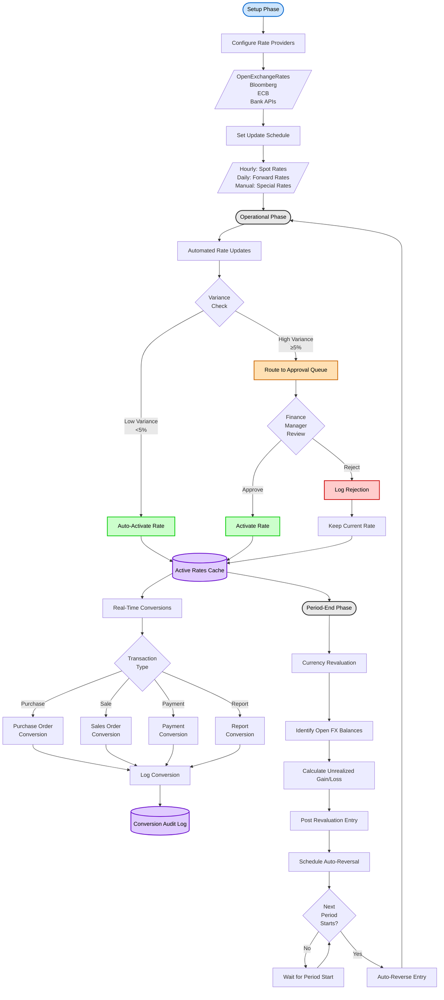

**Flow Steps**:

1. **Setup Phase**: Initial exchange rate system configuration
   - Configure external rate providers (OpenExchangeRates, Bloomberg, ECB, bank APIs)
   - Set update schedules (hourly for spot rates, daily for forward rates, manual for special rates)
   - Define variance thresholds for approval workflows
   - Set up base currency for triangulation

2. **Operational Phase**: Day-to-day rate management
   - Automated rate updates from configured providers
   - Variance checking against previous rates
   - Auto-activation for low variance (<5%) or routing to approval queue for high variance (≥5%)
   - Finance Manager approval/rejection of high-variance rates
   - Real-time currency conversions for all transaction types
   - Conversion audit logging for compliance

3. **Period-End Phase**: Monthly/quarterly revaluation
   - Identify open foreign currency balances
   - Calculate unrealized gains/losses using period-end rates
   - Post revaluation journal entries
   - Schedule automatic reversal for next period
   - Execute auto-reversal at period start

---

### Automated Exchange Rate Update Flow

**Purpose**: Automatically retrieve and validate exchange rates from external providers with failover

**Actors**: Exchange Rate Service, Rate Providers, Redis Cache, PostgreSQL Database

**Trigger**: Scheduled job (hourly/daily) or manual refresh

```mermaid
flowchart TD
    Start([Scheduled Trigger<br>Cron Job]) --> CheckSuspension{Update<br>Suspended?}
    CheckSuspension -->|Yes| Skip([Skip Update<br>Period-End Close])
    CheckSuspension -->|No| GetProviders[Get Active Providers]

    GetProviders --> Providers[/Primary: OpenExchangeRates<br>Backup: ECB<br>Tertiary: Manual/]
    Providers --> GetCurrencies[Get Enabled Currencies]
    GetCurrencies --> Currencies[/USD, EUR, GBP, JPY<br>CAD, AUD, CHF.../]

    Currencies --> LoopStart{For Each<br>Currency Pair}
    LoopStart --> BuildRequest[Build API Request]
    BuildRequest --> Request[/GET /latest.json?app_id=KEY<br>&base=USD&symbols=EUR,GBP.../]

    Request --> CallAPI[HTTP GET Request]
    CallAPI --> CheckResponse{HTTP<br>Status}

    CheckResponse -->|200 OK| ParseJSON[Parse JSON Response]
    ParseJSON --> ValidateFormat{Valid<br>JSON?}
    ValidateFormat -->|No| ErrorFormat[/Error: Invalid Response/]
    ErrorFormat --> RetryLogic

    ValidateFormat -->|Yes| ExtractRates[Extract Rate Data]
    ExtractRates --> Rates[/EUR: 0.921456<br>GBP: 0.785234<br>JPY: 149.345600/]

    CheckResponse -->|429 Rate Limit| BackoffWait[Exponential Backoff]
    BackoffWait --> RetryCount{Retry<br>< 3?}
    RetryCount -->|Yes| Wait[Wait 1min→5min→15min]
    Wait --> CallAPI
    RetryCount -->|No| RetryLogic

    CheckResponse -->|500 Server Error| RetryLogic{Retry or<br>Failover?}
    CheckResponse -->|Timeout| RetryLogic

    RetryLogic -->|Retry| CallAPI
    RetryLogic -->|Failover| NextProvider[Switch to Backup Provider]
    NextProvider --> UpdateProviderHealth[Update Provider Health Status]
    UpdateProviderHealth --> CheckProviders{More<br>Providers?}
    CheckProviders -->|Yes| GetProviders
    CheckProviders -->|No| UseCache{Cached<br>Rate?}

    UseCache -->|Yes| GetCachedRate[Get from Redis Cache]
    GetCachedRate --> FlagStale[Flag Rate as Stale]
    FlagStale --> Alert1[/Alert Finance Manager<br>Using Stale Rate/]
    Alert1 --> LogStale[Log Stale Rate Usage]
    LogStale --> Continue1[Continue Processing]

    UseCache -->|No| Alert2[/Critical Alert:<br>No Rate Available/]
    Alert2 --> LogError[Log Critical Error]
    LogError --> EndError([End: Error<br>Manual Entry Required])

    Rates --> ValidateRates[Validate Rate Values]
    ValidateRates --> CheckPositive{Rate > 0?}
    CheckPositive -->|No| ErrorNegative[/Error: Invalid Rate/]
    ErrorNegative --> LogError

    CheckPositive -->|Yes| CheckBounds{0.0001 <<br>Rate <<br>10000?}
    CheckBounds -->|No| ErrorBounds[/Error: Out of Bounds/]
    ErrorBounds --> LogError

    CheckBounds -->|Yes| GetPrevRate[Get Previous Rate]
    GetPrevRate --> PrevRate[/Previous: 0.921678/]
    PrevRate --> CalcVariance[Calculate Variance]
    CalcVariance --> Variance[/Variance: -0.024%/]

    Variance --> CheckVariance{Variance<br>> 10%?}
    CheckVariance -->|Yes| FlagSuspicious[Flag Suspicious Variance]
    FlagSuspicious --> Alert3[/Alert Finance Manager<br>Suspicious Rate Change/]
    Alert3 --> CheckApprovalThreshold

    CheckVariance -->|No| CheckApprovalThreshold{Variance<br>> 5%?}
    CheckApprovalThreshold -->|Yes| SetPending[Set Status = Pending Approval]
    SetPending --> RouteApproval[Route to Approval Queue]
    RouteApproval --> NotifyApprover[/Notify Finance Manager<br>Approval Required/]
    NotifyApprover --> LogPending[Log Pending Rate]
    LogPending --> Continue1

    CheckApprovalThreshold -->|No| SetApproved[Set Status = Approved]
    SetApproved --> Continue2[Continue]

    Continue2 --> CalcInverse[Calculate Inverse Rate]
    CalcInverse --> InverseRate[/Inverse: 1.085267/]
    InverseRate --> BeginTx[Begin DB Transaction]

    BeginTx --> DeactivateOld[Deactivate Current Rate]
    DeactivateOld --> ArchiveRate[Copy to Rate History]
    ArchiveRate --> InsertNew[Insert New Rate]
    InsertNew --> UpdateMetadata[Update Provider Metadata]
    UpdateMetadata --> Commit[Commit Transaction]

    Commit --> UpdateCache[Update Redis Cache]
    UpdateCache --> SetTTL[Set TTL = 15min]
    SetTTL --> InvalidateOld[Invalidate Old Cache Keys]
    InvalidateOld --> PublishEvent[/Publish RateUpdated Event/]
    PublishEvent --> LogSuccess[Log Successful Update]

    LogSuccess --> LoopEnd{More<br>Pairs?}
    LoopEnd -->|Yes| LoopStart
    Continue1 --> LoopEnd
    LoopEnd -->|No| GenerateSummary[Generate Update Summary]
    GenerateSummary --> Summary[/Total: 20 pairs<br>Success: 18<br>Pending: 1<br>Failed: 1/]
    Summary --> EmailSummary[/Email Summary to Finance/]
    EmailSummary --> Success([End: Success])

    style Start fill:#cce5ff,stroke:#0066cc,stroke-width:2px,color:#000
    style Success fill:#ccffcc,stroke:#00cc00,stroke-width:2px,color:#000
    style EndError fill:#ffcccc,stroke:#cc0000,stroke-width:2px,color:#000
    style Skip fill:#e8e8e8,stroke:#333,stroke-width:2px,color:#000
    style Alert1 fill:#ffe0b3,stroke:#cc6600,stroke-width:2px,color:#000
    style Alert2 fill:#ffcccc,stroke:#cc0000,stroke-width:2px,color:#000
    style Alert3 fill:#ffe0b3,stroke:#cc6600,stroke-width:2px,color:#000
    style FlagStale fill:#ffe0b3,stroke:#cc6600,stroke-width:2px,color:#000
    style FlagSuspicious fill:#ffe0b3,stroke:#cc6600,stroke-width:2px,color:#000
    style RouteApproval fill:#ffe0b3,stroke:#cc6600,stroke-width:2px,color:#000
    style BeginTx fill:#e0ccff,stroke:#6600cc,stroke-width:2px,color:#000
    style UpdateCache fill:#e0ccff,stroke:#6600cc,stroke-width:2px,color:#000
```

**Decision Points**:

| Decision | Criteria | Outcome |
|----------|----------|---------|
| Update Suspended | Period-end close in progress | Skip update/Proceed |
| HTTP Status | 200 OK, 429, 500, timeout | Parse response/Retry/Failover |
| Valid JSON | Well-formed JSON structure | Extract rates/Error |
| Rate Positive | rate > 0 | Continue/Error |
| Within Bounds | 0.0001 <= rate <= 10,000 | Continue/Error |
| Variance > 10% | ABS((new - old) / old) > 0.10 | Flag suspicious + require approval/Check 5% threshold |
| Variance > 5% | ABS((new - old) / old) > 0.05 | Require approval/Auto-approve |
| Cached Rate Available | Redis cache hit with age < 24h | Use stale/Critical alert |
| More Providers | Backup providers configured | Failover/Use cache or error |

**Exception Handling**:
- **Provider Unavailable**: Automatic failover to backup provider (ECB, Manual)
- **Invalid Response**: Retry with exponential backoff (1min, 5min, 15min), then failover
- **Rate Out of Bounds**: Reject rate, alert Treasury, use cached rate if available
- **High Variance (>10%)**: Flag suspicious, require approval, alert Finance Manager
- **No Rate Available**: Critical alert, keep current rate, manual entry required
- **Database Failure**: Rollback transaction, retry 3 times, alert and use cached rate

---

### Manual Rate Entry with Approval Flow

**Purpose**: Allow authorized users to manually enter exchange rates with automatic validation and variance-based approval routing

**Actors**: Treasury Manager/Accountant (submitter), Finance Manager/Controller (approver)

**Trigger**: User initiates manual rate entry

```mermaid
flowchart TD
    Start([User Opens Rate Entry]) --> SelectPair[Select Currency Pair]
    SelectPair --> Pair[/Source: USD<br>Target: EUR/]
    Pair --> GetCurrent[Display Current Rate]
    GetCurrent --> CurrentRate[/Current: 0.921456<br>Effective: 2025-01-13 12:00 UTC<br>Source: OpenExchangeRates/]

    CurrentRate --> GetHistory[Display Last 5 Rates]
    GetHistory --> History[/0.921456 Current<br>0.921678 -0.024%<br>0.920123 +0.145%<br>0.922034 -0.063%<br>0.921890 +0.016%/]

    History --> EnterRate[Enter New Exchange Rate]
    EnterRate --> NewRate[/0.915000/]
    NewRate --> RateType[Select Rate Type]
    RateType --> Type[/Spot/Forward/Average/<br>Month-End/Year-End/]

    Type --> EffectiveDate[Enter Effective Date/Time]
    EffectiveDate --> DateTime[/2025-01-13 15:00 UTC/]
    DateTime --> CheckForward{Forward<br>Rate?}
    CheckForward -->|Yes| EnterUntil[Enter Effective Until Date]
    EnterUntil --> UntilDate[/2025-04-13 90 days/]
    UntilDate --> Continue1[Continue]
    CheckForward -->|No| Continue1

    Continue1 --> CheckBuySell{Enter Buy/<br>Sell Rates?}
    CheckBuySell -->|Yes| EnterBuySell[Enter Buy and Sell Rates]
    EnterBuySell --> BuySell[/Buy: 0.913500<br>Sell: 0.916500<br>Spread: 0.33%/]
    BuySell --> Continue2[Continue]
    CheckBuySell -->|No| Continue2

    Continue2 --> SelectSource[Select Rate Source]
    SelectSource --> Source[/Manual Entry<br>Bank Quote<br>Broker<br>Central Bank<br>Forward Contract/]
    Source --> EnterReference[Enter Source Reference]
    EnterReference --> Reference[/Bank Quote #Q-2025-001234<br>Email from treasury@bank.com/]

    Reference --> UploadDoc{Upload<br>Supporting<br>Document?}
    UploadDoc -->|Yes| UploadFile[Upload Document]
    UploadFile --> Document[/bank_quote_20250113.pdf/]
    Document --> Continue3[Continue]
    UploadDoc -->|No| Continue3

    Continue3 --> EnterReason[Enter Reason for Manual Entry]
    EnterReason --> Reason[/Automated API unavailable<br>Unusual market conditions<br>Bank provided special rate/]

    Reason --> ClientValidate[Client-Side Validation]
    ClientValidate --> ClientCheck{All Fields<br>Valid?}
    ClientCheck -->|No| ShowErrors1[/Display Validation Errors/]
    ShowErrors1 --> HighlightFields[Highlight Invalid Fields]
    HighlightFields --> EnterRate

    ClientCheck -->|Yes| ConfirmSubmit{Review and<br>Confirm?}
    ConfirmSubmit -->|No| Edit([Return to Edit])
    Edit --> EnterRate

    ConfirmSubmit -->|Yes| Submit[Submit to Server]
    Submit --> ServerValidate[Server-Side Validation]
    ServerValidate --> CheckPositive{Rate > 0?}
    CheckPositive -->|No| Error1[/Error: Rate must be positive/]
    Error1 --> ReturnError[Return Validation Error]

    CheckPositive -->|Yes| CheckBounds{0.0001 <= Rate<br><= 10000?}
    CheckBounds -->|No| Error2[/Error: Rate out of bounds<br>Allowed: 0.0001 to 10000/]
    Error2 --> ReturnError

    CheckBounds -->|Yes| CheckCurrencies{Source ≠<br>Target?}
    CheckCurrencies -->|No| Error3[/Error: Same source and target/]
    Error3 --> ReturnError

    CheckCurrencies -->|Yes| CheckBuySellLogic{Buy/Sell<br>Rates Valid?}
    CheckBuySellLogic -->|No| Error4[/Error: Buy rate must be<br>less than or equal to sell rate/]
    Error4 --> ReturnError

    CheckBuySellLogic -->|Yes| CheckDateLogic{Effective Date<br>Valid?}
    CheckDateLogic -->|No| Error5[/Error: Effective date cannot<br>be more than 1 year in future/]
    Error5 --> ReturnError

    CheckDateLogic -->|Yes| CalcVariance[Calculate Variance from Current]
    CalcVariance --> VarianceCalc[/0.915000 - 0.921456 / 0.921456<br>= -0.007 = -0.70%/]
    VarianceCalc --> AbsVariance[/Absolute Variance: 0.70%/]

    AbsVariance --> CheckVariance{Variance<br>< 5%?}
    CheckVariance -->|Yes| AutoApprove[Set Approved = Auto]
    AutoApprove --> SetApprovalStatus[approval_status = 'approved']
    SetApprovalStatus --> Continue4[Continue to Posting]

    CheckVariance -->|No| CheckUserAuthority{User Has<br>Approval<br>Authority?}
    CheckUserAuthority -->|Yes| CheckApprovalLimit{Variance<br>Within User<br>Limit?}
    CheckApprovalLimit -->|Yes| SelfApprove[Self-Approve Rate]
    SelfApprove --> RecordApproval[Record User as Approver]
    RecordApproval --> Continue4

    CheckApprovalLimit -->|No| RouteApproval[Route to Higher Authority]
    CheckUserAuthority -->|No| RouteApproval

    RouteApproval --> DetermineApprover[Determine Required Approver]
    DetermineApprover --> ApproverRules[/Variance < 10%: Finance Manager<br>Variance 10-25%: Controller<br>Variance > 25%: CFO/]
    ApproverRules --> SetPending[Set Status = Pending Approval]
    SetPending --> SavePending[Save as Pending Rate]
    SavePending --> NotifyApprover[/Send Email to Approver<br>With Rate Details and Variance/]
    NotifyApprover --> WaitApproval([Wait for Approval])

    WaitApproval --> ApproverReview{Approver<br>Decision}
    ApproverReview -->|Approve| SetApproved[Set Status = Approved]
    SetApproved --> RecordApprover[Record Approver & Timestamp]
    RecordApprover --> ApprovalComments[Approver Enters Comments]
    ApprovalComments --> Comments[/Approved based on bank quote<br>Valid market volatility/]
    Comments --> CheckReview{Set Review<br>Expiry?}
    CheckReview -->|Yes| SetReviewDate[Set Review Date]
    SetReviewDate --> ReviewDate[/Review in 24 hours/]
    ReviewDate --> Continue4
    CheckReview -->|No| Continue4

    ApproverReview -->|Reject| SetRejected[Set Status = Rejected]
    SetRejected --> RecordRejection[Record Rejection Reason]
    RecordRejection --> RejectionReason[/Rate variance too high<br>Insufficient documentation<br>Market rate mismatch/]
    RejectionReason --> NotifySubmitter[/Notify Submitter of Rejection/]
    NotifySubmitter --> LogRejection[Log Rejection in Audit]
    LogRejection --> EndRejected([End: Rejected<br>Current Rate Remains])

    ApproverReview -->|Request Revision| RequestChanges[Request Additional Info]
    RequestChanges --> RevisionRequest[/Please provide additional<br>documentation or clarification/]
    RevisionRequest --> NotifyRevision[/Notify Submitter/]
    NotifyRevision --> WaitRevision([Wait for Revision])
    WaitRevision --> EnterRate

    Continue4 --> CalcInverse[Calculate Inverse Rate]
    CalcInverse --> Inverse[/Inverse: 1 / 0.915000<br>= 1.092896/]
    Inverse --> BeginTx[Begin Database Transaction]

    BeginTx --> CheckExisting{Current<br>Rate Exists?}
    CheckExisting -->|Yes| DeactivateCurrent[Set is_active = false on Current]
    DeactivateCurrent --> ArchiveRate[Copy to exchange_rate_history]
    ArchiveRate --> Continue5[Continue]
    CheckExisting -->|No| Continue5

    Continue5 --> InsertNewRate[Insert New Exchange Rate]
    InsertNewRate --> RateData[/rate_id: generated UUID<br>exchange_rate: 0.915000<br>inverse_rate: 1.092896<br>is_manual_entry: true<br>is_active: true<br>approval_status: 'approved'/]
    RateData --> LinkDocument{Document<br>Uploaded?}
    LinkDocument -->|Yes| LinkDoc[Link Document to Rate]
    LinkDoc --> Continue6[Continue]
    LinkDocument -->|No| Continue6

    Continue6 --> LogAudit[Insert Audit Log Entry]
    LogAudit --> AuditData[/action: 'manual_rate_entry'<br>user: submitter<br>approved_by: approver<br>variance: -0.70%<br>reason: text/]
    AuditData --> Commit[Commit Transaction]

    Commit --> InvalidateCache[Invalidate Redis Cache]
    InvalidateCache --> CacheKeys[/rate:USD:EUR:*<br>rate:EUR:USD:*/]
    CacheKeys --> UpdateCache[Update Cache with New Rate]
    UpdateCache --> SetCacheTTL[Set TTL = 15 minutes]
    SetCacheTTL --> PublishEvent[/Publish RateManualEntry Event/]
    PublishEvent --> NotifyStakeholders[/Notify Finance Team<br>Rate Updated Manually/]
    NotifyStakeholders --> Success([End: Success<br>Rate Active])

    ReturnError --> ShowErrors2[/Display Server Error/]
    ShowErrors2 --> ShowErrors1

    style Start fill:#cce5ff,stroke:#0066cc,stroke-width:2px,color:#000
    style Success fill:#ccffcc,stroke:#00cc00,stroke-width:2px,color:#000
    style EndRejected fill:#ffcccc,stroke:#cc0000,stroke-width:2px,color:#000
    style Edit fill:#ffe0b3,stroke:#cc6600,stroke-width:2px,color:#000
    style WaitApproval fill:#ffe0b3,stroke:#cc6600,stroke-width:2px,color:#000
    style WaitRevision fill:#ffe0b3,stroke:#cc6600,stroke-width:2px,color:#000
    style RouteApproval fill:#ffe0b3,stroke:#cc6600,stroke-width:2px,color:#000
    style Error1 fill:#ffcccc,stroke:#cc0000,stroke-width:2px,color:#000
    style Error2 fill:#ffcccc,stroke:#cc0000,stroke-width:2px,color:#000
    style Error3 fill:#ffcccc,stroke:#cc0000,stroke-width:2px,color:#000
    style Error4 fill:#ffcccc,stroke:#cc0000,stroke-width:2px,color:#000
    style Error5 fill:#ffcccc,stroke:#cc0000,stroke-width:2px,color:#000
    style BeginTx fill:#e0ccff,stroke:#6600cc,stroke-width:2px,color:#000
    style InvalidateCache fill:#e0ccff,stroke:#6600cc,stroke-width:2px,color:#000
```

**Decision Points**:

| Decision | Criteria | Outcome |
|----------|----------|---------|
| Rate Positive | rate > 0 | Continue/Error |
| Within Bounds | 0.0001 <= rate <= 10,000 | Continue/Error |
| Buy <= Sell | buy_rate <= sell_rate OR both null | Continue/Error |
| Variance < 5% | ABS((new - old) / old) < 0.05 | Auto-approve/Require approval |
| User Has Authority | User role allows approval for variance level | Self-approve/Route to approver |
| Approver Decision | Approve, Reject, or Request Revision | Activate rate/Keep current/Return to submitter |
| Set Review Expiry | Approver wants follow-up review | Set reminder/No reminder |

**Approval Authority Matrix**:
| Variance Range | Required Approver | Example Roles |
|----------------|-------------------|---------------|
| < 5% | Auto-approved | N/A |
| 5% - 10% | Finance Manager | Finance Manager, Treasury Manager |
| 10% - 25% | Controller | Financial Controller |
| > 25% | CFO | Chief Financial Officer |

---

### Rate Approval Workflow

**Purpose**: Process pending exchange rates through variance-based approval routing

**Actors**: Finance Manager, Financial Controller, CFO

**Trigger**: Rate enters approval queue (automated update or manual entry with variance ≥ 5%)

```mermaid
flowchart TD
    Start([Rate Enters Approval Queue]) --> GetRateData[Retrieve Rate Details]
    GetRateData --> RateInfo[/Currency Pair: USD→EUR<br>Proposed Rate: 0.915000<br>Current Rate: 0.921456<br>Variance: -0.70%<br>Source: Manual Entry<br>Submitter: John Smith/]

    RateInfo --> DetermineApprover[Determine Required Approver]
    DetermineApprover --> CheckVariance{Variance<br>Level}

    CheckVariance -->|5-10%| AssignManager[Assign to Finance Manager]
    AssignManager --> ManagerLevel[/Approver: Sarah Johnson<br>Role: Finance Manager<br>Limit: Up to 10% variance/]
    ManagerLevel --> Continue1[Continue]

    CheckVariance -->|10-25%| AssignController[Assign to Controller]
    AssignController --> ControllerLevel[/Approver: Michael Chen<br>Role: Financial Controller<br>Limit: Up to 25% variance/]
    ControllerLevel --> Continue1

    CheckVariance -->|> 25%| AssignCFO[Assign to CFO]
    AssignCFO --> CFOLevel[/Approver: Patricia Williams<br>Role: Chief Financial Officer<br>Limit: Unlimited/]
    CFOLevel --> Continue1

    Continue1 --> SendNotification[Send Email Notification]
    SendNotification --> Email[/To: Approver<br>Subject: Exchange Rate Approval Required<br>Priority: High if > 10% variance<br>Link: Approval Dashboard/]
    Email --> UpdateQueue[Update Approval Queue]
    UpdateQueue --> QueueStatus[/Status: Pending<br>Assigned To: Approver<br>Created: Timestamp<br>SLA: 24 hours/]

    QueueStatus --> WaitApproval([Wait for Approver Action])
    WaitApproval --> CheckSLA{24 Hours<br>Elapsed?}
    CheckSLA -->|Yes| EscalateApproval[Escalate to Next Level]
    EscalateApproval --> SendEscalation[/Send Escalation Email<br>To: Higher Authority<br>CC: Original Approver/]
    SendEscalation --> WaitApproval

    CheckSLA -->|No| ApproverOpens[Approver Opens Request]
    ApproverOpens --> DisplayComparison[Display Comprehensive Comparison]
    DisplayComparison --> Comparison[/Proposed Rate: 0.915000<br>Current Rate: 0.921456<br>Variance: -0.70%<br><br>Last 5 Rates:<br>0.921456, 0.921678, 0.920123<br>0.922034, 0.921890<br><br>External Comparison:<br>OpenExchangeRates: 0.921234<br>ECB: 0.920987<br>Bloomberg: 0.921567<br>Average: 0.921197<br><br>Proposed vs External Avg:<br>-0.67% difference<br><br>Supporting Documents:<br>bank_quote_20250113.pdf<br><br>Submitter Notes:<br>Unusual market volatility<br>Using bank quote/]

    Comparison --> CheckDocs{Supporting<br>Documents<br>Provided?}
    CheckDocs -->|No| RequestDocs[Request Additional Documentation]
    RequestDocs --> NotifySubmitter1[/Notify Submitter<br>Additional Info Needed/]
    NotifySubmitter1 --> WaitDocs([Wait for Documents])
    WaitDocs --> ApproverOpens

    CheckDocs -->|Yes| ReviewDocs[Review Supporting Documents]
    ReviewDocs --> ValidateDocs{Documents<br>Valid?}
    ValidateDocs -->|No| RejectDocs[Documents Insufficient]
    RejectDocs --> Decision1{Reject or<br>Request<br>Revision?}
    Decision1 -->|Reject| RejectRate
    Decision1 -->|Request Revision| RequestRevision

    ValidateDocs -->|Yes| CompareExternal[Compare with External Sources]
    CompareExternal --> ExternalCheck{Within 1%<br>of External<br>Average?}
    ExternalCheck -->|No| FlagDiscrepancy[Flag Major Discrepancy]
    FlagDiscrepancy --> Warning[/Warning: Proposed rate differs<br>significantly from market rates/]
    Warning --> Decision2{Approve with<br>Discrepancy?}
    Decision2 -->|No| RejectRate
    Decision2 -->|Yes| ContinueApprove[Continue to Approval]

    ExternalCheck -->|Yes| ContinueApprove
    ContinueApprove --> CheckMarket[Check Market Conditions]
    CheckMarket --> MarketNews[/Check: Recent news, volatility,<br>central bank announcements/]
    MarketNews --> ReasonableRate{Rate<br>Reasonable<br>for Market?}

    ReasonableRate -->|No| RejectRate[Reject Rate]
    ReasonableRate -->|Yes| ApproverDecision{Approver<br>Decision}

    ApproverDecision -->|Approve| EnterComments[Enter Approval Comments]
    EnterComments --> ApprovalComments[/Approved based on bank quote<br>Market volatility confirmed<br>within acceptable range/]
    ApprovalComments --> SetReview{Set<br>Review<br>Reminder?}
    SetReview -->|Yes| ReviewPeriod[Enter Review Period]
    ReviewPeriod --> ReviewHours[/24 hours / 48 hours / 1 week/]
    ReviewHours --> Continue2[Continue]
    SetReview -->|No| Continue2

    Continue2 --> RecordApproval[Record Approval]
    RecordApproval --> ApprovalData[/approved_by: Approver ID<br>approved_date: Timestamp<br>approval_comments: Text<br>review_expiry_date: Date if set/]
    ApprovalData --> ActivateRate[Activate Exchange Rate]
    ActivateRate --> RateActivation[/is_active: true<br>approval_status: 'approved'/]

    RateActivation --> DeactivateOld[Deactivate Previous Rate]
    DeactivateOld --> UpdateQueue1[Remove from Approval Queue]
    UpdateQueue1 --> InvalidateCache[Invalidate Cache]
    InvalidateCache --> NotifySubmitter2[/Notify Submitter<br>Rate Approved/]
    NotifySubmitter2 --> NotifyFinance[/Notify Finance Team<br>New Rate Active/]
    NotifyFinance --> CheckReview2{Review<br>Scheduled?}
    CheckReview2 -->|Yes| ScheduleReminder[Create Review Task]
    ScheduleReminder --> ReminderTask[/Task: Review USD→EUR Rate<br>Assigned: Approver<br>Due: Review expiry date/]
    ReminderTask --> Success([End: Approved<br>Rate Active])
    CheckReview2 -->|No| Success

    ApproverDecision -->|Reject| RejectRate
    RejectRate --> EnterRejection[Enter Rejection Reason]
    EnterRejection --> RejectionReason[/Variance too high<br>Insufficient documentation<br>Rate not supported by market<br>Incorrect source reference/]
    RejectionReason --> RecordRejection[Record Rejection]
    RecordRejection --> RejectionData[/rejection_reason: Text<br>rejected_by: Approver ID<br>rejected_date: Timestamp<br>approval_status: 'rejected'/]
    RejectionData --> UpdateQueue2[Remove from Approval Queue]
    UpdateQueue2 --> KeepCurrent[Keep Current Rate Active]
    KeepCurrent --> NotifySubmitter3[/Notify Submitter<br>Rate Rejected<br>Reason: Text/]
    NotifySubmitter3 --> LogRejection[Log Rejection in Audit]
    LogRejection --> EndRejected([End: Rejected<br>Current Rate Remains])

    ApproverDecision -->|Request Revision| RequestRevision[Request Revision]
    RequestRevision --> RevisionRequest[Enter Revision Request]
    RevisionRequest --> RevisionText[/Please provide additional<br>documentation from bank<br>Clarify market conditions<br>Explain variance calculation/]
    RevisionText --> SendRevision[/Send to Submitter<br>With Revision Request/]
    SendRevision --> KeepInQueue[Keep in Approval Queue]
    KeepInQueue --> WaitRevision([Wait for Submitter Revision])

    style Start fill:#cce5ff,stroke:#0066cc,stroke-width:2px,color:#000
    style Success fill:#ccffcc,stroke:#00cc00,stroke-width:2px,color:#000
    style EndRejected fill:#ffcccc,stroke:#cc0000,stroke-width:2px,color:#000
    style WaitApproval fill:#ffe0b3,stroke:#cc6600,stroke-width:2px,color:#000
    style WaitDocs fill:#ffe0b3,stroke:#cc6600,stroke-width:2px,color:#000
    style WaitRevision fill:#ffe0b3,stroke:#cc6600,stroke-width:2px,color:#000
    style RequestRevision fill:#ffe0b3,stroke:#cc6600,stroke-width:2px,color:#000
    style FlagDiscrepancy fill:#ffe0b3,stroke:#cc6600,stroke-width:2px,color:#000
    style Warning fill:#ffe0b3,stroke:#cc6600,stroke-width:2px,color:#000
    style RejectRate fill:#ffcccc,stroke:#cc0000,stroke-width:2px,color:#000
    style EscalateApproval fill:#ffe0b3,stroke:#cc6600,stroke-width:2px,color:#000
```

**SLA and Escalation**:
- **Initial Assignment**: Within 5 minutes of rate submission
- **Approval SLA**: 24 hours for standard rates, 4 hours for critical rates
- **Escalation**: After 24 hours, escalate to next approval level
- **Weekend/Holiday**: SLA extends to next business day

---

### Real-Time Currency Conversion Flow

**Purpose**: Convert amounts from one currency to another using current exchange rates with caching for performance

**Actors**: Currency Conversion Engine, Exchange Rate Service, Redis Cache, PostgreSQL Database

**Trigger**: User or system requests currency conversion

```mermaid
flowchart TD
    Start([Conversion Requested]) --> GetParams[Parse Conversion Parameters]
    GetParams --> Params[/Source Currency: USD<br>Target Currency: EUR<br>Amount: 1000.00<br>Conversion Date: 2025-01-13<br>Rate Type: spot/]

    Params --> ValidateParams[Validate Parameters]
    ValidateParams --> CheckAmount{Amount > 0?}
    CheckAmount -->|No| ErrorAmount[/Error: Amount must be positive/]
    ErrorAmount --> EndError([End: Error])

    CheckAmount -->|Yes| CheckCurrencies{Source ≠<br>Target?}
    CheckCurrencies -->|No| ErrorSame[/Error: Same currency<br>No conversion needed/]
    ErrorSame --> EndError

    CheckCurrencies -->|Yes| CheckActive{Both<br>Currencies<br>Active?}
    CheckActive -->|No| ErrorInactive[/Error: Inactive currency/]
    ErrorInactive --> EndError

    CheckActive -->|Yes| CheckCache{Rate in<br>Redis Cache?}
    CheckCache -->|Yes| GetCachedRate[Retrieve from Cache]
    GetCachedRate --> CachedRate[/Key: rate:USD:EUR:2025-01-13:spot<br>Value: 0.921456<br>TTL: 12 minutes remaining/]
    CachedRate --> CheckTTL{TTL<br>Valid?}
    CheckTTL -->|Yes| UseCache[Use Cached Rate]
    CheckTTL -->|No| RefreshCache[Refresh from Database]

    CheckCache -->|No| RefreshCache
    RefreshCache --> QueryDB[Query exchange_rates Table]
    QueryDB --> DBQuery[/SELECT * FROM exchange_rates<br>WHERE source_currency = 'USD'<br>AND target_currency = 'EUR'<br>AND effective_date <= '2025-01-13'<br>AND rate_type = 'spot'<br>AND is_active = true<br>ORDER BY effective_date DESC<br>LIMIT 1/]

    DBQuery --> RateFound{Rate<br>Found?}
    RateFound -->|No| CheckTriangulation{Base<br>Currency<br>Available?}
    CheckTriangulation -->|Yes| TriangulateRate[Use Triangulation]
    CheckTriangulation -->|No| ErrorNoRate[/Error: No rate available<br>for USD→EUR on 2025-01-13/]
    ErrorNoRate --> EndError

    RateFound -->|Yes| FetchRate[Fetch Rate Record]
    FetchRate --> Rate[/Exchange Rate: 0.921456<br>Source: OpenExchangeRates<br>Effective: 2025-01-13 12:00 UTC<br>Confidence: 98%/]
    Rate --> UpdateCache[Update Redis Cache]
    UpdateCache --> SetTTL[Set TTL = 15 minutes]
    SetTTL --> UseCache

    UseCache --> InitDecimal[Initialize Decimal.js]
    InitDecimal --> CreateAmount[Create Decimal Amount]
    CreateAmount --> DecimalAmount[/Decimal(1000.00)<br>Precision: 6 decimal places/]
    DecimalAmount --> CreateRate[Create Decimal Rate]
    CreateRate --> DecimalRate[/Decimal(0.921456)/]

    DecimalRate --> Multiply[Multiply with High Precision]
    Multiply --> Calculation[/1000.00 × 0.921456<br>= 921.456000/]
    Calculation --> GetRounding[Get Currency Rounding Rules]
    GetRounding --> RoundingRule[/Target Currency: EUR<br>Rounding: Standard<br>Precision: 0.01 (2 decimals)/]

    RoundingRule --> ApplyRounding[Apply Rounding]
    ApplyRounding --> RoundedAmount[/921.456000 → 921.46<br>Method: Half-Even (Banker's)/]
    RoundedAmount --> CheckTolerance{Rounding<br>Difference<br>> 0.01?}
    CheckTolerance -->|Yes| LogRounding[Log Rounding Adjustment]
    LogRounding --> RoundingLog[/Original: 921.456000<br>Rounded: 921.46<br>Difference: 0.004<br>Method: Half-Even/]
    RoundingLog --> Continue1[Continue]
    CheckTolerance -->|No| Continue1

    Continue1 --> CalcInverse[Calculate Inverse Rate]
    CalcInverse --> InverseRate[/1 / 0.921456 = 1.085267/]
    InverseRate --> BuildResponse[Build Conversion Response]
    BuildResponse --> Response[/Source Amount: 1000.00 USD<br>Target Amount: 921.46 EUR<br>Exchange Rate: 0.921456<br>Inverse Rate: 1.085267<br>Rate Type: spot<br>Rate Source: OpenExchangeRates<br>Conversion Method: Direct<br>Rate Effective: 2025-01-13 12:00 UTC<br>Rate Age: 3 hours<br>Confidence: 98%<br>Conversion Timestamp: 2025-01-13 15:00 UTC/]

    Response --> LogConversion[Log Conversion to Audit]
    LogConversion --> AuditLog[/INSERT INTO currency_conversions<br>Values: All conversion details<br>User: Current user<br>Session: Session ID<br>Purpose: Transaction/Report/Estimation/]
    AuditLog --> UpdateStats[Update Rate Usage Statistics]
    UpdateStats --> StatUpdate[/exchange_rates.transaction_count += 1<br>exchange_rates.last_used_date = NOW()/]
    StatUpdate --> Success([End: Conversion Complete])

    TriangulateRate --> GetBaseCurrency[Get Base Currency Rate]
    GetBaseCurrency --> BaseCurrency[/Base: USD<br>Need: USD→EUR<br>Have: USD→GBP, GBP→EUR/]
    BaseCurrency --> GetRate1[Get USD→GBP Rate]
    GetRate1 --> Rate1[/USD→GBP: 0.785234/]
    Rate1 --> GetRate2[Get GBP→EUR Rate]
    GetRate2 --> Rate2[/GBP→EUR: 1.173456/]
    Rate2 --> TriangulateCalc[Calculate Triangulated Rate]
    TriangulateCalc --> TriangulatedRate[/USD→EUR = USD→GBP × GBP→EUR<br>= 0.785234 × 1.173456<br>= 0.921234/]
    TriangulatedRate --> FlagTriangulated[Flag as Triangulated]
    FlagTriangulated --> TriangulationData[/Conversion Method: Triangulated<br>Base Currency: GBP<br>Rate Path: USD→GBP→EUR<br>Confidence: 95% (slightly lower)/]
    TriangulationData --> UseCache

    style Start fill:#cce5ff,stroke:#0066cc,stroke-width:2px,color:#000
    style Success fill:#ccffcc,stroke:#00cc00,stroke-width:2px,color:#000
    style EndError fill:#ffcccc,stroke:#cc0000,stroke-width:2px,color:#000
    style ErrorAmount fill:#ffcccc,stroke:#cc0000,stroke-width:2px,color:#000
    style ErrorSame fill:#ffcccc,stroke:#cc0000,stroke-width:2px,color:#000
    style ErrorInactive fill:#ffcccc,stroke:#cc0000,stroke-width:2px,color:#000
    style ErrorNoRate fill:#ffcccc,stroke:#cc0000,stroke-width:2px,color:#000
    style UpdateCache fill:#e0ccff,stroke:#6600cc,stroke-width:2px,color:#000
    style LogConversion fill:#e0ccff,stroke:#6600cc,stroke-width:2px,color:#000
    style TriangulateRate fill:#ffe0b3,stroke:#cc6600,stroke-width:2px,color:#000
```

**Conversion Precision**:
- Exchange rates: 6 decimal places (DECIMAL(18,6))
- Intermediate calculations: Full precision using Decimal.js
- Final amounts: Currency-specific (0-4 decimal places)
- Rounding method: Half-Even (Banker's rounding) to minimize bias

**Caching Strategy**:
- Cache key format: `rate:{source}:{target}:{date}:{type}`
- TTL: 15 minutes for current spot rates, 1 hour for historical, 24 hours for month-end/year-end
- Cache miss: Query database and update cache
- Cache invalidation: On rate update for same currency pair

---

### Triangulated Currency Conversion Flow

**Purpose**: Convert between currencies when direct exchange rate not available by using intermediate base currency

**Actors**: Currency Conversion Engine, Exchange Rate Service

**Trigger**: Direct rate not available, triangulation requested

```mermaid
flowchart TD
    Start([Direct Rate Not Found]) --> GetBaseCurrency[Identify Base Currency]
    GetBaseCurrency --> BaseCurrency[/Organization Base: USD/]
    BaseCurrency --> CheckSource{Source =<br>Base?}

    CheckSource -->|Yes| Path1[Path: Base→Target]
    Path1 --> GetRate1[Get USD→EUR Rate]
    GetRate1 --> Rate1[/USD→EUR: 0.921456/]
    Rate1 --> SingleConversion[Single Conversion]
    SingleConversion --> Result1[/JPY→USD→EUR<br>Source→Base→Target/]
    Result1 --> Continue1[Continue]

    CheckSource -->|No| CheckTarget{Target =<br>Base?}
    CheckTarget -->|Yes| Path2[Path: Source→Base]
    Path2 --> GetRate2[Get GBP→USD Rate]
    GetRate2 --> Rate2[/GBP→USD: 1.267890/]
    Rate2 --> SingleConversion

    CheckTarget -->|No| Path3[Path: Source→Base→Target]
    Path3 --> GetRate3[Get Source→Base Rate]
    GetRate3 --> SourceBaseRate[/GBP→USD: 1.267890/]
    SourceBaseRate --> GetRate4[Get Base→Target Rate]
    GetRate4 --> BaseTargetRate[/USD→EUR: 0.921456/]
    BaseTargetRate --> DoubleConversion[Double Conversion]
    DoubleConversion --> Result2[/GBP→USD→EUR<br>Source→Base→Target/]
    Result2 --> Continue1

    Continue1 --> ValidateRates{All Rates<br>Available?}
    ValidateRates -->|No| Error[/Error: Cannot triangulate<br>Missing intermediate rate/]
    Error --> EndError([End: Error])

    ValidateRates -->|Yes| CheckRateAge{All Rates<br>Current?}
    CheckRateAge -->|No| Warning[/Warning: Using stale rate<br>for triangulation/]
    Warning --> FlagStale[Flag Conversion as Stale]
    FlagStale --> Continue2[Continue]
    CheckRateAge -->|Yes| Continue2

    Continue2 --> CalcTriangulated[Calculate Triangulated Rate]
    CalcTriangulated --> Calculation[/Example: GBP→USD→EUR<br>GBP→USD = 1.267890<br>USD→EUR = 0.921456<br>GBP→EUR = 1.267890 × 0.921456<br>= 1.168345/]

    Calculation --> ValidateResult{Result<br>Reasonable?}
    ValidateResult -->|No| ErrorBounds[/Error: Triangulated rate<br>out of reasonable bounds/]
    ErrorBounds --> EndError

    ValidateResult -->|Yes| AdjustConfidence[Adjust Confidence Level]
    AdjustConfidence --> Confidence[/Direct Rate Confidence: 98%<br>Triangulated Confidence: 95%<br>Penalty: -3% for triangulation/]

    Confidence --> PerformConversion[Perform Conversion]
    PerformConversion --> ConversionCalc[/Amount: 1000.00 GBP<br>Rate: 1.168345 GBP→EUR<br>Result: 1168.35 EUR/]
    ConversionCalc --> BuildResponse[Build Response with Metadata]
    BuildResponse --> Response[/Source: 1000.00 GBP<br>Target: 1168.35 EUR<br>Conversion Method: Triangulated<br>Base Currency: USD<br>Rate Path: GBP→USD→EUR<br>Triangulated Rate: 1.168345<br>Confidence: 95%<br>Rates Used:<br>  GBP→USD: 1.267890<br>  USD→EUR: 0.921456/]

    Response --> LogTriangulation[Log Triangulation Details]
    LogTriangulation --> AuditLog[/conversion_method: 'triangulated'<br>base_currency: 'USD'<br>intermediate_rates: JSON<br>confidence_level: 95/]
    AuditLog --> Success([End: Success])

    style Start fill:#cce5ff,stroke:#0066cc,stroke-width:2px,color:#000
    style Success fill:#ccffcc,stroke:#00cc00,stroke-width:2px,color:#000
    style EndError fill:#ffcccc,stroke:#cc0000,stroke-width:2px,color:#000
    style Error fill:#ffcccc,stroke:#cc0000,stroke-width:2px,color:#000
    style ErrorBounds fill:#ffcccc,stroke:#cc0000,stroke-width:2px,color:#000
    style Warning fill:#ffe0b3,stroke:#cc6600,stroke-width:2px,color:#000
    style FlagStale fill:#ffe0b3,stroke:#cc6600,stroke-width:2px,color:#000
```

**Triangulation Paths**:
1. **Source = Base**: Base→Target (1 rate)
2. **Target = Base**: Source→Base (1 rate)
3. **Neither**: Source→Base→Target (2 rates)

**Triangulation Examples**:
```yaml
Example 1: GBP to EUR (Base: USD)
  Path: GBP→USD→EUR
  Rates:
    GBP→USD: 1.267890
    USD→EUR: 0.921456
  Calculation:
    GBP→EUR = 1.267890 × 0.921456 = 1.168345
  Confidence: 95% (3% penalty)

Example 2: JPY to GBP (Base: USD)
  Path: JPY→USD→GBP
  Rates:
    JPY→USD: 0.006896 (1 JPY = 0.006896 USD)
    USD→GBP: 0.788832
  Calculation:
    JPY→GBP = 0.006896 × 0.788832 = 0.005440
  Confidence: 95%

Example 3: CAD to AUD (Base: USD)
  Path: CAD→USD→AUD
  Rates:
    CAD→USD: 0.734562
    USD→AUD: 1.523456
  Calculation:
    CAD→AUD = 0.734562 × 1.523456 = 1.119234
  Confidence: 95%
```

---

### Period-End Revaluation Flow

**Purpose**: Execute comprehensive 7-phase period-end currency revaluation wizard for IAS 21 compliance

**Actors**: Accountant, Revaluation Service, Exchange Rate Service, Posting Engine, Scheduler

**Trigger**: Month-end/quarter-end/year-end close process

```mermaid
flowchart TD
    Start([Accountant Initiates<br>Revaluation]) --> Phase1[Phase 1: Configuration]
    Phase1 --> SelectPeriod[Select Accounting Period]
    SelectPeriod --> Period[/Period: 2025-01<br>Type: Month-End/]
    Period --> SelectDate[Select Revaluation Date]
    SelectDate --> Date[/Date: 2025-01-31<br>Time: 23:59:59 UTC/]
    Date --> SelectCurrencies[Select Currencies to Revalue]
    SelectCurrencies --> Currencies[/Currencies:<br>☑ GBP<br>☑ EUR<br>☑ JPY<br>☐ CAD<br>☐ AUD/]

    Currencies --> SelectAccounts[Select Account Types]
    SelectAccounts --> Accounts[/Account Types:<br>☑ Accounts Receivable<br>☑ Accounts Payable<br>☑ Cash and Bank Accounts<br>☐ Inventory Non-Monetary<br>☐ Fixed Assets Non-Monetary/]
    Accounts --> ConfirmConfig{Review<br>Configuration}
    ConfirmConfig -->|No| Phase1
    ConfirmConfig -->|Yes| Phase2[Phase 2: Rate Retrieval]

    Phase2 --> RetrieveRates[Retrieve Period-End Rates]
    RetrieveRates --> CheckAutomated{Automated<br>Rates<br>Available?}
    CheckAutomated -->|Yes| GetAutomated[Get from Rate Providers]
    GetAutomated --> AutoRates[/GBP: 1.2800 OpenExchangeRates<br>EUR: 1.0850 ECB<br>JPY: Not Available/]
    AutoRates --> Continue1[Continue]

    CheckAutomated -->|No| Continue1
    Continue1 --> CheckMissing{Missing<br>Rates?}
    CheckMissing -->|Yes| DisplayMissing[Display Missing Currencies]
    DisplayMissing --> MissingList[/Missing Rates:<br>• JPY: No rate for 2025-01-31/]
    MissingList --> UserAction{User<br>Action}
    UserAction -->|Cancel| CancelReval([Cancel Revaluation])
    UserAction -->|Manual Entry| EnterManual[Enter Missing Rates Manually]
    EnterManual --> ManualRate[/JPY: 0.00690<br>Source: Bank Quote<br>Reference: Q-2025-001234/]
    ManualRate --> CheckMissing

    CheckMissing -->|No| DisplayRates[Display All Retrieved Rates]
    DisplayRates --> RatesList[/GBP/USD: 1.2800<br>Source: OpenExchangeRates<br>Effective: 2025-01-31 23:59:59<br><br>EUR/USD: 1.0850<br>Source: ECB<br>Effective: 2025-01-31 23:59:59<br><br>JPY/USD: 0.00690<br>Source: Manual Entry<br>Effective: 2025-01-31 23:59:59/]
    RatesList --> ConfirmRates{Approve<br>Rates?}
    ConfirmRates -->|No| EnterManual
    ConfirmRates -->|Yes| Phase3[Phase 3: Balance Identification]

    Phase3 --> QueryBalances[Query Open Foreign Balances]
    QueryBalances --> BalanceQuery[/SELECT account, currency,<br>SUM(amount_fc) as balance_fc,<br>SUM(amount_bc) as balance_bc<br>FROM transactions<br>WHERE currency != base_currency<br>AND is_settled = false<br>AND account_type IN (selected types)<br>GROUP BY account, currency/]

    BalanceQuery --> FilterMonetary[Filter Monetary Items Only]
    FilterMonetary --> ExcludeNonMonetary[/Exclude:<br>• Inventory (subject to LCM rule)<br>• Fixed Assets (historical cost)<br>• Prepaid Expenses<br>• Deferred Revenue/]
    ExcludeNonMonetary --> DisplayBalances[Display Open Balances]
    DisplayBalances --> BalancesList[/Account: 1200 - AR GBP<br>  Balance: £15,000.00<br>  Base: $19,125.00 (various rates)<br><br>Account: 2100 - AP EUR<br>  Balance: €20,000.00<br>  Base: $21,600.00 @ 1.0800<br><br>Account: 1110 - Cash GBP<br>  Balance: £10,000.00<br>  Base: $12,750.00 @ 1.2750/]

    BalancesList --> ReviewBalances{Review<br>Balances?}
    ReviewBalances -->|Issues Found| ResolveIssues[Resolve Discrepancies]
    ResolveIssues --> QueryBalances
    ReviewBalances -->|OK| Phase4[Phase 4: Calculation]

    Phase4 --> CalcRevaluation[Calculate Revaluation Adjustments]
    CalcRevaluation --> LoopAccounts[For Each Foreign Balance:]
    LoopAccounts --> Calc1[/'AR GBP £15,000.00:<br>Original Base: $19,125.00<br>Revalued: £15,000 × 1.2800 = $19,200.00<br>Unrealized Gain: $75.00'/]

    Calc1 --> Calc2[/'AP EUR €20,000.00:<br>Original Base: $21,600.00<br>Revalued: €20,000 × 1.0850 = $21,700.00<br>Unrealized Loss: $100.00'/]

    Calc2 --> Calc3[/'Cash GBP £10,000.00:<br>Original Base: $12,750.00<br>Revalued: £10,000 × 1.2800 = $12,800.00<br>Unrealized Gain: $50.00'/]

    Calc3 --> SumGains[Sum Total Gains]
    SumGains --> TotalGains[/$125.00<br>(AR: $75 + Cash: $50)/]
    TotalGains --> SumLosses[Sum Total Losses]
    SumLosses --> TotalLosses[/$100.00<br>(AP: $100)/]
    TotalLosses --> CalcNet[Calculate Net Gain/Loss]
    CalcNet --> NetAmount[/Net Gain: $25.00<br>($125 gains - $100 losses)/]

    NetAmount --> DisplayCalc[Display Calculation Summary]
    DisplayCalc --> Summary[/Total Accounts: 3<br>Accounts with Gains: 2<br>Accounts with Losses: 1<br>Total Realized Gain: $0.00<br>Total Unrealized Gain: $125.00<br>Total Realized Loss: $0.00<br>Total Unrealized Loss: $100.00<br>Net Impact: $25.00 Gain/]
    Summary --> Phase5[Phase 5: Preview]

    Phase5 --> BuildJE[Construct Revaluation Journal Entry]
    BuildJE --> AddGainEntries[Add Gain Adjustment Entries]
    AddGainEntries --> GainLines[/Debit: 1200 - AR GBP     $75.00<br>Debit: 1110 - Cash GBP    $50.00/]
    GainLines --> AddLossEntries[Add Loss Adjustment Entries]
    AddLossEntries --> LossLines[/Credit: 2100 - AP EUR     $100.00/]
    LossLines --> AddNetEntry[Add Net P&L Entry]
    AddNetEntry --> NetEntry[/Credit: 7210 - Unrealized<br>        Exchange Gain $125.00<br>Debit:  7210 - Unrealized<br>        Exchange Loss $100.00/]

    NetEntry --> DisplayJE[Display Complete Journal Entry]
    DisplayJE --> JEPreview[/Journal Entry: REVAL-2501-0001<br>Date: 2025-01-31<br>Description: Period-end currency revaluation<br><br>Debit  1200 AR GBP              $75.00<br>Debit  1110 Cash GBP            $50.00<br>Debit  7210 Unreal Exch Loss   $100.00<br>Credit 2100 AP EUR             $100.00<br>Credit 7210 Unreal Exch Gain   $125.00<br><br>Total Debits:  $225.00<br>Total Credits: $225.00<br>Net P&L Impact: $25.00 Gain/]

    JEPreview --> CheckMaterial{Net Impact<br>> $10,000?}
    CheckMaterial -->|Yes| RequireCFO[Require CFO Approval]
    RequireCFO --> SetPendingCFO[Status: Pending CFO Approval]
    SetPendingCFO --> NotifyCFO[/Email CFO for Approval<br>Subject: Revaluation Approval Required<br>Net Impact: $25.00 Gain/]
    NotifyCFO --> WaitCFO([Wait for CFO Approval])
    WaitCFO --> CFODecision{CFO<br>Approves?}
    CFODecision -->|No| RejectReval([End: Rejected by CFO])
    CFODecision -->|Yes| Continue2[Continue]
    CheckMaterial -->|No| Continue2

    Continue2 --> UserConfirm{Confirm<br>Posting?}
    UserConfirm -->|No| EditReval([Return to Edit Configuration])
    EditReval --> Phase1
    UserConfirm -->|Yes| Phase6[Phase 6: Posting]

    Phase6 --> BeginTx[Begin Database Transaction]
    BeginTx --> InsertRevaluation[Insert Revaluation Batch]
    InsertRevaluation --> BatchData[/batch_id: generated UUID<br>batch_number: REVAL-2501-0001<br>revaluation_date: 2025-01-31<br>fiscal_period: FY2025-01<br>currencies: [GBP, EUR, JPY]<br>status: 'in_progress'/]

    BatchData --> InsertLines[Insert Revaluation Lines]
    InsertLines --> LineData[/3 lines:<br>AR GBP: $75 gain<br>AP EUR: $100 loss<br>Cash GBP: $50 gain/]
    LineData --> PostJE[Post Journal Entry]
    PostJE --> JEPosting[/Journal Entry ID: generated<br>Posted to GL accounts<br>Account balances updated/]

    JEPosting --> UpdateBalances[Update Account Balances]
    UpdateBalances --> BalanceUpdates[/1200 AR: +$75 (base only)<br>2100 AP: -$100 (base only)<br>1110 Cash: +$50 (base only)<br>7210 Gain/Loss: Net $25 gain<br><br>Note: Foreign currency balances<br>remain unchanged/]

    BalanceUpdates --> LogGainLoss[Insert Gain/Loss Log Entries]
    LogGainLoss --> LogData[/3 entries in gain_loss_log:<br>One per revaluation line<br>With all calculation details/]
    LogData --> UpdateStatus[Set Status = Posted]
    UpdateStatus --> CommitTx[Commit Transaction]
    CommitTx --> Phase7[Phase 7: Reversal Scheduling]

    Phase7 --> CalcReversalDate[Calculate Reversal Date]
    CalcReversalDate --> ReversalDate[/Next Period Start:<br>2025-02-01 00:00:01 UTC/]
    ReversalDate --> CreateJob[Create Scheduled Job]
    CreateJob --> JobDetails[/Job Type: Cron<br>Schedule: Daily at 00:00:00 UTC<br>Condition: IF current_date = 2025-02-01<br>Action: Execute auto-reversal<br>Parameters: batch_id, reversal details/]

    JobDetails --> SetFlags[Set Reversal Flags]
    SetFlags --> Flags[/automatic_reversal_scheduled: true<br>reversal_scheduled_date: 2025-02-01<br>reversal_journal_template: prepared/]
    Flags --> PublishEvent[/Publish RevaluationPosted Event/]
    PublishEvent --> NotifyStakeholders[/Notify:<br>• Accountant (Success)<br>• Finance Manager (FYI)<br>• CFO if approved by CFO/]
    NotifyStakeholders --> Success([End: Success<br>Reversal Scheduled])

    CancelReval --> EndCancel([End: Cancelled])
    RejectReval --> EndReject([End: Rejected])

    style Start fill:#cce5ff,stroke:#0066cc,stroke-width:2px,color:#000
    style Success fill:#ccffcc,stroke:#00cc00,stroke-width:2px,color:#000
    style EndCancel fill:#ffcccc,stroke:#cc0000,stroke-width:2px,color:#000
    style EndReject fill:#ffcccc,stroke:#cc0000,stroke-width:2px,color:#000
    style CancelReval fill:#ffcccc,stroke:#cc0000,stroke-width:2px,color:#000
    style RejectReval fill:#ffcccc,stroke:#cc0000,stroke-width:2px,color:#000
    style EditReval fill:#ffe0b3,stroke:#cc6600,stroke-width:2px,color:#000
    style WaitCFO fill:#ffe0b3,stroke:#cc6600,stroke-width:2px,color:#000
    style RequireCFO fill:#ffe0b3,stroke:#cc6600,stroke-width:2px,color:#000
    style BeginTx fill:#e0ccff,stroke:#6600cc,stroke-width:2px,color:#000
    style CommitTx fill:#e0ccff,stroke:#6600cc,stroke-width:2px,color:#000
```

**7-Phase Wizard Steps**:

1. **Phase 1 - Configuration**:
   - Select accounting period (month/quarter/year-end)
   - Select revaluation date (typically last day of period)
   - Choose currencies to revalue (multi-select)
   - Select account types (AR, AP, Cash - monetary only)
   - Review and confirm configuration

2. **Phase 2 - Rate Retrieval**:
   - Automatically retrieve period-end rates from providers
   - Display rate sources and effective dates
   - Allow manual entry for missing rates
   - Require user approval of all rates before proceeding

3. **Phase 3 - Balance Identification**:
   - Query all open foreign currency balances
   - Filter for monetary items only (exclude inventory, fixed assets)
   - Display balances by account and currency
   - Allow user to review and resolve any discrepancies

4. **Phase 4 - Calculation**:
   - Calculate revaluation adjustment for each balance
   - Compare original base amount vs period-end revalued amount
   - Determine unrealized gain or loss per account
   - Sum total gains and total losses
   - Calculate net gain/loss amount
   - Display detailed calculation summary

5. **Phase 5 - Preview**:
   - Construct complete revaluation journal entry
   - Show all debit and credit lines with amounts
   - Display net P&L impact (gain or loss)
   - Require CFO approval if net impact > $10,000 threshold
   - Allow user to review and confirm before posting

6. **Phase 6 - Posting**:
   - Begin database transaction for atomicity
   - Insert revaluation batch header
   - Insert revaluation line items (one per balance)
   - Generate and post journal entry to GL
   - Update account balances (base currency only)
   - Log all gain/loss entries for audit trail
   - Commit transaction atomically

7. **Phase 7 - Reversal Scheduling**:
   - Calculate next period start date (e.g., 2025-02-01)
   - Create scheduled job for automatic reversal
   - Set automatic_reversal_scheduled flag to true
   - Prepare reversal journal entry template
   - Update revaluation status to Posted
   - Notify stakeholders of completion and scheduled reversal

**IAS 21 Compliance**:
- Only monetary items revalued (AR, AP, Cash)
- Non-monetary items excluded (Inventory at cost/LCM, Fixed Assets at historical cost)
- Revaluation at period-end rates
- Automatic reversal at next period start
- Complete audit trail for all adjustments
- Separate disclosure of realized vs unrealized gains/losses

---

### Historical Rate Correction Flow

**Purpose**: Correct historical exchange rates when errors are discovered

**Actors**: Finance Manager, Financial Controller

**Trigger**: Error discovered in historical rate

```mermaid
flowchart TD
    Start([Error Discovered in<br>Historical Rate]) --> GetRate[Retrieve Historical Rate]
    GetRate --> Rate[/Rate ID: rate_001234<br>Date: 2024-12-15<br>USD→EUR: 0.920000<br>Should be: 0.925000<br>Error: -0.54%/]

    Rate --> CheckUsage[Check Rate Usage]
    CheckUsage --> Usage[/Transactions Using Rate: 45<br>Conversions: 23<br>Revaluations: 1<br>Total Impact: $2,340.00/]

    Usage --> CheckPeriod{Period<br>Closed?}
    CheckPeriod -->|No| AllowCorrection[Allow Direct Correction]
    AllowCorrection --> EnterCorrection[Enter Corrected Rate]
    EnterCorrection --> CorrectedRate[/New Rate: 0.925000<br>Reason: Bank statement shows<br>incorrect rate entered/]
    CorrectedRate --> Continue1[Continue]

    CheckPeriod -->|Yes| RequireApproval[Require Controller Approval]
    RequireApproval --> SubmitRequest[Submit Correction Request]
    SubmitRequest --> Request[/Original Rate: 0.920000<br>Corrected Rate: 0.925000<br>Transactions Affected: 45<br>Financial Impact: $2,340.00<br>Justification: Bank statement proof/]

    Request --> NotifyController[/Notify Financial Controller<br>Approval Required/]
    NotifyController --> WaitApproval([Wait for Approval])
    WaitApproval --> ControllerReview{Controller<br>Approves?}
    ControllerReview -->|No| Reject[Reject Correction]
    Reject --> NotifyRejection[/Notify Requester<br>Correction Rejected/]
    NotifyRejection --> EndRejected([End: Rejected])

    ControllerReview -->|Yes| Approve[Approve Correction]
    Approve --> Continue1

    Continue1 --> CheckImpact{Financial<br>Impact<br>> $5,000?}
    CheckImpact -->|Yes| RequireCFO[Require CFO Approval]
    RequireCFO --> WaitCFO([Wait for CFO Approval])
    WaitCFO --> CFODecision{CFO<br>Approves?}
    CFODecision -->|No| Reject
    CFODecision -->|Yes| Continue2[Continue]
    CheckImpact -->|No| Continue2

    Continue2 --> BeginTx[Begin Database Transaction]
    BeginTx --> ArchiveOriginal[Archive Original Rate]
    ArchiveOriginal --> ArchiveData[/Copy to exchange_rate_corrections<br>with 'original' flag<br>Preserve all original data/]

    ArchiveData --> UpdateRate[Update Exchange Rate Record]
    UpdateRate --> UpdateData[/exchange_rate: 0.925000<br>inverse_rate: recalculated<br>is_corrected: true<br>corrected_by: user_id<br>corrected_date: timestamp<br>correction_reason: text/]

    UpdateData --> LogCorrection[Insert Correction Log]
    LogCorrection --> LogData[/original_rate: 0.920000<br>corrected_rate: 0.925000<br>variance: +0.54%<br>affected_transactions: 45<br>approved_by: controller/CFO/]

    LogData --> UpdateTransactions[Update Affected Transactions]
    UpdateTransactions --> TransUpdate[/Recalculate base amounts<br>for affected transactions<br>Store correction reference/]

    TransUpdate --> AdjustBalances[Post Adjustment Entry]
    AdjustBalances --> JE[/Journal Entry:<br>Debit/Credit affected accounts<br>for net impact of $2,340.00<br>Description: Historical rate correction/]

    JE --> CommitTx[Commit Transaction]
    CommitTx --> PublishEvent[/Publish RateCorrected Event/]
    PublishEvent --> NotifyAffected[/Notify:<br>• Finance Team<br>• Affected Transaction Users<br>• External Auditors (if material)/]
    NotifyAffected --> Success([End: Corrected])

    style Start fill:#cce5ff,stroke:#0066cc,stroke-width:2px,color:#000
    style Success fill:#ccffcc,stroke:#00cc00,stroke-width:2px,color:#000
    style EndRejected fill:#ffcccc,stroke:#cc0000,stroke-width:2px,color:#000
    style WaitApproval fill:#ffe0b3,stroke:#cc6600,stroke-width:2px,color:#000
    style WaitCFO fill:#ffe0b3,stroke:#cc6600,stroke-width:2px,color:#000
    style RequireApproval fill:#ffe0b3,stroke:#cc6600,stroke-width:2px,color:#000
    style RequireCFO fill:#ffe0b3,stroke:#cc6600,stroke-width:2px,color:#000
    style BeginTx fill:#e0ccff,stroke:#6600cc,stroke-width:2px,color:#000
    style CommitTx fill:#e0ccff,stroke:#6600cc,stroke-width:2px,color:#000
```

**Correction Approval Matrix**:
| Impact | Period Status | Required Approver | Notification |
|--------|---------------|-------------------|--------------|
| < $1,000 | Open | Finance Manager | Finance Team |
| < $1,000 | Closed | Financial Controller | Finance Team + Auditors |
| $1,000 - $5,000 | Open | Financial Controller | Finance Team + Management |
| $1,000 - $5,000 | Closed | Financial Controller | Finance Team + Auditors |
| > $5,000 | Any | CFO | Finance Team + Management + Auditors |

---

## Data Flow Diagram

### Level 0: Context Diagram

**Purpose**: Show Exchange Rate Management system in context with external entities

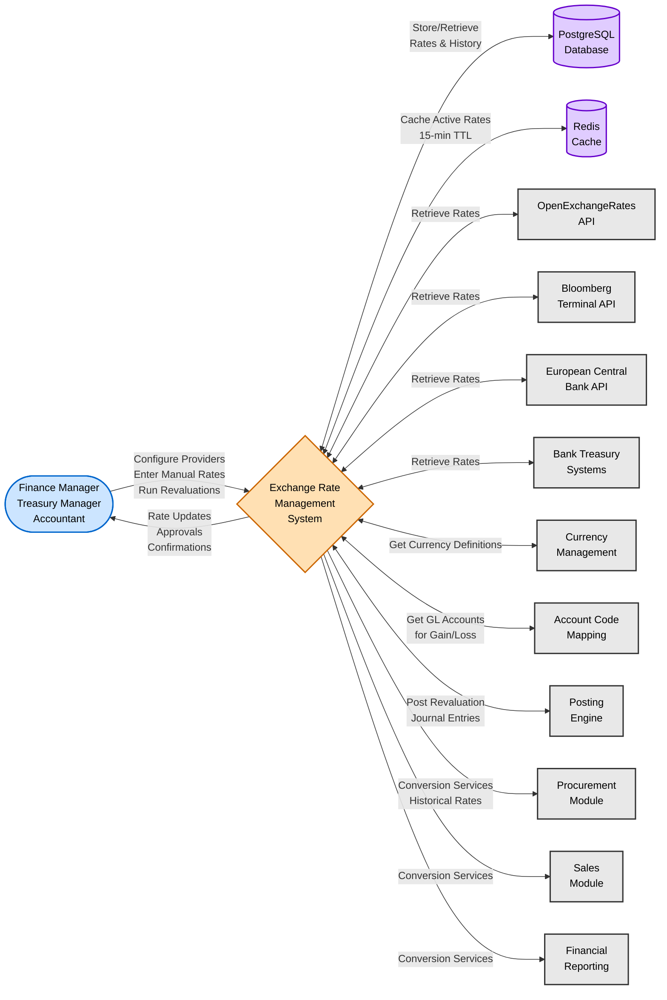

**External Entities**:
- **Users**: Finance managers configure providers and approve rates, treasury managers enter forward rates, accountants run revaluations
- **Database**: PostgreSQL stores all rate data, history, provider configs, revaluations
- **Cache**: Redis caches active rates for fast lookup (15-minute TTL)
- **Rate Providers**: External APIs provide real-time and historical exchange rates
- **Currency Management**: Provides currency definitions and active currency list
- **Account Code Mapping**: Provides GL accounts for exchange gain/loss posting
- **Posting Engine**: Posts revaluation journal entries to general ledger
- **Transaction Modules**: Consume conversion services for foreign transactions

---

### Level 1: System Decomposition

**Purpose**: Show major processes and data stores within Exchange Rate Management

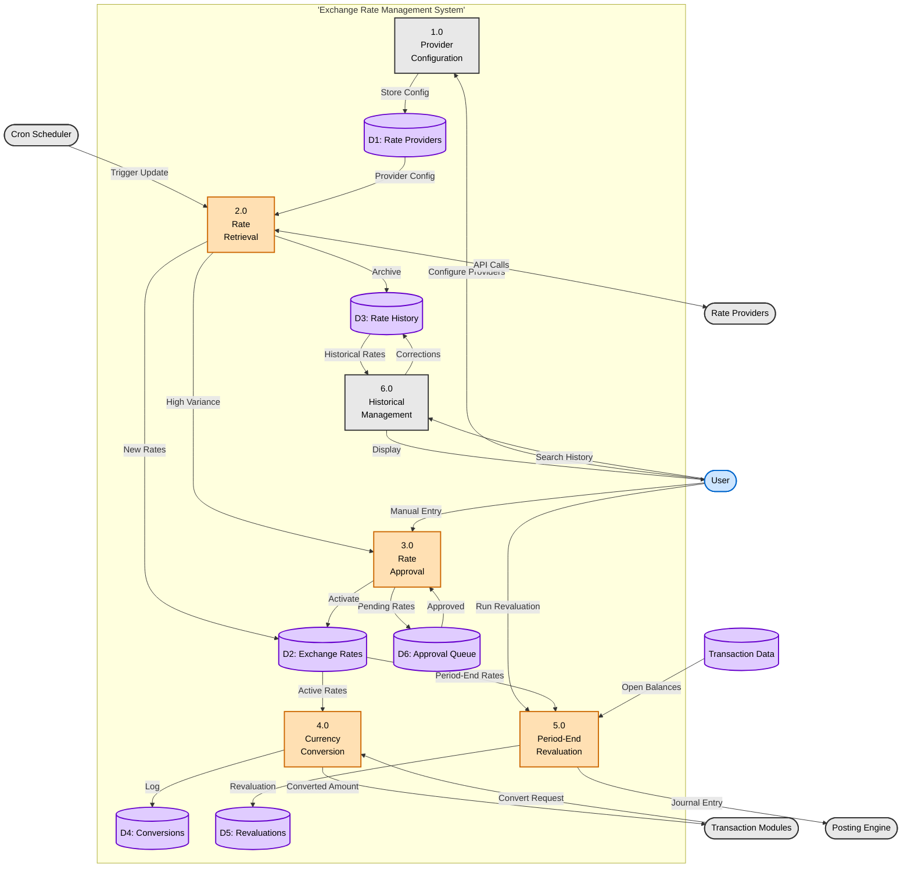

**Data Stores**:
- **D1: Rate Providers**: Provider configurations (API endpoints, credentials, schedules, health status)
- **D2: Exchange Rates**: Active exchange rates with all metadata (source, type, confidence, approval status)
- **D3: Rate History**: Complete historical archive of all rates (deactivated, superseded, corrected)
- **D4: Conversions**: Audit log of all currency conversions (amounts, rates used, transaction context)
- **D5: Revaluations**: Period-end revaluation batches and line items with gain/loss details
- **D6: Approval Queue**: Pending rates requiring manual approval (high variance or manual entries)

**Processes**:
1. **1.0 Provider Configuration**: Configure external rate providers, API settings, update schedules
2. **2.0 Rate Retrieval**: Automatically fetch rates from providers, validate, store, cache
3. **3.0 Rate Approval**: Process pending rates through variance-based approval workflow
4. **4.0 Currency Conversion**: Convert amounts between currencies using active rates
5. **5.0 Period-End Revaluation**: Run 7-phase revaluation wizard for unrealized gain/loss
6. **6.0 Historical Management**: Search historical rates, perform corrections, maintain audit trail

---

## Sequence Diagrams

### Automated Rate Update Sequence

**Purpose**: Time-ordered interaction for automated exchange rate retrieval

**Scenario**: Hourly scheduled job retrieves spot rates from OpenExchangeRates

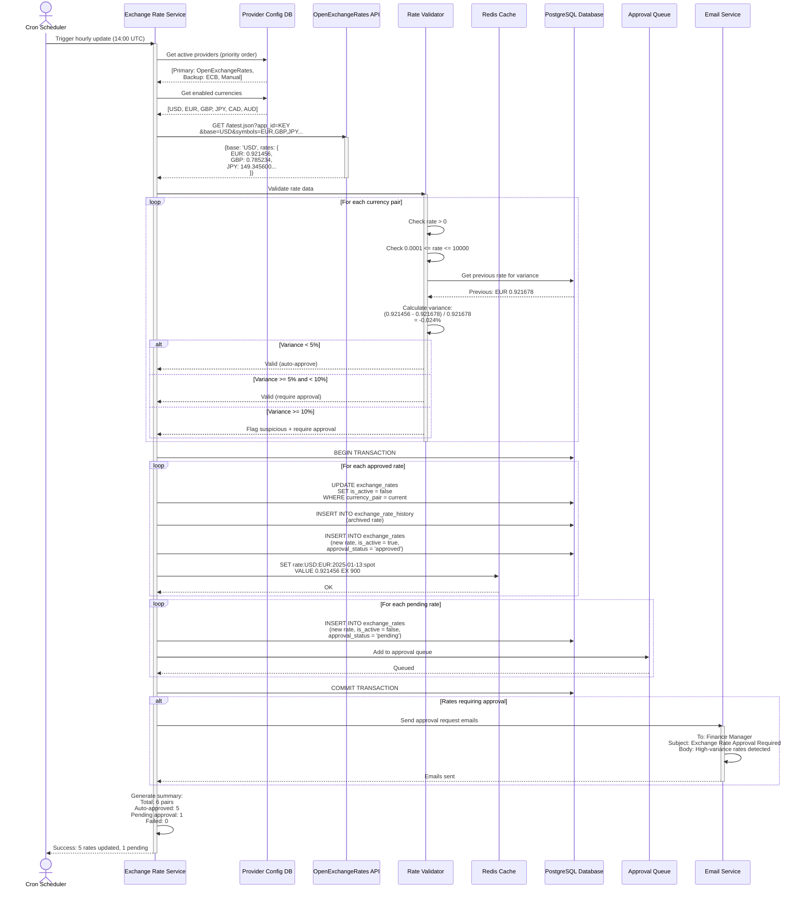

---

### Manual Rate Entry and Approval Sequence

**Purpose**: Time-ordered interaction for manual rate entry with approval workflow

**Scenario**: Treasury Manager enters manual rate with 7% variance requiring Controller approval

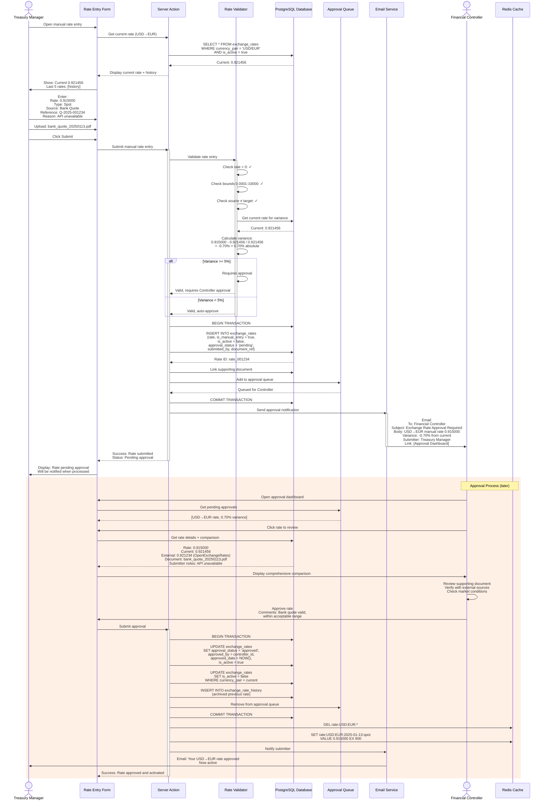

---

### Currency Conversion Sequence

**Purpose**: Time-ordered interaction for real-time currency conversion

**Scenario**: Purchase Order system requests USD to EUR conversion for $1,000.00

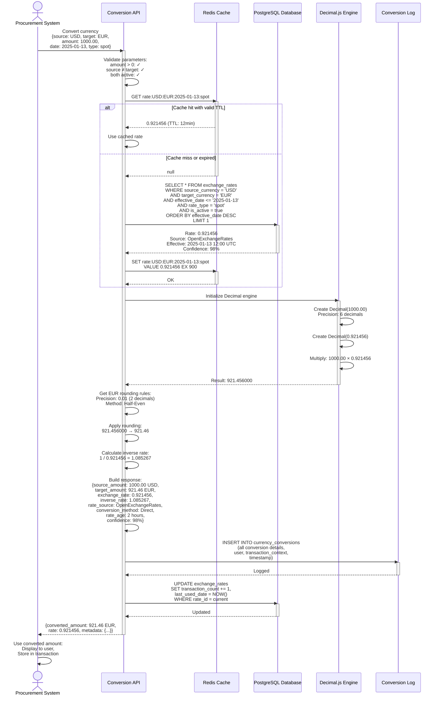

---

## State Diagrams

### Exchange Rate Status Lifecycle

**Purpose**: Show state transitions for exchange rate records

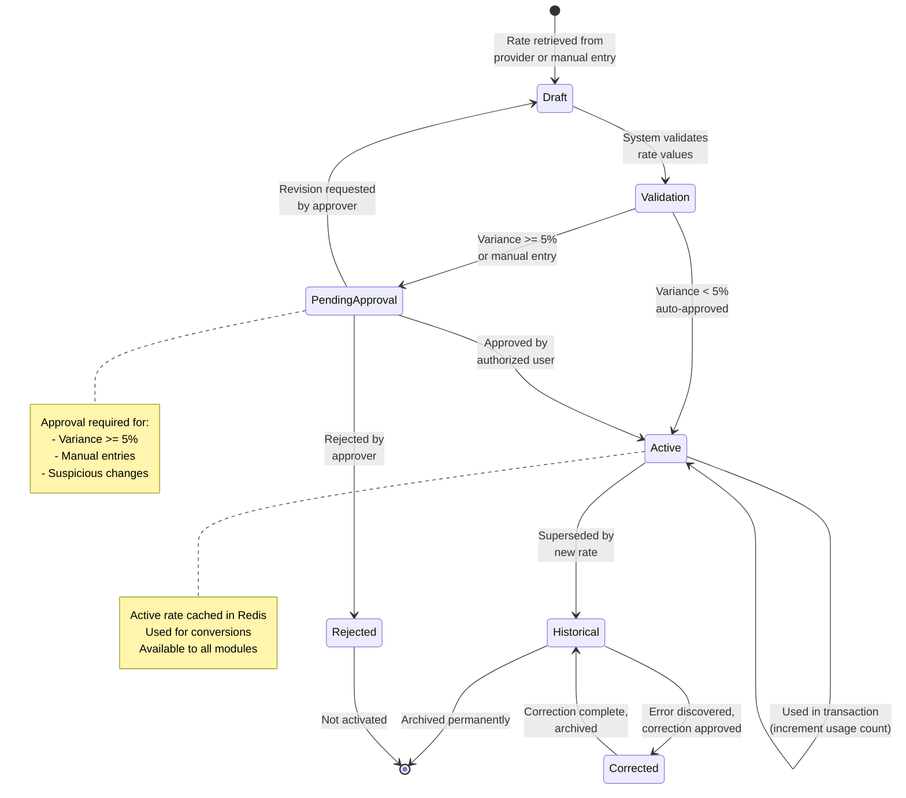

**State Descriptions**:
- **Draft**: Rate just retrieved from provider or entered manually, initial validation pending
- **Validation**: System validating rate positivity, bounds, variance against previous rate
- **Pending Approval**: Manual approval required based on variance threshold or manual entry flag
- **Active**: Current active rate, cached in Redis (15-min TTL), available for conversions
- **Historical**: Superseded by newer rate, archived for historical queries and audit
- **Corrected**: Historical rate corrected due to discovered error, with approval trail
- **Rejected**: Rate rejected during approval process, never activated

---

### Revaluation Batch Status Lifecycle

**Purpose**: Show state transitions for period-end revaluation batches

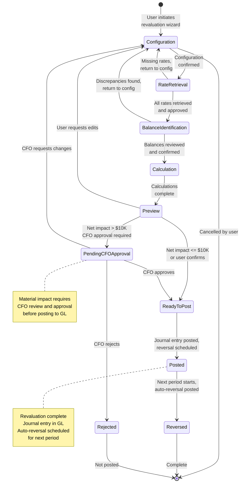

**State Descriptions**:
- **Configuration**: User configuring revaluation parameters (period, date, currencies, accounts)
- **Rate Retrieval**: System retrieving period-end rates from providers, manual entry for missing
- **Balance Identification**: System identifying open foreign currency balances requiring revaluation
- **Calculation**: System calculating unrealized gains/losses for each balance
- **Preview**: User previewing complete journal entry before posting
- **Pending CFO Approval**: CFO approval required for material net impact (> $10,000)
- **Ready To Post**: Approved and ready for GL posting
- **Posted**: Journal entry posted to GL, auto-reversal scheduled
- **Reversed**: Automatic reversal posted in next period
- **Rejected**: CFO rejected revaluation, not posted

---

## Integration Flows

### Rate Provider Integration Flow

**Purpose**: Integration with external exchange rate provider APIs

**Systems**: OpenExchangeRates, Bloomberg, ECB, Bank APIs

**Integration Details**:
- **OpenExchangeRates.org**: RESTful JSON API, API key authentication, 200+ currencies
- **Bloomberg Terminal**: Bloomberg API, OAuth authentication, real-time rates
- **European Central Bank**: XML feed, no authentication, EUR reference rates
- **Bank Treasury Systems**: Custom APIs, varies by bank, forward contract rates

(Diagram included in Automated Exchange Rate Update Flow above)

---

### Currency Management Integration Flow

**Purpose**: Integration with Currency Management for currency definitions

**Systems**: Exchange Rate Management, Currency Management

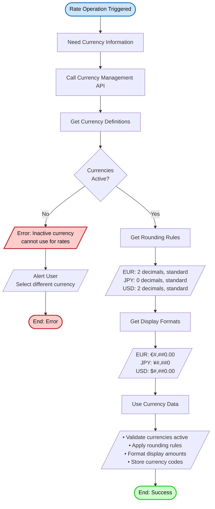

---

### Posting Engine Integration Flow

**Purpose**: Integration with Posting Engine for revaluation journal entries

**Systems**: Exchange Rate Management, Account Code Mapping, Posting Engine

```mermaid
flowchart TD
    Start([Revaluation Posted]) --> GetAccounts[Get GL Accounts from Mapping]
    GetAccounts --> CallMapping[Call Account Code Mapping]
    CallMapping --> MapRequest[/Request GL accounts for:<br>• Unrealized Exchange Gain<br>• Unrealized Exchange Loss<br>• Foreign Currency accounts/]

    MapRequest --> GetGainAcct[Get Gain Account]
    GetGainAcct --> GainAcct[/7210 - Unrealized Exchange Gain/]
    GainAcct --> GetLossAcct[Get Loss Account]
    GetLossAcct --> LossAcct[/7210 - Unrealized Exchange Loss/]
    LossAcct --> GetFXAccts[Get Foreign Currency Accounts]
    GetFXAccts --> FXAccts[/1200 - AR<br>2100 - AP<br>1110 - Cash/]

    FXAccts --> ValidateAccts{All Accounts<br>Active and<br>Allow Posting?}
    ValidateAccts -->|No| ErrorAccts[/Error: Account inactive<br>or posting not allowed/]
    ErrorAccts --> Alert[/Alert Finance Manager<br>Configure accounts/]
    Alert --> End1([End: Error])

    ValidateAccts -->|Yes| BuildJE[Build Journal Entry]
    BuildJE --> JEHeader[/JE Header:<br>Date: Revaluation date<br>Description: Period-end revaluation<br>Batch: REVAL-2501-0001<br>Auto-Reverse: Yes<br>Reverse Date: Next period start/]

    JEHeader --> JELines[Add Journal Entry Lines]
    JELines --> Lines[/Debit: 1200 AR $75<br>Debit: 1110 Cash $50<br>Debit: 7210 Loss $100<br>Credit: 2100 AP $100<br>Credit: 7210 Gain $125/]

    Lines --> Validate{Debits =<br>Credits?}
    Validate -->|No| ErrorBalance[/Error: Unbalanced entry/]
    ErrorBalance --> Alert

    Validate -->|Yes| CallPosting[Call Posting Engine]
    CallPosting --> PostHeader[Post JE Header]
    PostHeader --> PostLines[Post JE Lines]
    PostLines --> UpdateBalances[Update Account Balances]
    UpdateBalances --> BalanceUpdates[/Update base currency balances<br>for all affected accounts<br>Foreign currency unchanged/]

    BalanceUpdates --> CreateReversal[Create Reversal Template]
    CreateReversal --> ReversalTemplate[/Reversal JE:<br>Date: Next period start<br>Lines: Inverted amounts<br>Status: Scheduled/]
    ReversalTemplate --> LinkOriginal[Link Reversal to Original]
    LinkOriginal --> Success([End: Posted with Reversal])

    style Start fill:#cce5ff,stroke:#0066cc,stroke-width:2px,color:#000
    style Success fill:#ccffcc,stroke:#00cc00,stroke-width:2px,color:#000
    style End1 fill:#ffcccc,stroke:#cc0000,stroke-width:2px,color:#000
    style ErrorAccts fill:#ffcccc,stroke:#cc0000,stroke-width:2px,color:#000
    style ErrorBalance fill:#ffcccc,stroke:#cc0000,stroke-width:2px,color:#000
```

---

## Appendix: Diagram Legend

### Node Shapes
- **Rounded Rectangle** `([text])`: Start/End points, external actors
- **Rectangle** `[text]`: Process steps, activities, operations
- **Diamond** `{text}`: Decision points, conditional logic, branching
- **Parallelogram** `[/text/]`: Input/Output, data, messages, alerts
- **Cylinder** `[(text)]`: Data storage, database, cache
- **Rounded Edge Rectangle**: Subgraph, subsystem, process group

### Colors (Standard)
- **Blue** `#cce5ff`: Start points, user actors, initiating events
- **Green** `#ccffcc`: Success end points, completed actions, active states
- **Red** `#ffcccc`: Error end points, failed actions, rejected states
- **Orange** `#ffe0b3`: Warning states, pending approval, awaiting action
- **Purple** `#e0ccff`: Database operations, data persistence, caching
- **Gray** `#e8e8e8`: External systems, passive states, skipped actions

### Arrow Types
- **Solid Arrow** `-->`: Primary flow, forward progression, normal path
- **Dashed Arrow** `-.->`: Alternative flow, conditional path, exception path
- **Bidirectional** `<-->`: Two-way data exchange, request-response
- **Thick Arrow**: High-volume or critical data flow

---

**Document End**

> 📝 **Note to Implementers**:
> - All diagrams use Mermaid syntax for version control and easy maintenance
> - Update diagrams when workflows change to keep documentation synchronized
> - Keep flows aligned with Use Cases document for consistency
> - Validate all flows against actual implementation during development
> - Test all exception paths and edge cases shown in diagrams
> - Ensure state transitions are enforced in code with proper validation
> - Monitor integration points for failures and implement retry/fallback logic
> - Review diagrams during architecture reviews and sprint planning
> - Use diagrams for onboarding new team members
> - Document any deviations from these flows in implementation notes
