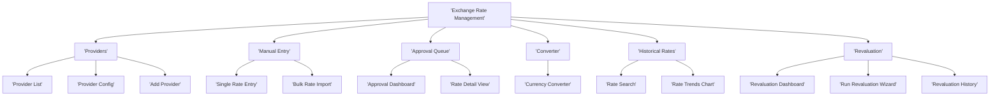

# Technical Specification: Exchange Rate Management

## Module Information
- **Module**: Finance
- **Sub-Module**: Exchange Rate Management
- **Route**: `/finance/exchange-rate-management`
- **Version**: 1.0.0
- **Last Updated**: 2025-01-13
- **Owner**: Finance & Treasury Team
- **Status**: Draft

## Document History
| Version | Date | Author | Changes |
|---------|------|--------|---------|
| 1.1.0 | 2025-12-10 | Documentation Team | Standardized reference number format (XXX-YYMM-NNNN) |
| 1.0.0 | 2025-01-13 | Carmen ERP Documentation Team | Initial version |

---

## Overview

The Exchange Rate Management module implements a comprehensive exchange rate system that supports automated rate updates from external providers, manual rate entry with approval workflows, real-time currency conversion, and historical rate tracking for compliance and reporting. The architecture integrates a Rate Provider Service for external API connectivity, a Conversion Engine for accurate calculations, a Rate Approval Workflow for governance, and a Revaluation Service for period-end processing.

The technical implementation emphasizes accuracy through high-precision decimal arithmetic (6 decimal places for exchange rates), automation through scheduled rate updates with provider failover, governance through variance-based approval workflows, and auditability through complete change tracking. All exchange rates are validated against variance thresholds and historical patterns before activation, with automatic routing to appropriate approvers for high-variance rates.

**⚠️ IMPORTANT: This is a Technical Specification Document - TEXT FORMAT ONLY**

**Related Documents**:
- [Business Requirements](./BR-exchange-rate-management.md)
- [Use Cases](./UC-exchange-rate-management.md)
- [Data Schema](./DS-exchange-rate-management.md)
- [Flow Diagrams](./FD-exchange-rate-management.md)
- [Validation Rules](./VAL-exchange-rate-management.md)

---

## Architecture

### High-Level Architecture

```
┌────────────────────────────────────────────────────────────────────┐
│                     Client Layer (Browser)                          │
│  ┌──────────────┐  ┌──────────────┐  ┌──────────────┐  ┌────────┐│
│  │   Rate       │  │   Manual     │  │   Approval   │  │ Currency││
│  │  Provider    │  │   Rate       │  │   Queue      │  │ Converter││
│  │   Config     │  │   Entry      │  │  Dashboard   │  │  Tool    ││
│  └──────────────┘  └──────────────┘  └──────────────┘  └────────┘│
└────────────┬────────────────────────────────────────────────────────┘
             │ HTTPS / Server Actions
             ▼
┌────────────────────────────────────────────────────────────────────┐
│             Application Layer (Next.js Server)                      │
│  ┌────────────────────────────────────────────────────────────┐  │
│  │                    Server Actions                          │  │
│  │  - configureRateProvider     - manualRateEntry             │  │
│  │  - approveExchangeRate       - rejectExchangeRate          │  │
│  │  - convertCurrency           - searchHistoricalRates       │  │
│  │  - runPeriodEndRevaluation   - correctHistoricalRate       │  │
│  └────────────────────────────────────────────────────────────┘  │
│           │                    │                    │              │
│           ▼                    ▼                    ▼              │
│  ┌────────────────────────────────────────────────────────────┐  │
│  │              Business Logic Services                        │  │
│  │  - Rate Provider Service     - Conversion Engine           │  │
│  │  - Rate Update Scheduler     - Approval Workflow Engine    │  │
│  │  │  Validation Service        - Revaluation Service        │  │
│  │  - Historical Rate Service   - Audit Logger                │  │
│  └────────────────────────────────────────────────────────────┘  │
└────────────┬────────────────────────────────────────────────────────┘
             │
             ▼
┌────────────────────────────────────────────────────────────────────┐
│                 External Integrations                               │
│  ┌──────────────────┐  ┌──────────────────┐  ┌─────────────────┐│
│  │  Exchange Rate   │  │   Account Code   │  │    Posting      ││
│  │   Providers      │  │     Mapping      │  │    Engine       ││
│  │ (OpenEx, ECB,    │  │   (GL Accounts)  │  │ (Revaluation    ││
│  │  Bloomberg, etc) │  │                  │  │   Posting)      ││
│  └──────────────────┘  └──────────────────┘  └─────────────────┘│
└────────────┬────────────────────────────────────────────────────────┘
             │
             ▼
┌────────────────────────────────────────────────────────────────────┐
│                         Data Layer                                  │
│                  (PostgreSQL via Supabase)                          │
│  ┌────────────────────────────────────────────────────────────┐  │
│  │                     Core Tables                             │  │
│  │  - exchange_rates            - exchange_rate_history       │  │
│  │  - rate_providers            - rate_update_log             │  │
│  │  │  rate_approval_queue       - currency_conversions       │  │
│  │  - revaluation_batches       - gain_loss_log               │  │
│  └────────────────────────────────────────────────────────────┘  │
│  ┌──────────────┐  ┌──────────────┐  ┌──────────────┐           │
│  │  Functions   │  │  Triggers    │  │ Materialized │           │
│  │ calcInverse  │  │ auditRates   │  │    Views     │           │
│  │ calcVariance │  │ validateRate │  │ activeRates  │           │
│  └──────────────┘  └──────────────┘  └──────────────┘           │
└─────────────────────────────────────────────────────────────────────┘
```

### Component Architecture

**Frontend Layer**
- **Page Components**: Server Components for rate provider configuration, manual rate entry, approval queue, currency converter, historical rate viewer, revaluation dashboard
- **UI Components**: Client Components for rate input with inverse calculation, variance indicator widgets, approval action buttons, conversion calculator, rate trend charts
- **State Management**: Zustand for UI preferences and form state, React Query for rate data with aggressive caching (15-minute TTL for current rates)
- **Form Handling**: React Hook Form with Zod validation for manual rate entry, approval workflow actions

**Backend Layer - Rate Provider Service**
- **Provider Connector**: Manages connections to external rate providers (OpenExchangeRates, Bloomberg, ECB, Fed)
- **Rate Retriever**: Scheduled jobs (hourly/daily) that fetch rates from configured providers
- **Rate Validator**: Validates retrieved rates for positivity, bounds, variance thresholds, triangulation consistency
- **Provider Health Monitor**: Tracks provider uptime, response times, success rates, automatic failover triggering
- **Cache Manager**: Redis-based caching with configurable TTL (default 15 minutes for spot rates)

**Backend Layer - Conversion Engine**
- **Direct Converter**: Performs direct currency conversions using available rates
- **Triangulation Engine**: Calculates cross-currency conversions via base currency when direct rate unavailable
- **Precision Handler**: Uses Decimal.js for all calculations to avoid floating-point errors
- **Rounding Service**: Applies currency-specific rounding rules (0-4 decimal places)
- **Batch Converter**: Processes multiple conversions in parallel for bulk operations

**Backend Layer - Approval Workflow Engine**
- **Variance Analyzer**: Compares proposed rates against current and historical rates
- **Approval Router**: Routes rates to appropriate approver based on variance level and user roles
- **Delegation Manager**: Handles approval delegation during absences with date range enforcement
- **Notification Service**: Sends approval requests and decisions via email and in-app notifications
- **Approval Tracker**: Monitors pending approvals, aging alerts, approval time SLAs

**Backend Layer - Revaluation Service**
- **Balance Identifier**: Queries open foreign currency balances requiring revaluation
- **Revaluation Calculator**: Calculates unrealized gains/losses using period-end rates
- **Journal Entry Generator**: Creates revaluation adjustment entries with reversal scheduling
- **Posting Integration**: Interfaces with Posting Engine to record adjustments to GL
- **Compliance Reporter**: Generates IAS 21 disclosure reports for financial statements

**Data Layer**
- **Exchange Rate Tables**: Current rates (active), historical rates (7+ years retention), pending rates (approval queue)
- **Provider Configuration**: Provider connection details, credentials (encrypted), update schedules, health metrics
- **Conversion Log**: Audit trail of all conversions with user, transaction context, rates used
- **Revaluation History**: Complete record of all period-end revaluations with journal entry linkage

---

## Technology Stack

### Frontend
- **Framework**: Next.js 14.2+ (App Router)
- **UI Library**: React 18.2+
- **Styling**: Tailwind CSS 3.4+, Shadcn/ui
- **State Management**: Zustand 4.4+ (UI), React Query 5.17+ (rate data)
- **Form Handling**: React Hook Form 7.48+, Zod 3.22+
- **Icons**: Lucide React 0.263+
- **Date Handling**: date-fns 3.0+
- **Number Formatting**: Intl.NumberFormat (native) for currency display
- **Charting**: Recharts 2.10+ (rate trend visualization)

### Backend
- **Runtime**: Node.js 20.14.0+
- **Framework**: Next.js 14.2+ Server Actions
- **Database**: PostgreSQL 14+ (Supabase)
- **ORM**: Prisma 5.8+
- **Decimal Library**: Decimal.js 10.4+ (high-precision rate calculations)
- **Cache**: Redis 7+ (rate caching with LRU eviction)
- **HTTP Client**: node-fetch 3+ (external provider APIs)
- **Authentication**: Supabase Auth with RLS
- **Background Jobs**: Vercel Cron (scheduled rate updates, period-end revaluation)
- **Encryption**: AES-256 for API credentials

### External APIs
- **OpenExchangeRates.org**: Free and paid tiers, 200+ currencies, hourly updates
- **Bloomberg Terminal**: Enterprise real-time rates (requires subscription)
- **European Central Bank (ECB)**: Official EUR reference rates, free, daily updates
- **Federal Reserve H.10**: Official USD rates, free, daily updates
- **Bank Treasury Systems**: Custom integrations for forward contract rates

### Testing
- **Unit Tests**: Vitest 1.0+ with Decimal.js mocking for calculation accuracy
- **Integration Tests**: Vitest with test database and mocked external APIs
- **E2E Tests**: Playwright 1.40+ (rate approval workflows, conversion scenarios)

### DevOps
- **Version Control**: Git with GitHub
- **CI/CD**: GitHub Actions with external API mocking
- **Hosting**: Vercel
- **Monitoring**: Sentry (errors), Datadog (provider health, API latency)
- **Alerting**: PagerDuty (rate update failures, critical approval delays)

---

## Component Structure

### Directory Structure

```
app/(main)/finance/exchange-rate-management/
├── page.tsx                           # Exchange rate dashboard
├── providers/
│   ├── page.tsx                       # Rate provider configuration list
│   ├── [id]/page.tsx                  # Edit provider configuration
│   └── new/page.tsx                   # Add new provider
├── manual-entry/
│   ├── page.tsx                       # Manual rate entry form
│   └── bulk/page.tsx                  # Bulk rate import
├── approval-queue/
│   ├── page.tsx                       # Pending rates approval dashboard
│   └── [rate_id]/page.tsx             # Rate approval detail view
├── converter/
│   └── page.tsx                       # Currency conversion calculator
├── historical-rates/
│   ├── page.tsx                       # Historical rate search and export
│   └── trends/page.tsx                # Rate trend charts
├── revaluation/
│   ├── page.tsx                       # Period-end revaluation dashboard
│   ├── run/page.tsx                   # Run revaluation wizard
│   └── history/page.tsx               # Revaluation history
├── components/
│   ├── RateProviderConfig.tsx         # Provider configuration form
│   ├── ManualRateEntry.tsx            # Rate entry form with validation
│   ├── RateApprovalCard.tsx           # Approval queue item card
│   ├── CurrencyConverter.tsx          # Conversion calculator widget
│   ├── RateTrendChart.tsx             # Historical rate line chart
│   ├── VarianceIndicator.tsx          # Color-coded variance display
│   ├── RateComparisonPanel.tsx        # Compare rates across providers
│   ├── ApprovalActions.tsx            # Approve/Reject/RequestRevision buttons
│   ├── RevaluationWizard.tsx          # Period-end revaluation wizard
│   ├── ProviderHealthWidget.tsx       # Provider status dashboard
│   └── HistoricalRateTable.tsx        # Historical rate data table
├── types.ts                           # Exchange rate type definitions
├── actions.ts                         # Server Actions
├── hooks/
│   ├── useExchangeRates.ts            # Current and historical rate fetching
│   ├── useRateProviders.ts            # Provider configuration management
│   ├── useApprovalQueue.ts            # Pending approvals data
│   ├── useCurrencyConversion.ts       # Real-time conversion
│   └── useRateHistory.ts              # Historical rate queries
└── lib/
    ├── rate-provider-service.ts       # External provider integration
    ├── conversion-engine.ts           # Currency conversion logic
    ├── approval-workflow.ts           # Approval routing and tracking
    ├── validation-service.ts          # Rate validation rules
    ├── revaluation-service.ts         # Period-end revaluation
    ├── historical-rate-service.ts     # Historical data management
    └── audit-logger.ts                # Rate change audit logging
```

### Key Components

#### Rate Provider Configuration Component
**File**: `RateProviderConfig.tsx` (Client Component)
**Purpose**: Configure external exchange rate providers for automated updates
**Responsibilities**:
- Provider selection (OpenExchangeRates, Bloomberg, ECB, Fed, Custom)
- API connection configuration (endpoint, credentials, authentication type)
- Update schedule configuration (hourly, daily, real-time)
- Enabled currencies selection with multi-select
- Auto-approve toggle and variance threshold settings
- Connection testing with real-time feedback
- Provider priority ordering for failover
**Props**: Provider ID (for edit mode), onSave callback, onCancel callback

#### Manual Rate Entry Component
**File**: `ManualRateEntry.tsx` (Client Component)
**Purpose**: Manual exchange rate entry with automatic inverse calculation and variance validation
**Responsibilities**:
- Source/target currency selection with search
- Exchange rate input with 6 decimal precision
- Automatic inverse rate calculation and display
- Rate type selection (Spot, Forward, Month-End, Year-End, Average)
- Effective date/time specification
- Buy/sell rate entry (optional) with mid-rate calculation
- Rate source and reference documentation (mandatory)
- Reason for manual entry (mandatory text area)
- Real-time variance calculation against last active rate
- Color-coded variance indicators (green <5%, yellow 5-10%, red >10%)
- Automatic approval routing based on variance
**Props**: Initial data (for corrections), onSubmit callback, currencies list

#### Rate Approval Card Component
**File**: `RateApprovalCard.tsx` (Client Component)
**Purpose**: Display pending rate with comprehensive comparison and approval actions
**Responsibilities**:
- Proposed rate details with submitter information
- Current active rate comparison
- Variance calculation and visualization
- Historical rate context (last 5 rates)
- External rate comparison (real-time check against providers)
- Supporting document viewer
- Approval/Rejection/Revision request actions
- Approval comments input
- Authority check (variance vs user's approval limit)
**Props**: Rate data, approvalActions, userRole, approvalLimits

#### Currency Converter Component
**File**: `CurrencyConverter.tsx` (Client Component)
**Purpose**: Real-time currency conversion calculator for users
**Responsibilities**:
- Amount input with currency formatting
- From/to currency selection with search and flags
- Conversion date selection (default: today)
- Rate type selection (Spot, Forward, Month-End, Average)
- Real-time conversion calculation on input
- Exchange rate display with source and timestamp
- Inverse rate display
- Conversion path display (Direct vs Triangulated)
- Rate age indicator and staleness warnings
- Copy to clipboard, email result, reverse conversion actions
**Props**: Initial currencies (optional), embedded mode vs standalone

#### Revaluation Wizard Component
**File**: `RevaluationWizard.tsx` (Client Component)
**Purpose**: Guide accountants through period-end currency revaluation process
**Responsibilities**:
- **Step 1: Configuration**: Select revaluation date, currencies, account types
- **Step 2: Rate Retrieval**: Fetch period-end rates, display sources, allow manual entry for missing
- **Step 3: Balance Identification**: Query open foreign currency balances, display by currency
- **Step 4: Calculation**: Calculate unrealized gains/losses, show detailed breakdown
- **Step 5: Preview**: Display revaluation journal entry with net P&L impact
- **Step 6: Approval**: CFO approval if net impact > threshold
- **Step 7: Posting**: Post to GL with reversal scheduling
- Progress tracking with step completion indicators
- Save and resume capability for multi-session workflows
**Props**: Current period, previous revaluation data

---

## Sitemap

### Page Hierarchy



### Pages

#### 1. Exchange Rate Dashboard Page
**Route**: `/finance/exchange-rate-management`
**Purpose**: Overview of current rates, provider health, recent activity
**Sections**:
- Header: Title, last update timestamp, provider status indicators
- Current Rates Panel: Grid of major currency pairs with rates, variance from previous, age indicators
- Provider Health Panel: Status of each configured provider (Active, Error, Disabled)
- Recent Activity: List of recent rate changes, approvals, manual entries
- Quick Actions: Manual Rate Entry, Run Converter, View Approval Queue
**Actions**: Refresh rates, navigate to sub-pages
**Filters**: None (dashboard view)

#### 2. Rate Provider Configuration Page
**Route**: `/finance/exchange-rate-management/providers`
**Purpose**: Configure and manage external rate providers
**Sections**:
- Provider List: Table of configured providers with name, type, status, last update, success rate, priority
- Provider Health Metrics: Uptime, response time, success rate, consecutive failures
**Actions**: Add provider, edit configuration, enable/disable, test connection, view update log
**Filters**: Active/Inactive, provider type

#### 3. Manual Rate Entry Page
**Route**: `/finance/exchange-rate-management/manual-entry`
**Purpose**: Manually enter exchange rates when automated updates unavailable or for special rates
**Sections**:
- Rate Entry Form: All fields per FR-EXRATE-006
- Current Rate Display: Shows current active rate for selected currency pair
- Historical Rate Context: Last 5 rates for comparison
- Variance Calculator: Real-time variance calculation and threshold check
**Actions**: Submit for approval, save and submit, cancel
**Validation**: Real-time validation of all fields, variance threshold enforcement

#### 4. Approval Queue Page
**Route**: `/finance/exchange-rate-management/approval-queue`
**Purpose**: Review and approve pending exchange rates
**Sections**:
- Summary Statistics: Total pending, urgent (>24h), average approval time
- Pending Rates List: Table with currency pair, proposed rate, variance, submitter, days pending, actions
- Filters Panel: Status, submitter, date range, currency pair, variance level
**Actions**: View details, approve, reject, request revision, bulk approve
**Real-Time Updates**: Queue refreshes when rates approved/rejected

#### 5. Currency Converter Page
**Route**: `/finance/exchange-rate-management/converter`
**Purpose**: Real-time currency conversion calculator
**Sections**:
- Conversion Form: Amount, from currency, to currency, conversion date, rate type
- Conversion Result Display: Converted amount, exchange rate, inverse rate, calculation details, conversion path
- Rate Details Panel: Rate source, effective date, rate age, confidence level
**Actions**: Convert, swap currencies, copy result, email result, new conversion, reverse conversion
**Validation**: Amount positive, currencies active, rate available

#### 6. Historical Rates Page
**Route**: `/finance/exchange-rate-management/historical-rates`
**Purpose**: Search and export historical exchange rates
**Sections**:
- Search Filters: Currency pair, date range, rate type, rate source
- Results Table: Date, rate, variance from previous, rate type, source, actions
- Trend Chart: Line chart of rates over selected date range
**Actions**: Export to Excel/CSV/PDF, view rate details, compare rates
**Filters**: Date range, currency pair, rate type, source (manual, automated)

#### 7. Period-End Revaluation Page
**Route**: `/finance/exchange-rate-management/revaluation/run`
**Purpose**: Execute period-end currency revaluation wizard
**Sections**:
- Revaluation Wizard: 7-step process per UC-EXR-107
- Balance Summary: Open foreign currency balances by account and currency
- Calculation Details: Unrealized gain/loss per balance
- Journal Entry Preview: Complete revaluation entry with net P&L impact
**Actions**: Next step, previous step, save and resume, post revaluation, cancel
**Progress**: Visual progress bar showing current step (1-7)

---

## Data Flow

### Automated Exchange Rate Update Flow

```
Scheduled Job Triggers (Hourly/Daily)
    ↓
Check Suspension Period (Month-End Close, etc.)
    ↓
If Suspended: Skip update, schedule next attempt
If Active: Proceed
    ↓
Retrieve Active Provider Configuration
    - Provider: OpenExchangeRates
    - API Endpoint: https://openexchangerates.org/api/latest.json
    - API Key: [encrypted]
    - Enabled Currencies: USD, EUR, GBP, JPY, CAD
    - Auto-Approve: Yes
    - Variance Threshold: 5%
    ↓
Construct API Request
    - URL: endpoint + API key + currency symbols
    - Method: GET
    - Headers: User-Agent, Accept: application/json
    ↓
Send HTTP Request to Provider
    ↓
Provider Response (HTTP 200 OK)
    - JSON with base currency and rates
    - Example: {"base": "USD", "rates": {"EUR": 0.921456, ...}}
    ↓
If Request Fails:
    - Log error (provider unavailable, timeout, etc.)
    - Retry with exponential backoff (1min, 5min, 15min)
    - After 3 failures: Attempt failover to secondary provider
    - If all providers fail: Alert Finance team, keep existing rates active (mark stale)
    ↓
Parse JSON Response
    - Validate JSON structure
    - Extract base currency and rates
    - Verify all requested currencies present
    ↓
For Each Currency Pair (e.g., USD→EUR):
    ↓
    Extract Rate: 0.921456
    ↓
    Calculate Inverse Rate: 1 / 0.921456 = 1.085267
    ↓
    Retrieve Last Active Rate: 0.921678 (from previous update)
    ↓
    Calculate Variance: ((0.921456 - 0.921678) / 0.921678) × 100% = -0.024%
    ↓
    Variance Check:
        If |Variance| < 5% Threshold:
            Auto-Approve: Yes
            Create Rate Record:
                - source_currency: USD
                - target_currency: EUR
                - exchange_rate: 0.921456
                - inverse_rate: 1.085267
                - rate_type: spot
                - rate_source: OpenExchangeRates API
                - effective_date: Current timestamp
                - is_active: true
                - is_manual_entry: false
                - approval_status: approved
            Supersede Previous Rate:
                - Previous rate status: Historical
                - Previous rate superseded_date: Current timestamp
            Save to Database
            Invalidate Cache (USD→EUR)
            Log: RATE_CREATED (auto-approved)

        If |Variance| ≥ 5% Threshold:
            Requires Approval
            Create Rate Record:
                - All fields as above
                - approval_status: pending
                - is_active: false
            Do NOT supersede previous rate (keep active)
            Route to Approval Queue
            Send Notification to Finance Manager:
                "High-variance rate detected: USD→EUR 0.915000 (7.2% change). Approval required."
            Log: RATE_CREATED (pending approval)
    ↓
Process Remaining Currency Pairs (same logic)
    ↓
Update Summary:
    - Total Rates Retrieved: 5
    - Auto-Approved: 4
    - Pending Approval: 1
    - Average Variance: -0.15%
    ↓
Update Provider Health Metrics:
    - Last Update: Current timestamp
    - Last Success: Current timestamp
    - Success Rate: 99.8% (rolling average)
    - Consecutive Successes: Increment
    - Consecutive Failures: Reset to 0
    ↓
Log Update Success: AUTOMATED_UPDATE_SUCCESS
    ↓
Schedule Next Update: Current + update interval (e.g., 1 hour)
    ↓
Send Summary Email (Optional):
    - To: Finance Manager
    - Subject: "Exchange Rate Update: 4 approved, 1 pending"
    - Body: Variance details, pending approval link
```

### Manual Rate Approval Flow

```
Finance Manager Reviews Approval Queue
    ↓
Pending Rate: USD→EUR = 0.915000 (Variance: 7.2%)
    ↓
Click "View Details"
    ↓
System Displays Comprehensive Comparison:
    - Proposed Rate: 0.915000
    - Current Rate: 0.921678
    - Variance: -0.72% = 7.2% absolute
    - Last 5 Rates: [historical context]
    - External Comparison:
        - OpenExchangeRates: 0.921234
        - ECB: 0.920987
        - Bloomberg: 0.921567
        - Average: 0.921197
    - Proposed vs External Avg: -0.67% difference
    - Supporting Document: [bank quote PDF]
    - Submitter: John Smith (Accountant)
    - Reason: "Unusual market volatility, using bank quote"
    ↓
Finance Manager Reviews:
    - Checks supporting documentation (bank quote valid)
    - Verifies reason (market volatility confirmed in news)
    - Compares to external sources (within 1% of averages)
    - Confirms submitter credentials
    ↓
Decision: Approve
    ↓
Finance Manager Clicks "Approve"
    ↓
System Displays Approval Confirmation:
    - Currency Pair: USD→EUR
    - Proposed Rate: 0.915000
    - Variance: 7.2%
    - Action: Rate will become active immediately
    - Approval Comments: [text area]
    - Set Review Expiry: [checkbox] Review in 24 hours
    ↓
Finance Manager Enters:
    - Comments: "Approved based on bank quote. Market volatility due to Fed announcement. Will monitor closely."
    - Review Expiry: 24 hours (checked)
    ↓
Finance Manager Clicks "Confirm Approval"
    ↓
System Validates:
    - User has approval authority for 7.2% variance: ✅ (Finance Manager limit: 10%)
    - Rate still pending (not already processed): ✅
    - No conflicting rate approved during review: ✅
    ↓
System Updates Rate Record:
    - approval_status: approved
    - approved_by: Finance Manager user ID
    - approved_date: Current timestamp
    - approval_comments: Manager's comments
    - review_expiry_date: Current + 24 hours
    - is_active: true
    - Status: Active
    ↓
System Supersedes Previous Rate:
    - Previous rate (0.921678) status: Historical
    - Previous rate superseded_date: Current timestamp
    - Previous rate superseded_by_rate_id: Newly approved rate ID
    ↓
System Logs Approval: RATE_APPROVED
    - User: Finance Manager
    - Rate: USD→EUR 0.915000
    - Variance: 7.2%
    - Comments: Included
    ↓
System Sends Notifications:
    - To Submitter (John Smith): "Your USD→EUR rate approved by [Manager]"
    - To Treasury Manager: "New USD→EUR rate activated: 0.915000 (7.2% change)"
    - To Finance Team: "High-variance rate approved, 24h review scheduled"
    ↓
System Invalidates Cache: USD→EUR
    ↓
System Schedules Review Reminder:
    - Task: Review USD→EUR rate (high variance)
    - Assigned To: Finance Manager
    - Due: Current + 24 hours
    ↓
System Updates Approval Queue:
    - Remove approved rate from pending list
    - Total Pending: Decremented
    ↓
Display Success Message:
    "Exchange rate approved and activated. Review reminder set for 24 hours."
```

### Real-Time Currency Conversion Flow

```
User Opens Currency Converter Tool
    ↓
System Displays Conversion Form:
    - Amount: [input]
    - From Currency: [dropdown]
    - To Currency: [dropdown]
    - Conversion Date: [date picker, default: today]
    - Rate Type: [dropdown, default: Spot]
    ↓
User Enters Conversion:
    - Amount: 10,000.00
    - From: USD
    - To: EUR
    - Date: 2025-01-13 (today)
    - Rate Type: Spot
    ↓
User Clicks "Convert"
    ↓
System Validates Input:
    - Amount > 0: ✅
    - From ≠ To: ✅
    - From/To currencies active: ✅
    - Date valid: ✅
    ↓
System Retrieves Exchange Rate (USD→EUR, 2025-01-13):
    ↓
    Check Redis Cache:
        Key: "rate:USD:EUR:2025-01-13:spot"
        TTL: 15 minutes
        ↓
        Cache Hit?
            Yes: Return cached rate 0.921456
            No: Query database
                ↓
                Query: SELECT * FROM exchange_rates
                       WHERE source_currency = 'USD'
                         AND target_currency = 'EUR'
                         AND effective_date <= '2025-01-13'
                         AND rate_type = 'spot'
                         AND is_active = true
                       ORDER BY effective_date DESC
                       LIMIT 1
                ↓
                Found: USD→EUR = 0.921456 (updated 2 hours ago)
                ↓
                Store in Cache (TTL: 15 min)
                ↓
                Return rate
    ↓
Rate Retrieved: 0.921456
    ↓
System Calculates Conversion:
    - Use Decimal.js for precision
    - Formula: Target = Source × Rate
    - Calculation: 10,000.00 × 0.921456 = 9,214.56000
    - Round to target currency decimals (EUR: 2): 9,214.56
    ↓
System Calculates Inverse Rate:
    - Inverse = 1 / Rate
    - Calculation: 1 / 0.921456 = 1.085267
    ↓
System Compiles Metadata:
    - Conversion Path: Direct (USD→EUR)
    - Rate Source: OpenExchangeRates API
    - Rate Effective Date: 2025-01-13 12:00 UTC
    - Rate Age: 2 hours
    - Is Rate Current: Yes (<24 hours)
    - Confidence Level: 98% (automated, reliable source)
    ↓
System Displays Result:

    10,000.00 USD  =  9,214.56 EUR

    Exchange Rate: 1 USD = 0.921456 EUR
    Inverse Rate: 1 EUR = 1.085267 USD

    Rate Details:
    - Rate Type: Spot
    - Effective Date: Jan 13, 2025 at 12:00 PM UTC
    - Rate Source: OpenExchangeRates API
    - Rate Age: 2 hours (Current ✅)
    - Conversion Path: Direct (USD → EUR)
    - Confidence: 98% (High reliability)

    Calculation:
    10,000.00 × 0.921456 = 9,214.56

    [Copy Result] [Email Result] [New Conversion] [Reverse]
    ↓
System Logs Conversion (Audit Trail):
    - Conversion ID: Generated CUID
    - User: Current user ID
    - Source: 10,000.00 USD
    - Target: 9,214.56 EUR
    - Rate Used: 0.921456
    - Context: Manual converter tool
    - Timestamp: Current
    ↓
User Copies Result to Clipboard: "9,214.56"
    ↓
User Uses Result in Purchase Order or Other Transaction
```

---

## Integration Points

### 1. Currency Management Integration
**Purpose**: Retrieve active currency list for dropdowns and validate currency codes
**Integration Type**: Internal module API call
**Direction**: Exchange Rate Management → Currency Management

**Data Flow**:
- Exchange Rate Management requests active currencies for rate entry/conversion
- Currency Management returns currency definitions (code, name, symbol, decimal places, active status)
- Exchange Rate Management validates user-selected currencies are active
- If currency inactive, Exchange Rate Management displays error and prevents rate entry

**Error Handling**:
- Currency not found: Display error, refresh currency list
- Currency deactivated: Warn user, suggest alternative currency
- API unavailable: Use cached currency list (if available), alert on staleness

---

### 2. External Rate Provider Integration
**Purpose**: Retrieve real-time and historical exchange rates from external sources
**Integration Type**: External REST API / XML Feed
**Direction**: Exchange Rate Management → External Providers

**Supported Providers**:
- **OpenExchangeRates.org**: RESTful JSON API, hourly/real-time updates, 200+ currencies
- **Bloomberg Terminal**: Bloomberg API, real-time tick data, spot/forward/swap rates
- **European Central Bank (ECB)**: XML feed, daily EUR reference rates, 30+ currencies
- **Federal Reserve H.10**: CSV/API, daily USD official rates, 20+ currencies
- **Custom Bank APIs**: Bank-specific integrations for forward contract rates

**Data Flow**:
- Rate Update Scheduler triggers at configured interval (hourly/daily)
- System retrieves provider configuration (API endpoint, credentials, enabled currencies)
- System constructs API request (base currency, symbols, authentication)
- System sends HTTP request to provider endpoint
- Provider returns rate data (JSON/XML)
- System parses response and extracts rates
- System validates rates (positivity, bounds, variance)
- System stores rates in database and cache
- If provider fails, system attempts failover to secondary provider
- If all providers fail, system alerts and keeps existing rates active (marked stale)

**API Request Example** (OpenExchangeRates):
- Endpoint: `GET https://openexchangerates.org/api/latest.json`
- Parameters: `app_id=[API_KEY]&base=USD&symbols=EUR,GBP,JPY,CAD`
- Response: JSON with base currency and rate object

**Error Handling**:
- API unavailable (timeout, 5xx): Retry with exponential backoff (1min, 5min, 15min), failover to secondary
- Authentication failure (401): Alert admin, refresh credentials, disable provider until resolved
- Rate missing (404): Log warning, continue with available rates, alert for missing currencies
- Invalid response (malformed JSON/XML): Treat as provider failure, retry or failover
- Partial data: Process available rates, alert for missing currencies, schedule retry for missing

**Rate Caching Strategy**:
- Current spot rates: 15-minute TTL (balance freshness vs API calls)
- Historical rates: 24-hour TTL (stable data, infrequent access)
- Forward rates: No automatic refresh (manual entry/update required)
- Cache key format: `rate:{from}:{to}:{date}:{type}`
- Cache invalidation: On rate update (new rate for same pair/date)

---

### 3. Account Code Mapping Integration
**Purpose**: Retrieve GL accounts for exchange gain/loss posting during revaluation
**Integration Type**: Internal module API call
**Direction**: Exchange Rate Management → Account Code Mapping → Posting Engine

**Data Flow**:
- Period-end revaluation process identifies unrealized gains/losses
- Exchange Rate Management requests GL accounts from Account Code Mapping:
  - Unrealized Exchange Gain (credit account, typically 7210)
  - Unrealized Exchange Loss (debit account, typically 7210)
  - Department-specific accounts if configured
- Account Code Mapping returns account configurations with validation status
- Exchange Rate Management generates revaluation journal entry using retrieved accounts
- Exchange Rate Management calls Posting Engine to post entry to GL
- Posting Engine validates accounts exist and active before posting

**Error Handling**:
- Missing accounts: Display error, prevent revaluation until accounts configured
- Inactive accounts: Alert, suggest active alternative accounts
- Posting failure: Rollback revaluation, alert Finance team, provide error details

---

### 4. Procurement and Sales Integration
**Purpose**: Provide real-time currency conversion for foreign transactions
**Integration Type**: Internal API / Service Call
**Direction**: Procurement/Sales → Exchange Rate Management Conversion Engine

**Data Flow**:
- Procurement creates Purchase Order in vendor currency (e.g., EUR)
- Procurement calls Exchange Rate Management conversion API:
  - Parameters: amount, source currency (EUR), target currency (USD), transaction date
- Conversion Engine retrieves appropriate exchange rate for date
- Conversion Engine calculates converted amount using high-precision arithmetic
- Conversion Engine returns: converted amount, rate used, conversion metadata
- Procurement displays both vendor currency and base currency amounts
- Procurement stores conversion details for audit trail

**Conversion API Request**:
```typescript
// Request
{
  amount: 5000.00,
  source_currency: "EUR",
  target_currency: "USD",
  conversion_date: "2025-01-13",
  rate_type: "spot",
  transaction_reference: "PO-2501-001234"
}

// Response
{
  source_amount: 5000.00,
  source_currency: "EUR",
  target_amount: 5429.25,
  target_currency: "USD",
  exchange_rate: 1.085850,
  inverse_rate: 0.920925,
  rate_type: "spot",
  rate_source: "OpenExchangeRates API",
  conversion_path: "Direct (EUR→USD)",
  conversion_timestamp: "2025-01-13T14:30:00Z",
  rate_effective_date: "2025-01-13T12:00:00Z",
  is_rate_current: true,
  rate_age_hours: 2.5,
  confidence_level: 98
}
```

**Error Handling**:
- No rate available: Alert user, suggest manual rate entry or delay transaction
- Stale rate (>24h): Display warning, allow user to proceed with acknowledgment or refresh rate
- Conversion failure: Display error, provide fallback manual entry option

---

## API Specifications

### Server Actions (Next.js)

#### configureRateProvider
**Purpose**: Add or update external rate provider configuration
**Input Parameters**:
- provider_name (string, required): Display name
- provider_type (enum, required): 'openexchangerates' | 'bloomberg' | 'ecb' | 'fed' | 'custom'
- api_endpoint (string, required): Provider API URL
- api_key (string, optional): Authentication key (encrypted at rest)
- authentication_type (enum, required): 'none' | 'api_key' | 'oauth'
- is_primary (boolean, required): Primary provider flag
- priority_order (integer, required): Failover priority (1=highest)
- update_schedule (enum, required): 'realtime' | 'hourly' | 'daily' | 'manual'
- update_time (string, optional): HH:MM for daily updates
- enabled_currencies (array, required): Currency codes to update
- rate_type (enum, required): 'spot' | 'forward' | 'average'
- auto_approve (boolean, required): Skip approval for updates
- variance_threshold (decimal, required): Max % change before approval (e.g., 5.0)
- retry_attempts (integer, required): Failed update retry count (default: 3)
- retry_delay_minutes (integer, required): Delay between retries (default: 5)
**Output**: Success status, provider ID, connection test results
**Validation**: API endpoint reachable, credentials valid (if provided), enabled currencies active
**Authorization**: Finance Manager or higher

#### manualRateEntry
**Purpose**: Manually enter exchange rate with variance validation and approval routing
**Input Parameters**:
- source_currency (string, required): ISO 4217 code
- target_currency (string, required): ISO 4217 code (must differ from source)
- exchange_rate (decimal, required): Conversion rate (6 decimal precision)
- rate_type (enum, required): 'spot' | 'forward' | 'month_end' | 'year_end' | 'average'
- effective_date (datetime, required): When rate becomes active
- effective_until (datetime, optional): Expiry for forward rates
- buy_rate (decimal, optional): Buy rate (if different from mid)
- sell_rate (decimal, optional): Sell rate (if different from mid)
- rate_source (enum, required): 'manual' | 'bank_quote' | 'broker' | 'central_bank' | 'forward_contract'
- source_reference (string, required): Reference number, contract ID, email ID
- rate_provider (string, optional): Bank/broker name
- reason_for_manual_entry (string, required): Min 10 characters
- supporting_document_id (string, optional): Uploaded document reference
**Output**: Rate ID, approval status (approved | pending), variance calculated
**Validation**: Currencies active, rate positive, inverse calculation valid, variance check
**Authorization**: Finance Manager or Accountant (approval required if variance > threshold)

#### approveExchangeRate
**Purpose**: Approve pending exchange rate from approval queue
**Input Parameters**:
- rate_id (string, required): ID of pending rate
- approval_comments (string, optional): Approver's notes
- set_review_expiry (boolean, optional): Flag for review reminder
- review_expiry_hours (integer, optional): Hours until review (if flagged)
**Output**: Success status, rate activation timestamp
**Validation**: Rate status = pending, user has approval authority for variance level, rate not already processed
**Authorization**: Role-based approval limits (Manager <10%, Controller <25%, CFO unlimited)

#### rejectExchangeRate
**Purpose**: Reject pending exchange rate with mandatory reason
**Input Parameters**:
- rate_id (string, required): ID of pending rate
- rejection_reason (string, required): Min 20 characters
**Output**: Success status, submitter notification sent
**Validation**: Rate status = pending, rejection reason sufficient length
**Authorization**: Finance Manager or higher

#### convertCurrency
**Purpose**: Convert amount from one currency to another using current or historical rate
**Input Parameters**:
- amount (decimal, required): Amount to convert (positive)
- source_currency (string, required): ISO 4217 code
- target_currency (string, required): ISO 4217 code
- conversion_date (date, optional): Default = today
- rate_type (enum, optional): 'spot' | 'forward' | 'average' | 'month_end' (default: spot)
- use_buy_rate (boolean, optional): Use buy rate vs mid (default: false)
**Output**: Converted amount, exchange rate used, inverse rate, conversion metadata (source, age, path, confidence)
**Validation**: Amount positive, currencies active, rate available for date
**Authorization**: All authenticated users

#### searchHistoricalRates
**Purpose**: Query historical exchange rates for analysis or audit
**Input Parameters**:
- currency_pair (string, optional): "USD/EUR" format (if specified)
- start_date (date, required): Beginning of range
- end_date (date, required): End of range
- rate_type (enum, optional): Filter by rate type
- rate_source (enum, optional): Filter by source (manual, automated)
- include_superseded (boolean, optional): Include superseded rates (default: false)
**Output**: Array of rate records with metadata (rate, source, timestamp, submitter, variance)
**Validation**: Date range valid (<10 years), currencies valid
**Authorization**: Finance team and Auditors

---

## Security & Authorization

### Role-Based Access Control

**Financial Controller / CFO**:
- Configure rate providers and update schedules
- Approve manual rates with any variance (unlimited approval authority)
- Access all historical data and audit trails
- Correct historical rates
- Generate all reports
- Manage approval workflows and delegation

**Finance Manager**:
- Configure rate providers (limited to non-production)
- Enter manual exchange rates
- Approve rates with variance <10%
- Access approval queue and delegate approvals
- Generate standard reports
- View provider health metrics

**Treasury Manager**:
- Enter forward rates with contract references
- View currency exposure and risk reports
- Access real-time rate data
- Generate hedging analysis reports
- Read-only access to provider configuration

**Accountant**:
- Enter manual exchange rates (approval required if variance >5%)
- Run period-end revaluations
- Use currency converter tool
- View current and historical rates (read-only)
- Generate standard reports

**All Users**:
- Use currency converter tool for business needs
- View current exchange rates (read-only)

### Data Security

**Exchange Rate Data**:
- Row-Level Security (RLS) on historical rates (read-only after 24 hours)
- Manual rates with high variance require approval workflow
- Rate changes logged in audit trail with user, timestamp, reason
- Pending rates isolated in approval queue with access controls

**API Credentials**:
- AES-256 encryption for API keys and OAuth tokens
- Credentials stored in secure environment variables or key vault
- Credentials never logged or exposed in responses
- Quarterly credential rotation enforced

**Approval Workflow**:
- Separation of duties: User cannot approve own rate submission
- Approval delegation tracked with delegator, delegate, date range
- Delegation auto-expires after end date
- All approval actions logged with IP address and session ID

---

## Performance Optimization

### Rate Caching
- **Current Rates**: Redis cache with 15-minute TTL, 99% cache hit rate
- **Historical Rates**: PostgreSQL with composite index on (source_currency, target_currency, effective_date)
- **Rate Retrieval**: <10ms for cached rates, <500ms for database lookup

### Currency Conversion
- **Batch Processing**: Convert multiple amounts in single operation (up to 100 conversions per request)
- **Decimal Precision**: Use Decimal.js for all calculations (no floating-point errors)
- **Conversion Cache**: Cache frequently used conversions with 5-minute TTL

### Database Optimization
- **Indexes**: Composite indexes on (source_currency, target_currency, effective_date, is_active)
- **Partitioning**: Partition historical rates table by year (7+ partitions for retention)
- **Materialized Views**: Pre-aggregate current active rates for dashboard (refresh every 15 minutes)

---

## Monitoring & Alerting

### Rate Provider Monitoring
- **Update Success Rate**: Alert if <95% success in 24-hour window
- **API Response Time**: Alert if p95 >5 seconds
- **Provider Availability**: Alert if down for >30 minutes
- **Consecutive Failures**: Alert after 3 consecutive failures, trigger failover

### Rate Variance Monitoring
- **High Variance Rates**: Alert if automated rate variance >10%
- **Approval Aging**: Alert if rate pending >24 hours
- **Review Expiry**: Reminder notification when review expiry approaching

### Conversion Monitoring
- **Conversion Errors**: Alert if error rate >1% in 1-hour window
- **Stale Rate Usage**: Alert if conversions using rates >48 hours old
- **Missing Rates**: Alert if conversion requested but no rate available

---

## Testing Strategy

### Unit Tests
- Exchange rate calculations (direct, inverse, triangulation)
- Variance calculations and threshold checks
- Approval routing logic (variance-based)
- Conversion calculations with various rates, amounts, rounding rules
- Validation rules (positivity, bounds, variance)

### Integration Tests
- Rate retrieval from external providers (mocked responses)
- Manual rate entry with approval workflow (end-to-end)
- Automated rate update process with failover
- Currency conversion with cache and database fallback
- Period-end revaluation workflow

### E2E Tests (Playwright)
- Complete manual rate entry → approval → activation workflow
- Automated rate update with high variance → approval queue → approval
- Currency conversion calculator with triangulation scenario
- Period-end revaluation wizard (all 7 steps)

---

**Document End**

> 📝 **Document Status**: Draft - Pending Technical Review
>
> **Next Steps**:
> - Review by Development Team for technical accuracy
> - Review by Finance Team for business logic correctness
> - Infrastructure review for scalability and performance (provider API integration, cache strategy)
> - Security review for API credential encryption and approval workflows
