# Flow Diagrams: Fractional Inventory Management

## Document Information
- **Module**: Inventory Management - Fractional Inventory
- **Component**: Fractional Inventory Management and Conversion Operations
- **Version**: 1.0.0
- **Last Updated**: 2025-01-12
- **Status**: Complete

## Related Documents
- [Business Requirements](./BR-fractional-inventory.md)
- [Use Cases](./UC-fractional-inventory.md)
- [Technical Specification](./TS-fractional-inventory.md)
- [Data Schema](./DS-fractional-inventory.md)
- [Data Structure Gaps](./data-structure-gaps.md)

## Document History

| Version | Date | Author | Changes |
|---------|------|--------|---------|
| 1.1.0 | 2025-12-10 | Documentation Team | Standardized reference number format (XXX-YYMM-NNNN) |
| 1.0.0 | 2025-11-19 | Documentation Team | Initial version |
---

## 1. Introduction

### 1.1 Purpose

This document provides comprehensive flow diagrams for the Fractional Inventory Management sub-module, illustrating system workflows, data flows, user interactions, and integration points using Mermaid notation.

### 1.2 Diagram Types

1. **System Architecture** - High-level component relationships
2. **Data Flow Diagrams** - Data movement through the system
3. **Workflow Diagrams** - Step-by-step process flows
4. **Integration Diagrams** - External system interactions
5. **State Transition Diagrams** - Object lifecycle flows

### 1.3 Notation Legend

**Color Coding**:
- 🔵 Blue: User actions and inputs
- 🟡 Yellow: Decision points and validations
- 🟢 Green: System processes and operations
- 🔴 Red: Error handling and alternate flows
- 🟣 Purple: Database operations
- 🟦 Teal: Results and outputs

---

## 2. System Architecture

### 2.1 Component Architecture

### 2.2 Data Flow Architecture

---

## 3. Core Workflows

### 3.1 Fractional Item Configuration

### 3.2 Split Conversion Workflow (Whole → Portions)

### 3.3 Combine Conversion Workflow (Portions → Whole)

### 3.4 Quality Monitoring Workflow

### 3.5 Alert Generation Workflow

---

## 4. Search and Filter Workflows

### 4.1 Stock List Filtering

```mermaid
flowchart TD
    Start([User: View Stock List]) --> LoadDefaults[Load Default View:<br>Current Location<br>All Active Items]

    LoadDefaults --> ApplyFilters{User Applies<br>Filters?}

    ApplyFilters -->|No| QueryDB

    ApplyFilters -->|Yes| SelectFilters[Select Filters:<br>- State<br>- Quality Grade<br>- Expiry Range<br>- Item Category<br>- Has Alerts]

    SelectFilters --> QueryDB[(Query<br>tb_fractional_stock<br>WITH Filters)]

    QueryDB --> SortResults[Sort Results:<br>- Expiry Date ASC<br>- Quality DESC<br>- Updated At DESC]

    SortResults --> EnrichData[Enrich Data:<br>- Item Details<br>- Available Portions<br>- Alert Count<br>- Last Conversion]

    EnrichData --> DisplayList[Display Stock List<br>with Indicators:<br>🔴 Expiring Soon<br>⚠️ Quality Issue<br>📊 Low Stock]

    DisplayList --> UserAction{User<br>Action?}

    UserAction -->|Refresh| LoadDefaults
    UserAction -->|Change Filter| SelectFilters
    UserAction -->|View Details| ViewDetails[Show Stock<br>Details Modal]
    UserAction -->|Convert| GoConvert[Navigate to<br>Conversion Screen]
    UserAction -->|Exit| End([End])

    ViewDetails --> UserAction
    GoConvert --> End

    style Start fill:#e1f5ff
    style ApplyFilters fill:#fff4e1
    style UserAction fill:#fff4e1
    style QueryDB fill:#f3e5f5
    style DisplayList fill:#e0f2f1
```

### 4.2 Conversion History Search

---

## 5. State Transition Workflows

### 5.1 Stock State Lifecycle

### 5.2 Quality Grade Lifecycle

### 5.3 Alert Status Lifecycle

---

## 6. Integration Workflows

### 6.1 Integration with Standard Inventory

### 6.2 Integration with Order Management

### 6.3 Integration with Recommendation Engine

---

## 7. Notification Workflows

### 7.1 Alert Notification Flow

---

## 8. Error Handling Workflows

### 8.1 Conversion Failure Recovery

---

## 9. Performance Optimization Workflows

### 9.1 Query Optimization Flow

---

## 10. Summary

### 10.1 Key Workflow Characteristics

**User-Facing Workflows**:
- Average 7-12 steps from initiation to completion
- 2-4 decision points per workflow
- Real-time validation at critical steps
- Clear error messaging and recovery paths

**System Workflows**:
- Run on scheduled intervals (15-30 minutes)
- Batch processing for efficiency
- Automatic alerting on anomalies
- Comprehensive audit logging

**Integration Workflows**:
- Bi-directional synchronization
- Transaction-safe operations
- Fallback mechanisms for failures
- Performance-optimized queries

### 10.2 Performance Targets

| Workflow Type | Target Response Time | Success Rate |
|---------------|---------------------|--------------|
| User Operations | < 2 seconds | ≥ 99% |
| Search/Filter | < 1 second | ≥ 99.5% |
| Scheduled Jobs | < 5 minutes | ≥ 99.9% |
| Integrations | < 3 seconds | ≥ 99.5% |

### 10.3 Error Handling Standards

- All workflows implement transaction management
- Maximum 3 retry attempts for transient errors
- Comprehensive error logging with context
- User-friendly error messages
- Automatic rollback on failures

---

**End of Flow Diagrams Document**
