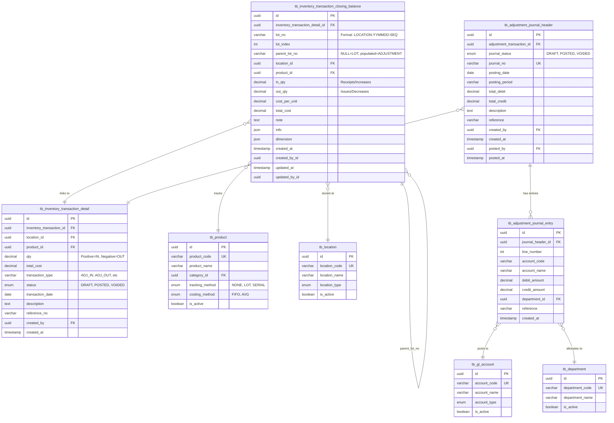

# DS-INV-ADJ: Inventory Adjustments Data Definition

**Document Version**: 2.2 (Two-Level Category/Reason Classification)
**Last Updated**: 2025-12-13
## Document History

| Version | Date | Author | Changes |
|---------|------|--------|---------|
| 2.2.0 | 2025-12-13 | Documentation Team | Added Two-Level Category/Reason Classification structure (Category at header-level, Reason at item-level for GL mapping) |
| 2.1.0 | 2025-12-09 | Documentation Team | Updated enum_adjustment_reason to type-specific (IN/OUT), added costing rules |
| 2.0.0 | 2025-11-19 | Documentation Team | Aligned with Shared Methods |
| 1.1.0 | 2025-11-15 | Documentation Team | Migrated from DS to DD format |
| 1.0.0 | 2025-11-19 | Documentation Team | Initial version |

**Module**: Inventory Management
**Sub-Module**: Inventory Adjustments

---

## Document Overview

This document provides comprehensive data schema documentation for the Inventory Adjustments module. It shows how inventory adjustments integrate with the **shared inventory transaction system** (`tb_inventory_transaction_closing_balance`) using the `parent_lot_no` pattern to create ADJUSTMENT-type transactions that reference parent LOT transactions.

**IMPORTANT**: Inventory adjustments do NOT use standalone tables. They use the **shared costing methods infrastructure** defined in the Shared Methods documentation.

**Related Documents**:
- [BR-INV-ADJ: Business Requirements](./BR-inventory-adjustments.md)
- [UC-INV-ADJ: Use Cases](./UC-inventory-adjustments.md)
- [TS-INV-ADJ: Technical Specification](./TS-inventory-adjustments.md)
- [FD-INV-ADJ: Flow Diagrams](./FD-inventory-adjustments.md)
- [VAL-INV-ADJ: Validations](./VAL-inventory-adjustments.md)
- **[SM: Costing Methods](../../shared-methods/inventory-valuation/SM-costing-methods.md)** ← Core transaction system
- **[SM: Period-End Snapshots](../../shared-methods/inventory-valuation/SM-period-end-snapshots.md)** ← Period management

**Note**: Current implementation uses TypeScript interfaces with mock data. This document describes how adjustments integrate with the target PostgreSQL database schema for production implementation.

---

## Architecture Overview

### Shared Transaction System Integration

Inventory adjustments use the **parent_lot_no pattern** to record adjustment transactions in the existing `tb_inventory_transaction_closing_balance` table:

```
Transaction Type Distinction (via parent_lot_no):
┌─────────────────────────────────────────────────────────┐
│ LOT Transactions (parent_lot_no = NULL)                  │
│ - GRN receipts (create new lots)                         │
│ - Transfer In (create new lots at destination)           │
│ - Production Output (create new lots)                    │
└─────────────────────────────────────────────────────────┘
                           ↓
┌─────────────────────────────────────────────────────────┐
│ ADJUSTMENT Transactions (parent_lot_no = populated)      │
│ - Inventory Adjustments (IN/OUT)                         │
│ - Store Requisitions (consumption)                       │
│ - Credit Notes (returns)                                 │
│ - Production Consumption                                 │
└─────────────────────────────────────────────────────────┘
```

**Key Principle**: Adjustments are **ADJUSTMENT-type transactions** that reference parent LOT transactions via the `parent_lot_no` field.

---

## Entity-Relationship Diagram



**Key Relationships**:
1. **Shared Transaction System**: Adjustments use `tb_inventory_transaction_closing_balance` with `parent_lot_no` pattern
2. **LOT → ADJUSTMENT**: Parent-child relationship via `parent_lot_no` field (self-referencing)
3. **Transaction Detail**: Links to high-level transaction in `tb_inventory_transaction_detail`
4. **Journal Integration**: Adjustment transactions generate GL journal entries
5. **Product Tracking**: Respects product-level tracking method (NONE, LOT, SERIAL)
6. **Location Storage**: Adjustments occur at specific locations
7. **Department Allocation**: Cost allocated to departments via journal entries

---

## Core Tables

### tb_inventory_transaction_closing_balance

**Purpose**: Shared table for ALL inventory transactions including LOT (receipts) and ADJUSTMENT (consumption/adjustments) transactions

**Schema Reference**: See `schema.prisma:614-639` and `SM-costing-methods.md` for complete specification

**Table Definition**:

| Column Name | Data Type | Constraints | Default | Description |
|-------------|-----------|-------------|---------|-------------|
| `id` | UUID | PRIMARY KEY | gen_random_uuid() | Unique transaction entry identifier |
| `inventory_transaction_detail_id` | UUID | NOT NULL, FOREIGN KEY | - | Links to parent transaction detail |
| `lot_no` | VARCHAR | NULLABLE | NULL | Lot number (format: `{LOCATION}-{YYMMDD}-{SEQ}`, e.g., `MK-251102-01`) |
| `lot_index` | INT | NOT NULL | 1 | Index for multiple entries with same lot_no |
| `parent_lot_no` | VARCHAR | NULLABLE | NULL | **NULL = LOT transaction, populated = ADJUSTMENT transaction** |
| `location_id` | UUID | NULLABLE, FOREIGN KEY | NULL | Storage location |
| `product_id` | UUID | NULLABLE, FOREIGN KEY | NULL | Product/item identifier |
| `in_qty` | DECIMAL(20, 5) | NULLABLE | NULL | Incoming/increase quantity (receipts, adjustments IN) |
| `out_qty` | DECIMAL(20, 5) | NULLABLE | NULL | Outgoing/decrease quantity (issues, adjustments OUT) |
| `cost_per_unit` | DECIMAL(20, 5) | NULLABLE | NULL | Cost per unit for this transaction |
| `total_cost` | DECIMAL(20, 5) | NULLABLE | NULL | Total cost (quantity × unit cost) |
| `note` | TEXT | NULLABLE | NULL | Transaction notes |
| `info` | JSON | NULLABLE | NULL | Additional structured information |
| `dimension` | JSON | NULLABLE | NULL | Multi-dimensional analysis tags |
| `created_at` | TIMESTAMP | NULLABLE | NULL | Creation timestamp |
| `created_by_id` | UUID | NULLABLE | NULL | User who created entry |
| `updated_at` | TIMESTAMP | NULLABLE | NULL | Last update timestamp |
| `updated_by_id` | UUID | NULLABLE | NULL | User who last updated |

**Unique Constraints**:
```sql
UNIQUE (lot_no, lot_index)
-- Ensures unique lot number + index combination
```

**Indexes** (from shared system):
```sql
-- Lot-based queries (FIFO)
CREATE INDEX idx_closing_balance_lot
  ON tb_inventory_transaction_closing_balance(lot_no, product_id, location_id);

-- Product-location queries
CREATE INDEX idx_closing_balance_product_location
  ON tb_inventory_transaction_closing_balance(product_id, location_id);

-- Parent-child lot relationship queries
CREATE INDEX idx_closing_balance_parent_lot
  ON tb_inventory_transaction_closing_balance(parent_lot_no)
  WHERE parent_lot_no IS NOT NULL;

-- Transaction type filtering
CREATE INDEX idx_closing_balance_transaction_type
  ON tb_inventory_transaction_closing_balance(parent_lot_no)
  WHERE parent_lot_no IS NULL;  -- LOT transactions only
```

**Check Constraints**:
```sql
-- Quantities must be non-negative
ALTER TABLE tb_inventory_transaction_closing_balance
  ADD CONSTRAINT chk_closing_balance_quantities
  CHECK (
    (in_qty IS NULL OR in_qty >= 0) AND
    (out_qty IS NULL OR out_qty >= 0)
  );

-- At least one quantity must be specified
ALTER TABLE tb_inventory_transaction_closing_balance
  ADD CONSTRAINT chk_closing_balance_has_quantity
  CHECK (
    in_qty IS NOT NULL OR out_qty IS NOT NULL
  );

-- Cost consistency
ALTER TABLE tb_inventory_transaction_closing_balance
  ADD CONSTRAINT chk_closing_balance_cost
  CHECK (
    cost_per_unit IS NULL OR cost_per_unit >= 0
  );
```

### How Adjustments Use This Table

#### Adjustment IN (Inventory Increase)

**Example**: Physical count reveals 50 extra units of flour

```sql
-- Create ADJUSTMENT transaction entry
INSERT INTO tb_inventory_transaction_closing_balance (
  id,
  inventory_transaction_detail_id,
  lot_no,
  lot_index,
  parent_lot_no,            -- ← References parent LOT
  location_id,
  product_id,
  in_qty,                   -- ← Increase quantity
  out_qty,
  cost_per_unit,
  total_cost,
  note,
  created_at,
  created_by_id
) VALUES (
  gen_random_uuid(),
  'detail-transaction-uuid',
  'MK-251105-01',           -- Parent lot number
  2,                        -- lot_index (parent lot is index 1)
  'MK-251105-01',           -- ← parent_lot_no populated = ADJUSTMENT transaction
  'location-kitchen-uuid',
  'product-flour-uuid',
  50.00000,                 -- in_qty = increase
  0.00000,                  -- out_qty = 0
  12.50000,                 -- Use parent lot's cost
  625.00000,                -- 50 × 12.50
  'Physical count variance - adjustment IN',
  NOW(),
  'user-uuid'
);
```

**Resulting Balance Calculation**:
```sql
-- Query to get current balance for lot MK-251105-01
SELECT
  lot_no,
  SUM(in_qty) - SUM(out_qty) as remaining_quantity,
  cost_per_unit,
  SUM(in_qty * cost_per_unit) - SUM(out_qty * cost_per_unit) as total_value
FROM tb_inventory_transaction_closing_balance
WHERE lot_no = 'MK-251105-01'
  AND product_id = 'product-flour-uuid'
  AND location_id = 'location-kitchen-uuid'
GROUP BY lot_no, cost_per_unit;

-- Result:
-- lot_no: MK-251105-01
-- remaining_quantity: 150 (original 100 + adjustment 50)
-- cost_per_unit: 12.50
-- total_value: 1875.00 (150 × 12.50)
```

#### Adjustment OUT (Inventory Decrease)

**Example**: Damaged goods - remove 30 units

```sql
-- Create ADJUSTMENT transaction entry
INSERT INTO tb_inventory_transaction_closing_balance (
  id,
  inventory_transaction_detail_id,
  lot_no,
  lot_index,
  parent_lot_no,            -- ← References parent LOT
  location_id,
  product_id,
  in_qty,
  out_qty,                  -- ← Decrease quantity
  cost_per_unit,
  total_cost,
  note,
  created_at,
  created_by_id
) VALUES (
  gen_random_uuid(),
  'detail-transaction-uuid',
  'MK-251105-01',           -- Parent lot number
  3,                        -- lot_index (next sequential)
  'MK-251105-01',           -- ← parent_lot_no populated = ADJUSTMENT transaction
  'location-kitchen-uuid',
  'product-flour-uuid',
  0.00000,                  -- in_qty = 0
  30.00000,                 -- out_qty = decrease
  12.50000,                 -- Use parent lot's cost
  -375.00000,               -- Negative: 30 × 12.50 (inventory reduction)
  'Damaged goods - adjustment OUT',
  NOW(),
  'user-uuid'
);
```

**Resulting Balance Calculation**:
```sql
-- Updated balance for lot MK-251105-01
SELECT
  lot_no,
  SUM(in_qty) - SUM(out_qty) as remaining_quantity,
  cost_per_unit,
  SUM(in_qty * cost_per_unit) - SUM(out_qty * cost_per_unit) as total_value
FROM tb_inventory_transaction_closing_balance
WHERE lot_no = 'MK-251105-01'
  AND product_id = 'product-flour-uuid'
  AND location_id = 'location-kitchen-uuid'
GROUP BY lot_no, cost_per_unit;

-- Result:
-- lot_no: MK-251105-01
-- remaining_quantity: 120 (150 - 30)
-- cost_per_unit: 12.50
-- total_value: 1500.00 (120 × 12.50)
```

#### Querying LOT vs ADJUSTMENT Transactions

```sql
-- Get all LOT transactions (new lot creations)
SELECT
  lot_no,
  in_qty,
  out_qty,
  cost_per_unit,
  total_cost,
  created_at,
  'LOT' as transaction_type
FROM tb_inventory_transaction_closing_balance
WHERE parent_lot_no IS NULL  -- ← NULL = LOT transaction
  AND product_id = :product_id
  AND location_id = :location_id
ORDER BY lot_no ASC;  -- FIFO order

-- Get all ADJUSTMENT transactions (consumption/adjustments)
SELECT
  lot_no,
  parent_lot_no,  -- ← Shows which lot was adjusted
  in_qty,
  out_qty,
  cost_per_unit,
  total_cost,
  created_at,
  'ADJUSTMENT' as transaction_type
FROM tb_inventory_transaction_closing_balance
WHERE parent_lot_no IS NOT NULL  -- ← Populated = ADJUSTMENT transaction
  AND product_id = :product_id
  AND location_id = :location_id
ORDER BY created_at ASC;

-- Get complete audit trail for a specific lot
SELECT
  id,
  lot_no,
  lot_index,
  parent_lot_no,
  CASE
    WHEN parent_lot_no IS NULL THEN 'LOT'
    ELSE 'ADJUSTMENT'
  END as transaction_type,
  in_qty,
  out_qty,
  cost_per_unit,
  total_cost,
  note,
  created_at,
  SUM(in_qty) OVER (ORDER BY created_at) -
    SUM(out_qty) OVER (ORDER BY created_at) as running_balance
FROM tb_inventory_transaction_closing_balance
WHERE lot_no = 'MK-251105-01'
ORDER BY created_at ASC;
```

---

### tb_inventory_transaction_detail

**Purpose**: High-level transaction record that groups individual lot-level entries

**Table Definition**:

| Column Name | Data Type | Constraints | Default | Description |
|-------------|-----------|-------------|---------|-------------|
| `id` | UUID | PRIMARY KEY | gen_random_uuid() | Unique transaction identifier |
| `inventory_transaction_id` | UUID | NOT NULL, FOREIGN KEY | - | Links to transaction header |
| `location_id` | UUID | NOT NULL, FOREIGN KEY | - | Transaction location |
| `product_id` | UUID | NOT NULL, FOREIGN KEY | - | Product being adjusted |
| `qty` | DECIMAL(20, 5) | NOT NULL | - | Transaction quantity (positive=IN, negative=OUT) |
| `total_cost` | DECIMAL(20, 5) | NOT NULL | - | Total cost impact |
| `transaction_type` | VARCHAR(50) | NOT NULL | - | ADJ_IN, ADJ_OUT, ISSUE, GRN, etc. |
| `status` | ENUM | NOT NULL | 'DRAFT' | DRAFT, POSTED, VOIDED |
| `transaction_date` | DATE | NOT NULL | - | Transaction date |
| `description` | TEXT | NULLABLE | NULL | Transaction description |
| `reference_no` | VARCHAR(50) | NULLABLE | NULL | Reference number (e.g., ADJ-2501-0001) |
| `created_by` | UUID | NOT NULL, FOREIGN KEY | - | User who created |
| `created_at` | TIMESTAMP | NOT NULL | now() | Creation timestamp |

**Indexes**:
```sql
-- Status and date filtering
CREATE INDEX idx_transaction_detail_status_date
  ON tb_inventory_transaction_detail(status, transaction_date DESC);

-- Product-location queries
CREATE INDEX idx_transaction_detail_product_location
  ON tb_inventory_transaction_detail(product_id, location_id, transaction_date DESC);

-- Reference number lookup
CREATE INDEX idx_transaction_detail_reference
  ON tb_inventory_transaction_detail(reference_no)
  WHERE reference_no IS NOT NULL;

-- Transaction type filtering
CREATE INDEX idx_transaction_detail_type
  ON tb_inventory_transaction_detail(transaction_type, transaction_date DESC);
```

### Adjustment Transaction Flow

**Complete Example: Adjustment OUT (30 units damaged)**

```sql
-- Step 1: Create high-level transaction detail
INSERT INTO tb_inventory_transaction_detail (
  id,
  inventory_transaction_id,
  location_id,
  product_id,
  qty,
  total_cost,
  transaction_type,
  status,
  transaction_date,
  description,
  reference_no,
  created_by,
  created_at
) VALUES (
  'detail-uuid-123',
  'transaction-header-uuid',
  'location-kitchen-uuid',
  'product-flour-uuid',
  -30.00000,              -- Negative = OUT
  -375.00000,             -- Cost impact
  'ADJ_OUT',
  'DRAFT',                -- Start as draft
  '2025-01-10',
  'Damaged goods - physical count adjustment',
  'ADJ-2501-0001',
  'user-uuid',
  NOW()
);

-- Step 2: Create lot-level ADJUSTMENT entry
INSERT INTO tb_inventory_transaction_closing_balance (
  id,
  inventory_transaction_detail_id,
  lot_no,
  lot_index,
  parent_lot_no,
  location_id,
  product_id,
  in_qty,
  out_qty,
  cost_per_unit,
  total_cost,
  note,
  created_at,
  created_by_id
) VALUES (
  gen_random_uuid(),
  'detail-uuid-123',      -- Links to transaction detail
  'MK-251105-01',
  3,                      -- Next lot_index
  'MK-251105-01',         -- parent_lot_no = ADJUSTMENT type
  'location-kitchen-uuid',
  'product-flour-uuid',
  0.00000,
  30.00000,               -- out_qty
  12.50000,
  -375.00000,
  'Adjustment OUT - damaged goods',
  NOW(),
  'user-uuid'
);

-- Step 3: Post transaction (update status)
UPDATE tb_inventory_transaction_detail
SET
  status = 'POSTED',
  updated_at = NOW(),
  posted_by = 'user-uuid',
  posted_at = NOW()
WHERE id = 'detail-uuid-123';

-- Step 4: Generate journal entry (see tb_adjustment_journal_header section)
```

---

## Journal Tables

### tb_adjustment_journal_header

**Purpose**: Journal header for adjustment transactions that need GL posting

**Table Definition**:

| Column Name | Data Type | Constraints | Default | Description |
|-------------|-----------|-------------|---------|-------------|
| `id` | UUID | PRIMARY KEY | gen_random_uuid() | Unique journal header identifier |
| `adjustment_transaction_id` | UUID | NOT NULL, FOREIGN KEY | - | Links to inventory transaction detail |
| `journal_status` | ENUM | NOT NULL | 'DRAFT' | DRAFT, POSTED, VOIDED |
| `journal_no` | VARCHAR(50) | NOT NULL, UNIQUE | - | Journal entry number (e.g., JE-2501-0001) |
| `posting_date` | DATE | NOT NULL | - | GL posting date |
| `posting_period` | VARCHAR(7) | NOT NULL | - | Period (YYYY-MM) |
| `total_debit` | DECIMAL(20, 2) | NOT NULL | 0 | Total debit amount |
| `total_credit` | DECIMAL(20, 2) | NOT NULL | 0 | Total credit amount |
| `description` | TEXT | NULLABLE | NULL | Journal description |
| `reference` | VARCHAR(100) | NULLABLE | NULL | Reference (e.g., ADJ-2501-0001) |
| `created_by` | UUID | NOT NULL, FOREIGN KEY | - | User who created |
| `created_at` | TIMESTAMP | NOT NULL | now() | Creation timestamp |
| `posted_by` | UUID | NULLABLE, FOREIGN KEY | NULL | User who posted |
| `posted_at` | TIMESTAMP | NULLABLE | NULL | Posting timestamp |

**Check Constraints**:
```sql
-- Journal must be balanced
ALTER TABLE tb_adjustment_journal_header
  ADD CONSTRAINT chk_journal_balanced
  CHECK (ABS(total_debit - total_credit) < 0.01);

-- Totals must be non-negative
ALTER TABLE tb_adjustment_journal_header
  ADD CONSTRAINT chk_journal_totals
  CHECK (total_debit >= 0 AND total_credit >= 0);
```

**Indexes**:
```sql
-- Journal number lookup
CREATE INDEX idx_journal_header_no
  ON tb_adjustment_journal_header(journal_no);

-- Status filtering
CREATE INDEX idx_journal_header_status
  ON tb_adjustment_journal_header(journal_status, posting_date DESC);

-- Period reporting
CREATE INDEX idx_journal_header_period
  ON tb_adjustment_journal_header(posting_period, journal_status);

-- Transaction reference
CREATE INDEX idx_journal_header_transaction
  ON tb_adjustment_journal_header(adjustment_transaction_id);
```

---

### tb_adjustment_journal_entry

**Purpose**: Individual journal entry lines (debits and credits)

**Table Definition**:

| Column Name | Data Type | Constraints | Default | Description |
|-------------|-----------|-------------|---------|-------------|
| `id` | UUID | PRIMARY KEY | gen_random_uuid() | Unique entry identifier |
| `journal_header_id` | UUID | NOT NULL, FOREIGN KEY | - | Journal header |
| `line_number` | INT | NOT NULL | - | Entry line number |
| `account_code` | VARCHAR(20) | NOT NULL | - | GL account code |
| `account_name` | VARCHAR(200) | NOT NULL | - | GL account name (denormalized) |
| `debit_amount` | DECIMAL(20, 2) | NOT NULL | 0 | Debit amount |
| `credit_amount` | DECIMAL(20, 2) | NOT NULL | 0 | Credit amount |
| `department_id` | UUID | NULLABLE, FOREIGN KEY | NULL | Cost center/department |
| `reference` | VARCHAR(100) | NULLABLE | NULL | Additional reference |
| `created_at` | TIMESTAMP | NOT NULL | now() | Creation timestamp |

**Check Constraints**:
```sql
-- Entry must have either debit or credit (not both)
ALTER TABLE tb_adjustment_journal_entry
  ADD CONSTRAINT chk_journal_entry_amount
  CHECK (
    (debit_amount > 0 AND credit_amount = 0) OR
    (debit_amount = 0 AND credit_amount > 0)
  );

-- Amounts must be non-negative
ALTER TABLE tb_adjustment_journal_entry
  ADD CONSTRAINT chk_journal_entry_nonnegative
  CHECK (debit_amount >= 0 AND credit_amount >= 0);
```

**Indexes**:
```sql
-- Journal header lookup
CREATE INDEX idx_journal_entry_header
  ON tb_adjustment_journal_entry(journal_header_id, line_number);

-- Account analysis
CREATE INDEX idx_journal_entry_account
  ON tb_adjustment_journal_entry(account_code);

-- Department analysis
CREATE INDEX idx_journal_entry_department
  ON tb_adjustment_journal_entry(department_id)
  WHERE department_id IS NOT NULL;
```

### GL Account Mapping

**Business Rule**: Adjustment reason and type determine GL account mapping

| Reason | Type | Debit Account | Credit Account | Description |
|--------|------|---------------|----------------|-------------|
| physical_count_variance | IN | 1100 (Inventory) | 5100 (COGS) | Count revealed more inventory |
| physical_count_variance | OUT | 5100 (COGS) | 1100 (Inventory) | Count revealed less inventory |
| damaged_goods | OUT | 5200 (Waste) | 1100 (Inventory) | Damaged/unsellable goods |
| spoilage | OUT | 5200 (Waste) | 1100 (Inventory) | Expired/spoiled items |
| waste | OUT | 5200 (Waste) | 1100 (Inventory) | Production waste |
| sample | OUT | 5300 (Sample Expense) | 1100 (Inventory) | Samples given |
| promotion | OUT | 5400 (Marketing) | 1100 (Inventory) | Promotional items |
| conversion | OUT | 1100 (Inventory) | 1100 (Inventory) | Unit conversion |
| inter_department_transfer | OUT | 1100 (Inventory) | 1100 (Inventory) | Between departments |

**Journal Generation Example**:

```sql
-- For ADJ-2501-0001: OUT 30 units @ $12.50 = $375 (damaged goods)

-- Step 1: Create journal header
INSERT INTO tb_adjustment_journal_header (
  id,
  adjustment_transaction_id,
  journal_status,
  journal_no,
  posting_date,
  posting_period,
  total_debit,
  total_credit,
  description,
  reference,
  created_by,
  created_at
) VALUES (
  gen_random_uuid(),
  'detail-uuid-123',
  'DRAFT',
  'JE-2501-0001',
  '2025-01-10',
  '2025-01',
  375.00,
  375.00,
  'Inventory adjustment - damaged goods',
  'ADJ-2501-0001',
  'user-uuid',
  NOW()
);

-- Step 2: Create debit entry (Waste account)
INSERT INTO tb_adjustment_journal_entry (
  id,
  journal_header_id,
  line_number,
  account_code,
  account_name,
  debit_amount,
  credit_amount,
  department_id,
  reference,
  created_at
) VALUES (
  gen_random_uuid(),
  'journal-header-uuid',
  1,
  '5200',
  'Waste Expense',
  375.00,
  0.00,
  'department-kitchen-uuid',
  'ADJ-2501-0001',
  NOW()
);

-- Step 3: Create credit entry (Inventory account)
INSERT INTO tb_adjustment_journal_entry (
  id,
  journal_header_id,
  line_number,
  account_code,
  account_name,
  debit_amount,
  credit_amount,
  department_id,
  reference,
  created_at
) VALUES (
  gen_random_uuid(),
  'journal-header-uuid',
  2,
  '1100',
  'Inventory',
  0.00,
  375.00,
  'department-kitchen-uuid',
  'ADJ-2501-0001',
  NOW()
);
```

---

## Enumerations

### enum_adjustment_type

**Purpose**: Direction of inventory adjustment

**Values**:
```sql
CREATE TYPE enum_adjustment_type AS ENUM (
  'IN',   -- Inventory increase
  'OUT'   -- Inventory decrease
);
```

**Usage**:
- Stored in `tb_inventory_transaction_detail.transaction_type` as 'ADJ_IN' or 'ADJ_OUT'
- Determines whether `in_qty` or `out_qty` is populated in closing balance table

---

### enum_adjustment_status

**Purpose**: Workflow status of adjustment transaction

**Values**:
```sql
CREATE TYPE enum_adjustment_status AS ENUM (
  'DRAFT',    -- Created, can be edited
  'POSTED',   -- Posted to inventory and GL, immutable
  'VOIDED'    -- Reversed, immutable
);
```

**State Transitions**:
```
DRAFT → POSTED → VOIDED
```

**Usage**: Stored in `tb_inventory_transaction_detail.status`

---

### enum_adjustment_reason

**Purpose**: Business reason for inventory adjustment. **Type-specific** - different reasons available for Stock IN vs Stock OUT.

**Values**:
```sql
-- Stock OUT reasons (for decreasing inventory)
CREATE TYPE enum_adjustment_reason_out AS ENUM (
  'damaged',              -- Damaged Goods: Items damaged during storage/handling
  'expired',              -- Expired Items: Items past expiration date
  'theft_loss',           -- Theft / Loss: Missing items, theft, unknown loss
  'spoilage',             -- Spoilage: Perishable items spoiled before expiration
  'count_variance',       -- Physical Count Variance: Discrepancy during count (decrease)
  'quality_rejection',    -- Quality Control Rejection: Items failed QC inspection
  'other'                 -- Other: Requires free-text description
);

-- Stock IN reasons (for increasing inventory)
CREATE TYPE enum_adjustment_reason_in AS ENUM (
  'count_variance',       -- Physical Count Variance: Discrepancy during count (increase)
  'found_items',          -- Found Items: Previously missing items located
  'return_to_stock',      -- Return to Stock: Items returned from production/service
  'system_correction',    -- System Correction: Data entry error corrections
  'other'                 -- Other: Requires free-text description
);
```

**Usage**:
- Stored in `tb_inventory_transaction_detail.info` JSON field as `{"reason": "damaged"}`
- Reason dropdown dynamically filters based on selected adjustment type (IN/OUT)
- Determines GL account mapping for journal generation:
  - All Stock IN → Debit 1310 Raw Materials Inventory, Credit 5110 Inventory Variance
  - All Stock OUT → Debit 5110 Inventory Variance, Credit 1310 Raw Materials Inventory

**Costing Rules by Type**:
- Stock OUT: Unit cost = product's average cost (automatically populated, read-only)
- Stock IN: Unit cost must be manually entered (required, affects inventory valuation)

---

### Two-Level Category/Reason Classification

**Purpose**: Provides financial categorization at header level (Category → GL Account) with detailed reasons at item level for reporting and analysis. This two-level structure enables:
- **Category (Header-Level)**: Maps to GL accounts for financial reporting
- **Reason (Item-Level)**: Provides specific detail within each category, filtered by the selected category

**Data Structure**:

#### TypeScript Interface (Frontend)

```typescript
// Individual reason option within a category
interface CategoryReason {
  value: string      // Machine-readable identifier (e.g., "damaged")
  label: string      // User-friendly display name (e.g., "Damaged Goods")
}

// Category with its available reasons
interface AdjustmentCategory {
  value: string              // Category identifier (e.g., "wastage")
  label: string              // Display name (e.g., "Wastage")
  reasons: CategoryReason[]  // Available reasons for this category
}

// Type-specific categories
type AdjustmentCategories = Record<'IN' | 'OUT', AdjustmentCategory[]>
```

#### Stock OUT Categories

| Category | GL Account | Reasons | Description |
|----------|------------|---------|-------------|
| **Wastage** | 5200 Waste Expense | Damaged Goods, Expired Items, Spoilage | Items unfit for use due to damage, expiration, or spoilage |
| **Loss** | 5210 Inventory Loss | Theft/Loss, Pilferage, Missing Items | Items missing due to theft, loss, or unexplained reasons |
| **Quality** | 5100 COGS | Quality Control Rejection, Below Standard | Items rejected during QC inspection |
| **Consumption** | 5100 COGS | Tastings, Breakage, Shrinkage | Items consumed during operations or lost to normal shrinkage |

#### Stock IN Categories

| Category | GL Account | Reasons | Description |
|----------|------------|---------|-------------|
| **Found** | 1310 Raw Materials Inventory | Count Variance, Found Items | Items discovered during physical count or previously lost items |
| **Return** | 1310 Raw Materials Inventory | Return to Stock, Rejected Return | Items returned to inventory from production or rejected returns |
| **Correction** | 1310 Raw Materials Inventory | System Correction, Data Entry Error | Corrections for system errors or data entry mistakes |

**Cascading Reset Behavior**:
1. When adjustment type (IN/OUT) changes → Category resets to empty → All item reasons reset
2. When category changes → All item reasons reset (since reasons are category-specific)

**Storage**: Category and item reasons stored in `tb_inventory_transaction_detail.info` JSON field:

```json
{
  "category": "wastage",
  "items": [
    {
      "product_id": "uuid-123",
      "reason": "damaged",
      "qty": 10,
      "unit_cost": 5.00
    },
    {
      "product_id": "uuid-456",
      "reason": "expired",
      "qty": 5,
      "unit_cost": 3.50
    }
  ]
}
```

**GL Account Mapping by Category**:

| Adjustment Type | Category | Debit Account | Credit Account |
|----------------|----------|---------------|----------------|
| OUT | Wastage | 5200 Waste Expense | 1310 Raw Materials Inventory |
| OUT | Loss | 5210 Inventory Loss | 1310 Raw Materials Inventory |
| OUT | Quality | 5100 COGS | 1310 Raw Materials Inventory |
| OUT | Consumption | 5100 COGS | 1310 Raw Materials Inventory |
| IN | Found | 1310 Raw Materials Inventory | 5110 Inventory Variance |
| IN | Return | 1310 Raw Materials Inventory | 5110 Inventory Variance |
| IN | Correction | 1310 Raw Materials Inventory | 5110 Inventory Variance |

**Implementation Notes**:
- Category is selected once per adjustment at the header level
- Each item can have a different reason within the selected category
- Reason dropdown is dynamically filtered based on the header-level category selection
- Future: Replace hardcoded data with API call to Transaction Category/Reason master CRUD

---

### enum_journal_status

**Purpose**: Status of GL journal entry

**Values**:
```sql
CREATE TYPE enum_journal_status AS ENUM (
  'DRAFT',    -- Created, not posted to GL
  'POSTED',   -- Posted to GL, immutable
  'VOIDED'    -- Reversed in GL, immutable
);
```

**Usage**: Stored in `tb_adjustment_journal_header.journal_status`

---

### enum_location_type

**Purpose**: Classification of storage locations

**Values**:
```sql
CREATE TYPE enum_location_type AS ENUM (
  'WAREHOUSE',      -- Central storage warehouse
  'KITCHEN',        -- Kitchen storage (hot/cold)
  'BAR',            -- Bar storage (beverages)
  'OUTLET',         -- Restaurant/cafe storage
  'HOUSEKEEPING',   -- Housekeeping storage
  'ENGINEERING'     -- Engineering/maintenance
);
```

**Usage**: Stored in `tb_location.location_type`

---

## Database Functions

### fn_post_adjustment_transaction

**Purpose**: Post adjustment transaction (update status, generate journal, update stock)

**Function Definition**:
```sql
CREATE OR REPLACE FUNCTION fn_post_adjustment_transaction(
  p_transaction_detail_id UUID,
  p_posted_by UUID
)
RETURNS BOOLEAN AS $$
DECLARE
  v_transaction_record RECORD;
  v_journal_id UUID;
BEGIN
  -- Get transaction details
  SELECT * INTO v_transaction_record
  FROM tb_inventory_transaction_detail
  WHERE id = p_transaction_detail_id
    AND status = 'DRAFT';

  IF NOT FOUND THEN
    RAISE EXCEPTION 'Transaction not found or not in DRAFT status';
  END IF;

  -- Validate stock availability for OUT adjustments
  IF v_transaction_record.qty < 0 THEN
    -- Check available quantity (handled by application logic via SM-costing-methods)
    -- Function delegates to FIFO/Periodic Average validation
  END IF;

  -- Update transaction status to POSTED
  UPDATE tb_inventory_transaction_detail
  SET
    status = 'POSTED',
    posted_by = p_posted_by,
    posted_at = NOW(),
    updated_at = NOW()
  WHERE id = p_transaction_detail_id;

  -- Generate journal entry
  v_journal_id := fn_generate_adjustment_journal(p_transaction_detail_id);

  -- Post journal to GL
  UPDATE tb_adjustment_journal_header
  SET
    journal_status = 'POSTED',
    posted_by = p_posted_by,
    posted_at = NOW()
  WHERE id = v_journal_id;

  RETURN TRUE;
END;
$$ LANGUAGE plpgsql;
```

---

### fn_void_adjustment_transaction

**Purpose**: Void posted adjustment (create reversing entries)

**Function Definition**:
```sql
CREATE OR REPLACE FUNCTION fn_void_adjustment_transaction(
  p_transaction_detail_id UUID,
  p_voided_by UUID,
  p_void_reason TEXT
)
RETURNS BOOLEAN AS $$
DECLARE
  v_transaction_record RECORD;
  v_reversing_detail_id UUID;
BEGIN
  -- Get transaction details
  SELECT * INTO v_transaction_record
  FROM tb_inventory_transaction_detail
  WHERE id = p_transaction_detail_id
    AND status = 'POSTED';

  IF NOT FOUND THEN
    RAISE EXCEPTION 'Transaction not found or not in POSTED status';
  END IF;

  -- Validate void reason
  IF p_void_reason IS NULL OR LENGTH(TRIM(p_void_reason)) < 10 THEN
    RAISE EXCEPTION 'Void reason must be at least 10 characters';
  END IF;

  -- Create reversing transaction detail
  INSERT INTO tb_inventory_transaction_detail (
    id,
    inventory_transaction_id,
    location_id,
    product_id,
    qty,
    total_cost,
    transaction_type,
    status,
    transaction_date,
    description,
    reference_no,
    created_by,
    created_at
  )
  SELECT
    gen_random_uuid(),
    inventory_transaction_id,
    location_id,
    product_id,
    -qty,                           -- Reverse quantity
    -total_cost,                    -- Reverse cost
    CASE
      WHEN transaction_type = 'ADJ_IN' THEN 'ADJ_OUT'
      WHEN transaction_type = 'ADJ_OUT' THEN 'ADJ_IN'
      ELSE transaction_type
    END,
    'POSTED',                       -- Post immediately
    CURRENT_DATE,
    'VOID: ' || description || ' - ' || p_void_reason,
    'VOID-' || reference_no,
    p_voided_by,
    NOW()
  FROM tb_inventory_transaction_detail
  WHERE id = p_transaction_detail_id
  RETURNING id INTO v_reversing_detail_id;

  -- Create reversing lot-level entries
  INSERT INTO tb_inventory_transaction_closing_balance (
    id,
    inventory_transaction_detail_id,
    lot_no,
    lot_index,
    parent_lot_no,
    location_id,
    product_id,
    in_qty,
    out_qty,
    cost_per_unit,
    total_cost,
    note,
    created_at,
    created_by_id
  )
  SELECT
    gen_random_uuid(),
    v_reversing_detail_id,
    lot_no,
    lot_index + 1000,               -- Offset to avoid conflicts
    parent_lot_no,
    location_id,
    product_id,
    out_qty,                        -- Swap in/out
    in_qty,
    cost_per_unit,
    -total_cost,                    -- Reverse cost
    'VOID: ' || note,
    NOW(),
    p_voided_by
  FROM tb_inventory_transaction_closing_balance
  WHERE inventory_transaction_detail_id = p_transaction_detail_id;

  -- Create reversing journal entry
  PERFORM fn_generate_reversing_journal(p_transaction_detail_id, v_reversing_detail_id);

  -- Update original transaction status
  UPDATE tb_inventory_transaction_detail
  SET
    status = 'VOIDED',
    voided_by = p_voided_by,
    voided_at = NOW(),
    void_reason = p_void_reason,
    updated_at = NOW()
  WHERE id = p_transaction_detail_id;

  RETURN TRUE;
END;
$$ LANGUAGE plpgsql;
```

---

### fn_generate_adjustment_journal

**Purpose**: Generate balanced journal entry for adjustment transaction

**Function Definition**:
```sql
CREATE OR REPLACE FUNCTION fn_generate_adjustment_journal(
  p_transaction_detail_id UUID
)
RETURNS UUID AS $$
DECLARE
  v_transaction_record RECORD;
  v_journal_id UUID;
  v_reason TEXT;
  v_adj_type TEXT;
  v_debit_account VARCHAR(20);
  v_credit_account VARCHAR(20);
BEGIN
  -- Get transaction details
  SELECT
    td.*,
    td.info->>'reason' as adjustment_reason,
    CASE
      WHEN td.transaction_type = 'ADJ_IN' THEN 'IN'
      WHEN td.transaction_type = 'ADJ_OUT' THEN 'OUT'
    END as adj_type
  INTO v_transaction_record
  FROM tb_inventory_transaction_detail td
  WHERE td.id = p_transaction_detail_id;

  -- Determine GL accounts based on reason and type
  SELECT
    debit_account,
    credit_account
  INTO v_debit_account, v_credit_account
  FROM fn_get_adjustment_gl_mapping(
    v_transaction_record.adjustment_reason,
    v_transaction_record.adj_type
  );

  -- Create journal header
  v_journal_id := gen_random_uuid();

  INSERT INTO tb_adjustment_journal_header (
    id,
    adjustment_transaction_id,
    journal_status,
    journal_no,
    posting_date,
    posting_period,
    total_debit,
    total_credit,
    description,
    reference,
    created_by,
    created_at
  ) VALUES (
    v_journal_id,
    p_transaction_detail_id,
    'DRAFT',
    'JE-' || TO_CHAR(CURRENT_DATE, 'YYYY-') || LPAD(nextval('seq_journal_no')::TEXT, 6, '0'),
    v_transaction_record.transaction_date,
    TO_CHAR(v_transaction_record.transaction_date, 'YYYY-MM'),
    ABS(v_transaction_record.total_cost),
    ABS(v_transaction_record.total_cost),
    v_transaction_record.description,
    v_transaction_record.reference_no,
    v_transaction_record.created_by,
    NOW()
  );

  -- Create debit entry
  INSERT INTO tb_adjustment_journal_entry (
    id,
    journal_header_id,
    line_number,
    account_code,
    account_name,
    debit_amount,
    credit_amount,
    department_id,
    reference,
    created_at
  )
  SELECT
    gen_random_uuid(),
    v_journal_id,
    1,
    v_debit_account,
    gl.account_name,
    ABS(v_transaction_record.total_cost),
    0.00,
    NULL,  -- Department from transaction info if needed
    v_transaction_record.reference_no,
    NOW()
  FROM tb_gl_account gl
  WHERE gl.account_code = v_debit_account;

  -- Create credit entry
  INSERT INTO tb_adjustment_journal_entry (
    id,
    journal_header_id,
    line_number,
    account_code,
    account_name,
    debit_amount,
    credit_amount,
    department_id,
    reference,
    created_at
  )
  SELECT
    gen_random_uuid(),
    v_journal_id,
    2,
    v_credit_account,
    gl.account_name,
    0.00,
    ABS(v_transaction_record.total_cost),
    NULL,
    v_transaction_record.reference_no,
    NOW()
  FROM tb_gl_account gl
  WHERE gl.account_code = v_credit_account;

  RETURN v_journal_id;
END;
$$ LANGUAGE plpgsql;
```

---

## Views

### v_adjustment_summary

**Purpose**: Aggregated adjustment statistics by location and reason

```sql
CREATE OR REPLACE VIEW v_adjustment_summary AS
SELECT
  l.location_code,
  l.location_name,
  td.info->>'reason' as adjustment_reason,
  CASE
    WHEN td.transaction_type = 'ADJ_IN' THEN 'IN'
    WHEN td.transaction_type = 'ADJ_OUT' THEN 'OUT'
  END as adjustment_type,
  COUNT(*) as adjustment_count,
  SUM(ABS(td.qty)) as total_quantity,
  SUM(ABS(td.total_cost)) as total_cost_impact,
  DATE_TRUNC('month', td.transaction_date) as period
FROM tb_inventory_transaction_detail td
JOIN tb_location l ON td.location_id = l.id
WHERE td.transaction_type IN ('ADJ_IN', 'ADJ_OUT')
  AND td.status = 'POSTED'
GROUP BY
  l.location_code,
  l.location_name,
  td.info->>'reason',
  adjustment_type,
  DATE_TRUNC('month', td.transaction_date);
```

---

### v_lot_balance_with_adjustments

**Purpose**: Current lot balances with adjustment history

```sql
CREATE OR REPLACE VIEW v_lot_balance_with_adjustments AS
SELECT
  cb.lot_no,
  p.product_code,
  p.product_name,
  l.location_code,
  l.location_name,
  -- Current balance
  SUM(cb.in_qty) - SUM(cb.out_qty) as current_balance,
  cb.cost_per_unit,
  (SUM(cb.in_qty) - SUM(cb.out_qty)) * cb.cost_per_unit as current_value,
  -- LOT transactions (receipts)
  SUM(CASE WHEN cb.parent_lot_no IS NULL THEN cb.in_qty ELSE 0 END) as total_receipts,
  -- ADJUSTMENT transactions
  SUM(CASE WHEN cb.parent_lot_no IS NOT NULL THEN cb.in_qty ELSE 0 END) as total_adj_in,
  SUM(CASE WHEN cb.parent_lot_no IS NOT NULL THEN cb.out_qty ELSE 0 END) as total_adj_out,
  -- Movement counts
  COUNT(CASE WHEN cb.parent_lot_no IS NULL THEN 1 END) as receipt_count,
  COUNT(CASE WHEN cb.parent_lot_no IS NOT NULL AND cb.in_qty > 0 THEN 1 END) as adj_in_count,
  COUNT(CASE WHEN cb.parent_lot_no IS NOT NULL AND cb.out_qty > 0 THEN 1 END) as adj_out_count,
  -- Dates
  MIN(cb.created_at) as first_transaction_date,
  MAX(cb.created_at) as last_transaction_date
FROM tb_inventory_transaction_closing_balance cb
JOIN tb_product p ON cb.product_id = p.id
JOIN tb_location l ON cb.location_id = l.id
WHERE cb.lot_no IS NOT NULL
GROUP BY
  cb.lot_no,
  p.product_code,
  p.product_name,
  l.location_code,
  l.location_name,
  cb.cost_per_unit
HAVING SUM(cb.in_qty) - SUM(cb.out_qty) > 0;  -- Only active lots
```

---

## Database Triggers

### trg_validate_adjustment_posting

**Purpose**: Validate adjustment transaction before posting

```sql
CREATE OR REPLACE FUNCTION fn_validate_adjustment_posting()
RETURNS TRIGGER AS $$
BEGIN
  -- Only validate when transitioning to POSTED
  IF NEW.status = 'POSTED' AND OLD.status = 'DRAFT' THEN

    -- Check closing balance entries exist
    IF NOT EXISTS (
      SELECT 1
      FROM tb_inventory_transaction_closing_balance
      WHERE inventory_transaction_detail_id = NEW.id
    ) THEN
      RAISE EXCEPTION 'Cannot post adjustment without lot-level entries';
    END IF;

    -- For OUT adjustments, validate stock availability via FIFO
    IF NEW.transaction_type = 'ADJ_OUT' THEN
      -- Validation delegated to FIFO/Periodic Average algorithm
      -- See SM-costing-methods.md for stock availability validation
      PERFORM fn_validate_stock_availability_fifo(
        NEW.product_id,
        NEW.location_id,
        ABS(NEW.qty)
      );
    END IF;

  END IF;

  RETURN NEW;
END;
$$ LANGUAGE plpgsql;

CREATE TRIGGER trg_validate_adjustment_posting
  BEFORE UPDATE ON tb_inventory_transaction_detail
  FOR EACH ROW
  EXECUTE FUNCTION fn_validate_adjustment_posting();
```

---

### trg_prevent_posted_modification

**Purpose**: Prevent modification of posted/voided transactions

```sql
CREATE OR REPLACE FUNCTION fn_prevent_posted_modification()
RETURNS TRIGGER AS $$
BEGIN
  IF OLD.status IN ('POSTED', 'VOIDED') THEN
    RAISE EXCEPTION 'Cannot modify % transactions', OLD.status;
  END IF;
  RETURN NEW;
END;
$$ LANGUAGE plpgsql;

CREATE TRIGGER trg_prevent_posted_modification
  BEFORE UPDATE OR DELETE ON tb_inventory_transaction_detail
  FOR EACH ROW
  EXECUTE FUNCTION fn_prevent_posted_modification();
```

---

## Integration with Shared Methods

### FIFO Method Integration

**Reference**: `SM-costing-methods.md` sections on FIFO algorithm

Adjustments follow FIFO consumption order:

```sql
-- Query available lots (FIFO order)
SELECT
  lot_no,
  SUM(in_qty) - SUM(out_qty) as remaining_quantity,
  cost_per_unit,
  -- Date extracted from lot_no format
  SUBSTRING(lot_no FROM POSITION('-' IN lot_no) + 1 FOR 6) as embedded_date
FROM tb_inventory_transaction_closing_balance
WHERE product_id = :product_id
  AND location_id = :location_id
  AND lot_no IS NOT NULL
  AND parent_lot_no IS NULL  -- Only LOT transactions (original receipts)
GROUP BY lot_no, cost_per_unit
HAVING SUM(in_qty) - SUM(out_qty) > 0
ORDER BY lot_no ASC;  -- FIFO order: natural chronological sort

-- Consume from oldest lot first
-- Create ADJUSTMENT entry with parent_lot_no referencing consumed lot
```

### Periodic Average Integration

**Reference**: `SM-costing-methods.md` sections on Periodic Average calculation

Adjustments use period average cost:

```sql
-- Calculate period average cost
SELECT
  product_id,
  location_id,
  SUM(CASE WHEN in_qty > 0 THEN total_cost ELSE 0 END) /
    SUM(CASE WHEN in_qty > 0 THEN in_qty ELSE 0 END) AS average_cost
FROM tb_inventory_transaction_closing_balance
WHERE product_id = :productId
  AND location_id = :locationId
  AND created_at >= :periodStart
  AND created_at < :periodEnd
  AND parent_lot_no IS NULL  -- Only LOT transactions for cost calculation
GROUP BY product_id, location_id;

-- Use period average for adjustment costing
-- No lot_no needed for Periodic Average adjustments
```

### Period-End Snapshots Integration

**Reference**: `SM-period-end-snapshots.md`

Adjustments included in movement summary:

```sql
-- Adjustments IN summary (for period snapshot)
SELECT
  SUM(in_qty) as adjustments_in_quantity,
  SUM(total_cost) as adjustments_in_total_cost
FROM tb_inventory_transaction_closing_balance
WHERE product_id = :product_id
  AND location_id = :location_id
  AND parent_lot_no IS NOT NULL  -- ADJUSTMENT transactions only
  AND in_qty > 0
  AND created_at BETWEEN :period_start AND :period_end;

-- Adjustments OUT summary
SELECT
  SUM(out_qty) as adjustments_out_quantity,
  SUM(ABS(total_cost)) as adjustments_out_total_cost
FROM tb_inventory_transaction_closing_balance
WHERE product_id = :product_id
  AND location_id = :location_id
  AND parent_lot_no IS NOT NULL  -- ADJUSTMENT transactions only
  AND out_qty > 0
  AND created_at BETWEEN :period_start AND :period_end;
```

---

## Migration Notes

### Phase 1: Schema Setup

```sql
-- 1. Ensure shared transaction tables exist (from SM-costing-methods.md)
-- tb_inventory_transaction_closing_balance should already exist

-- 2. Ensure enumerations exist
CREATE TYPE enum_adjustment_status AS ENUM ('DRAFT', 'POSTED', 'VOIDED');
CREATE TYPE enum_journal_status AS ENUM ('DRAFT', 'POSTED', 'VOIDED');
CREATE TYPE enum_adjustment_reason AS ENUM (
  'physical_count_variance',
  'damaged_goods',
  'spoilage',
  'waste',
  'sample',
  'promotion',
  'conversion',
  'inter_department_transfer'
);

-- 3. Create journal tables (these are adjustment-specific)
CREATE TABLE tb_adjustment_journal_header (...);
CREATE TABLE tb_adjustment_journal_entry (...);

-- 4. Create indexes
-- (See indexes section above)

-- 5. Create functions and triggers
-- (See functions and triggers sections above)
```

### Phase 2: Data Migration

```sql
-- No standalone adjustment tables to migrate
-- Existing inventory transactions in tb_inventory_transaction_closing_balance
-- already support adjustments via parent_lot_no pattern
```

### Phase 3: Application Layer

```typescript
// Ensure application uses shared transaction service
import { InventoryTransactionService } from '@/services/inventory-transaction'
import { FIFOService } from '@/services/costing/fifo'
import { PeriodicAverageService } from '@/services/costing/periodic-average'

// Create adjustment using shared infrastructure
await InventoryTransactionService.createAdjustment({
  transactionType: 'ADJ_OUT',
  locationId: 'location-uuid',
  productId: 'product-uuid',
  quantity: 30,
  reason: 'damaged_goods',
  description: 'Physical count adjustment'
})
```

---

**Document Control**

| Version | Date | Author | Changes |
|---------|------|--------|---------|
| 2.0 | 2025-01-10 | Development Team | Major architectural alignment with Shared Methods - removed standalone tables, integrated with tb_inventory_transaction_closing_balance using parent_lot_no pattern |
| 1.0 | 2025-01-10 | Development Team | Initial schema design (superseded) |
