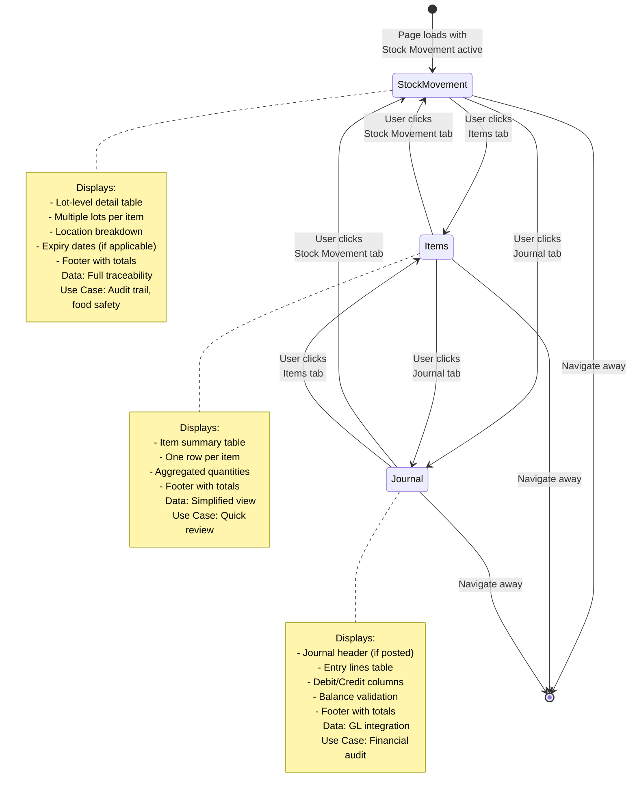
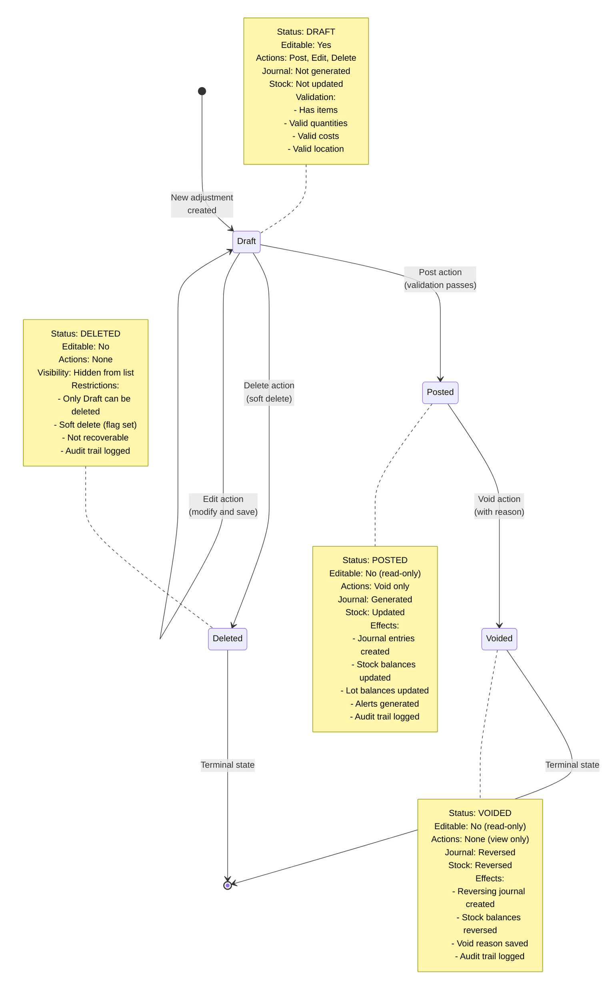

# Flow Diagrams: Inventory Adjustments

## Document Information
- **Module**: Inventory Management
- **Sub-Module**: Inventory Adjustments
- **Document Type**: Flow Diagrams (FD)
- **Version**: 2.3.0
- **Last Updated**: 2025-12-17
- **Status**: Active

## Document History

| Version | Date | Author | Changes |
|---------|------|--------|---------|
| 2.3.0 | 2025-12-17 | Documentation Team | Updated list page UI - removed tabs, added Stock-in/Stock-out buttons in header |
| 2.2.0 | 2025-12-13 | Documentation Team | Added Two-Level Category/Reason Classification flow (Category at header-level, Reason at item-level) |
| 1.1.0 | 2025-12-10 | Documentation Team | Standardized reference number format (XXX-YYMM-NNNN) |
| 2.1.0 | 2025-12-09 | Documentation Team | Updated GL account mapping to use 1310/5110, type-specific reasons, costing rules |
| 2.0.0 | 2025-01-10 | Documentation Team | Aligned with shared methods infrastructure |
| 1.0.0 | 2025-11-19 | Documentation Team | Initial version |
---
**IMPORTANT**: Inventory adjustments use the **shared costing methods infrastructure** for all stock transactions and lot tracking. This document references the shared transaction system defined in the Shared Methods documentation.

## Purpose

This document provides visual representations of Inventory Adjustments workflows, including:
- Adjustment list management (search, filter, sort)
- Adjustment detail view navigation
- Status workflow transitions (Draft → Posted → Voided)
- Journal entry generation and GL posting
- Stock balance updates via shared transaction system
- Lot tracking and FIFO consumption
- Permission-based access control
- Validation rules and audit trails

**Related Documents**:
- **[SM: Costing Methods](../../shared-methods/inventory-valuation/SM-costing-methods.md)** ← Core transaction system and FIFO logic
- **[SM: Period-End Snapshots](../../shared-methods/inventory-valuation/SM-period-end-snapshots.md)** ← Period management integration
- [Business Requirements](./BR-inventory-adjustments.md)
- [Use Cases](./UC-inventory-adjustments.md)
- [Technical Specification](./TS-inventory-adjustments.md)
- [Data Schema](./DS-inventory-adjustments.md)
- [Validations](./VAL-inventory-adjustments.md)

## Diagram Index

### User Interaction Flows
1. [Adjustment List Search/Filter/Sort Flow](#1-adjustment-list-searchfiltersort-flow)
2. [Adjustment Detail View Navigation Flow](#2-adjustment-detail-view-navigation-flow)
3. [Tab Navigation Flow (Items, Stock Movement, Journal)](#3-tab-navigation-flow)
4. [Status Action Flow (Post, Void, Edit)](#4-status-action-flow)

### Data Processing Flows
5. [Adjustment Creation Flow](#5-adjustment-creation-flow)
6. [Journal Entry Generation Flow](#6-journal-entry-generation-flow)
7. [Stock Balance Update Flow](#7-stock-balance-update-flow)
8. [Lot-Level Tracking Flow](#8-lot-level-tracking-flow)

### System Flows
9. [Status State Machine Flow](#9-status-state-machine-flow)
10. [Post Adjustment Workflow](#10-post-adjustment-workflow)
11. [Void Adjustment Workflow](#11-void-adjustment-workflow)
12. [Permission-Based Access Flow](#12-permission-based-access-flow)

---

## 1. Adjustment List Search/Filter/Sort Flow

This diagram shows how users search, filter, and sort the adjustment list for efficient data retrieval.

**Page Layout (Updated 2025-12-17)**:
- **Header**: Title "Inventory Adjustments" with Stock-in (green) and Stock-out (red) create buttons
- **Content**: Single consolidated list view with all adjustment types
- **No Tabs**: Removed tabs in favor of header action buttons for creating new adjustments

```mermaid
flowchart TD
    Start([User accesses<br>Adjustment List]) --> LoadData["Load all adjustments:<br><br>mockAdjustments = [<br>  {id, date, type, status,<br>   location, reason, items, value},<br>  ... all adjustments<br>]"]

    LoadData --> InitState['Initialize component state:<br>- searchQuery: ''<br>- activeFilters: []<br>- sortConfig: {<br>    field: 'date',<br>    order: 'desc'<br>  }']

    InitState --> DisplayPage['Display page layout:<br><br>Header:<br>- Title: Inventory Adjustments<br>- Stock-in button (green)<br>- Stock-out button (red)<br><br>Content:<br>- Consolidated list view<br>- All adjustment types visible<br>- Filter by Type via dropdown']

    DisplayPage --> DisplayTable['Display table:<br>- All adjustments visible<br>- Default sort: Date desc<br>- Search bar ready<br>- Filter popover closed']

    DisplayTable --> UserAction{User action}

    UserAction -->|Type search| SearchInput['User types in search bar:<br><br>Debounce 300ms:<br>setSearchQuery(input.value)']

    UserAction -->|Click filter| OpenFilter['User clicks filter button:<br><br>Show filter popover with:<br>- Status: Draft, Posted, Voided<br>- Type: IN, OUT<br>- Location: All accessible<br>- Reason: Type-specific (see below)']

    UserAction -->|Click sort| ClickColumn['User clicks column header:<br><br>Toggle sort direction:<br>IF currentField = clickedField:<br>  order = order === 'asc'<br>    ? 'desc' : 'asc'<br>ELSE:<br>  field = clickedField<br>  order = 'asc'']

    UserAction -->|Click row| NavDetail['Navigate to detail:<br>router.push(<br>  `/adjustments/${id}`<br>)']

    SearchInput --> ApplySearch['Apply search filter:<br><br>filtered = adjustments.filter(adj =><br>  Object.values(adj).some(val =><br>    val.toString()<br>      .toLowerCase()<br>      .includes(query.toLowerCase())<br>  )<br>)']

    OpenFilter --> SelectFilters['User selects filters:<br><br>activeFilters.push({<br>  type: 'status',<br>  value: 'Posted'<br>})<br><br>Show filter chips below search']

    ClickColumn --> UpdateSort['Update sort config:<br>setSortConfig({<br>  field: clickedField,<br>  order: newOrder<br>})']

    ApplySearch --> CombineFilters
    SelectFilters --> ClosePopover[User closes popover]
    ClosePopover --> CombineFilters

    CombineFilters["Combine search + filters:<br><br>LET result = adjustments<br><br>// Apply search<br>IF searchQuery:<br>  result = result.filter(<br>    matches searchQuery<br>  )<br><br>// Apply filters<br>IF activeFilters.length > 0:<br>  result = result.filter(adj =><br>    activeFilters.some(filter =><br>      adj[filter.type] = filter.value<br>    )<br>  )"]

    CombineFilters --> ApplySort['Apply sorting:<br><br>result.sort((a, b) => {<br>  const aVal = a[sortConfig.field]<br>  const bVal = b[sortConfig.field]<br><br>  IF typeof aVal === 'string':<br>    RETURN sortConfig.order = 'asc'<br>      ? aVal.localeCompare(bVal)<br>      : bVal.localeCompare(aVal)<br>  ELSE:<br>    RETURN sortConfig.order = 'asc'<br>      ? aVal - bVal<br>      : bVal - aVal<br>})']

    UpdateSort --> ApplySort

    ApplySort --> UpdateTable['Update table display:<br><br>setFilteredAdjustments(result)<br><br>Show:<br>- X of Y adjustments<br>- Active filter chips<br>- Sort indicator in header<br>- Empty state if no results']

    UpdateTable --> UserAction

    NavDetail --> DetailPage[Show Detail Page]
    DetailPage --> End([End])

    style ApplySearch fill:#e1f5ff
    style CombineFilters fill:#fff4e1
    style ApplySort fill:#e1ffe1
```

**Key Points**:
- **Search**: Real-time with 300ms debounce, searches all fields
- **Filters**: Multi-select within each category, AND logic between categories
  - **Type Filter**: Use to filter by Stock IN or Stock OUT (replaces former tab functionality)
- **Sort**: Click column header to toggle asc/desc
- **Performance**: Uses `useMemo` hook for filter/sort optimization
- **Empty State**: Shows message when no results found
- **Create Actions**: Stock-in and Stock-out buttons in header navigate to new adjustment form with pre-selected type

---

## 2. Adjustment Detail View Navigation Flow

This diagram shows how users navigate to and view adjustment details with three-tab interface.

```mermaid
flowchart TD
    Start([User clicks<br>adjustment row]) --> CaptureID['Capture adjustment ID:<br>const adjId = adjustment.id<br>(e.g., 'ADJ-2401-0001')']

    CaptureID --> Navigate['Navigate to detail route:<br>router.push(<br>  `/inventory-management/`<br>  `inventory-adjustments/${adjId}`<br>)']

    Navigate --> LoadPage['Detail page component loads:<br><br>const { id } = useParams()<br><br>useEffect(() => {<br>  loadAdjustmentDetail(id)<br>}, [id])']

    LoadPage --> FetchData['Fetch adjustment data:<br><br>adjustment =<br>  mockAdjustmentDetail.find(<br>    adj => adj.id = id<br>  )']

    FetchData --> CheckExists{Adjustment<br>found?}

    CheckExists -->|No| Show404['Show 404 page:<br>'Adjustment not found'<br><br>Display:<br>- Error message<br>- Back to list button']

    CheckExists -->|Yes| LoadRelated['Load related data:<br><br>1. adjustment.items[]<br>2. adjustment.stockMovements[]<br>3. adjustment.journalEntries<br>   (if Posted/Voided)']

    Show404 --> End([End])

    LoadRelated --> DisplayHeader['Display header section:<br>- Adjustment ID + status badge<br>- Back button<br>- Action buttons (based on status):<br>  * Draft: Post, Edit, Delete<br>  * Posted: Void<br>  * Voided: View only']

    DisplayHeader --> DisplaySummary['Display summary section:<br><br>Card 1: Adjustment Info<br>- ID, Date, Type, Status<br><br>Card 2: Location & Reason<br>- Location, Department<br>- Reason, Description<br><br>Card 3: Totals<br>- IN Qty, OUT Qty, Total Cost']

    DisplaySummary --> InitTabs['Initialize tabs:<br>- Default active: Stock Movement<br>- Available tabs: Items,<br>  Stock Movement, Journal Entries<br><br>setActiveTab('stock-movement')']

    InitTabs --> RenderStockTab['Render Stock Movement tab:<br><br>Display table with columns:<br>- Product Name<br>- SKU<br>- Location Type<br>- Location Code<br>- Lot No<br>- Quantity<br>- UOM<br>- Unit Cost<br>- Total Cost<br><br>Footer: Grand totals']

    RenderStockTab --> UserTabAction{User switches<br>tab?}

    UserTabAction -->|Items tab| ShowItems['Render Items tab:<br><br>Display simplified table:<br>- Product Name<br>- SKU<br>- Quantity<br>- UOM<br>- Unit Cost<br>- Total Cost<br><br>Footer: Grand totals']

    UserTabAction -->|Journal tab| CheckJournal{Journal entries<br>exist?}

    UserTabAction -->|Stay on Stock| UserTabAction

    CheckJournal -->|Yes| ShowJournal['Render Journal Entries tab:<br><br>Section 1: Journal Header<br>- Status, Journal No<br>- Posting Date, Period<br>- Created/Posted By<br><br>Section 2: Entry Lines<br>- Account, Name<br>- Debit, Credit<br>- Department, Reference<br><br>Footer: Total debits = credits<br>Balance indicator (green/red)']

    CheckJournal -->|No| ShowDraftMsg['Show message:<br>'Journal entries will be<br>generated when adjustment<br>is posted'']

    ShowItems --> UserTabAction
    ShowJournal --> UserTabAction
    ShowDraftMsg --> UserTabAction

    UserTabAction -->|Click action| ActionButton['User clicks action button<br>(Post, Void, Edit)']

    ActionButton --> HandleAction[Process action<br>(see Status Action Flow)]

    HandleAction --> End

    style FetchData fill:#e1f5ff
    style DisplaySummary fill:#fff4e1
    style RenderStockTab fill:#e1ffe1
```

**Navigation Context**:
- **Back Button**: Returns to adjustment list with filters preserved
- **Breadcrumb**: Home → Inventory → Adjustments → ADJ-2401-0001
- **Deep Linking**: URL includes adjustment ID for bookmarking
- **Tab State**: Persists during session via local state

---

## 3. Tab Navigation Flow

This diagram shows the state machine for tab switching in the adjustment detail view.



**Tab Content Details**:

**Items Tab**:
- Purpose: Quick item-level summary
- Columns: Product Name, SKU, Qty, UOM, Unit Cost, Total
- Data: Aggregated from lot-level details
- Use Case: Fast review of what was adjusted

**Stock Movement Tab** (Default):
- Purpose: Full lot-level traceability
- Columns: Product, SKU, Location Type/Code, Lot No, Qty, UOM, Cost
- Data: Detailed movements with locations and lots
- Use Case: Audit trail, batch tracking, food safety

**Journal Entries Tab**:
- Purpose: Financial integration verification
- Sections: Journal Header + Entry Lines
- Data: Auto-generated when adjustment posted
- Use Case: GL reconciliation, financial audit

---

## 4. Status Action Flow

This diagram shows the action button workflow for Post, Void, and Edit operations.

```mermaid
flowchart TD
    Start([User viewing<br>adjustment detail]) --> CheckStatus{Current<br>adjustment<br>status?}

    CheckStatus -->|DRAFT| ShowDraftActions['Display action buttons:<br>- Post button (green)<br>- Edit button (blue)<br>- Delete button (red)']

    CheckStatus -->|POSTED| ShowPostedActions['Display action buttons:<br>- Void button (red)<br><br>View-only mode:<br>- No editing allowed<br>- Read-only form fields']

    CheckStatus -->|VOIDED| ShowVoidedActions['Display view-only:<br>- No action buttons<br>- Read-only mode<br>- Void reason displayed']

    ShowDraftActions --> DraftAction{User clicks<br>button}

    DraftAction -->|Post| ClickPost['User clicks Post button']
    DraftAction -->|Edit| ClickEdit['User clicks Edit button']
    DraftAction -->|Delete| ClickDelete['User clicks Delete button']

    ShowPostedActions --> PostedAction{User clicks<br>Void button}

    PostedAction -->|Yes| ClickVoid['User clicks Void button']

    ClickPost --> ValidatePost['Run validation checks:<br><br>1. Has at least one item<br>2. All items have qty > 0<br>3. All items have unit cost > 0<br>4. Location is valid<br>5. Reason is selected<br>6. User has permission']

    ValidatePost --> PostValid{All validations<br>pass?}

    PostValid -->|No| ShowPostErrors['Display validation errors:<br>- Error messages list<br>- Highlight invalid fields<br>- Keep status as Draft']

    PostValid -->|Yes| ConfirmPost['Show confirmation dialog:<br>'Post adjustment ADJ-2401-0001?<br><br>This will:<br>- Generate journal entries<br>- Update stock balances<br>- Lock the adjustment<br><br>Continue?'']

    ShowPostErrors --> DraftAction

    ConfirmPost --> PostConfirm{User confirms?}

    PostConfirm -->|No| DraftAction
    PostConfirm -->|Yes| ProcessPost['Process posting:<br>(see Post Adjustment Workflow)']

    ProcessPost --> PostSuccess['Post successful:<br>- Status = Posted<br>- Journal entries created<br>- Stock updated<br>- Audit log entry<br>- Success message<br>- Reload page']

    PostSuccess --> End([End])

    ClickEdit --> NavEditForm['Navigate to edit form:<br>router.push(<br>  `/adjustments/${id}/edit`<br>)']

    NavEditForm --> End

    ClickDelete --> ConfirmDelete['Show confirmation dialog:<br>'Delete adjustment ADJ-2401-0001?<br><br>This cannot be undone.<br><br>Continue?'']

    ConfirmDelete --> DeleteConfirm{User confirms?}

    DeleteConfirm -->|No| DraftAction
    DeleteConfirm -->|Yes| ProcessDelete['Process deletion:<br>- Soft delete (set deleted flag)<br>- Remove from list view<br>- Audit log entry<br>- Success message']

    ProcessDelete --> NavList['Navigate back to list:<br>router.push(<br>  '/adjustments'<br>)']

    NavList --> End

    ClickVoid --> ConfirmVoid['Show confirmation dialog:<br>'Void adjustment ADJ-2401-0001?<br><br>Enter reason for void:<br>[Text input field]<br><br>This will:<br>- Reverse journal entries<br>- Reverse stock changes<br>- Mark as voided<br><br>Continue?'']

    ConfirmVoid --> VoidConfirm{User confirms<br>with reason?}

    VoidConfirm -->|No| PostedAction
    VoidConfirm -->|Yes| ValidateVoid['Validate void request:<br><br>1. Reason not empty<br>2. User has permission<br>3. Adjustment is Posted<br>4. No dependent transactions']

    ValidateVoid --> VoidValid{Validation<br>passes?}

    VoidValid -->|No| ShowVoidErrors['Display error message']
    ShowVoidErrors --> PostedAction

    VoidValid -->|Yes| ProcessVoid['Process void:<br>(see Void Adjustment Workflow)']

    ProcessVoid --> VoidSuccess['Void successful:<br>- Status = Voided<br>- Reversing entries created<br>- Stock reversed<br>- Void reason saved<br>- Audit log entry<br>- Success message<br>- Reload page']

    VoidSuccess --> End

    ShowVoidedActions --> End

    style ValidatePost fill:#e1f5ff
    style ProcessPost fill:#d4edda
    style ProcessVoid fill:#f8d7da
```

**Permission Requirements**:
- **Post**: "post_adjustments" permission
- **Void**: "void_adjustments" permission
- **Edit**: "edit_adjustments" permission
- **Delete**: "delete_adjustments" permission

**Validation Rules**:
- Draft adjustments must have items before posting
- Only Posted adjustments can be voided
- Void reason is mandatory
- Deleted adjustments cannot be recovered

---

## 5. Adjustment Creation Flow

This diagram shows the workflow for creating a new inventory adjustment with the two-level Category/Reason classification system.

```mermaid
flowchart TD
    Start([User clicks<br>New Adjustment]) --> InitForm["Initialize form:<br><br>Default values:<br>- adjustment_date: today<br>- adjustment_type: null or from URL<br>- adjustment_status: 'DRAFT'<br>- location_id: user's default<br>- department_id: user's dept<br>- category: null (header-level)<br>- items: []"]

    InitForm --> CheckURLParam{URL has<br>type param?}

    CheckURLParam -->|Yes| PresetType["Pre-select and lock type:<br><br>IF url.type = 'in':<br>  type = 'IN', locked = true<br>ELSE IF url.type = 'out':<br>  type = 'OUT', locked = true<br><br>Load type-specific categories"]

    CheckURLParam -->|No| RenderForm

    PresetType --> RenderForm['Render form sections:<br><br>Section 1: Header<br>- Date picker<br>- Type selector (IN/OUT)<br>- Location dropdown<br>- Category dropdown (header-level)<br>  → Filtered by Type<br>  → Maps to GL account<br>- Department dropdown<br>- Description text area<br><br>Section 2: Items<br>- Item selection with Reason<br>- Add Item button']

    RenderForm --> UserSelectsType{User selects<br>Type (IN/OUT)?}

    UserSelectsType -->|Yes| LoadCategories["Load type-specific categories:<br><br>IF type = 'OUT':<br>  categories = [Wastage, Loss,<br>    Quality, Consumption]<br>ELSE IF type = 'IN':<br>  categories = [Found, Return,<br>    Correction]<br><br>Reset category to null<br>Reset all item reasons"]

    UserSelectsType -->|No| UserInput

    LoadCategories --> UserSelectsCategory{User selects<br>Category?}

    UserSelectsCategory -->|Yes| LoadReasons["Load category-specific reasons:<br><br>availableReasons = <br>  category.reasons<br><br>Reset all existing item reasons<br>Enable Add Item button"]

    UserSelectsCategory -->|No| UserInput

    LoadReasons --> UserInput

    UserInput['User fills form fields:<br><br>React Hook Form:<br>- Field validation<br>- Error messages<br>- Disable submit until valid']

    UserInput --> AddItems{User adds<br>items?}

    AddItems -->|Yes| CheckCategory{Category<br>selected?}

    CheckCategory -->|No| ShowCategoryError["Show validation error:<br>'Please select a Category<br>before adding items'"]
    ShowCategoryError --> UserInput

    CheckCategory -->|Yes| ItemDialog["Show Add Item dialog:<br><br>Fields:<br>- Item selector (search)<br>- Location (within facility)<br>- Lot number<br>- Quantity<br>- Unit cost (auto for OUT,<br>  manual for IN)<br>- Reason dropdown<br>  → Filtered by Category<br>- Expiry date (optional)<br><br>Validation:<br>- Required fields<br>- Quantity > 0<br>- Reason required"]

    AddItems -->|No| UserInput

    ItemDialog --> ValidateItem{Item data<br>valid?}

    ValidateItem -->|No| ShowItemErrors['Show field errors:<br>- Highlight invalid<br>- Error messages']
    ShowItemErrors --> ItemDialog

    ValidateItem -->|Yes| AddToList["Add to items array:<br><br>items.push({<br>  item_id,<br>  product_name,<br>  sku,<br>  location_type,<br>  location_code,<br>  lot_no,<br>  quantity,<br>  uom,<br>  unit_cost,<br>  total_cost: qty × cost,<br>  reason: selected_reason<br>})"]

    AddToList --> UpdateTotals['Update totals:<br><br>total_in_qty = SUM(items.qty)<br>  WHERE type = 'IN'<br><br>total_out_qty = SUM(items.qty)<br>  WHERE type = 'OUT'<br><br>total_cost = SUM(items.total_cost)']

    UpdateTotals --> DisplayItems["Display items table:<br>- Product name<br>- Quantity<br>- Unit cost<br>- Total cost<br>- Reason (item-level)<br>- Remove button per row<br><br>Footer: Grand totals"]

    DisplayItems --> MoreItems{Add more<br>items?}

    MoreItems -->|Yes| AddItems
    MoreItems -->|No| SaveDraft{User clicks<br>Save Draft?}

    SaveDraft -->|Yes| ValidateForm["Validate entire form:<br><br>1. Required fields filled<br>2. Category selected (header)<br>3. At least one item<br>4. All items have reasons<br>5. All item data valid<br>6. Totals calculated<br>7. Type matches totals"]

    ValidateForm --> FormValid{Form valid?}

    FormValid -->|No| ShowFormErrors['Show validation errors:<br>- List all errors<br>- Highlight fields<br>- Scroll to first error']
    ShowFormErrors --> UserInput

    FormValid -->|Yes| GenerateID['Generate adjustment ID:<br><br>adjId = 'ADJ-' + year + '-' +<br>  paddedSequence<br><br>Example: 'ADJ-2401-0009'']

    GenerateID --> SaveAdjustment["Save adjustment:<br><br>INSERT INTO tb_inventory_adjustment<br>VALUES (adjustment data + category)<br><br>INSERT INTO tb_adjustment_item<br>VALUES (items data + reasons)<br><br>INSERT INTO<br>  tb_adjustment_stock_movement<br>VALUES (movement data)"]

    SaveAdjustment --> CreateSuccess['Show success message:<br>'Adjustment ADJ-2401-0009<br>saved as Draft'<br><br>Action buttons:<br>- View adjustment<br>- Create another']

    CreateSuccess --> UserChoice{User action}

    UserChoice -->|View| NavDetail['Navigate to detail page']
    UserChoice -->|Create Another| InitForm
    UserChoice -->|Close| NavList['Navigate to list page']

    NavDetail --> End([End])
    NavList --> End

    SaveDraft -->|No (Cancel)| ConfirmCancel['Show confirmation:<br>'Discard unsaved changes?'']

    ConfirmCancel --> CancelConfirm{User confirms?}

    CancelConfirm -->|No| UserInput
    CancelConfirm -->|Yes| NavList

    style ValidateForm fill:#e1f5ff
    style SaveAdjustment fill:#d4edda
    style CreateSuccess fill:#fff4e1
    style LoadCategories fill:#e1f5ff
    style LoadReasons fill:#fff4e1
```

**Two-Level Category/Reason Classification**:

| Level | Selection Point | Purpose | Behavior |
|-------|-----------------|---------|----------|
| **Category** | Header (once per adjustment) | GL Account mapping | Type change resets category |
| **Reason** | Item (per item) | Detailed classification | Category change resets all item reasons |

**Cascading Reset Behavior**:
1. **Type Change (IN ↔ OUT)** → Category resets to null → All item reasons reset
2. **Category Change** → All existing item reasons reset (reasons are category-specific)

**Form Validation Rules**:
- **Date**: Cannot be future date, must be in open accounting period
- **Type**: Required, must be IN or OUT (may be pre-set from URL)
- **Location**: Required, must be accessible by user
- **Category**: Required (header-level), must match type
- **Items**: At least one item required
- **Reason**: Required for each item, must be valid for selected category
- **Quantities**: Must be positive decimal values
- **Costs**: Must be non-negative decimal values
- **Type Consistency**: IN adjustments cannot have OUT items

---

## 6. Journal Entry Generation Flow

This diagram shows the automated journal entry generation when an adjustment is posted.

```mermaid
flowchart TD
    Start([Adjustment<br>posted]) --> LoadAdj["Load adjustment data:<br>- adjustment_id<br>- adjustment_type (IN/OUT)<br>- adjustment_reason<br>- department_id<br>- items[] with costs"]

    LoadAdj --> CreateHeader['Create journal header:<br><br>INSERT INTO<br>  tb_adjustment_journal_header<br>VALUES:<br>  adjustment_id,<br>  journal_status: 'DRAFT',<br>  posting_date: adj.adjustment_date,<br>  posting_period: YYYY-MM,<br>  description: 'Inventory Adjustment:<br>    ' + reason,<br>  reference: adjustment_id,<br>  created_by: current_user']

    CreateHeader --> GenJournalNo['Generate journal number:<br><br>year = EXTRACT(YEAR FROM date)<br><br>sequence = MAX(journal_no) + 1<br>  WHERE year = current_year<br><br>journal_no =<br>  'JNL-' + year + '-' +<br>  LPAD(sequence, 5, '0')<br><br>Example: 'JNL-2401-00001'']

    GenJournalNo --> UpdateHeader['Update header:<br>SET journal_no = generated_no']

    UpdateHeader --> InitLineNo['Initialize line counter:<br>line_number = 0']

    InitLineNo --> LoopItems['FOR EACH item in adjustment:']

    LoopItems --> CheckType{Adjustment<br>type?}

    CheckType -->|IN| DetermineINAccounts['Determine GL accounts (IN):<br><br>// ALL Stock IN adjustments use<br>// same GL accounts:<br>debit_account = '1310'<br>  (Raw Materials Inventory)<br>credit_account = '5110'<br>  (Inventory Variance)<br><br>// Valid IN reasons:<br>- count_variance<br>- found_items<br>- return_to_stock<br>- system_correction<br>- other']

    CheckType -->|OUT| DetermineOUTAccounts['Determine GL accounts (OUT):<br><br>// ALL Stock OUT adjustments use<br>// same GL accounts:<br>debit_account = '5110'<br>  (Inventory Variance)<br>credit_account = '1310'<br>  (Raw Materials Inventory)<br><br>// Valid OUT reasons:<br>- damaged, expired, theft_loss<br>- spoilage, count_variance<br>- quality_rejection, other']

    DetermineINAccounts --> CreateDebitIN['Create debit entry (IN):<br><br>line_number++<br><br>INSERT INTO<br>  tb_adjustment_journal_entry<br>VALUES:<br>  journal_header_id,<br>  line_number,<br>  account_code: '1310',<br>  account_name: 'Raw Materials Inventory',<br>  debit: item.total_cost,<br>  credit: 0,<br>  department_id,<br>  reference: adjustment_id<br><br>// Unit cost: User entered (required)']

    CreateDebitIN --> CreateCreditIN['Create credit entry (IN):<br><br>line_number++<br><br>INSERT entry with:<br>  account_code: '5110',<br>  account_name: 'Inventory Variance',<br>  debit: 0,<br>  credit: item.total_cost']

    DetermineOUTAccounts --> CreateDebitOUT['Create debit entry (OUT):<br><br>line_number++<br><br>INSERT entry with:<br>  account_code: '5110',<br>  account_name: 'Inventory Variance',<br>  debit: item.total_cost,<br>  credit: 0<br><br>// Unit cost: Auto from avg cost']

    CreateDebitOUT --> CreateCreditOUT['Create credit entry (OUT):<br><br>line_number++<br><br>INSERT entry with:<br>  account_code: '1310',<br>  account_name: 'Raw Materials Inventory',<br>  debit: 0,<br>  credit: item.total_cost']

    CreateCreditIN --> MoreItems{More items?}
    CreateCreditOUT --> MoreItems

    MoreItems -->|Yes| LoopItems
    MoreItems -->|No| CalcTotals['Calculate journal totals:<br><br>total_debit = SUM(debit)<br>  FROM journal_entries<br>  WHERE journal_header_id<br><br>total_credit = SUM(credit)<br>  FROM journal_entries<br>  WHERE journal_header_id']

    CalcTotals --> ValidateBalance{Debits =<br>Credits?}

    ValidateBalance -->|No| ThrowError['THROW ERROR:<br>'Journal entries unbalanced:<br>Debits: X, Credits: Y'<br><br>ROLLBACK transaction<br>Keep adjustment as Draft']

    ValidateBalance -->|Yes| UpdateJournalStatus['Update journal status:<br><br>UPDATE tb_adjustment_journal_header<br>SET<br>  journal_status = 'POSTED',<br>  posted_by = current_user,<br>  posted_at = now()<br>WHERE id = journal_header_id']

    ThrowError --> End([Error])

    UpdateJournalStatus --> PostToGL['Post to General Ledger:<br>(Integration with GL module)<br><br>Send journal data to GL API:<br>- Journal header<br>- Entry lines<br>- Wait for confirmation']

    PostToGL --> GLResponse{GL post<br>successful?}

    GLResponse -->|No| GLError['Handle GL error:<br>- Log error<br>- Notify user<br>- Keep journal in Posted state<br>- Flag for manual review']

    GLResponse -->|Yes| GLSuccess['GL posting confirmed:<br>- Update trial balance<br>- Create audit trail<br>- Success notification']

    GLError --> End
    GLSuccess --> LogAudit['Create audit log entry:<br><br>INSERT INTO tb_audit_log<br>VALUES:<br>  event: 'journal_posted',<br>  adjustment_id,<br>  journal_no,<br>  user_id: current_user,<br>  timestamp: now(),<br>  details: JSON entry data']

    LogAudit --> Success([Journal<br>Generated])

    style DetermineINAccounts fill:#e1f5ff
    style DetermineOUTAccounts fill:#fff4e1
    style ValidateBalance fill:#d4edda
    style PostToGL fill:#e1ffe1
```

**GL Account Mapping Summary**:

> **Note**: With the Two-Level Category/Reason Classification (see Section 5), the Category selected at header level determines the specific GL accounts used. This enables more granular expense tracking by category.

**Category-Based GL Account Mapping (Enhanced)**:

| Adjustment Type | Category | Debit Account | Credit Account | Unit Cost |
|----------------|----------|---------------|----------------|-----------|
| OUT | Wastage | 5200 Waste Expense | 1310 Raw Materials Inventory | Auto (avg cost) |
| OUT | Loss | 5210 Inventory Loss | 1310 Raw Materials Inventory | Auto (avg cost) |
| OUT | Quality | 5100 COGS | 1310 Raw Materials Inventory | Auto (avg cost) |
| OUT | Consumption | 5100 COGS | 1310 Raw Materials Inventory | Auto (avg cost) |
| IN | Found | 1310 Raw Materials Inventory | 5110 Inventory Variance | User entered (required) |
| IN | Return | 1310 Raw Materials Inventory | 5110 Inventory Variance | User entered (required) |
| IN | Correction | 1310 Raw Materials Inventory | 5110 Inventory Variance | User entered (required) |

**Category-Reason Hierarchy**:
- **Stock OUT Categories**: Wastage (Damaged, Expired, Spoilage), Loss (Theft/Loss, Pilferage, Missing), Quality (QC Rejection, Below Standard), Consumption (Tastings, Breakage, Shrinkage)
- **Stock IN Categories**: Found (Count Variance, Found Items), Return (Return to Stock, Rejected Return), Correction (System Correction, Data Entry Error)

**Costing Rules**:
- **Stock OUT**: Unit cost automatically uses product's average cost (no manual entry)
- **Stock IN**: Unit cost must be manually entered (required, affects inventory valuation)

**Validation Rules**:
- Debits must equal credits (tolerance: $0.01)
- Each entry must have either debit or credit, not both
- Line numbers sequential starting from 1
- Department required on all entries
- Reference must match adjustment ID

---

## 7. Stock Balance Update Flow

This diagram shows how stock balances are updated via the shared inventory transaction system when adjustments are posted or voided.

**Reference**: See [SM-costing-methods.md](../../shared-methods/inventory-valuation/SM-costing-methods.md) for complete transaction system documentation.

```mermaid
flowchart TD
    Start([Post or Void<br>adjustment]) --> DetermineAction{Action type?}

    DetermineAction -->|Post| LoadPostData['Load adjustment items:<br><br>FOR EACH item in adjustment:<br>  Get item_id<br>  Get location_id<br>  Get lot_no (parent lot)<br>  Get quantity<br>  Get unit_cost']

    DetermineAction -->|Void| LoadVoidData['Load original adjustment:<br><br>Create reversing transactions:<br>IN -> OUT reversal<br>OUT -> IN reversal']

    LoadPostData --> LoopPostItems['FOR EACH item:']
    LoadVoidData --> LoopVoidItems['FOR EACH reversal:']

    LoopPostItems --> DetermineAdjType{Adjustment<br>type?}
    LoopVoidItems --> DetermineAdjType

    DetermineAdjType -->|IN| CreateINTransaction['Create ADJUSTMENT IN transaction:<br><br>INSERT INTO<br>  tb_inventory_transaction_closing_balance<br>VALUES:<br>  lot_no: parent_lot_no,<br>  lot_index: next_sequence,<br>  parent_lot_no: parent_lot_no,  ← ADJUSTMENT<br>  location_id,<br>  product_id,<br>  in_qty: item.quantity,  ← Increase<br>  out_qty: 0,<br>  cost_per_unit: parent_lot_cost,<br>  total_cost: in_qty × cost,<br>  note: adjustment_reason']

    DetermineAdjType -->|OUT| CheckFIFO{Costing<br>method?}

    CheckFIFO -->|FIFO| FIFOConsumption['Consume using FIFO:<br><br>SELECT lot_no,<br>  SUM(in_qty) - SUM(out_qty) as avail<br>FROM tb_inventory_transaction_closing_balance<br>WHERE product_id AND location_id<br>  AND parent_lot_no IS NULL  ← LOT only<br>GROUP BY lot_no<br>HAVING avail > 0<br>ORDER BY lot_no ASC  ← FIFO order<br><br>Reference: SM-costing-methods.md']

    CheckFIFO -->|Periodic<br>Average| AvgConsumption['Use average cost:<br><br>cost_per_unit =<br>  period_average_cost']

    FIFOConsumption --> AllocateQty['Allocate from lot(s):<br><br>remaining = item.quantity<br><br>WHILE remaining > 0:<br>  SELECT next oldest lot<br>  IF lot.available >= remaining:<br>    consume = remaining<br>    remaining = 0<br>  ELSE:<br>    consume = lot.available<br>    remaining -= consume']

    AvgConsumption --> AllocateQty

    AllocateQty --> CreateOUTTransaction['Create ADJUSTMENT OUT transaction:<br><br>INSERT INTO<br>  tb_inventory_transaction_closing_balance<br>VALUES:<br>  lot_no: consumed_lot_no,<br>  lot_index: next_sequence,<br>  parent_lot_no: consumed_lot_no,  ← ADJUSTMENT<br>  location_id,<br>  product_id,<br>  in_qty: 0,<br>  out_qty: consume_qty,  ← Decrease<br>  cost_per_unit: lot_cost,<br>  total_cost: -(out_qty × cost),  ← Negative<br>  note: adjustment_reason']

    CreateINTransaction --> CalcBalance
    CreateOUTTransaction --> CalcBalance

    CalcBalance['Calculate current balance:<br><br>current_balance =<br>  SUM(in_qty) - SUM(out_qty)<br>FROM tb_inventory_transaction_closing_balance<br>WHERE product_id AND location_id<br><br>← Single source of truth<br>← No separate balance table<br><br>Reference: SM-costing-methods.md']

    CalcBalance --> CheckNegative{Balance<br>< 0?}

    CheckNegative -->|Yes| ThrowError['THROW ERROR:<br>'Insufficient stock for adjustment.<br>Current balance: X, Adjustment: Y'<br><br>ROLLBACK transaction<br>Prevent posting']

    CheckNegative -->|No| CheckAlerts['Check for alert conditions:<br><br>IF balance <= reorder_point:<br>  CREATE low_stock_alert<br><br>IF balance > maximum_qty:<br>  CREATE overstock_alert<br><br>Check lot expiry dates:<br>IF expiry_date <= today + 7:<br>  CREATE expiry_alert']

    ThrowError --> End([Error])

    CheckAlerts --> MoreItems{More items<br>to process?}

    MoreItems -->|Yes| LoopPostItems
    MoreItems -->|No| Success['Stock update complete:<br>✓ Transactions recorded in<br>  tb_inventory_transaction_closing_balance<br>✓ Balances calculated via SUM(in_qty - out_qty)<br>✓ FIFO consumption order maintained<br>✓ Alerts generated<br>✓ Audit trail logged<br><br>Reference: SM-costing-methods.md']

    Success --> End([Success])

    style FIFOConsumption fill:#e1f5ff
    style CreateINTransaction fill:#d4edda
    style CreateOUTTransaction fill:#fff4e1
    style CalcBalance fill:#ffe1e1
```

**Shared Transaction System Integration**:

**Key Concepts** (from SM-costing-methods.md):
- **Single Table**: All transactions in `tb_inventory_transaction_closing_balance`
- **parent_lot_no Pattern**:
  - `NULL` = LOT transaction (new lot creation from GRN/transfer)
  - `populated` = ADJUSTMENT transaction (consumption/modification)
- **Balance Calculation**: `SUM(in_qty) - SUM(out_qty)` (single source of truth)
- **FIFO Order**: `ORDER BY lot_no ASC` for natural chronological sort

**IN Adjustments** (Inventory Increase):
```sql
-- Example: Physical count variance - found 50 units
INSERT INTO tb_inventory_transaction_closing_balance (
  lot_no,           -- 'MK-251105-01' (parent lot)
  lot_index,        -- Next sequence number
  parent_lot_no,    -- 'MK-251105-01' ← ADJUSTMENT indicator
  in_qty,           -- 50.00000 ← Increase
  out_qty,          -- 0.00000
  cost_per_unit,    -- Use parent lot's cost
  total_cost        -- Positive: 50 × cost
);
```

**OUT Adjustments** (Inventory Decrease):
```sql
-- Example: Damaged goods - remove 30 units
-- FIFO consumption: consume from oldest lot first
INSERT INTO tb_inventory_transaction_closing_balance (
  lot_no,           -- Consumed lot number
  lot_index,        -- Next sequence number
  parent_lot_no,    -- Consumed lot number ← ADJUSTMENT indicator
  in_qty,           -- 0.00000
  out_qty,          -- 30.00000 ← Decrease
  cost_per_unit,    -- Lot's cost (FIFO) or period average
  total_cost        -- Negative: -375.00 (inventory reduction)
);
```

**Balance Query**:
```sql
-- Query current balance (single source of truth)
SELECT
  SUM(in_qty) - SUM(out_qty) as current_balance
FROM tb_inventory_transaction_closing_balance
WHERE product_id = :product_id
  AND location_id = :location_id;
```

**Validation**:
- OUT adjustments cannot result in negative balance
- FIFO consumption from lots WHERE `parent_lot_no IS NULL`
- All costs must be non-negative
- Transaction date must be in open period

---

## 8. Lot-Level Tracking Flow

This diagram shows how lot-level inventory tracking works for traceability using the shared transaction system.

**Reference**: See [SM-costing-methods.md](../../shared-methods/inventory-valuation/SM-costing-methods.md) for FIFO consumption logic and lot format standards.

```mermaid
flowchart TD
    Start([Adjustment with<br>lot tracking]) --> CheckMethod{Costing<br>method?}

    CheckMethod -->|FIFO| FIFOMethod['Use FIFO allocation:<br>- First In, First Out<br>- Consume from oldest lots<br>- ORDER BY lot_no ASC<br><br>Lot format: {LOC}-{YYMMDD}-{SEQ}<br>Example: 'MK-251105-01'<br><br>Reference: SM-costing-methods.md']

    CheckMethod -->|PERIODIC_AVERAGE| AvgMethod['Use Average method:<br>- Lots for tracking only<br>- Cost = period_average_cost<br>- Track lot quantities']

    FIFOMethod --> DetermineType{Adjustment<br>type?}
    AvgMethod --> DetermineType

    DetermineType -->|IN| ReceiveLot['Adjustment IN to existing lot:<br><br>Parent lot must exist (from GRN)<br>lot_no = parent_lot_no<br><br>INSERT INTO<br>  tb_inventory_transaction_closing_balance<br>VALUES:<br>  lot_no: parent_lot_no,<br>  lot_index: next_sequence,<br>  parent_lot_no: parent_lot_no,  ← ADJUSTMENT<br>  in_qty: adjustment_qty,<br>  out_qty: 0,<br>  cost_per_unit: parent_lot_cost,<br>  total_cost: in_qty × cost']

    DetermineType -->|OUT| ConsumeFIFO['FIFO Consumption Query:<br><br>SELECT lot_no,<br>  SUM(in_qty) - SUM(out_qty) as available<br>FROM tb_inventory_transaction_closing_balance<br>WHERE product_id AND location_id<br>  AND parent_lot_no IS NULL  ← LOT only<br>GROUP BY lot_no, cost_per_unit<br>HAVING available > 0<br>ORDER BY lot_no ASC  ← FIFO order<br><br>Reference: SM-costing-methods.md']

    ConsumeFIFO --> AllocateFromLot['Allocate from lot(s):<br><br>remaining = adjustment_qty<br><br>WHILE remaining > 0:<br>  lot = SELECT next from FIFO query<br>  <br>  IF lot.available >= remaining:<br>    consume_qty = remaining<br>    remaining = 0<br>  ELSE:<br>    consume_qty = lot.available<br>    remaining -= consume_qty<br><br>  Create transaction for this lot']

    ReceiveLot --> CreateINTransaction['Create ADJUSTMENT IN transaction:<br><br>Transaction recorded in<br>tb_inventory_transaction_closing_balance<br><br>Balance = SUM(in_qty) - SUM(out_qty)<br><br>← Single source of truth<br>← No separate lot_balance table']

    AllocateFromLot --> CreateOUTTransaction['Create ADJUSTMENT OUT transaction:<br>(one per lot consumed)<br><br>INSERT INTO<br>  tb_inventory_transaction_closing_balance<br>VALUES:<br>  lot_no: consumed_lot_no,<br>  lot_index: next_sequence,<br>  parent_lot_no: consumed_lot_no,  ← ADJUSTMENT<br>  in_qty: 0,<br>  out_qty: consume_qty,<br>  cost_per_unit: lot_cost,<br>  total_cost: -(out_qty × cost)']

    CreateOUTTransaction --> CheckRemaining{Remaining<br>quantity > 0?}

    CheckRemaining -->|Yes| ConsumeFIFO
    CheckRemaining -->|No| AllAllocated

    CreateINTransaction --> AllAllocated['All quantities allocated:<br>✓ Transactions recorded<br>✓ Lot tracking maintained<br>✓ Full traceability via parent_lot_no<br>✓ FIFO order preserved']

    AllAllocated --> BuildTraceability['Build traceability chain:<br><br>Query transaction history:<br><br>SELECT *<br>FROM tb_inventory_transaction_closing_balance<br>WHERE product_id AND location_id<br>ORDER BY created_at, lot_index<br><br>Trace:<br>- LOT (parent_lot_no IS NULL)<br>- ADJUSTMENT (parent_lot_no populated)<br>- Lot balance history<br>- Expiry dates']

    BuildTraceability --> GenerateReport['Generate traceability report:<br><br>Available queries:<br>1. Lot history (all transactions)<br>2. Item trace (full chain)<br>3. Batch recall (affected items)<br>4. FIFO consumption verification<br>5. Expiry report (upcoming)<br>6. Location audit (movements)<br><br>Reference: SM-costing-methods.md']

    GenerateReport --> End([Traceability<br>Complete])

    style FIFOMethod fill:#e1f5ff
    style ConsumeFIFO fill:#fff4e1
    style CreateINTransaction fill:#d4edda
    style BuildTraceability fill:#e1ffe1
```

**Lot Tracking via Shared Transaction System**:

**Key Concepts** (from SM-costing-methods.md):
- **Lot Format**: `{LOCATION}-{YYMMDD}-{SEQ}` (e.g., `MK-251105-01`)
- **LOT vs ADJUSTMENT**: Identified by `parent_lot_no` (NULL = LOT, populated = ADJUSTMENT)
- **FIFO Order**: Natural chronological sort via `ORDER BY lot_no ASC`
- **Balance Calculation**: `SUM(in_qty) - SUM(out_qty)` per lot

**Traceability Queries**:

```sql
-- Query lot history (all transactions for a lot)
SELECT
  lot_no,
  lot_index,
  parent_lot_no,
  CASE WHEN parent_lot_no IS NULL THEN 'LOT' ELSE 'ADJUSTMENT' END as transaction_type,
  in_qty,
  out_qty,
  SUM(in_qty) OVER (PARTITION BY lot_no ORDER BY lot_index) -
    SUM(out_qty) OVER (PARTITION BY lot_no ORDER BY lot_index) as running_balance,
  cost_per_unit,
  created_at
FROM tb_inventory_transaction_closing_balance
WHERE product_id = :product_id
  AND location_id = :location_id
  AND (lot_no = :lot_no OR parent_lot_no = :lot_no)
ORDER BY lot_index;
```

```sql
-- Query FIFO consumption order
SELECT
  lot_no,
  SUM(in_qty) - SUM(out_qty) as available_qty,
  cost_per_unit
FROM tb_inventory_transaction_closing_balance
WHERE product_id = :product_id
  AND location_id = :location_id
  AND parent_lot_no IS NULL  -- LOT transactions only
GROUP BY lot_no, cost_per_unit
HAVING SUM(in_qty) - SUM(out_qty) > 0
ORDER BY lot_no ASC;  -- FIFO order
```

**Use Cases**:

**Food Safety**:
- Batch recall: Query all transactions with `lot_no` or `parent_lot_no`
- Expiry management: Track lots approaching expiry date
- Source tracing: Trace from LOT (parent_lot_no IS NULL) to GRN

**Compliance**:
- Audit trail: Complete transaction history via `lot_index` sequence
- FIFO verification: Prove consumption order via `ORDER BY lot_no ASC`
- Quality control: Link lot transactions to inspection records

**Operations**:
- Stock rotation: FIFO query ensures oldest lots consumed first
- Waste reduction: Expiry alerts from lot expiry dates
- Cost accuracy: Actual costs preserved in each transaction

---

## 9. Status State Machine Flow

This diagram shows the complete status transition workflow for adjustment lifecycle.



**Status Transition Rules**:

| From Status | To Status | Action | Validation Required |
|-------------|-----------|--------|---------------------|
| DRAFT | POSTED | Post | Has items, valid data, permission |
| DRAFT | DELETED | Delete | Permission |
| DRAFT | DRAFT | Edit | Permission |
| POSTED | VOIDED | Void | Permission, void reason |
| VOIDED | - | None | Terminal state |
| DELETED | - | None | Terminal state |

**Blocked Transitions**:
- ❌ POSTED → DRAFT: Cannot un-post
- ❌ POSTED → DELETED: Must void first
- ❌ VOIDED → POSTED: Cannot re-post
- ❌ VOIDED → DRAFT: Cannot revert
- ❌ DELETED → Any: Cannot recover

---

## 10. Post Adjustment Workflow

This diagram shows the complete workflow for posting a draft adjustment.

```mermaid
flowchart TD
    Start([User clicks<br>Post button]) --> CheckStatus{Status is<br>DRAFT?}

    CheckStatus -->|No| ErrorStatus['Show error:<br>'Only Draft adjustments<br>can be posted'']
    ErrorStatus --> End([End])

    CheckStatus -->|Yes| CheckPermission{User has<br>permission?}

    CheckPermission -->|No| ErrorPerm['Show error:<br>'Insufficient permissions<br>to post adjustments'']
    ErrorPerm --> End

    CheckPermission -->|Yes| ValidateData['Run validation checks:<br><br>1. Has at least one item<br>2. All items have qty > 0<br>3. All items have unit cost >= 0<br>4. Location is valid<br>5. Reason is selected<br>6. Department is set<br>7. Type matches totals']

    ValidateData --> ValidationPass{All checks<br>pass?}

    ValidationPass -->|No| ShowErrors['Display validation errors:<br>- List all failed checks<br>- Highlight invalid fields<br>- Scroll to first error']
    ShowErrors --> End

    ValidationPass -->|Yes| ConfirmDialog['Show confirmation dialog:<br><br>'Post Adjustment ADJ-2401-0001?<br><br>This action will:<br>✓ Generate journal entries<br>✓ Update stock balances<br>✓ Lock the adjustment<br>✓ Post to General Ledger<br><br>This cannot be undone.<br>Continue?'<br><br>Buttons: [Cancel] [Post]']

    ConfirmDialog --> UserConfirm{User clicks<br>Post?}

    UserConfirm -->|No| End
    UserConfirm -->|Yes| BeginTransaction['BEGIN database transaction:<br>(ensure atomicity)']

    BeginTransaction --> CreateJournal['Generate journal entries:<br>(see Journal Generation Flow)<br><br>1. Create journal header<br>2. Generate journal number<br>3. Create entry lines<br>4. Validate balance']

    CreateJournal --> JournalSuccess{Journal<br>generated?}

    JournalSuccess -->|No| RollbackJournal['ROLLBACK transaction<br>Show error:<br>'Failed to generate journal'']
    RollbackJournal --> End

    JournalSuccess -->|Yes| UpdateStock['Update stock balances:<br>(see Stock Update Flow)<br><br>1. Load current balances<br>2. Calculate new quantities<br>3. Update average costs<br>4. Create transactions<br>5. Update lot balances']

    UpdateStock --> StockSuccess{Stock<br>updated?}

    StockSuccess -->|No| RollbackStock['ROLLBACK transaction<br>Show error:<br>'Failed to update stock:<br>' + error_message']
    RollbackStock --> End

    StockSuccess -->|Yes| PostToGL['Post to General Ledger:<br><br>Send journal to GL API:<br>- Journal header data<br>- Entry line details<br>- Wait for confirmation']

    PostToGL --> GLSuccess{GL post<br>successful?}

    GLSuccess -->|No| HandleGLError['Log GL error:<br>- Save error details<br>- Flag for manual review<br>- Continue (don't rollback)<br><br>Note: Journal posted,<br>GL sync pending']

    GLSuccess -->|Yes| GLConfirmed

    HandleGLError --> UpdateAdjustment
    GLConfirmed['GL confirmed:<br>- Trial balance updated<br>- Period validated'] --> UpdateAdjustment

    UpdateAdjustment['Update adjustment record:<br><br>UPDATE tb_inventory_adjustment<br>SET<br>  adjustment_status = 'POSTED',<br>  posted_by = current_user_id,<br>  posted_at = now(),<br>  updated_at = now()<br>WHERE id = adjustment_id']

    UpdateAdjustment --> CreateAudit['Create audit trail entry:<br><br>INSERT INTO tb_audit_log<br>VALUES:<br>  event_type: 'adjustment_posted',<br>  entity_type: 'adjustment',<br>  entity_id: adjustment_id,<br>  user_id: current_user,<br>  timestamp: now(),<br>  before_state: 'DRAFT',<br>  after_state: 'POSTED',<br>  details: JSON data']

    CreateAudit --> GenerateAlerts['Generate inventory alerts:<br><br>Check conditions:<br>- Low stock (qty <= reorder)<br>- Overstock (qty > maximum)<br>- Expiring (expiry <= 7 days)<br><br>Create alerts if conditions met']

    GenerateAlerts --> CommitTransaction['COMMIT database transaction']

    CommitTransaction --> ShowSuccess['Show success message:<br><br>'Adjustment ADJ-2401-0001<br>posted successfully!'<br><br>Details:<br>✓ Journal: JNL-2401-00001<br>✓ Stock balances updated<br>✓ GL posted<br><br>Button: [View Adjustment]']

    ShowSuccess --> ReloadPage['Reload adjustment detail page:<br>- New status: Posted<br>- Journal entries visible<br>- Action buttons updated<br>- Void button enabled']

    ReloadPage --> Success([Post<br>Complete])

    style BeginTransaction fill:#e1f5ff
    style CreateJournal fill:#fff4e1
    style UpdateStock fill:#d4edda
    style PostToGL fill:#e1ffe1
    style CommitTransaction fill:#d4edda
```

**Transaction Integrity**:
- All operations wrapped in database transaction
- ROLLBACK on any failure
- Atomic: All succeed or all fail
- GL error logged but doesn't rollback (async sync)

**Success Criteria**:
- ✅ Journal entries generated and balanced
- ✅ Stock balances updated correctly
- ✅ Lot balances updated (if applicable)
- ✅ GL posting completed or queued
- ✅ Adjustment status updated
- ✅ Audit trail created
- ✅ Alerts generated

---

## 11. Void Adjustment Workflow

This diagram shows the complete workflow for voiding a posted adjustment.

```mermaid
flowchart TD
    Start([User clicks<br>Void button]) --> CheckStatus{Status is<br>POSTED?}

    CheckStatus -->|No| ErrorStatus['Show error:<br>'Only Posted adjustments<br>can be voided'']
    ErrorStatus --> End([End])

    CheckStatus -->|Yes| CheckPermission{User has<br>void permission?}

    CheckPermission -->|No| ErrorPerm['Show error:<br>'Insufficient permissions<br>to void adjustments'']
    ErrorPerm --> End

    CheckPermission -->|Yes| ShowDialog['Show void confirmation dialog:<br><br>'Void Adjustment ADJ-2401-0001?<br><br>Reason for void (required):<br>[Text input field]<br><br>This action will:<br>✓ Reverse journal entries<br>✓ Reverse stock changes<br>✓ Mark as voided<br>✓ Create audit trail<br><br>This cannot be undone.<br>Continue?'<br><br>Buttons: [Cancel] [Void]']

    ShowDialog --> UserInput['User enters void reason<br>and clicks Void']

    UserInput --> ValidateReason{Void reason<br>provided?}

    ValidateReason -->|No| ErrorReason['Show error:<br>'Void reason is required'']
    ErrorReason --> ShowDialog

    ValidateReason -->|Yes| ConfirmVoid['User clicks Void button:<br>(final confirmation)']

    ConfirmVoid --> BeginTransaction['BEGIN database transaction:<br>(ensure atomicity)']

    BeginTransaction --> LoadOriginal['Load original adjustment:<br>- adjustment_id<br>- adjustment_type<br>- items[]<br>- journal_header_id']

    LoadOriginal --> CreateRevJournal['Create reversing journal entries:<br><br>1. Create new journal header<br>   (linked to original)<br><br>2. Copy original entry lines<br>   with flipped debit/credit:<br>   - Original debit -> reversal credit<br>   - Original credit -> reversal debit<br><br>3. Append '(VOID)' to descriptions<br>4. Reference original journal']

    CreateRevJournal --> RevJournalSuccess{Reversing<br>journal created?}

    RevJournalSuccess -->|No| RollbackJournal['ROLLBACK transaction<br>Show error:<br>'Failed to create<br>reversing journal'']
    RollbackJournal --> End

    RevJournalSuccess -->|Yes| ReverseStock['Reverse stock balances:<br><br>FOR EACH item:<br>  IF original_type = 'IN':<br>    new_qty = current - item.qty<br>    (reverse the increase)<br>  ELSE IF original_type = 'OUT':<br>    new_qty = current + item.qty<br>    (reverse the decrease)<br><br>  UPDATE stock balance<br>  CREATE reversal transaction']

    ReverseStock --> StockRevSuccess{Stock<br>reversed?}

    StockRevSuccess -->|No| RollbackStock['ROLLBACK transaction<br>Show error:<br>'Failed to reverse stock'']
    RollbackStock --> End

    StockRevSuccess -->|Yes| ReverseLots['Reverse lot balances:<br><br>FOR EACH lot movement:<br>  Reverse quantity change<br>  Update lot balance<br>  Create reversal record']

    ReverseLots --> PostRevToGL['Post reversal to GL:<br><br>Send reversing journal to GL:<br>- Reversal header<br>- Reversed entry lines<br>- Reference to original']

    PostRevToGL --> GLRevSuccess{GL reversal<br>successful?}

    GLRevSuccess -->|No| HandleGLError['Log GL error:<br>- Save error details<br>- Flag for manual review<br>- Continue (don't rollback)']

    GLRevSuccess -->|Yes| GLRevConfirmed['GL reversal confirmed:<br>- Trial balance reversed<br>- Period validated']

    HandleGLError --> UpdateStatuses
    GLRevConfirmed --> UpdateStatuses

    UpdateStatuses['Update status records:<br><br>1. UPDATE adjustment:<br>   SET adjustment_status = 'VOIDED',<br>       voided_by = current_user,<br>       voided_at = now(),<br>       void_reason = user_input<br><br>2. UPDATE original journal:<br>   SET journal_status = 'VOIDED'<br><br>3. UPDATE reversal journal:<br>   SET journal_status = 'POSTED'']

    UpdateStatuses --> CreateAudit['Create audit trail entries:<br><br>1. Log void event:<br>   event: 'adjustment_voided',<br>   before: 'POSTED',<br>   after: 'VOIDED',<br>   reason: void_reason<br><br>2. Log journal reversal<br><br>3. Log stock reversal']

    CreateAudit --> CheckAlerts['Check for new alert conditions:<br><br>After reversal, check:<br>- Low stock conditions<br>- Overstock conditions<br>- Expiry warnings<br><br>Create new alerts if needed']

    CheckAlerts --> CommitTransaction['COMMIT database transaction']

    CommitTransaction --> ShowSuccess['Show success message:<br><br>'Adjustment ADJ-2401-0001<br>voided successfully!'<br><br>Details:<br>✓ Journal reversed<br>✓ Stock balances reversed<br>✓ GL posting reversed<br>✓ Void reason saved<br><br>Button: [View Adjustment]']

    ShowSuccess --> ReloadPage['Reload adjustment detail page:<br>- New status: Voided<br>- Void reason displayed<br>- Reversing journal visible<br>- Action buttons removed<br>- Read-only mode']

    ReloadPage --> Success([Void<br>Complete])

    style BeginTransaction fill:#e1f5ff
    style CreateRevJournal fill:#fff4e1
    style ReverseStock fill:#f8d7da
    style PostRevToGL fill:#e1ffe1
    style CommitTransaction fill:#d4edda
```

**Void Validation Rules**:
- Only POSTED adjustments can be voided
- Void reason is mandatory (minimum 10 characters)
- User must have "void_adjustments" permission
- Void timestamp must be after posted timestamp
- Cannot void if dependent transactions exist

**Reversal Logic**:
- **IN Adjustment**: Create OUT reversal to decrease stock
- **OUT Adjustment**: Create IN reversal to increase stock
- **Journal**: Flip all debits and credits
- **Lots**: Reverse all lot quantity changes

---

## 12. Permission-Based Access Flow

This diagram shows how user permissions control access to adjustment features.

```mermaid
flowchart TD
    Start([User accesses<br>Adjustments module]) --> LoadUser["Load user context:<br>- user.id<br>- user.role<br>- user.permissions[]<br>- user.availableLocations[]<br>- user.department"]

    LoadUser --> CheckModuleAccess{Has 'view_adjustments'<br>permission?}

    CheckModuleAccess -->|No| DenyAccess['Show access denied:<br>'Insufficient permissions<br>to view adjustments'<br><br>Redirect to dashboard']

    CheckModuleAccess -->|Yes| ListAccess['Allow list view access']

    DenyAccess --> End([End])

    ListAccess --> FilterByLocation['Filter adjustments by location:<br><br>IF user.role = 'System Admin':<br>  Show all adjustments<br>ELSE:<br>  Show only adjustments WHERE<br>    location_id IN user.availableLocations[]']

    FilterByLocation --> DisplayList['Display filtered list:<br>- Search enabled<br>- Filter enabled<br>- Sort enabled<br>- Action buttons based on permissions']

    DisplayList --> UserClicksNew{User clicks<br>New Adjustment?}

    UserClicksNew -->|Yes| CheckCreatePerm{Has 'create_adjustments'<br>permission?}

    CheckCreatePerm -->|No| DenyCreate['Show error:<br>'You do not have permission<br>to create adjustments'']
    DenyCreate --> DisplayList

    CheckCreatePerm -->|Yes| ShowCreateForm['Show create form:<br>- Location limited to available<br>- Department pre-filled<br>- Save Draft enabled']

    ShowCreateForm --> End

    UserClicksNew -->|No| UserClicksRow{User clicks<br>adjustment row?}

    UserClicksRow -->|Yes| CheckViewPerm{Has 'view_adjustment_detail'<br>permission?}

    CheckViewPerm -->|No| DenyView['Show error:<br>'Insufficient permissions'']
    DenyView --> DisplayList

    CheckViewPerm -->|Yes| CheckLocation{Adjustment location<br>in user's accessible<br>locations?}

    CheckLocation -->|No| DenyLocationAccess['Show error:<br>'You do not have access<br>to this location's adjustments'']
    DenyLocationAccess --> DisplayList

    CheckLocation -->|Yes| ShowDetail['Show adjustment detail:<br>- All tabs visible<br>- Action buttons based on:<br>  * Status<br>  * Permissions<br>  * Location access']

    ShowDetail --> DetermineActions{What actions<br>available?}

    DetermineActions --> CheckPost['Post button visible:<br><br>IF:<br>  status = 'DRAFT' AND<br>  user.permissions.includes(<br>    'post_adjustments'<br>  ) AND<br>  location IN availableLocations<br>THEN:<br>  Show Post button<br>ELSE:<br>  Hide Post button']

    DetermineActions --> CheckVoid['Void button visible:<br><br>IF:<br>  status = 'POSTED' AND<br>  user.permissions.includes(<br>    'void_adjustments'<br>  ) AND<br>  location IN availableLocations<br>THEN:<br>  Show Void button<br>ELSE:<br>  Hide Void button']

    DetermineActions --> CheckEdit['Edit button visible:<br><br>IF:<br>  status = 'DRAFT' AND<br>  user.permissions.includes(<br>    'edit_adjustments'<br>  ) AND<br>  (created_by = user.id OR<br>   user.role IN ['System Admin',<br>     'Department Manager'])<br>THEN:<br>  Show Edit button<br>ELSE:<br>  Hide Edit button']

    CheckPost --> DisplayButtons
    CheckVoid --> DisplayButtons
    CheckEdit --> DisplayButtons

    DisplayButtons['Display applicable action buttons:<br>- Only show authorized actions<br>- Disable if prerequisites not met<br>- Show tooltips explaining access']

    DisplayButtons --> End

    UserClicksRow -->|No| DisplayList

    style CheckModuleAccess fill:#e1f5ff
    style CheckLocation fill:#fff4e1
    style CheckPost fill:#e1ffe1
    style CheckVoid fill:#f8d7da
```

**Permission Matrix**:

| Permission | Allows User To | Required For Actions |
|------------|----------------|---------------------|
| `view_adjustments` | View adjustment list | List page access |
| `view_adjustment_detail` | View adjustment details | Detail page access |
| `create_adjustments` | Create new adjustments | New Adjustment button |
| `edit_adjustments` | Edit draft adjustments | Edit button |
| `post_adjustments` | Post draft adjustments | Post button |
| `void_adjustments` | Void posted adjustments | Void button |
| `delete_adjustments` | Delete draft adjustments | Delete button |

**Role-Based Defaults**:

| Role | Default Permissions |
|------|-------------------|
| System Administrator | All permissions, all locations |
| Department Manager | Create, edit, post, view (own dept) |
| Storekeeper | Create, edit, view (own location) |
| Financial Controller | View all, post, void (all locations) |
| Warehouse Clerk | View (own location) |

**Location-Based Filtering**:
- Users can only see adjustments for locations in their `availableLocations[]`
- System Administrators bypass location filtering
- Department Managers see all locations in their department
- Others see only explicitly assigned locations

---

**Document Control**

| Version | Date | Author | Changes |
|---------|------|--------|---------|
| 1.0.0 | 2025-01-10 | Development Team | Initial flow diagrams based on source code analysis and use cases |
