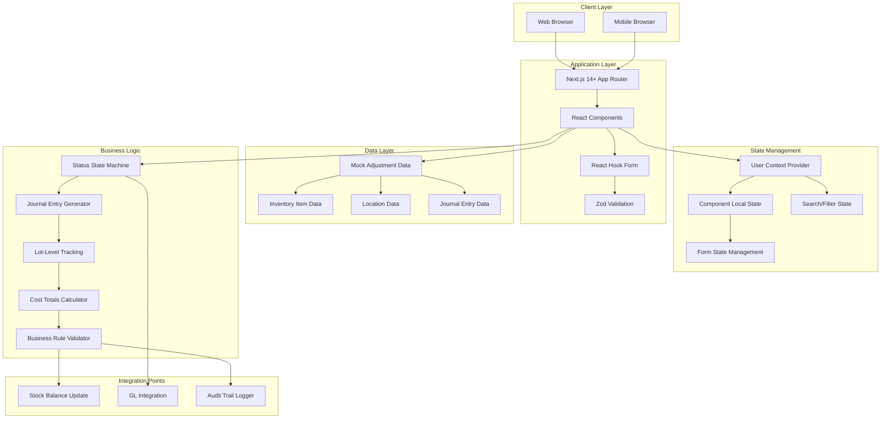
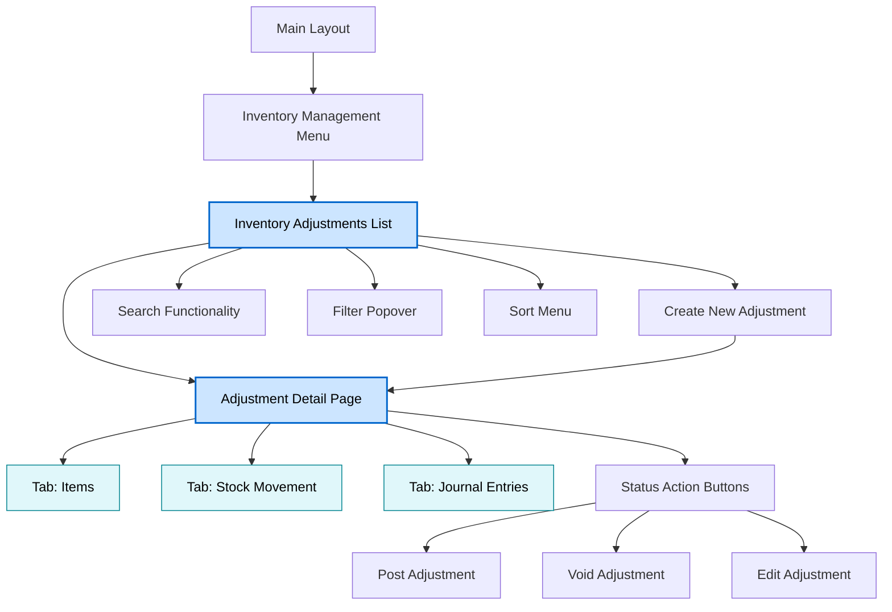
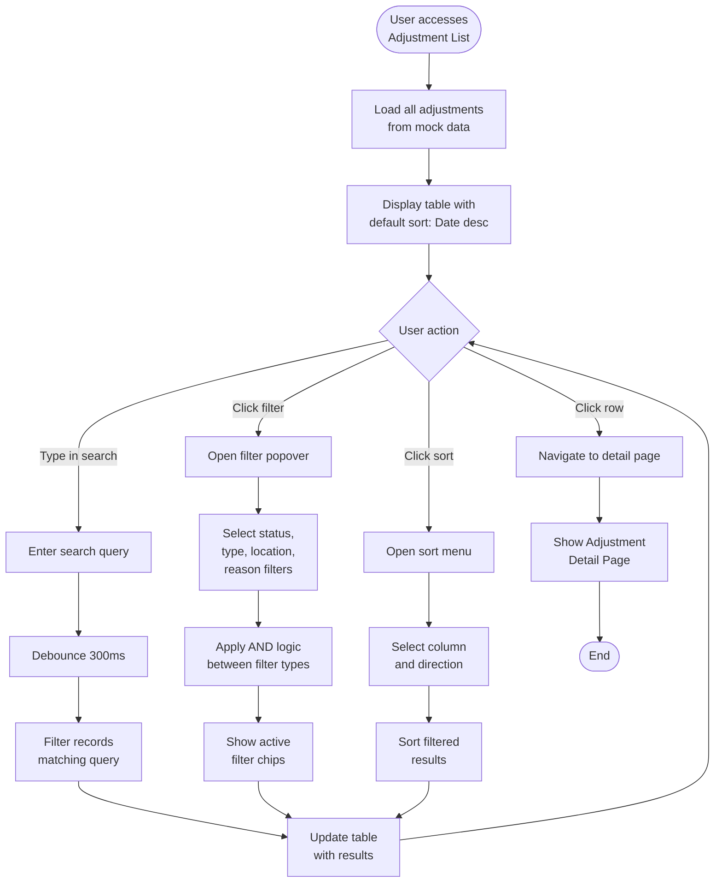
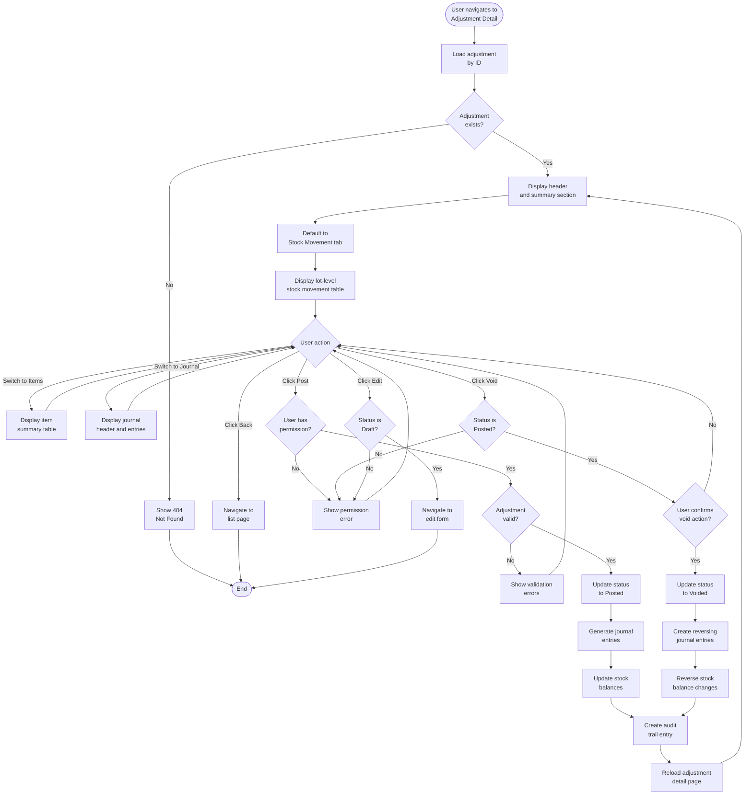
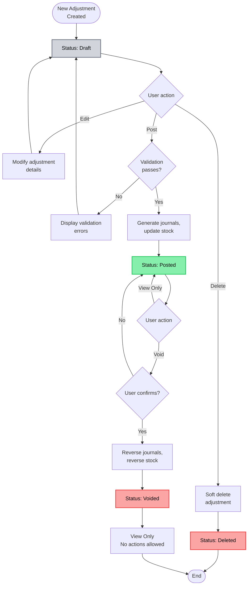
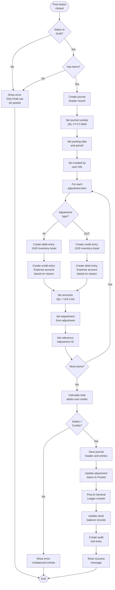
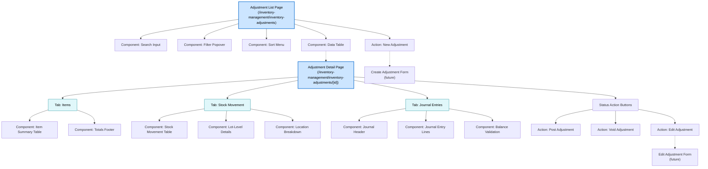

# Technical Specification: Inventory Adjustments

## Module Information
- **Module**: Inventory Management
- **Sub-Module**: Inventory Adjustments
- **Route**: `/inventory-management/inventory-adjustments`
- **Version**: 1.1.0
- **Last Updated**: 2025-12-09
- **Owner**: Development Team
- **Status**: Active

## Document History
| Version | Date | Author | Changes |
|---------|------|--------|---------|
| 1.1.0 | 2025-12-09 | Development Team | Updated to match implementation: type-specific adjustment reasons, costing rules, GL account mapping |
| 1.0.0 | 2025-01-10 | Development Team | Initial technical specification based on source code analysis |

---

## Overview

This document provides high-level technical implementation guidance for the Inventory Adjustments sub-module within the Inventory Management module of the Carmen ERP system. It describes the architecture, page structure, navigation flows, component responsibilities, and integration patterns.

The Inventory Adjustments module provides comprehensive functionality for recording and managing inventory quantity adjustments (increases and decreases) with full audit trail, lot-level traceability, and automated general ledger integration. It supports hospitality operations by tracking stock adjustments due to physical counts, damage, spoilage, waste, samples, promotions, conversions, and inter-department transfers.

**Key Capabilities**:
- Create and manage inventory adjustment transactions (IN/OUT types)
- Record adjustments with TYPE-SPECIFIC reason codes:
  - **Stock OUT (7 reasons)**: Damaged Goods, Expired Items, Theft/Loss, Spoilage, Physical Count Variance, Quality Control Rejection, Other
  - **Stock IN (5 reasons)**: Physical Count Variance, Found Items, Return to Stock, System Correction, Other
- Track lot-level stock movements for traceability
- Generate automated balanced journal entries for general ledger
- Workflow management: Draft → Posted → Voided status transitions
- Multi-location and multi-department support
- Search, filter, and sort functionality for adjustment list
- Three-tab detail view: Items, Stock Movement, Journal Entries
- **Costing Rules**:
  - Stock OUT: Uses system average cost automatically (no price entry)
  - Stock IN: Requires manual unit cost entry (affects inventory valuation)

**Related Documents**:

**Shared Methods** (Infrastructure):
- **[SM: Costing Methods](../../shared-methods/inventory-valuation/SM-costing-methods.md)** - Shared transaction system implementation, FIFO algorithm, lot tracking
- **[SM: Period-End Snapshots](../../shared-methods/inventory-valuation/SM-period-end-snapshots.md)** - Period management and snapshot integration

**Module Documentation**:
- [Business Requirements](./BR-inventory-adjustments.md)
- [Use Cases](./UC-inventory-adjustments.md)
- [Data Schema](./DS-inventory-adjustments.md)
- [Flow Diagrams](./FD-inventory-adjustments.md)
- [Validations](./VAL-inventory-adjustments.md)

---

## Architecture

### High-Level System Architecture



### Component Architecture

The Inventory Adjustments module follows a layered architecture:

- **Presentation Layer**: React components for list view, detail view, and data tables
- **State Management Layer**: User Context for permissions, Local State for UI interactions
- **Business Logic Layer**: Status workflow engine, journal entry generation, lot tracking
- **Data Access Layer**: Mock data with adjustment transactions and related entities
- **Integration Layer**: Stock balance updates, GL posting, audit logging

---

## Technology Stack

### Frontend Technologies
- **Framework**: Next.js 14+ with App Router pattern
- **UI Library**: React 18+
- **Styling**: Tailwind CSS with Shadcn/ui component library
- **Form Management**: React Hook Form for data entry forms
- **Validation**: Zod schema validation for type-safe form validation
- **State Management**: User Context (role/department/location), Local State (search/filter/sort)
- **Icons**: Lucide React
- **Date Handling**: date-fns library for date formatting

### UI Components (Shadcn/ui)
- **Table**: Data table for list and detail views
- **Card**: Container for content sections
- **Badge**: Status and type indicators
- **Button**: Action buttons and navigation
- **Input**: Search input fields
- **Dropdown**: Filter and sort menus
- **Tabs**: Three-tab detail interface
- **Dialog**: Modal forms (future enhancement)

### Backend Technologies
- **Runtime**: Node.js 20+
- **Server Framework**: Next.js Server Components
- **Data Layer**: Mock data generators (to be replaced with Supabase in production)
- **Business Logic**:
  - Status state machine for workflow transitions
  - Journal entry generation algorithm
  - Cost calculation functions
  - Validation rule engine

### Testing & DevOps
- **Unit Tests**: Vitest
- **E2E Tests**: Playwright
- **Version Control**: Git
- **CI/CD**: GitHub Actions
- **Hosting**: Vercel

---

## Page Structure & Navigation

### Page Hierarchy



### Main Pages

#### 1. Inventory Adjustments List Page
**Route**: `/inventory-management/inventory-adjustments`

**Purpose**: Display searchable, filterable list of all inventory adjustments with summary information

**Layout Components**:
- **Page Header**: "Inventory Adjustments" title with "New Adjustment" action button
- **Search Bar**: Full-text search across all adjustment fields
- **Filter Popover**: Multi-select filters for Status, Type, Location, Reason
- **Sort Menu**: Sortable columns (Date, ID, Type, Status, Location, Value)
- **Data Table**: Paginated table with 8 adjustments per page
- **Row Actions**: Click row to navigate to detail view

**Table Columns**:
1. **Adjustment ID**: Unique identifier (e.g., ADJ-2024-001)
2. **Date**: Transaction date in MM/DD/YYYY format
3. **Type**: Badge indicator (IN = green, OUT = red)
4. **Status**: Badge indicator (Draft = gray, Posted = green, Voided = red)
5. **Location**: Location name and code
6. **Reason**: Adjustment reason description
7. **Items**: Count of line items
8. **Total Value**: Formatted currency amount

**Mock Data Structure** (8 sample adjustments):
- IDs: ADJ-2024-001 to ADJ-2024-008
- Types: Mix of IN (5) and OUT (3)
- Statuses: Posted (5), Draft (2), Voided (1)
- Locations: Main Warehouse, Kitchen, Bar, Housekeeping, Engineering
- Reasons: Type-specific (Stock OUT: Damaged Goods, Expired Items, Theft/Loss, Spoilage, Count Variance, Quality Rejection, Other; Stock IN: Count Variance, Found Items, Return to Stock, System Correction, Other)
- Date Range: January 2024
- Value Range: $245.00 to $2,845.50

**Key Features**:
- Real-time search with debouncing for performance
- Multi-criteria filtering with active filter chips
- Ascending/descending sort on any column
- Row click navigation to detail page
- Responsive table design (card view on mobile)
- Empty state message when no results
- Loading skeleton during data fetch

**Search Logic**:
- Searches across all fields: ID, date, type, status, location, reason
- Case-insensitive matching
- Updates results dynamically as user types
- Highlights matched terms (future enhancement)

**Filter Logic**:
- **Status Filter**: Draft, Posted, Voided (multi-select)
- **Type Filter**: IN, OUT (multi-select)
- **Location Filter**: All accessible locations (multi-select)
- **Reason Filter**: 8 predefined reasons (multi-select)
- Active filters displayed as dismissible chips
- AND logic between different filter types
- OR logic within same filter type

**Sort Logic**:
- Default sort: Date descending (newest first)
- Sortable columns: Date, Adjustment ID, Total Value
- Sort direction toggle (asc/desc)
- Sort indicator icon in column header
- Maintains sort during search/filter operations

**Technical Implementation**:
- Uses `useMemo` for search/filter/sort performance optimization
- `useState` for search query, active filters, sort configuration
- Table component from Shadcn/ui
- Responsive grid layout with Tailwind CSS

---

#### 2. Inventory Adjustment Detail Page
**Route**: `/inventory-management/inventory-adjustments/[id]`

**Purpose**: Display comprehensive details of single adjustment transaction with lot-level traceability and journal entries

**Layout Sections**:

**Header Section**:
- Adjustment ID and status badge
- Back button to return to list
- Action buttons: Post, Void, Edit (permission-based)
- Last modified timestamp

**Summary Section** (Card):
- **Adjustment Information**:
  - Adjustment ID (e.g., ADJ-2024-001)
  - Date (MM/DD/YYYY format)
  - Type badge (IN/OUT with color coding)
  - Status badge (Draft/Posted/Voided with color coding)
- **Location & Reason**:
  - Location name and code (e.g., "Main Warehouse - WH01")
  - Department (e.g., "Food & Beverage")
  - Adjustment reason
  - Description (optional notes)
- **Totals Summary**:
  - IN Quantity: Total units increased
  - OUT Quantity: Total units decreased
  - Total Cost: Formatted currency amount with cost impact

**Tabbed Interface** (3 tabs):

**Tab 1: Items**
- Simple item-level summary table
- Columns: Product Name, SKU, Quantity, UOM, Unit Cost, Total Cost
- Shows items without lot-level detail
- Sorted by product name
- Footer row with grand totals

**Tab 2: Stock Movement**
- Detailed lot-level stock movement table
- Columns: Product Name, SKU, Location Type, Location Code, Lot No, Quantity, UOM, Unit Cost, Total Cost
- Shows each lot separately for full traceability
- Location types: WAREHOUSE, OUTLET, KITCHEN, BAR, HOUSEKEEPING, ENGINEERING
- Lot numbers for FIFO/batch tracking
- Footer row with grand totals

**Tab 3: Journal Entries**
- Two sections: Journal Header and Journal Entry Lines

**Journal Header Section**:
- Status badge (Draft/Posted/Voided)
- Journal Number (e.g., JNL-2024-001)
- Posting Date and Period
- Description and Reference
- Created By and Created At
- Posted By and Posted At (if posted)

**Journal Entry Lines Table**:
- Columns: Account, Account Name, Debit, Credit, Department, Reference
- Shows balanced double-entry accounting
- Debits for IN adjustments (increase asset)
- Credits for OUT adjustments (decrease asset)
- Footer row showing total debits and credits (must balance)
- Visual validation: Balanced = green checkmark, Unbalanced = red warning

**Mock Data**:
- 3 sample items per adjustment
- Multiple lots per item for traceability
- Automated journal entries with balanced debits/credits
- Standard GL accounts:
  - 1100 - Inventory Asset
  - 5100 - Cost of Goods Sold
  - 5200 - Waste Expense
  - 5300 - Sample Expense

**Key Features**:
- Default tab: Stock Movement (most detailed view)
- Tab state persists during session
- Responsive table design
- Print-friendly layout
- Export capability (future enhancement)
- Breadcrumb navigation
- Permission-based action buttons

**Status Action Buttons**:
- **Draft Status**:
  - Edit button: Navigate to edit form
  - Post button: Change status to Posted, lock record
  - Delete button: Remove adjustment (soft delete)
- **Posted Status**:
  - Void button: Reverse adjustment with void transaction
  - View Only: No editing allowed
- **Voided Status**:
  - View Only: Read-only, no actions available

**Business Rules**:
- Only Draft adjustments can be edited
- Posting creates journal entries and updates stock balances
- Voiding reverses stock impact and creates reversing journal
- Posted adjustments cannot be deleted
- Void action requires confirmation dialog
- Audit trail captures all status changes

**Technical Implementation**:
- Dynamic route parameter `[id]` for adjustment ID
- Tabs component from Shadcn/ui
- Table components for Items, Stock Movement, Journal Entries
- Conditional rendering based on status
- Permission checks via User Context
- Mock journal entry generation algorithm

---

## Navigation Flow Diagrams

### Adjustment List Search/Filter/Sort Flow



### Adjustment Detail View Flow



### Status Workflow State Machine



### Journal Entry Generation Flow



---

## Sitemap

### Overview
This section provides the complete navigation structure of all pages, tabs, and components in the Inventory Adjustments sub-module. It documents the user workflows and interaction patterns for recording and managing inventory quantity adjustments.

### Enhanced Page Hierarchy



### User Journey Maps

#### Journey 1: Storekeeper Reviews Daily Adjustments
**Actor**: Storekeeper
**Goal**: Review all adjustments posted today
**Entry Point**: Main navigation → Inventory Management → Inventory Adjustments

**Steps**:
1. Access Inventory Adjustments list page
2. View table with all adjustments (default: date descending)
3. Today's adjustments appear at top of list
4. Review Posted status badges (green)
5. Check adjustment reasons (physical count, damage, waste)
6. Click adjustment row to view details
7. Review Stock Movement tab for lot-level details
8. Verify journal entries tab shows balanced entries
9. Return to list for next adjustment

**Exit Point**: All daily adjustments reviewed

---

#### Journey 2: Warehouse Manager Investigates Variance
**Actor**: Warehouse Manager
**Goal**: Investigate specific adjustment for variance
**Entry Point**: Inventory Adjustments list page

**Steps**:
1. Use search to find adjustment ID (e.g., "ADJ-2024-001")
2. Search results filter to matching adjustment
3. Click row to open detail page
4. Review summary section (location, reason, totals)
5. Check Items tab for item-level summary
6. Switch to Stock Movement tab
7. Analyze lot-level movements for discrepancies
8. Note location types (warehouse, kitchen, bar)
9. Switch to Journal Entries tab
10. Verify proper GL account coding
11. Check debits equal credits (balanced)
12. Print page for investigation documentation

**Exit Point**: Evidence collected for variance investigation

---

#### Journey 3: Financial Controller Audits Posted Adjustments
**Actor**: Financial Controller
**Goal**: Audit adjustments for month-end close
**Entry Point**: Inventory Adjustments list page

**Steps**:
1. Open filter popover
2. Select Status: Posted
3. Select date range: Current month
4. Apply filters
5. View all Posted adjustments for month
6. Review Total Value column for high-value adjustments
7. Click high-value adjustment to investigate
8. Review summary section for reason justification
9. Switch to Journal Entries tab
10. Verify journal number generated (JNL-YYYY-NNN)
11. Check posting date and period correct
12. Verify GL accounts match adjustment reason
13. Confirm debits equal credits
14. Check Posted By and Posted At timestamps
15. Export list for month-end reporting

**Exit Point**: Month-end adjustment audit complete

---

#### Journey 4: Head Chef Posts Waste Adjustment
**Actor**: Head Chef
**Goal**: Post waste adjustment after inventory count
**Entry Point**: Inventory Adjustments list page

**Steps**:
1. Click "New Adjustment" button
2. Create adjustment form opens
3. Select Type: OUT (decrease)
4. Select Location: Kitchen
5. Select Reason: Waste
6. Add items with quantities and costs
7. Save as Draft status
8. Review Items tab for accuracy
9. Check Stock Movement tab for lot details
10. Verify totals match physical count
11. Click "Post" button
12. System validates adjustment
13. Status changes to Posted (green badge)
14. Journal entries automatically generated
15. Stock balances updated
16. Success message displayed
17. Adjustment now read-only

**Exit Point**: Waste adjustment posted to GL and inventory

---

#### Journey 5: QC Inspector Voids Incorrect Adjustment
**Actor**: Quality Control Inspector
**Goal**: Void incorrectly posted adjustment
**Entry Point**: Inventory Adjustments list page

**Steps**:
1. Search for adjustment ID requiring void
2. Click row to open detail page
3. Review summary confirms incorrect posting
4. Check current Status: Posted (green badge)
5. Click "Void" button
6. Confirmation dialog appears
7. Enter void reason: "Posted in error - incorrect quantity"
8. Confirm void action
9. System processes void:
   - Creates reversing journal entries
   - Reverses stock balance changes
   - Updates status to Voided (red badge)
10. Review Journal Entries tab
11. See original entries and reversing entries
12. Verify stock movements reversed
13. Check audit trail logged void action
14. Success message displayed
15. Adjustment now view-only

**Exit Point**: Incorrect adjustment voided and reversed

---

## Component Descriptions

This section provides high-level descriptions of key components without implementation code, focusing on responsibilities, inputs, and outputs.

### List Page Components

#### InventoryAdjustmentList Component
**File**: `app/(main)/inventory-management/inventory-adjustments/components/inventory-adjustment-list.tsx`

**Responsibility**: Orchestrate complete adjustment list functionality with search, filter, sort, and table display

**Key Features**:
- Manages adjustment data array with 8 mock adjustments
- Provides real-time search across all fields
- Multi-criteria filtering (status, type, location, reason)
- Column sorting with ascending/descending toggle
- Responsive table design
- Row click navigation to detail page

**Inputs**: Mock adjustment data from in-component array
**Outputs**: Rendered data table with search/filter/sort controls
**State Management**: Local state for search query, active filters, sort configuration
**Performance**: Uses `useMemo` for filter/sort optimization

---

#### SearchInput Component
**Responsibility**: Provide text input for full-text search across adjustments

**Key Features**:
- Debounced input for performance (300ms delay)
- Search icon indicator
- Clear button when query exists
- Case-insensitive matching
- Searches all fields: ID, date, type, status, location, reason

**Inputs**: Search query string
**Outputs**: Filtered adjustment array
**State Management**: Local state for input value, debounced callback

---

#### FilterPopover Component
**Responsibility**: Display multi-select filter options in popover overlay

**Key Features**:
- Four filter categories: Status, Type, Location, Reason
- Multi-select checkboxes within each category
- Active filter chips below search bar
- Clear individual filters or clear all
- AND logic between categories, OR within category

**Filter Options**:
- **Status**: Draft, Posted, Voided
- **Type**: IN, OUT
- **Location**: All accessible locations from user permissions
- **Reason**: Type-specific reasons (filtered based on selected Type):
  - **Stock OUT**: Damaged Goods, Expired Items, Theft/Loss, Spoilage, Physical Count Variance, Quality Control Rejection, Other
  - **Stock IN**: Physical Count Variance, Found Items, Return to Stock, System Correction, Other

**Inputs**: Available filter options based on user permissions
**Outputs**: Array of active filter objects
**State Management**: Local state for selected filters

---

#### SortMenu Component
**Responsibility**: Provide dropdown menu for column sorting

**Key Features**:
- Sortable columns: Date, Adjustment ID, Total Value
- Ascending/descending direction toggle
- Sort indicator icon in table headers
- Default sort: Date descending

**Inputs**: Current sort configuration
**Outputs**: Updated sort configuration object
**State Management**: Local state for sort field and direction

---

### Detail Page Components

#### InventoryAdjustmentDetail Component
**File**: `app/(main)/inventory-management/inventory-adjustments/components/inventory-adjustment-detail.tsx`

**Responsibility**: Orchestrate complete adjustment detail view with summary and three tabs

**Key Features**:
- Loads adjustment data by ID from URL parameter
- Displays header with ID, status badge, action buttons
- Shows summary section with adjustment information
- Provides three-tab interface for different views
- Conditionally renders action buttons based on status and permissions
- Handles Post, Void, Edit actions

**Inputs**: Adjustment ID from route parameter
**Outputs**: Complete detail page with tabs and actions
**State Management**: Local state for active tab, loading states
**Permission Checks**: User Context for action button visibility

---

#### ItemSummaryTable Component
**Responsibility**: Display simple item-level summary without lot details

**Key Features**:
- Table with 6 columns: Product Name, SKU, Quantity, UOM, Unit Cost, Total Cost
- One row per item (aggregates lots)
- Sorted by product name
- Footer row with grand totals
- Currency formatting for costs

**Inputs**: Array of adjustment items (aggregated from lots)
**Outputs**: Rendered summary table
**Calculations**: Sum quantities and costs across lots per item

---

#### StockMovementTable Component
**File**: `app/(main)/inventory-management/inventory-adjustments/components/stock-movement-table.tsx`

**Responsibility**: Display detailed lot-level stock movements for full traceability

**Key Features**:
- Table with 9 columns: Product Name, SKU, Location Type, Location Code, Lot No, Quantity, UOM, Unit Cost, Total Cost
- Multiple rows per item (one per lot)
- Shows location type breakdown (WAREHOUSE, OUTLET, KITCHEN, BAR, HOUSEKEEPING, ENGINEERING)
- Displays lot numbers for FIFO/batch tracking
- Footer row with grand totals
- Sortable by product name, location type, lot number

**Inputs**: Array of stock movement items with lot details
**Outputs**: Rendered stock movement table with lot-level granularity
**Traceability**: Essential for food safety and batch recall scenarios

---

#### JournalHeader Component
**File**: `app/(main)/inventory-management/inventory-adjustments/components/journal-header.tsx`

**Responsibility**: Display journal entry header information

**Key Features**:
- Status badge (Draft/Posted/Voided)
- Journal Number (e.g., JNL-2024-001)
- Posting Date and Posting Period
- Description and Reference
- Created By, Created At timestamps
- Posted By, Posted At timestamps (if status is Posted)
- Formatted date displays

**Inputs**: Journal header object
**Outputs**: Styled header section with formatted information
**Conditional Display**: Posted By/At only shown for Posted status

---

#### JournalTable Component
**File**: `app/(main)/inventory-management/inventory-adjustments/components/journal-table.tsx`

**Responsibility**: Display journal entry lines with balance validation

**Key Features**:
- Table with 6 columns: Account, Account Name, Debit, Credit, Department, Reference
- Shows all entry lines (typically 2-6 per adjustment)
- Footer row with total debits and total credits
- Balance validation indicator:
  - Green checkmark: Debits = Credits (balanced)
  - Red warning: Debits ≠ Credits (unbalanced, error state)
- Currency formatting for debit/credit amounts
- Department and reference context

**Inputs**: Array of journal entry line items
**Outputs**: Rendered journal table with balance validation
**Business Rule**: Total debits must equal total credits (BR-INV-ADJ-004)

---

## Business Logic Descriptions

This section describes key algorithms and calculation methods without implementation code.

### Status State Machine
**Function**: `manageAdjustmentStatus()`

**Purpose**: Control status transitions and enforce workflow rules

**Status Flow**:
- **Draft → Posted**: Via Post action, validates adjustment, generates journals, updates stock
- **Posted → Voided**: Via Void action, reverses journals and stock, requires confirmation
- **Draft → Deleted**: Via Delete action, soft delete only for Draft status

**Business Rules**:
- Only Draft status can be edited
- Only Draft status can be posted
- Only Posted status can be voided
- Voided status is read-only (no further actions)
- Deleted status hidden from normal views

**Validation Before Posting**:
- Must have at least one item
- All items must have valid quantities > 0
- All items must have valid unit costs > 0
- Location must be valid and accessible
- Reason must be selected
- Department must be specified

**Audit Trail**:
- Log status change event
- Capture user who made change
- Capture timestamp of change
- Store reason for void (if applicable)

---

### Journal Entry Generation Algorithm
**Function**: `generateJournalEntries()`

**Purpose**: Automatically create balanced journal entries for GL posting

**Process**:
1. Create journal header:
   - Generate unique journal number: JNL-YYYY-NNN
   - Set posting date (current date)
   - Set posting period (YYYY-MM)
   - Set description: "Inventory Adjustment: [Reason]"
   - Set reference: Adjustment ID
   - Set created by: Current user
   - Set created at: Current timestamp

2. For each adjustment item:
   - Calculate line amount: Quantity × Unit Cost
   - Determine GL accounts based on adjustment type and reason

3. **IN Adjustments** (Inventory Increase):
   - **Debit**: 1310 Raw Materials Inventory (increases asset)
   - **Credit**: 5110 Inventory Variance
   - Valid reasons: Physical Count Variance, Found Items, Return to Stock, System Correction, Other
   - **Unit Cost**: Manually entered by user (required, affects inventory valuation)

4. **OUT Adjustments** (Inventory Decrease):
   - **Debit**: 5110 Inventory Variance
   - **Credit**: 1310 Raw Materials Inventory (decreases asset)
   - Valid reasons: Damaged Goods, Expired Items, Theft/Loss, Spoilage, Physical Count Variance, Quality Control Rejection, Other
   - **Unit Cost**: Automatically uses product's average cost (no manual entry)

5. Set department and reference on each line
6. Calculate total debits and total credits
7. Validate balance: Total Debits = Total Credits
8. If unbalanced, throw error and prevent posting
9. Save journal header and entry lines
10. Update adjustment status to Posted
11. Update stock balances

**Inputs**: Adjustment object with items and reason
**Outputs**: Journal header and entry lines, updated stock balances
**Business Rule**: BR-INV-ADJ-004 (Balanced Journal Entries)

---

### Stock Balance Update Algorithm
**Function**: `updateStockBalances()`

**Purpose**: Update inventory stock balances when adjustment is posted or voided

**Process for Posting (Normal)**:
1. For each adjustment item with lots:
   - Identify location and item
   - Load current stock balance record
   - Calculate new quantity:
     - **IN**: New Quantity = Current + Adjustment Qty
     - **OUT**: New Quantity = Current - Adjustment Qty
   - Calculate new total cost:
     - **IN**: New Cost = Current Cost + (Qty × Unit Cost)
     - **OUT**: New Cost = Current Cost - (Qty × Unit Cost)
   - Update average cost if costing method is PERIODIC_AVERAGE
   - Save updated stock balance record

2. Create inventory transaction record:
   - Transaction type: ADJUST_UP or ADJUST_DOWN
   - Quantity, unit cost, total cost
   - Balance after transaction
   - Transaction date, reference, lot/batch info
   - User who created transaction

3. If quantity after OUT adjustment goes negative:
   - Throw validation error
   - Prevent posting
   - Show error message: "Insufficient stock for adjustment"

**Process for Voiding (Reversal)**:
1. Load original adjustment
2. Create reversing transactions:
   - **Original IN**: Create OUT transaction
   - **Original OUT**: Create IN transaction
3. Update stock balances with reversed amounts
4. Create audit trail for void action

**Inputs**: Adjustment object, action type (post or void)
**Outputs**: Updated stock balance records, inventory transaction records
**Business Rules**: BR-INV-ADJ-002, BR-INV-ADJ-003

---

### Lot-Level Tracking Algorithm
**Function**: `allocateLots()`

**Purpose**: Track inventory movements at lot/batch level for traceability

**Process**:
1. For IN adjustments (receiving):
   - Create new lot if specified
   - Or allocate to existing lot
   - Record lot number, expiry date, batch info
   - Update lot balance

2. For OUT adjustments (consumption):
   - Use FIFO allocation by default:
     - Consume oldest lots first
     - Allocate quantity across multiple lots if needed
   - Record lots consumed
   - Update lot balances

3. Store lot-level detail for each item:
   - Lot number (e.g., LOT-2024-001)
   - Quantity allocated from/to lot
   - Expiry date (if applicable)
   - Location within facility

**Inputs**: Adjustment items with optional lot specifications
**Outputs**: Lot-level stock movement records for traceability
**Use Case**: Essential for food safety, batch recalls, expiry tracking

---

### Cost Calculation Algorithm
**Function**: `calculateAdjustmentTotals()`

**Purpose**: Calculate aggregate totals for adjustment summary

**Calculations**:
1. **Total IN Quantity**: Sum of all item quantities for IN type
2. **Total OUT Quantity**: Sum of all item quantities for OUT type
3. **Total Cost**:
   - For each item: Quantity × Unit Cost
   - Sum across all items
   - Format as currency

4. **Cost by Category**:
   - Group items by category (Food, Beverage, etc.)
   - Sum cost within each category
   - Use for reporting and analytics

**Inputs**: Array of adjustment items with quantities and unit costs
**Outputs**: Totals object with inQty, outQty, totalCost
**Business Rule**: BR-INV-ADJ-005 (Cost Calculation)

---

## Integration Points

### User Context Integration
**Context Provider**: `lib/context/user-context.tsx`

**Purpose**: Provide user role, department, location permissions for access control

**Integration Points**:
- **Location Filtering**: Filter adjustments by user's accessible locations
- **Action Permissions**:
  - Post Adjustment: Requires "adjust_stock" permission
  - Void Adjustment: Requires "void_adjustments" permission
  - Delete Adjustment: Requires "delete_adjustments" permission
- **Department Context**: Default department on new adjustments
- **Role-Based Display**:
  - System Administrator: View all adjustments
  - Department Manager: View department adjustments only
  - Storekeeper: View own location adjustments only

**Usage in Inventory Adjustments**:
- Filter adjustment list by accessible locations
- Control visibility of action buttons (Post, Void, Edit, Delete)
- Pre-fill location and department on new adjustment
- Apply row-level security for data access

---

### Mock Data Layer Integration
**Data Source**: `app/(main)/inventory-management/inventory-adjustments/components/types.ts` (in-component mock data)

**Purpose**: Provide sample adjustment data for development and testing

**Mock Data Structure**:
- **mockAdjustments**: Array of 8 sample adjustments with varied scenarios
- **mockAdjustmentDetail**: Full detail for single adjustment (ADJ-2024-001)
- **mockJournalEntries**: Complete journal header and entry lines

**Data Characteristics**:
- IDs: Sequential ADJ-2024-001 to ADJ-2024-008
- Types: Mix of IN (5) and OUT (3)
- Statuses: Posted (5), Draft (2), Voided (1)
- Locations: Main Warehouse, Kitchen, Bar, Housekeeping, Engineering
- Reasons: All 8 predefined reasons represented
- Items: 1-12 items per adjustment
- Lots: 1-3 lots per item for traceability
- Values: $245 to $2,845 range
- Dates: January 2024 range

**Future Migration**: Will be replaced with Supabase database queries and PostgreSQL stored procedures

---

### Stock Balance Integration
**Integration Module**: Stock Balances (future)

**Purpose**: Update inventory quantities and costs when adjustments are posted

**Integration Flow**:
1. Adjustment status changes to Posted
2. Stock Balance module receives update event
3. For each item in adjustment:
   - Locate stock balance record (location + item)
   - Update quantity (add for IN, subtract for OUT)
   - Update total cost
   - Recalculate average cost if PERIODIC_AVERAGE
4. Create inventory transaction record
5. Update last transaction date
6. Trigger alerts if below reorder point

**Error Handling**:
- If stock balance not found, create new record
- If quantity goes negative, reject posting
- If concurrent update conflict, retry with optimistic locking

---

### General Ledger Integration
**Integration Module**: General Ledger (future)

**Purpose**: Post adjustment journal entries to financial system

**Integration Flow**:
1. Journal entries generated when adjustment posted
2. Journal record sent to GL module
3. GL validates journal:
   - Debits = Credits
   - Valid account codes
   - Valid posting period (not closed)
4. GL posts entries to trial balance
5. GL sends success/failure response
6. Adjustment status reflects GL posting status

**Account Mapping**:
- Inventory Asset: 1100
- Cost of Goods Sold: 5100
- Waste Expense: 5200
- Sample Expense: 5300

**Future Enhancement**: Real-time GL posting with webhook integration

---

### Audit Log Integration
**Integration Module**: Audit Trail (future)

**Purpose**: Log all adjustment transactions for compliance and investigation

**Events Logged**:
- Adjustment created (Draft status)
- Adjustment modified
- Adjustment posted (status change)
- Adjustment voided (status change with reason)
- Adjustment deleted
- Journal entries generated
- Stock balances updated

**Audit Record Fields**:
- Event type
- Adjustment ID
- User who performed action
- Timestamp of action
- Before and after values (for changes)
- Reason for void (if applicable)
- IP address and session info

---

### Navigation Integration
**Navigation Component**: `components/Sidebar.tsx`

**Integration Points**:
- "Inventory Management" menu item with sub-items
- "Inventory Adjustments" submenu → `/inventory-management/inventory-adjustments`
- Breadcrumb navigation: Home → Inventory Management → Inventory Adjustments
- Detail page breadcrumb: ... → Inventory Adjustments → ADJ-2024-001

**Context Preservation**:
- Maintain selected filters when navigating back from detail
- Preserve search query and sort configuration
- Remember active tab in detail view during session

---

### Responsive Design Integration
**Framework**: Tailwind CSS with Shadcn/ui

**Breakpoints**:
- Mobile (< 768px): 1 column, stacked cards, simplified tables
- Tablet (768px - 1024px): 2 columns, collapsible sidebar
- Desktop (> 1024px): 3 columns, expanded sidebar, full tables

**Responsive Components**:
- **List Table**: Switches to card view on mobile
- **Detail Tabs**: Stack vertically on mobile
- **Summary Cards**: Full width on mobile, grid on desktop
- **Action Buttons**: Stack vertically on mobile, inline on desktop

**Mobile-First Approach**: Base styles optimized for mobile, progressive enhancement for larger screens

---

## Performance Considerations

### Data Loading Strategy
- **Initial Load**: Load all adjustments on list page mount (currently 8 mock items)
- **Lazy Loading**: Future enhancement for large datasets (pagination, infinite scroll)
- **Detail Load**: Load single adjustment by ID on detail page mount
- **Loading States**: Skeleton loaders during data fetch
- **Error States**: Graceful error handling with retry options

### Optimization Techniques
- **Memoization**: Use `useMemo` for search/filter/sort operations
- **Debouncing**: 300ms debounce on search input to reduce re-renders
- **Callback Optimization**: Use `useCallback` for event handlers
- **Tab Lazy Loading**: Defer rendering tab content until tab is active
- **Table Virtualization**: Future enhancement for large datasets

### Caching Strategy
- **Session Storage**: Cache adjustment list during session
- **Local Storage**: Future enhancement for draft adjustments
- **React Query**: Future enhancement for API response caching with automatic invalidation

### Bundle Optimization
- **Code Splitting**: Lazy load detail page component
- **Tree Shaking**: Import only used Shadcn/ui components
- **Icon Optimization**: Use Lucide React tree-shaking

---

## Security Considerations

### Access Control
- **Location-Based Access**: Filter adjustments by user's available locations
- **Role-Based Permissions**:
  - Create Adjustment: "create_adjustments" permission
  - Post Adjustment: "post_adjustments" permission
  - Void Adjustment: "void_adjustments" permission
  - Delete Adjustment: "delete_adjustments" permission
- **Status-Based Actions**: Only Draft can be edited, only Posted can be voided
- **System Administrator Bypass**: Admins can view all locations and perform all actions

### Data Protection
- **No Sensitive Data Exposure**: Mock data contains no real financial information
- **Permission Validation**: Server-side validation of user permissions before actions
- **Audit Trail**: Activity logging for all adjustment operations
- **Soft Delete**: Draft adjustments soft deleted (not permanently removed)

### Input Validation
- **Client-Side**: React Hook Form + Zod schema validation
- **Server-Side**: Business rule validation before posting
- **Quantity Validation**: Prevent negative stock balances
- **Cost Validation**: Require positive unit costs
- **Date Validation**: Posting date cannot be in closed period

---

## Future Enhancements

### Planned Features
1. **Bulk Adjustments**: Upload CSV for multiple adjustments
2. **Approval Workflow**: Multi-level approval for high-value adjustments
3. **Mobile App**: Native mobile app for field adjustments
4. **Barcode Scanning**: Scan items to add to adjustment
5. **Photo Attachments**: Attach photos of damaged goods, waste
6. **Recurring Adjustments**: Templates for common adjustments
7. **Advanced Reporting**: Analytics dashboard for adjustment trends

### Database Migration
- Replace mock data with Supabase PostgreSQL
- Implement Row-Level Security (RLS) policies
- Create database views for common queries
- Add database triggers for real-time audit logging
- Optimize queries with proper indexing

### API Integration
- RESTful API endpoints for adjustment CRUD
- Webhook support for third-party integrations
- Real-time updates via WebSocket

### Advanced Features
- **AI-Powered Suggestions**: Recommend adjustments based on variance patterns
- **Predictive Analytics**: Forecast waste and spoilage trends
- **Automated Adjustments**: Auto-post recurring adjustments
- **Integration with Scales**: Direct weight input from digital scales

---

## Appendices

### Appendix A: File Structure

```
app/(main)/inventory-management/inventory-adjustments/
├── page.tsx                                    # List page wrapper
├── [id]/
│   └── page.tsx                                # Detail page wrapper
└── components/
    ├── types.ts                                # TypeScript interfaces and mock data
    ├── inventory-adjustment-list.tsx           # List component with search/filter/sort
    ├── inventory-adjustment-detail.tsx         # Detail component with tabs
    ├── stock-movement-table.tsx                # Lot-level stock movement table
    ├── journal-header.tsx                      # Journal entry header display
    └── journal-table.tsx                       # Journal entry lines table

lib/types/
└── inventory.ts                                # Shared inventory types
```

### Appendix B: TypeScript Interfaces

Key interfaces defined in `components/types.ts`:

**InventoryAdjustment**:
- id, date, type, status
- location, locationCode, department
- reason, description
- items array, totals object

**StockMovementItem**:
- id, productName, sku
- location object (type, code, name)
- lots array (lotNo, quantity, uom)
- uom, unitCost, totalCost

**JournalHeader**:
- status, journalNo, postingDate, postingPeriod
- description, reference
- createdBy, createdAt, postedBy, postedAt

**JournalEntry**:
- id, account, accountName
- debit, credit
- department, reference

### Appendix C: Status and Type Badges

**Status Badges**:
- **Draft**: Gray background (#d1d5db), gray text
- **Posted**: Green background (#86efac), green text
- **Voided**: Red background (#fca5a5), red text

**Type Badges**:
- **IN**: Green background, white text, "+" prefix
- **OUT**: Red background, white text, "-" prefix

**Priority Badges** (for future approval workflow):
- **High**: Red background
- **Medium**: Yellow background
- **Low**: Gray background

### Appendix D: Adjustment Reasons

**Type-specific reason codes** (reason dropdown dynamically changes based on selected adjustment type):

**Stock OUT Reasons (7 options)** - For decreasing inventory:
1. **Damaged Goods** (`damaged`): Items damaged during storage or handling
2. **Expired Items** (`expired`): Perishable items past expiration date
3. **Theft / Loss** (`theft_loss`): Missing items due to theft or unknown loss
4. **Spoilage** (`spoilage`): Perishable items spoiled before expiration
5. **Physical Count Variance** (`count_variance`): Discrepancy found during physical count (decrease)
6. **Quality Control Rejection** (`quality_rejection`): Items rejected during QC inspection
7. **Other** (`other`): Free-text reason required

**Stock IN Reasons (5 options)** - For increasing inventory:
1. **Physical Count Variance** (`count_variance`): Discrepancy found during physical count (increase)
2. **Found Items** (`found_items`): Previously missing items located
3. **Return to Stock** (`return_to_stock`): Items returned from production or service
4. **System Correction** (`system_correction`): Correction of data entry errors
5. **Other** (`other`): Free-text reason required

**Costing Rules by Type**:
- **Stock OUT**: Unit cost automatically uses product's average cost (no manual entry)
- **Stock IN**: Unit cost must be manually entered (affects inventory valuation)

### Appendix E: GL Account Mapping

| Reason | Type | Debit Account | Credit Account |
|--------|------|---------------|----------------|
| Physical Count Variance | IN | 1310 Raw Materials Inventory | 5110 Inventory Variance |
| Found Items | IN | 1310 Raw Materials Inventory | 5110 Inventory Variance |
| Return to Stock | IN | 1310 Raw Materials Inventory | 5110 Inventory Variance |
| System Correction | IN | 1310 Raw Materials Inventory | 5110 Inventory Variance |
| Other | IN | 1310 Raw Materials Inventory | 5110 Inventory Variance |
| Damaged Goods | OUT | 5110 Inventory Variance | 1310 Raw Materials Inventory |
| Expired Items | OUT | 5110 Inventory Variance | 1310 Raw Materials Inventory |
| Theft / Loss | OUT | 5110 Inventory Variance | 1310 Raw Materials Inventory |
| Spoilage | OUT | 5110 Inventory Variance | 1310 Raw Materials Inventory |
| Physical Count Variance | OUT | 5110 Inventory Variance | 1310 Raw Materials Inventory |
| Quality Control Rejection | OUT | 5110 Inventory Variance | 1310 Raw Materials Inventory |
| Other | OUT | 5110 Inventory Variance | 1310 Raw Materials Inventory |

---

**Document Control**

| Version | Date | Author | Changes |
|---------|------|--------|------------|
| 1.0.0 | 2025-01-10 | Development Team | Initial technical specification based on source code analysis |
