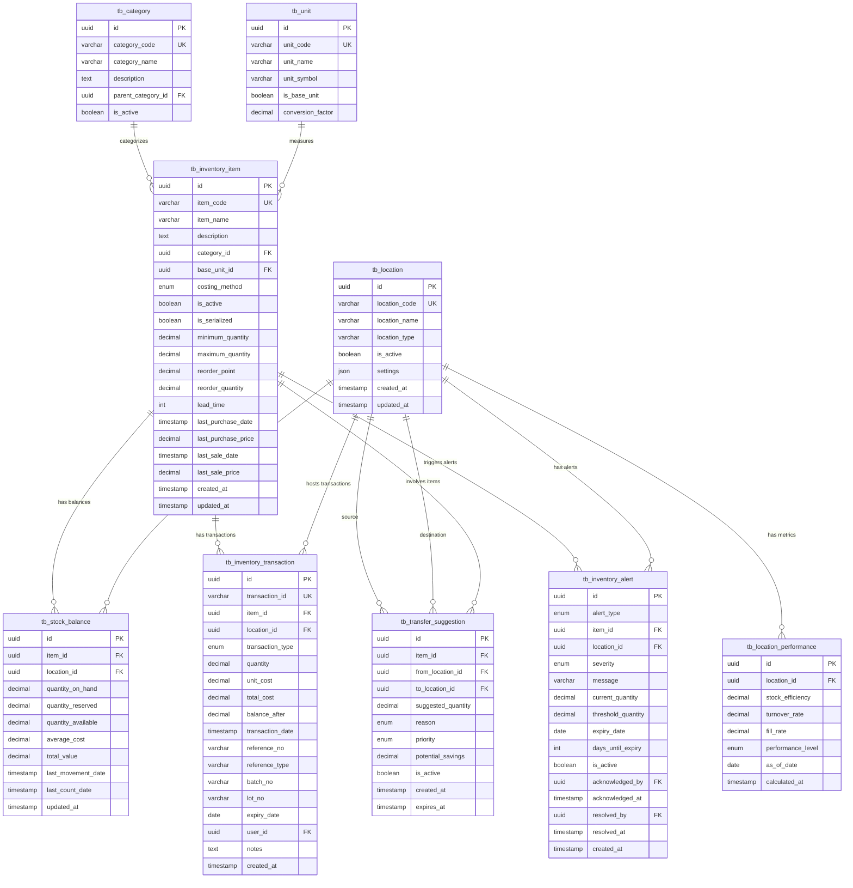

# DS-INV-OVW: Inventory Overview Data Definition

**Document Version**: 1.0
**Last Updated**: 2025-01-10
## Document History

| Version | Date | Author | Changes |
|---------|------|--------|---------|
| 1.0.0 | 2025-11-19 | Documentation Team | Initial version |
**Module**: Inventory Management
**Sub-Module**: Inventory Overview

---

## Document Overview

This document provides comprehensive data schema documentation for the Inventory Overview module. It includes entity-relationship diagrams, table structures, constraints, indexes, and data dictionaries for all entities used in the dashboard and stock overview functionality.

**Related Documents**:
- [BR-INV-OVW: Business Requirements](./BR-inventory-overview.md)
| 1.1.0 | 2025-11-15 | Documentation Team | Migrated from DS to DD format |

- [UC-INV-OVW: Use Cases](./UC-inventory-overview.md)
- [TS-INV-OVW: Technical Specification](./TS-inventory-overview.md)
- [FD-INV-OVW: Flow Diagrams](./FD-inventory-overview.md)
- [VAL-INV-OVW: Validations](./VAL-inventory-overview.md)

**Note**: Current implementation uses TypeScript interfaces with mock data. This document describes the target PostgreSQL database schema for production implementation.

---

## Entity-Relationship Diagram



**Key Relationships**:
1. **Item → Stock Balance** (1:N): Each item has stock balances at multiple locations
2. **Location → Stock Balance** (1:N): Each location maintains balances for multiple items
3. **Item → Transaction** (1:N): Each item has a transaction history
4. **Location → Performance** (1:N): Performance metrics tracked over time per location
5. **Location ↔ Transfer Suggestion** (N:N): Transfer suggestions between location pairs
6. **Item/Location → Alert** (N:N): Alerts generated for item-location combinations

---

## Core Tables

### tb_inventory_item

**Purpose**: Master table for all inventory items (products) managed across locations

**Table Definition**:

| Column Name | Data Type | Constraints | Default | Description |
|-------------|-----------|-------------|---------|-------------|
| `id` | UUID | PRIMARY KEY | gen_random_uuid() | Unique item identifier |
| `item_code` | VARCHAR(50) | NOT NULL, UNIQUE | - | Human-readable item code |
| `item_name` | VARCHAR(255) | NOT NULL | - | Item name |
| `description` | TEXT | NULLABLE | NULL | Item description |
| `category_id` | UUID | NOT NULL, FOREIGN KEY | - | Product category |
| `base_unit_id` | UUID | NOT NULL, FOREIGN KEY | - | Base unit of measure |
| `costing_method` | ENUM | NOT NULL | 'FIFO' | Costing method (FIFO or PERIODIC_AVERAGE) |
| `is_active` | BOOLEAN | NOT NULL | true | Active status |
| `is_serialized` | BOOLEAN | NOT NULL | false | Whether item tracks serial numbers |
| `minimum_quantity` | DECIMAL(20, 5) | NULLABLE | NULL | Minimum stock level |
| `maximum_quantity` | DECIMAL(20, 5) | NULLABLE | NULL | Maximum stock level |
| `reorder_point` | DECIMAL(20, 5) | NULLABLE | NULL | Reorder point threshold |
| `reorder_quantity` | DECIMAL(20, 5) | NULLABLE | NULL | Standard reorder quantity |
| `lead_time` | INTEGER | NULLABLE | NULL | Lead time in days |
| `last_purchase_date` | TIMESTAMP WITH TIME ZONE | NULLABLE | NULL | Last purchase date |
| `last_purchase_price` | DECIMAL(20, 5) | NULLABLE | NULL | Last purchase price |
| `last_sale_date` | TIMESTAMP WITH TIME ZONE | NULLABLE | NULL | Last sale/issue date |
| `last_sale_price` | DECIMAL(20, 5) | NULLABLE | NULL | Last sale/issue price |
| `created_at` | TIMESTAMP WITH TIME ZONE | NOT NULL | now() | Creation timestamp |
| `updated_at` | TIMESTAMP WITH TIME ZONE | NOT NULL | now() | Last update timestamp |

**Primary Key**:
```sql
PRIMARY KEY (id)
```

**Unique Constraints**:
```sql
UNIQUE (item_code)
-- Ensures each item has unique code
```

**Foreign Keys**:
```sql
FOREIGN KEY (category_id)
  REFERENCES tb_category(id)
  ON DELETE RESTRICT

FOREIGN KEY (base_unit_id)
  REFERENCES tb_unit(id)
  ON DELETE RESTRICT
```

**Indexes**:
```sql
-- Item code lookup
CREATE INDEX idx_inventory_item_code
  ON tb_inventory_item(item_code);

-- Category filtering
CREATE INDEX idx_inventory_item_category
  ON tb_inventory_item(category_id)
  WHERE is_active = true;

-- Active items lookup
CREATE INDEX idx_inventory_item_active
  ON tb_inventory_item(is_active);

-- Full-text search on name
CREATE INDEX idx_inventory_item_name_search
  ON tb_inventory_item USING gin(to_tsvector('english', item_name));
```

**Check Constraints**:
```sql
-- Quantities must be non-negative
ALTER TABLE tb_inventory_item
  ADD CONSTRAINT chk_item_qty_nonnegative
  CHECK (
    minimum_quantity IS NULL OR minimum_quantity >= 0
  );

ALTER TABLE tb_inventory_item
  ADD CONSTRAINT chk_item_max_qty
  CHECK (
    maximum_quantity IS NULL OR
    minimum_quantity IS NULL OR
    maximum_quantity >= minimum_quantity
  );

ALTER TABLE tb_inventory_item
  ADD CONSTRAINT chk_item_reorder_point
  CHECK (reorder_point IS NULL OR reorder_point >= 0);

ALTER TABLE tb_inventory_item
  ADD CONSTRAINT chk_item_lead_time
  CHECK (lead_time IS NULL OR lead_time >= 0);
```

**Sample Data**:
```sql
INSERT INTO tb_inventory_item (
  id, item_code, item_name, description, category_id, base_unit_id,
  costing_method, is_active, is_serialized, reorder_point, reorder_quantity, lead_time
) VALUES (
  'a1b2c3d4-e5f6-g7h8-i9j0-k1l2m3n4o5p6',
  'FOOD-001',
  'All-Purpose Flour',
  'Premium wheat flour for baking',
  'cat-food-uuid',
  'unit-kg-uuid',
  'FIFO',
  true,
  false,
  100.00,
  500.00,
  7
);
```

---

### tb_stock_balance

**Purpose**: Current stock balance for each item-location combination

**Table Definition**:

| Column Name | Data Type | Constraints | Default | Description |
|-------------|-----------|-------------|---------|-------------|
| `id` | UUID | PRIMARY KEY | gen_random_uuid() | Unique balance record |
| `item_id` | UUID | NOT NULL, FOREIGN KEY | - | Inventory item |
| `location_id` | UUID | NOT NULL, FOREIGN KEY | - | Storage location |
| `quantity_on_hand` | DECIMAL(20, 5) | NOT NULL | 0 | Physical quantity on hand |
| `quantity_reserved` | DECIMAL(20, 5) | NOT NULL | 0 | Quantity reserved for orders |
| `quantity_available` | DECIMAL(20, 5) | NOT NULL | 0 | Available quantity (on_hand - reserved) |
| `average_cost` | DECIMAL(20, 5) | NOT NULL | 0 | Weighted average cost |
| `total_value` | DECIMAL(20, 5) | NOT NULL | 0 | Total inventory value (qty × avg cost) |
| `last_movement_date` | TIMESTAMP WITH TIME ZONE | NULLABLE | NULL | Last transaction date |
| `last_count_date` | TIMESTAMP WITH TIME ZONE | NULLABLE | NULL | Last physical count date |
| `updated_at` | TIMESTAMP WITH TIME ZONE | NOT NULL | now() | Last update timestamp |

**Primary Key**:
```sql
PRIMARY KEY (id)
```

**Unique Constraints**:
```sql
UNIQUE (item_id, location_id)
-- One balance record per item-location pair
```

**Foreign Keys**:
```sql
FOREIGN KEY (item_id)
  REFERENCES tb_inventory_item(id)
  ON DELETE CASCADE

FOREIGN KEY (location_id)
  REFERENCES tb_location(id)
  ON DELETE CASCADE
```

**Indexes**:
```sql
-- Item-location lookup (primary query pattern)
CREATE INDEX idx_stock_balance_item_location
  ON tb_stock_balance(item_id, location_id);

-- Location-based queries
CREATE INDEX idx_stock_balance_location
  ON tb_stock_balance(location_id);

-- Low stock queries
CREATE INDEX idx_stock_balance_low_stock
  ON tb_stock_balance(item_id)
  WHERE quantity_on_hand > 0;

-- Value-based reporting
CREATE INDEX idx_stock_balance_value
  ON tb_stock_balance(total_value DESC);
```

**Check Constraints**:
```sql
-- Quantities must be non-negative
ALTER TABLE tb_stock_balance
  ADD CONSTRAINT chk_balance_qty_nonnegative
  CHECK (
    quantity_on_hand >= 0 AND
    quantity_reserved >= 0 AND
    quantity_available >= 0
  );

-- Available = On Hand - Reserved
ALTER TABLE tb_stock_balance
  ADD CONSTRAINT chk_balance_available
  CHECK (quantity_available = quantity_on_hand - quantity_reserved);

-- Total value calculation
ALTER TABLE tb_stock_balance
  ADD CONSTRAINT chk_balance_value
  CHECK (total_value >= 0);
```

**Trigger: Auto-calculate fields**:
```sql
CREATE OR REPLACE FUNCTION fn_calculate_stock_balance()
RETURNS TRIGGER AS $$
BEGIN
  -- Calculate available quantity
  NEW.quantity_available = NEW.quantity_on_hand - NEW.quantity_reserved;

  -- Calculate total value
  NEW.total_value = NEW.quantity_on_hand * NEW.average_cost;

  -- Update timestamp
  NEW.updated_at = now();

  RETURN NEW;
END;
$$ LANGUAGE plpgsql;

CREATE TRIGGER trg_calculate_stock_balance
  BEFORE INSERT OR UPDATE ON tb_stock_balance
  FOR EACH ROW
  EXECUTE FUNCTION fn_calculate_stock_balance();
```

**Sample Data**:
```sql
INSERT INTO tb_stock_balance (
  id, item_id, location_id, quantity_on_hand, quantity_reserved,
  average_cost, last_movement_date, last_count_date
) VALUES (
  'b2c3d4e5-f6g7-h8i9-j0k1-l2m3n4o5p6q7',
  'a1b2c3d4-e5f6-g7h8-i9j0-k1l2m3n4o5p6',
  'loc-main-kitchen-uuid',
  250.00000,
  50.00000,
  5.50000,
  '2025-01-09 14:30:00+00',
  '2025-01-01 08:00:00+00'
);
-- Auto-calculated: quantity_available = 200.00, total_value = 1375.00
```

---

### tb_inventory_transaction

**Purpose**: Historical record of all inventory movements

**Table Definition**:

| Column Name | Data Type | Constraints | Default | Description |
|-------------|-----------|-------------|---------|-------------|
| `id` | UUID | PRIMARY KEY | gen_random_uuid() | Unique transaction ID |
| `transaction_id` | VARCHAR(50) | NOT NULL, UNIQUE | - | Business transaction number |
| `item_id` | UUID | NOT NULL, FOREIGN KEY | - | Item being transacted |
| `location_id` | UUID | NOT NULL, FOREIGN KEY | - | Transaction location |
| `transaction_type` | ENUM | NOT NULL | - | Type of transaction |
| `quantity` | DECIMAL(20, 5) | NOT NULL | - | Transaction quantity |
| `unit_cost` | DECIMAL(20, 5) | NOT NULL | - | Unit cost at transaction |
| `total_cost` | DECIMAL(20, 5) | NOT NULL | - | Total transaction cost |
| `balance_after` | DECIMAL(20, 5) | NOT NULL | - | Balance after transaction |
| `transaction_date` | TIMESTAMP WITH TIME ZONE | NOT NULL | - | Transaction date/time |
| `reference_no` | VARCHAR(100) | NULLABLE | NULL | External reference number |
| `reference_type` | VARCHAR(50) | NULLABLE | NULL | Type of reference document |
| `batch_no` | VARCHAR(50) | NULLABLE | NULL | Batch number |
| `lot_no` | VARCHAR(50) | NULLABLE | NULL | Lot number |
| `expiry_date` | DATE | NULLABLE | NULL | Expiry date for batch/lot |
| `user_id` | UUID | NOT NULL, FOREIGN KEY | - | User who created transaction |
| `notes` | TEXT | NULLABLE | NULL | Transaction notes |
| `created_at` | TIMESTAMP WITH TIME ZONE | NOT NULL | now() | Creation timestamp |

**Primary Key**:
```sql
PRIMARY KEY (id)
```

**Unique Constraints**:
```sql
UNIQUE (transaction_id)
-- Each transaction has unique ID
```

**Foreign Keys**:
```sql
FOREIGN KEY (item_id)
  REFERENCES tb_inventory_item(id)
  ON DELETE RESTRICT

FOREIGN KEY (location_id)
  REFERENCES tb_location(id)
  ON DELETE RESTRICT

FOREIGN KEY (user_id)
  REFERENCES tb_user(id)
  ON DELETE RESTRICT
```

**Indexes**:
```sql
-- Transaction lookup by ID
CREATE INDEX idx_transaction_id
  ON tb_inventory_transaction(transaction_id);

-- Item transaction history
CREATE INDEX idx_transaction_item_date
  ON tb_inventory_transaction(item_id, transaction_date DESC);

-- Location transaction history
CREATE INDEX idx_transaction_location_date
  ON tb_inventory_transaction(location_id, transaction_date DESC);

-- Date-based reporting
CREATE INDEX idx_transaction_date
  ON tb_inventory_transaction(transaction_date DESC);

-- Transaction type filtering
CREATE INDEX idx_transaction_type
  ON tb_inventory_transaction(transaction_type);

-- Batch/lot tracking
CREATE INDEX idx_transaction_batch
  ON tb_inventory_transaction(batch_no)
  WHERE batch_no IS NOT NULL;

CREATE INDEX idx_transaction_lot
  ON tb_inventory_transaction(lot_no)
  WHERE lot_no IS NOT NULL;

-- Expiry tracking
CREATE INDEX idx_transaction_expiry
  ON tb_inventory_transaction(expiry_date)
  WHERE expiry_date IS NOT NULL;
```

**Check Constraints**:
```sql
-- Quantity must be non-zero
ALTER TABLE tb_inventory_transaction
  ADD CONSTRAINT chk_transaction_qty_nonzero
  CHECK (quantity != 0);

-- Unit cost must be non-negative
ALTER TABLE tb_inventory_transaction
  ADD CONSTRAINT chk_transaction_cost
  CHECK (unit_cost >= 0 AND total_cost >= 0);

-- Balance must be non-negative
ALTER TABLE tb_inventory_transaction
  ADD CONSTRAINT chk_transaction_balance
  CHECK (balance_after >= 0);
```

**Trigger: Update stock balance**:
```sql
CREATE OR REPLACE FUNCTION fn_update_stock_balance()
RETURNS TRIGGER AS $$
BEGIN
  -- Update stock balance after transaction
  UPDATE tb_stock_balance
  SET
    quantity_on_hand = NEW.balance_after,
    average_cost = CASE
      WHEN NEW.transaction_type IN ('RECEIVE', 'ADJUST_UP') THEN
        (quantity_on_hand * average_cost + NEW.total_cost) /
        (quantity_on_hand + NEW.quantity)
      ELSE average_cost
    END,
    last_movement_date = NEW.transaction_date,
    updated_at = now()
  WHERE item_id = NEW.item_id AND location_id = NEW.location_id;

  RETURN NEW;
END;
$$ LANGUAGE plpgsql;

CREATE TRIGGER trg_update_stock_balance
  AFTER INSERT ON tb_inventory_transaction
  FOR EACH ROW
  EXECUTE FUNCTION fn_update_stock_balance();
```

**Sample Data**:
```sql
INSERT INTO tb_inventory_transaction (
  id, transaction_id, item_id, location_id, transaction_type,
  quantity, unit_cost, total_cost, balance_after, transaction_date,
  reference_no, reference_type, user_id, notes
) VALUES (
  'c3d4e5f6-g7h8-i9j0-k1l2-m3n4o5p6q7r8',
  'GRN-2501-000123',
  'a1b2c3d4-e5f6-g7h8-i9j0-k1l2m3n4o5p6',
  'loc-main-kitchen-uuid',
  'RECEIVE',
  500.00000,
  5.50000,
  2750.00000,
  750.00000,
  '2025-01-09 14:30:00+00',
  'PO-2501-00045',
  'purchase_order',
  'user-purchasing-uuid',
  'Received from Supplier ABC'
);
```

---

### tb_location

**Purpose**: Master table for all physical storage locations

**Table Definition**:

| Column Name | Data Type | Constraints | Default | Description |
|-------------|-----------|-------------|---------|-------------|
| `id` | UUID | PRIMARY KEY | gen_random_uuid() | Unique location identifier |
| `location_code` | VARCHAR(20) | NOT NULL, UNIQUE | - | Short location code |
| `location_name` | VARCHAR(255) | NOT NULL | - | Location name |
| `location_type` | VARCHAR(50) | NOT NULL | - | Type (kitchen, store, warehouse) |
| `is_active` | BOOLEAN | NOT NULL | true | Active status |
| `settings` | JSONB | NULLABLE | NULL | Location-specific settings |
| `created_at` | TIMESTAMP WITH TIME ZONE | NOT NULL | now() | Creation timestamp |
| `updated_at` | TIMESTAMP WITH TIME ZONE | NOT NULL | now() | Last update timestamp |

**Primary Key**:
```sql
PRIMARY KEY (id)
```

**Unique Constraints**:
```sql
UNIQUE (location_code)
-- Each location has unique code
```

**Indexes**:
```sql
-- Location code lookup
CREATE INDEX idx_location_code
  ON tb_location(location_code);

-- Active locations
CREATE INDEX idx_location_active
  ON tb_location(is_active);

-- Location type filtering
CREATE INDEX idx_location_type
  ON tb_location(location_type)
  WHERE is_active = true;

-- JSONB settings queries
CREATE INDEX idx_location_settings
  ON tb_location USING gin(settings);
```

**Sample Data**:
```sql
INSERT INTO tb_location (
  id, location_code, location_name, location_type, is_active,
  settings
) VALUES (
  'loc-main-kitchen-uuid',
  'MK',
  'Main Kitchen',
  'kitchen',
  true,
  '{"capacity": 1000, "climate_controlled": true, "manager_id": "user-chef-uuid"}'::jsonb
);
```

---

### tb_location_performance

**Purpose**: Store calculated performance metrics for each location

**Table Definition**:

| Column Name | Data Type | Constraints | Default | Description |
|-------------|-----------|-------------|---------|-------------|
| `id` | UUID | PRIMARY KEY | gen_random_uuid() | Unique record identifier |
| `location_id` | UUID | NOT NULL, FOREIGN KEY | - | Location being measured |
| `stock_efficiency` | DECIMAL(5, 2) | NOT NULL | - | Stock efficiency percentage (0-100) |
| `turnover_rate` | DECIMAL(10, 2) | NOT NULL | - | Inventory turnover rate |
| `fill_rate` | DECIMAL(5, 2) | NOT NULL | - | Order fill rate percentage (0-100) |
| `performance_level` | ENUM | NOT NULL | - | Performance classification |
| `as_of_date` | DATE | NOT NULL | - | Date of metrics calculation |
| `calculated_at` | TIMESTAMP WITH TIME ZONE | NOT NULL | now() | Calculation timestamp |

**Primary Key**:
```sql
PRIMARY KEY (id)
```

**Unique Constraints**:
```sql
UNIQUE (location_id, as_of_date)
-- One performance record per location per day
```

**Foreign Keys**:
```sql
FOREIGN KEY (location_id)
  REFERENCES tb_location(id)
  ON DELETE CASCADE
```

**Indexes**:
```sql
-- Location performance lookup
CREATE INDEX idx_performance_location_date
  ON tb_location_performance(location_id, as_of_date DESC);

-- Performance level filtering
CREATE INDEX idx_performance_level
  ON tb_location_performance(performance_level, as_of_date DESC);

-- Recent performance queries
CREATE INDEX idx_performance_recent
  ON tb_location_performance(as_of_date DESC);
```

**Check Constraints**:
```sql
-- Percentages must be 0-100
ALTER TABLE tb_location_performance
  ADD CONSTRAINT chk_performance_efficiency
  CHECK (stock_efficiency BETWEEN 0 AND 100);

ALTER TABLE tb_location_performance
  ADD CONSTRAINT chk_performance_fill_rate
  CHECK (fill_rate BETWEEN 0 AND 100);

-- Turnover rate must be non-negative
ALTER TABLE tb_location_performance
  ADD CONSTRAINT chk_performance_turnover
  CHECK (turnover_rate >= 0);
```

**Sample Data**:
```sql
INSERT INTO tb_location_performance (
  id, location_id, stock_efficiency, turnover_rate, fill_rate,
  performance_level, as_of_date
) VALUES (
  'd4e5f6g7-h8i9-j0k1-l2m3-n4o5p6q7r8s9',
  'loc-main-kitchen-uuid',
  92.50,
  8.75,
  96.80,
  'excellent',
  '2025-01-09'
);
```

---

### tb_transfer_suggestion

**Purpose**: AI-generated inventory transfer recommendations between locations

**Table Definition**:

| Column Name | Data Type | Constraints | Default | Description |
|-------------|-----------|-------------|---------|-------------|
| `id` | UUID | PRIMARY KEY | gen_random_uuid() | Unique suggestion identifier |
| `item_id` | UUID | NOT NULL, FOREIGN KEY | - | Item to transfer |
| `from_location_id` | UUID | NOT NULL, FOREIGN KEY | - | Source location |
| `to_location_id` | UUID | NOT NULL, FOREIGN KEY | - | Destination location |
| `suggested_quantity` | DECIMAL(20, 5) | NOT NULL | - | Recommended transfer quantity |
| `reason` | ENUM | NOT NULL | - | Reason for suggestion |
| `priority` | ENUM | NOT NULL | - | Priority level (High/Medium/Low) |
| `potential_savings` | DECIMAL(20, 2) | NOT NULL | 0 | Estimated savings from transfer |
| `is_active` | BOOLEAN | NOT NULL | true | Whether suggestion is still valid |
| `created_at` | TIMESTAMP WITH TIME ZONE | NOT NULL | now() | Creation timestamp |
| `expires_at` | TIMESTAMP WITH TIME ZONE | NOT NULL | - | Expiration timestamp |

**Primary Key**:
```sql
PRIMARY KEY (id)
```

**Foreign Keys**:
```sql
FOREIGN KEY (item_id)
  REFERENCES tb_inventory_item(id)
  ON DELETE CASCADE

FOREIGN KEY (from_location_id)
  REFERENCES tb_location(id)
  ON DELETE CASCADE

FOREIGN KEY (to_location_id)
  REFERENCES tb_location(id)
  ON DELETE CASCADE
```

**Indexes**:
```sql
-- Active suggestions lookup
CREATE INDEX idx_suggestion_active
  ON tb_transfer_suggestion(is_active, created_at DESC)
  WHERE is_active = true;

-- Priority-based queries
CREATE INDEX idx_suggestion_priority
  ON tb_transfer_suggestion(priority, potential_savings DESC)
  WHERE is_active = true;

-- Item-based suggestions
CREATE INDEX idx_suggestion_item
  ON tb_transfer_suggestion(item_id)
  WHERE is_active = true;

-- Location pair suggestions
CREATE INDEX idx_suggestion_locations
  ON tb_transfer_suggestion(from_location_id, to_location_id)
  WHERE is_active = true;

-- Expiration cleanup
CREATE INDEX idx_suggestion_expiry
  ON tb_transfer_suggestion(expires_at)
  WHERE is_active = true;
```

**Check Constraints**:
```sql
-- Quantity must be positive
ALTER TABLE tb_transfer_suggestion
  ADD CONSTRAINT chk_suggestion_qty
  CHECK (suggested_quantity > 0);

-- Different locations
ALTER TABLE tb_transfer_suggestion
  ADD CONSTRAINT chk_suggestion_different_locations
  CHECK (from_location_id != to_location_id);

-- Savings must be non-negative
ALTER TABLE tb_transfer_suggestion
  ADD CONSTRAINT chk_suggestion_savings
  CHECK (potential_savings >= 0);

-- Expiry must be after creation
ALTER TABLE tb_transfer_suggestion
  ADD CONSTRAINT chk_suggestion_expiry
  CHECK (expires_at > created_at);
```

**Sample Data**:
```sql
INSERT INTO tb_transfer_suggestion (
  id, item_id, from_location_id, to_location_id, suggested_quantity,
  reason, priority, potential_savings, expires_at
) VALUES (
  'e5f6g7h8-i9j0-k1l2-m3n4-o5p6q7r8s9t0',
  'a1b2c3d4-e5f6-g7h8-i9j0-k1l2m3n4o5p6',
  'loc-main-kitchen-uuid',
  'loc-banquet-kitchen-uuid',
  50.00000,
  'excess_stock',
  'medium',
  125.50,
  '2025-01-16 00:00:00+00'
);
```

---

### tb_inventory_alert

**Purpose**: System-generated alerts for inventory issues

**Table Definition**:

| Column Name | Data Type | Constraints | Default | Description |
|-------------|-----------|-------------|---------|-------------|
| `id` | UUID | PRIMARY KEY | gen_random_uuid() | Unique alert identifier |
| `alert_type` | ENUM | NOT NULL | - | Type of alert |
| `item_id` | UUID | NOT NULL, FOREIGN KEY | - | Item with alert |
| `location_id` | UUID | NOT NULL, FOREIGN KEY | - | Location with alert |
| `severity` | ENUM | NOT NULL | - | Alert severity level |
| `message` | VARCHAR(500) | NOT NULL | - | Alert message |
| `current_quantity` | DECIMAL(20, 5) | NOT NULL | - | Current quantity |
| `threshold_quantity` | DECIMAL(20, 5) | NULLABLE | NULL | Threshold that triggered alert |
| `expiry_date` | DATE | NULLABLE | NULL | Expiry date (for expiry alerts) |
| `days_until_expiry` | INTEGER | NULLABLE | NULL | Days until expiry |
| `is_active` | BOOLEAN | NOT NULL | true | Whether alert is active |
| `acknowledged_by` | UUID | NULLABLE, FOREIGN KEY | NULL | User who acknowledged |
| `acknowledged_at` | TIMESTAMP WITH TIME ZONE | NULLABLE | NULL | Acknowledgement timestamp |
| `resolved_by` | UUID | NULLABLE, FOREIGN KEY | NULL | User who resolved |
| `resolved_at` | TIMESTAMP WITH TIME ZONE | NULLABLE | NULL | Resolution timestamp |
| `created_at` | TIMESTAMP WITH TIME ZONE | NOT NULL | now() | Creation timestamp |

**Primary Key**:
```sql
PRIMARY KEY (id)
```

**Foreign Keys**:
```sql
FOREIGN KEY (item_id)
  REFERENCES tb_inventory_item(id)
  ON DELETE CASCADE

FOREIGN KEY (location_id)
  REFERENCES tb_location(id)
  ON DELETE CASCADE

FOREIGN KEY (acknowledged_by)
  REFERENCES tb_user(id)
  ON DELETE SET NULL

FOREIGN KEY (resolved_by)
  REFERENCES tb_user(id)
  ON DELETE SET NULL
```

**Indexes**:
```sql
-- Active alerts lookup
CREATE INDEX idx_alert_active
  ON tb_inventory_alert(is_active, created_at DESC)
  WHERE is_active = true;

-- Severity filtering
CREATE INDEX idx_alert_severity
  ON tb_inventory_alert(severity, is_active, created_at DESC)
  WHERE is_active = true;

-- Alert type filtering
CREATE INDEX idx_alert_type
  ON tb_inventory_alert(alert_type, is_active)
  WHERE is_active = true;

-- Item alerts
CREATE INDEX idx_alert_item
  ON tb_inventory_alert(item_id, is_active)
  WHERE is_active = true;

-- Location alerts
CREATE INDEX idx_alert_location
  ON tb_inventory_alert(location_id, is_active)
  WHERE is_active = true;

-- Unacknowledged alerts
CREATE INDEX idx_alert_unacknowledged
  ON tb_inventory_alert(created_at DESC)
  WHERE is_active = true AND acknowledged_by IS NULL;
```

**Check Constraints**:
```sql
-- Current quantity must be non-negative
ALTER TABLE tb_inventory_alert
  ADD CONSTRAINT chk_alert_qty
  CHECK (current_quantity >= 0);

-- Threshold must be non-negative if provided
ALTER TABLE tb_inventory_alert
  ADD CONSTRAINT chk_alert_threshold
  CHECK (threshold_quantity IS NULL OR threshold_quantity >= 0);

-- Days until expiry must be non-negative
ALTER TABLE tb_inventory_alert
  ADD CONSTRAINT chk_alert_days
  CHECK (days_until_expiry IS NULL OR days_until_expiry >= 0);

-- Acknowledged timestamp requires user
ALTER TABLE tb_inventory_alert
  ADD CONSTRAINT chk_alert_acknowledged
  CHECK (
    (acknowledged_by IS NULL AND acknowledged_at IS NULL) OR
    (acknowledged_by IS NOT NULL AND acknowledged_at IS NOT NULL)
  );

-- Resolved timestamp requires user
ALTER TABLE tb_inventory_alert
  ADD CONSTRAINT chk_alert_resolved
  CHECK (
    (resolved_by IS NULL AND resolved_at IS NULL) OR
    (resolved_by IS NOT NULL AND resolved_at IS NOT NULL)
  );
```

**Sample Data**:
```sql
INSERT INTO tb_inventory_alert (
  id, alert_type, item_id, location_id, severity, message,
  current_quantity, threshold_quantity, is_active
) VALUES (
  'f6g7h8i9-j0k1-l2m3-n4o5-p6q7r8s9t0u1',
  'LOW_STOCK',
  'a1b2c3d4-e5f6-g7h8-i9j0-k1l2m3n4o5p6',
  'loc-main-kitchen-uuid',
  'high',
  'All-Purpose Flour stock level (50 kg) has fallen below reorder point (100 kg)',
  50.00000,
  100.00000,
  true
);
```

---

### tb_category

**Purpose**: Hierarchical product categorization

**Table Definition**:

| Column Name | Data Type | Constraints | Default | Description |
|-------------|-----------|-------------|---------|-------------|
| `id` | UUID | PRIMARY KEY | gen_random_uuid() | Unique category identifier |
| `category_code` | VARCHAR(50) | NOT NULL, UNIQUE | - | Category code |
| `category_name` | VARCHAR(255) | NOT NULL | - | Category name |
| `description` | TEXT | NULLABLE | NULL | Category description |
| `parent_category_id` | UUID | NULLABLE, FOREIGN KEY | NULL | Parent category for hierarchy |
| `is_active` | BOOLEAN | NOT NULL | true | Active status |

**Primary Key**:
```sql
PRIMARY KEY (id)
```

**Unique Constraints**:
```sql
UNIQUE (category_code)
```

**Foreign Keys**:
```sql
FOREIGN KEY (parent_category_id)
  REFERENCES tb_category(id)
  ON DELETE RESTRICT
```

**Indexes**:
```sql
CREATE INDEX idx_category_code
  ON tb_category(category_code);

CREATE INDEX idx_category_parent
  ON tb_category(parent_category_id)
  WHERE parent_category_id IS NOT NULL;
```

**Sample Data**:
```sql
INSERT INTO tb_category (id, category_code, category_name, description, parent_category_id, is_active)
VALUES
  ('cat-food-uuid', 'FOOD', 'Food', 'Food products', NULL, true),
  ('cat-beverages-uuid', 'BEVERAGES', 'Beverages', 'Beverage products', NULL, true),
  ('cat-cleaning-uuid', 'CLEANING', 'Cleaning', 'Cleaning supplies', NULL, true),
  ('cat-linen-uuid', 'LINEN', 'Linen', 'Linen and towels', NULL, true),
  ('cat-amenities-uuid', 'AMENITIES', 'Amenities', 'Guest amenities', NULL, true);
```

---

### tb_unit

**Purpose**: Units of measure for inventory items

**Table Definition**:

| Column Name | Data Type | Constraints | Default | Description |
|-------------|-----------|-------------|---------|-------------|
| `id` | UUID | PRIMARY KEY | gen_random_uuid() | Unique unit identifier |
| `unit_code` | VARCHAR(20) | NOT NULL, UNIQUE | - | Unit code |
| `unit_name` | VARCHAR(100) | NOT NULL | - | Unit name |
| `unit_symbol` | VARCHAR(10) | NOT NULL | - | Unit symbol |
| `is_base_unit` | BOOLEAN | NOT NULL | false | Whether this is a base unit |
| `conversion_factor` | DECIMAL(20, 5) | NULLABLE | NULL | Conversion factor to base unit |

**Primary Key**:
```sql
PRIMARY KEY (id)
```

**Unique Constraints**:
```sql
UNIQUE (unit_code)
```

**Indexes**:
```sql
CREATE INDEX idx_unit_code
  ON tb_unit(unit_code);

CREATE INDEX idx_unit_base
  ON tb_unit(is_base_unit);
```

**Sample Data**:
```sql
INSERT INTO tb_unit (id, unit_code, unit_name, unit_symbol, is_base_unit, conversion_factor)
VALUES
  ('unit-kg-uuid', 'KG', 'Kilogram', 'kg', true, 1.00000),
  ('unit-g-uuid', 'G', 'Gram', 'g', false, 0.00100),
  ('unit-l-uuid', 'L', 'Liter', 'L', true, 1.00000),
  ('unit-ml-uuid', 'ML', 'Milliliter', 'ml', false, 0.00100),
  ('unit-pc-uuid', 'PC', 'Piece', 'pc', true, 1.00000);
```

---

## Enums

### enum_costing_method
**Purpose**: Inventory costing methods supported by the system

**Values**:
```sql
CREATE TYPE enum_costing_method AS ENUM (
  'FIFO',              -- First In First Out
  'PERIODIC_AVERAGE'   -- Periodic Average Cost
);
```

**Usage**: tb_inventory_item.costing_method

**Business Rule**: System-wide costing method applies to all items (see BR-INV-OVW-Costing)

---

### enum_transaction_type
**Purpose**: Types of inventory transactions

**Values**:
```sql
CREATE TYPE enum_transaction_type AS ENUM (
  'RECEIVE',        -- Goods received (GRN)
  'ISSUE',          -- Stock issued/consumed
  'TRANSFER_OUT',   -- Transfer to another location
  'TRANSFER_IN',    -- Transfer from another location
  'ADJUST_UP',      -- Positive adjustment
  'ADJUST_DOWN',    -- Negative adjustment
  'COUNT',          -- Physical count adjustment
  'WASTE',          -- Wastage/spoilage
  'CONVERSION'      -- Unit conversion/split
);
```

**Usage**: tb_inventory_transaction.transaction_type

---

### enum_performance_level
**Purpose**: Location performance classification

**Values**:
```sql
CREATE TYPE enum_performance_level AS ENUM (
  'excellent',  -- Meets all excellence thresholds
  'good',       -- Meets all good thresholds
  'average',    -- Meets minimum thresholds
  'poor'        -- Below minimum thresholds
);
```

**Usage**: tb_location_performance.performance_level

**Business Rule**: Based on BR-INV-OVW-003 performance classification algorithm

---

### enum_transfer_reason
**Purpose**: Reasons for transfer suggestions

**Values**:
```sql
CREATE TYPE enum_transfer_reason AS ENUM (
  'excess_stock',         -- Source has excess, destination normal
  'approaching_stockout', -- Destination approaching reorder point
  'expiry_risk',          -- Source has items nearing expiry
  'demand_variance'       -- Different demand patterns between locations
);
```

**Usage**: tb_transfer_suggestion.reason

---

### enum_transfer_priority
**Purpose**: Priority levels for transfer suggestions

**Values**:
```sql
CREATE TYPE enum_transfer_priority AS ENUM (
  'high',    -- Stockout risk or expiry within 3 days
  'medium',  -- Approaching reorder point or expiry within 7 days
  'low'      -- Optimization opportunity
);
```

**Usage**: tb_transfer_suggestion.priority

**Business Rule**: Based on BR-INV-OVW-004 transfer priority calculation

---

### enum_alert_type
**Purpose**: Types of inventory alerts

**Values**:
```sql
CREATE TYPE enum_alert_type AS ENUM (
  'LOW_STOCK',       -- Below reorder point
  'OUT_OF_STOCK',    -- Zero quantity
  'OVERSTOCK',       -- Above maximum quantity
  'EXPIRY_WARNING',  -- Expiring within 7 days
  'EXPIRED',         -- Already expired
  'SLOW_MOVING',     -- No movement in 90+ days
  'FAST_MOVING',     -- High turnover rate
  'REORDER_POINT'    -- At reorder point
);
```

**Usage**: tb_inventory_alert.alert_type

---

### enum_alert_severity
**Purpose**: Alert severity levels

**Values**:
```sql
CREATE TYPE enum_alert_severity AS ENUM (
  'low',      -- Informational
  'medium',   -- Warning
  'high',     -- Important
  'critical'  -- Urgent action required
);
```

**Usage**: tb_inventory_alert.severity

---

## Views

### vw_stock_overview
**Purpose**: Consolidated view of stock balances with item and location details

**Definition**:
```sql
CREATE OR REPLACE VIEW vw_stock_overview AS
SELECT
  sb.id,
  sb.item_id,
  i.item_code,
  i.item_name,
  c.category_name,
  sb.location_id,
  l.location_code,
  l.location_name,
  sb.quantity_on_hand,
  sb.quantity_reserved,
  sb.quantity_available,
  u.unit_symbol AS unit,
  sb.average_cost,
  sb.total_value,
  i.reorder_point,
  i.reorder_quantity,
  sb.last_movement_date,
  sb.last_count_date,
  CASE
    WHEN sb.quantity_on_hand <= COALESCE(i.reorder_point, 0) THEN true
    ELSE false
  END AS is_low_stock,
  CASE
    WHEN sb.quantity_on_hand = 0 THEN true
    ELSE false
  END AS is_out_of_stock
FROM tb_stock_balance sb
INNER JOIN tb_inventory_item i ON sb.item_id = i.id
INNER JOIN tb_category c ON i.category_id = c.id
INNER JOIN tb_unit u ON i.base_unit_id = u.id
INNER JOIN tb_location l ON sb.location_id = l.id
WHERE i.is_active = true AND l.is_active = true;
```

**Usage**: Dashboard widgets, stock overview page queries

---

### vw_inventory_alerts
**Purpose**: Active alerts with item and location details

**Definition**:
```sql
CREATE OR REPLACE VIEW vw_inventory_alerts AS
SELECT
  a.id,
  a.alert_type,
  a.severity,
  a.message,
  a.item_id,
  i.item_code,
  i.item_name,
  c.category_name,
  a.location_id,
  l.location_code,
  l.location_name,
  a.current_quantity,
  a.threshold_quantity,
  u.unit_symbol AS unit,
  a.expiry_date,
  a.days_until_expiry,
  a.is_active,
  a.acknowledged_by,
  a.acknowledged_at,
  a.created_at
FROM tb_inventory_alert a
INNER JOIN tb_inventory_item i ON a.item_id = i.id
INNER JOIN tb_category c ON i.category_id = c.id
INNER JOIN tb_unit u ON i.base_unit_id = u.id
INNER JOIN tb_location l ON a.location_id = l.id
WHERE a.is_active = true;
```

**Usage**: Alert widgets, alert management screens

---

### vw_transfer_suggestions
**Purpose**: Active transfer suggestions with full details

**Definition**:
```sql
CREATE OR REPLACE VIEW vw_transfer_suggestions AS
SELECT
  ts.id,
  ts.item_id,
  i.item_code,
  i.item_name,
  c.category_name,
  ts.from_location_id,
  loc_from.location_code AS from_location_code,
  loc_from.location_name AS from_location_name,
  ts.to_location_id,
  loc_to.location_code AS to_location_code,
  loc_to.location_name AS to_location_name,
  ts.suggested_quantity,
  u.unit_symbol AS unit,
  ts.reason,
  ts.priority,
  ts.potential_savings,
  ts.created_at,
  ts.expires_at
FROM tb_transfer_suggestion ts
INNER JOIN tb_inventory_item i ON ts.item_id = i.id
INNER JOIN tb_category c ON i.category_id = c.id
INNER JOIN tb_unit u ON i.base_unit_id = u.id
INNER JOIN tb_location loc_from ON ts.from_location_id = loc_from.id
INNER JOIN tb_location loc_to ON ts.to_location_id = loc_to.id
WHERE ts.is_active = true AND ts.expires_at > now();
```

**Usage**: Transfer suggestions tab, transfer optimization

---

## Functions

### fn_calculate_location_performance
**Purpose**: Calculate performance metrics for a location

**Parameters**:
- `p_location_id` UUID - Location to calculate performance for
- `p_as_of_date` DATE - Date to calculate performance as of

**Returns**: TABLE (stock_efficiency DECIMAL, turnover_rate DECIMAL, fill_rate DECIMAL, performance_level enum_performance_level)

**Logic**:
```sql
CREATE OR REPLACE FUNCTION fn_calculate_location_performance(
  p_location_id UUID,
  p_as_of_date DATE DEFAULT CURRENT_DATE
)
RETURNS TABLE (
  stock_efficiency DECIMAL(5,2),
  turnover_rate DECIMAL(10,2),
  fill_rate DECIMAL(5,2),
  performance_level enum_performance_level
) AS $$
DECLARE
  v_stock_efficiency DECIMAL(5,2);
  v_turnover_rate DECIMAL(10,2);
  v_fill_rate DECIMAL(5,2);
  v_performance_level enum_performance_level;
BEGIN
  -- Calculate Stock Efficiency
  -- (Inventory Available / Total Capacity) × 100
  SELECT
    COALESCE(
      (SUM(quantity_available) / NULLIF(SUM(maximum_quantity), 0)) * 100,
      0
    ) INTO v_stock_efficiency
  FROM tb_stock_balance sb
  INNER JOIN tb_inventory_item i ON sb.item_id = i.id
  WHERE sb.location_id = p_location_id
    AND i.maximum_quantity IS NOT NULL;

  -- Calculate Turnover Rate
  -- Cost of Goods Sold / Average Inventory Value
  SELECT
    COALESCE(
      SUM(total_cost) / NULLIF(AVG(total_value), 0),
      0
    ) INTO v_turnover_rate
  FROM tb_inventory_transaction it
  INNER JOIN tb_stock_balance sb ON
    it.item_id = sb.item_id AND it.location_id = sb.location_id
  WHERE it.location_id = p_location_id
    AND it.transaction_type IN ('ISSUE', 'TRANSFER_OUT')
    AND it.transaction_date >= p_as_of_date - INTERVAL '30 days';

  -- Calculate Fill Rate
  -- (Orders Fulfilled / Total Orders) × 100
  -- Note: This requires order fulfillment data
  -- Placeholder calculation for now
  v_fill_rate := 90.0;

  -- Classify Performance Level (BR-INV-OVW-003)
  IF v_stock_efficiency >= 90 AND v_turnover_rate >= 8 AND v_fill_rate >= 95 THEN
    v_performance_level := 'excellent';
  ELSIF v_stock_efficiency >= 80 AND v_turnover_rate >= 6 AND v_fill_rate >= 90 THEN
    v_performance_level := 'good';
  ELSIF v_stock_efficiency >= 70 AND v_turnover_rate >= 4 AND v_fill_rate >= 85 THEN
    v_performance_level := 'average';
  ELSE
    v_performance_level := 'poor';
  END IF;

  -- Return results
  RETURN QUERY SELECT v_stock_efficiency, v_turnover_rate, v_fill_rate, v_performance_level;
END;
$$ LANGUAGE plpgsql;
```

**Usage**:
```sql
SELECT * FROM fn_calculate_location_performance('loc-main-kitchen-uuid', '2025-01-09');
```

---

### fn_generate_transfer_suggestions
**Purpose**: Generate AI-powered transfer suggestions between locations

**Parameters**:
- `p_max_suggestions` INTEGER DEFAULT 20 - Maximum number of suggestions to return

**Returns**: TABLE (item_id UUID, from_location_id UUID, to_location_id UUID, suggested_quantity DECIMAL, reason enum_transfer_reason, priority enum_transfer_priority, potential_savings DECIMAL)

**Logic**:
```sql
CREATE OR REPLACE FUNCTION fn_generate_transfer_suggestions(
  p_max_suggestions INTEGER DEFAULT 20
)
RETURNS TABLE (
  item_id UUID,
  from_location_id UUID,
  to_location_id UUID,
  suggested_quantity DECIMAL(20,5),
  reason enum_transfer_reason,
  priority enum_transfer_priority,
  potential_savings DECIMAL(20,2)
) AS $$
BEGIN
  RETURN QUERY
  WITH location_pairs AS (
    SELECT DISTINCT
      sb1.item_id,
      sb1.location_id AS from_location_id,
      sb2.location_id AS to_location_id,
      sb1.quantity_available AS from_qty,
      sb2.quantity_available AS to_qty,
      i.reorder_point,
      sb1.average_cost
    FROM tb_stock_balance sb1
    CROSS JOIN tb_stock_balance sb2
    INNER JOIN tb_inventory_item i ON sb1.item_id = i.id
    WHERE sb1.item_id = sb2.item_id
      AND sb1.location_id != sb2.location_id
      AND sb1.quantity_available > 0
  ),
  suggestions AS (
    SELECT
      lp.item_id,
      lp.from_location_id,
      lp.to_location_id,
      LEAST(lp.from_qty - COALESCE(lp.reorder_point, 0),
            COALESCE(lp.reorder_point, 0) - lp.to_qty) AS suggested_qty,
      CASE
        WHEN lp.to_qty < lp.reorder_point * 0.1 THEN 'approaching_stockout'::enum_transfer_reason
        WHEN lp.from_qty > lp.reorder_point * 2 THEN 'excess_stock'::enum_transfer_reason
        ELSE 'demand_variance'::enum_transfer_reason
      END AS transfer_reason,
      CASE
        WHEN lp.to_qty < lp.reorder_point * 0.1 THEN 'high'::enum_transfer_priority
        WHEN lp.to_qty <= lp.reorder_point THEN 'medium'::enum_transfer_priority
        ELSE 'low'::enum_transfer_priority
      END AS transfer_priority,
      LEAST(lp.from_qty - COALESCE(lp.reorder_point, 0),
            COALESCE(lp.reorder_point, 0) - lp.to_qty) * lp.average_cost * 0.1 AS savings
    FROM location_pairs lp
    WHERE lp.from_qty > COALESCE(lp.reorder_point, 0)
      AND lp.to_qty < COALESCE(lp.reorder_point, 0)
  )
  SELECT
    s.item_id,
    s.from_location_id,
    s.to_location_id,
    s.suggested_qty,
    s.transfer_reason,
    s.transfer_priority,
    s.savings
  FROM suggestions s
  WHERE s.suggested_qty > 0
  ORDER BY s.savings DESC
  LIMIT p_max_suggestions;
END;
$$ LANGUAGE plpgsql;
```

**Usage**:
```sql
-- Generate top 20 transfer suggestions
SELECT * FROM fn_generate_transfer_suggestions(20);

-- Insert suggestions into table
INSERT INTO tb_transfer_suggestion (
  item_id, from_location_id, to_location_id, suggested_quantity,
  reason, priority, potential_savings, expires_at
)
SELECT
  item_id, from_location_id, to_location_id, suggested_quantity,
  reason, priority, potential_savings,
  CURRENT_TIMESTAMP + INTERVAL '7 days'
FROM fn_generate_transfer_suggestions(20);
```

---

## Data Dictionary

### Common Data Types

| Type | PostgreSQL Type | Description | Example |
|------|----------------|-------------|---------|
| UUID | UUID | Universally unique identifier | a1b2c3d4-e5f6-g7h8-i9j0-k1l2m3n4o5p6 |
| Code | VARCHAR(20-50) | Short alphanumeric code | FOOD-001, MK |
| Name | VARCHAR(100-255) | Human-readable name | All-Purpose Flour |
| Description | TEXT | Long text description | Premium wheat flour for baking |
| Quantity | DECIMAL(20, 5) | Precise quantity | 250.00000 |
| Money | DECIMAL(20, 2) | Currency amount | 1275.50 |
| Percentage | DECIMAL(5, 2) | Percentage value (0-100) | 92.50 |
| Date | DATE | Calendar date | 2025-01-09 |
| Timestamp | TIMESTAMP WITH TIME ZONE | Date and time with timezone | 2025-01-09 14:30:00+00 |
| Boolean | BOOLEAN | True/false flag | true |
| JSON | JSONB | Structured JSON data | {"capacity": 1000} |

### Business Rules Encoded in Schema

1. **Stock Balance Integrity** (tb_stock_balance)
   - Available quantity = On Hand - Reserved (check constraint)
   - Total value = Quantity × Average Cost (trigger)
   - Non-negative quantities enforced

2. **Performance Classification** (tb_location_performance)
   - Percentages constrained to 0-100 range
   - Performance level auto-calculated by function
   - One record per location per day

3. **Transfer Suggestions** (tb_transfer_suggestion)
   - Different source and destination locations required
   - Positive quantity required
   - Priority based on urgency of need
   - Expiration date ensures freshness

4. **Alert Management** (tb_inventory_alert)
   - Active flag for alert lifecycle
   - Acknowledgement requires both user and timestamp
   - Resolution requires both user and timestamp
   - Severity levels guide response priority

---

## Migration Notes

### Current State (Mock Data)
- TypeScript interfaces in `lib/types/inventory.ts`
- Mock data generators in `lib/mock-data/location-inventory.ts`
- In-memory data structures
- No persistence across sessions

### Target State (PostgreSQL)
- Full relational database schema
- Row-Level Security (RLS) policies for location-based access
- Triggers for auto-calculations
- Views for common queries
- Functions for complex business logic
- Materialized views for performance (optional)

### Migration Strategy
1. Create database schema (DDL scripts)
2. Implement RLS policies for multi-location access control
3. Load initial master data (categories, units, locations)
4. Migrate existing mock data patterns to seed scripts
5. Update TypeScript interfaces to match database schema
6. Replace mock data calls with Supabase queries
7. Implement caching strategy with React Query
8. Add database indexes for performance
9. Set up automated backups and monitoring

---

**Document Control**

| Version | Date | Author | Changes |
|---------|------|--------|---------|
| 1.0.0 | 2025-01-10 | Development Team | Initial data schema based on TypeScript interfaces and mock data analysis |
