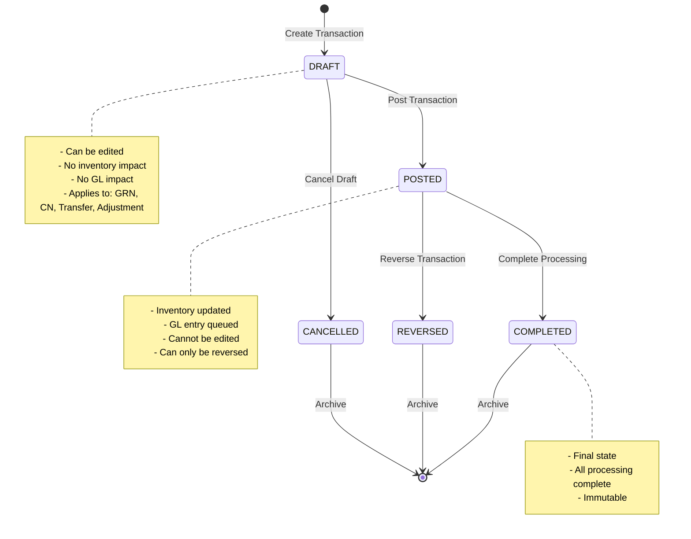
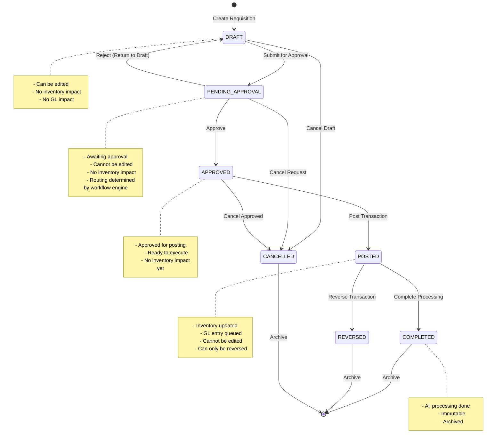
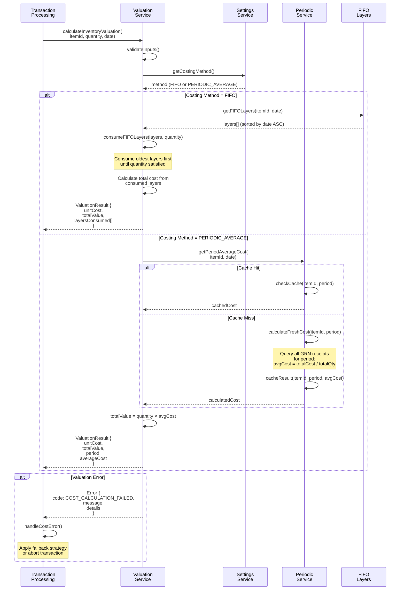
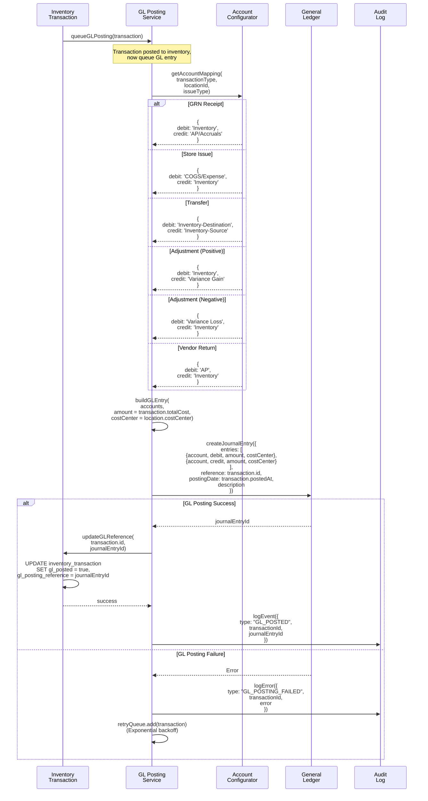

# Flow Diagrams: Inventory Transactions

## Document Information
- **Module**: Inventory Management
- **Sub-Module**: Inventory Transactions
- **Document Type**: Flow Diagrams (FD)
- **Version**: 1.0.0
- **Last Updated**: 2025-11-02
- **Status**: Draft

## Purpose

This document provides visual representations of inventory transaction processing workflows, including:
- Transaction creation and approval flows
- Physical inventory movement processes
- Integration with inventory valuation service
- General ledger posting sequences
- Error handling and reversal procedures

**Related Documents**:
- [System Method](./SM-inventory-transactions.md)
- [Data Definition](./DD-inventory-transactions.md)
- [Business Requirements](./BR-inventory-transactions.md)

## Document History

| Version | Date | Author | Changes |
|---------|------|--------|---------|
| 1.1.0 | 2025-12-10 | Documentation Team | Standardized reference number format (XXX-YYMM-NNNN) |
| 1.0.0 | 2025-11-19 | Documentation Team | Initial version |
---

## Diagram Index

### Core Transaction Flows
1. [Transaction Lifecycle State Machine](#1-transaction-lifecycle-state-machine)
2. [GRN (Goods Receipt) Posting Flow](#2-grn-goods-receipt-posting-flow)
3. [Store Requisition (Issue) Flow](#3-store-requisition-issue-flow)
4. [Stock Transfer Flow](#4-stock-transfer-flow)
5. [Stock Adjustment Flow](#5-stock-adjustment-flow)
6. [Vendor Return Flow](#6-vendor-return-flow)

### Integration Flows
7. [Valuation Service Integration](#7-valuation-service-integration)
8. [FIFO Layer Consumption (FIFO Method)](#8-fifo-layer-consumption-fifo-method)
9. [Periodic Average Cost Retrieval](#9-periodic-average-cost-retrieval)
10. [General Ledger Posting Sequence](#10-general-ledger-posting-sequence)

### Supporting Flows
11. [Transaction Reversal Process](#11-transaction-reversal-process)
12. [Inventory Balance Update Flow](#12-inventory-balance-update-flow)
13. [Stock Allocation Management](#13-stock-allocation-management)
14. [Concurrent Transaction Handling](#14-concurrent-transaction-handling)

---

## 1. Transaction Lifecycle State Machine

This section shows the two different transaction lifecycle flows based on whether the transaction type requires approval.

### 1.1 Transactions WITHOUT Approval Workflow

**Applies to**: GRN, Vendor Return (CN), Stock Transfer, Stock Adjustment

These transactions can be posted directly from DRAFT status without approval workflow.



**Rationale**:
- **GRN**: Already references an approved purchase order
- **Vendor Return (CN)**: Operational necessity for returning defective/incorrect goods
- **Stock Transfer**: Movement between owned locations
- **Stock Adjustment**: Reconciling physical inventory count

---

### 1.2 Transactions WITH Approval Workflow

**Applies to**: Store Requisition (via workflow engine)



**State Descriptions**:
- **DRAFT**: Initial creation state, fully editable
- **PENDING_APPROVAL**: Submitted for approval, cannot be edited
- **APPROVED**: Approved but not yet posted
- **POSTED**: Inventory and GL updated, immutable
- **COMPLETED**: All post-processing complete
- **REVERSED**: Transaction was reversed (creates offsetting entry)
- **CANCELLED**: Transaction cancelled before posting

---

## 2. GRN (Goods Receipt) Posting Flow

This diagram shows the complete process of posting a Goods Received Note (GRN) including cost layer creation for FIFO method.

```mermaid
flowchart TD
    Start([GRN Created<br>Status: DRAFT]) --> ValidateGRN{Validate GRN<br>Data?}

    ValidateGRN -->|Invalid| ErrorGRN[Error: Validation failed<br>- PO exists?<br>- Items valid?<br>- Quantities positive?]
    ValidateGRN -->|Valid| CheckMethod{Get Costing<br>Method}

    CheckMethod -->|FIFO| CreateLayers['FOR EACH line item:<br>Create FIFO layer:<br>- lot_number<br>- receipt_date<br>- original_quantity<br>- remaining_quantity<br>- unit_cost (from PO)<br>- total_cost']

    CheckMethod -->|PERIODIC_AVERAGE| SkipLayers['Skip layer creation<br>(Periodic uses<br>monthly average)']

    CreateLayers --> CreateTxn['Create Transaction:<br>- transaction_type = GRN<br>- movement_type = IN<br>- quantity<br>- unit_cost (from PO)<br>- total_cost<br>- status = POSTED']

    SkipLayers --> CreateTxn

    CreateTxn --> UpdateBalance['Update Inventory Balance:<br><br>BEGIN TRANSACTION<br><br>UPDATE inventory_status<br>SET quantity_on_hand =<br>    quantity_on_hand + qty<br>WHERE item_id = ?<br>  AND location_id = ?<br>  AND version = currentVersion<br><br>IF affected_rows = 0:<br>  ROLLBACK (concurrency conflict)<br><br>COMMIT']

    UpdateBalance -->|Success| InvalidateCache{Costing<br>Method?}
    UpdateBalance -->|Failure| RetryBalance[Retry with<br>new version]
    RetryBalance --> UpdateBalance

    InvalidateCache -->|PERIODIC_AVERAGE| ClearCache['Invalidate period cost cache:<br><br>DELETE FROM period_cost_cache<br>WHERE item_id = ?<br>  AND period = ?<br><br>(Force recalculation<br>for month)']

    InvalidateCache -->|FIFO| SkipCache['Skip cache invalidation<br>(FIFO doesn't use cache)']

    ClearCache --> PostGL['Queue GL Posting:<br><br>DR: Inventory (totalCost)<br>CR: AP/Accruals (totalCost)<br><br>Cost Center: location.costCenter']
    SkipCache --> PostGL

    PostGL --> AuditLog['Create Audit Entries:<br>- TRANSACTION_CREATED<br>- STATUS_CHANGED (POSTED)<br>- GL_POSTED']

    AuditLog --> Complete([Transaction POSTED<br>Inventory Updated<br>GL Entry Queued])

    style CreateLayers fill:#e1f5ff
    style InvalidateCache fill:#fff4e1
    style UpdateBalance fill:#ffe1e1
    style PostGL fill:#e1ffe1
```

**Key Points**:
- FIFO method creates cost layers at GRN time
- Periodic Average invalidates cache to trigger recalculation
- Optimistic locking prevents concurrent balance conflicts
- GL posting is asynchronous (queued)

---

## 3. Store Requisition (Issue) Flow

This diagram shows the process of issuing inventory from warehouse to store/kitchen, including cost calculation via valuation service.

```mermaid
flowchart TD
    Start([Requisition Created<br>Status: DRAFT]) --> CheckStock{Check Stock<br>Availability}

    CheckStock -->|Insufficient| ErrorStock[Error: Insufficient stock<br>Available: X<br>Required: Y]
    CheckStock -->|Sufficient| Approve{Request<br>Approval?}

    Approve -->|Required| PendingApproval[Status: PENDING_APPROVAL<br>Notify approver]
    Approve -->|Not Required| PostReq

    PendingApproval --> ApprovalDecision{Approval<br>Decision}
    ApprovalDecision -->|Approved| PostReq['Status: APPROVED<br>Ready to post']
    ApprovalDecision -->|Rejected| Rejected[Status: DRAFT<br>Return to requester]

    PostReq --> CallValuation['Call Valuation Service:<br><br>costResult =<br>  valuationService<br>    .calculateInventoryValuation(<br>      itemId,<br>      quantity,<br>      transactionDate<br>    )<br><br>Get: unitCost, totalValue,<br>     layersConsumed (FIFO only)']

    CallValuation --> CheckCostResult{Cost<br>Calculated?}

    CheckCostResult -->|Error| HandleCostError['Log error:<br>- No FIFO layers?<br>- No period cost?<br>- Item configuration?<br><br>Use fallback or abort']

    CheckCostResult -->|Success| CreateIssueTxn['Create Transaction:<br>- transaction_type = ISSUE<br>- movement_type = OUT<br>- quantity<br>- unit_cost (from valuation)<br>- total_cost<br>- layersConsumed (FIFO only)<br>- status = POSTED']

    CreateIssueTxn --> UpdateFIFO{Costing<br>Method?}

    UpdateFIFO -->|FIFO| ConsumeLayers['FOR EACH layer consumed:<br><br>UPDATE fifo_layers<br>SET remaining_quantity =<br>    remaining_quantity - consumedQty<br>WHERE id = layerId<br><br>INSERT INTO fifo_consumption<br>VALUES (txnId, layerId,<br>        consumedQty, unitCost)']

    UpdateFIFO -->|PERIODIC_AVERAGE| SkipLayers['Skip layer consumption<br>(Periodic uses<br>cached average cost)']

    ConsumeLayers --> ReduceBalance
    SkipLayers --> ReduceBalance

    ReduceBalance['Update Inventory Balance:<br><br>UPDATE inventory_status<br>SET quantity_on_hand =<br>    quantity_on_hand - qty,<br>    quantity_allocated =<br>    quantity_allocated - allocatedQty<br>WHERE item_id = ?<br>  AND location_id = ?<br>  AND version = currentVersion<br><br>Check: quantity_on_hand >= 0']

    ReduceBalance --> PostCOGS['Queue GL Posting:<br><br>DR: COGS/Expense (totalCost)<br>CR: Inventory (totalCost)<br><br>Expense account based on<br>issue type (usage/production/waste)']

    PostCOGS --> ReleaseAllocation['Release Stock Allocation:<br><br>UPDATE stock_allocation<br>SET status = 'FULFILLED'<br>WHERE source_id = requisitionId']

    ReleaseAllocation --> AuditLog['Create Audit Entries:<br>- TRANSACTION_CREATED<br>- STATUS_CHANGED (POSTED)<br>- GL_POSTED']

    AuditLog --> Complete([Requisition POSTED<br>Inventory Reduced<br>COGS Recorded])

    style CallValuation fill:#e1f5ff
    style ConsumeLayers fill:#fff4e1
    style ReduceBalance fill:#ffe1e1
    style PostCOGS fill:#e1ffe1
```

**Key Points**:
- Valuation service calculates cost (different logic for FIFO vs Periodic Average)
- FIFO consumes oldest layers first
- Periodic Average uses cached monthly average cost
- Stock allocation released on posting
- GL posts to COGS/Expense accounts

---

## 4. Stock Transfer Flow

This diagram shows the process of transferring inventory between locations, including two-transaction approach (OUT at source, IN at destination).

```mermaid
flowchart TD
    Start([Transfer Request<br>Created]) --> ValidateTransfer{Validate<br>Transfer?}

    ValidateTransfer -->|Invalid| ErrorValidation[Error:<br>- Locations same?<br>- Stock available?<br>- Item allowed at destination?]

    ValidateTransfer -->|Valid| CheckStock{Check Source<br>Stock}

    CheckStock -->|Insufficient| ErrorStock[Error: Insufficient stock<br>at source location]

    CheckStock -->|Sufficient| GetCost['Call Valuation Service<br>for source location:<br><br>costResult =<br>  valuationService<br>    .calculateInventoryValuation(<br>      itemId,<br>      quantity,<br>      transferDate,<br>      sourceLocationId<br>    )']

    GetCost --> StartTxn[BEGIN TRANSACTION]

    StartTxn --> CreateOUT['Create OUT Transaction:<br>- transaction_type = TRANSFER<br>- movement_type = OUT<br>- location_id = sourceLocation<br>- quantity<br>- unit_cost (from valuation)<br>- reference_txn_id = inTransactionId<br>- status = POSTED']

    CreateOUT --> CreateIN['Create IN Transaction:<br>- transaction_type = TRANSFER<br>- movement_type = IN<br>- location_id = destinationLocation<br>- quantity (same)<br>- unit_cost (same as OUT)<br>- reference_txn_id = outTransactionId<br>- status = POSTED']

    CreateIN --> UpdateSourceBalance['Update Source Balance:<br><br>UPDATE inventory_status<br>SET quantity_on_hand =<br>    quantity_on_hand - qty,<br>    quantity_in_transit =<br>    quantity_in_transit + qty<br>WHERE item_id = ?<br>  AND location_id = source<br>  AND version = currentVersion']

    UpdateSourceBalance --> UpdateDestBalance['Update Destination Balance:<br><br>UPSERT inventory_status<br>SET quantity_on_hand =<br>    quantity_on_hand + qty,<br>    quantity_in_transit =<br>    quantity_in_transit - qty<br>WHERE item_id = ?<br>  AND location_id = destination<br>  AND version = currentVersion<br><br>(Create record if not exists)']

    UpdateDestBalance --> UpdateFIFO{Transfer FIFO<br>Layers?}

    UpdateFIFO -->|Yes (FIFO)| TransferLayers['Transfer layer ownership:<br><br>UPDATE fifo_layers<br>SET location_id = destinationId<br>WHERE id IN (consumedLayerIds)<br><br>OR<br><br>Create new layers at destination<br>with same costs']

    UpdateFIFO -->|No (Periodic)| SkipLayers['Skip layer transfer<br>(Periodic uses<br>period averages)']

    TransferLayers --> PostGLTransfer
    SkipLayers --> PostGLTransfer

    PostGLTransfer['Queue GL Posting:<br><br>DR: Inventory-Destination<br>CR: Inventory-Source<br>(Both at same cost)<br><br>Cost centers per location']

    PostGLTransfer --> CommitTxn[COMMIT TRANSACTION]

    CommitTxn --> AuditLog['Create Audit Entries:<br>- TRANSACTION_CREATED (OUT)<br>- TRANSACTION_CREATED (IN)<br>- STATUS_CHANGED (both POSTED)<br>- GL_POSTED']

    AuditLog --> Complete([Transfer POSTED<br>2 Transactions Created<br>Balances Updated])

    style GetCost fill:#e1f5ff
    style UpdateSourceBalance fill:#ffe1e1
    style UpdateDestBalance fill:#ffe1e1
    style PostGLTransfer fill:#e1ffe1
```

**Key Points**:
- Transfer creates TWO linked transactions (OUT and IN)
- Both use same cost (no profit/loss on transfer)
- Cost determined at source location using valuation service
- FIFO layers can be transferred or recreated at destination
- Single database transaction ensures atomicity

---

## 5. Stock Adjustment Flow

This diagram shows the process of reconciling physical inventory counts with system balances.

```mermaid
flowchart TD
    Start([Physical Count<br>Performed]) --> CompareCount['Compare Physical vs System:<br><br>variance =<br>  physicalCount -<br>  systemBalance']

    CompareCount --> CheckVariance{Variance<br>Exists?}

    CheckVariance -->|No Variance| NoAdjustment[No adjustment needed<br>Counts match]

    CheckVariance -->|Positive Variance<br>Physical > System| AdjustIN['Adjustment Type: IN<br><br>Need to increase<br>system balance']

    CheckVariance -->|Negative Variance<br>Physical < System| AdjustOUT['Adjustment Type: OUT<br><br>Need to decrease<br>system balance']

    AdjustIN --> GetCostIN{Get Cost for<br>Positive Adj}

    GetCostIN --> UseCost['Use:<br>- Latest purchase price, OR<br>- Standard cost, OR<br>- Previous period avg cost<br><br>(Configured per item)']

    UseCost --> CreateINTxn['Create IN Transaction:<br>- transaction_type = ADJUST<br>- movement_type = IN<br>- quantity = variance<br>- unit_cost (determined above)<br>- total_cost<br>- status = POSTED']

    CreateINTxn --> IncreaseBalance

    AdjustOUT --> CallValuationOUT['Call Valuation Service:<br><br>costResult =<br>  valuationService<br>    .calculateInventoryValuation(<br>      itemId,<br>      abs(variance),<br>      adjustmentDate<br>    )<br><br>(Use FIFO or Periodic cost)']

    CallValuationOUT --> CreateOUTTxn['Create OUT Transaction:<br>- transaction_type = ADJUST<br>- movement_type = OUT<br>- quantity = abs(variance)<br>- unit_cost (from valuation)<br>- total_cost<br>- layersConsumed (FIFO only)<br>- status = POSTED']

    CreateOUTTxn --> UpdateLayersOUT{FIFO<br>Method?}

    UpdateLayersOUT -->|Yes| ConsumeLayersAdj['Consume FIFO layers<br>(oldest first)']
    UpdateLayersOUT -->|No| SkipLayersAdj['Skip layer consumption']

    ConsumeLayersAdj --> DecreaseBalance
    SkipLayersAdj --> DecreaseBalance

    IncreaseBalance['Update Balance UP:<br><br>UPDATE inventory_status<br>SET quantity_on_hand =<br>    quantity_on_hand + variance']

    DecreaseBalance['Update Balance DOWN:<br><br>UPDATE inventory_status<br>SET quantity_on_hand =<br>    quantity_on_hand - variance']

    IncreaseBalance --> PostGLAdj
    DecreaseBalance --> PostGLAdj

    PostGLAdj['Queue GL Posting:<br><br>Positive Variance:<br>  DR: Inventory<br>  CR: Variance Gain Account<br><br>Negative Variance:<br>  DR: Variance Loss Account<br>  CR: Inventory']

    PostGLAdj --> UpdateCountDate['Update Count Date:<br><br>UPDATE inventory_status<br>SET last_count_date = today']

    UpdateCountDate --> AuditLog['Create Audit Entries:<br>- TRANSACTION_CREATED<br>- Variance reason logged<br>- Count details recorded']

    AuditLog --> Complete([Adjustment POSTED<br>Balance Reconciled<br>Variance Accounted])

    style CallValuationOUT fill:#e1f5ff
    style GetCostIN fill:#fff4e1
    style PostGLAdj fill:#e1ffe1
```

**Key Points**:
- Positive variance (found more than expected) uses latest purchase price or standard cost
- Negative variance (found less than expected) uses valuation service (FIFO/Periodic)
- Variance accounts capture gains/losses in GL
- Count date tracked for audit compliance

---

## 6. Vendor Return Flow

This diagram shows the process of returning goods to vendor and creating credit note.

```mermaid
flowchart TD
    Start([Return Request<br>Created]) --> SelectItems['Select items to return:<br>- Reference original GRN<br>- Select quantities<br>- Specify reason']

    SelectItems --> GetOriginalCost{Return<br>Costing<br>Method?}

    GetOriginalCost -->|Same GRN/Lot| UseGRNCost['Use Original GRN Cost:<br><br>SELECT unit_cost<br>FROM inventory_transaction<br>WHERE transaction_type = 'GRN'<br>  AND source_document_id = originalGRN<br>  AND item_id = ?']

    GetOriginalCost -->|Different Lot<br>or Method| UseValuation['Call Valuation Service:<br><br>costResult =<br>  valuationService<br>    .calculateInventoryValuation(<br>      itemId,<br>      returnQuantity,<br>      returnDate<br>    )']

    UseGRNCost --> CreateReturnTxn
    UseValuation --> CreateReturnTxn

    CreateReturnTxn['Create RETURN Transaction:<br>- transaction_type = RETURN<br>- movement_type = OUT<br>- quantity<br>- unit_cost (from above)<br>- total_cost<br>- source_document = creditNoteId<br>- status = POSTED']

    CreateReturnTxn --> UpdateLayersReturn{FIFO<br>Method?}

    UpdateLayersReturn -->|Yes| ReverseLayers['Reverse FIFO layers:<br><br>IF returning from same lot:<br>  Increase layer remaining_qty<br>ELSE:<br>  Consume layers as normal OUT']

    UpdateLayersReturn -->|No| SkipLayersReturn['Skip layer reversal<br>(Periodic uses avg cost)']

    ReverseLayers --> ReduceInventory
    SkipLayersReturn --> ReduceInventory

    ReduceInventory['Update Inventory Balance:<br><br>UPDATE inventory_status<br>SET quantity_on_hand =<br>    quantity_on_hand - qty<br>WHERE item_id = ?<br>  AND location_id = ?']

    ReduceInventory --> CreateCreditNote['Create Vendor Credit Note:<br>- Vendor ID<br>- Credit amount = total_cost<br>- Reference original GRN<br>- Return reason']

    CreateCreditNote --> PostGLReturn['Queue GL Posting:<br><br>DR: Accounts Payable (totalCost)<br>CR: Inventory (totalCost)<br><br>Reduces vendor liability']

    PostGLReturn --> AuditLog['Create Audit Entries:<br>- TRANSACTION_CREATED<br>- CREDIT_NOTE_CREATED<br>- GL_POSTED<br>- Return reason logged']

    AuditLog --> Complete([Return POSTED<br>Inventory Reduced<br>Credit Note Created])

    style UseValuation fill:#e1f5ff
    style CreateCreditNote fill:#fff4e1
    style PostGLReturn fill:#e1ffe1
```

**Key Points**:
- Prefer using original GRN cost when returning same lot
- Fall back to valuation service for different lots
- FIFO layers can be reversed if returning from same receipt
- Credit note created for vendor
- GL reduces AP and Inventory

---

## 7. Valuation Service Integration

This diagram shows the detailed integration between transaction processing and the centralized inventory valuation service.



**Key Points**:
- Valuation service encapsulates costing logic
- Transaction processing doesn't need to know costing method
- FIFO returns layer consumption details
- Periodic Average uses caching for performance
- Clear error handling with fallback options

---

## 8. FIFO Layer Consumption (FIFO Method)

This diagram shows the detailed algorithm for consuming FIFO layers when using FIFO costing method.

```mermaid
flowchart TD
    Start([Request FIFO<br>Valuation]) --> GetLayers['Query available layers:<br><br>SELECT *<br>FROM fifo_layers<br>WHERE item_id = ?<br>  AND location_id = ?<br>  AND remaining_quantity > 0<br>  AND receipt_date <= ?<br>ORDER BY receipt_date ASC,<br>         lot_number ASC']

    GetLayers --> CheckLayers{Layers<br>Found?}

    CheckLayers -->|No| ErrorNoLayers[Error:<br>NO_LAYERS_AVAILABLE]

    CheckLayers -->|Yes| InitVars['Initialize:<br>remainingQty = requiredQty<br>totalCost = 0<br>consumedLayers = []']

    InitVars --> LoopStart{More layers<br>AND<br>remainingQty > 0?}

    LoopStart -->|No| CheckSatisfied

    LoopStart -->|Yes| GetNextLayer['currentLayer = layers[i]']

    GetNextLayer --> CalcConsume['consumeQty = MIN(<br>  currentLayer.remainingQuantity,<br>  remainingQty<br>)']

    CalcConsume --> CalcCost['layerCost =<br>  consumeQty × currentLayer.unitCost']

    CalcCost --> RecordConsumption['Record consumption:<br><br>consumedLayers.push({<br>  layerId: currentLayer.id,<br>  lotNumber: currentLayer.lotNumber,<br>  quantityConsumed: consumeQty,<br>  unitCost: currentLayer.unitCost,<br>  totalCost: layerCost,<br>  receiptDate: currentLayer.receiptDate<br>})']

    RecordConsumption --> AccumulateCost['totalCost += layerCost']

    AccumulateCost --> ReduceRemaining['remainingQty -= consumeQty']

    ReduceRemaining --> UpdateLayer['UPDATE fifo_layers<br>SET remaining_quantity =<br>    remaining_quantity - consumeQty<br>WHERE id = currentLayer.id']

    UpdateLayer --> LoopStart

    CheckSatisfied{remainingQty<br>== 0?}

    CheckSatisfied -->|No| ErrorInsufficient['Error:<br>INSUFFICIENT_QUANTITY<br><br>Required: requiredQty<br>Available: requiredQty - remainingQty']

    CheckSatisfied -->|Yes| CalcUnit['Calculate unit cost:<br><br>unitCost = totalCost / requiredQty']

    CalcUnit --> ReturnResult['Return ValuationResult:<br>- unitCost (weighted avg of layers)<br>- totalValue (totalCost)<br>- layersConsumed[] (for audit)']

    ReturnResult --> End([FIFO Valuation<br>Complete])

    style GetLayers fill:#e1f5ff
    style RecordConsumption fill:#fff4e1
    style UpdateLayer fill:#ffe1e1
    style ReturnResult fill:#e1ffe1
```

**Key Points**:
- Layers consumed in strict chronological order (oldest first)
- Partial layer consumption supported
- Layer remaining quantity decremented atomically
- Weighted average unit cost returned
- Complete audit trail of layer consumption

---

## 9. Periodic Average Cost Retrieval

This diagram shows the process of retrieving or calculating periodic average cost for a transaction.

```mermaid
flowchart TD
    Start([Request Periodic<br>Average Cost]) --> NormalizePeriod['Normalize period to 1st of month:<br><br>periodStart = new Date(<br>  date.getFullYear(),<br>  date.getMonth(),<br>  1<br>)']

    NormalizePeriod --> CheckCache['Check cache:<br><br>SELECT average_cost<br>FROM period_cost_cache<br>WHERE item_id = ?<br>  AND period = periodStart']

    CheckCache --> CacheResult{Cache<br>Found?}

    CacheResult -->|Hit| ValidateCache{Cache<br>Still Valid?}

    ValidateCache -->|Valid| UseCached['Use cached cost:<br><br>averageCost = cache.average_cost']

    ValidateCache -->|Invalidated| CalculateFresh

    CacheResult -->|Miss| CalculateFresh['Calculate fresh:<br><br>Query receipts for period:']

    CalculateFresh --> QueryReceipts['SELECT<br>  SUM(quantity) as totalQty,<br>  SUM(total_cost) as totalCost,<br>  COUNT(*) as receiptCount<br>FROM inventory_transaction<br>WHERE item_id = ?<br>  AND transaction_type = 'GRN'<br>  AND DATE_TRUNC('month',<br>      transaction_date) = periodStart<br>  AND status = 'POSTED'']

    QueryReceipts --> CheckReceipts{Receipts<br>Found?}

    CheckReceipts -->|No| TryFallback['Try fallback strategy:<br><br>1. Previous month cost<br>2. Standard cost<br>3. Latest purchase price']

    TryFallback --> FallbackResult{Fallback<br>Found?}

    FallbackResult -->|No| ErrorNoCost[Error:<br>NO_COST_AVAILABLE<br>for period]

    FallbackResult -->|Yes| UseFallback['Use fallback cost<br>(Log warning)']

    CheckReceipts -->|Yes| CalcAverage['Calculate average:<br><br>averageCost =<br>  totalCost / totalQty']

    CalcAverage --> StoreCache['Store in cache:<br><br>INSERT INTO period_cost_cache<br>VALUES (<br>  item_id,<br>  periodStart,<br>  averageCost,<br>  totalQty,<br>  totalCost,<br>  receiptCount,<br>  NOW()<br>)']

    StoreCache --> UseCached
    UseFallback --> ReturnCost

    UseCached --> ReturnCost['Return ValuationResult:<br>- unitCost = averageCost<br>- totalValue = quantity × averageCost<br>- period = periodStart<br>- averageCost (for reference)']

    ReturnCost --> End([Periodic Average<br>Cost Retrieved])

    style CheckCache fill:#e1f5ff
    style QueryReceipts fill:#fff4e1
    style CalcAverage fill:#ffe1e1
    style StoreCache fill:#e1ffe1
```

**Key Points**:
- Period always normalized to 1st day of month
- Cache checked first for performance
- Fresh calculation queries all GRN receipts for period
- Fallback strategies handle edge cases (no receipts in period)
- Cache stored for reuse by other transactions

---

## 10. General Ledger Posting Sequence

This diagram shows the complete sequence of posting inventory transactions to the general ledger.



**Key Points**:
- GL posting is asynchronous (queued after inventory update)
- Account mapping varies by transaction type and configuration
- Amount always equals transaction.totalCost
- Cost center from location configuration
- Retry logic for GL failures (doesn't rollback inventory)
- Complete audit trail of GL integration

---

## 11. Transaction Reversal Process

This diagram shows the process of reversing a posted transaction (corrections, errors, returns).

```mermaid
flowchart TD
    Start([Reversal Request<br>for Posted Transaction]) --> ValidateReversal{Can Reverse?}

    ValidateReversal -->|Status not POSTED| ErrorNotPosted[Error:<br>Can only reverse<br>POSTED transactions]

    ValidateReversal -->|Already reversed| ErrorAlreadyReversed[Error:<br>Transaction already reversed]

    ValidateReversal -->|OK| RequireReason{Reversal<br>Reason<br>Provided?}

    RequireReason -->|No| ErrorNoReason[Error:<br>Reversal reason required<br>for audit compliance]

    RequireReason -->|Yes| CheckPerms{User has<br>Reversal<br>Permission?}

    CheckPerms -->|No| ErrorPerms[Error:<br>Insufficient permissions<br>Requires: InventoryManager]

    CheckPerms -->|Yes| GetOriginal['Load original transaction:<br>- transaction details<br>- costs<br>- layers (if FIFO)<br>- GL reference']

    GetOriginal --> StartReversal[BEGIN TRANSACTION]

    StartReversal --> CreateReversalTxn['Create reversal transaction:<br>- Copy all original fields<br>- Negate quantity and costs<br>- reference_transaction_id = originalId<br>- status = POSTED<br>- reversal_reason']

    CreateReversalTxn --> ReverseMovement{Original<br>Movement?}

    ReverseMovement -->|IN| CreateOUTReversal['Reversal:<br>- movement_type = OUT<br>- Reduces inventory']

    ReverseMovement -->|OUT| CreateINReversal['Reversal:<br>- movement_type = IN<br>- Increases inventory']

    ReverseMovement -->|TRANSFER| CreateTransferReversal['Reversal:<br>- Create 2 reversals<br>- Reverse both OUT and IN']

    CreateOUTReversal --> UpdateBalanceRev
    CreateINReversal --> UpdateBalanceRev
    CreateTransferReversal --> UpdateBalanceRev

    UpdateBalanceRev['Update inventory balance:<br>(Opposite of original)<br><br>IF original was IN:<br>  Decrease balance<br>ELSE IF original was OUT:<br>  Increase balance']

    UpdateBalanceRev --> ReverseFIFO{Original<br>Used FIFO?}

    ReverseFIFO -->|Yes + IN original| RestoreLayers['Restore consumed layers:<br><br>FOR EACH originalLayerConsumption:<br>  UPDATE fifo_layers<br>  SET remaining_quantity =<br>      remaining_quantity + consumedQty']

    ReverseFIFO -->|Yes + OUT original| CreateNegativeLayers['Create negative layer entry<br>OR<br>Adjust latest layer']

    ReverseFIFO -->|No (Periodic)| SkipLayerReversal['Skip layer adjustments<br>(Periodic doesn't use layers)']

    RestoreLayers --> ReverseGL
    CreateNegativeLayers --> ReverseGL
    SkipLayerReversal --> ReverseGL

    ReverseGL['Create reversing GL entry:<br><br>Reverse original entry:<br>- Debit ↔ Credit<br>- Same accounts<br>- Same amount<br>- Reference: original + reversal']

    ReverseGL --> UpdateOriginal['Update original transaction:<br><br>UPDATE inventory_transaction<br>SET reversed_by = reversalTxnId,<br>    reversal_date = NOW(),<br>    reversal_reason = reason,<br>    status = 'REVERSED'<br>WHERE id = originalId']

    UpdateOriginal --> CommitReversal[COMMIT TRANSACTION]

    CommitReversal --> AuditLog['Create audit entries:<br>- TRANSACTION_REVERSED (original)<br>- TRANSACTION_CREATED (reversal)<br>- STATUS_CHANGED<br>- Reversal reason<br>- GL entries']

    AuditLog --> NotifyUsers['Notify stakeholders:<br>- Transaction creator<br>- Approvers<br>- Finance team<br>- Warehouse manager']

    NotifyUsers --> Complete([Reversal Complete<br>Original: REVERSED<br>New reversal: POSTED])

    style GetOriginal fill:#e1f5ff
    style UpdateBalanceRev fill:#ffe1e1
    style ReverseGL fill:#e1ffe1
```

**Key Points**:
- Only POSTED transactions can be reversed
- Reversal reason required for audit compliance
- Permission check for reversal authority
- Creates new transaction with negated values
- Inventory and GL both reversed
- FIFO layers restored if applicable
- Complete audit trail maintained

---

## 12. Inventory Balance Update Flow

This diagram shows the atomic process of updating inventory balances with concurrent access handling.

```mermaid
flowchart TD
    Start([Transaction Ready<br>to Update Balance]) --> DetermineChange{Movement<br>Type?}

    DetermineChange -->|IN| CalcIncrease['Delta = +quantity<br>(Increase balance)']
    DetermineChange -->|OUT| CalcDecrease['Delta = -quantity<br>(Decrease balance)']
    DetermineChange -->|TRANSFER| HandleTransfer['Handle as 2 updates:<br>- Decrease source<br>- Increase destination']

    CalcIncrease --> CheckExists
    CalcDecrease --> CheckExists
    HandleTransfer --> CheckExists

    CheckExists['Check if balance record exists:<br><br>SELECT id, version<br>FROM inventory_status<br>WHERE item_id = ?<br>  AND location_id = ?']

    CheckExists --> RecordExists{Record<br>Exists?}

    RecordExists -->|No| CreateRecord['Create new record:<br><br>INSERT INTO inventory_status<br>VALUES (<br>  item_id,<br>  location_id,<br>  quantity_on_hand = delta,<br>  quantity_allocated = 0,<br>  quantity_available = delta,<br>  version = 1,<br>  last_transaction_id,<br>  last_transaction_date<br>)']

    CreateRecord --> Success

    RecordExists -->|Yes| LoadCurrent['Load current values:<br>- current_quantity<br>- current_version']

    LoadCurrent --> ValidateDelta{Will Update<br>be Valid?}

    ValidateDelta -->|new_qty < 0| CheckBackorder{Backorder<br>Allowed?}

    CheckBackorder -->|No| ErrorNegative[Error:<br>NEGATIVE_INVENTORY_NOT_ALLOWED<br>Current: X<br>Requested: Y]

    CheckBackorder -->|Yes| AllowNegative['Log warning:<br>Negative inventory<br>allowed for item']

    ValidateDelta -->|new_qty >= 0| AllowNegative
    AllowNegative --> AttemptUpdate

    AttemptUpdate['Atomic update with version check:<br><br>UPDATE inventory_status<br>SET quantity_on_hand =<br>      quantity_on_hand + delta,<br>    quantity_available =<br>      quantity_on_hand + delta<br>      - quantity_allocated,<br>    last_transaction_id = ?,<br>    last_transaction_date = ?,<br>    updated_at = NOW(),<br>    updated_by = ?,<br>    version = version + 1<br>WHERE item_id = ?<br>  AND location_id = ?<br>  AND version = current_version']

    AttemptUpdate --> CheckAffected{Rows<br>Affected?}

    CheckAffected -->|0 rows| ConcurrencyConflict['Concurrency conflict detected!<br>(Version mismatch)']

    ConcurrencyConflict --> RetryLogic{Retry<br>Attempts<br>< Max?}

    RetryLogic -->|Yes| WaitRetry['Wait with exponential backoff:<br>delay = 100ms × 2^attempt']

    WaitRetry --> CheckExists

    RetryLogic -->|No| ErrorConcurrency[Error:<br>CONCURRENCY_CONFLICT<br>Too many retries<br>System under high load]

    CheckAffected -->|1 row| Success['Balance updated successfully:<br>- Quantity adjusted<br>- Available recalculated<br>- Version incremented<br>- Last transaction recorded']

    Success --> VerifyBalance['Verify balance integrity:<br><br>Assert:<br>  quantity_available =<br>    quantity_on_hand -<br>    quantity_allocated']

    VerifyBalance --> LogUpdate['Log balance change:<br>- Old quantity<br>- New quantity<br>- Delta<br>- Transaction reference']

    LogUpdate --> End([Balance Updated<br>Successfully])

    style AttemptUpdate fill:#ffe1e1
    style ConcurrencyConflict fill:#fff4e1
    style Success fill:#e1ffe1
```

**Key Points**:
- Optimistic locking using version field
- Atomic update prevents race conditions
- Automatic retry with exponential backoff
- Negative inventory check (configurable per item)
- quantity_available auto-calculated
- Complete audit trail of changes

---

## 13. Stock Allocation Management

This diagram shows how inventory is allocated for pending orders/requisitions and released upon fulfillment.

```mermaid
flowchart TD
    Start([Order/Requisition<br>Created]) --> CheckAvailability['Check available quantity:<br><br>SELECT quantity_available<br>FROM inventory_status<br>WHERE item_id = ?<br>  AND location_id = ?']

    CheckAvailability --> EnoughStock{Sufficient<br>Stock?}

    EnoughStock -->|No| HandleShortage{Shortage<br>Handling<br>Policy?}

    HandleShortage -->|Backorder| AllowBackorder['Allow backorder:<br>- Create allocation<br>- quantity_available can go negative<br>- Flag as backordered']

    HandleShortage -->|Partial| PartialAllocate['Partial allocation:<br>- Allocate available qty<br>- Remaining qty backordered']

    HandleShortage -->|Reject| ErrorInsufficient[Error:<br>INSUFFICIENT_STOCK<br>Available: X<br>Required: Y]

    EnoughStock -->|Yes| CreateAllocation
    AllowBackorder --> CreateAllocation
    PartialAllocate --> CreateAllocation

    CreateAllocation['Create stock allocation:<br><br>INSERT INTO stock_allocation<br>VALUES (<br>  item_id,<br>  location_id,<br>  allocated_quantity,<br>  source_type (ORDER/REQUISITION),<br>  source_id,<br>  source_number,<br>  required_by_date,<br>  status = 'ACTIVE'<br>)']

    CreateAllocation --> UpdateAllocated['Update inventory status:<br><br>UPDATE inventory_status<br>SET quantity_allocated =<br>      quantity_allocated + allocQty,<br>    quantity_available =<br>      quantity_on_hand - quantity_allocated<br>WHERE item_id = ?<br>  AND location_id = ?']

    UpdateAllocated --> WaitFulfillment['Allocation ACTIVE<br>awaiting fulfillment']

    WaitFulfillment --> FulfillmentEvent{Fulfillment<br>Event?}

    FulfillmentEvent -->|Order Fulfilled| ProcessIssue['Issue goods transaction:<br>- Create OUT transaction<br>- Post to inventory']

    FulfillmentEvent -->|Order Cancelled| CancelAllocation['Cancel allocation:<br>No goods movement']

    FulfillmentEvent -->|Allocation Expired| ExpireAllocation['Allocation expired:<br>(required_by_date passed)']

    ProcessIssue --> ReleaseAllocation
    CancelAllocation --> ReleaseAllocation
    ExpireAllocation --> ReleaseAllocation

    ReleaseAllocation['Release allocation:<br><br>UPDATE stock_allocation<br>SET status = 'FULFILLED'|'CANCELLED'|'EXPIRED'<br>WHERE id = allocationId']

    ReleaseAllocation --> UpdateAvailable['Update inventory status:<br><br>UPDATE inventory_status<br>SET quantity_allocated =<br>      quantity_allocated - allocQty,<br>    quantity_available =<br>      quantity_on_hand - quantity_allocated<br>WHERE item_id = ?<br>  AND location_id = ?']

    UpdateAvailable --> AuditAllocation['Log allocation events:<br>- ALLOCATION_CREATED<br>- ALLOCATION_FULFILLED/CANCELLED<br>- Impact on available quantity']

    AuditAllocation --> End([Allocation Lifecycle<br>Complete])

    style CreateAllocation fill:#e1f5ff
    style UpdateAllocated fill:#ffe1e1
    style ReleaseAllocation fill:#fff4e1
```

**Key Points**:
- Allocation reduces quantity_available
- Supports backorder policies (allow negative available)
- Allocation automatically released on fulfillment
- Expiration handling for stale allocations
- Complete audit trail of allocation lifecycle

---

## 14. Concurrent Transaction Handling

This diagram shows how the system handles multiple simultaneous transactions updating the same inventory item.

```mermaid
sequenceDiagram
    participant T1 as Transaction 1<br>(Issue 50 units)
    participant T2 as Transaction 2<br>(Issue 30 units)
    participant DB as Database
    participant IS as Inventory<br>Status

    Note over IS: Initial State:<br>quantity_on_hand = 100<br>quantity_available = 100<br>version = 5

    par T1 and T2 Read Current State
        T1->>DB: SELECT * FROM inventory_status<br>WHERE item_id = X AND location_id = Y
        DB-->>T1: {qty: 100, version: 5}

        T2->>DB: SELECT * FROM inventory_status<br>WHERE item_id = X AND location_id = Y
        DB-->>T2: {qty: 100, version: 5}
    end

    Note over T1,T2: Both transactions see<br>same initial state

    T1->>T1: Calculate: new_qty = 100 - 50 = 50
    T2->>T2: Calculate: new_qty = 100 - 30 = 70

    T1->>DB: UPDATE inventory_status<br>SET quantity_on_hand = 50,<br>    version = 6<br>WHERE item_id = X<br>  AND version = 5

    DB-->>T1: 1 row affected ✓
    Note over DB,IS: State now:<br>quantity = 50<br>version = 6

    T2->>DB: UPDATE inventory_status<br>SET quantity_on_hand = 70,<br>    version = 6<br>WHERE item_id = X<br>  AND version = 5

    DB-->>T2: 0 rows affected ✗<br>Version mismatch!

    T2->>T2: Detect concurrency conflict<br>Attempt 1 of 3

    T2->>DB: SELECT * FROM inventory_status<br>WHERE item_id = X
    DB-->>T2: {qty: 50, version: 6}<br>(Updated by T1)

    T2->>T2: Recalculate:<br>new_qty = 50 - 30 = 20

    T2->>DB: UPDATE inventory_status<br>SET quantity_on_hand = 20,<br>    version = 7<br>WHERE item_id = X<br>  AND version = 6

    DB-->>T2: 1 row affected ✓
    Note over DB,IS: Final State:<br>quantity = 20<br>version = 7<br>(Both transactions applied correctly)

    Note over T1,T2,DB: System prevented lost update!<br>Final quantity is correct:<br>100 - 50 - 30 = 20
```

**Key Points**:
- Optimistic locking prevents lost updates
- Version field ensures serializability
- Automatic retry on version mismatch
- Exponential backoff prevents thundering herd
- Final state is consistent (no lost updates)

---

## Notation Guide

### Diagram Types Used

**State Diagrams**: Transaction lifecycle and entity states
**Flowcharts**: Step-by-step process flows
**Sequence Diagrams**: Component interactions and timing
**Decision Trees**: Conditional logic and branching

### Color Coding

```mermaid
flowchart LR
    A[Valuation Service<br>Integration]
    B[Cost Calculation<br>Logic]
    C[Database Updates<br>(Critical)]
    D[GL Posting<br>Integration]

    style A fill:#e1f5ff
    style B fill:#fff4e1
    style C fill:#ffe1e1
    style D fill:#e1ffe1
```

- **Blue (#e1f5ff)**: Valuation service integration
- **Yellow (#fff4e1)**: Costing logic and calculations
- **Red (#ffe1e1)**: Database updates (critical operations)
- **Green (#e1ffe1)**: Financial integration (GL posting)

### Common Symbols

- **Rectangle**: Process or action step
- **Diamond**: Decision point or condition
- **Rounded Rectangle**: Start/end points
- **Cylinder**: Database query or update
- **Note**: Additional context or explanation

---

**End of Flow Diagrams Document**

**Note**: These diagrams provide visual representations of workflows described in the System Method (SM) document. For detailed business rules, refer to the SM and Business Requirements (BR) documents.
