# Flow Diagrams: Period End Management

## Document Information
- **Module**: Inventory Management - Period End
- **Component**: Period End Management
- **Version**: 1.1.0
- **Last Updated**: 2025-12-09
- **Status**: Active

## Related Documents
- [Business Requirements](./BR-period-end.md)
- [Use Cases](./UC-period-end.md)
- [Technical Specification](./TS-period-end.md)
- [Data Definition](./DD-period-end.md)
- [Validations](./VAL-period-end.md)

## Document History

| Version | Date | Author | Changes |
|---------|------|--------|---------|
| 1.0.0 | 2025-11-19 | Documentation Team | Initial version |
| 1.1.0 | 2025-12-09 | Development Team | Updated state diagrams with correct status values (open→closing→closed→reopened), updated checklist from 4 to 11 validation items |
---

## 1. Introduction

This document provides comprehensive flow diagrams for the Period End Management sub-module using Mermaid notation. All diagrams show the complete workflow including validation, error handling, and integration points.

### 1.1 Diagram Categories

1. **System Architecture** - High-level system design
2. **Core Workflows** - Main user workflows (create, close, re-open)
3. **State Transitions** - Period and task lifecycle
4. **Integration Workflows** - Module integration points
5. **Error Handling** - Error scenarios and recovery

### 1.2 Notation Conventions

- **Rectangles**: Process steps
- **Diamonds**: Decision points
- **Rounded Rectangles**: Start/End points
- **Cylinders**: Database operations
- **Parallelograms**: Data input/output
- **Colors**: Blue (normal), Yellow (warning), Red (error), Green (success)

---

## 2. System Architecture

### 2.1 Period End System Architecture

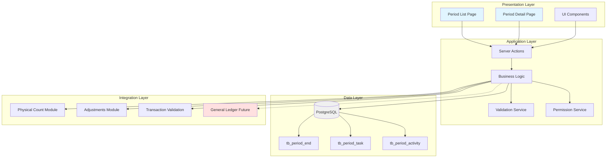
```mermaid
graph TB
    subgraph "Presentation Layer"
        PL[Period List Page]
        PD[Period Detail Page]
        UI[UI Components]
    end

    subgraph "Application Layer"
        SA[Server Actions]
        BL[Business Logic]
        VAL[Validation Service]
        PERM[Permission Service]
    end

    subgraph "Data Layer"
        DB[(PostgreSQL)]
        PE[tb_period_end]
        PT[tb_period_task]
        PA[tb_period_activity]
    end

    subgraph "Integration Layer"
        PC[Physical Count Module]
        ADJ[Adjustments Module]
        TXN[Transaction Validation]
        GL[General Ledger Future]
    end

    PL --> SA
    PD --> SA
    UI --> SA
    SA --> BL
    BL --> VAL
    BL --> PERM
    BL --> DB
    DB --> PE
    DB --> PT
    DB --> PA
    BL --> PC
    BL --> ADJ
    BL --> TXN
    BL -.-> GL

    style PL fill:#e1f5ff
    style PD fill:#e1f5ff
    style DB fill:#f0f0f0
    style GL fill:#ffe0e0
```

### 2.2 Data Flow Architecture

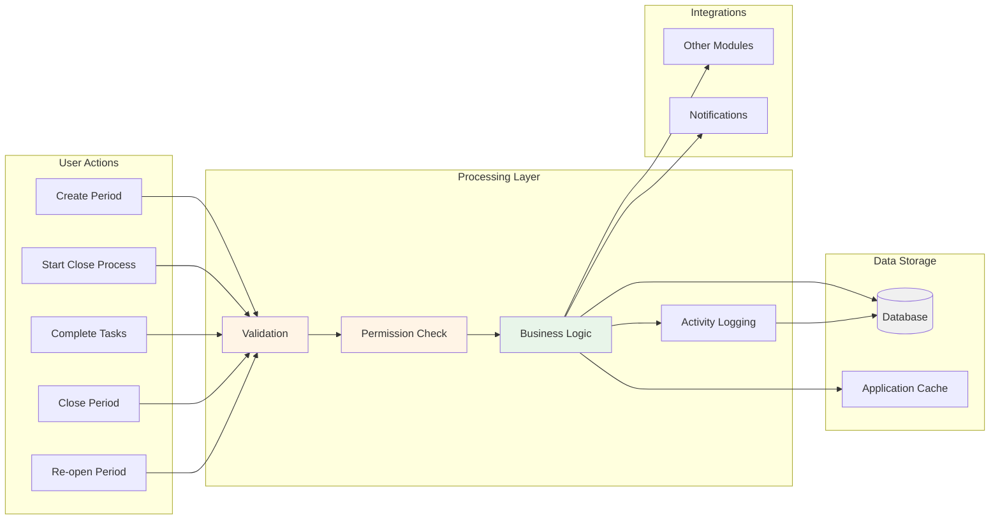
```mermaid
graph LR
    subgraph "User Actions"
        U1[Create Period]
        U2[Start Close Process]
        U3[Complete Tasks]
        U4[Close Period]
        U5[Re-open Period]
    end

    subgraph "Processing Layer"
        V[Validation]
        P[Permission Check]
        BL[Business Logic]
        AL[Activity Logging]
    end

    subgraph "Data Storage"
        DB[(Database)]
        CACHE[Application Cache]
    end

    subgraph "Integrations"
        MOD[Other Modules]
        NOTIF[Notifications]
    end

    U1 --> V
    U2 --> V
    U3 --> V
    U4 --> V
    U5 --> V

    V --> P
    P --> BL
    BL --> DB
    BL --> AL
    BL --> CACHE
    BL --> MOD
    BL --> NOTIF

    AL --> DB

    style V fill:#fff4e6
    style P fill:#fff4e6
    style BL fill:#e8f5e9
    style DB fill:#f0f0f0
```

---

## 3. Core Workflows

### 3.1 Create New Period Workflow

```mermaid
flowchart TD
    Start([User: Create Period]) --> CheckPerm{User Has<br/>Permission?}

    CheckPerm -->|No| ErrorPerm[Error: Insufficient Permissions]
    CheckPerm -->|Yes| CalcNext[Calculate Next Period<br/>ID, Dates, Name]

    CalcNext --> CheckDup{Period ID<br/>Already Exists?}

    CheckDup -->|Yes| ErrorDup[Error: Period Already Exists]
    CheckDup -->|No| CheckPrior{Prior Period<br/>Closed?}

    CheckPrior -->|No| CheckOverride{Admin<br/>Override?}
    CheckOverride -->|No| ErrorPrior[Error: Prior Period Not Closed]
    CheckOverride -->|Yes| ShowDialog
    CheckPrior -->|Yes| ShowDialog[Show Confirmation Dialog<br/>Period ID, Name, Dates]

    ShowDialog --> UserConfirm{User<br/>Confirms?}

    UserConfirm -->|No| Cancel[Cancel Operation]
    UserConfirm -->|Yes| BeginTx[Begin Transaction]

    BeginTx --> CreatePeriod[(Create tb_period_end Record<br/>Status: Open)]

    CreatePeriod --> CreateTasks[(Create 11 Validation Items:<br/>Inventory counts, Movements,<br/>Adjustments, Returns, Costing,<br/>GL entries, Allocations,<br/>Variance, Audit, Reports,<br/>Management approval)]

    CreateTasks --> LogActivity[(Log Activity:<br/>Action: Create<br/>User, IP, Timestamp)]

    Note over CreateTasks: Creates 11 default<br/>validation items

    LogActivity --> CommitTx[Commit Transaction]

    CommitTx --> RefreshCache[Refresh Period Cache]

    RefreshCache --> Navigate[Navigate to Period Detail]

    Navigate --> Success([Success: Period Created])

    ErrorPerm --> End([End])
    ErrorDup --> End
    ErrorPrior --> End
    Cancel --> End

    style Start fill:#e8f5e9
    style Success fill:#e8f5e9
    style ErrorPerm fill:#ffebee
    style ErrorDup fill:#ffebee
    style ErrorPrior fill:#ffebee
    style CreatePeriod fill:#e3f2fd
    style CreateTasks fill:#e3f2fd
    style LogActivity fill:#fff4e6
```

### 3.2 Period Closure Workflow (As Implemented)

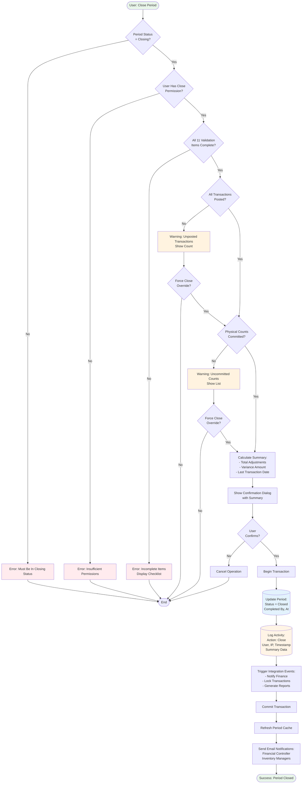
```mermaid
flowchart TD
    Start([User: Close Period]) --> CheckStatus{Period Status<br/>= Closing?}

    CheckStatus -->|No| ErrorStatus[Error: Must Be In Closing Status]
    CheckStatus -->|Yes| CheckPerm{User Has Close<br/>Permission?}

    CheckPerm -->|No| ErrorPerm[Error: Insufficient Permissions]
    CheckPerm -->|Yes| ValidateTasks{All 11 Validation<br/>Items Complete?}

    ValidateTasks -->|No| ErrorTasks[Error: Incomplete Items<br/>Display Checklist]
    ValidateTasks -->|Yes| ValidateTxn{All Transactions<br/>Posted?}

    ValidateTxn -->|No| ErrorTxn[Warning: Unposted Transactions<br/>Show Count]
    ValidateTxn -->|Yes| ValidatePC{Physical Counts<br/>Committed?}

    ValidatePC -->|No| ErrorPC[Warning: Uncommitted Counts<br/>Show List]
    ValidatePC -->|Yes| CalcSummary[Calculate Summary:<br/>- Total Adjustments<br/>- Variance Amount<br/>- Last Transaction Date]

    CalcSummary --> ShowDialog[Show Confirmation Dialog<br/>with Summary]

    ShowDialog --> UserConfirm{User<br/>Confirms?}

    UserConfirm -->|No| Cancel[Cancel Operation]
    UserConfirm -->|Yes| BeginTx[Begin Transaction]

    BeginTx --> UpdateStatus[(Update Period:<br/>Status = Closed<br/>Completed By, At)]

    UpdateStatus --> LogClose[(Log Activity:<br/>Action: Close<br/>User, IP, Timestamp<br/>Summary Data)]

    LogClose --> TriggerIntegration[Trigger Integration Events:<br/>- Notify Finance<br/>- Lock Transactions<br/>- Generate Reports]

    TriggerIntegration --> CommitTx[Commit Transaction]

    CommitTx --> RefreshCache[Refresh Period Cache]

    RefreshCache --> SendNotif[Send Email Notifications:<br/>Financial Controller<br/>Inventory Managers]

    SendNotif --> Success([Success: Period Closed])

    ErrorStatus --> End([End])
    ErrorPerm --> End
    ErrorTasks --> End
    ErrorTxn --> UserForce{Force Close<br/>Override?}
    UserForce -->|No| End
    UserForce -->|Yes| ValidatePC
    ErrorPC --> UserForce2{Force Close<br/>Override?}
    UserForce2 -->|No| End
    UserForce2 -->|Yes| CalcSummary
    Cancel --> End

    style Start fill:#e8f5e9
    style Success fill:#e8f5e9
    style ErrorStatus fill:#ffebee
    style ErrorPerm fill:#ffebee
    style ErrorTasks fill:#ffebee
    style ErrorTxn fill:#fff3e0
    style ErrorPC fill:#fff3e0
    style UpdateStatus fill:#e3f2fd
    style LogClose fill:#fff4e6
```

### 3.3 Period Re-Open Workflow (As Implemented)

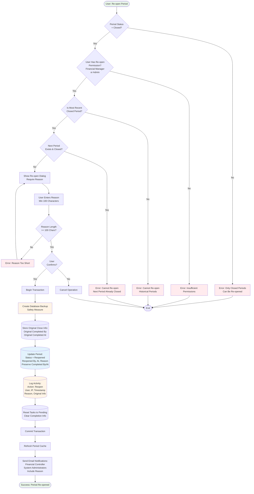
```mermaid
flowchart TD
    Start([User: Re-open Period]) --> CheckStatus{Period Status<br/>= Closed?}

    CheckStatus -->|No| ErrorStatus[Error: Only Closed Periods<br/>Can Be Re-opened]
    CheckStatus -->|Yes| CheckPerm{User Has Re-open<br/>Permission?<br/>Financial Manager<br/>or Admin}

    CheckPerm -->|No| ErrorPerm[Error: Insufficient Permissions]
    CheckPerm -->|Yes| CheckRecent{Is Most Recent<br/>Closed Period?}

    CheckRecent -->|No| ErrorHistorical[Error: Cannot Re-open<br/>Historical Periods]
    CheckRecent -->|Yes| CheckNext{Next Period<br/>Exists & Closed?}

    CheckNext -->|Yes| ErrorNext[Error: Cannot Re-open<br/>Next Period Already Closed]
    CheckNext -->|No| ShowDialog[Show Re-open Dialog<br/>Require Reason]

    ShowDialog --> UserReason[User Enters Reason<br/>Min 100 Characters]

    UserReason --> ValidateReason{Reason Length<br/>>= 100 Chars?}

    ValidateReason -->|No| ErrorReason[Error: Reason Too Short]
    ValidateReason -->|Yes| UserConfirm{User<br/>Confirms?}

    UserConfirm -->|No| Cancel[Cancel Operation]
    UserConfirm -->|Yes| BeginTx[Begin Transaction]

    BeginTx --> Backup[Create Database Backup<br/>Safety Measure]

    Backup --> PreserveOriginal[(Store Original Close Info:<br/>Original Completed By<br/>Original Completed At)]

    PreserveOriginal --> UpdateStatus[(Update Period:<br/>Status = Reopened<br/>Reopened By, At, Reason<br/>Preserve Completed By/At)]

    UpdateStatus --> LogReopen[(Log Activity:<br/>Action: Reopen<br/>User, IP, Timestamp<br/>Reason, Original Info)]

    LogReopen --> ResetTasks[(Reset Tasks to Pending<br/>Clear Completion Info)]

    ResetTasks --> CommitTx[Commit Transaction]

    CommitTx --> RefreshCache[Refresh Period Cache]

    RefreshCache --> SendNotif[Send Email Notifications:<br/>Financial Controller<br/>System Administrators<br/>Include Reason]

    SendNotif --> Success([Success: Period Re-opened])

    ErrorStatus --> End([End])
    ErrorPerm --> End
    ErrorHistorical --> End
    ErrorNext --> End
    ErrorReason --> ShowDialog
    Cancel --> End

    style Start fill:#e8f5e9
    style Success fill:#e8f5e9
    style ErrorStatus fill:#ffebee
    style ErrorPerm fill:#ffebee
    style ErrorHistorical fill:#ffebee
    style ErrorNext fill:#ffebee
    style ErrorReason fill:#ffebee
    style UpdateStatus fill:#e3f2fd
    style LogReopen fill:#fff4e6
    style Backup fill:#fff4e6
```

### 3.4 Task Completion Workflow (As Implemented)

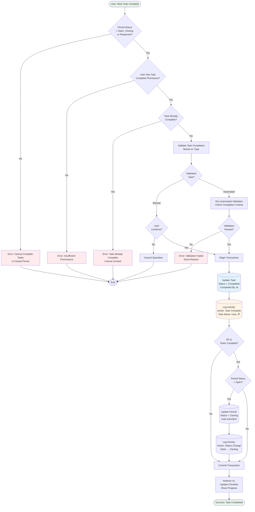
```mermaid
flowchart TD
    Start([User: Mark Task Complete]) --> CheckPeriod{Period Status<br/>= Open, Closing,<br/>or Reopened?}

    CheckPeriod -->|No| ErrorStatus[Error: Cannot Complete Tasks<br/>in Closed Period]
    CheckPeriod -->|Yes| CheckPerm{User Has Task<br/>Complete Permission?}

    CheckPerm -->|No| ErrorPerm[Error: Insufficient Permissions]
    CheckPerm -->|Yes| CheckAlready{Task Already<br/>Complete?}

    CheckAlready -->|Yes| ErrorAlready[Error: Task Already Complete<br/>Cannot Unmark]
    CheckAlready -->|No| Validate[Validate Task Completion<br/>Based on Type]

    Validate --> CheckType{Validation<br/>Type?}

    CheckType -->|Manual| UserConfirm{User<br/>Confirms?}
    CheckType -->|Automated| RunValidation[Run Automated Validation<br/>Check Completion Criteria]

    RunValidation --> AutoResult{Validation<br/>Passed?}

    AutoResult -->|No| ErrorValidation[Error: Validation Failed<br/>Show Reason]
    AutoResult -->|Yes| BeginTx

    UserConfirm -->|No| Cancel[Cancel Operation]
    UserConfirm -->|Yes| BeginTx[Begin Transaction]

    BeginTx --> UpdateTask[(Update Task:<br/>Status = Completed<br/>Completed By, At)]

    UpdateTask --> LogActivity[(Log Activity:<br/>Action: Task Complete<br/>Task Name, User, IP)]

    LogActivity --> CheckAll{All 11<br/>Tasks Complete?}

    CheckAll -->|No| CommitTx[Commit Transaction]
    CheckAll -->|Yes| AutoProgress{Period Status<br/>= Open?}

    AutoProgress -->|Yes| UpdatePeriod[(Update Period:<br/>Status = Closing<br/>Auto-transition)]
    AutoProgress -->|No| CommitTx

    UpdatePeriod --> LogStatus[(Log Activity:<br/>Action: Status Change<br/>Open → Closing)]

    LogStatus --> CommitTx

    CommitTx --> RefreshUI[Refresh UI:<br/>Update Checklist<br/>Show Progress]

    RefreshUI --> Success([Success: Task Completed])

    ErrorStatus --> End([End])
    ErrorPerm --> End
    ErrorAlready --> End
    ErrorValidation --> End
    Cancel --> End

    style Start fill:#e8f5e9
    style Success fill:#e8f5e9
    style ErrorStatus fill:#ffebee
    style ErrorPerm fill:#ffebee
    style ErrorAlready fill:#ffebee
    style ErrorValidation fill:#ffebee
    style UpdateTask fill:#e3f2fd
    style LogActivity fill:#fff4e6
```

### 3.5 Period Cancellation Workflow

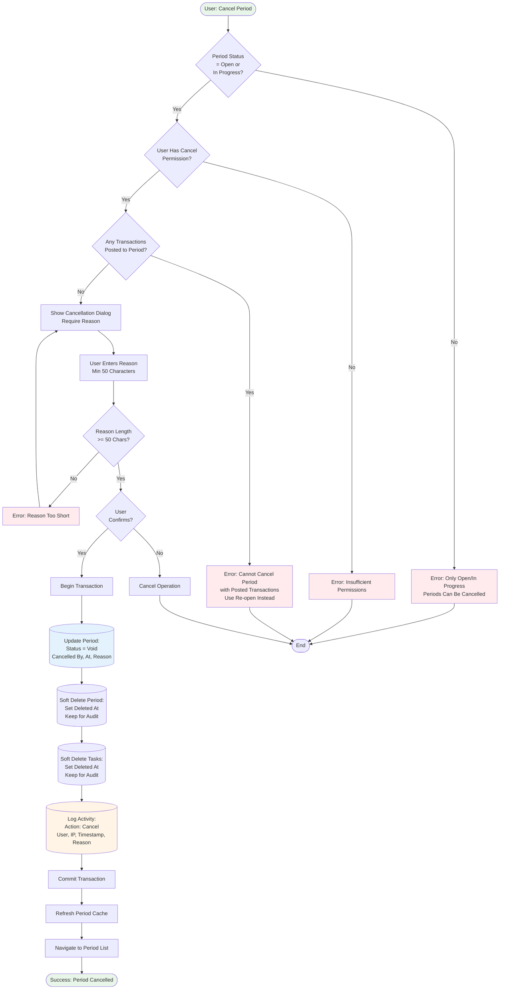
```mermaid
flowchart TD
    Start([User: Cancel Period]) --> CheckStatus{Period Status<br/>= Open or<br/>In Progress?}

    CheckStatus -->|No| ErrorStatus[Error: Only Open/In Progress<br/>Periods Can Be Cancelled]
    CheckStatus -->|Yes| CheckPerm{User Has Cancel<br/>Permission?}

    CheckPerm -->|No| ErrorPerm[Error: Insufficient Permissions]
    CheckPerm -->|Yes| CheckTxn{Any Transactions<br/>Posted to Period?}

    CheckTxn -->|Yes| ErrorTxn[Error: Cannot Cancel Period<br/>with Posted Transactions<br/>Use Re-open Instead]
    CheckTxn -->|No| ShowDialog[Show Cancellation Dialog<br/>Require Reason]

    ShowDialog --> UserReason[User Enters Reason<br/>Min 50 Characters]

    UserReason --> ValidateReason{Reason Length<br/>>= 50 Chars?}

    ValidateReason -->|No| ErrorReason[Error: Reason Too Short]
    ValidateReason -->|Yes| UserConfirm{User<br/>Confirms?}

    UserConfirm -->|No| Cancel[Cancel Operation]
    UserConfirm -->|Yes| BeginTx[Begin Transaction]

    BeginTx --> UpdateStatus[(Update Period:<br/>Status = Void<br/>Cancelled By, At, Reason)]

    UpdateStatus --> SoftDelete[(Soft Delete Period:<br/>Set Deleted At<br/>Keep for Audit)]

    SoftDelete --> SoftDeleteTasks[(Soft Delete Tasks:<br/>Set Deleted At<br/>Keep for Audit)]

    SoftDeleteTasks --> LogActivity[(Log Activity:<br/>Action: Cancel<br/>User, IP, Timestamp, Reason)]

    LogActivity --> CommitTx[Commit Transaction]

    CommitTx --> RefreshCache[Refresh Period Cache]

    RefreshCache --> Navigate[Navigate to Period List]

    Navigate --> Success([Success: Period Cancelled])

    ErrorStatus --> End([End])
    ErrorPerm --> End
    ErrorTxn --> End
    ErrorReason --> ShowDialog
    Cancel --> End

    style Start fill:#e8f5e9
    style Success fill:#e8f5e9
    style ErrorStatus fill:#ffebee
    style ErrorPerm fill:#ffebee
    style ErrorTxn fill:#ffebee
    style ErrorReason fill:#ffebee
    style UpdateStatus fill:#e3f2fd
    style LogActivity fill:#fff4e6
```

---

## 4. State Transition Diagrams

### 4.1 Period Status Lifecycle (As Implemented)

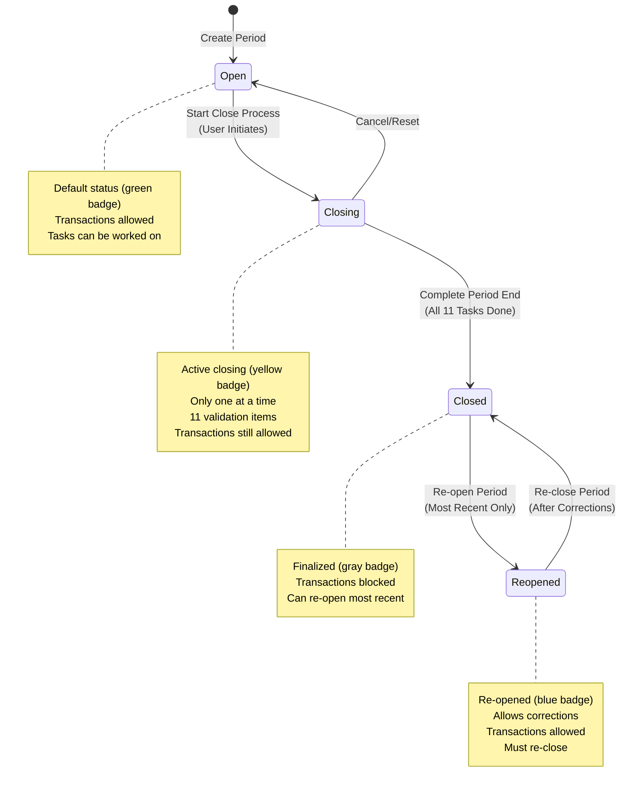
```mermaid
stateDiagram-v2
    [*] --> Open: Create Period

    Open --> Closing: Start Close Process<br/>(User Initiates)

    Closing --> Closed: Complete Period End<br/>(All 11 Tasks Done)
    Closing --> Open: Cancel/Reset

    Closed --> Reopened: Re-open Period<br/>(Most Recent Only)

    Reopened --> Closed: Re-close Period<br/>(After Corrections)

    note right of Open
        Default status (green badge)
        Transactions allowed
        Tasks can be worked on
    end note

    note right of Closing
        Active closing (yellow badge)
        Only one at a time
        11 validation items
        Transactions still allowed
    end note

    note right of Closed
        Finalized (gray badge)
        Transactions blocked
        Can re-open most recent
    end note

    note right of Reopened
        Re-opened (blue badge)
        Allows corrections
        Transactions allowed
        Must re-close
    end note
```

### 4.2 Task Status Lifecycle

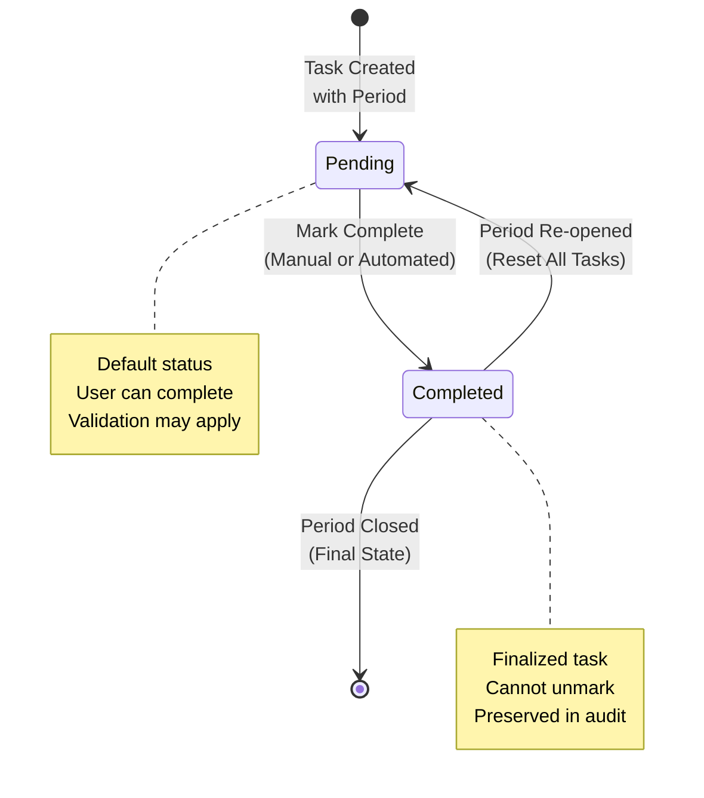
```mermaid
stateDiagram-v2
    [*] --> Pending: Task Created<br/>with Period

    Pending --> Completed: Mark Complete<br/>(Manual or Automated)

    Completed --> Pending: Period Re-opened<br/>(Reset All Tasks)

    Completed --> [*]: Period Closed<br/>(Final State)

    note right of Pending
        Default status
        User can complete
        Validation may apply
    end note

    note right of Completed
        Finalized task
        Cannot unmark
        Preserved in audit
    end note
```

### 4.3 Period Closure State Machine

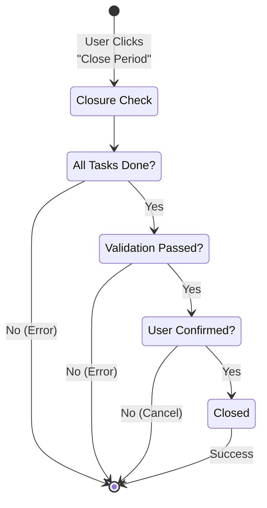
```mermaid
stateDiagram-v2
    state "Closure Check" as Check
    state "All Tasks Done?" as TaskCheck
    state "Validation Passed?" as ValidCheck
    state "User Confirmed?" as ConfirmCheck

    [*] --> Check: User Clicks<br/>"Close Period"

    Check --> TaskCheck

    TaskCheck --> ValidCheck: Yes
    TaskCheck --> [*]: No (Error)

    ValidCheck --> ConfirmCheck: Yes
    ValidCheck --> [*]: No (Error)

    ConfirmCheck --> Closed: Yes
    ConfirmCheck --> [*]: No (Cancel)

    Closed --> [*]: Success
```

---

## 5. Integration Workflows

### 5.1 Physical Count Integration

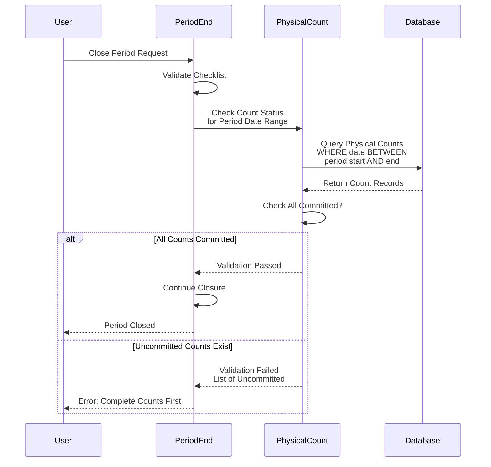
```mermaid
sequenceDiagram
    participant User
    participant PeriodEnd
    participant PhysicalCount
    participant Database

    User->>PeriodEnd: Close Period Request
    PeriodEnd->>PeriodEnd: Validate Checklist
    PeriodEnd->>PhysicalCount: Check Count Status<br/>for Period Date Range

    PhysicalCount->>Database: Query Physical Counts<br/>WHERE date BETWEEN<br/>period start AND end
    Database-->>PhysicalCount: Return Count Records

    PhysicalCount->>PhysicalCount: Check All Committed?

    alt All Counts Committed
        PhysicalCount-->>PeriodEnd: Validation Passed
        PeriodEnd->>PeriodEnd: Continue Closure
        PeriodEnd-->>User: Period Closed
    else Uncommitted Counts Exist
        PhysicalCount-->>PeriodEnd: Validation Failed<br/>List of Uncommitted
        PeriodEnd-->>User: Error: Complete Counts First
    end
```

### 5.2 Transaction Posting Validation

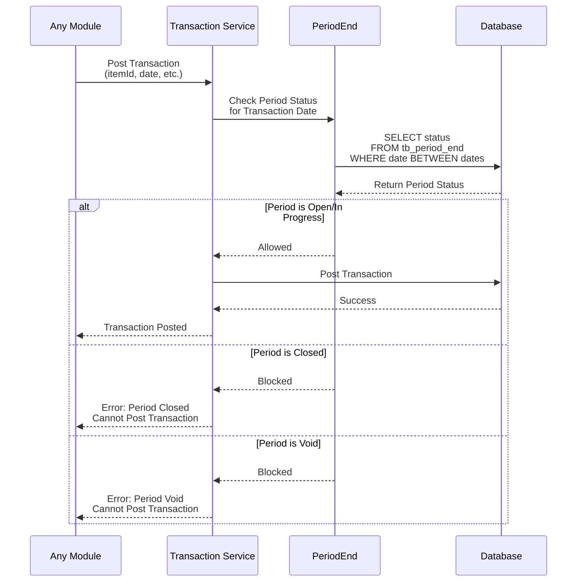
```mermaid
sequenceDiagram
    participant Module as Any Module
    participant Transaction as Transaction Service
    participant PeriodEnd
    participant Database

    Module->>Transaction: Post Transaction<br/>(itemId, date, etc.)

    Transaction->>PeriodEnd: Check Period Status<br/>for Transaction Date

    PeriodEnd->>Database: SELECT status<br/>FROM tb_period_end<br/>WHERE date BETWEEN dates

    Database-->>PeriodEnd: Return Period Status

    alt Period is Open/In Progress
        PeriodEnd-->>Transaction: Allowed
        Transaction->>Database: Post Transaction
        Database-->>Transaction: Success
        Transaction-->>Module: Transaction Posted
    else Period is Closed
        PeriodEnd-->>Transaction: Blocked
        Transaction-->>Module: Error: Period Closed<br/>Cannot Post Transaction
    else Period is Void
        PeriodEnd-->>Transaction: Blocked
        Transaction-->>Module: Error: Period Void<br/>Cannot Post Transaction
    end
```

### 5.3 Adjustments Display Integration

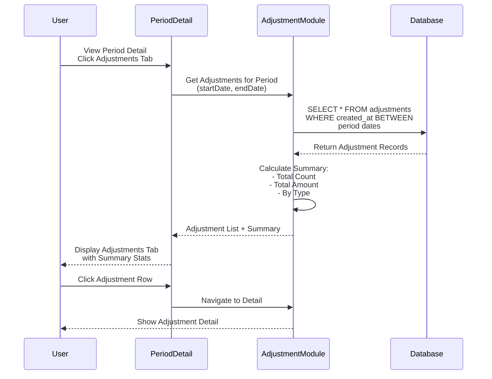
```mermaid
sequenceDiagram
    participant User
    participant PeriodDetail
    participant AdjustmentModule
    participant Database

    User->>PeriodDetail: View Period Detail<br/>Click Adjustments Tab

    PeriodDetail->>AdjustmentModule: Get Adjustments for Period<br/>(startDate, endDate)

    AdjustmentModule->>Database: SELECT * FROM adjustments<br/>WHERE created_at BETWEEN<br/>period dates

    Database-->>AdjustmentModule: Return Adjustment Records

    AdjustmentModule->>AdjustmentModule: Calculate Summary:<br/>- Total Count<br/>- Total Amount<br/>- By Type

    AdjustmentModule-->>PeriodDetail: Adjustment List + Summary

    PeriodDetail-->>User: Display Adjustments Tab<br/>with Summary Stats

    User->>PeriodDetail: Click Adjustment Row
    PeriodDetail->>AdjustmentModule: Navigate to Detail
    AdjustmentModule-->>User: Show Adjustment Detail
```

### 5.4 Activity Log Recording

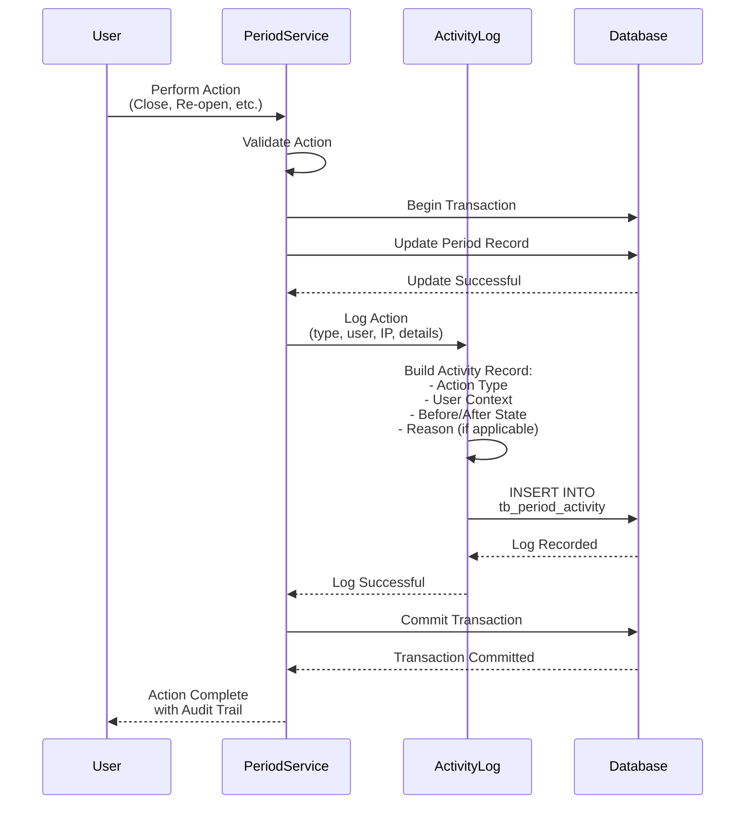
```mermaid
sequenceDiagram
    participant User
    participant PeriodService
    participant ActivityLog
    participant Database

    User->>PeriodService: Perform Action<br/>(Close, Re-open, etc.)

    PeriodService->>PeriodService: Validate Action
    PeriodService->>Database: Begin Transaction

    PeriodService->>Database: Update Period Record
    Database-->>PeriodService: Update Successful

    PeriodService->>ActivityLog: Log Action<br/>(type, user, IP, details)

    ActivityLog->>ActivityLog: Build Activity Record:<br/>- Action Type<br/>- User Context<br/>- Before/After State<br/>- Reason (if applicable)

    ActivityLog->>Database: INSERT INTO<br/>tb_period_activity
    Database-->>ActivityLog: Log Recorded

    ActivityLog-->>PeriodService: Log Successful

    PeriodService->>Database: Commit Transaction
    Database-->>PeriodService: Transaction Committed

    PeriodService-->>User: Action Complete<br/>with Audit Trail
```

---

## 6. Error Handling Workflows

### 6.1 Validation Error Handling

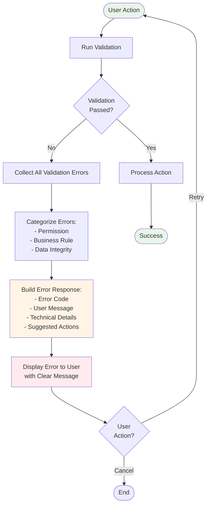
```mermaid
flowchart TD
    Start([User Action]) --> Validate[Run Validation]

    Validate --> Check{Validation<br/>Passed?}

    Check -->|Yes| ProcessOK[Process Action]
    Check -->|No| CollectErrors[Collect All Validation Errors]

    CollectErrors --> CategorizeErrors[Categorize Errors:<br/>- Permission<br/>- Business Rule<br/>- Data Integrity]

    CategorizeErrors --> BuildResponse[Build Error Response:<br/>- Error Code<br/>- User Message<br/>- Technical Details<br/>- Suggested Actions]

    BuildResponse --> DisplayError[Display Error to User<br/>with Clear Message]

    DisplayError --> UserAction{User<br/>Action?}

    UserAction -->|Retry| Start
    UserAction -->|Cancel| End([End])

    ProcessOK --> Success([Success])

    style Start fill:#e8f5e9
    style Success fill:#e8f5e9
    style DisplayError fill:#ffebee
    style BuildResponse fill:#fff4e6
```

### 6.2 Database Transaction Error Recovery

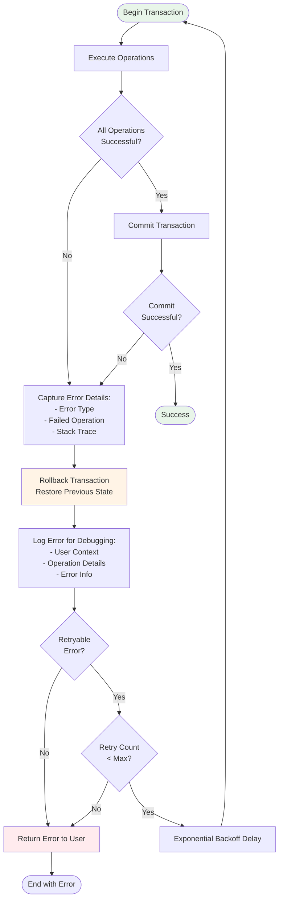
```mermaid
flowchart TD
    Start([Begin Transaction]) --> Execute[Execute Operations]

    Execute --> Check{All Operations<br/>Successful?}

    Check -->|Yes| Commit[Commit Transaction]
    Check -->|No| CaptureError[Capture Error Details:<br/>- Error Type<br/>- Failed Operation<br/>- Stack Trace]

    CaptureError --> Rollback[Rollback Transaction<br/>Restore Previous State]

    Rollback --> LogError[Log Error for Debugging:<br/>- User Context<br/>- Operation Details<br/>- Error Info]

    LogError --> CheckRetry{Retryable<br/>Error?}

    CheckRetry -->|Yes| RetryCount{Retry Count<br/>< Max?}
    CheckRetry -->|No| FinalError[Return Error to User]

    RetryCount -->|Yes| Delay[Exponential Backoff Delay]
    RetryCount -->|No| FinalError

    Delay --> Start

    Commit --> VerifyCommit{Commit<br/>Successful?}

    VerifyCommit -->|Yes| Success([Success])
    VerifyCommit -->|No| CaptureError

    FinalError --> End([End with Error])

    style Start fill:#e8f5e9
    style Success fill:#e8f5e9
    style Rollback fill:#fff4e6
    style FinalError fill:#ffebee
```

### 6.3 Permission Denied Workflow

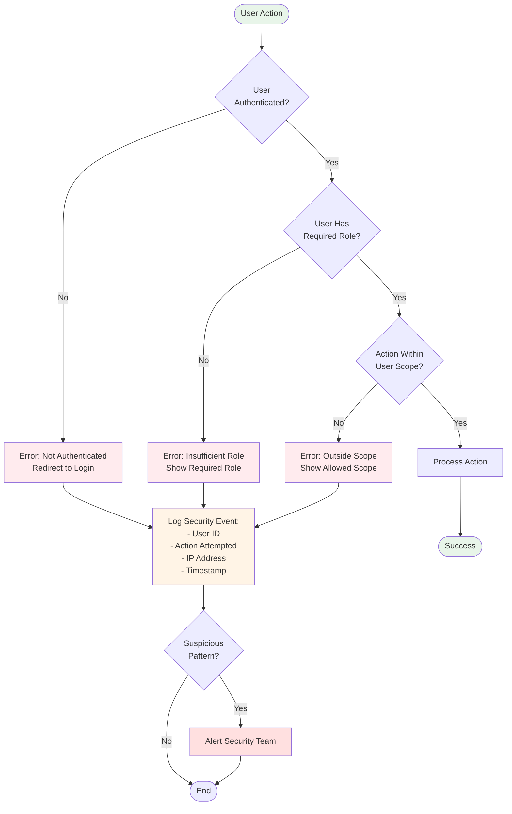
```mermaid
flowchart TD
    Start([User Action]) --> CheckAuth{User<br/>Authenticated?}

    CheckAuth -->|No| ErrorAuth[Error: Not Authenticated<br/>Redirect to Login]
    CheckAuth -->|Yes| CheckRole{User Has<br/>Required Role?}

    CheckRole -->|No| ErrorRole[Error: Insufficient Role<br/>Show Required Role]
    CheckRole -->|Yes| CheckScope{Action Within<br/>User Scope?}

    CheckScope -->|No| ErrorScope[Error: Outside Scope<br/>Show Allowed Scope]
    CheckScope -->|Yes| ProcessOK[Process Action]

    ErrorAuth --> LogAttempt[Log Security Event:<br/>- User ID<br/>- Action Attempted<br/>- IP Address<br/>- Timestamp]

    ErrorRole --> LogAttempt
    ErrorScope --> LogAttempt

    LogAttempt --> NotifyAdmin{Suspicious<br/>Pattern?}

    NotifyAdmin -->|Yes| Alert[Alert Security Team]
    NotifyAdmin -->|No| End([End])

    Alert --> End
    ProcessOK --> Success([Success])

    style Start fill:#e8f5e9
    style Success fill:#e8f5e9
    style ErrorAuth fill:#ffebee
    style ErrorRole fill:#ffebee
    style ErrorScope fill:#ffebee
    style LogAttempt fill:#fff4e6
    style Alert fill:#ffe0e0
```

---

## 7. Performance Optimization Flows

### 7.1 Caching Strategy

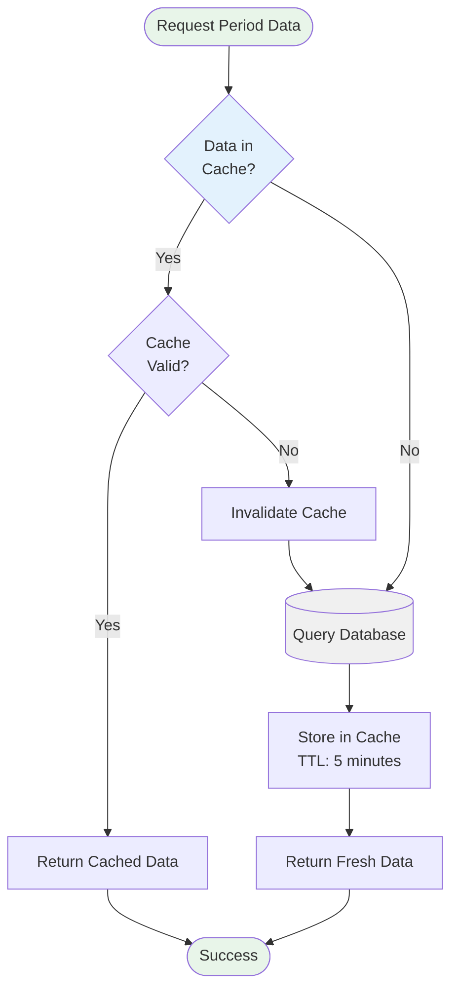
```mermaid
flowchart TD
    Start([Request Period Data]) --> CheckCache{Data in<br/>Cache?}

    CheckCache -->|Yes| ValidCache{Cache<br/>Valid?}
    CheckCache -->|No| QueryDB

    ValidCache -->|Yes| ReturnCache[Return Cached Data]
    ValidCache -->|No| InvalidateCache[Invalidate Cache]

    InvalidateCache --> QueryDB[(Query Database)]

    QueryDB --> StoreCache[Store in Cache<br/>TTL: 5 minutes]

    StoreCache --> ReturnData[Return Fresh Data]

    ReturnCache --> Success([Success])
    ReturnData --> Success

    style Start fill:#e8f5e9
    style Success fill:#e8f5e9
    style CheckCache fill:#e3f2fd
    style QueryDB fill:#f0f0f0
```

### 7.2 Database Query Optimization

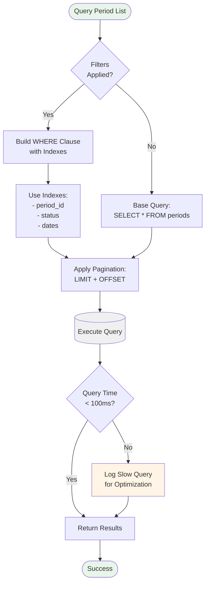
```mermaid
flowchart TD
    Start([Query Period List]) --> CheckFilter{Filters<br/>Applied?}

    CheckFilter -->|Yes| BuildWhere[Build WHERE Clause<br/>with Indexes]
    CheckFilter -->|No| BaseQuery[Base Query:<br/>SELECT * FROM periods]

    BuildWhere --> ApplyIndex[Use Indexes:<br/>- period_id<br/>- status<br/>- dates]

    ApplyIndex --> Paginate[Apply Pagination:<br/>LIMIT + OFFSET]

    BaseQuery --> Paginate

    Paginate --> Execute[(Execute Query)]

    Execute --> CheckPerf{Query Time<br/>< 100ms?}

    CheckPerf -->|Yes| ReturnResults[Return Results]
    CheckPerf -->|No| LogSlow[Log Slow Query<br/>for Optimization]

    LogSlow --> ReturnResults

    ReturnResults --> Success([Success])

    style Start fill:#e8f5e9
    style Success fill:#e8f5e9
    style Execute fill:#f0f0f0
    style LogSlow fill:#fff4e6
```

---

## 8. Related Documentation

- [Period End Business Requirements](./BR-period-end.md)
- [Period End Use Cases](./UC-period-end.md)
- [Period End Technical Specification](./TS-period-end.md)
- [Period End Data Definition](./DD-period-end.md)
- [Period End Validations](./VAL-period-end.md)
- [Shared Methods: Period Management](../../shared-methods/inventory-valuation/SM-period-management.md)

---

**Document Status**: Draft
**Last Review**: 2025-01-12
**Next Review**: 2025-04-12
**Maintained By**: Inventory Management Team
