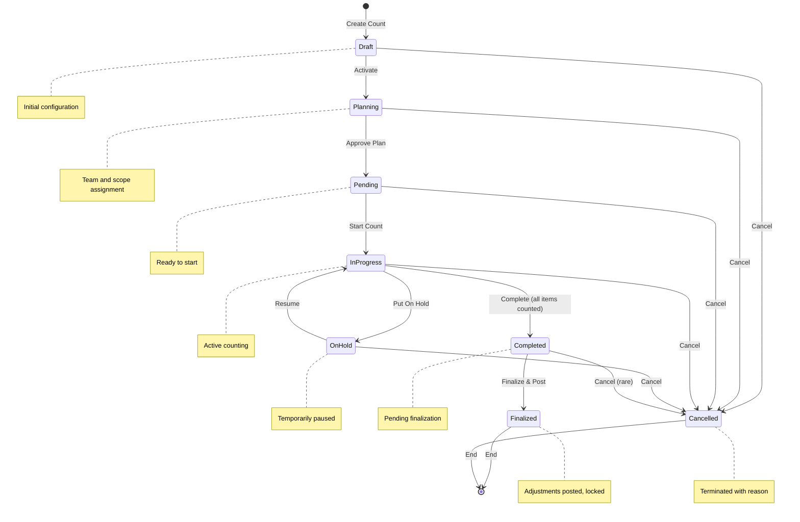
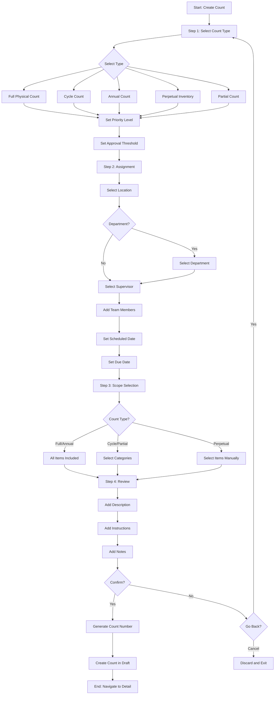
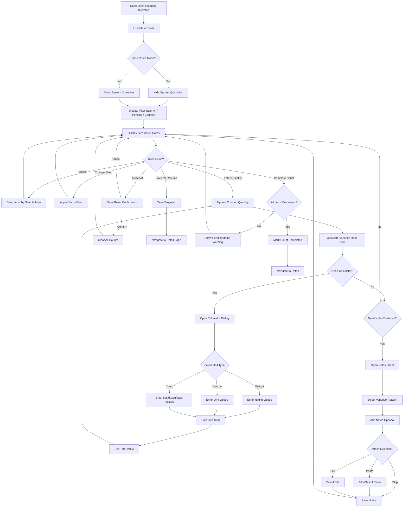
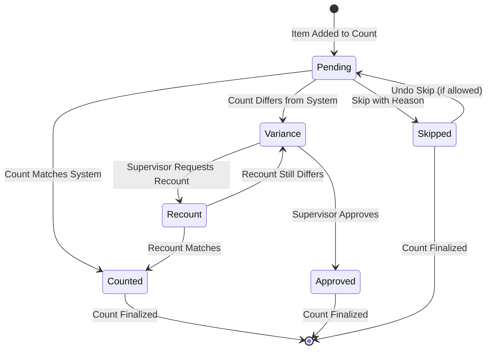
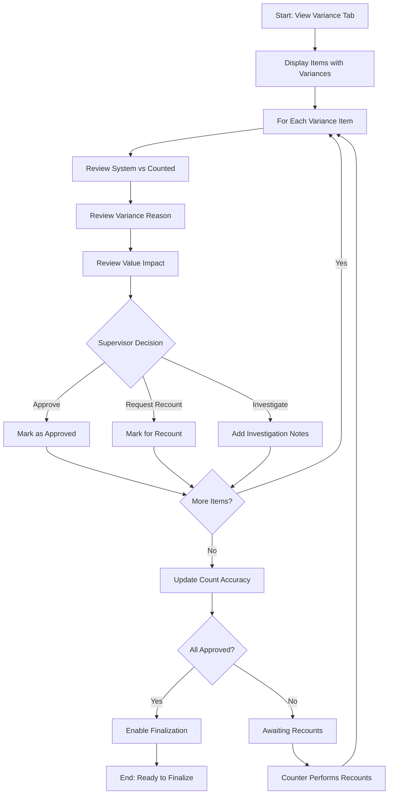
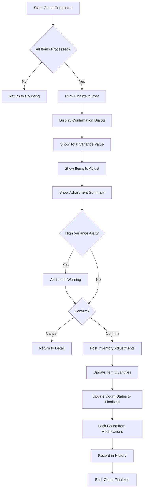
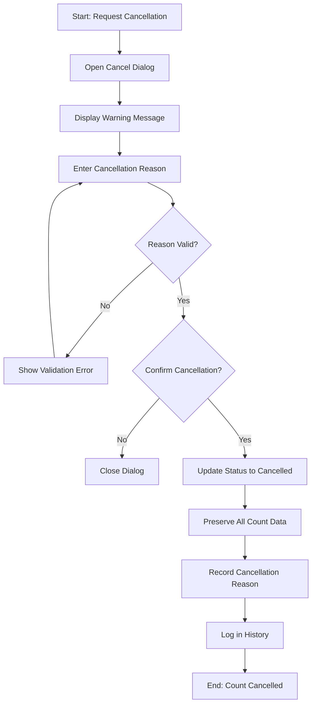
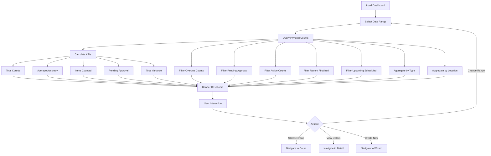
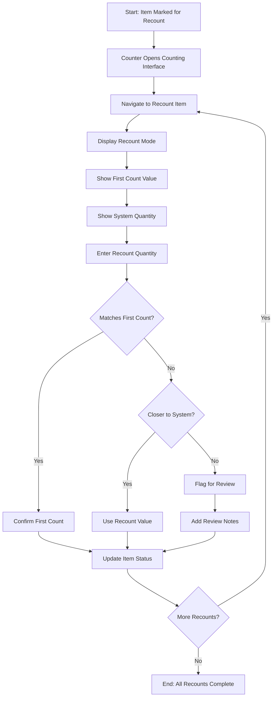

# Flow Diagrams: Physical Count Management

**Module**: Inventory Management
**Sub-Module**: Physical Count Management
**Version**: 1.0.0
**Status**: IMPLEMENTED (Prototype with Mock Data)
**Last Updated**: 2025-12-09

---

## 1. Overview

This document provides Mermaid flow diagrams for the Physical Count Management module workflows.

---

## 2. Physical Count Status Lifecycle

---

## 3. Create Physical Count Wizard Flow

---

## 4. Physical Count Counting Process (Mobile-First Interface)

---

## 5. Item Status Flow

---

## 6. Variance Review and Approval Flow

---

## 7. Finalization and Posting Flow

---

## 8. Count Cancellation Flow

---

## 9. Dashboard Data Flow

---

## 10. Recount Process Flow

---

## 11. Document History

| Version | Date | Author | Changes |
|---------|------|--------|---------|
| 1.0.0 | 2025-12-06 | System | Initial documentation |
| 1.0.1 | 2025-12-09 | System | Replaced counting process flow with mobile-first interface flow (calculator, notes sheet, blind count mode, filter tabs) |
