# Flow Diagrams: Spot Check

## Module Information
- **Module**: Inventory Management
- **Sub-Module**: Spot Check
- **Route**: `/app/(main)/inventory-management/spot-check`
- **Version**: 2.1.0
- **Last Updated**: 2025-12-09
- **Owner**: Inventory Management Team
- **Status**: Implemented

## Document History
| Version | Date | Author | Changes |
|---------|------|--------|---------|
| 1.0.0 | 2025-01-11 | System | Initial version |
| 2.0.0 | 2025-12-06 | System | Updated to reflect actual implementation |
| 2.1.0 | 2025-12-09 | System | Updated to 2-step wizard, added active/completed page flows |

---

## Overview

This document provides visual representations of workflows, data flows, and system interactions for the Spot Check sub-module using Mermaid diagrams.

**Related Documents**:
- [Business Requirements](./BR-spot-check.md)
- [Use Cases](./UC-spot-check.md)
- [Technical Specification](./TS-spot-check.md)
- [Data Definition](./DD-spot-check.md)
- [Validations](./VAL-spot-check.md)

---

## High-Level Process Flow

### Complete Spot Check Lifecycle

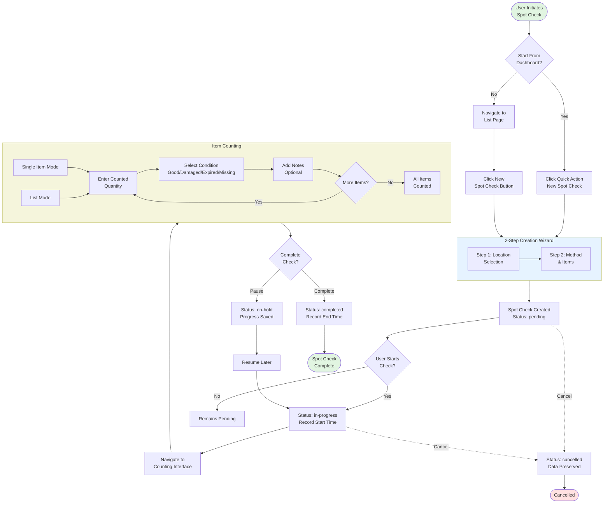

---

## Creation Wizard Flow

### 2-Step Wizard Process

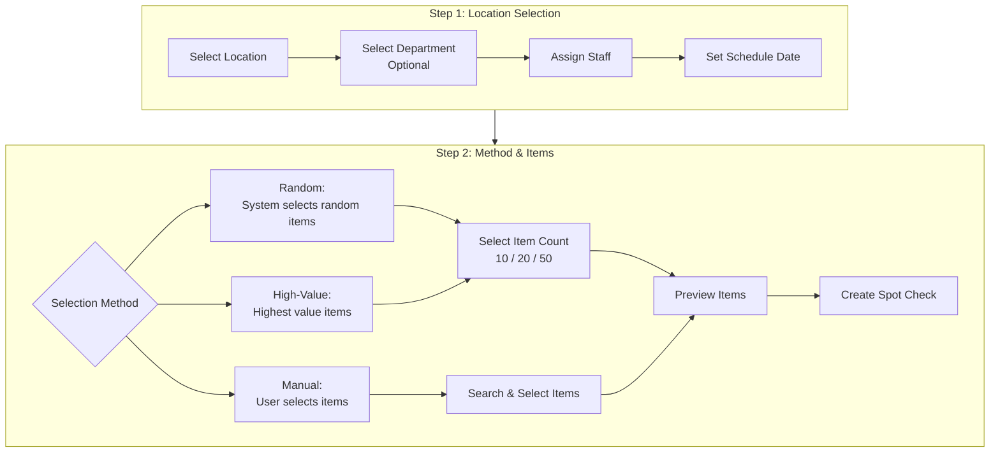

### Wizard Navigation

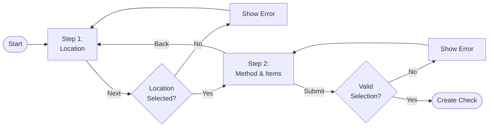

---

## Status State Diagram

### Spot Check Status Transitions

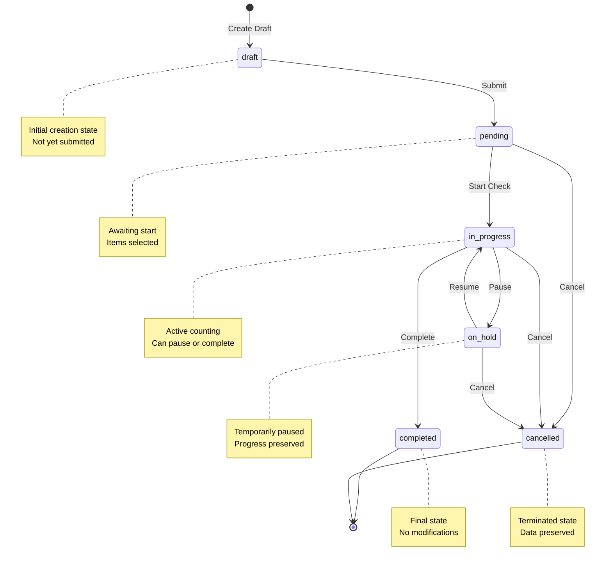

---

## Item Status Flow

### Item Check Status Transitions

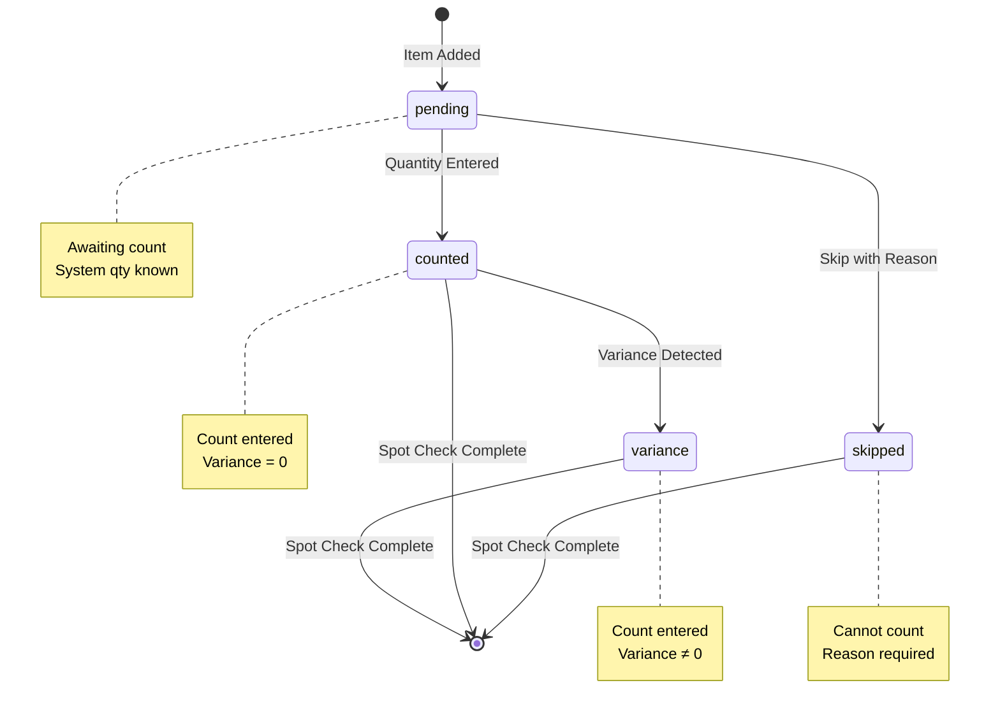

---

## Counting Interface Flow

### Single Item Mode

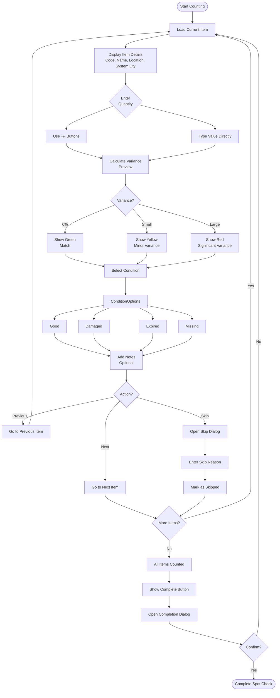

---

## Page Navigation Flow

### Application Navigation

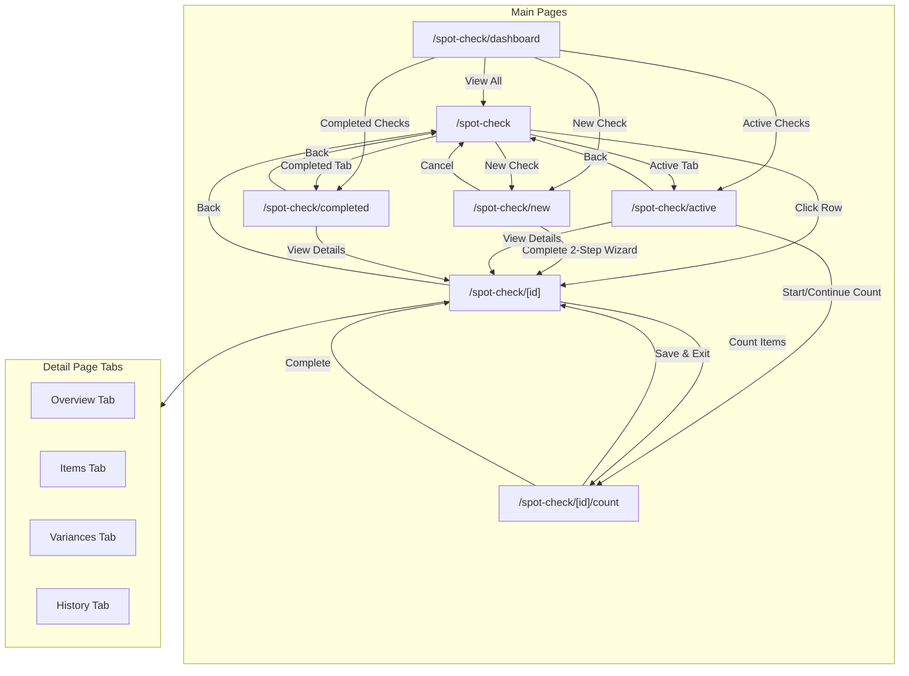

---

## Data Flow Diagram

### Spot Check Data Flow

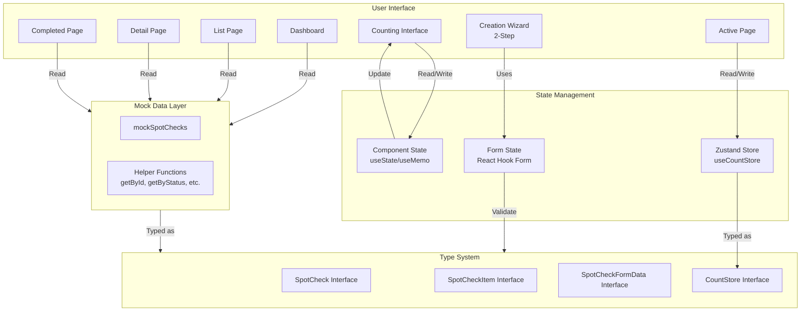

---

## Active Page Flow

### Active Spot Checks Management

```mermaid
flowchart TD
    Start([Open Active Page]) --> LoadState[Load from Zustand Store<br/>useCountStore]
    LoadState --> GetActive[Get activeCounts]

    GetActive --> FilterTabs{Filter Tab}
    FilterTabs --> All[All Active]
    FilterTabs --> Pending[Pending Only]
    FilterTabs --> InProgress[In Progress Only]
    FilterTabs --> Paused[Paused/On-Hold]

    All --> Display[Display Filtered List]
    Pending --> Display
    InProgress --> Display
    Paused --> Display

    Display --> CheckOverdue{Check<br/>Overdue?}
    CheckOverdue -->|Yes| ShowOverdue[Show Overdue<br/>Indicator]
    CheckOverdue -->|No| ShowNormal[Normal Display]

    ShowOverdue --> UserAction
    ShowNormal --> UserAction

    UserAction{User Action}
    UserAction -->|Start| StartCount[Start Count<br/>Navigate to /count]
    UserAction -->|Continue| ContinueCount[Continue Count<br/>Navigate to /count]
    UserAction -->|View| ViewDetail[View Details<br/>Navigate to /[id]]

    StartCount --> UpdateStore[Update Zustand Store<br/>status: in-progress]
    ContinueCount --> Navigate[Navigate to<br/>Counting Interface]
    ViewDetail --> Navigate
    UpdateStore --> Navigate
```

---

## Completed Page Flow

### Completed Spot Checks Management

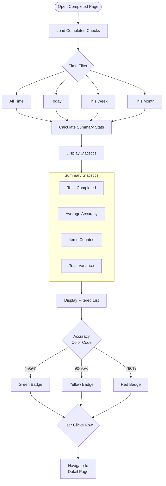

---

## Variance Calculation Flow

### Real-Time Variance Calculation

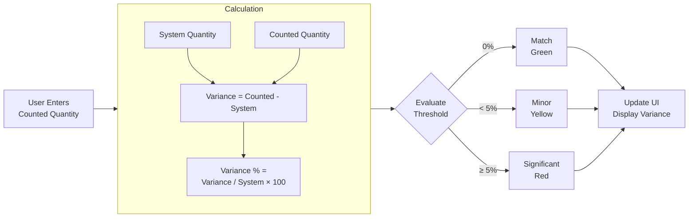

---

## Cancel Flow

### Cancellation Process

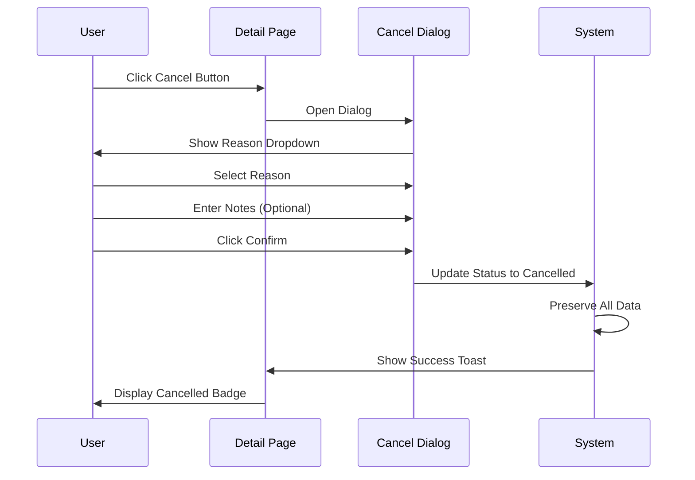

---

## Dashboard KPI Flow

### Dashboard Data Aggregation

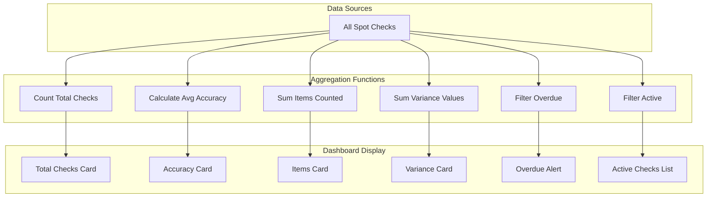

---

## Summary

### Key Flows
1. **Creation Flow**: 2-step wizard (Location Selection → Method & Items)
2. **Status Flow**: draft → pending → in-progress → completed/cancelled/on-hold
3. **Counting Flow**: Single item or list mode with variance preview
4. **Item Flow**: pending → counted/skipped → variance (if applicable)
5. **Active Page Flow**: Zustand-based state with filter tabs (All, Pending, In Progress, Paused)
6. **Completed Page Flow**: Time-based filtering with summary statistics

### Key Actions
- Start: pending → in-progress
- Pause: in-progress → on-hold
- Resume: on-hold → in-progress
- Complete: in-progress → completed
- Cancel: any (except completed) → cancelled

### Key Pages
| Page | Route | Purpose |
|------|-------|---------|
| Dashboard | /spot-check/dashboard | KPIs and quick actions |
| List | /spot-check | All spot checks with filtering |
| New | /spot-check/new | 2-step creation wizard |
| Active | /spot-check/active | Active checks (Zustand state) |
| Completed | /spot-check/completed | Completed checks with stats |
| Detail | /spot-check/[id] | Spot check details with tabs |
| Count | /spot-check/[id]/count | Counting interface |

---

**Document End**
