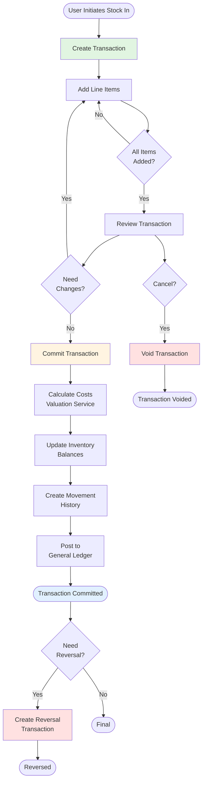
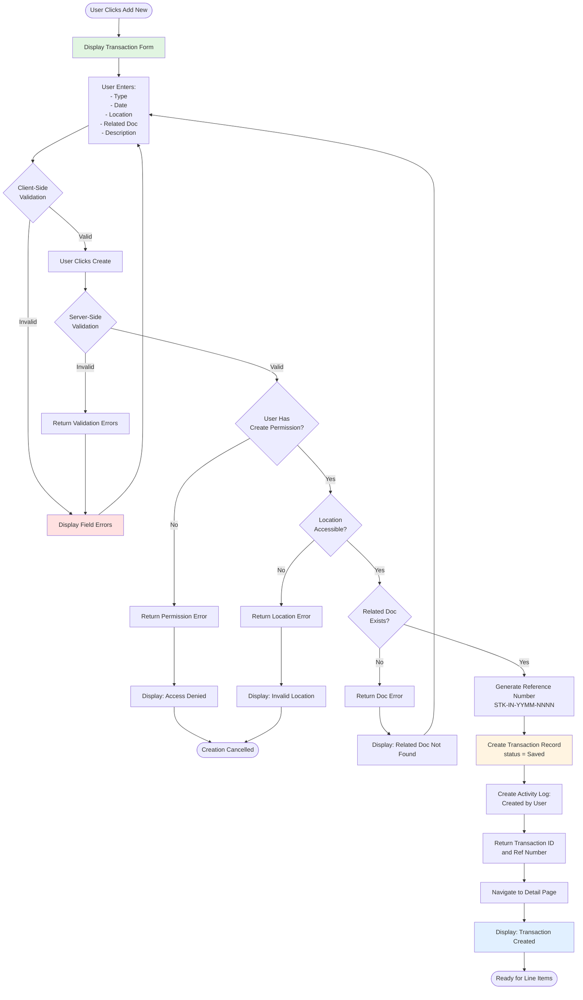
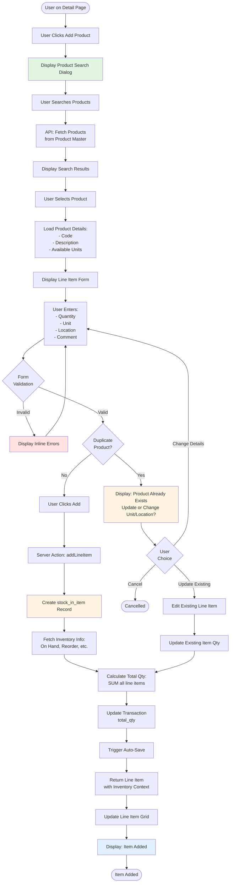
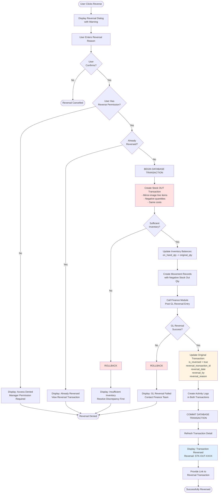
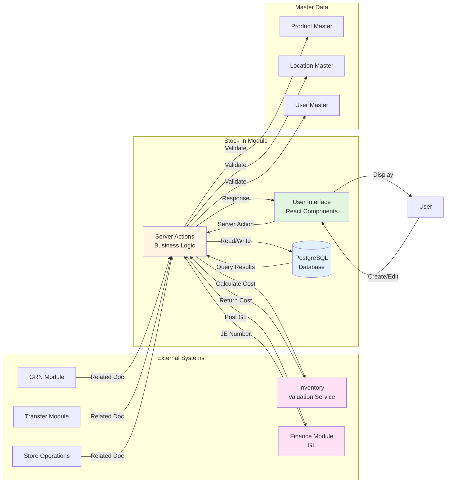
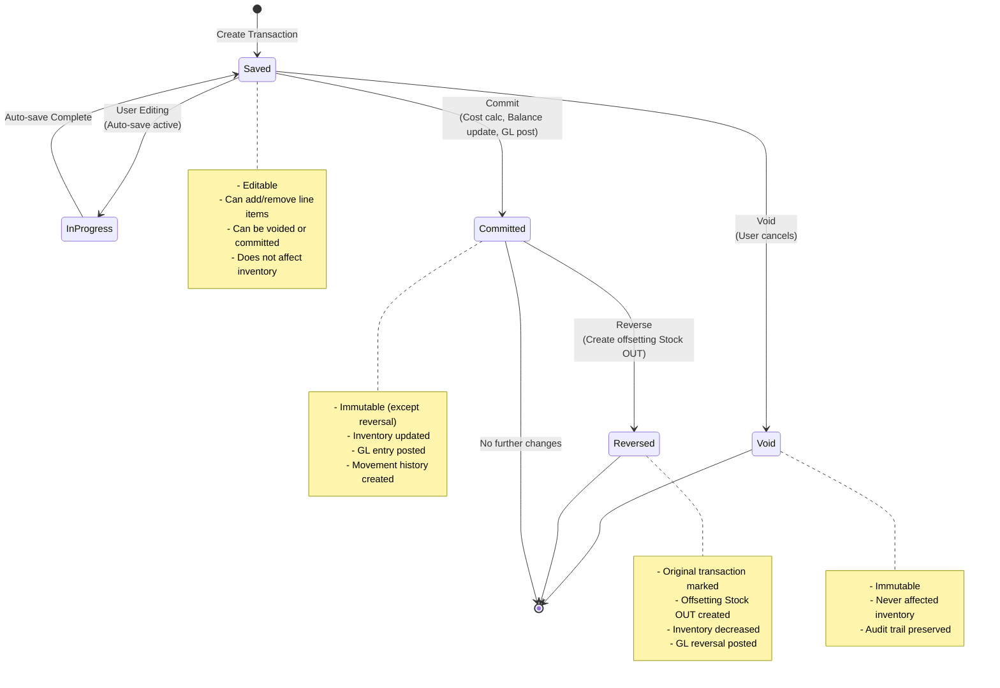
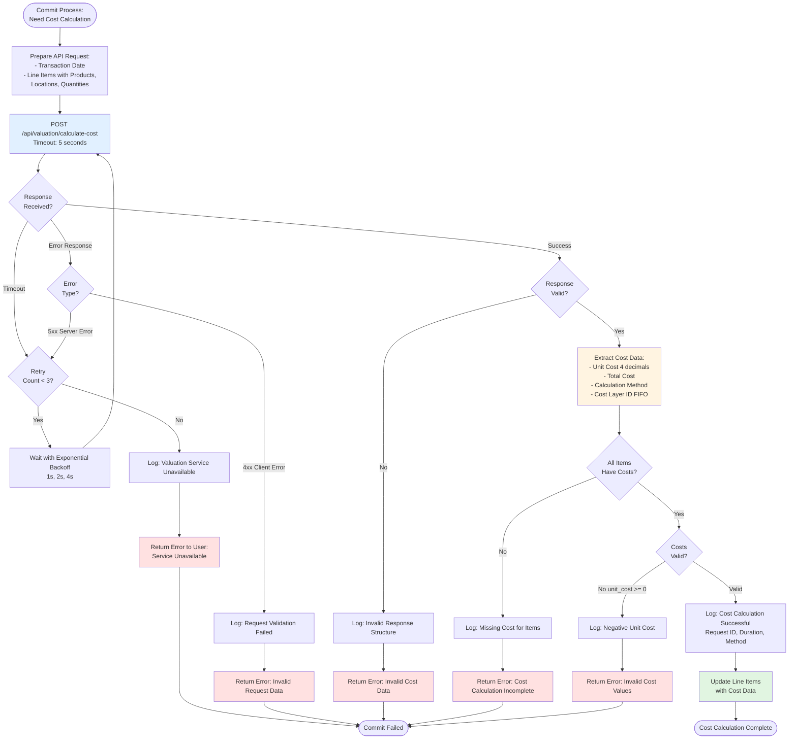
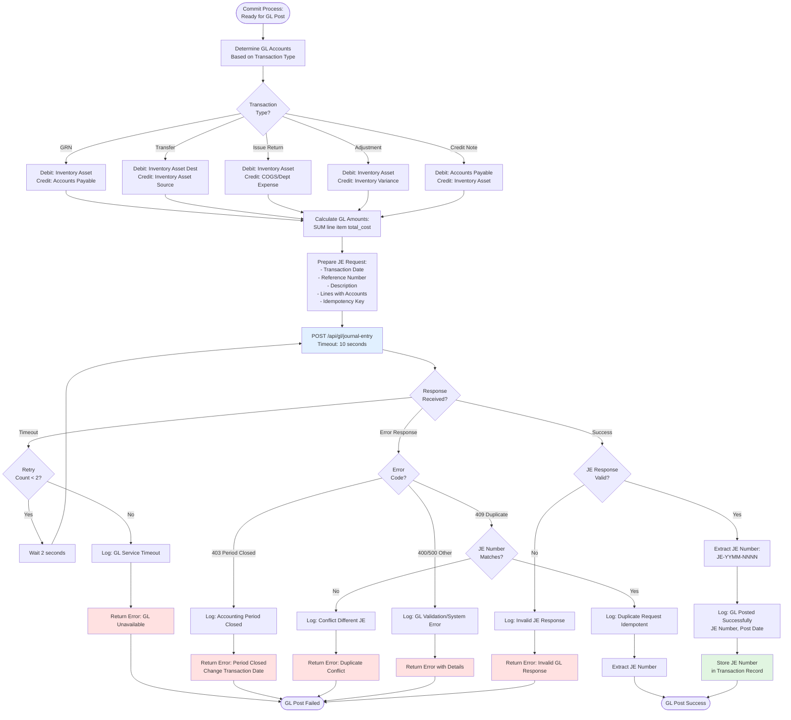
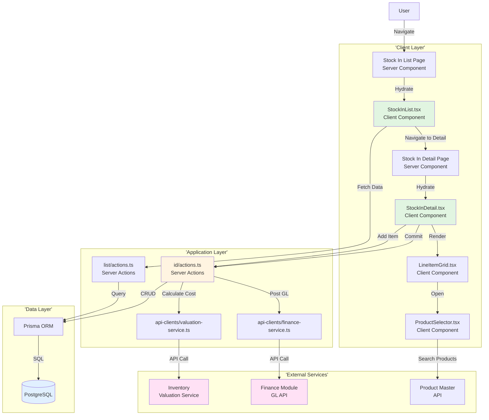
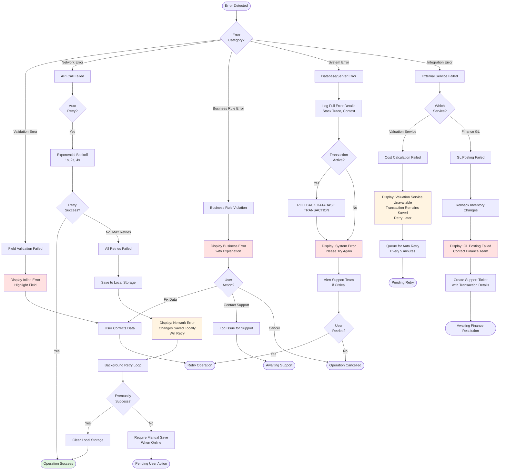

# Flow Diagrams: Stock In

## Module Information
- **Module**: Inventory Management
- **Sub-Module**: Stock In
- **Version**: 1.0.0
- **Last Updated**: 2025-01-11
- **Owner**: Inventory Management Team
- **Status**: Draft

## Document History
| Version | Date | Author | Changes |
|---------|------|--------|---------|
| 1.1.0 | 2025-12-10 | Documentation Team | Standardized reference number format (XXX-YYMM-NNNN) |
| 1.0.0 | 2025-01-11 | System | Initial version with comprehensive Mermaid diagrams |

---

## Overview

This document provides visual representations of Stock In workflows using Mermaid diagrams. Diagrams cover the complete lifecycle from transaction creation through commitment, inventory updates, and financial posting.

**Related Documents**:
- [Business Requirements](./BR-stock-in.md)
- [Use Cases](./UC-stock-in.md)
- [Technical Specification](./TS-stock-in.md)
- [Data Definition](./DD-stock-in.md)
- [Validations](./VAL-stock-in.md)

---

## Table of Contents

1. [High-Level Process Flow](#1-high-level-process-flow)
2. [Create Transaction Flow](#2-create-transaction-flow)
3. [Add Line Items Flow](#3-add-line-items-flow)
4. [Commit Transaction Flow](#4-commit-transaction-flow)
5. [Reverse Transaction Flow](#5-reverse-transaction-flow)
6. [Data Flow Diagram](#6-data-flow-diagram)
7. [Sequence Diagram: Full Lifecycle](#7-sequence-diagram-full-lifecycle)
8. [State Diagram: Transaction Status](#8-state-diagram-transaction-status)
9. [Integration Flow: Inventory Valuation Service](#9-integration-flow-inventory-valuation-service)
10. [Integration Flow: GL Posting](#10-integration-flow-gl-posting)
11. [Component Interaction Diagram](#11-component-interaction-diagram)
12. [Error Recovery Flow](#12-error-recovery-flow)

---

## 1. High-Level Process Flow



---

## 2. Create Transaction Flow



---

## 3. Add Line Items Flow



---

## 4. Commit Transaction Flow

```mermaid
flowchart TD
    Start([User Clicks Commit]) --> ShowConfirm[Display Confirmation Dialog<br>with Summary]
    ShowConfirm --> UserConfirm{User<br>Confirms?}
    UserConfirm -->|No| Cancel([Commit Cancelled])

    UserConfirm -->|Yes| BeginTx[BEGIN DATABASE TRANSACTION]
    BeginTx --> ValidateTx{Transaction<br>Committable?}
    ValidateTx -->|No| RollbackVal[ROLLBACK]
    RollbackVal --> ShowError1[Display: Cannot Commit<br>Validation Error]
    ShowError1 --> End1([Commit Failed])

    ValidateTx -->|Yes| CheckPerms{User Has<br>Commit Permission?}
    CheckPerms -->|No| RollbackPerm[ROLLBACK]
    RollbackPerm --> ShowError2[Display: Access Denied]
    ShowError2 --> End1

    CheckPerms -->|Yes| CallValuation[Call Inventory Valuation Service<br>Calculate Costs for All Items]
    CallValuation --> ValuationSuccess{Valuation<br>Success?}
    ValuationSuccess -->|No| RollbackVal1[ROLLBACK]
    RollbackVal1 --> ShowError3[Display: Cost Calculation Failed<br>Try Again Later]
    ShowError3 --> End1

    ValuationSuccess -->|Yes| UpdateCosts[Update Line Items<br>with Unit Costs & Total Costs]
    UpdateCosts --> LockBalances[SELECT inventory_balance<br>FOR UPDATE<br>Lock Rows]
    LockBalances --> UpdateBal[Update Inventory Balances:<br>on_hand_qty += qty]
    UpdateBal --> CheckNegative{Allow<br>Negative?}
    CheckNegative -->|No and Balance < 0| RollbackBal[ROLLBACK]
    RollbackBal --> ShowError4[Display: Negative Inventory<br>Not Allowed]
    ShowError4 --> End1

    CheckNegative -->|Yes or Balance >= 0| CreateMov[Create Movement Records<br>for Each Line Item]
    CreateMov --> CallGL[Call Finance Module<br>Post GL Journal Entry]
    CallGL --> GLSuccess{GL Post<br>Success?}
    GLSuccess -->|No| RollbackGL[ROLLBACK All Changes]
    RollbackGL --> ShowError5[Display: GL Posting Failed<br>Contact Finance Team]
    ShowError5 --> End1

    GLSuccess -->|Yes| UpdateStatus[Update Transaction:<br>status = Committed<br>commit_date = NOW()<br>committed_by = user<br>gl_journal_entry_number]
    UpdateStatus --> CreateActivity[Create Activity Log:<br>Committed by User]
    CreateActivity --> CommitTx[COMMIT DATABASE TRANSACTION]
    CommitTx --> RefreshUI[Refresh Transaction Detail]
    RefreshUI --> ShowSuccess[Display: Transaction Committed<br>Inventory Updated<br>GL Entry: JE-XXXX]
    ShowSuccess --> End2([Successfully Committed])

    style BeginTx fill:#fff4e1
    style CallValuation fill:#e1f0ff
    style CallGL fill:#e1f0ff
    style CommitTx fill:#e1f5e1
    style ShowSuccess fill:#e1f0ff
    style RollbackVal fill:#ffe1e1
    style RollbackVal1 fill:#ffe1e1
    style RollbackBal fill:#ffe1e1
    style RollbackGL fill:#ffe1e1
```

---

## 5. Reverse Transaction Flow



---

## 6. Data Flow Diagram



---

## 7. Sequence Diagram: Full Lifecycle

```mermaid
sequenceDiagram
    participant User
    participant UI as UI Component
    participant SA as Server Action
    participant DB as Database
    participant Val as Valuation Service
    participant GL as Finance Module

    User->>UI: Click "Add New"
    UI->>SA: createStockInTransaction(data)
    SA->>DB: Generate ref number
    DB-->>SA: STK-IN-2501-0123
    SA->>DB: INSERT stock_in_transaction
    DB-->>SA: Transaction created
    SA-->>UI: Return transaction ID
    UI->>User: Show success, navigate to detail

    User->>UI: Add product line items
    UI->>SA: addLineItem(transactionId, productData)
    SA->>DB: INSERT stock_in_item
    SA->>DB: SELECT inventory balance
    DB-->>SA: Current inventory info
    SA->>DB: UPDATE transaction.total_qty
    DB-->>SA: Updated
    SA-->>UI: Return line item with inventory context
    UI->>User: Display updated grid

    Note over UI,SA: Auto-save occurs every 30 seconds

    User->>UI: Click "Commit"
    UI->>User: Show confirmation dialog
    User->>UI: Confirm commit
    UI->>SA: commitStockInTransaction(transactionId)
    SA->>DB: BEGIN TRANSACTION
    SA->>DB: Validate transaction committable
    DB-->>SA: Valid

    SA->>Val: POST /calculate-cost (line items)
    Val->>Val: Calculate FIFO or Periodic Average
    Val-->>SA: Return costs for all items
    SA->>DB: UPDATE stock_in_item (unit_cost, total_cost)

    SA->>DB: SELECT inventory_balance FOR UPDATE
    DB-->>SA: Locked balances
    SA->>DB: UPDATE inventory_balance (on_hand_qty += qty)
    SA->>DB: INSERT stock_in_movement (for each item)

    SA->>GL: POST /journal-entry (GL data)
    GL->>GL: Validate and create JE
    GL-->>SA: JE-2501-5678
    SA->>DB: UPDATE stock_in_transaction (status, JE number)
    SA->>DB: INSERT stock_in_activity (Committed)
    SA->>DB: COMMIT TRANSACTION
    DB-->>SA: Committed

    SA-->>UI: Return committed transaction
    UI->>User: Display success with JE number

    style Val fill:#ffe1f5
    style GL fill:#ffe1f5
```

---

## 8. State Diagram: Transaction Status



---

## 9. Integration Flow: Inventory Valuation Service



---

## 10. Integration Flow: GL Posting



---

## 11. Component Interaction Diagram



---

## 12. Error Recovery Flow



---

## Version History

| Version | Date | Author | Changes |
|---------|------|--------|---------|
| 1.0.0 | 2025-01-11 | System | Initial version with 12 comprehensive flow diagrams |

---

## References

1. **Mermaid Documentation**: https://mermaid.js.org/
2. **Use Cases**: UC-stock-in.md
3. **Technical Specification**: TS-stock-in.md

---

**Document Control**:
- **Classification**: Internal Use
- **Review Required**: Yes
- **Approved By**: Pending
- **Next Review Date**: TBD
