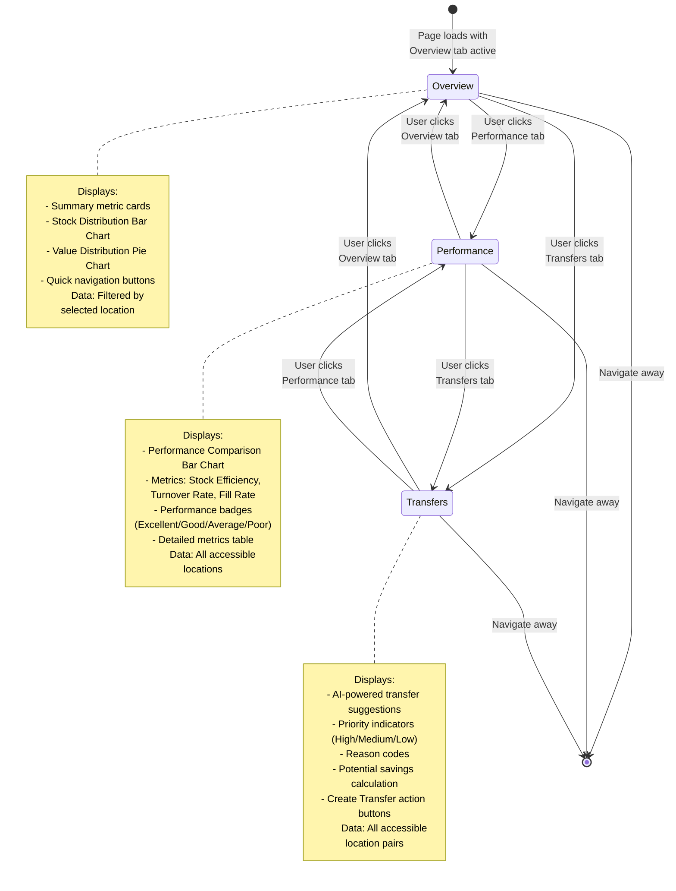

# Flow Diagrams: Stock Overview

## Document Information
- **Module**: Inventory Management
- **Sub-Module**: Stock Overview
- **Document Type**: Flow Diagrams (FD)
- **Version**: 1.0.0
- **Last Updated**: 2025-01-10
- **Status**: Active

## Purpose

This document provides visual representations of Stock Overview workflows, including:
- Dashboard customization and widget management
- Multi-location inventory analysis
- Performance metrics calculation
- Transfer suggestion generation
- Alert creation and management
- Data refresh and caching strategies

**Related Documents**:
- [Business Requirements](./BR-stock-overview.md)
- [Use Cases](./UC-stock-overview.md)
- [Technical Specification](./TS-stock-overview.md)
- [Data Schema](./DS-stock-overview.md)
- [Validations](./VAL-stock-overview.md)

## Document History

| Version | Date | Author | Changes |
|---------|------|--------|---------|
| 1.1.0 | 2025-12-10 | Documentation Team | Standardized reference number format (XXX-YYMM-NNNN) |
| 1.0.0 | 2025-11-19 | Documentation Team | Initial version |
---

## Diagram Index

### User Interaction Flows
1. [Dashboard Customization Flow](#1-dashboard-customization-flow)
2. [Location Filter Selection Flow](#2-location-filter-selection-flow)
3. [Tab Navigation Flow](#3-tab-navigation-flow)
4. [Quick Navigation Flow](#4-quick-navigation-flow)

### Data Processing Flows
5. [Dashboard Data Loading Flow](#5-dashboard-data-loading-flow)
6. [Multi-Location Aggregation Flow](#6-multi-location-aggregation-flow)
7. [Performance Calculation Flow](#7-performance-calculation-flow)
8. [Transfer Suggestion Generation Flow](#8-transfer-suggestion-generation-flow)

### System Flows
9. [Alert Generation and Management Flow](#9-alert-generation-and-management-flow)
10. [Auto-Refresh Mechanism Flow](#10-auto-refresh-mechanism-flow)
11. [Permission-Based Filtering Flow](#11-permission-based-filtering-flow)
12. [Chart Data Preparation Flow](#12-chart-data-preparation-flow)

---

## 1. Dashboard Customization Flow

This diagram shows how users customize their dashboard layout through drag-and-drop widget reordering with persistent storage.

```mermaid
flowchart TD
    Start([User accesses<br>Inventory Dashboard]) --> CheckStorage{Saved layout<br>in localStorage?}

    CheckStorage -->|Yes| LoadSaved['Load saved layout:<br>widgetOrder = JSON.parse(<br>  localStorage.getItem('dashboard-layout')<br>)']
    CheckStorage -->|No| LoadDefault['Load default layout:<br>widgetOrder = [<br>  'inventory-levels',<br>  'value-trend',<br>  'turnover',<br>  'low-stock-alert',<br>  'expiring-alert',<br>  'quick-actions'<br>]']

    LoadSaved --> RenderDashboard['Render Dashboard:<br>- Initialize DragDropContext<br>- Map widgets to grid positions<br>- Apply responsive layout<br>  (1-3 columns based on screen)']
    LoadDefault --> RenderDashboard

    RenderDashboard --> UserInteraction{User action}

    UserInteraction -->|View widget| TooltipInteract[User hovers/clicks<br>to view tooltips<br>and chart details]
    UserInteraction -->|Start drag| DragStart['onDragStart event:<br>- Highlight draggable widget<br>- Show drag handle cursor<br>- Visual feedback (opacity 0.7)']
    UserInteraction -->|Navigate away| End

    TooltipInteract --> UserInteraction

    DragStart --> DragOver['User drags over grid:<br>- Show drop placeholder<br>- Calculate new position<br>- Preview grid reordering']

    DragOver --> DropWidget{Drop widget?}

    DropWidget -->|Cancel drag| UserInteraction
    DropWidget -->|Drop widget| OnDragEnd['onDragEnd event:<br>IF !result.destination:<br>  return (dropped outside)<br><br>newOrder = Array.from(widgets)<br>removed = newOrder.splice(<br>  source.index, 1<br>)<br>newOrder.splice(<br>  destination.index, 0, removed<br>)']

    OnDragEnd --> UpdateState['Update React state:<br>setWidgetOrder(newOrder)']

    UpdateState --> SaveToStorage['Save to localStorage:<br>localStorage.setItem(<br>  'dashboard-layout',<br>  JSON.stringify(newOrder)<br>)']

    SaveToStorage --> RerenderGrid['Re-render dashboard:<br>- Widgets in new order<br>- Smooth transition animation<br>- Grid adjusts positions']

    RerenderGrid --> VerifyPersistence['User refreshes page<br>to verify persistence:<br><br>Saved layout loads<br>correctly']

    VerifyPersistence --> End([Customization<br>Complete])

    style LoadSaved fill:#e1f5ff
    style SaveToStorage fill:#e1ffe1
    style RerenderGrid fill:#fff4e1
```

**Key Points**:
- React Beautiful DnD library handles drag-and-drop mechanics
- localStorage provides cross-session persistence
- Responsive grid adjusts columns: 3 (desktop) → 2 (tablet) → 1 (mobile)
- Widget order persists after page refresh
- Drag preview shows where widget will be placed

---

## 2. Location Filter Selection Flow

This diagram shows how location filtering affects all metrics and charts across the Stock Overview page.

```mermaid
flowchart TD
    Start([User navigates to<br>Stock Overview]) --> LoadUser["Load user context:<br>- user.role<br>- user.availableLocations[]<br>- user.permissions[]"]

    LoadUser --> CheckRole{Is System<br>Administrator?}

    CheckRole -->|Yes| AllLocations['Show all locations:<br>locationOptions = [<br>  {id: 'all', name: 'All Locations'},<br>  ...allSystemLocations<br>]']
    CheckRole -->|No| FilterLocations['Filter by permissions:<br>locationOptions = [<br>  {id: 'all', name: 'All Locations'},<br>  ...user.availableLocations<br>]']

    AllLocations --> DefaultSelection
    FilterLocations --> DefaultSelection

    DefaultSelection["Set default selection:<br><br>IF user.role === 'System Admin':<br>  selectedLocation = 'all'<br>ELSE IF user.availableLocations.length === 1:<br>  selectedLocation = user.availableLocations[0].id<br>ELSE:<br>  selectedLocation = 'all'"]

    DefaultSelection --> RenderDropdown['Render location dropdown:<br>- Display location options<br>- Show selected location<br>- Enable user selection']

    RenderDropdown --> LoadData['Load inventory data:<br><br>IF selectedLocation === 'all':<br>  data = getAllLocationStock()<br>ELSE:<br>  data = getLocationStock(<br>    selectedLocation<br>  )']

    LoadData --> DisplayMetrics['Display summary metrics:<br>- Total Items<br>- Total Value<br>- Low Stock Count<br>- Expiring Count']

    DisplayMetrics --> RenderCharts['Render charts:<br>- Stock Distribution (Bar)<br>- Value Distribution (Pie)<br>- Performance Comparison<br>- Transfer Suggestions']

    RenderCharts --> UserAction{User changes<br>location?}

    UserAction -->|No| StayPage[User stays on page]
    UserAction -->|Yes| LocationChange['onChange event:<br>setSelectedLocation(newLocation)']

    LocationChange --> UpdateQuery['Update URL query params:<br>router.push(<br>  `?location=${newLocation}`<br>)']

    UpdateQuery --> LoadData

    StayPage --> TabSwitch{User switches<br>tab?}

    TabSwitch -->|Yes| ChangeTab['Change active tab:<br>- Overview<br>- Performance<br>- Transfers']
    TabSwitch -->|No| UserAction

    ChangeTab --> RerenderTab['Re-render tab content<br>with current location filter']

    RerenderTab --> UserAction

    style FilterLocations fill:#ffe1e1
    style LoadData fill:#e1f5ff
    style RenderCharts fill:#fff4e1
```

**Key Points**:
- System Administrators see all locations, others see only assigned locations
- Default selection: "All Locations" for multi-location users, specific location for single-location users
- Location change triggers full data reload
- All charts and metrics update simultaneously
- URL query param preserves selected location

---

## 3. Tab Navigation Flow

This diagram shows the tabbed interface navigation within Stock Overview page.



**Tab Content Details**:

**Overview Tab**:
- Summary Cards: Total Items, Total Value, Low Stock, Expiring Soon
- Stock Distribution Chart: Quantities by category
- Value Distribution Chart: Value percentages by category
- Quick Navigation: 4 report buttons

**Performance Tab**:
- Performance Comparison Chart: 3 metrics per location
- Performance Table: Sortable columns
- Badge System: Color-coded performance levels
- Comparison Mode: All locations displayed

**Transfers Tab**:
- Suggestions Table: Item, From/To, Qty, Reason, Priority, Savings
- Action Buttons: "Create Transfer" per suggestion
- Priority Sorting: Highest savings first
- Real-time Suggestions: Updated when location filter changes

---

## 4. Quick Navigation Flow

This diagram shows the quick navigation button workflow for accessing detailed reports.

```mermaid
flowchart TD
    Start([User viewing<br>Stock Overview]) --> ViewButtons['Display quick nav buttons:<br>- Inventory Balance<br>- Stock Cards<br>- Slow Moving<br>- Inventory Aging']

    ViewButtons --> UserClick{User clicks<br>button?}

    UserClick -->|No| ViewButtons
    UserClick -->|Yes| CaptureContext['Capture current context:<br>- selectedLocation<br>- dateRange (if any)<br>- filters (if any)']

    CaptureContext --> BuildURL['Build navigation URL:<br><br>baseURL = report.route<br><br>queryParams = {<br>  location: selectedLocation,<br>  from: dateRange.from,<br>  to: dateRange.to,<br>  ...filters<br>}<br><br>fullURL = baseURL + '?' +<br>  new URLSearchParams(queryParams)']

    BuildURL --> Navigate['Navigate to report:<br>router.push(fullURL)']

    Navigate --> ReportPage['Report page loads:<br>- Parses query params<br>- Applies location filter<br>- Loads filtered data<br>- Renders report']

    ReportPage --> BackButton{User clicks<br>back button?}

    BackButton -->|Yes| ReturnOverview['Return to Stock Overview:<br>- Restore previous location filter<br>- Restore tab selection<br>- Re-load data']
    BackButton -->|No| ExitReport

    ReturnOverview --> End([Navigation<br>Complete])
    ExitReport --> End

    style CaptureContext fill:#e1f5ff
    style BuildURL fill:#fff4e1
    style ReportPage fill:#e1ffe1
```

**Navigation Routes**:

| Button | Route | Query Params |
|--------|-------|--------------|
| Inventory Balance | `/inventory-management/reports/inventory-balance` | location, as_of_date |
| Stock Cards | `/inventory-management/reports/stock-cards` | location, item_id (optional) |
| Slow Moving | `/inventory-management/reports/slow-moving` | location, threshold_days |
| Inventory Aging | `/inventory-management/reports/inventory-aging` | location, as_of_date |

**Context Preservation**:
- Selected location passed in query params
- Report applies same location filter
- User can navigate back with context intact
- Breadcrumb trail shows navigation path

---

## 5. Dashboard Data Loading Flow

This diagram shows the initial data loading process for the Stock Overview dashboard.

```mermaid
flowchart TD
    Start([Page component<br>mounts]) --> InitState["Initialize component state:<br>- widgetOrder: []<br>- loading: true<br>- error: null"]

    InitState --> UseEffect['useEffect(() => {<br>  loadDashboardData()<br>}, [])']

    UseEffect --> LoadLayout{Saved layout<br>exists?}

    LoadLayout -->|Yes| ParseLayout['widgetOrder = JSON.parse(<br>  localStorage.getItem(<br>    'dashboard-layout'<br>  )<br>)']
    LoadLayout -->|No| DefaultLayout['widgetOrder = defaultWidgetOrder']

    ParseLayout --> FetchData
    DefaultLayout --> FetchData

    FetchData['Fetch dashboard data:<br><br>PARALLEL REQUESTS:<br><br>1. getInventoryLevels()<br>   → Bar chart data<br><br>2. getValueTrend()<br>   → Line chart data<br><br>3. getTurnoverRates()<br>   → Pie chart data<br><br>4. getLowStockCount()<br>   → Alert count<br><br>5. getExpiringCount()<br>   → Alert count']

    FetchData --> CheckErrors{All requests<br>successful?}

    CheckErrors -->|No| HandleError['Set error state:<br>setError(error.message)<br>setLoading(false)']
    CheckErrors -->|Yes| ProcessData['Process response data:<br><br>inventoryLevels = mapToChartData(res1)<br>valueTrend = mapToChartData(res2)<br>turnoverRates = mapToChartData(res3)<br>lowStockCount = res4.count<br>expiringCount = res5.count']

    HandleError --> ShowError[Display error message<br>with retry button]
    ShowError --> RetryClick{User clicks<br>retry?}
    RetryClick -->|Yes| FetchData
    RetryClick -->|No| End

    ProcessData --> UpdateState['Update component state:<br>setChartData({<br>  inventoryLevels,<br>  valueTrend,<br>  turnoverRates<br>})<br>setAlertCounts({<br>  lowStock: lowStockCount,<br>  expiring: expiringCount<br>})<br>setLoading(false)']

    UpdateState --> RenderDashboard['Render dashboard:<br>- Map widgetOrder to components<br>- Pass chart data to widgets<br>- Apply drag-drop wrapper<br>- Show loading skeleton while rendering']

    RenderDashboard --> ChartRender['Render charts:<br><br>Recharts components:<br>- BarChart for Inventory Levels<br>- LineChart for Value Trend<br>- PieChart for Turnover<br><br>Alert cards:<br>- Low Stock (red badge)<br>- Expiring (orange badge)']

    ChartRender --> End([Dashboard<br>Ready])

    style FetchData fill:#e1f5ff
    style ProcessData fill:#fff4e1
    style RenderDashboard fill:#e1ffe1
```

**Performance Optimizations**:
- Parallel API requests for faster loading
- Skeleton loaders shown during data fetch
- Chart data cached in component state
- Error boundaries prevent full page crash
- Retry mechanism for failed requests

---

## 6. Multi-Location Aggregation Flow

This diagram shows how data is aggregated when "All Locations" is selected.

```mermaid
flowchart TD
    Start([All Locations<br>selected]) --> LoadAllData['Load inventory data for<br>all accessible locations:<br><br>allLocationData = getAllLocationStock()']

    LoadAllData --> FilterByPermissions{User role}

    FilterByPermissions -->|System Admin| UseAllData['Use all location data:<br>filteredData = allLocationData']
    FilterByPermissions -->|Other Roles| FilterData['Filter by user permissions:<br><br>userLocationIds =<br>  user.availableLocations.map(l => l.id)<br><br>filteredData = allLocationData.filter(<br>  loc => userLocationIds.includes(loc.locationId)<br>)']

    UseAllData --> AggregateMetrics
    FilterData --> AggregateMetrics

    AggregateMetrics['Aggregate metrics:<br><br>totalItems = SUM(loc.itemCount)<br><br>totalValue = SUM(<br>  loc.items.map(item =><br>    item.quantity × item.unitCost<br>  )<br>)<br><br>lowStockCount = COUNT(<br>  items WHERE quantity <= reorderPoint<br>)<br><br>expiringCount = COUNT(<br>  items WHERE expiryDate <= today + 7 days<br>)']

    AggregateMetrics --> CategoryAggregation['Aggregate by category:<br><br>FOR EACH category:<br>  categoryData[category] = {<br>    totalQty: SUM(item.quantity),<br>    totalValue: SUM(item.value),<br>    itemCount: COUNT(items)<br>  }']

    CategoryAggregation --> PrepareChartData['Prepare chart data:<br><br>Bar Chart:<br>  categories.map(cat => ({<br>    category: cat.name,<br>    currentLevel: categoryData[cat].totalQty,<br>    reorderPoint: categoryData[cat].reorderPoint<br>  }))<br><br>Pie Chart:<br>  categories.map(cat => ({<br>    category: cat.name,<br>    value: categoryData[cat].totalValue,<br>    percentage: (value / totalValue) × 100<br>  }))']

    PrepareChartData --> RenderResults['Render aggregated results:<br>- Summary cards show totals<br>- Charts show category breakdowns<br>- Performance tab shows all locations<br>- Transfer suggestions show all pairs']

    RenderResults --> End([Aggregation<br>Complete])

    style FilterData fill:#ffe1e1
    style AggregateMetrics fill:#e1f5ff
    style PrepareChartData fill:#fff4e1
```

**Aggregation Rules** (BR-INV-OVW-006):

| Metric Type | Aggregation Method |
|-------------|-------------------|
| Quantities | Simple summation across locations |
| Values | Sum of (quantity × unit cost) across locations |
| Averages | Weighted average based on quantities |
| Counts | Simple summation of alert counts |
| Categories | Group by category, then sum |

**Performance Considerations**:
- Aggregation done in-memory (mock data)
- Future: Database aggregation queries
- Use materialized views for large datasets
- Cache aggregated results for 5 minutes

---

## 7. Performance Calculation Flow

This diagram shows the algorithm for calculating location performance metrics and classification.

```mermaid
flowchart TD
    Start([Calculate performance<br>for location]) --> LoadData['Load required data:<br><br>1. Inventory balances<br>2. Item capacity/max quantities<br>3. Transaction history (30 days)<br>4. Order fulfillment data']

    LoadData --> CalcEfficiency['Calculate Stock Efficiency:<br><br>totalAvailable = SUM(quantity_available)<br>totalCapacity = SUM(maximum_quantity)<br><br>stockEfficiency =<br>  (totalAvailable / totalCapacity) × 100<br><br>Result: 0-100%']

    CalcEfficiency --> CalcTurnover['Calculate Turnover Rate:<br><br>COGS = SUM(<br>  transactions.where(<br>    type IN ['ISSUE', 'TRANSFER_OUT']<br>  ).totalCost<br>)<br><br>avgInventoryValue = (<br>  beginningValue + endingValue<br>) / 2<br><br>turnoverRate = COGS / avgInventoryValue<br><br>Result: Decimal number (e.g., 8.75)']

    CalcTurnover --> CalcFillRate['Calculate Fill Rate:<br><br>ordersFulfilled = COUNT(<br>  orders WHERE status = 'FULFILLED'<br>)<br><br>totalOrders = COUNT(orders)<br><br>fillRate =<br>  (ordersFulfilled / totalOrders) × 100<br><br>Result: 0-100%']

    CalcFillRate --> ClassifyPerformance{'Apply classification<br>algorithm<br>(BR-INV-OVW-003)'}

    ClassifyPerformance -->|Eff≥90 AND<br>Turn≥8 AND<br>Fill≥95| Excellent['Performance: EXCELLENT<br>Badge: Green<br>Message: Outstanding performance']

    ClassifyPerformance -->|Eff≥80 AND<br>Turn≥6 AND<br>Fill≥90| Good['Performance: GOOD<br>Badge: Blue<br>Message: Above average']

    ClassifyPerformance -->|Eff≥70 AND<br>Turn≥4 AND<br>Fill≥85| Average['Performance: AVERAGE<br>Badge: Yellow<br>Message: Meets minimum standards']

    ClassifyPerformance -->|Below<br>thresholds| Poor['Performance: POOR<br>Badge: Red<br>Message: Needs improvement']

    Excellent --> StoreResults
    Good --> StoreResults
    Average --> StoreResults
    Poor --> StoreResults

    StoreResults['Store performance record:<br><br>INSERT INTO tb_location_performance<br>VALUES (<br>  locationId,<br>  stockEfficiency,<br>  turnoverRate,<br>  fillRate,<br>  performanceLevel,<br>  asOfDate,<br>  calculatedAt<br>)']

    StoreResults --> DisplayResults['Display on Performance tab:<br>- Bar chart with 3 metrics<br>- Color-coded badge<br>- Detailed metrics table<br>- Comparison with other locations']

    DisplayResults --> End([Performance<br>Calculated])

    style ClassifyPerformance fill:#e1f5ff
    style Excellent fill:#d4edda
    style Good fill:#d1ecf1
    style Average fill:#fff3cd
    style Poor fill:#f8d7da
```

**Performance Thresholds**:

| Level | Stock Efficiency | Turnover Rate | Fill Rate |
|-------|-----------------|---------------|-----------|
| Excellent | ≥ 90% | ≥ 8 | ≥ 95% |
| Good | ≥ 80% | ≥ 6 | ≥ 90% |
| Average | ≥ 70% | ≥ 4 | ≥ 85% |
| Poor | < 70% | < 4 | < 85% |

**Calculation Frequency**:
- Daily: Automated background job
- On-Demand: When user views Performance tab
- Historical: Stored for trend analysis

---

## 8. Transfer Suggestion Generation Flow

This diagram shows the AI-powered algorithm for generating inventory transfer suggestions.

```mermaid
flowchart TD
    Start([Generate transfer<br>suggestions]) --> LoadInventory['Load inventory data:<br><br>allLocations =<br>  getAllLocationStock()<br><br>FOR EACH item:<br>  Load stock at all locations']

    LoadInventory --> AnalyzeItems['FOR EACH inventory item:<br>Analyze across location pairs']

    AnalyzeItems --> CheckPair['FOR EACH location pair (A, B):<br><br>qtyA = stockBalance[A][item].quantity<br>qtyB = stockBalance[B][item].quantity<br>reorderPoint = item.reorderPoint<br>expiryA = stockBalance[A][item].expiryDate']

    CheckPair --> DetectImbalance{Stock imbalance<br>detected?}

    DetectImbalance -->|No| NextPair[Move to next<br>location pair]
    DetectImbalance -->|Yes| DetermineReason{'What's the<br>primary reason?'}

    DetermineReason -->|qtyB < 10% of<br>reorderPoint| StockoutRisk['Reason: approaching_stockout<br>Priority: HIGH<br><br>Rationale:<br>- Destination critically low<br>- Immediate action needed<br>- Prevent stockout']

    DetermineReason -->|expiryA ≤<br>today + 3 days| ExpiryRisk['Reason: expiry_risk<br>Priority: HIGH<br><br>Rationale:<br>- Items expiring soon at source<br>- Transfer to higher-usage location<br>- Reduce waste']

    DetermineReason -->|qtyB ≤<br>reorderPoint| ApproachingReorder['Reason: approaching_stockout<br>Priority: MEDIUM<br><br>Rationale:<br>- Destination below reorder point<br>- Proactive prevention<br>- Avoid stockout']

    DetermineReason -->|qtyA > 2×<br>reorderPoint<br>AND qtyB < reorderPoint| ExcessStock['Reason: excess_stock<br>Priority: LOW<br><br>Rationale:<br>- Source has excess<br>- Destination needs stock<br>- Optimization opportunity']

    DetermineReason -->|Different usage<br>patterns| DemandVariance['Reason: demand_variance<br>Priority: LOW<br><br>Rationale:<br>- Usage rates differ<br>- Balance inventory distribution<br>- Improve efficiency']

    StockoutRisk --> CalcQty
    ExpiryRisk --> CalcQty
    ApproachingReorder --> CalcQty
    ExcessStock --> CalcQty
    DemandVariance --> CalcQty

    CalcQty['Calculate transfer quantity:<br><br>shortage = reorderPoint - qtyB<br>excess = qtyA - reorderPoint<br><br>suggestedQty = MIN(shortage, excess)<br><br>Ensure: suggestedQty > 0']

    CalcQty --> CalcSavings['Calculate potential savings:<br><br>IF reason = 'expiry_risk':<br>  savings = suggestedQty × unitCost<br>  (avoid total loss)<br><br>ELSE IF reason = 'approaching_stockout':<br>  savings = expeditedShippingCost<br>  (avoid rush order)<br><br>ELSE:<br>  savings = (holdingCost - transferCost)<br>  × suggestedQty']

    CalcSavings --> CreateSuggestion['Create suggestion record:<br>{<br>  itemId,<br>  fromLocationId,<br>  toLocationId,<br>  suggestedQuantity,<br>  reason,<br>  priority,<br>  potentialSavings,<br>  expiresAt: now + 7 days<br>}']

    CreateSuggestion --> MoreItems{More items<br>to analyze?}

    MoreItems -->|Yes| NextPair
    MoreItems -->|No| RankSuggestions['Rank suggestions:<br><br>ORDER BY<br>  priority DESC,<br>  potentialSavings DESC<br><br>LIMIT 20']

    NextPair --> AnalyzeItems

    RankSuggestions --> FilterExpired['Filter expired suggestions:<br><br>activeSuggestions =<br>  suggestions.filter(<br>    s => s.expiresAt > now &&<br>         s.isActive = true<br>  )']

    FilterExpired --> DisplaySuggestions['Display on Transfers tab:<br>- Table with top 20 suggestions<br>- Priority badges color-coded<br>- Potential savings highlighted<br>- Create Transfer action buttons']

    DisplaySuggestions --> End([Suggestions<br>Generated])

    style DetermineReason fill:#e1f5ff
    style CalcSavings fill:#fff4e1
    style RankSuggestions fill:#e1ffe1
    style StockoutRisk fill:#f8d7da
    style ExpiryRisk fill:#f8d7da
    style ApproachingReorder fill:#fff3cd
    style ExcessStock fill:#d1ecf1
```

**Priority Matrix** (BR-INV-OVW-004):

| Condition | Priority | Reason | Action Urgency |
|-----------|----------|--------|----------------|
| Qty < 10% reorder OR expiry ≤ 3 days | HIGH | Stockout risk / Expiry risk | Immediate |
| Qty ≤ reorder OR expiry ≤ 7 days | MEDIUM | Approaching stockout | 1-3 days |
| Excess at source, normal at dest | LOW | Optimization | When convenient |

**Savings Calculation**:
- **Expiry Prevention**: Full item value (100% savings)
- **Stockout Prevention**: Rush shipping cost avoided ($50-200 per order)
- **Optimization**: Holding cost reduction (2-5% of item value per month)

---

## 9. Alert Generation and Management Flow

This diagram shows how inventory alerts are created, acknowledged, and resolved.

```mermaid
flowchart TD
    Start([Background job<br>every 5 minutes]) --> ScanInventory['Scan all stock balances:<br><br>FOR EACH item-location pair:<br>  Check alert conditions']

    ScanInventory --> CheckLowStock{Quantity ≤<br>reorder point?}

    CheckLowStock -->|Yes| CreateLowStock['Create LOW_STOCK alert:<br>{<br>  alertType: 'LOW_STOCK',<br>  severity: quantity = 0<br>    ? 'critical'<br>    : 'high',<br>  message: 'Stock level (X) below<br>    reorder point (Y)',<br>  currentQuantity,<br>  thresholdQuantity: reorderPoint<br>}']

    CheckLowStock -->|No| CheckExpiry

    CreateLowStock --> CheckDuplicate1

    CheckExpiry{Expiry date ≤<br>today + 7 days?}

    CheckExpiry -->|Yes| CreateExpiry['Create EXPIRY_WARNING alert:<br>{<br>  alertType: 'EXPIRY_WARNING',<br>  severity: daysUntil ≤ 3<br>    ? 'high'<br>    : 'medium',<br>  message: 'X units expiring in Y days',<br>  expiryDate,<br>  daysUntilExpiry<br>}']

    CheckExpiry -->|No| CheckOverstock

    CreateExpiry --> CheckDuplicate1

    CheckDuplicate1{Duplicate alert<br>exists?}

    CheckDuplicate1 -->|Yes| UpdateExisting1['Update existing alert:<br>- Update currentQuantity<br>- Update daysUntilExpiry<br>- Keep same severity']
    CheckDuplicate1 -->|No| InsertAlert1['INSERT INTO tb_inventory_alert<br>VALUES (alert data)']

    UpdateExisting1 --> CheckOverstock
    InsertAlert1 --> CheckOverstock

    CheckOverstock{Quantity ><br>maximum?}

    CheckOverstock -->|Yes| CreateOverstock['Create OVERSTOCK alert:<br>{<br>  alertType: 'OVERSTOCK',<br>  severity: 'medium',<br>  message: 'Stock level (X) exceeds<br>    maximum (Y)',<br>  currentQuantity,<br>  thresholdQuantity: maximumQty<br>}']

    CheckOverstock -->|No| CheckSlow

    CreateOverstock --> CheckDuplicate2

    CheckDuplicate2{Duplicate alert<br>exists?}

    CheckDuplicate2 -->|Yes| UpdateExisting2
    CheckDuplicate2 -->|No| InsertAlert2

    UpdateExisting2['Update existing alert'] --> CheckSlow
    InsertAlert2['INSERT alert'] --> CheckSlow

    CheckSlow{No movement<br>in 90+ days?}

    CheckSlow -->|Yes| CreateSlow['Create SLOW_MOVING alert:<br>{<br>  alertType: 'SLOW_MOVING',<br>  severity: 'low',<br>  message: 'No movement in X days'<br>}']
    CheckSlow -->|No| NextItem

    CreateSlow --> InsertAlert3[Insert alert]
    InsertAlert3 --> NextItem

    NextItem{More items<br>to check?}

    NextItem -->|Yes| ScanInventory
    NextItem -->|No| ResolveFixed['Auto-resolve fixed conditions:<br><br>UPDATE tb_inventory_alert<br>SET is_active = false,<br>    resolved_by = 'system',<br>    resolved_at = now()<br>WHERE condition_no_longer_met']

    ResolveFixed --> NotifyUsers['Send notifications:<br><br>FOR EACH critical alert:<br>  Notify location manager<br>  Notify department head<br><br>Notification channels:<br>- Email<br>- In-app notification<br>- Dashboard badge']

    NotifyUsers --> DisplayAlerts['Display on dashboard:<br>- Low Stock card (count)<br>- Expiring Soon card (count)<br>- Alert icon in sidebar<br>- Badge with total count']

    DisplayAlerts --> UserAck{User acknowledges<br>alert?}

    UserAck -->|Yes| MarkAcknowledged['UPDATE tb_inventory_alert<br>SET<br>  acknowledged_by = userId,<br>  acknowledged_at = now()<br>WHERE id = alertId']

    UserAck -->|No| UserResolve

    MarkAcknowledged --> UserResolve{User resolves<br>issue?}

    UserResolve -->|Yes| MarkResolved['UPDATE tb_inventory_alert<br>SET<br>  is_active = false,<br>  resolved_by = userId,<br>  resolved_at = now()<br>WHERE id = alertId']

    UserResolve -->|No| End

    MarkResolved --> End([Alert lifecycle<br>complete])

    style CreateLowStock fill:#f8d7da
    style CreateExpiry fill:#fff3cd
    style CreateOverstock fill:#d1ecf1
    style NotifyUsers fill:#e1ffe1
```

**Alert Severity Levels**:

| Severity | Conditions | Color | Action Required |
|----------|-----------|-------|----------------|
| Critical | Out of stock (qty = 0) | Red | Immediate |
| High | Low stock OR expiry ≤ 3 days | Red | Urgent (within 24h) |
| Medium | Expiry 4-7 days OR overstock | Orange | Soon (within 3 days) |
| Low | Slow moving | Gray | When convenient |

**Notification Rules**:
- Critical alerts: Immediate email + in-app notification
- High alerts: Email digest every 2 hours + in-app
- Medium alerts: Daily email digest + in-app
- Low alerts: Weekly report + in-app

---

## 10. Auto-Refresh Mechanism Flow

This diagram shows the automatic data refresh mechanism for real-time inventory updates.

```mermaid
flowchart TD
    Start([Component mounts]) --> SetupInterval['Setup auto-refresh:<br><br>const intervalId = setInterval(<br>  () => {<br>    refreshData()<br>  },<br>  5 * 60 * 1000  // 5 minutes<br>)']

    SetupInterval --> WaitInterval[Wait 5 minutes]

    WaitInterval --> CheckActive{Component<br>still mounted?}

    CheckActive -->|No| Cleanup['Cleanup:<br>clearInterval(intervalId)']
    CheckActive -->|Yes| CheckVisibility{Page<br>visible?}

    Cleanup --> End

    CheckVisibility -->|No| WaitInterval
    CheckVisibility -->|Yes| RefreshData['refreshData():<br><br>1. Set loading state (subtle indicator)<br>2. Fetch updated data<br>3. Compare with current data<br>4. Update only if changed<br>5. Clear loading state']

    RefreshData --> FetchAPI['Fetch updated data:<br><br>PARALLEL REQUESTS:<br>- getStockBalances()<br>- getAlertCounts()<br>- getPerformanceMetrics()<br>- getTransferSuggestions()']

    FetchAPI --> HandleResponse{All requests<br>successful?}

    HandleResponse -->|Error| HandleError['Handle error gracefully:<br>- Log error to console<br>- Don't update state<br>- Don't show error to user<br>- Retry on next interval']

    HandleResponse -->|Success| CompareData['Compare new vs current:<br><br>hasChanges = !_.isEqual(<br>  newData,<br>  currentData<br>)']

    HandleError --> WaitInterval

    CompareData --> DataChanged{Data<br>changed?}

    DataChanged -->|No| NoUpdate['Skip update:<br>- Preserve current state<br>- No re-render<br>- Save bandwidth']

    DataChanged -->|Yes| UpdateState['Update component state:<br>setState(newData)<br><br>Trigger re-render:<br>- Charts update<br>- Metrics update<br>- Alerts update<br>- Smooth transition']

    NoUpdate --> WaitInterval
    UpdateState --> ShowNotification{Significant<br>change?}

    ShowNotification -->|Yes| Toast['Show toast notification:<br>'Inventory data updated'<br><br>Auto-dismiss after 3 seconds']
    ShowNotification -->|No| WaitInterval

    Toast --> WaitInterval

    style FetchAPI fill:#e1f5ff
    style CompareData fill:#fff4e1
    style UpdateState fill:#e1ffe1
```

**Refresh Strategy**:

| Scenario | Behavior | Rationale |
|----------|----------|-----------|
| Page active & visible | Refresh every 5 min | Keep data current |
| Page inactive | Skip refresh | Save resources |
| User interaction | Immediate refresh | Responsive UX |
| Network error | Silent fail, retry next interval | Don't interrupt user |
| No data changes | Skip state update | Prevent unnecessary renders |

**Performance Optimizations**:
- Check page visibility API before refresh
- Deep comparison to detect actual changes
- Batch state updates
- Debounce rapid refreshes
- Cancel pending requests on unmount

---

## 11. Permission-Based Filtering Flow

This diagram shows how user permissions control data access and visibility.

```mermaid
flowchart TD
    Start([User logs in]) --> LoadUserContext["Load user context:<br>{<br>  userId,<br>  role,<br>  department,<br>  availableLocations: [<br>    {id, name, permissions}<br>  ],<br>  permissions: [<br>    'view_inventory',<br>    'manage_stock',<br>    ...<br>  ]<br>}"]

    LoadUserContext --> StoreContext['Store in React Context:<br><br>UserContextProvider wraps app:<br><userContext.Provider<br>  value={{<br>    user,<br>    updateContext<br>  }}<br>']

    StoreContext --> AccessInventory['User navigates to<br>Stock Overview']

    AccessInventory --> CheckPermission{Has permission:<br>'view_inventory'?}

    CheckPermission -->|No| Forbidden['Show 403 Forbidden:<br>'You do not have permission<br>to view inventory data'']
    CheckPermission -->|Yes| CheckRole{User role?}

    Forbidden --> End

    CheckRole -->|System<br>Administrator| GrantFullAccess['Grant full access:<br>- All locations visible<br>- All features enabled<br>- No data filtering']

    CheckRole -->|Other roles| ApplyFiltering['Apply permission filtering:<br><br>accessibleLocations =<br>  user.availableLocations<br><br>hasManagePermission =<br>  user.permissions.includes(<br>    'manage_stock'<br>  )']

    GrantFullAccess --> LoadAllData['Load data for all locations:<br>locations = getAllLocations()']
    ApplyFiltering --> LoadFilteredData['Load data for accessible<br>locations only:<br><br>locations = getLocations(<br>  user.availableLocations.map(<br>    l => l.id<br>  )<br>)']

    LoadAllData --> RenderUI
    LoadFilteredData --> RenderUI

    RenderUI['Render UI with filters:<br><br>Location dropdown:<br>  - Only show accessible locations<br><br>Action buttons:<br>  - Show/hide based on permissions<br><br>Data tables:<br>  - Filter rows by location access']

    RenderUI --> UserAction{User attempts<br>action?}

    UserAction -->|View data| AllowView['Allow:<br>User can view data for<br>accessible locations']

    UserAction -->|Create transfer| CheckTransferPerm{Has 'manage_stock'<br>permission?}

    UserAction -->|Modify settings| CheckAdminPerm{Is System<br>Administrator?}

    CheckTransferPerm -->|Yes| AllowTransfer['Allow:<br>User can create transfer<br>between accessible locations']
    CheckTransferPerm -->|No| DenyTransfer['Deny:<br>Show message:<br>'Requires manage_stock permission'']

    CheckAdminPerm -->|Yes| AllowAdmin['Allow:<br>User can modify settings']
    CheckAdminPerm -->|No| DenyAdmin['Deny:<br>Hide admin features']

    AllowView --> End
    AllowTransfer --> End
    AllowAdmin --> End
    DenyTransfer --> End
    DenyAdmin --> End([Permission check<br>complete])

    style CheckPermission fill:#ffe1e1
    style ApplyFiltering fill:#e1f5ff
    style RenderUI fill:#fff4e1
```

**Permission Matrix**:

| Role | View Inventory | Manage Stock | Admin Settings | Location Access |
|------|---------------|--------------|----------------|----------------|
| System Administrator | ✅ | ✅ | ✅ | All |
| Financial Controller | ✅ | ❌ | ❌ | All |
| Purchasing Manager | ✅ | ✅ | ❌ | All |
| Department Manager | ✅ | ✅ | ❌ | Department locations |
| Store Manager | ✅ | ✅ | ❌ | Assigned location |
| Staff | ✅ | ❌ | ❌ | Work location |

**Feature Access Control**:
- **View Dashboard**: Requires `view_inventory` permission
- **Create Transfer**: Requires `manage_stock` permission
- **Modify Settings**: Requires System Administrator role
- **View All Locations**: Requires Financial Controller or higher role
- **Manage Alerts**: Requires location access + `manage_stock` permission

---

## 12. Chart Data Preparation Flow

This diagram shows how raw inventory data is transformed into chart-ready data structures.

```mermaid
flowchart TD
    Start([Raw inventory data<br>loaded]) --> DetermineChartType{Which chart<br>to render?}

    DetermineChartType -->|Bar Chart<br>(Inventory Levels)| PrepareBarData
    DetermineChartType -->|Line Chart<br>(Value Trend)| PrepareLineData
    DetermineChartType -->|Pie Chart<br>(Turnover)| PreparePieData

    PrepareBarData['Prepare Bar Chart data:<br><br>1. Group items by category<br>2. Calculate totals per category<br>3. Get reorder points per category<br>4. Format for Recharts']

    PrepareBarData --> BarTransform['Transform to Recharts format:<br><br>barData = categories.map(cat => ({<br>  category: cat.name,<br>  currentLevel: SUM(<br>    items.where(category = cat).quantity<br>  ),<br>  reorderPoint: AVG(<br>    items.where(category = cat).reorderPoint<br>  ),<br>  unit: cat.baseUnit<br>}))']

    BarTransform --> BarValidation{Data valid?}

    BarValidation -->|No| BarError['Handle error:<br>- Show empty state<br>- Display error message<br>- Log to console']
    BarValidation -->|Yes| BarRender['Render BarChart:<br><br><BarChart data={barData}><br>  <XAxis dataKey='category' /><br>  <YAxis /><br>  <Tooltip<br>    formatter={(value, name) => [<br>      formatNumber(value),<br>      name<br>    ]}<br>  /><br>  <Bar<br>    dataKey='currentLevel'<br>    fill='#3b82f6'<br>  /><br>  <Bar<br>    dataKey='reorderPoint'<br>    fill='#ef4444'<br>  /><br></BarChart>']

    PrepareLineData['Prepare Line Chart data:<br><br>1. Get monthly value snapshots<br>2. Calculate trend direction<br>3. Format dates<br>4. Calculate percentages']

    PrepareLineData --> LineTransform['Transform to Recharts format:<br><br>lineData = months.map(month => ({<br>  month: formatMonth(month),<br>  value: getInventoryValue(<br>    month,<br>    selectedLocation<br>  ),<br>  change: calculateChange(<br>    month,<br>    previousMonth<br>  )<br>}))']

    LineTransform --> LineValidation{Data valid?}

    LineValidation -->|No| LineError['Handle error']
    LineValidation -->|Yes| LineRender['Render LineChart:<br><br><LineChart data={lineData}><br>  <XAxis dataKey='month' /><br>  <YAxis<br>    tickFormatter={formatCurrency}<br>  /><br>  <Tooltip<br>    formatter={(value) => [<br>      formatCurrency(value),<br>      'Value'<br>    ]}<br>  /><br>  <Line<br>    type='monotone'<br>    dataKey='value'<br>    stroke='#10b981'<br>    strokeWidth={2}<br>  /><br></LineChart>']

    PreparePieData['Prepare Pie Chart data:<br><br>1. Calculate turnover by category<br>2. Calculate percentages<br>3. Assign colors<br>4. Format labels']

    PreparePieData --> PieTransform['Transform to Recharts format:<br><br>pieData = categories.map((cat, i) => ({<br>  name: cat.name,<br>  value: calculateTurnover(cat),<br>  percentage: (<br>    turnover / totalTurnover<br>  ) × 100,<br>  fill: COLORS[i % COLORS.length]<br>}))']

    PieTransform --> PieValidation{Data valid?}

    PieValidation -->|No| PieError['Handle error']
    PieValidation -->|Yes| PieRender['Render PieChart:<br><br><PieChart><br>  <Pie<br>    data={pieData}<br>    dataKey='value'<br>    nameKey='name'<br>    cx='50%'<br>    cy='50%'<br>    outerRadius={80}<br>    label={({name, percentage}) =><br>      `${name}: ${percentage.toFixed(1)}%`<br>    }<br>  ><br>    {pieData.map((entry, index) => (<br>      <Cell<br>        key={`cell-${index}`}<br>        fill={entry.fill}<br>      /><br>    ))}<br>  </Pie><br>  <Tooltip<br>    formatter={(value) => [<br>      value.toFixed(2),<br>      'Turnover Rate'<br>    ]}<br>  /><br></PieChart>']

    BarError --> End
    LineError --> End
    PieError --> End
    BarRender --> End([Charts<br>rendered])
    LineRender --> End
    PieRender --> End

    style BarTransform fill:#e1f5ff
    style LineTransform fill:#fff4e1
    style PieTransform fill:#e1ffe1
```

**Data Validation Rules**:
- All numeric values must be >= 0
- Date values must be valid ISO dates
- Category names must not be empty
- Arrays must have at least 1 element
- No null/undefined values in required fields

**Formatting Functions**:
```typescript
formatNumber(value: number): string
  → "1,234.56"

formatCurrency(value: number): string
  → "$1,234.56"

formatMonth(date: Date): string
  → "Jan 2025"

formatPercentage(value: number): string
  → "92.5%"
```

**Chart Color Schemes**:
- **Bar Chart**: Blue (#3b82f6) current, Red (#ef4444) reorder
- **Line Chart**: Green (#10b981) trend line
- **Pie Chart**: Category-specific colors from palette

---

**Document Control**

| Version | Date | Author | Changes |
|---------|------|--------|---------|
| 1.0.0 | 2025-01-10 | Development Team | Initial flow diagrams based on use cases and technical specifications |
