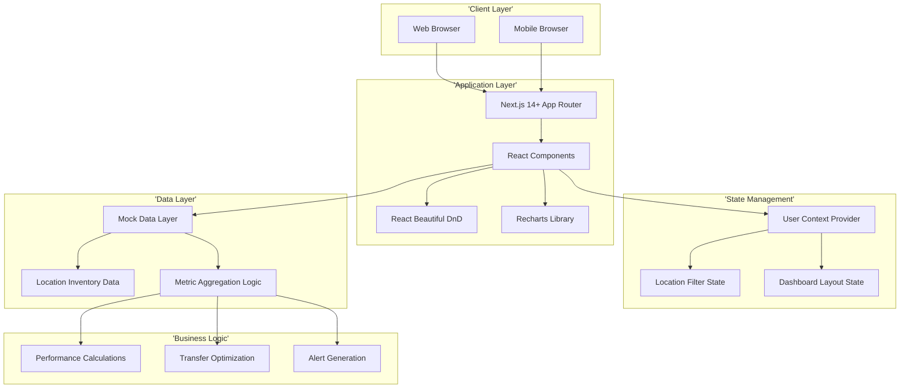
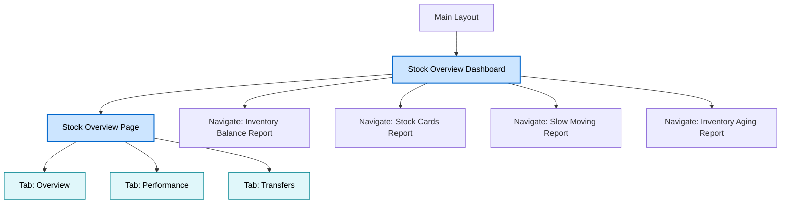
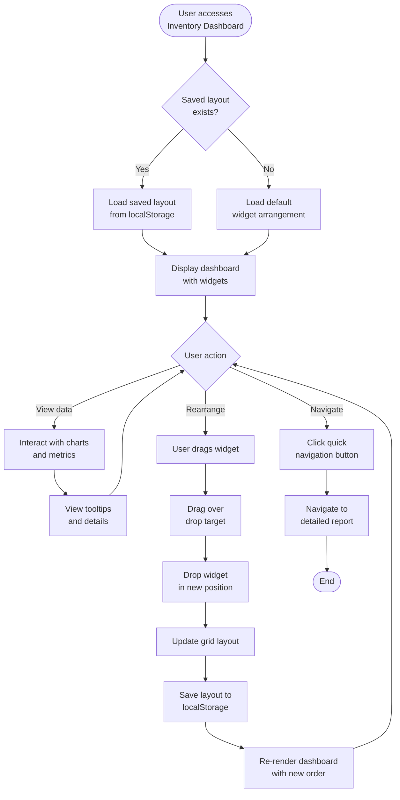
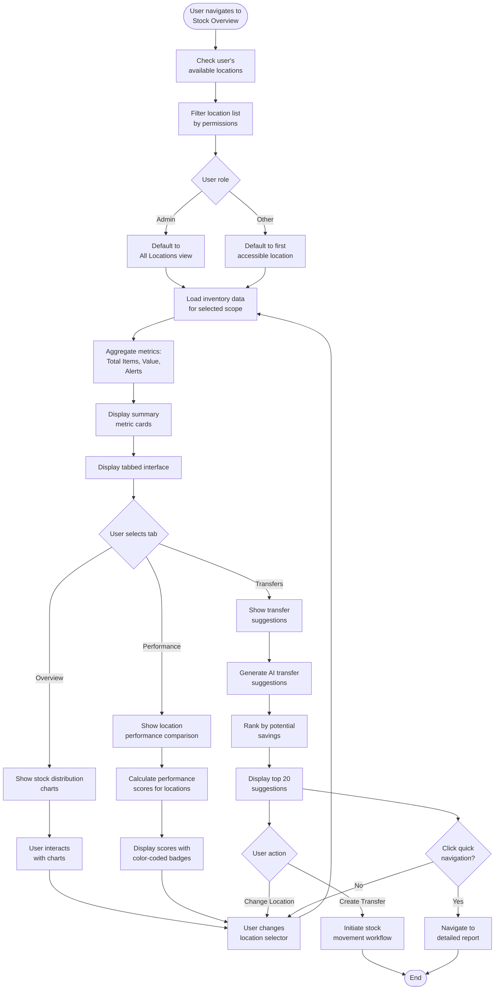
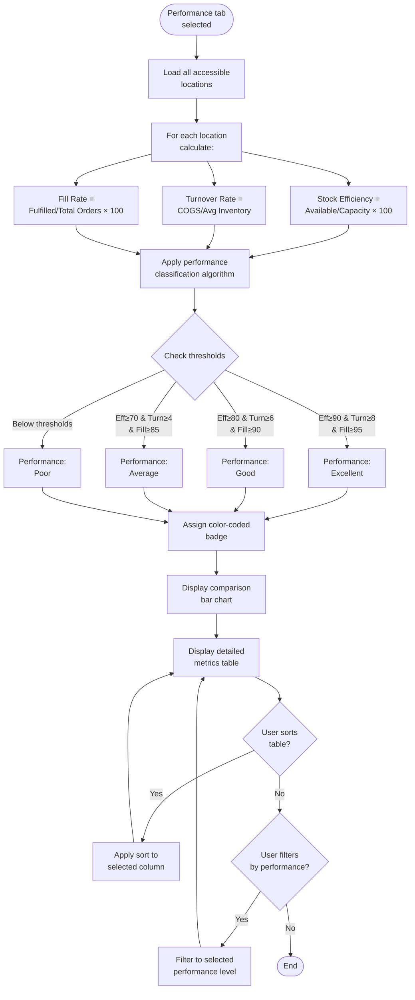
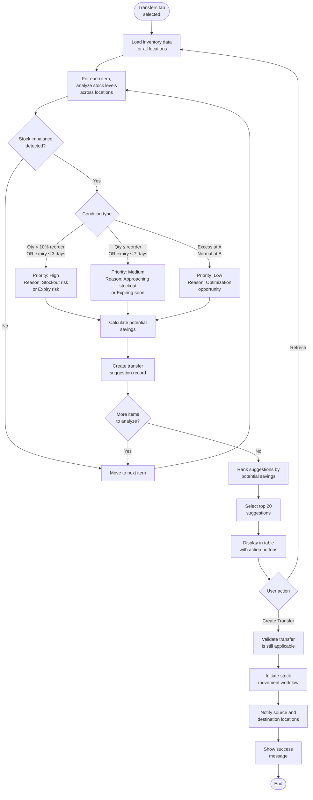

# Technical Specification: Stock Overview

## Module Information
- **Module**: Inventory Management
- **Sub-Module**: Stock Overview
- **Route**: `/inventory-management`
- **Version**: 1.0.0
- **Last Updated**: 2025-01-10
- **Owner**: Development Team
- **Status**: Active

## Document History
| Version | Date | Author | Changes |
|---------|------|--------|---------|
| 1.1.0 | 2025-12-10 | Documentation Team | Standardized reference number format (XXX-YYMM-NNNN) |
| 1.0.0 | 2025-01-10 | Development Team | Initial technical specification based on source code analysis |

---

## Overview

This document provides high-level technical implementation guidance for the Stock Overview sub-module within the Inventory Management module of the Carmen ERP system. It describes the architecture, page structure, navigation flows, component responsibilities, and integration patterns.

The Stock Overview module serves as the central command center for inventory operations, providing executive-level visibility across multiple hotel locations. It includes a customizable dashboard with drag-and-drop widgets, detailed stock analytics, multi-location filtering, performance metrics, and AI-powered transfer optimization suggestions.

**Related Documents**:
- [Business Requirements](./BR-stock-overview.md)
- [Use Cases](./UC-stock-overview.md)
- [Data Definition](./DS-stock-overview.md)
- [Flow Diagrams](./FD-stock-overview.md)
- [Validations](./VAL-stock-overview.md)

---

## Architecture

### High-Level System Architecture



### Component Architecture

The Stock Overview module follows a layered architecture:

- **Presentation Layer**: React components for dashboard widgets, charts, and data tables
- **State Management Layer**: User Context for role/department/location, Local State for dashboard layout
- **Business Logic Layer**: Metric aggregation, performance scoring, transfer optimization algorithms
- **Data Access Layer**: Mock data generators with location-based filtering
- **Visualization Layer**: Recharts for bar/line/pie charts, custom widgets

---

## Technology Stack

### Frontend Technologies
- **Framework**: Next.js 14+ with App Router pattern
- **UI Library**: React 18+
- **Styling**: Tailwind CSS with Shadcn/ui component library
- **Drag & Drop**: React Beautiful DnD for widget reordering
- **Charts**: Recharts library for data visualization (Bar, Line, Pie charts)
- **State Management**: User Context (role/department/location), Local State (dashboard layout)
- **Icons**: Lucide React
- **Date Handling**: date-fns library

### Backend Technologies
- **Runtime**: Node.js 20+
- **Server Framework**: Next.js Server Components
- **Data Layer**: Mock data generators (to be replaced with Supabase in production)
- **Business Logic**: Calculation functions for performance metrics and transfer suggestions

### Testing & DevOps
- **Unit Tests**: Vitest
- **E2E Tests**: Playwright
- **Version Control**: Git
- **CI/CD**: GitHub Actions
- **Hosting**: Vercel

---

## Page Structure & Navigation

### Page Hierarchy



### Main Pages

#### 1. Stock Overview Dashboard
**Route**: `/inventory-management`

**Purpose**: Provide executive-level overview of inventory operations with customizable dashboard widgets

**Layout Components**:
- **Page Header**: "Inventory Management" title with breadcrumb navigation
- **Dashboard Grid**: Draggable 3-column responsive grid (desktop), 2-column (tablet), 1-column (mobile)
- **Widget System**: 6 configurable widgets arranged via drag-and-drop
- **Persistence**: User's custom widget layout saved to local storage

**Dashboard Widgets**:

1. **Inventory Levels Widget** (Bar Chart)
   - Displays current inventory levels vs reorder points
   - Categories: Food, Beverages, Cleaning, Linen, Amenities
   - Interactive tooltips showing exact quantities
   - Visual indicators for low stock situations
   - Chart library: Recharts BarChart component

2. **Inventory Value Trend Widget** (Line Chart)
   - Shows 6-month inventory value trend (Jan-Jun)
   - Displays total inventory value in local currency
   - Trend direction visualization (increasing/decreasing)
   - Month-over-month change percentage
   - Chart library: Recharts LineChart component

3. **Inventory Turnover Widget** (Pie Chart)
   - Displays turnover rates by category
   - Visual breakdown of category distribution
   - Highlights low turnover (<4) and high turnover (>12) categories
   - Interactive tooltips with turnover calculations
   - Chart library: Recharts PieChart component

4. **Low Stock Alert Widget** (Text Card)
   - Count of items below reorder point
   - Red visual indicator for critical status
   - Click-through to detailed item list
   - Real-time alert count

5. **Expiring Soon Widget** (Text Card)
   - Count of items expiring within 7 days
   - Orange visual indicator for warning status
   - Click-through to detailed item list
   - Real-time alert count

6. **Quick Actions Widget** (Text Card)
   - Informational messages and system notifications
   - Customizable alert content
   - Call-to-action buttons

**Key Features**:
- Drag-and-drop widget reordering using React Beautiful DnD
- Persistent dashboard layout (localStorage)
- Responsive grid layout (1-3 columns based on screen size)
- All widgets render correctly in custom positions
- Widget rearrangement preserves functionality

**Technical Implementation**:
- Uses `DragDropContext`, `Droppable`, `Draggable` from react-beautiful-dnd
- Widget state managed with `useState` hook
- Layout persistence via `localStorage`
- Recharts `ResponsiveContainer` for responsive charts
- Grid system: CSS Grid with Tailwind utilities

---

#### 2. Stock Overview Page
**Route**: `/inventory-management/stock-overview`

**Purpose**: Detailed stock analysis with multi-location filtering, performance comparison, and transfer optimization

**Layout Sections**:

**Header Section**:
- Page title: "Stock Overview"
- Location selector dropdown (filters entire page)
- Auto-refresh indicator (data refreshes every 5 minutes)
- Export/Print action buttons

**Summary Metrics Cards** (4 cards):
1. **Total Items**: Count of unique inventory items
2. **Total Value**: Aggregate inventory value in local currency
3. **Low Stock**: Count of items at or below reorder point (red indicator)
4. **Expiring Soon**: Count of items expiring within 7 days (orange indicator)

**Tabbed Interface** (3 tabs):

1. **Overview Tab**
   - Stock Distribution Bar Chart (quantity by category)
   - Value Distribution Pie Chart (value percentage by category)
   - Interactive tooltips with formatted currency and quantities
   - Charts update when location selection changes
   - Responsive chart containers

2. **Performance Tab**
   - Location Performance Comparison Bar Chart
   - Metrics: Stock Efficiency, Turnover Rate, Fill Rate
   - Performance badges (Excellent/Good/Average/Poor) color-coded
   - Detailed metrics table with sortable columns
   - Performance classification algorithm (UC-INV-OVW-103)

3. **Transfers Tab**
   - AI-powered transfer suggestions table
   - Columns: Item, From Location, To Location, Suggested Qty, Reason, Priority, Potential Savings
   - Priority badges (High/Medium/Low) with color coding
   - Reasons: excess_stock, approaching_stockout, expiry_risk, demand_variance
   - "Create Transfer" action button per suggestion
   - Sorted by potential savings (highest first)

**Location Filtering Logic**:
- "All Locations" option aggregates data across accessible locations
- Individual location selection filters all metrics and charts
- Location dropdown filtered by user's `availableLocations` permissions
- System Administrator role bypasses location filtering
- Selected location persists during session

**Quick Navigation Section**:
- 4 icon-based navigation buttons in grid layout (4 columns desktop, 2 columns mobile)
- Buttons: Inventory Balance Report, Stock Cards Report, Slow Moving Report, Inventory Aging Report
- Each button includes icon and descriptive label
- Maintains selected location context when navigating

**Key Features**:
- Real-time data aggregation across multiple locations
- Location-based access control (user permissions enforced)
- Auto-refresh every 5 minutes with loading indicators
- Responsive design (mobile-first approach)
- Export capability for all data views
- Performance metrics calculated using standard hospitality formulas

**Technical Implementation**:
- Multi-location data aggregation algorithm (UC-INV-OVW-102)
- Performance scoring algorithm (UC-INV-OVW-103)
- Transfer optimization algorithm (UC-INV-OVW-104)
- Recharts library for all visualizations
- Tailwind CSS for responsive grid layouts
- User context integration for permission filtering

---

## Navigation Flow Diagrams

### Dashboard Customization Flow



### Multi-Location Stock Analysis Flow



### Performance Comparison Flow



### Transfer Suggestion Generation Flow



---

## Sitemap

### Overview
This section provides the complete navigation structure of all pages, tabs, and components in the Stock Overview sub-module. It documents the user workflows and interaction patterns for accessing executive-level inventory visibility and analytics.

### Enhanced Page Hierarchy

```mermaid
graph TD
    DashboardPage['Dashboard Page<br>(/inventory-management)']
    StockPage['Stock Overview Page<br>(/inventory-management/stock-overview)']

    %% Dashboard Components
    DashboardPage --> Widget1['Widget: Inventory Levels<br>(Bar Chart)']
    DashboardPage --> Widget2['Widget: Value Trend<br>(Line Chart)']
    DashboardPage --> Widget3['Widget: Turnover Analysis<br>(Pie Chart)']
    DashboardPage --> Widget4['Widget: Low Stock Alert<br>(Text Card)']
    DashboardPage --> Widget5['Widget: Expiring Soon<br>(Text Card)']
    DashboardPage --> Widget6['Widget: Quick Actions<br>(Text Card)']

    %% Stock Overview Tabs
    StockPage --> Tab1['Tab: Overview']
    StockPage --> Tab2['Tab: Performance']
    StockPage --> Tab3['Tab: Transfers']

    %% Tab 1 Components
    Tab1 --> Tab1Comp1['Component: Summary Cards']
    Tab1 --> Tab1Comp2['Component: Stock Distribution Chart']
    Tab1 --> Tab1Comp3['Component: Value Distribution Chart']

    %% Tab 2 Components
    Tab2 --> Tab2Comp1['Component: Performance Comparison Chart']
    Tab2 --> Tab2Comp2['Component: Metrics Table']
    Tab2 --> Tab2Comp3['Component: Performance Badges']

    %% Tab 3 Components
    Tab3 --> Tab3Comp1['Component: Transfer Suggestions Table']
    Tab3 --> Tab3Comp2['Component: Priority Indicators']
    Tab3 --> Tab3Comp3['Component: Create Transfer Actions']

    %% Navigation Targets
    DashboardPage -.-> Nav1['Navigate: Inventory Balance']
    DashboardPage -.-> Nav2['Navigate: Stock Cards']
    DashboardPage -.-> Nav3['Navigate: Slow Moving']
    DashboardPage -.-> Nav4['Navigate: Inventory Aging']

    StockPage -.-> Nav1
    StockPage -.-> Nav2
    StockPage -.-> Nav3
    StockPage -.-> Nav4

    style DashboardPage fill:#cce5ff,stroke:#0066cc,stroke-width:2px,color:#000
    style StockPage fill:#cce5ff,stroke:#0066cc,stroke-width:2px,color:#000
    style Tab1 fill:#e0f7fa,stroke:#00838f,stroke-width:1px,color:#000
    style Tab2 fill:#e0f7fa,stroke:#00838f,stroke-width:1px,color:#000
    style Tab3 fill:#e0f7fa,stroke:#00838f,stroke-width:1px,color:#000
```

### User Journey Maps

#### Journey 1: Executive Monitoring Daily Operations
**Actor**: General Manager
**Goal**: Monitor overall inventory status and identify issues
**Entry Point**: Main navigation → Inventory Management

**Steps**:
1. Access Inventory Management dashboard
2. Review summary widgets (stock levels, value trends, alerts)
3. Note low stock alert count (red indicator)
4. Click low stock alert to view detailed list
5. Review expiring items (orange indicator)
6. Check inventory turnover pie chart
7. Navigate to Stock Overview for detailed analysis

**Exit Point**: Detailed report or take corrective action

---

#### Journey 2: Multi-Location Stock Analysis
**Actor**: Purchasing Manager
**Goal**: Analyze stock distribution across multiple locations
**Entry Point**: Inventory Management → Stock Overview

**Steps**:
1. Navigate to Stock Overview page
2. Location selector defaults to "All Locations"
3. View summary cards (Total Items, Total Value, Alerts)
4. Select "Overview" tab to see stock distribution charts
5. Analyze bar chart (quantity distribution by category)
6. Analyze pie chart (value distribution by category)
7. Switch to "Performance" tab
8. Review location performance comparison
9. Identify underperforming locations (red/yellow badges)
10. Switch to "Transfers" tab
11. Review AI-powered transfer suggestions
12. Identify high-priority transfers (red priority badge)
13. Click "Create Transfer" for selected suggestion

**Exit Point**: Stock movement workflow initiated

---

#### Journey 3: Location-Specific Investigation
**Actor**: Store Manager
**Goal**: Investigate stock issues at specific location
**Entry Point**: Inventory Management → Stock Overview

**Steps**:
1. Navigate to Stock Overview page
2. Change location selector from "All Locations" to specific location
3. All metrics and charts update automatically
4. View location-specific summary cards
5. Check location's low stock count (if any)
6. Review location's expiring items (if any)
7. Navigate to "Performance" tab
8. View location's performance classification (Excellent/Good/Average/Poor)
9. Compare metrics with other locations
10. Navigate to quick navigation section
11. Click "Stock Cards" to view detailed transaction history

**Exit Point**: Detailed stock card report for investigation

---

#### Journey 4: Dashboard Customization
**Actor**: Financial Controller
**Goal**: Customize dashboard layout to prioritize financial metrics
**Entry Point**: Inventory Management dashboard

**Steps**:
1. Access Inventory Management dashboard
2. Existing layout loads from localStorage
3. Decide to prioritize Inventory Value Trend widget
4. Click and drag Value Trend widget to top-left position
5. Drag Turnover Analysis widget to top-right
6. Drag Low Stock Alert to middle-left
7. Release mouse to drop widget in new position
8. Grid automatically adjusts other widgets
9. New layout saves to localStorage
10. Refresh page to verify persistence
11. Customized layout loads correctly

**Exit Point**: Personalized dashboard for daily monitoring

---

## Component Descriptions

This section provides high-level descriptions of key components without implementation code, focusing on responsibilities, inputs, and outputs.

### Dashboard Components

#### DraggableDashboard Component
**File**: `app/(main)/inventory-management/page.tsx`
**Responsibility**: Orchestrate drag-and-drop dashboard with customizable widget layout
**Key Features**:
- Manages widget array state with drag-and-drop reordering
- Persists user's custom layout to localStorage
- Provides responsive grid (1-3 columns based on screen size)
- Wraps widgets in DragDropContext from react-beautiful-dnd

**Inputs**: None (loads from localStorage)
**Outputs**: Rendered dashboard with draggable widgets
**State Management**: Local state for widget array, localStorage for persistence

---

#### InventoryLevelsChart Component
**Responsibility**: Display bar chart comparing current inventory levels against reorder points
**Key Features**:
- 5 inventory categories (Food, Beverages, Cleaning, Linen, Amenities)
- Dual-bar visualization (current level vs reorder point)
- Interactive tooltips with exact quantities
- Visual highlighting for low stock situations

**Inputs**: Inventory level data by category
**Outputs**: Recharts BarChart visualization
**Chart Library**: Recharts BarChart with custom tooltip

---

#### ValueTrendChart Component
**Responsibility**: Display line chart showing 6-month inventory value trend
**Key Features**:
- Monthly data points (Jan-Jun)
- Trend direction visualization
- Total value display in local currency
- Month-over-month change calculation

**Inputs**: Monthly inventory value data
**Outputs**: Recharts LineChart visualization
**Chart Library**: Recharts LineChart with custom formatting

---

#### TurnoverPieChart Component
**Responsibility**: Display pie chart of inventory turnover rates by category
**Key Features**:
- Visual category breakdown
- Color-coded slices
- Turnover rate calculations
- Interactive tooltips with turnover formulas

**Inputs**: Turnover data by category
**Outputs**: Recharts PieChart visualization
**Chart Library**: Recharts PieChart with percentage labels

---

#### AlertCard Components (Low Stock, Expiring Soon)
**Responsibility**: Display critical inventory alerts with counts
**Key Features**:
- Color-coded indicators (red for low stock, orange for expiring)
- Alert count display
- Click-through to detailed item lists
- Real-time updates when data changes

**Inputs**: Alert counts from aggregated inventory data
**Outputs**: Styled card with count and visual indicator
**Interactions**: Click to navigate to detailed alert list

---

### Stock Overview Components

#### LocationSelector Component
**Responsibility**: Filter entire Stock Overview page by selected location
**Key Features**:
- Dropdown with all accessible locations
- "All Locations" option for aggregate view
- Permission-based filtering (user's availableLocations)
- Persists selection during session

**Inputs**: User permissions, available locations list
**Outputs**: Selected location ID or "all"
**State Management**: Local state, triggers page-wide data refresh

---

#### SummaryMetricsCards Component
**Responsibility**: Display 4 summary metric cards with aggregated data
**Key Features**:
- Total Items count
- Total Value in local currency
- Low Stock count (red indicator if >0)
- Expiring Soon count (orange indicator if >0)

**Inputs**: Aggregated metrics based on location filter
**Outputs**: 4 styled metric cards in grid layout
**Updates**: Re-renders when location selection changes

---

#### StockDistributionChart Component
**Responsibility**: Display bar chart of stock quantities by category
**Key Features**:
- Quantity distribution across 5 categories
- Formatted quantity labels
- Interactive tooltips
- Responsive container

**Inputs**: Aggregated quantity data by category
**Outputs**: Recharts BarChart visualization
**Chart Library**: Recharts BarChart with custom axis formatting

---

#### ValueDistributionChart Component
**Responsibility**: Display pie chart of inventory value distribution by category
**Key Features**:
- Value percentage by category
- Currency-formatted tooltips
- Color-coded slices
- Percentage labels on slices

**Inputs**: Aggregated value data by category
**Outputs**: Recharts PieChart visualization
**Chart Library**: Recharts PieChart with percentage calculations

---

#### PerformanceComparisonChart Component
**Responsibility**: Display bar chart comparing location performance metrics
**Key Features**:
- 3 metrics per location (Stock Efficiency, Turnover Rate, Fill Rate)
- Grouped bar chart visualization
- Performance badges (Excellent/Good/Average/Poor)
- Color-coded bars by performance level

**Inputs**: Performance metrics for all locations
**Outputs**: Recharts BarChart with performance classifications
**Business Logic**: Uses performance classification algorithm (BR-INV-OVW-003)

---

#### TransferSuggestionsTable Component
**Responsibility**: Display AI-powered transfer suggestions with actions
**Key Features**:
- Table with 8 columns (Item, From, To, Qty, Reason, Priority, Savings, Action)
- Priority badges (High/Medium/Low) with color coding
- Reason tags (excess_stock, approaching_stockout, expiry_risk, demand_variance)
- "Create Transfer" action button per row
- Sorted by potential savings descending

**Inputs**: Transfer suggestions from optimization algorithm
**Outputs**: Interactive data table with action buttons
**Business Logic**: Uses transfer priority calculation (BR-INV-OVW-004)

---

#### QuickNavigationButtons Component
**Responsibility**: Provide quick access to detailed inventory reports
**Key Features**:
- 4 icon-based navigation buttons
- Grid layout (4 columns desktop, 2 columns mobile)
- Maintains location context when navigating
- Reports: Inventory Balance, Stock Cards, Slow Moving, Inventory Aging

**Inputs**: Current location selection
**Outputs**: Navigation button grid
**Navigation**: Links preserve location filter in query params

---

## Business Logic Descriptions

This section describes key algorithms and calculation methods without implementation code.

### Metric Aggregation Algorithm
**Function**: `getAggregateMetrics()`
**Purpose**: Aggregate inventory metrics across selected location(s)
**Process**:
1. Filter location data based on user permissions
2. Apply location selection filter ("all" or specific location)
3. Sum total items across filtered locations
4. Calculate total value by summing (quantity × unit cost) for all items
5. Count low stock items where quantityOnHand ≤ reorderPoint
6. Count expiring items where expiryDate ≤ today + 7 days
7. Return aggregated metrics object

**Inputs**: Selected location, user permissions
**Outputs**: Object with totalItems, totalValue, lowStockCount, expiringCount

---

### Performance Classification Algorithm
**Function**: `classifyLocationPerformance()`
**Purpose**: Classify location performance based on weighted metrics
**Business Rules** (BR-INV-OVW-003):
- **Excellent**: Stock Efficiency ≥ 90% AND Turnover ≥ 8 AND Fill Rate ≥ 95%
- **Good**: Stock Efficiency ≥ 80% AND Turnover ≥ 6 AND Fill Rate ≥ 90%
- **Average**: Stock Efficiency ≥ 70% AND Turnover ≥ 4 AND Fill Rate ≥ 85%
- **Poor**: Below average thresholds

**Metric Calculations**:
- Stock Efficiency = (Inventory Available / Total Capacity) × 100
- Turnover Rate = Cost of Goods Sold / Average Inventory Value
- Fill Rate = (Orders Fulfilled / Total Orders) × 100

**Inputs**: Location inventory data, order fulfillment data
**Outputs**: Performance classification string and color badge

---

### Transfer Suggestion Algorithm
**Function**: `generateTransferSuggestions()`
**Purpose**: Generate AI-powered stock transfer recommendations
**Process**:
1. Load inventory data for all accessible locations
2. For each inventory item, analyze stock levels across all location pairs
3. Identify imbalances using business rules:
   - **High Priority**: Quantity < 10% of reorder point OR expiry within 3 days
   - **Medium Priority**: Quantity ≤ reorder point OR expiry within 7 days
   - **Low Priority**: Excess at Location A, normal level at Location B
4. Calculate suggested transfer quantity (min of excess and shortage)
5. Calculate potential savings (waste prevention, expedited shipping avoidance)
6. Assign reason code (excess_stock, approaching_stockout, expiry_risk, demand_variance)
7. Rank suggestions by potential savings (descending)
8. Return top 20 suggestions

**Inputs**: Multi-location inventory data
**Outputs**: Array of transfer suggestion objects
**Business Rules**: BR-INV-OVW-004 (Transfer Priority Calculation)

---

### Chart Data Aggregation
**Function**: `aggregateChartData()`
**Purpose**: Aggregate inventory data for chart visualization
**Business Rules** (BR-INV-OVW-006):
- **Quantities**: Simple summation across locations
- **Values**: Sum of (quantity × unit cost) across locations
- **Averages**: Weighted average based on quantities

**Process**:
1. Filter data based on location selection
2. Group items by category (Food, Beverages, Cleaning, Linen, Amenities)
3. For each category:
   - Sum quantities across locations
   - Sum values (quantity × unit cost) across locations
   - Calculate weighted average cost
4. Format data for Recharts consumption
5. Return chart-ready data structure

**Inputs**: Filtered inventory data, location selection
**Outputs**: Chart-ready data arrays for Bar/Line/Pie charts

---

## Integration Points

### User Context Integration
**Context Provider**: `lib/context/user-context.tsx`
**Purpose**: Provide user role, department, location permissions
**Integration Points**:
- Location filtering based on `user.availableLocations`
- System Administrator bypass for location restrictions
- Role-based feature access control
- Department-based data filtering

**Usage in Stock Overview**:
- Filter location dropdown options
- Control access to create transfer functionality
- Determine which metrics are visible
- Apply row-level security for data access

---

### Mock Data Layer Integration
**Data Source**: `lib/mock-data/location-inventory.ts`
**Purpose**: Provide simulated multi-location inventory data
**Key Functions**:
- `getAllLocationStock()`: Returns inventory data for all locations
- `getLocationStock(locationId)`: Returns data for specific location
- `generateTransferSuggestions()`: Returns AI-generated suggestions
- `getAggregateMetrics()`: Returns aggregated metrics

**Data Structure**:
- Location-specific stock balances
- Item details with categories
- Real-time inventory levels
- Expiry dates and batch information
- Performance metrics per location

**Future Migration**: Will be replaced with Supabase database queries

---

### Navigation Integration
**Navigation Component**: `components/Sidebar.tsx`
**Integration Points**:
- "Inventory Management" menu item links to `/inventory-management`
- Submenu items:
  - "Dashboard" → `/inventory-management` (dashboard page)
  - "Stock Overview" → `/inventory-management/stock-overview`
  - Other inventory sub-modules

**Quick Navigation Buttons**:
- Inventory Balance → `/inventory-management/reports/inventory-balance`
- Stock Cards → `/inventory-management/reports/stock-cards`
- Slow Moving → `/inventory-management/reports/slow-moving`
- Inventory Aging → `/inventory-management/reports/inventory-aging`

**Context Preservation**: Selected location passed as query parameter

---

### Chart Library Integration
**Library**: Recharts (recharts.org)
**Components Used**:
- `BarChart` with `Bar`, `XAxis`, `YAxis`, `Tooltip`, `Legend`
- `LineChart` with `Line`, `XAxis`, `YAxis`, `Tooltip`, `CartesianGrid`
- `PieChart` with `Pie`, `Cell`, `Tooltip`, `Legend`
- `ResponsiveContainer` for responsive sizing

**Custom Configuration**:
- Custom color schemes per chart type
- Formatted tooltips with currency and quantity
- Custom axis labels and tick formatters
- Responsive dimensions based on container

**Data Format**: Arrays of objects with specific key-value structures for each chart type

---

### Drag-and-Drop Integration
**Library**: React Beautiful DnD (react-beautiful-dnd)
**Components Used**:
- `DragDropContext` wrapper for dashboard
- `Droppable` container for widget grid
- `Draggable` wrapper for individual widgets

**Event Handlers**:
- `onDragEnd`: Reorders widget array and saves to localStorage
- `onDragStart`: Visual feedback for drag operation
- `onDragUpdate`: Preview of drop position

**Persistence**:
- Save layout to localStorage on drag end
- Load layout on component mount
- Fallback to default layout if no saved layout

---

### State Management Integration
**Global State**: User Context (role, department, location)
**Local State**:
- Dashboard widget order (useState + localStorage)
- Selected location filter (useState)
- Tab selection (useState)
- Loading states (useState)

**Data Fetching**:
- Currently: Synchronous mock data access
- Future: React Query for async Supabase queries with caching

---

### Responsive Design Integration
**Framework**: Tailwind CSS
**Breakpoints**:
- Mobile: 1 column grid, collapsed sidebar
- Tablet: 2 column grid, collapsible sidebar
- Desktop: 3 column grid, expanded sidebar

**Responsive Components**:
- Dashboard grid adjusts column count
- Charts use ResponsiveContainer
- Tables switch to card view on mobile
- Navigation buttons adjust grid layout
- Metric cards stack vertically on small screens

**Mobile-First Approach**: Base styles for mobile, media queries for larger screens

---

## Performance Considerations

### Data Loading Strategy
- **Initial Load**: Load all accessible location data on mount
- **Auto-Refresh**: Refresh data every 5 minutes (configurable)
- **Loading States**: Display skeleton loaders during data fetch
- **Error States**: Graceful error handling with retry options

### Optimization Techniques
- **Memoization**: Use `useMemo` for expensive calculations (aggregations, sorting)
- **Callback Optimization**: Use `useCallback` for event handlers
- **Lazy Loading**: Defer chart rendering until tab is active
- **Virtualization**: Future enhancement for large data tables

### Caching Strategy
- **localStorage**: Dashboard layout persistence
- **Session Storage**: Location selection during session
- **Future**: React Query cache for API responses

### Bundle Optimization
- **Code Splitting**: Lazy load Recharts library
- **Tree Shaking**: Import only used Recharts components
- **Responsive Images**: Optimize any icon/image assets

---

## Security Considerations

### Access Control
- **Location-Based Access**: Filter data by user's availableLocations array
- **Role-Based Features**: Certain actions limited by user role
- **System Administrator Bypass**: Admins can access all locations
- **Department Filtering**: Department-specific data visibility

### Data Protection
- **No Sensitive Data Exposure**: Mock data contains no real financial information
- **Permission Validation**: Server-side validation of user permissions
- **Audit Trail**: Activity logging for all inventory operations (future)

### Input Validation
- **Location Selection**: Validate location is in user's accessible list
- **Transfer Creation**: Validate transfer feasibility before creation
- **Date Ranges**: Validate date inputs for filtering

---

## Future Enhancements

### Planned Features
1. **Real-time Updates**: WebSocket integration for live inventory updates
2. **Advanced Filtering**: More granular filtering options (category, supplier, ABC class)
3. **Custom Alerts**: User-configurable alert thresholds and notifications
4. **Export Functionality**: Export charts and data to Excel/PDF
5. **Mobile App**: Native mobile application for on-the-go inventory monitoring
6. **Predictive Analytics**: Machine learning for demand forecasting and optimization

### Database Migration
- Replace mock data with Supabase PostgreSQL
- Implement Row-Level Security (RLS) policies
- Add database triggers for real-time updates
- Optimize queries with proper indexing

### API Integration
- RESTful API endpoints for inventory operations
- GraphQL for flexible data queries
- Webhook support for third-party integrations

---

## Appendices

### Appendix A: File Structure

```
app/(main)/inventory-management/
├── page.tsx                          # Dashboard with draggable widgets
├── stock-overview/
│   └── page.tsx                      # Stock Overview with tabs
└── reports/                          # Future: Detailed report pages
    ├── inventory-balance/
    ├── stock-cards/
    ├── slow-moving/
    └── inventory-aging/

lib/
├── types/
│   └── inventory.ts                  # TypeScript interfaces
├── mock-data/
│   └── location-inventory.ts         # Mock data and calculations
└── context/
    └── user-context.tsx              # User permissions context
```

### Appendix B: TypeScript Interfaces

Key interfaces defined in `lib/types/inventory.ts`:

- `InventoryItem`: Core inventory item definition
- `StockBalance`: Stock balance at specific location
- `CostingMethod`: Enum (FIFO, PERIODIC_AVERAGE)
- `TransactionType`: Enum for inventory transactions
- `InventoryAlert`: Alert definitions
- `InventoryAlertType`: Enum for alert types

(See DS-stock-overview.md for complete interface definitions)

### Appendix C: Chart Data Formats

**Bar Chart Data** (Inventory Levels):
```
Array of objects with:
- category: string (Food, Beverages, etc.)
- currentLevel: number
- reorderPoint: number
```

**Line Chart Data** (Value Trend):
```
Array of objects with:
- month: string (Jan, Feb, etc.)
- value: number (currency amount)
```

**Pie Chart Data** (Turnover):
```
Array of objects with:
- category: string
- turnoverRate: number
- percentage: number
```

### Appendix D: Color Coding Standards

**Performance Levels**:
- Excellent: Green (#10b981)
- Good: Blue (#3b82f6)
- Average: Yellow (#f59e0b)
- Poor: Red (#ef4444)

**Alert Indicators**:
- Critical (Low Stock): Red (#ef4444)
- Warning (Expiring): Orange (#f97316)
- Info: Blue (#3b82f6)

**Transfer Priority**:
- High: Red badge
- Medium: Yellow badge
- Low: Gray badge

---

**Document Control**

| Version | Date | Author | Changes |
|---------|------|--------|------------|
| 1.0.0 | 2025-01-10 | Development Team | Initial technical specification based on source code analysis |
