# Flow Diagrams: Inventory Aging

## Document Information
| Field | Value |
|-------|-------|
| Module | Inventory Management |
| Sub-module | Inventory Aging |
| Version | 1.0 |
| Last Updated | 2024-01-15 |

---

## 1. Page Load Flow

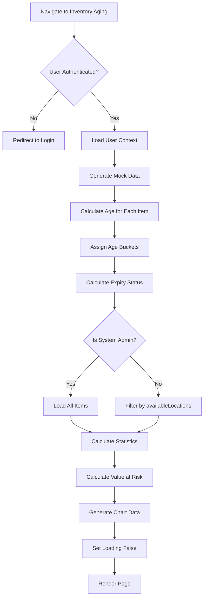

---

## 2. Age Calculation Flow

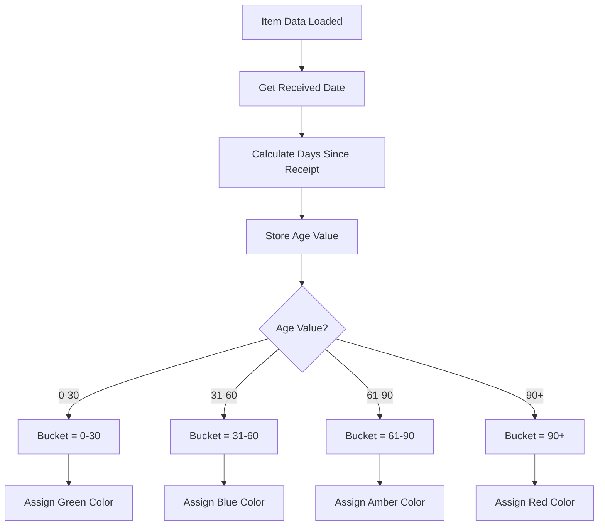

---

## 3. Expiry Status Calculation Flow

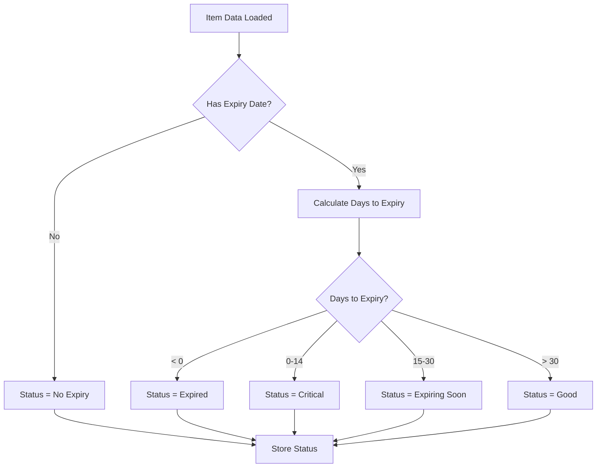

---

## 4. Value at Risk Calculation Flow

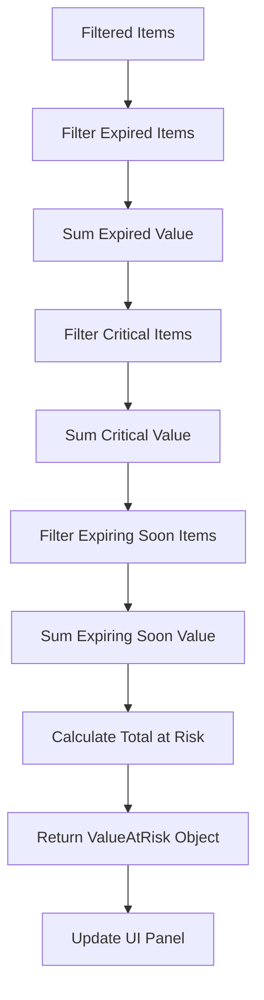

---

## 5. Filter Application Flow

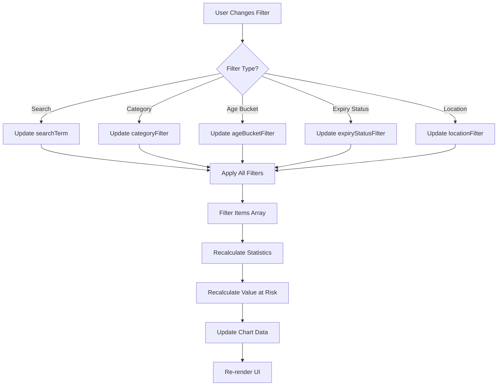

---

## 6. Tab Navigation Flow

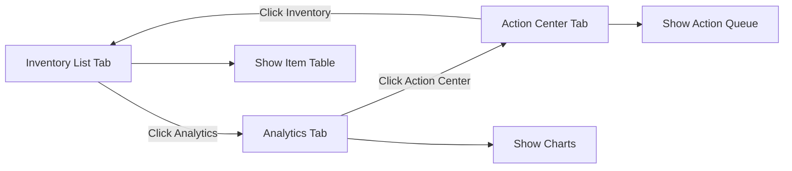

---

## 7. Group By Selection Flow

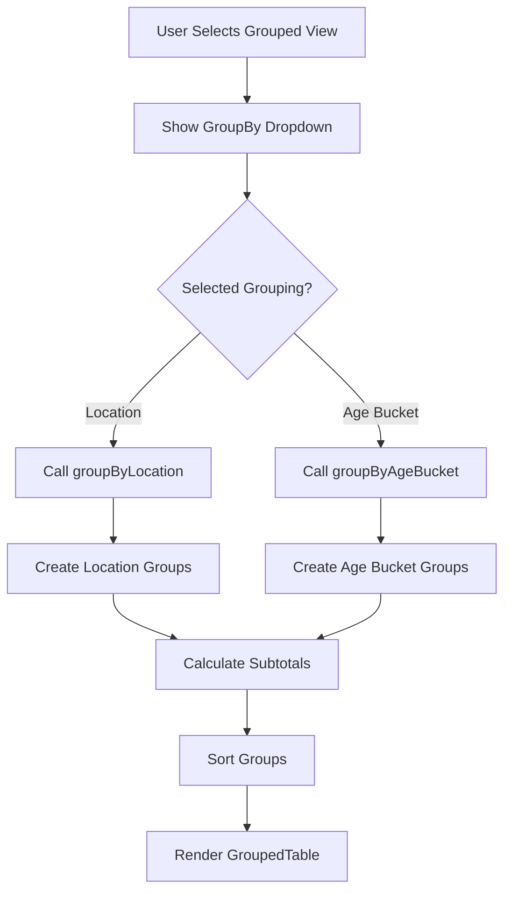

---

## 8. Group by Location Flow

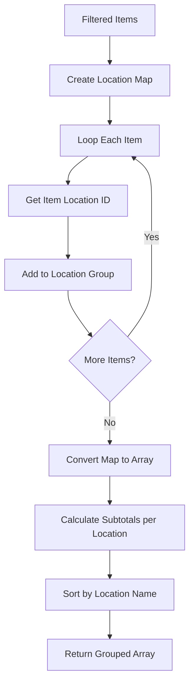

---

## 9. Group by Age Bucket Flow

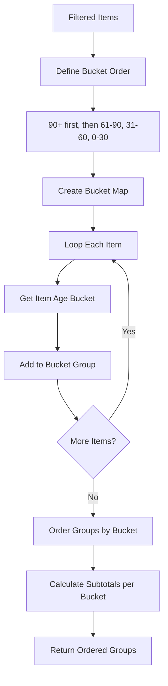

---

## 10. Analytics Chart Generation Flow

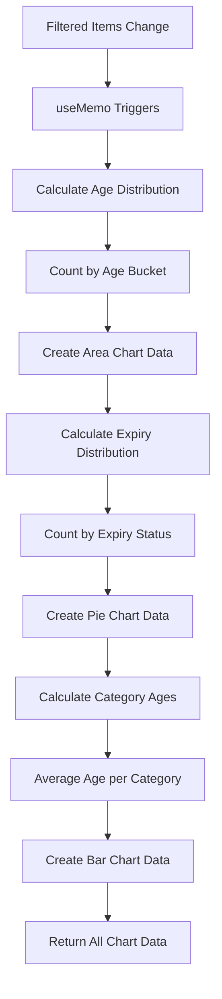

---

## 11. Action Center Priority Flow

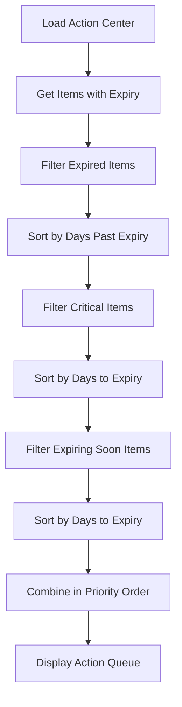

---

## 12. Disposal Action Flow

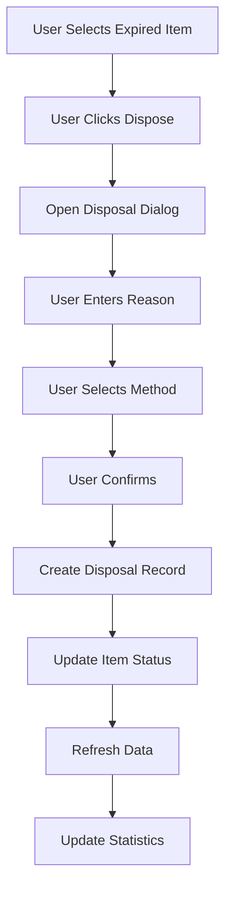

---

## 13. FIFO Transfer Flow

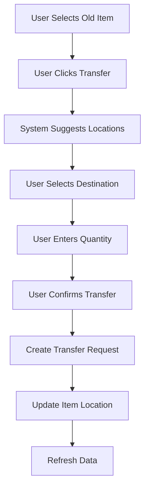

---

## 14. Summary Statistics Update Flow

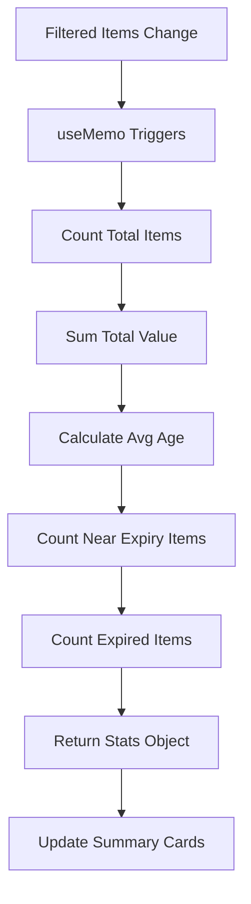

---

## 15. Permission Check Flow

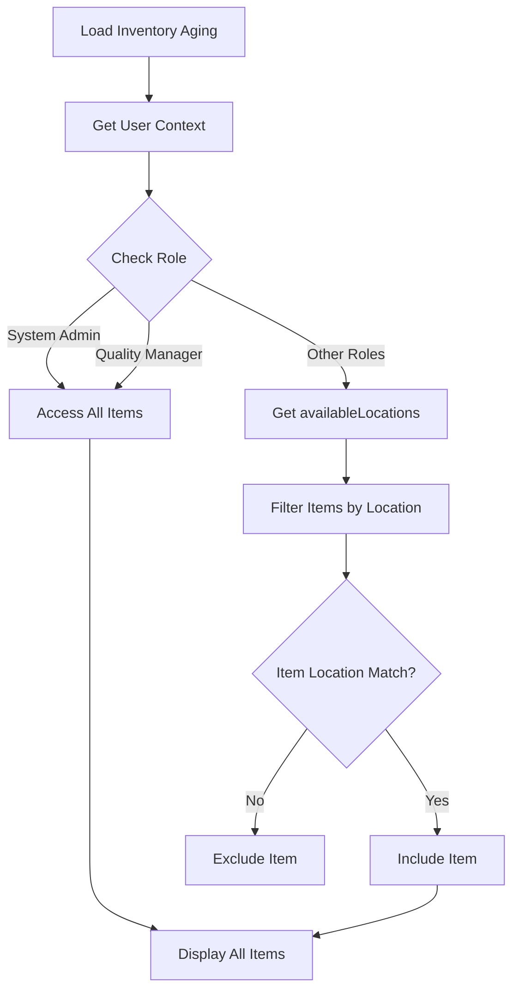

---

## 16. Expiry Status Chart Flow

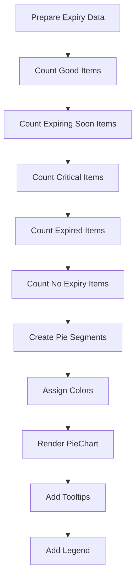
