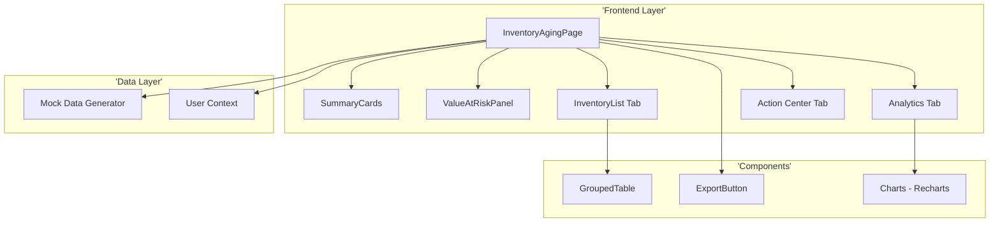
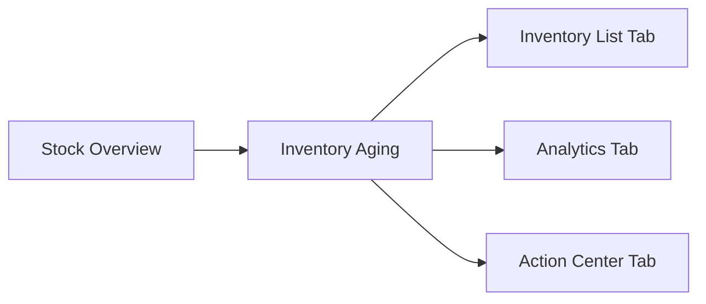
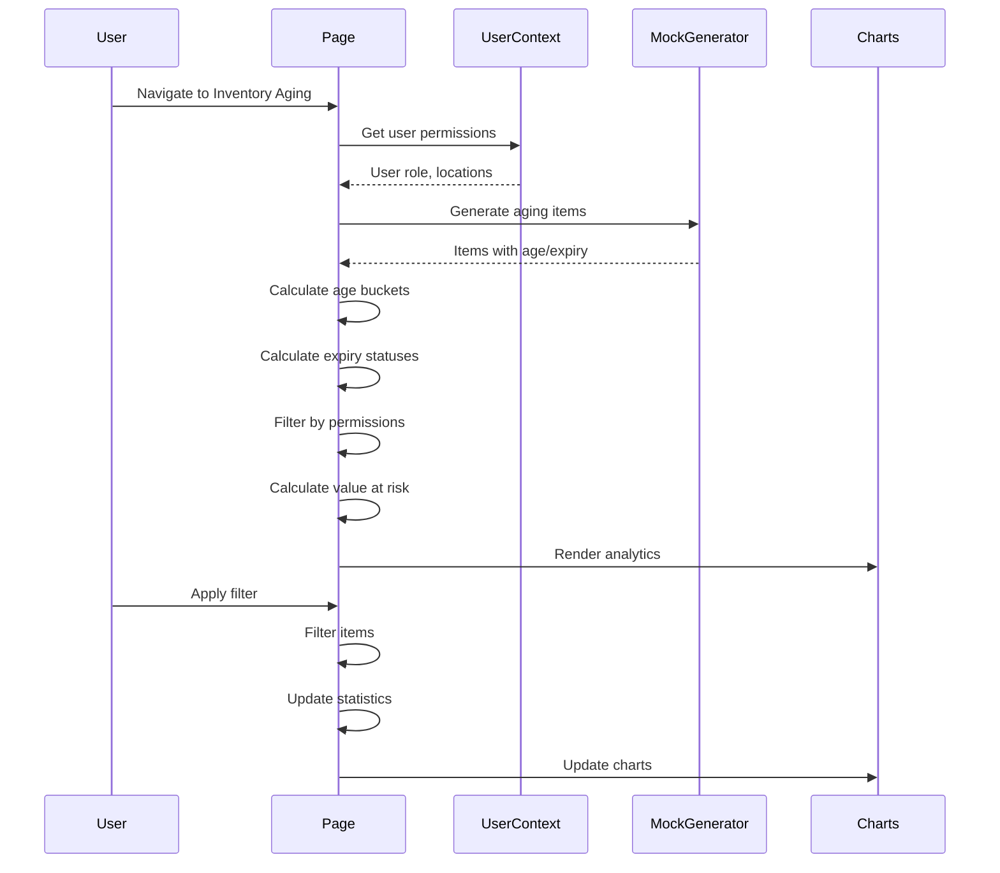

# Technical Specification: Inventory Aging

## Document Information
| Field | Value |
|-------|-------|
| Module | Inventory Management |
| Sub-module | Inventory Aging |
| Version | 1.0 |
| Last Updated | 2024-01-15 |

---

## 1. System Architecture



---

## 2. Page Hierarchy



**Route**: `/inventory-management/stock-overview/inventory-aging`

---

## 3. Component Architecture

### 3.1 Page Component

**File**: `app/(main)/inventory-management/stock-overview/inventory-aging/page.tsx`

**State Management**:
```typescript
const [isLoading, setIsLoading] = useState(true)
const [searchTerm, setSearchTerm] = useState('')
const [categoryFilter, setCategoryFilter] = useState('all')
const [ageBucketFilter, setAgeBucketFilter] = useState('all')
const [expiryStatusFilter, setExpiryStatusFilter] = useState('all')
const [locationFilter, setLocationFilter] = useState('all')
const [viewMode, setViewMode] = useState<'list' | 'grouped'>('list')
const [groupBy, setGroupBy] = useState<'location' | 'ageBucket'>('location')
const [agingItems, setAgingItems] = useState<AgingItem[]>([])
const [groupedItems, setGroupedItems] = useState<GroupedData[]>([])
```

---

## 4. Type Definitions

### 4.1 Aging Item
```typescript
interface AgingItem {
  id: string
  code: string
  name: string
  category: string
  unit: string
  lotNumber: string
  receivedDate: string
  age: number
  ageBucket: '0-30' | '31-60' | '61-90' | '90+'
  expiryDate: string | null
  daysToExpiry: number | null
  expiryStatus: 'good' | 'expiring-soon' | 'critical' | 'expired' | 'no-expiry'
  quantity: number
  value: number
  location: {
    id: string
    name: string
  }
}
```

### 4.2 Age Bucket Type
```typescript
type AgeBucket = '0-30' | '31-60' | '61-90' | '90+'

const AGE_BUCKETS: Record<AgeBucket, { label: string; color: string; range: string }> = {
  '0-30': { label: '0-30 Days', color: 'green', range: 'Fresh' },
  '31-60': { label: '31-60 Days', color: 'blue', range: 'Normal' },
  '61-90': { label: '61-90 Days', color: 'amber', range: 'Aging' },
  '90+': { label: '90+ Days', color: 'red', range: 'Old' }
}
```

### 4.3 Expiry Status Type
```typescript
type ExpiryStatus = 'good' | 'expiring-soon' | 'critical' | 'expired' | 'no-expiry'

const EXPIRY_STATUSES: Record<ExpiryStatus, { label: string; color: string; days: string }> = {
  'good': { label: 'Good', color: 'green', days: '> 30 days' },
  'expiring-soon': { label: 'Expiring Soon', color: 'amber', days: '15-30 days' },
  'critical': { label: 'Critical', color: 'orange', days: '< 15 days' },
  'expired': { label: 'Expired', color: 'red', days: 'Past expiry' },
  'no-expiry': { label: 'No Expiry', color: 'gray', days: 'N/A' }
}
```

### 4.4 Value at Risk
```typescript
interface ValueAtRisk {
  expired: number
  critical: number
  expiringSoon: number
  total: number
}
```

---

## 5. Age & Expiry Calculation Logic

### 5.1 Age Calculation
```typescript
const calculateAge = (receivedDate: string): number => {
  const received = new Date(receivedDate)
  const today = new Date()
  const diffTime = Math.abs(today.getTime() - received.getTime())
  return Math.ceil(diffTime / (1000 * 60 * 60 * 24))
}

const getAgeBucket = (age: number): AgeBucket => {
  if (age <= 30) return '0-30'
  if (age <= 60) return '31-60'
  if (age <= 90) return '61-90'
  return '90+'
}
```

### 5.2 Expiry Status Calculation
```typescript
const calculateExpiryStatus = (expiryDate: string | null): ExpiryStatus => {
  if (!expiryDate) return 'no-expiry'

  const expiry = new Date(expiryDate)
  const today = new Date()
  const daysUntilExpiry = differenceInDays(expiry, today)

  if (daysUntilExpiry < 0) return 'expired'
  if (daysUntilExpiry < 15) return 'critical'
  if (daysUntilExpiry <= 30) return 'expiring-soon'
  return 'good'
}

const calculateDaysToExpiry = (expiryDate: string | null): number | null => {
  if (!expiryDate) return null
  return differenceInDays(new Date(expiryDate), new Date())
}
```

---

## 6. Data Flow



---

## 7. Summary Statistics Calculation

```typescript
const summaryStats = useMemo(() => {
  const totalItems = filteredItems.length
  const totalValue = filteredItems.reduce((sum, item) => sum + item.value, 0)
  const avgAge = filteredItems.reduce((sum, item) => sum + item.age, 0) / totalItems || 0

  const nearExpiry = filteredItems.filter(item =>
    item.expiryStatus === 'expiring-soon' || item.expiryStatus === 'critical'
  ).length

  const expiredItems = filteredItems.filter(item =>
    item.expiryStatus === 'expired'
  ).length

  return {
    totalItems,
    totalValue,
    avgAge: Math.round(avgAge),
    nearExpiry,
    expiredItems
  }
}, [filteredItems])
```

---

## 8. Value at Risk Calculation

```typescript
const valueAtRisk = useMemo((): ValueAtRisk => {
  const expired = filteredItems
    .filter(item => item.expiryStatus === 'expired')
    .reduce((sum, item) => sum + item.value, 0)

  const critical = filteredItems
    .filter(item => item.expiryStatus === 'critical')
    .reduce((sum, item) => sum + item.value, 0)

  const expiringSoon = filteredItems
    .filter(item => item.expiryStatus === 'expiring-soon')
    .reduce((sum, item) => sum + item.value, 0)

  return {
    expired,
    critical,
    expiringSoon,
    total: expired + critical + expiringSoon
  }
}, [filteredItems])
```

---

## 9. Chart Data Preparation

### 9.1 Age Distribution Data
```typescript
const ageDistributionData = useMemo(() => {
  const distribution = filteredItems.reduce((acc, item) => {
    acc[item.ageBucket] = (acc[item.ageBucket] || 0) + 1
    return acc
  }, {} as Record<AgeBucket, number>)

  return Object.entries(distribution).map(([bucket, count]) => ({
    bucket,
    count,
    color: AGE_BUCKETS[bucket as AgeBucket].color
  }))
}, [filteredItems])
```

### 9.2 Expiry Status Data
```typescript
const expiryStatusData = useMemo(() => {
  const distribution = filteredItems.reduce((acc, item) => {
    acc[item.expiryStatus] = (acc[item.expiryStatus] || 0) + 1
    return acc
  }, {} as Record<ExpiryStatus, number>)

  return Object.entries(distribution).map(([status, count]) => ({
    name: EXPIRY_STATUSES[status as ExpiryStatus].label,
    value: count,
    color: EXPIRY_STATUSES[status as ExpiryStatus].color
  }))
}, [filteredItems])
```

### 9.3 Category Age Data
```typescript
const categoryAgeData = useMemo(() => {
  const categoryGroups = filteredItems.reduce((acc, item) => {
    if (!acc[item.category]) {
      acc[item.category] = { totalAge: 0, count: 0 }
    }
    acc[item.category].totalAge += item.age
    acc[item.category].count += 1
    return acc
  }, {} as Record<string, { totalAge: number; count: number }>)

  return Object.entries(categoryGroups)
    .map(([category, data]) => ({
      category,
      avgAge: Math.round(data.totalAge / data.count)
    }))
    .sort((a, b) => b.avgAge - a.avgAge)
}, [filteredItems])
```

---

## 10. Grouping Logic

### 10.1 Group by Location
```typescript
const groupByLocation = (items: AgingItem[]): GroupedData[] => {
  const locationMap = new Map<string, AgingItem[]>()

  items.forEach(item => {
    const key = item.location.id
    if (!locationMap.has(key)) {
      locationMap.set(key, [])
    }
    locationMap.get(key)!.push(item)
  })

  return Array.from(locationMap.entries()).map(([locationId, items]) => ({
    groupId: locationId,
    groupName: items[0].location.name,
    items: items.sort((a, b) => b.age - a.age),
    subtotals: calculateSubtotals(items),
    isExpanded: false
  }))
}
```

### 10.2 Group by Age Bucket
```typescript
const groupByAgeBucket = (items: AgingItem[]): GroupedData[] => {
  const bucketOrder = ['90+', '61-90', '31-60', '0-30']
  const bucketMap = new Map<string, AgingItem[]>()

  items.forEach(item => {
    const key = item.ageBucket
    if (!bucketMap.has(key)) {
      bucketMap.set(key, [])
    }
    bucketMap.get(key)!.push(item)
  })

  return bucketOrder
    .filter(bucket => bucketMap.has(bucket))
    .map(bucket => ({
      groupId: bucket,
      groupName: AGE_BUCKETS[bucket as AgeBucket].label,
      items: bucketMap.get(bucket)!.sort((a, b) => b.age - a.age),
      subtotals: calculateSubtotals(bucketMap.get(bucket)!),
      isExpanded: false
    }))
}
```

---

## 11. Component Tree

```
InventoryAgingPage
├── PageHeader
│   ├── BackLink
│   ├── Title with Icon
│   └── Description
├── ActionBar
│   ├── ViewModeToggle (List/Grouped)
│   ├── GroupBySelect (when grouped)
│   ├── ExportButton
│   └── RefreshButton
├── SummaryCards (6 cards)
│   ├── TotalItems
│   ├── TotalValue
│   ├── AverageAge
│   ├── NearExpiry
│   ├── ExpiredItems
│   └── ValueAtRisk
├── ValueAtRiskPanel
│   ├── ExpiredValue
│   ├── CriticalValue
│   ├── ExpiringSoonValue
│   └── TotalAtRisk
├── MainContent (Card with Tabs)
│   ├── TabsList
│   │   ├── Inventory List
│   │   ├── Analytics
│   │   └── Action Center
│   ├── InventoryListTab
│   │   ├── FilterBar
│   │   └── DataTable or GroupedTable
│   ├── AnalyticsTab
│   │   ├── AgeDistributionChart
│   │   ├── ExpiryStatusChart
│   │   ├── CategoryAgeChart
│   │   └── ValueAtRiskBreakdown
│   └── ActionCenterTab
│       ├── ExpiredItemsQueue
│       ├── CriticalItemsQueue
│       ├── FIFORecommendations
│       └── ActionButtons
└── Footer
    └── RecordCount
```

---

## 12. Third-Party Libraries

| Library | Version | Usage |
|---------|---------|-------|
| Recharts | ^2.x | AreaChart, PieChart, BarChart, ComposedChart |
| lucide-react | ^0.x | Icons |
| shadcn/ui | ^0.x | Card, Table, Badge, Progress, Tabs, Alert |
| date-fns | ^2.x | Date calculations (differenceInDays) |

---

## 13. Badge Rendering

### 13.1 Age Bucket Badge
```typescript
const renderAgeBucketBadge = (bucket: AgeBucket) => {
  const config = AGE_BUCKETS[bucket]
  return (
    <Badge className={`bg-${config.color}-100 text-${config.color}-800`}>
      {config.label}
    </Badge>
  )
}
```

### 13.2 Expiry Status Badge
```typescript
const renderExpiryBadge = (status: ExpiryStatus) => {
  const config = EXPIRY_STATUSES[status]
  const variants = {
    'good': 'success',
    'expiring-soon': 'warning',
    'critical': 'warning',
    'expired': 'destructive',
    'no-expiry': 'secondary'
  }
  return (
    <Badge variant={variants[status]}>
      {config.label}
    </Badge>
  )
}
```

---

## 14. Performance Considerations

| Concern | Mitigation |
|---------|------------|
| Large item list | useMemo for filtering |
| Date calculations | Cache age/expiry on load |
| Chart rendering | Lazy loading tabs |
| Grouping changes | Memoized grouping |

---

## 15. Accessibility

| Feature | Implementation |
|---------|---------------|
| Keyboard navigation | Tab through items |
| Screen readers | ARIA labels on badges |
| Color contrast | 4.5:1 minimum |
| Focus indicators | Visible focus rings |
| Status indicators | Text labels with colors |
