# Flow Diagrams: Inventory Balance

## Document Information
| Field | Value |
|-------|-------|
| Module | Inventory Management |
| Sub-module | Inventory Balance |
| Version | 1.0 |
| Last Updated | 2024-01-15 |

---

## 1. Page Load Flow

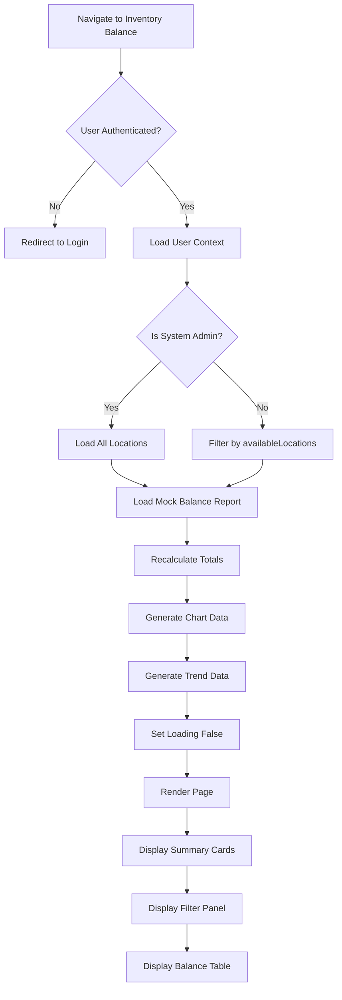

---

## 2. Filter Application Flow

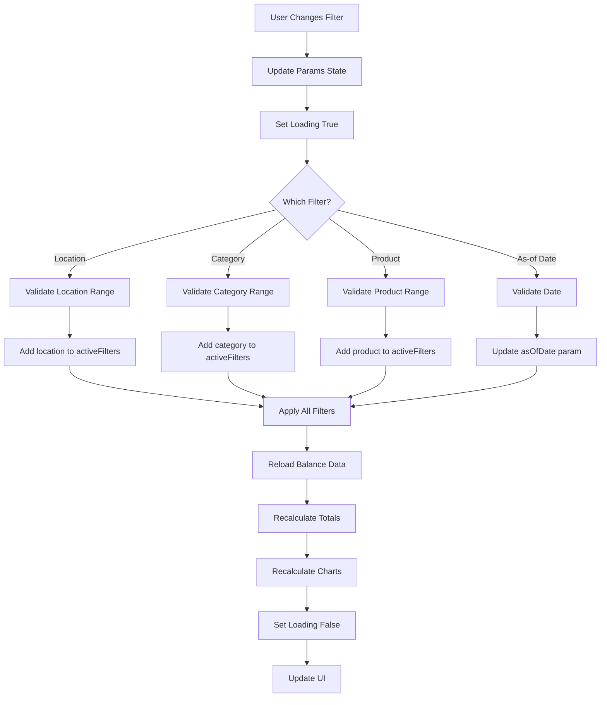

---

## 3. Filter Removal Flow

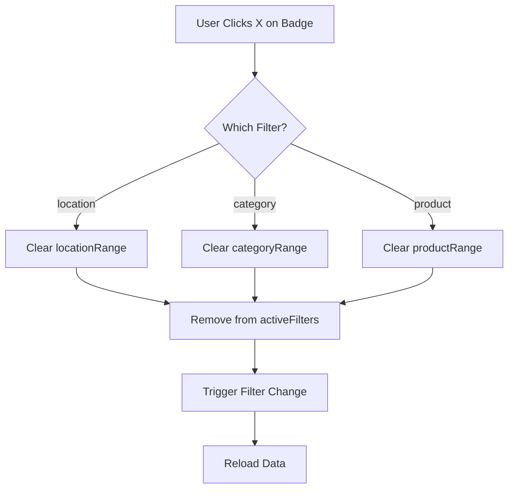

---

## 4. Data Hierarchy Expansion Flow

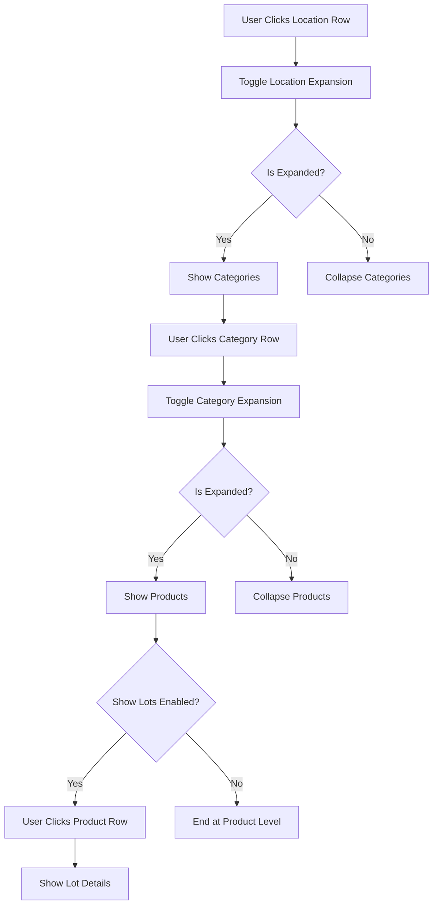

---

## 5. View Type Change Flow

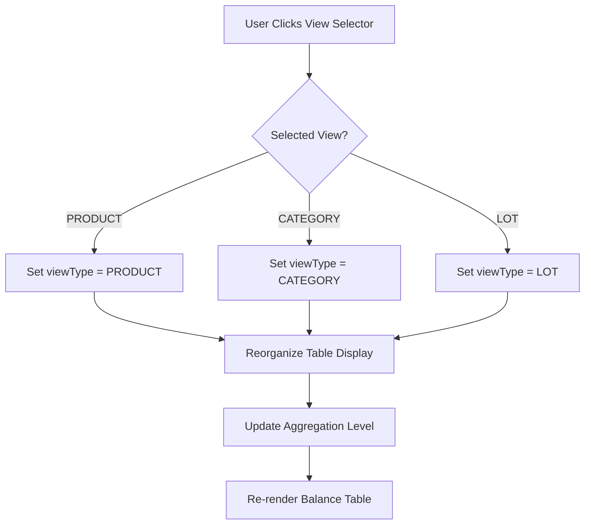

---

## 6. Show Lots Toggle Flow

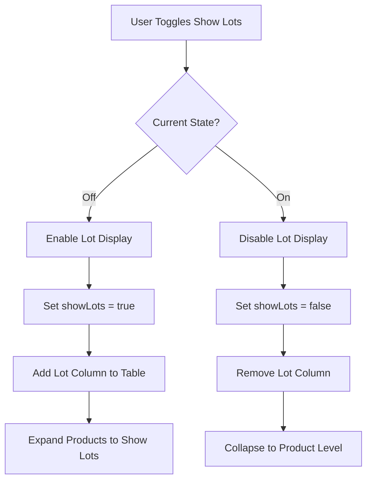

---

## 7. Tab Navigation Flow

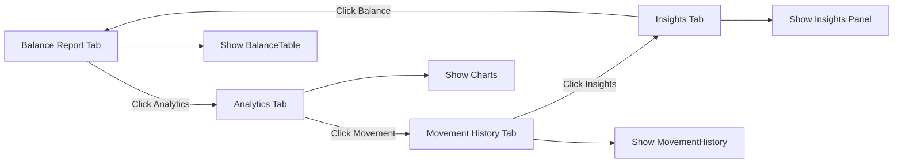

---

## 8. Chart Data Calculation Flow

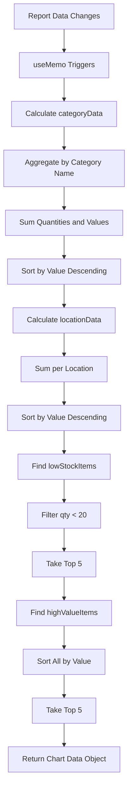

---

## 9. Export Flow

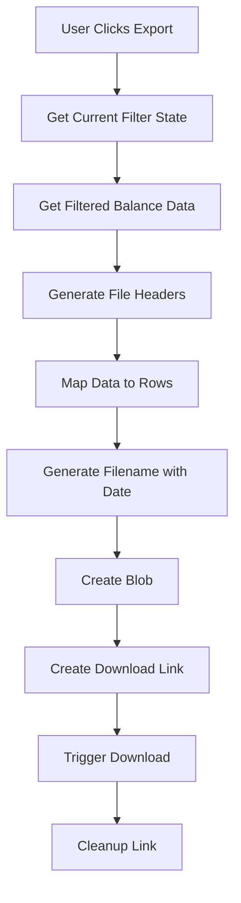

---

## 10. Permission Check Flow

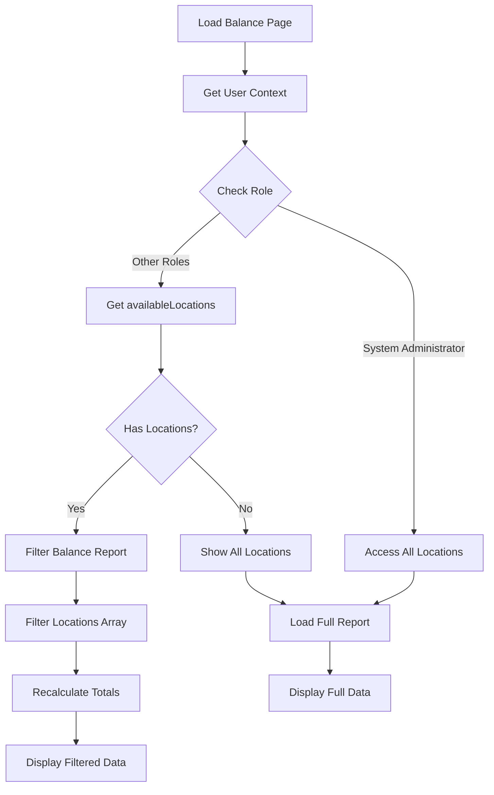

---

## 11. Low Stock Alert Flow

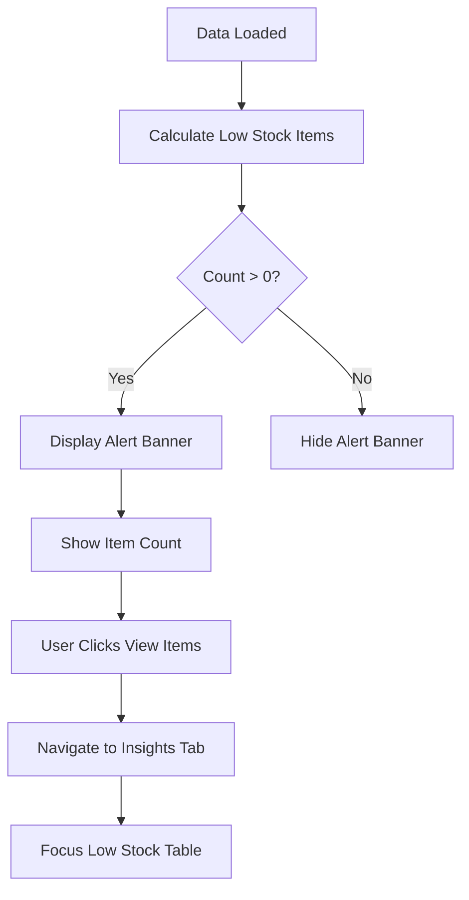

---

## 12. Trend Data Generation Flow

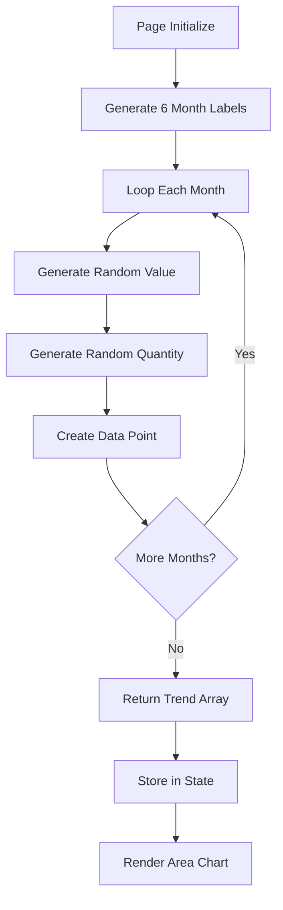

---

## 13. Location Performance Calculation

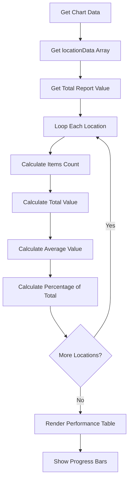

---

## 14. Insights Navigation Flow

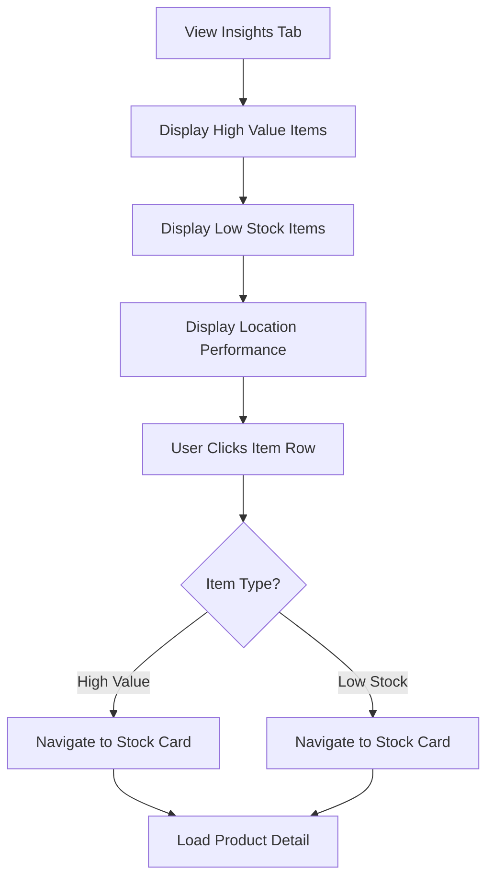
