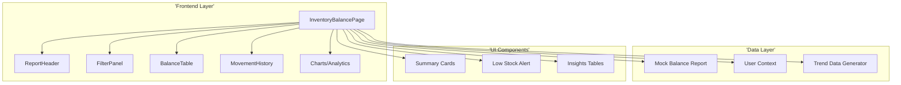
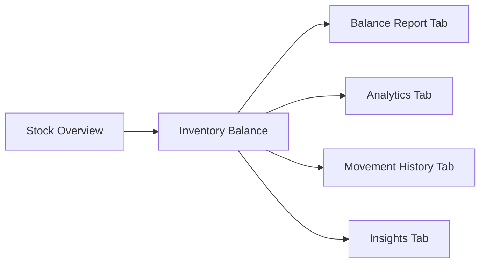
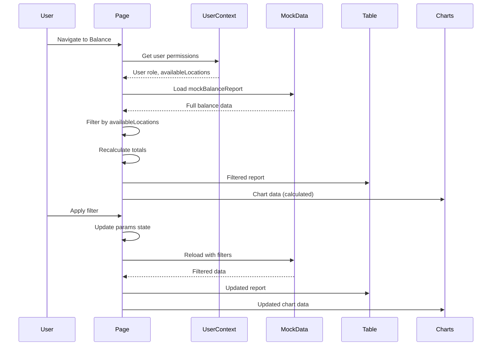

# Technical Specification: Inventory Balance

## Document Information
| Field | Value |
|-------|-------|
| Module | Inventory Management |
| Sub-module | Inventory Balance |
| Version | 1.0 |
| Last Updated | 2024-01-15 |

---

## 1. System Architecture



---

## 2. Page Hierarchy



**Route**: `/inventory-management/stock-overview/inventory-balance`

---

## 3. Component Architecture

### 3.1 Page Component

**File**: `app/(main)/inventory-management/stock-overview/inventory-balance/page.tsx`

**Responsibilities**:
- Manage filter state and tab state
- Load balance data with permission filtering
- Calculate chart data from report
- Coordinate child components

**State Management**:
```typescript
const [isLoading, setIsLoading] = useState(true)
const [showFilters, setShowFilters] = useState(false)
const [activeFilters, setActiveFilters] = useState<string[]>([])
const [trendData] = useState(generateTrendData)
const [report, setReport] = useState<BalanceReport>({...})
const [params, setParams] = useState<BalanceReportParams>({...})
```

---

### 3.2 ReportHeader Component

**File**: `components/ReportHeader.tsx`

**Responsibilities**:
- Display view type selector
- Toggle show lots option
- Provide quick actions

**Props**:
```typescript
interface ReportHeaderProps {
  params: BalanceReportParams
  onViewChange: (viewType: 'CATEGORY' | 'PRODUCT' | 'LOT') => void
  onShowLotsChange: (showLots: boolean) => void
}
```

---

### 3.3 FilterPanel Component

**File**: `components/FilterPanel.tsx`

**Responsibilities**:
- Render filter inputs (location, category, product ranges)
- Date picker for as-of date
- Apply and reset filters

**Props**:
```typescript
interface FilterPanelProps {
  params: BalanceReportParams
  onFilterChange: (filterUpdates: Partial<BalanceReportParams>) => void
  isLoading: boolean
}
```

---

### 3.4 BalanceTable Component

**File**: `components/BalanceTable.tsx`

**Responsibilities**:
- Render hierarchical balance data
- Handle expand/collapse for locations, categories
- Display quantities, values, and percentages
- Support view type switching

**Props**:
```typescript
interface BalanceTableProps {
  params: BalanceReportParams
  report: BalanceReport
  isLoading: boolean
}
```

---

### 3.5 MovementHistory Component

**File**: `components/MovementHistory.tsx`

**Responsibilities**:
- Display recent inventory movements
- Filter by transaction type
- Link to source documents

**Props**:
```typescript
interface MovementHistoryProps {
  params: BalanceReportParams
  isLoading: boolean
}
```

---

## 4. Data Flow



---

## 5. Type Definitions

### 5.1 BalanceReport
```typescript
interface BalanceReport {
  locations: LocationBalance[]
  totals: {
    quantity: number
    value: number
  }
}
```

### 5.2 LocationBalance
```typescript
interface LocationBalance {
  id: string
  name: string
  categories: CategoryBalance[]
}
```

### 5.3 CategoryBalance
```typescript
interface CategoryBalance {
  id: string
  name: string
  products: ProductBalance[]
}
```

### 5.4 ProductBalance
```typescript
interface ProductBalance {
  id: string
  code: string
  name: string
  unit: string
  totals: {
    quantity: number
    value: number
  }
  lots?: LotBalance[]
}
```

### 5.5 BalanceReportParams
```typescript
interface BalanceReportParams {
  asOfDate: string
  locationRange: { from: string; to: string }
  categoryRange: { from: string; to: string }
  productRange: { from: string; to: string }
  viewType: 'CATEGORY' | 'PRODUCT' | 'LOT'
  showLots: boolean
}
```

---

## 6. Chart Data Calculation

### 6.1 Category Distribution
```typescript
const categoryData = report.locations.flatMap(loc => loc.categories)
  .reduce((acc, cat) => {
    // Aggregate by category name
    // Sum quantities and values
    return acc
  }, [])
  .sort((a, b) => b.value - a.value)
```

### 6.2 Location Distribution
```typescript
const locationData = report.locations.map(loc => {
  const totals = loc.categories.reduce((acc, cat) => {
    // Sum all products in category
    return acc
  }, { quantity: 0, value: 0 })

  return { name: loc.name, ...totals }
}).sort((a, b) => b.value - a.value)
```

### 6.3 Low Stock Items
```typescript
const lowStockItems = report.locations.flatMap(loc =>
  loc.categories.flatMap(cat =>
    cat.products.filter(prod => prod.totals.quantity < 20)
  )
).slice(0, 5)
```

### 6.4 High Value Items
```typescript
const highValueItems = report.locations.flatMap(loc =>
  loc.categories.flatMap(cat => cat.products)
).sort((a, b) => b.totals.value - a.totals.value).slice(0, 5)
```

---

## 7. Permission Filtering

### 7.1 Location Access Logic
```typescript
useEffect(() => {
  let filteredReport = { ...mockBalanceReport }

  if (user?.role !== 'System Administrator' && user?.availableLocations) {
    const userLocationIds = user.availableLocations.map(l => l.id)
    filteredReport.locations = mockBalanceReport.locations.filter(loc =>
      userLocationIds.includes(loc.id)
    )

    // Recalculate totals
    filteredReport.totals = calculateTotals(filteredReport.locations)
  }

  setReport(filteredReport)
}, [user])
```

---

## 8. Third-Party Libraries

| Library | Version | Usage |
|---------|---------|-------|
| Recharts | ^2.x | AreaChart, PieChart, BarChart |
| date-fns | ^2.x | Date formatting |
| lucide-react | ^0.x | Icons |
| shadcn/ui | ^0.x | Card, Table, Badge, Progress, Tabs |

---

## 9. Component Tree

```
InventoryBalancePage
├── PageHeader
│   ├── BackLink
│   ├── Title with Icon
│   └── As-of-date display
├── ActionBar
│   ├── RefreshButton
│   ├── ExportButton
│   └── ReportHeader (view controls)
├── SummaryCards (4 cards)
│   ├── TotalQuantity
│   ├── TotalValue
│   ├── Locations
│   └── Categories
├── LowStockAlert (conditional)
├── FilterSection
│   ├── CollapsibleTrigger
│   ├── ActiveFilterBadges
│   └── FilterPanel (collapsible)
└── MainContent (Card with Tabs)
    ├── TabsList
    │   ├── Balance Report
    │   ├── Analytics
    │   ├── Movement History
    │   └── Insights
    ├── BalanceTable (tab content)
    ├── AnalyticsCharts (tab content)
    │   ├── ValueTrendChart
    │   ├── CategoryPieChart
    │   ├── LocationQuantityBar
    │   └── LocationValueBar
    ├── MovementHistory (tab content)
    └── InsightsPanel (tab content)
        ├── HighValueTable
        ├── LowStockTable
        └── LocationPerformance
```

---

## 10. Performance Considerations

| Concern | Mitigation |
|---------|------------|
| Large dataset | Hierarchical lazy expansion |
| Chart rendering | ResponsiveContainer with memoization |
| Filter changes | Debounced state updates |
| Permission filtering | Client-side filtering with caching |
| Export | Async generation with progress |

---

## 11. Accessibility

| Feature | Implementation |
|---------|---------------|
| Keyboard navigation | Tab through expandable rows |
| Screen readers | ARIA labels on all interactive elements |
| Color contrast | 4.5:1 minimum ratio |
| Focus indicators | Visible focus rings |
| Chart accessibility | Tooltips with values |

---

## 12. Error Handling

| Scenario | Handling |
|----------|----------|
| Data load failure | Show error state with retry button |
| Empty data | Display "No data available" message |
| Permission denied | Redirect or show access denied |
| Export failure | Toast notification with error |
