# Flow Diagrams: Slow Moving Inventory

## Document Information
| Field | Value |
|-------|-------|
| Module | Inventory Management |
| Sub-module | Slow Moving |
| Version | 1.0 |
| Last Updated | 2024-01-15 |

---

## 1. Page Load Flow

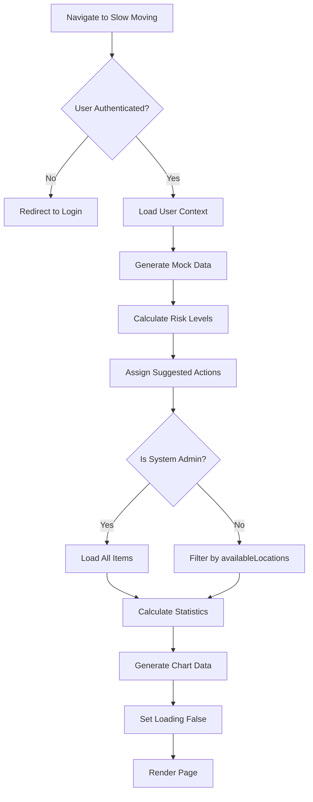

---

## 2. Risk Level Calculation Flow

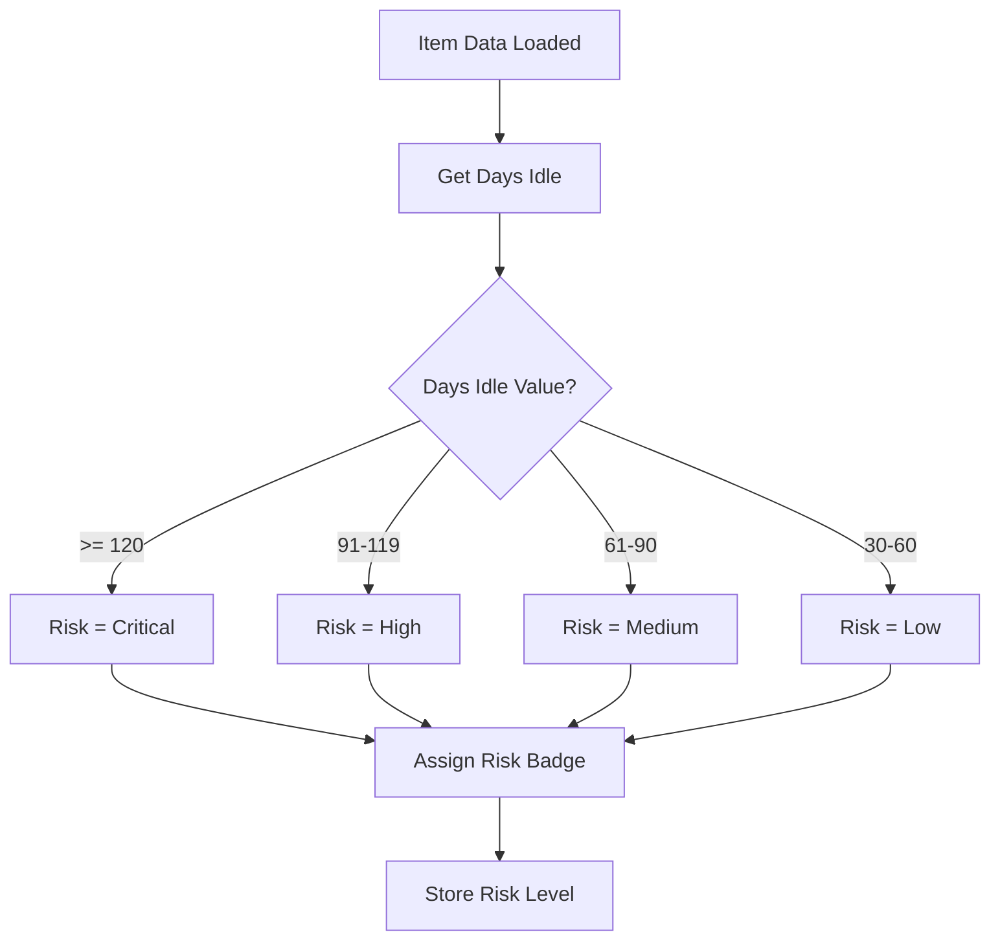

---

## 3. Action Suggestion Flow

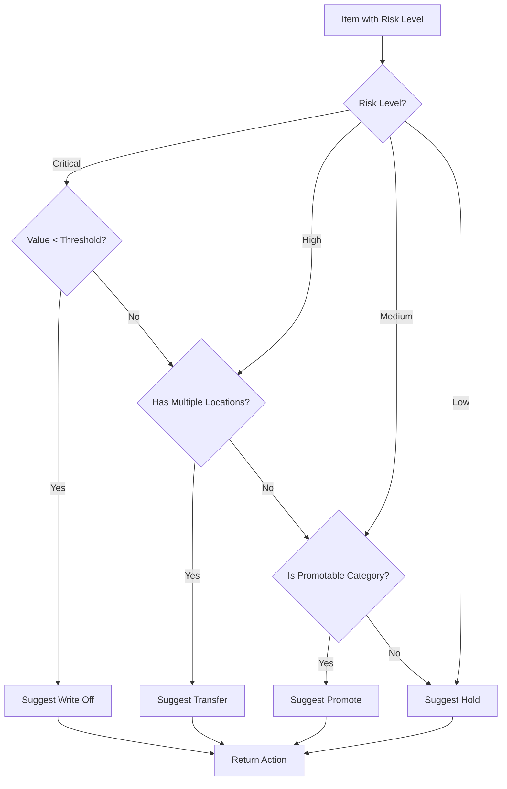

---

## 4. Filter Application Flow

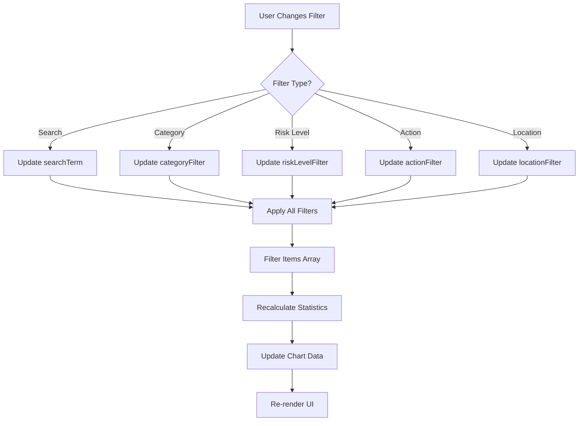

---

## 5. Tab Navigation Flow

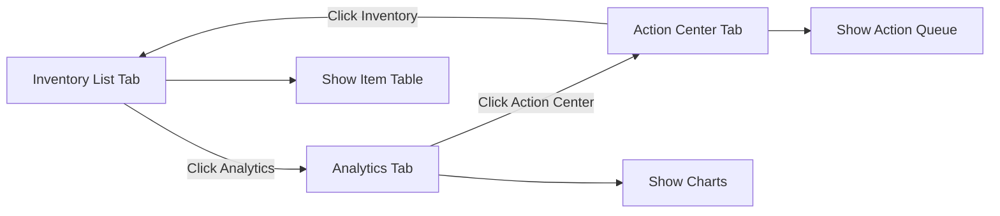

---

## 6. Analytics Chart Generation Flow

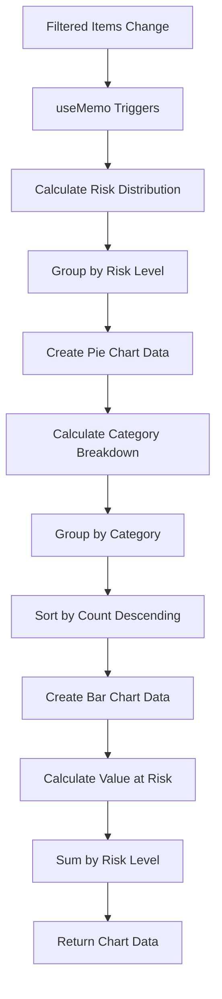

---

## 7. Action Execution Flow

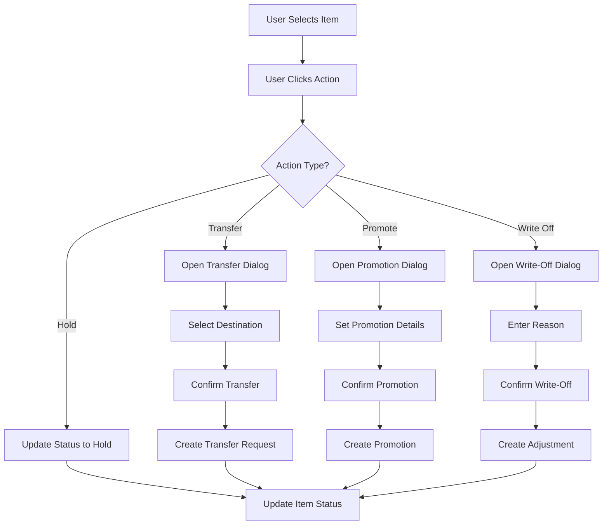

---

## 8. View Mode Switch Flow

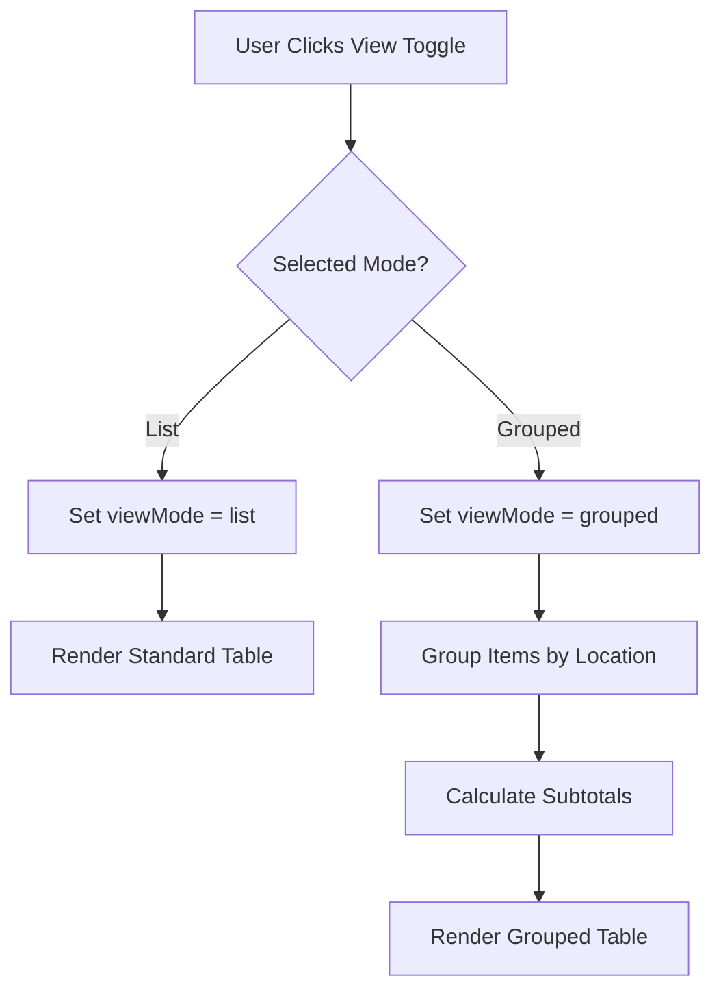

---

## 9. Summary Statistics Update Flow

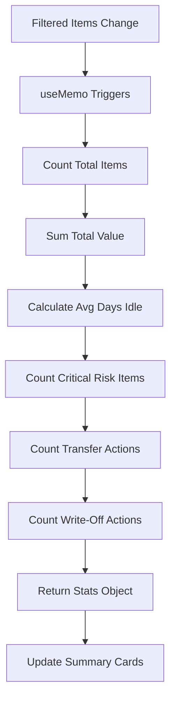

---

## 10. Permission Check Flow

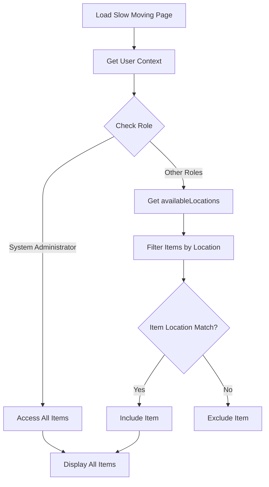

---

## 11. Export Flow

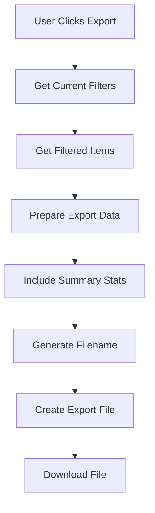

---

## 12. Grouped View Expand/Collapse Flow

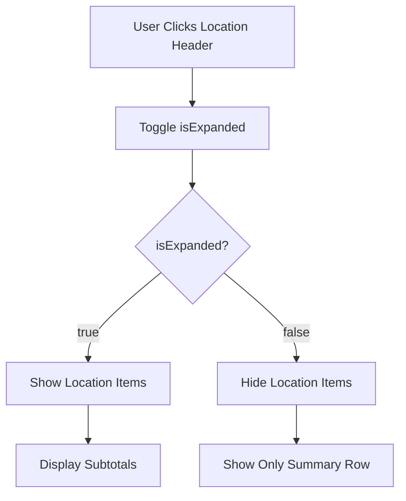

---

## 13. Risk Distribution Chart Flow

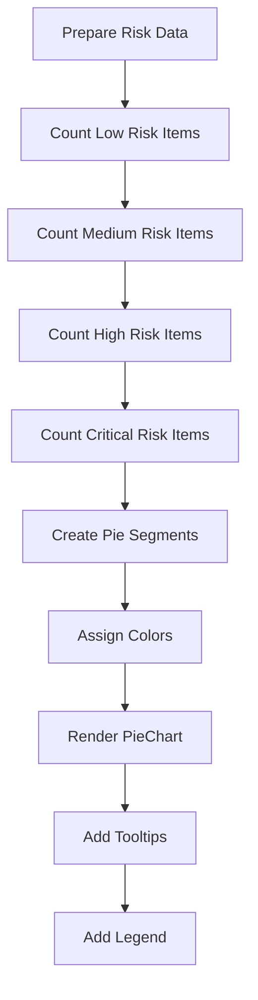

---

## 14. Category Breakdown Chart Flow

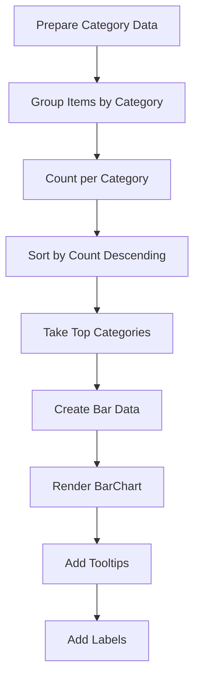

---

## 15. Action Center Priority Flow

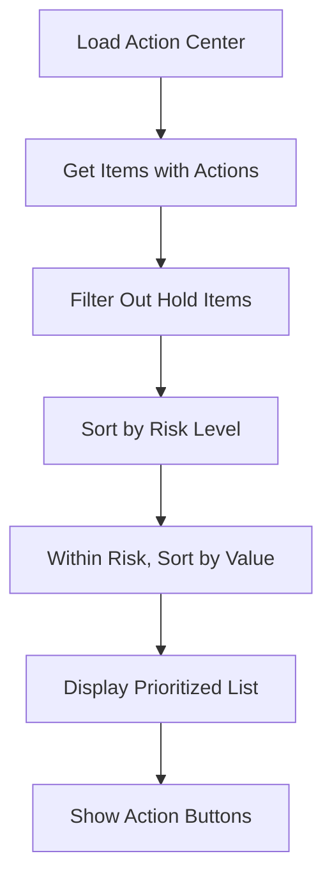
