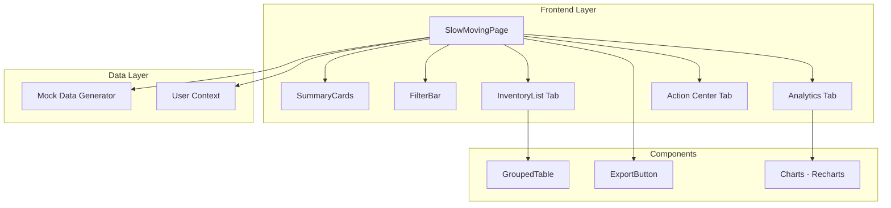
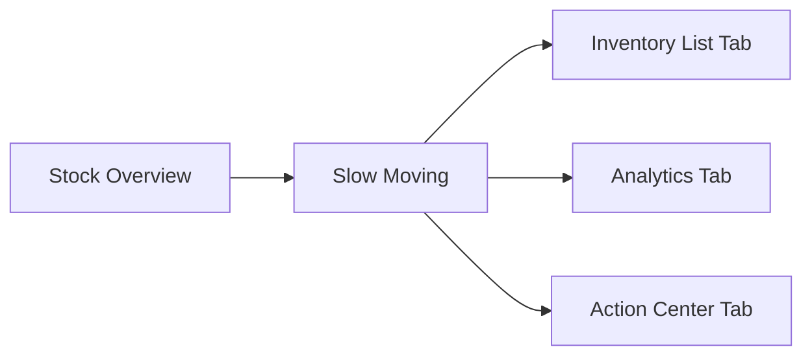
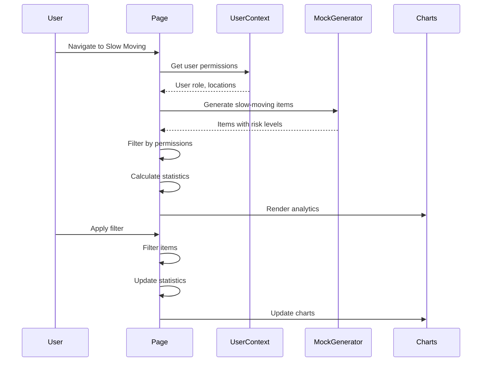

# Technical Specification: Slow Moving Inventory

## Document Information
| Field | Value |
|-------|-------|
| Module | Inventory Management |
| Sub-module | Slow Moving |
| Version | 1.0 |
| Last Updated | 2024-01-15 |

---

## 1. System Architecture



---

## 2. Page Hierarchy



**Route**: `/inventory-management/stock-overview/slow-moving`

---

## 3. Component Architecture

### 3.1 Page Component

**File**: `app/(main)/inventory-management/stock-overview/slow-moving/page.tsx`

**State Management**:
```typescript
const [isLoading, setIsLoading] = useState(true)
const [searchTerm, setSearchTerm] = useState('')
const [categoryFilter, setCategoryFilter] = useState('all')
const [riskLevelFilter, setRiskLevelFilter] = useState('all')
const [actionFilter, setActionFilter] = useState('all')
const [locationFilter, setLocationFilter] = useState('all')
const [viewMode, setViewMode] = useState<'list' | 'grouped'>('list')
const [slowMovingItems, setSlowMovingItems] = useState<SlowMovingItem[]>([])
const [groupedItems, setGroupedItems] = useState<GroupedData[]>([])
```

---

## 4. Type Definitions

### 4.1 Slow Moving Item
```typescript
interface SlowMovingItem {
  id: string
  code: string
  name: string
  category: string
  unit: string
  currentStock: number
  value: number
  daysIdle: number
  lastMovementDate: string
  lastReceiptDate: string
  lastIssueDate: string
  riskLevel: 'low' | 'medium' | 'high' | 'critical'
  suggestedAction: 'transfer' | 'promote' | 'writeoff' | 'hold'
  location: {
    id: string
    name: string
  }
}
```

### 4.2 Risk Level Type
```typescript
type RiskLevel = 'low' | 'medium' | 'high' | 'critical'

const RISK_LEVELS: Record<RiskLevel, { label: string; color: string; days: string }> = {
  low: { label: 'Low', color: 'green', days: '30-60' },
  medium: { label: 'Medium', color: 'amber', days: '61-90' },
  high: { label: 'High', color: 'orange', days: '91-120' },
  critical: { label: 'Critical', color: 'red', days: '120+' }
}
```

### 4.3 Suggested Action Type
```typescript
type SuggestedAction = 'transfer' | 'promote' | 'writeoff' | 'hold'

const ACTIONS: Record<SuggestedAction, { label: string; icon: Icon; color: string }> = {
  transfer: { label: 'Transfer', icon: ArrowRight, color: 'blue' },
  promote: { label: 'Promote', icon: Tag, color: 'purple' },
  writeoff: { label: 'Write Off', icon: Trash2, color: 'red' },
  hold: { label: 'Hold', icon: Eye, color: 'gray' }
}
```

---

## 5. Risk Calculation Logic

### 5.1 Risk Level Determination
```typescript
const calculateRiskLevel = (daysIdle: number): RiskLevel => {
  if (daysIdle >= 120) return 'critical'
  if (daysIdle >= 91) return 'high'
  if (daysIdle >= 61) return 'medium'
  return 'low'
}
```

### 5.2 Action Suggestion Logic
```typescript
const suggestAction = (item: SlowMovingItem): SuggestedAction => {
  // Critical items with low value should be written off
  if (item.riskLevel === 'critical' && item.value < VALUE_THRESHOLD) {
    return 'writeoff'
  }

  // High risk items that exist in multiple locations
  if (item.riskLevel === 'high' && hasMultipleLocations(item)) {
    return 'transfer'
  }

  // Medium risk promotable categories
  if (item.riskLevel === 'medium' && isPromotableCategory(item.category)) {
    return 'promote'
  }

  return 'hold'
}
```

---

## 6. Data Flow



---

## 7. Summary Statistics Calculation

```typescript
const summaryStats = useMemo(() => {
  const totalItems = filteredItems.length
  const totalValue = filteredItems.reduce((sum, item) => sum + item.value, 0)
  const avgDaysIdle = filteredItems.reduce((sum, item) => sum + item.daysIdle, 0) / totalItems || 0
  const criticalCount = filteredItems.filter(item => item.riskLevel === 'critical').length
  const transferCount = filteredItems.filter(item => item.suggestedAction === 'transfer').length
  const writeOffCount = filteredItems.filter(item => item.suggestedAction === 'writeoff').length

  return {
    totalItems,
    totalValue,
    avgDaysIdle: Math.round(avgDaysIdle),
    criticalCount,
    transferCount,
    writeOffCount
  }
}, [filteredItems])
```

---

## 8. Chart Data Preparation

### 8.1 Risk Distribution Data
```typescript
const riskDistributionData = useMemo(() => {
  const distribution = filteredItems.reduce((acc, item) => {
    acc[item.riskLevel] = (acc[item.riskLevel] || 0) + 1
    return acc
  }, {} as Record<RiskLevel, number>)

  return Object.entries(distribution).map(([level, count]) => ({
    name: RISK_LEVELS[level as RiskLevel].label,
    value: count,
    color: RISK_LEVELS[level as RiskLevel].color
  }))
}, [filteredItems])
```

### 8.2 Category Breakdown Data
```typescript
const categoryData = useMemo(() => {
  const breakdown = filteredItems.reduce((acc, item) => {
    acc[item.category] = (acc[item.category] || 0) + 1
    return acc
  }, {} as Record<string, number>)

  return Object.entries(breakdown)
    .map(([category, count]) => ({ category, count }))
    .sort((a, b) => b.count - a.count)
}, [filteredItems])
```

---

## 9. Filtering Logic

```typescript
const filteredItems = useMemo(() => {
  return slowMovingItems.filter(item => {
    // Search filter
    if (searchTerm && !item.name.toLowerCase().includes(searchTerm.toLowerCase()) &&
        !item.code.toLowerCase().includes(searchTerm.toLowerCase())) {
      return false
    }

    // Category filter
    if (categoryFilter !== 'all' && item.category !== categoryFilter) {
      return false
    }

    // Risk level filter
    if (riskLevelFilter !== 'all' && item.riskLevel !== riskLevelFilter) {
      return false
    }

    // Action filter
    if (actionFilter !== 'all' && item.suggestedAction !== actionFilter) {
      return false
    }

    // Location filter
    if (locationFilter !== 'all' && item.location.id !== locationFilter) {
      return false
    }

    return true
  })
}, [slowMovingItems, searchTerm, categoryFilter, riskLevelFilter, actionFilter, locationFilter])
```

---

## 10. Component Tree

```
SlowMovingPage
├── PageHeader
│   ├── BackLink
│   ├── Title with Icon
│   └── Description
├── ActionBar
│   ├── ViewModeToggle (List/Grouped)
│   ├── ExportButton
│   └── RefreshButton
├── SummaryCards (6 cards)
│   ├── TotalItems
│   ├── TotalValue
│   ├── AvgDaysIdle
│   ├── CriticalRisk
│   ├── ToTransfer
│   └── ToWriteOff
├── MainContent (Card with Tabs)
│   ├── TabsList
│   │   ├── Inventory List
│   │   ├── Analytics
│   │   └── Action Center
│   ├── InventoryListTab
│   │   ├── FilterBar
│   │   └── DataTable or GroupedTable
│   ├── AnalyticsTab
│   │   ├── RiskDistributionChart
│   │   ├── CategoryBreakdownChart
│   │   └── ValueAtRiskSection
│   └── ActionCenterTab
│       ├── PendingActionsTable
│       └── ActionButtons
└── Footer
    └── RecordCount
```

---

## 11. Third-Party Libraries

| Library | Version | Usage |
|---------|---------|-------|
| Recharts | ^2.x | PieChart, BarChart, ComposedChart |
| lucide-react | ^0.x | Icons |
| shadcn/ui | ^0.x | Card, Table, Badge, Progress, Tabs, Alert |
| date-fns | ^2.x | Date formatting |

---

## 12. Risk Level Badge Rendering

```typescript
const renderRiskBadge = (level: RiskLevel) => {
  const config = RISK_LEVELS[level]
  const variants = {
    low: 'outline',
    medium: 'secondary',
    high: 'warning',
    critical: 'destructive'
  }

  return (
    <Badge variant={variants[level]} className={`bg-${config.color}-100 text-${config.color}-800`}>
      {config.label}
    </Badge>
  )
}
```

---

## 13. Action Badge Rendering

```typescript
const renderActionBadge = (action: SuggestedAction) => {
  const config = ACTIONS[action]
  const Icon = config.icon

  return (
    <Badge variant="outline" className={`text-${config.color}-600`}>
      <Icon className="h-3 w-3 mr-1" />
      {config.label}
    </Badge>
  )
}
```

---

## 14. Performance Considerations

| Concern | Mitigation |
|---------|------------|
| Large item list | useMemo for filtering |
| Chart rendering | Lazy loading tabs |
| Filter changes | Debounced updates |
| Grouped calculations | Memoized grouping |

---

## 15. Accessibility

| Feature | Implementation |
|---------|---------------|
| Keyboard navigation | Tab through items |
| Screen readers | ARIA labels on badges |
| Color contrast | 4.5:1 minimum |
| Focus indicators | Visible focus rings |
| Risk level | Text labels with colors |
