# Flow Diagrams: Stock Cards

## Document Information
| Field | Value |
|-------|-------|
| Module | Inventory Management |
| Sub-module | Stock Cards |
| Version | 1.0 |
| Last Updated | 2024-01-15 |

---

## 1. Page Load Flow

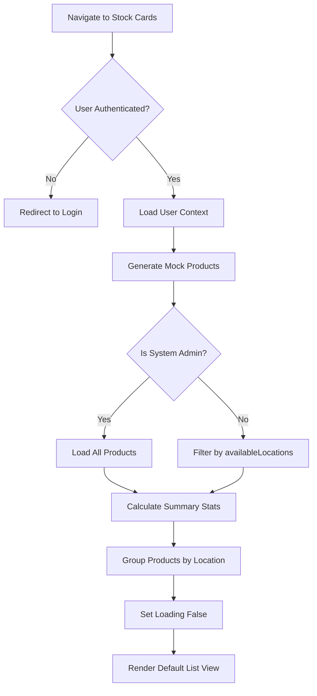

---

## 2. View Mode Switch Flow

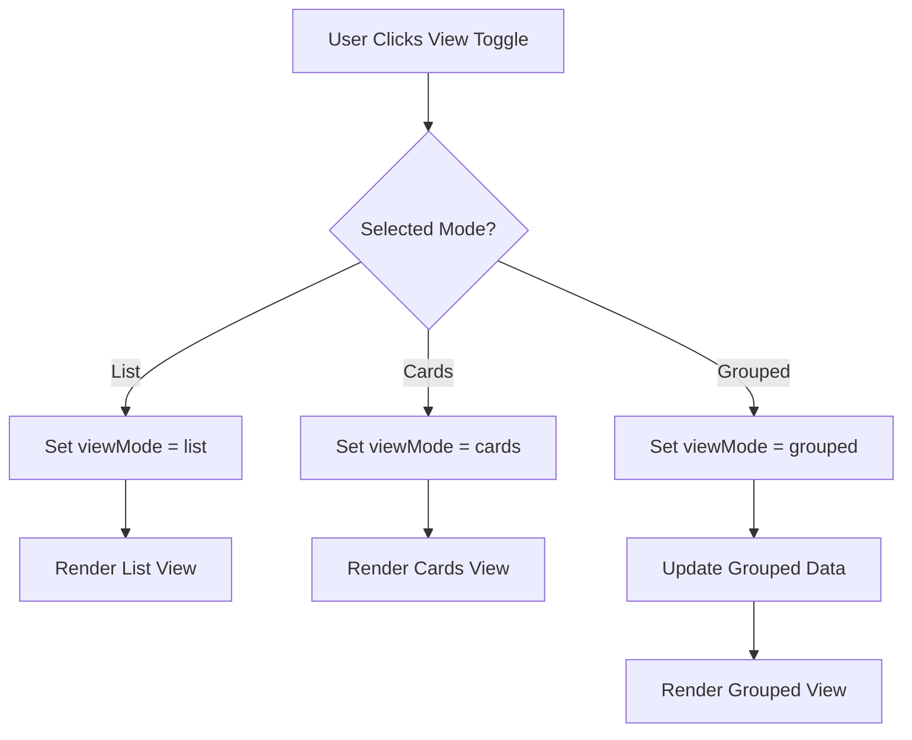

---

## 3. Filter Application Flow

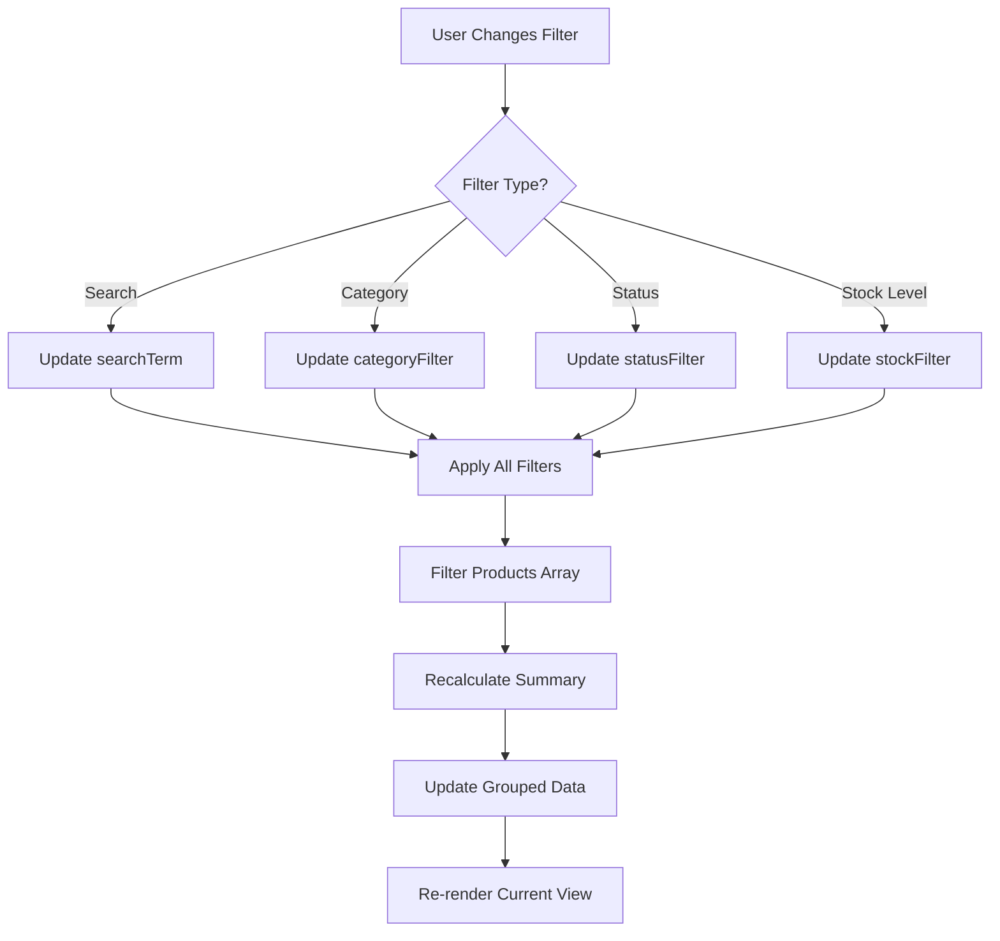

---

## 4. Sort Flow

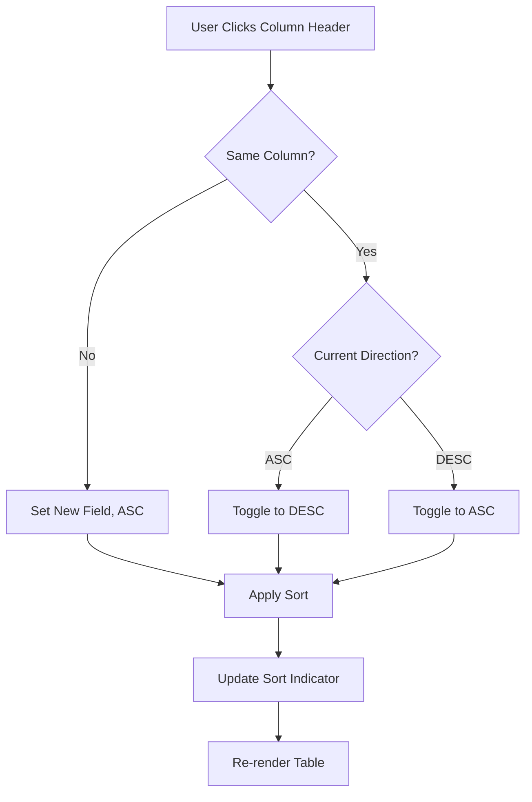

---

## 5. Product Navigation Flow

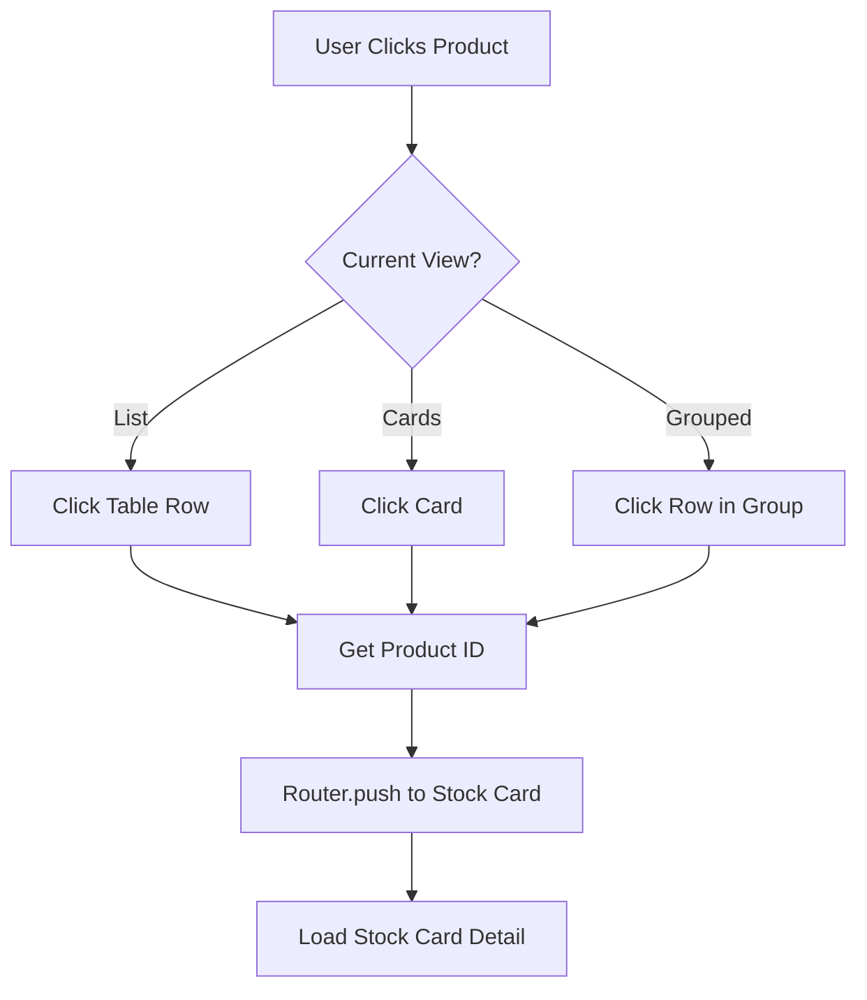

---

## 6. Grouped View Expand/Collapse Flow

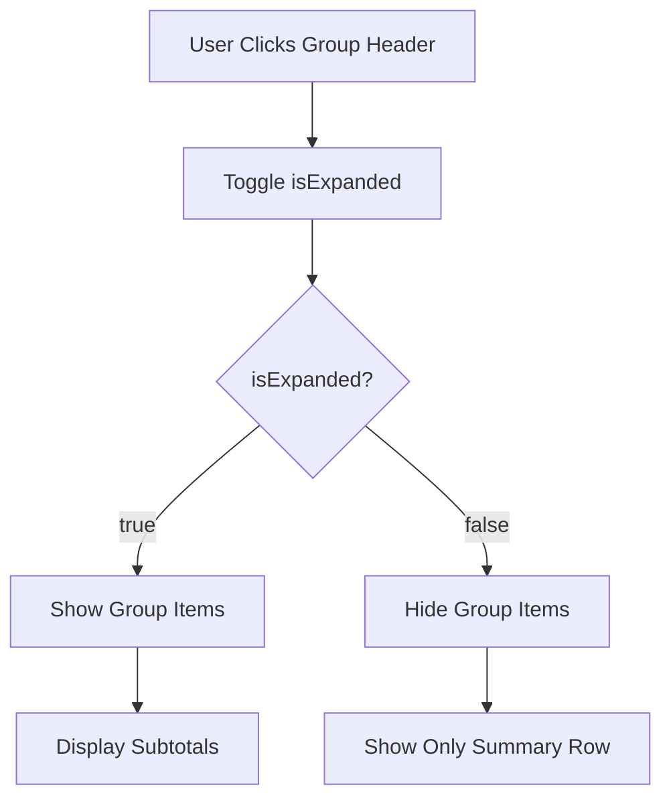

---

## 7. Expand All / Collapse All Flow

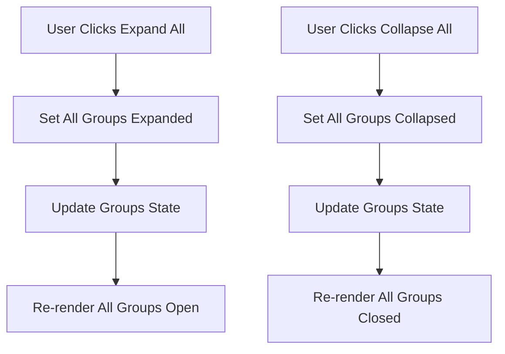

---

## 8. Summary Statistics Calculation Flow

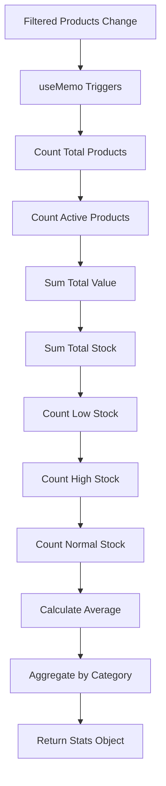

---

## 9. Stock Level Badge Flow

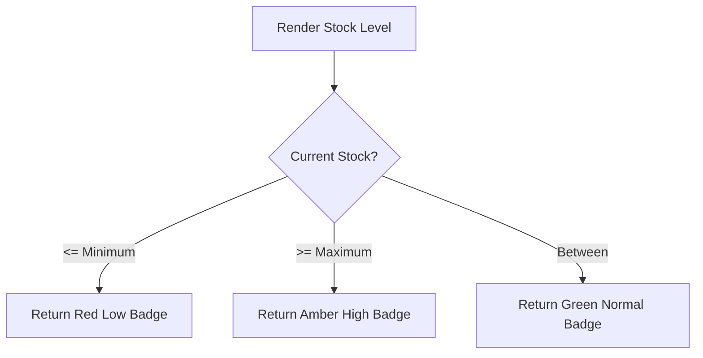

---

## 10. Export Flow

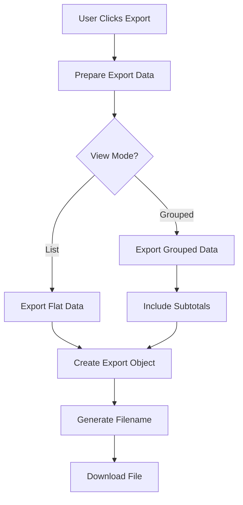

---

## 11. Permission Check Flow

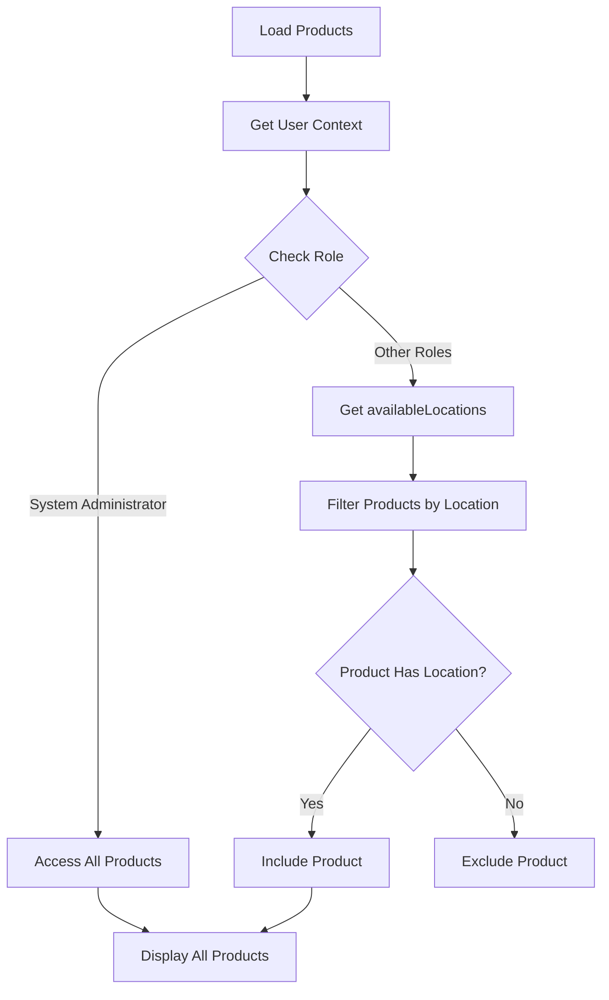

---

## 12. Cards View Render Flow

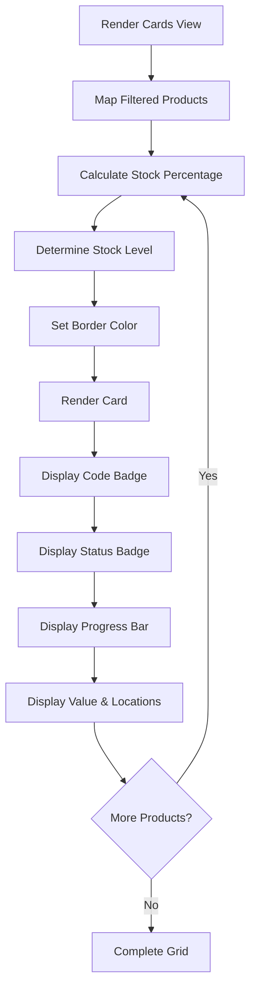

---

## 13. Grouped View Render Flow

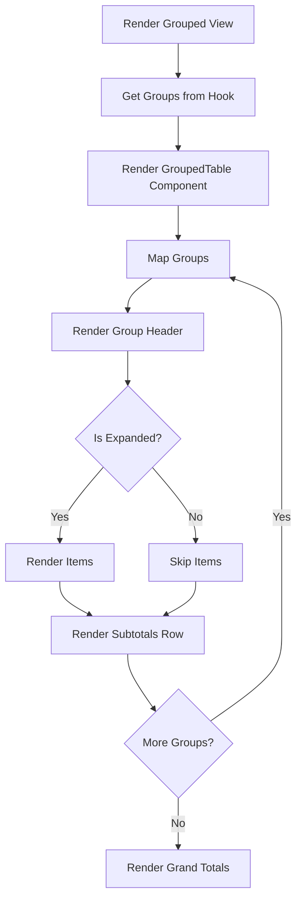

---

## 14. Group Products by Location Flow

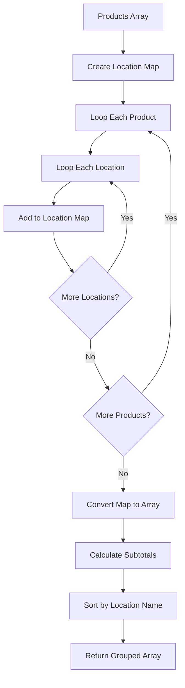

---

## 15. Filter Update Effect Flow

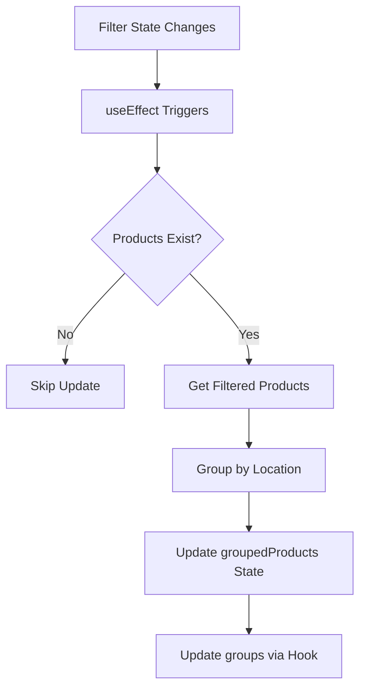
