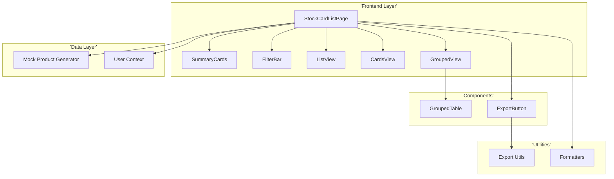
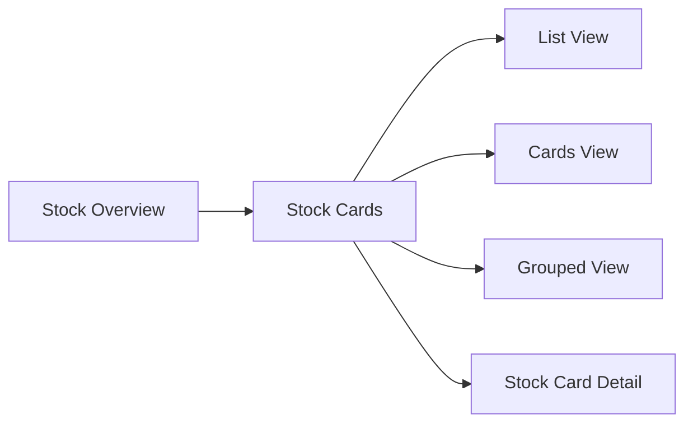
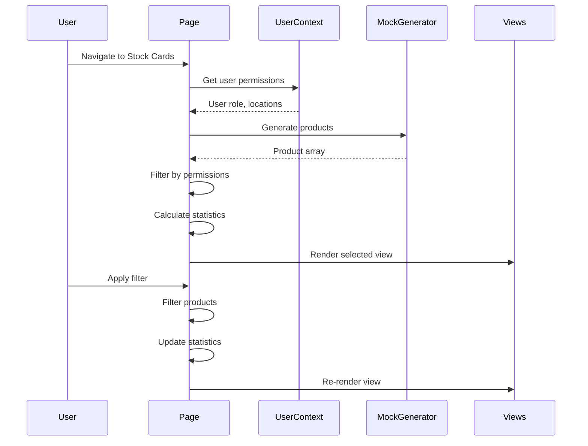

# Technical Specification: Stock Cards

## Document Information
| Field | Value |
|-------|-------|
| Module | Inventory Management |
| Sub-module | Stock Cards |
| Version | 1.0 |
| Last Updated | 2024-01-15 |

---

## 1. System Architecture



---

## 2. Page Hierarchy



**Route**: `/inventory-management/stock-overview/stock-cards`

---

## 3. Component Architecture

### 3.1 Page Component

**File**: `app/(main)/inventory-management/stock-overview/stock-cards/page.tsx`

**Responsibilities**:
- Manage view mode state (list/cards/grouped)
- Handle filter state management
- Calculate summary statistics
- Coordinate view rendering

**State Management**:
```typescript
const [isLoading, setIsLoading] = useState(true)
const [products, setProducts] = useState<Product[]>([])
const [searchTerm, setSearchTerm] = useState("")
const [categoryFilter, setCategoryFilter] = useState("all")
const [statusFilter, setStatusFilter] = useState("all")
const [stockFilter, setStockFilter] = useState("all")
const [locationFilter, setLocationFilter] = useState("all")
const [sortField, setSortField] = useState("name")
const [sortDirection, setSortDirection] = useState<"asc" | "desc">("asc")
const [viewMode, setViewMode] = useState<"list" | "grouped" | "cards">("list")
const [groupedProducts, setGroupedProducts] = useState<GroupedData[]>([])
```

---

### 3.2 GroupedTable Component

**File**: `components/inventory/GroupedTable.tsx`

**Responsibilities**:
- Render grouped data structure
- Handle expand/collapse
- Display subtotals and grand totals
- Custom row rendering

**Hook**:
```typescript
const {
  groups,
  setGroups,
  toggleGroup,
  expandAll,
  collapseAll,
  calculateGrandTotals
} = useGroupedTable(groupedProducts)
```

---

### 3.3 ExportButton Component

**File**: `components/inventory/ExportButton.tsx`

**Responsibilities**:
- Render export button with dropdown
- Generate export data
- Trigger file download

---

## 4. Data Flow



---

## 5. Type Definitions

### 5.1 Product Interface
```typescript
interface Product {
  id: string
  code: string
  name: string
  category: string
  unit: string
  status: "Active" | "Inactive"
  currentStock: number
  minimumStock: number
  maximumStock: number
  value: number
  averageCost: number
  lastMovementDate: string
  locationCount: number
  locations: ProductLocation[]
}

interface ProductLocation {
  id: string
  name: string
  stock: number
  value: number
}
```

### 5.2 Grouped Data Structure
```typescript
interface GroupedData {
  locationId: string
  locationName: string
  items: Product[]
  subtotals: {
    totalItems: number
    currentStock: number
    value: number
    averageValue: number
  }
  isExpanded: boolean
}
```

### 5.3 Summary Statistics
```typescript
interface SummaryStats {
  totalProducts: number
  activeProducts: number
  inactiveProducts: number
  totalValue: number
  totalStock: number
  lowStockProducts: number
  highStockProducts: number
  normalStockProducts: number
  avgValue: number
  categoryStats: CategoryStat[]
}
```

### 5.4 Export Configuration
```typescript
const exportColumns: ExportColumn[] = [
  { key: 'code', label: 'Product Code', type: 'text' },
  { key: 'name', label: 'Product Name', type: 'text' },
  { key: 'category', label: 'Category', type: 'text' },
  { key: 'unit', label: 'Unit', type: 'text' },
  { key: 'status', label: 'Status', type: 'text' },
  { key: 'currentStock', label: 'Current Stock', type: 'number' },
  { key: 'value', label: 'Value', type: 'currency' },
  { key: 'averageCost', label: 'Average Cost', type: 'currency' },
  { key: 'minimumStock', label: 'Min Stock', type: 'number' },
  { key: 'maximumStock', label: 'Max Stock', type: 'number' },
  { key: 'lastMovementDate', label: 'Last Movement', type: 'date' },
  { key: 'locationCount', label: 'Location Count', type: 'number' }
]
```

---

## 6. Filtering Logic

### 6.1 Permission Filtering
```typescript
const getFilteredProducts = () => {
  let filteredProducts = products

  // Filter by user's accessible locations
  if (user?.role !== 'System Administrator' && user?.availableLocations) {
    const userLocationIds = user.availableLocations.map(l => l.id)
    filteredProducts = filteredProducts.filter(product =>
      product.locations.some(loc => userLocationIds.includes(loc.id))
    )
  }

  return filteredProducts.filter(product => {
    // Search filter
    if (searchTerm && !product.name.toLowerCase().includes(searchTerm.toLowerCase()) &&
        !product.code.toLowerCase().includes(searchTerm.toLowerCase())) {
      return false
    }
    // Category, status, stock level filters...
    return true
  })
}
```

### 6.2 Sorting Logic
```typescript
const sortedProducts = filteredProducts.sort((a, b) => {
  let comparison = 0
  switch (sortField) {
    case "code": comparison = a.code.localeCompare(b.code); break
    case "name": comparison = a.name.localeCompare(b.name); break
    case "category": comparison = a.category.localeCompare(b.category); break
    case "stock": comparison = a.currentStock - b.currentStock; break
    case "value": comparison = a.value - b.value; break
  }
  return sortDirection === "asc" ? comparison : -comparison
})
```

---

## 7. Grouping Logic

### 7.1 Group Products by Location
```typescript
const groupProductsByLocation = (products: Product[]) => {
  const locationMap = new Map<string, Product[]>()

  products.forEach(product => {
    product.locations.forEach(location => {
      if (!locationMap.has(location.id)) {
        locationMap.set(location.id, [])
      }

      // Create location-specific product entry
      const locationProduct: Product = {
        ...product,
        currentStock: location.stock,
        value: location.value,
        averageCost: location.value / location.stock || 0,
        locationCount: 1,
        locations: [location]
      }

      locationMap.get(location.id)!.push(locationProduct)
    })
  })

  return Array.from(locationMap.entries()).map(([locationId, items]) => ({
    locationId,
    locationName: items[0].locations[0].name,
    items: items.sort((a, b) => a.name.localeCompare(b.name)),
    subtotals: calculateSubtotals(items),
    isExpanded: false
  }))
}
```

---

## 8. Summary Statistics Calculation

```typescript
const summaryStats = useMemo(() => {
  const totalProducts = filteredProducts.length
  const activeProducts = filteredProducts.filter(p => p.status === 'Active').length
  const totalValue = filteredProducts.reduce((sum, p) => sum + p.value, 0)
  const totalStock = filteredProducts.reduce((sum, p) => sum + p.currentStock, 0)
  const lowStockProducts = filteredProducts.filter(p => p.currentStock <= p.minimumStock).length
  const highStockProducts = filteredProducts.filter(p => p.currentStock >= p.maximumStock).length
  const normalStockProducts = filteredProducts.filter(p =>
    p.currentStock > p.minimumStock && p.currentStock < p.maximumStock
  ).length
  const avgValue = totalProducts > 0 ? totalValue / totalProducts : 0

  return {
    totalProducts, activeProducts, totalValue, totalStock,
    lowStockProducts, highStockProducts, normalStockProducts, avgValue
  }
}, [filteredProducts])
```

---

## 9. Stock Level Badge Rendering

```typescript
const renderStockLevelBadge = (product: Product) => {
  if (product.currentStock <= product.minimumStock) {
    return <Badge variant="destructive">Low</Badge>
  } else if (product.currentStock >= product.maximumStock) {
    return <Badge className="bg-amber-100 text-amber-800">High</Badge>
  } else {
    return <Badge variant="outline" className="bg-green-100 text-green-800">Normal</Badge>
  }
}
```

---

## 10. Navigation

```typescript
const router = useRouter()

const handleRowClick = (productId: string) => {
  router.push(`/inventory-management/stock-overview/stock-card?productId=${productId}`)
}
```

---

## 11. Third-Party Libraries

| Library | Version | Usage |
|---------|---------|-------|
| lucide-react | ^0.x | Icons |
| shadcn/ui | ^0.x | Card, Table, Badge, Progress, Select |
| next/navigation | ^14.x | Router |

---

## 12. Component Tree

```
StockCardListPage
├── PageHeader
│   ├── Title with Icon
│   └── Description
├── ActionBar
│   ├── ViewModeToggle (List/Cards/Grouped)
│   ├── RefreshButton
│   ├── AdvancedFiltersButton
│   ├── ExportButton
│   └── AddProductButton
├── SummaryCards (6 cards)
│   ├── TotalProducts
│   ├── TotalValue
│   ├── NormalStock
│   ├── LowStock
│   ├── HighStock
│   └── Categories
├── MainContent (Card)
│   ├── FilterBar
│   │   ├── SearchInput
│   │   ├── Expand/Collapse All (grouped only)
│   │   ├── CategorySelect
│   │   ├── StatusSelect
│   │   └── StockLevelSelect
│   ├── ListView (conditional)
│   ├── CardsView (conditional)
│   └── GroupedView (conditional)
└── Footer
    └── RecordCount
```

---

## 13. Performance Considerations

| Concern | Mitigation |
|---------|------------|
| Large product list | useMemo for filtering/sorting |
| View switching | Conditional rendering |
| Grouped calculations | Memoized grouping function |
| Export generation | Async with loading state |

---

## 14. Accessibility

| Feature | Implementation |
|---------|---------------|
| Keyboard navigation | Tab through rows/cards |
| Screen readers | ARIA labels |
| Color contrast | 4.5:1 minimum |
| Focus indicators | Visible focus rings |
| View mode | ARIA-selected state |
