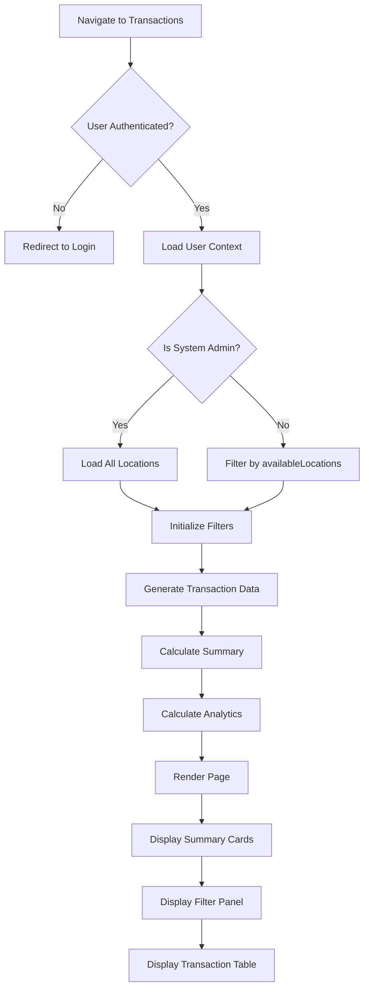
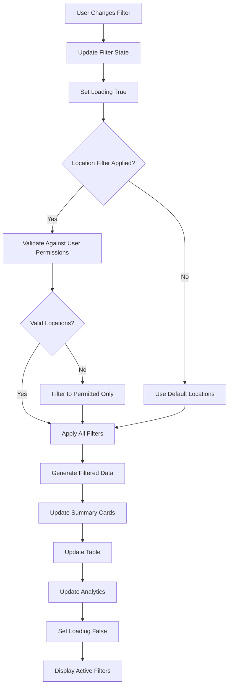
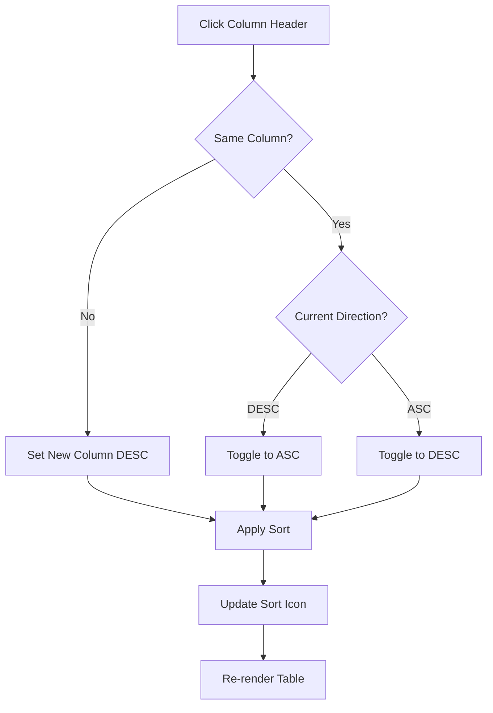
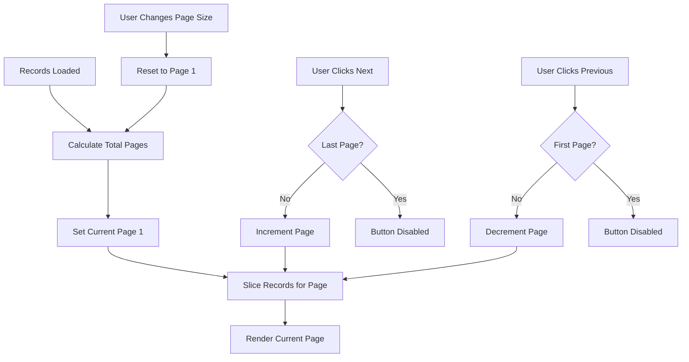
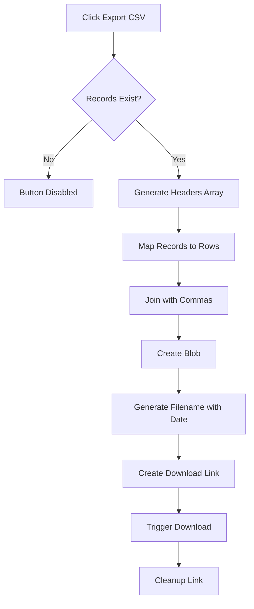
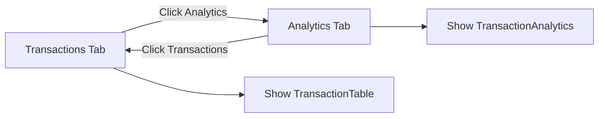
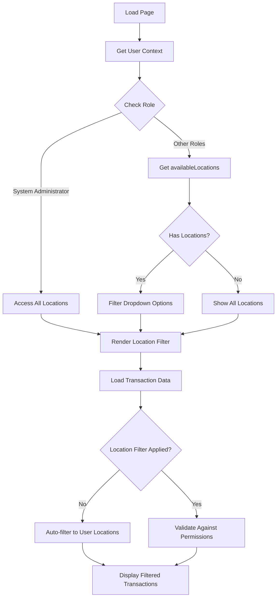
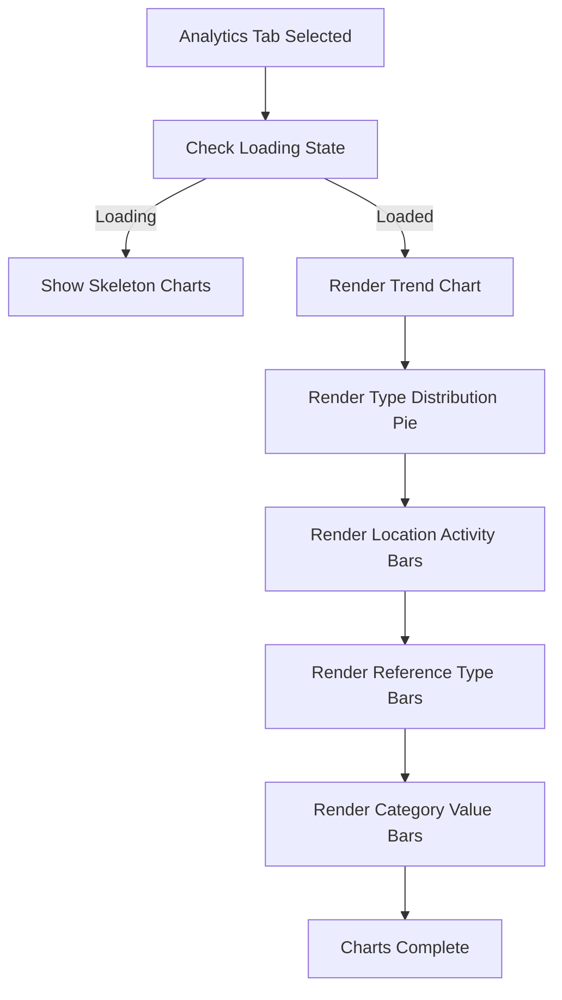
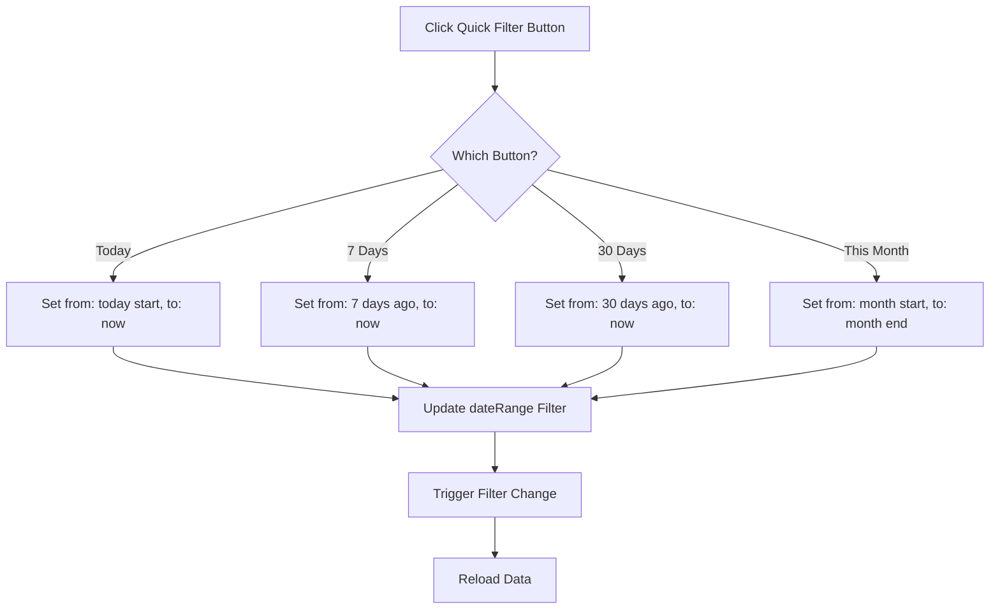

# Flow Diagrams: Inventory Transactions

## Document Information
| Field | Value |
|-------|-------|
| Module | Inventory Management |
| Sub-module | Transactions |
| Version | 1.0 |
| Last Updated | 2024-01-15 |

---

## 1. Page Load Flow



---

## 2. Filter Application Flow



---

## 3. Transaction Type Flow

```mermaid
flowchart LR
    subgraph 'Inbound (IN)'
        A1[GRN - Goods Received]
        A2[TRF - Transfer In]
        A3[PO - Purchase Order]
        A4[PC - Physical Count +]
    end

    subgraph 'Outbound (OUT)'
        B1[SO - Sales Order]
        B2[TRF - Transfer Out]
        B3[SR - Store Requisition]
        B4[WO - Write Off]
        B5[WR - Wastage Report]
    end

    subgraph 'Adjustment'
        C1[ADJ - Manual Adjustment]
        C2[PC - Physical Count]
        C3[WO - Write Off]
        C4[WR - Wastage Report]
    end

    A1 --> D[Transaction Record]
    A2 --> D
    A3 --> D
    A4 --> D
    B1 --> D
    B2 --> D
    B3 --> D
    B4 --> D
    B5 --> D
    C1 --> D
    C2 --> D
    C3 --> D
    C4 --> D
```

---

## 4. Sorting Flow



---

## 5. Pagination Flow



---

## 6. CSV Export Flow



---

## 7. Tab Navigation Flow



---

## 8. Location Access Control Flow



---

## 9. Analytics Rendering Flow



---

## 10. Quick Date Filter Flow


