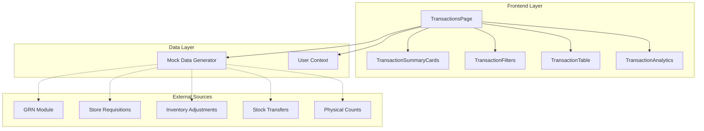
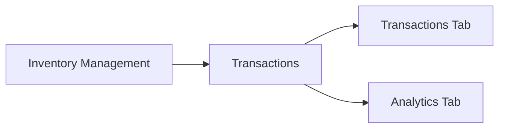
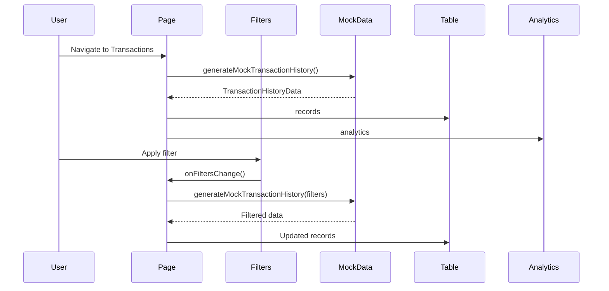

# Technical Specification: Inventory Transactions

## Document Information
| Field | Value |
|-------|-------|
| Module | Inventory Management |
| Sub-module | Transactions |
| Version | 1.0 |
| Last Updated | 2024-01-15 |

---

## 1. System Architecture

---

## 2. Page Hierarchy

**Route**: `/inventory-management/transactions`

---

## 3. Component Architecture

### 3.1 Page Component

**File**: `app/(main)/inventory-management/transactions/page.tsx`

**Responsibilities**:
- Manage filter state and active tab state
- Load transaction data based on filters and user permissions
- Coordinate child components
- Handle data refresh and CSV export

**State Management**:
- `filters`: TransactionFilterParams - Current filter selections
- `data`: TransactionHistoryData - Loaded transaction data
- `isLoading`: boolean - Loading indicator
- `activeTab`: string - Current tab (transactions/analytics)

---

### 3.2 TransactionSummaryCards

**File**: `components/TransactionSummaryCards.tsx`

**Responsibilities**:
- Display 4 summary metric cards
- Format currency and number values
- Show loading skeleton during data fetch

**Props**:
- `summary`: TransactionSummary - Calculated totals
- `isLoading`: boolean - Loading state

---

### 3.3 TransactionFilters

**File**: `components/TransactionFilters.tsx`

**Responsibilities**:
- Render collapsible filter panel
- Handle date range selection with calendar
- Manage multi-select for transaction/reference types
- Display active filter badges
- Provide quick date filter buttons

**Props**:
- `filters`: TransactionFilterParams - Current filters
- `onFiltersChange`: Function - Filter update callback
- `availableLocations`: Array - Permitted locations
- `availableCategories`: Array - Product categories

---

### 3.4 TransactionTable

**File**: `components/TransactionTable.tsx`

**Responsibilities**:
- Render sortable data table with 10 columns
- Handle column sorting with toggle direction
- Manage client-side pagination
- Format quantities with color coding
- Display empty state when no data

**Props**:
- `records`: TransactionRecord[] - Transaction list
- `isLoading`: boolean - Loading state

**Internal State**:
- `currentPage`: number - Current page number
- `pageSize`: number - Items per page (10/25/50)
- `sortConfig`: SortConfig - Current sort field and direction

---

### 3.5 TransactionAnalytics

**File**: `components/TransactionAnalytics.tsx`

**Responsibilities**:
- Render 5 analytics charts using Recharts
- Transaction Trend (AreaChart)
- Distribution by Type (PieChart)
- Location Activity (BarChart)
- Reference Type Distribution (BarChart)
- Top Categories by Value (BarChart)

**Props**:
- `analytics`: TransactionAnalytics - Chart data
- `isLoading`: boolean - Loading state

---

## 4. Data Flow

---

## 5. Type Definitions

### 5.1 TransactionRecord
Core transaction entity with all display fields.

**Fields**:
| Field | Type | Description |
|-------|------|-------------|
| id | string | Unique identifier |
| date | string | Transaction date (YYYY-MM-DD) |
| time | string | Transaction time (HH:MM) |
| reference | string | Reference document number |
| referenceType | ReferenceType | Document type code |
| locationId | string | Location identifier |
| locationName | string | Location display name |
| productId | string | Product identifier |
| productCode | string | Product SKU |
| productName | string | Product display name |
| categoryId | string | Category identifier |
| categoryName | string | Category display name |
| transactionType | TransactionType | IN/OUT/ADJUSTMENT |
| reason | string | Transaction reason |
| lotNumber | string? | Optional lot/batch number |
| quantityIn | number | Quantity received |
| quantityOut | number | Quantity issued |
| netQuantity | number | Net change (in - out) |
| unitCost | number | Cost per unit |
| totalValue | number | Total transaction value |
| balanceBefore | number | Stock before transaction |
| balanceAfter | number | Stock after transaction |
| createdBy | string | User ID |
| createdByName | string | User display name |

### 5.2 TransactionFilterParams
Filter criteria for querying transactions.

**Fields**:
| Field | Type | Description |
|-------|------|-------------|
| dateRange | { from, to } | Date range selection |
| transactionTypes | TransactionType[] | Selected types |
| referenceTypes | ReferenceType[] | Selected reference types |
| locations | string[] | Selected location IDs |
| categories | string[] | Selected category IDs |
| searchTerm | string | Text search query |

---

## 6. Integration Points

### 6.1 User Context
**Source**: `lib/context/simple-user-context`
**Usage**: Location permission filtering
**Data**: `user.role`, `user.availableLocations`

### 6.2 Navigation
**Location**: `components/Sidebar.tsx`
**Path**: Inventory Management > Transactions
**Route**: `/inventory-management/transactions`

---

## 7. Third-Party Libraries

| Library | Version | Usage |
|---------|---------|-------|
| Recharts | ^2.x | Analytics charts |
| date-fns | ^2.x | Date manipulation |
| lucide-react | ^0.x | Icons |
| shadcn/ui | ^0.x | UI components |

---

## 8. Performance Considerations

| Concern | Mitigation |
|---------|------------|
| Large dataset rendering | Client-side pagination (10/25/50 per page) |
| Filter re-renders | useMemo for sorted/filtered records |
| Chart rendering | ResponsiveContainer with lazy loading |
| Export performance | Stream CSV generation for large exports |

---

## 9. Accessibility

| Feature | Implementation |
|---------|---------------|
| Keyboard navigation | Standard table navigation |
| Screen readers | ARIA labels on buttons and controls |
| Color contrast | Minimum 4.5:1 ratio |
| Focus indicators | Visible focus rings |
