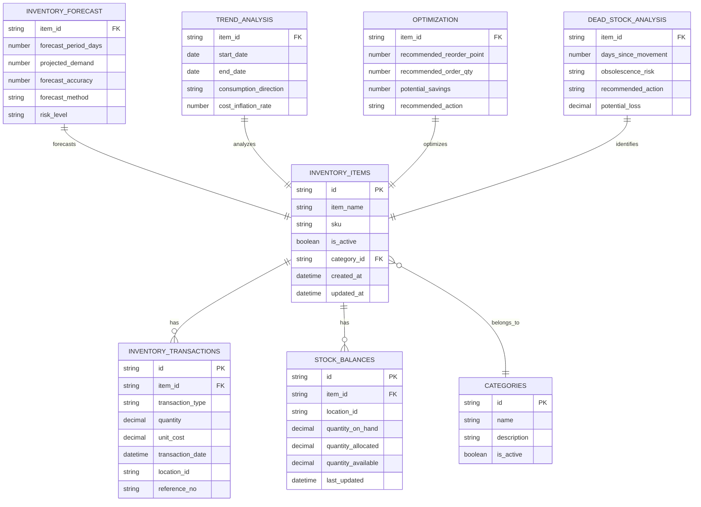

# Data Definition: Demand Forecasting

## Document Information
- **Module**: Operational Planning
- **Component**: Demand Forecasting
- **Version**: 1.0.0
- **Last Updated**: 2025-12-05
- **Status**: Active - For Implementation

## Related Documents
- [Business Requirements](./BR-demand-forecasting.md) - Functional and business rules
- [Use Cases](./UC-demand-forecasting.md) - User workflows and scenarios
- [Technical Specification](./TS-demand-forecasting.md) - System architecture and components
- [Flow Diagrams](./FD-demand-forecasting.md) - Visual workflow diagrams
- [Validations](./VAL-demand-forecasting.md) - Validation rules
- [Inventory Operations Shared Method](../../shared-methods/inventory-operations/SM-inventory-operations.md) - Inventory transaction patterns
- [Costing Methods Shared Method](../../shared-methods/inventory-valuation/SM-costing-methods.md) - FIFO/AVG costing integration

## Document History

| Version | Date | Author | Changes |
|---------|------|--------|---------|
| 1.0.0 | 2025-12-05 | Documentation Team | Initial version |

---

## 1. Entity Overview

### 1.1 Entity Relationship Diagram



---

## 2. Source Entities (Database Tables)

### 2.1 inventory_items

**Description**: Master table for inventory items subject to forecasting.

| Column | Type | Constraints | Description |
|--------|------|-------------|-------------|
| id | UUID | PK | Unique identifier |
| item_name | VARCHAR(255) | NOT NULL | Item display name |
| sku | VARCHAR(50) | UNIQUE | Stock keeping unit |
| description | TEXT | - | Item description |
| category_id | UUID | FK | Reference to categories |
| unit_of_measure | VARCHAR(20) | NOT NULL | Base UOM (ea, kg, L) |
| is_active | BOOLEAN | DEFAULT true | Active status |
| reorder_point | DECIMAL(10,2) | - | Current reorder level |
| reorder_quantity | DECIMAL(10,2) | - | Current order quantity |
| safety_stock | DECIMAL(10,2) | - | Current safety stock |
| lead_time_days | INTEGER | - | Supplier lead time |
| created_at | TIMESTAMP | NOT NULL | Creation timestamp |
| updated_at | TIMESTAMP | NOT NULL | Last update timestamp |

**Indexes**:
- `idx_inventory_items_active` on (is_active)
- `idx_inventory_items_category` on (category_id)
- `idx_inventory_items_sku` on (sku)

### 2.2 inventory_transactions

**Description**: Historical record of all inventory movements for analysis.

| Column | Type | Constraints | Description |
|--------|------|-------------|-------------|
| id | UUID | PK | Unique identifier |
| item_id | UUID | FK, NOT NULL | Reference to inventory_items |
| transaction_type | VARCHAR(20) | NOT NULL | Type of transaction |
| quantity | DECIMAL(10,3) | NOT NULL | Transaction quantity |
| unit_cost | DECIMAL(10,4) | - | Cost per unit |
| total_cost | DECIMAL(12,2) | - | Total transaction cost |
| transaction_date | TIMESTAMP | NOT NULL | When transaction occurred |
| location_id | UUID | FK | Storage location |
| reference_type | VARCHAR(50) | - | Source document type |
| reference_no | VARCHAR(50) | - | Source document number |
| lot_no | VARCHAR(50) | - | Lot/batch number |
| created_at | TIMESTAMP | NOT NULL | Record creation time |
| created_by | UUID | FK | User who created |

**Transaction Types**:
| Type | Direction | Description |
|------|-----------|-------------|
| RECEIPT | In | Goods received |
| ISSUE | Out | Goods issued to department |
| TRANSFER_IN | In | Inter-location transfer in |
| TRANSFER_OUT | Out | Inter-location transfer out |
| ADJUSTMENT_IN | In | Positive adjustment |
| ADJUSTMENT_OUT | Out | Negative adjustment |
| WASTE | Out | Spoilage/waste |
| RETURN | In | Returned goods |

**Indexes**:
- `idx_transactions_item_date` on (item_id, transaction_date)
- `idx_transactions_date` on (transaction_date)
- `idx_transactions_type` on (transaction_type)
- `idx_transactions_location` on (location_id)

### 2.3 stock_balances

**Description**: Current stock levels by item and location.

| Column | Type | Constraints | Description |
|--------|------|-------------|-------------|
| id | UUID | PK | Unique identifier |
| item_id | UUID | FK, NOT NULL | Reference to inventory_items |
| location_id | UUID | FK, NOT NULL | Storage location |
| quantity_on_hand | DECIMAL(10,3) | NOT NULL | Physical stock |
| quantity_allocated | DECIMAL(10,3) | DEFAULT 0 | Reserved stock |
| quantity_available | DECIMAL(10,3) | COMPUTED | Available = on_hand - allocated |
| last_movement_date | TIMESTAMP | - | Last transaction date |
| last_count_date | TIMESTAMP | - | Last physical count |
| updated_at | TIMESTAMP | NOT NULL | Last update timestamp |

**Unique Constraint**: (item_id, location_id)

**Indexes**:
- `idx_stock_balances_item` on (item_id)
- `idx_stock_balances_location` on (location_id)

### 2.4 categories

**Description**: Item categorization for grouping and analysis.

| Column | Type | Constraints | Description |
|--------|------|-------------|-------------|
| id | UUID | PK | Unique identifier |
| name | VARCHAR(100) | NOT NULL, UNIQUE | Category name |
| description | TEXT | - | Category description |
| parent_id | UUID | FK (self) | Parent category |
| is_active | BOOLEAN | DEFAULT true | Active status |
| sort_order | INTEGER | DEFAULT 0 | Display order |
| created_at | TIMESTAMP | NOT NULL | Creation timestamp |
| updated_at | TIMESTAMP | NOT NULL | Last update timestamp |

---

## 3. Output Entities (Computed Results)

### 3.1 InventoryForecast

**Description**: Demand forecast result for an inventory item.

| Field | Type | Description | Example |
|-------|------|-------------|---------|
| itemId | string | Inventory item ID | "inv-001" |
| itemName | string | Item display name | "Chicken Breast" |
| currentStock | number | Current quantity on hand | 150.5 |
| forecastPeriodDays | number | Forecast horizon | 30 |
| projectedDemand | number | Forecasted consumption | 120.0 |
| projectedEndingStock | number | Expected end balance | 30.5 |
| recommendedPurchaseQuantity | number | Suggested order qty | 89.5 |
| forecastAccuracy | number | Accuracy score (0-1) | 0.85 |
| seasonalityFactor | number | Seasonal adjustment | 1.15 |
| trendFactor | number | Trend adjustment | 1.02 |
| demandVariability | number | Coefficient of variation | 0.18 |
| forecastMethod | enum | Algorithm used | "moving_average" |
| confidenceLevel | number | Confidence % (0-100) | 85 |
| riskLevel | enum | Risk assessment | "low" |

**Forecast Methods Enum**:
- `moving_average` - 30-day rolling average
- `exponential_smoothing` - Alpha=0.3 weighted
- `linear_regression` - Trend-based
- `seasonal_decomposition` - Seasonal pattern

**Risk Levels Enum**:
- `low` - Score < 0.8
- `medium` - Score 0.8-1.5
- `high` - Score > 1.5

### 3.2 InventoryTrendAnalysis

**Description**: Comprehensive trend analysis for an inventory item.

| Field | Type | Description | Example |
|-------|------|-------------|---------|
| itemId | string | Inventory item ID | "inv-001" |
| itemName | string | Item display name | "Chicken Breast" |
| category | string | Item category | "Proteins" |
| analysisPeriod | object | Analysis date range | See below |
| consumptionTrend | object | Consumption analysis | See below |
| stockLevelTrend | object | Stock metrics | See below |
| costTrend | object | Cost analysis | See below |
| supplierPerformance | object | Supplier metrics | See below |
| recommendations | string[] | Action recommendations | ["Increase reorder point"] |

**analysisPeriod Object**:
| Field | Type | Description |
|-------|------|-------------|
| startDate | Date | Period start |
| endDate | Date | Period end |
| periodDays | number | Duration in days |

**consumptionTrend Object**:
| Field | Type | Description |
|-------|------|-------------|
| direction | enum | increasing / decreasing / stable |
| slope | number | Rate of change |
| confidence | number | Analysis confidence (0-1) |
| seasonalPattern | boolean | Has seasonal pattern |

**stockLevelTrend Object**:
| Field | Type | Description |
|-------|------|-------------|
| averageStock | number | Mean stock level |
| stockVariability | number | Coefficient of variation |
| stockoutFrequency | number | % time out of stock |
| overstockFrequency | number | % time overstocked |

**costTrend Object**:
| Field | Type | Description |
|-------|------|-------------|
| averageCost | Money | Mean unit cost |
| costVariability | number | Cost coefficient of variation |
| inflationRate | number | Cost increase rate |

**supplierPerformance Object**:
| Field | Type | Description |
|-------|------|-------------|
| averageLeadTime | number | Mean days to deliver |
| leadTimeVariability | number | Lead time variation |
| onTimeDeliveryRate | number | % on-time deliveries |
| qualityIssues | number | Quality issue count |

### 3.3 InventoryOptimization

**Description**: Optimization recommendation for an inventory item.

| Field | Type | Description | Example |
|-------|------|-------------|---------|
| itemId | string | Inventory item ID | "inv-001" |
| itemName | string | Item display name | "Chicken Breast" |
| currentMetrics | object | Current state | See below |
| optimizedMetrics | object | Target state | See below |
| potentialSavings | object | Financial impact | See below |
| implementationRisk | enum | Risk level | "medium" |
| recommendedAction | enum | Suggested action | "pilot" |

**currentMetrics Object**:
| Field | Type | Description |
|-------|------|-------------|
| averageStock | number | Current mean stock |
| turnoverRate | number | Annual turns |
| carryingCost | Money | Annual holding cost |
| serviceLevel | number | Current service % |

**optimizedMetrics Object**:
| Field | Type | Description |
|-------|------|-------------|
| recommendedReorderPoint | number | Optimal ROP |
| recommendedOrderQuantity | number | Optimal EOQ |
| recommendedSafetyStock | number | Optimal safety stock |
| expectedTurnoverRate | number | Target annual turns |
| expectedCarryingCost | Money | Target holding cost |
| expectedServiceLevel | number | Target service % |

**potentialSavings Object**:
| Field | Type | Description |
|-------|------|-------------|
| carryingCostSavings | Money | Holding cost reduction |
| stockoutCostSavings | Money | Stockout cost reduction |
| totalSavings | Money | Total annual savings |
| paybackPeriod | number | Months to ROI |

**implementationRisk Enum**:
- `low` - Safe to implement
- `medium` - Monitor closely
- `high` - Proceed with caution

**recommendedAction Enum**:
- `implement` - Full rollout (>$100 savings, low risk)
- `pilot` - Test first (>$50 savings)
- `monitor` - Wait and observe
- `reject` - Not recommended

### 3.4 DeadStockAnalysis

**Description**: Dead stock identification and recommendations.

| Field | Type | Description | Example |
|-------|------|-------------|---------|
| itemId | string | Inventory item ID | "inv-099" |
| itemName | string | Item display name | "Truffle Oil" |
| currentStock | number | Quantity on hand | 24 |
| currentValue | Money | Inventory value | {amount: 480, currency: "USD"} |
| lastMovementDate | Date | Last transaction | 2025-06-15 |
| daysSinceLastMovement | number | Days inactive | 175 |
| averageMonthlyConsumption | number | Historical usage | 0.5 |
| monthsOfStock | number | Stock coverage | 48 |
| obsolescenceRisk | enum | Risk level | "high" |
| recommendedAction | enum | Suggested action | "liquidate" |
| potentialLoss | Money | Expected loss | {amount: 288, currency: "USD"} |
| liquidationValue | Money | Recovery value | {amount: 144, currency: "USD"} |

**obsolescenceRisk Enum**:
- `low` - < 90 days no movement
- `medium` - 90-180 days no movement
- `high` - 180-365 days no movement
- `critical` - > 365 days or > 24 months stock

**recommendedAction Enum**:
- `continue_stocking` - Low risk, keep
- `reduce_stock` - Medium risk, lower inventory
- `liquidate` - High risk, high value, sell at discount
- `return_to_supplier` - High risk, negotiate return
- `write_off` - Critical risk, write off loss

### 3.5 InventoryPerformanceDashboard

**Description**: Aggregated performance metrics for dashboard display.

| Field | Type | Description |
|-------|------|-------------|
| overallMetrics | object | KPI summary |
| categoryBreakdown | array | By-category metrics |
| locationBreakdown | array | By-location metrics |
| alerts | object | Alert counts |
| trends | array | Period comparisons |

**overallMetrics Object**:
| Field | Type | Description |
|-------|------|-------------|
| totalInventoryValue | Money | Total stock value |
| inventoryTurnover | number | Annual turns |
| daysOfInventory | number | DSI metric |
| fillRate | number | Order fill % |
| stockoutRate | number | Stockout % |
| accuracyRate | number | Count accuracy % |
| shrinkageRate | number | Loss % |

**categoryBreakdown Array Item**:
| Field | Type | Description |
|-------|------|-------------|
| categoryId | string | Category ID |
| categoryName | string | Category name |
| value | Money | Category value |
| turnover | number | Category turns |
| contribution | number | % of total value |
| items | number | Item count |
| alerts | number | Alert count |

**locationBreakdown Array Item**:
| Field | Type | Description |
|-------|------|-------------|
| locationId | string | Location ID |
| locationName | string | Location name |
| value | Money | Location value |
| utilization | number | Space utilization % |
| accuracy | number | Count accuracy % |
| items | number | Item count |
| movements | number | Transaction count |

**alerts Object**:
| Field | Type | Description |
|-------|------|-------------|
| lowStock | number | Low stock count |
| overstock | number | Overstock count |
| deadStock | number | Dead stock count |
| expiring | number | Expiring item count |
| highValue | number | High value item count |
| fastMoving | number | Fast-moving count |

**trends Array Item**:
| Field | Type | Description |
|-------|------|-------------|
| metric | string | Metric name |
| current | number | Current value |
| previous | number | Prior period value |
| change | number | Absolute change |
| changePercentage | number | % change |
| trend | enum | up / down / stable |

---

## 4. Shared Types

### 4.1 Money Type

**Description**: Monetary value with currency.

| Field | Type | Description |
|-------|------|-------------|
| amount | number | Decimal amount |
| currency | string | ISO currency code |

**Example**: `{ amount: 100.50, currency: "USD" }`

### 4.2 AnalyticsResult<T>

**Description**: Standard result wrapper for all analytics operations.

| Field | Type | Description |
|-------|------|-------------|
| success | boolean | Operation success |
| data | T (optional) | Result data |
| error | string (optional) | Error message |
| metadata | object (optional) | Execution metadata |

**metadata Object**:
| Field | Type | Description |
|-------|------|-------------|
| calculationTime | number | Milliseconds to compute |
| dataPoints | number | Items processed |
| confidence | number | Overall confidence |
| lastUpdated | Date | Calculation timestamp |
| nextUpdate | Date | Cache expiration |

---

## 5. Data Relationships

### 5.1 Primary Relationships

```
inventory_items (1) ──────< (n) inventory_transactions
inventory_items (1) ──────< (n) stock_balances
categories (1) ──────< (n) inventory_items
```

### 5.2 Analysis Relationships

- **InventoryForecast**: One per item per forecast request
- **InventoryTrendAnalysis**: One per item per analysis period
- **InventoryOptimization**: One per item per optimization request
- **DeadStockAnalysis**: One per item meeting threshold criteria
- **InventoryPerformanceDashboard**: Single aggregated result per request

---

## 6. Data Constraints

### 6.1 Business Constraints

| Constraint | Rule | Enforcement |
|------------|------|-------------|
| Active Items Only | Forecasts for is_active = true only | Service filter |
| Minimum History | 30 days for basic forecast | Validation |
| Seasonal Minimum | 60 days for seasonal analysis | Method fallback |
| Non-Negative Stock | currentStock >= 0 | Database constraint |
| Valid Date Range | endDate > startDate | Parameter validation |

### 6.2 Value Constraints

| Field | Constraint | Valid Range |
|-------|------------|-------------|
| forecastPeriodDays | Integer | 1-365 |
| forecastAccuracy | Decimal | 0.0-1.0 |
| confidenceLevel | Decimal | 0-100 |
| seasonalityFactor | Decimal | 0.1-10.0 |
| trendFactor | Decimal | 0.1-10.0 |
| targetServiceLevel | Decimal | 80-99 |
| thresholdDays | Integer | 30-365 |

---

## 7. Data Retention

| Data Type | Retention Period | Archive Policy |
|-----------|-----------------|----------------|
| inventory_transactions | 3 years | Monthly archive |
| stock_balances | Current only | Snapshot on period close |
| Forecast results | Session/cache | 1 hour cache |
| Trend analysis | Session/cache | 4 hour cache |
| Dashboard data | Session/cache | 15 minute cache |

---

**Document End**
