# Flow Diagrams: Demand Forecasting

## Document Information
- **Module**: Operational Planning
- **Component**: Demand Forecasting
- **Version**: 1.0.0
- **Last Updated**: 2025-12-05
- **Status**: Active - For Implementation

## Related Documents
- [Business Requirements](./BR-demand-forecasting.md) - Functional and business rules
- [Use Cases](./UC-demand-forecasting.md) - User workflows and scenarios
- [Technical Specification](./TS-demand-forecasting.md) - System architecture and components
- [Data Definition](./DD-demand-forecasting.md) - Database entity descriptions
- [Validations](./VAL-demand-forecasting.md) - Validation rules
- [Inventory Operations Shared Method](../../shared-methods/inventory-operations/SM-inventory-operations.md) - Inventory transaction patterns
- [Costing Methods Shared Method](../../shared-methods/inventory-valuation/SM-costing-methods.md) - FIFO/AVG costing integration

## Document History

| Version | Date | Author | Changes |
|---------|------|--------|---------|
| 1.0.0 | 2025-12-05 | Documentation Team | Initial version |

---

## 1. High-Level Process Flow

### 1.1 Demand Forecasting System Overview

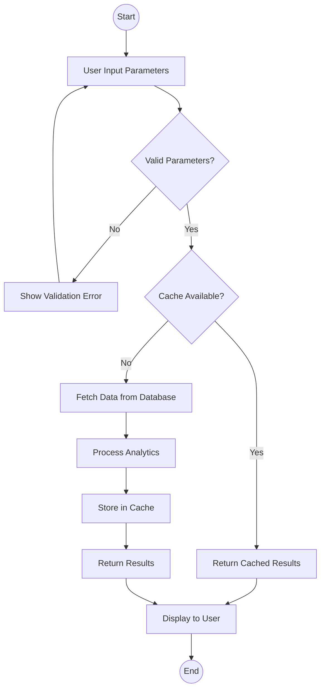

---

## 2. Forecast Generation Flow

### 2.1 Generate Inventory Forecast

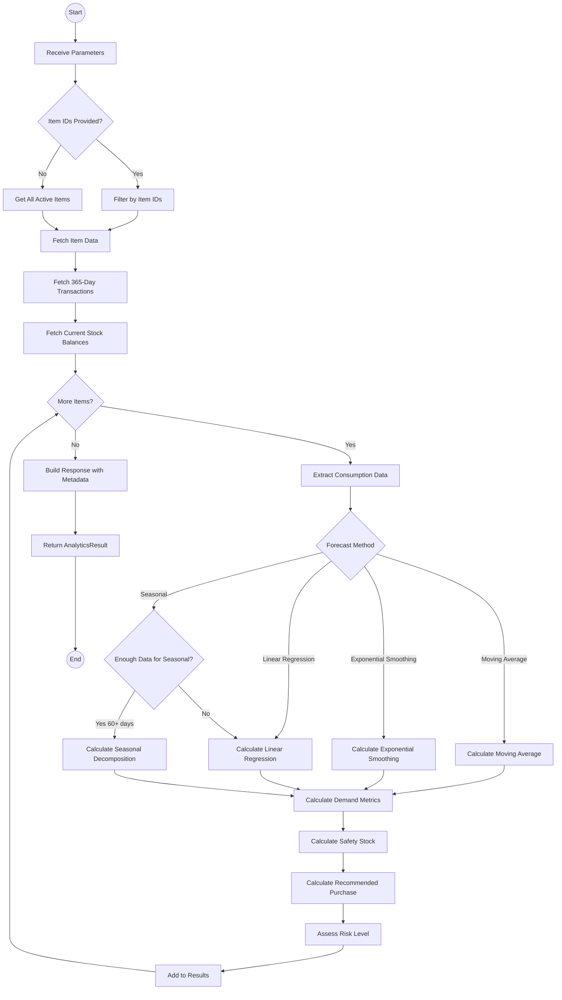

### 2.2 Forecasting Algorithm Selection

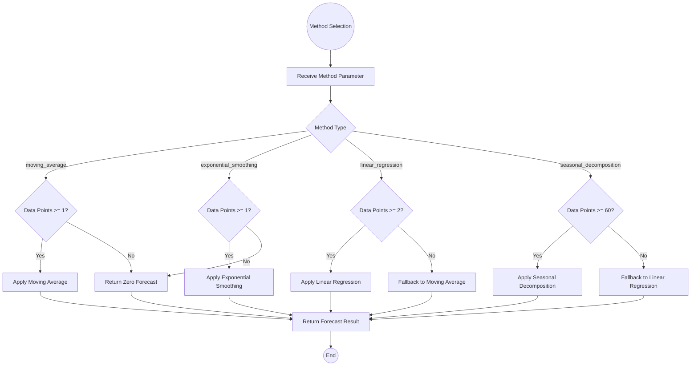

---

## 3. Trend Analysis Flow

### 3.1 Perform Trend Analysis

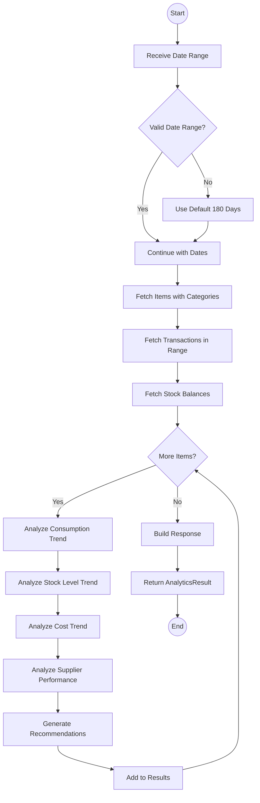

### 3.2 Consumption Trend Analysis Detail

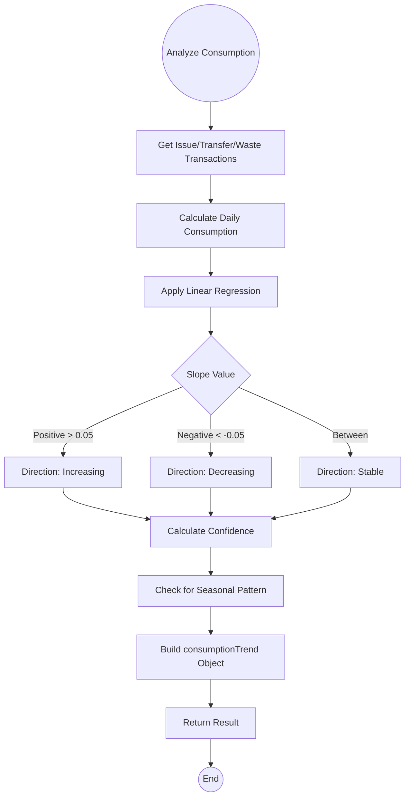

---

## 4. Optimization Flow

### 4.1 Generate Optimization Recommendations

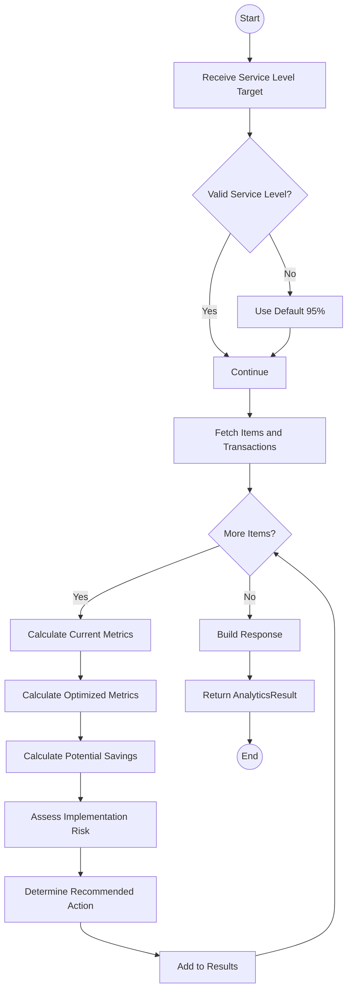

### 4.2 Recommended Action Decision

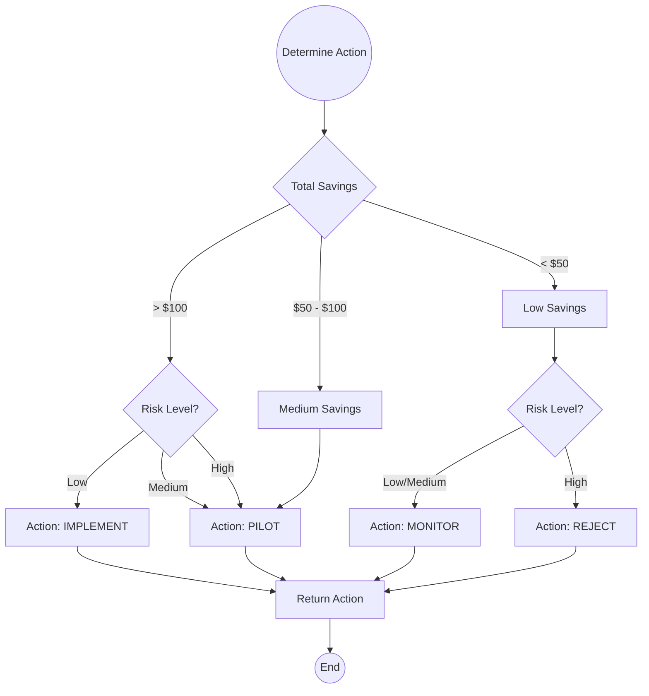

---

## 5. Dead Stock Analysis Flow

### 5.1 Analyze Dead Stock

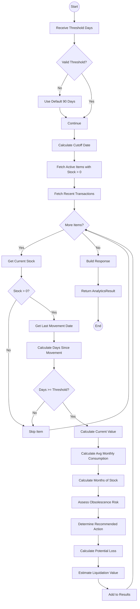

### 5.2 Obsolescence Risk Assessment

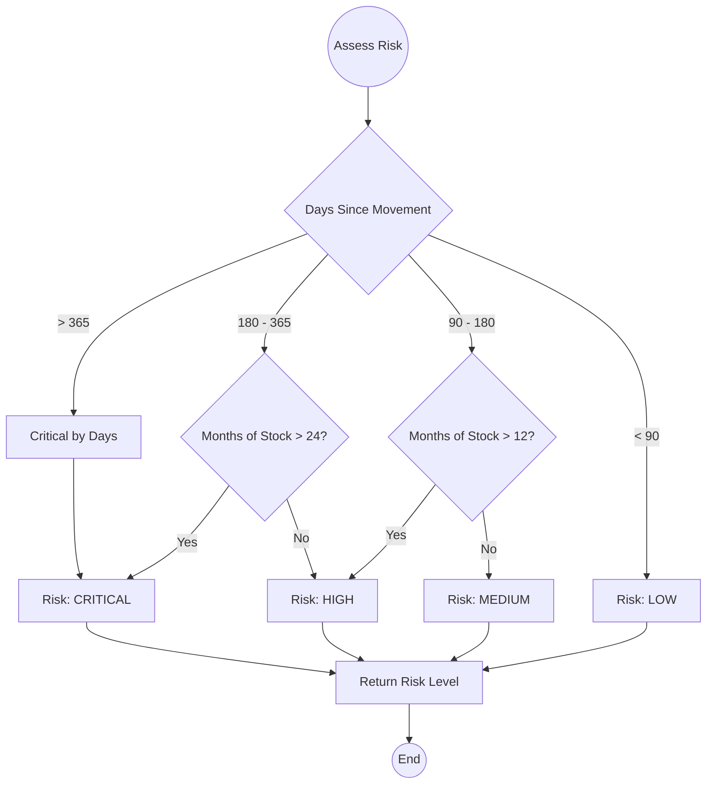

### 5.3 Dead Stock Action Determination

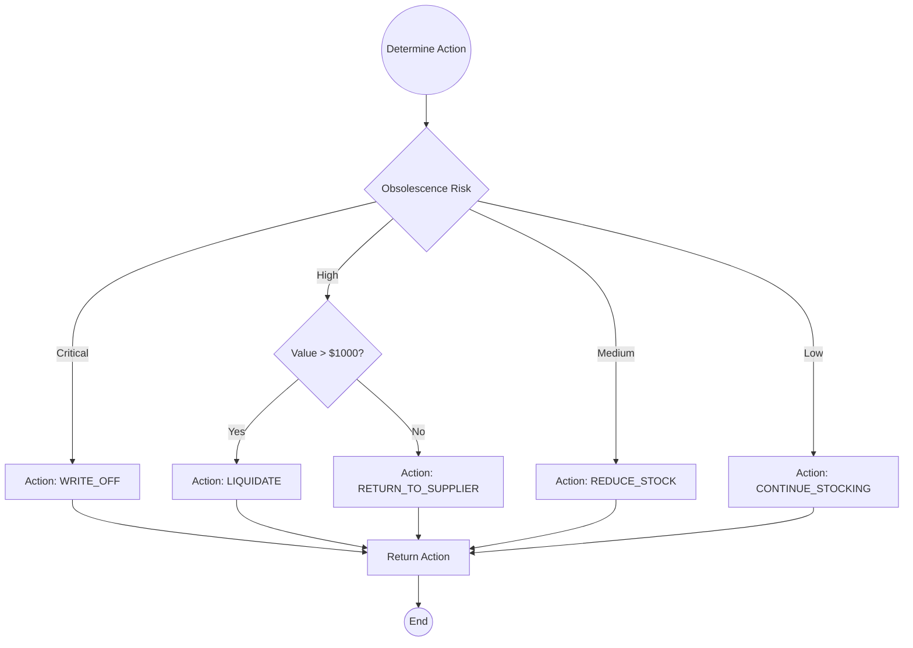

---

## 6. Dashboard Generation Flow

### 6.1 Generate Performance Dashboard

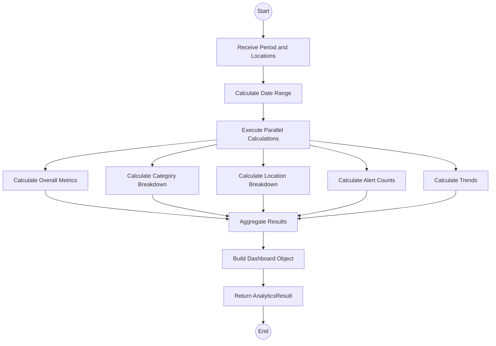

### 6.2 Alert Count Calculation

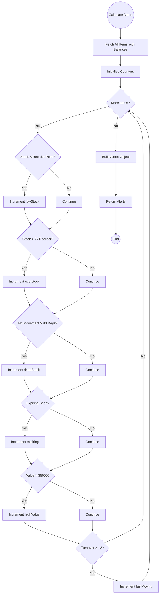

---

## 7. Caching Flow

### 7.1 Cache Check and Update

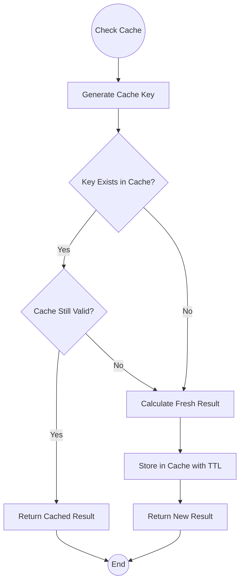

### 7.2 Cache Key Generation

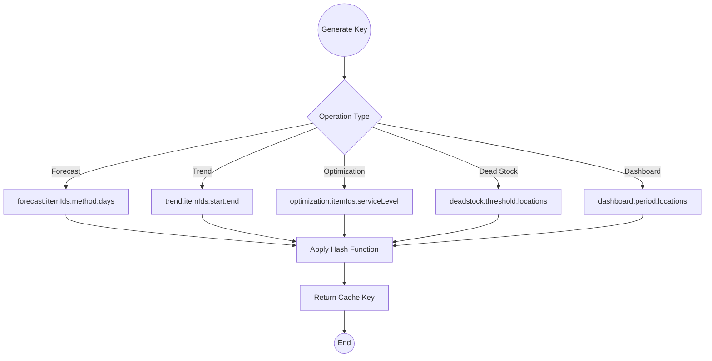

---

## 8. Error Handling Flow

### 8.1 Error Recovery Pattern

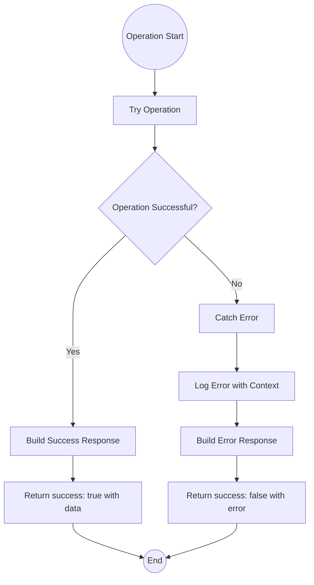

---

## 9. Integration Flows

### 9.1 Shared Method Integration

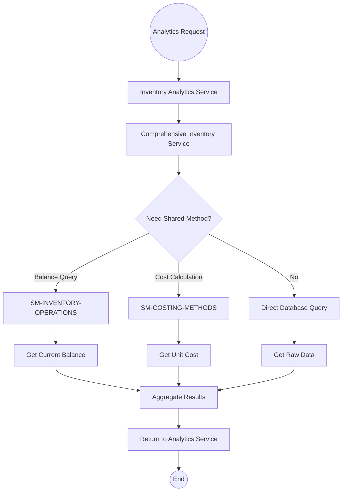

---

## 10. State Diagrams

### 10.1 Forecast Request States

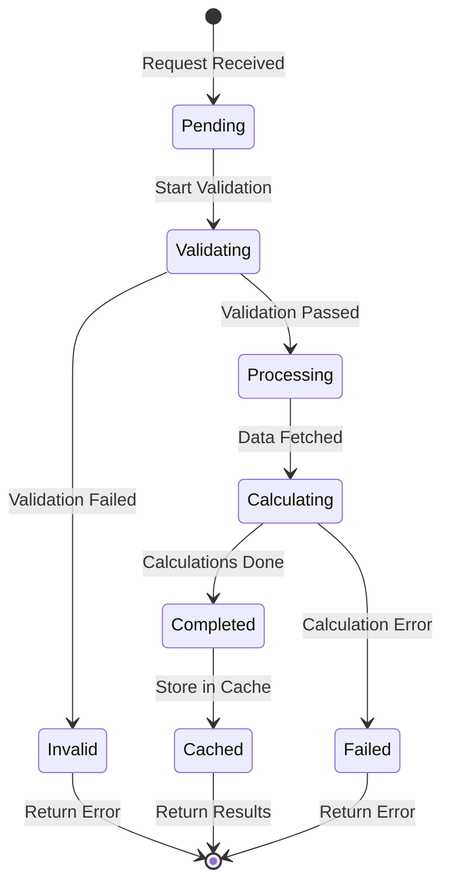

### 10.2 Risk Level States

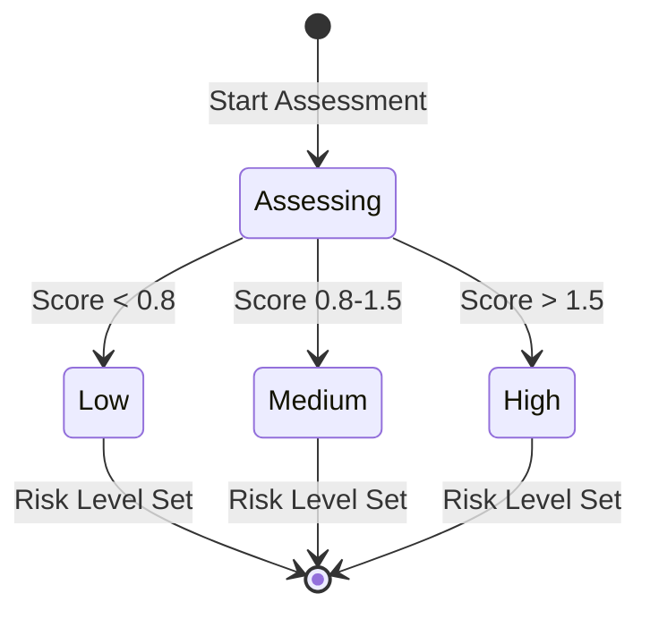

---

**Document End**
