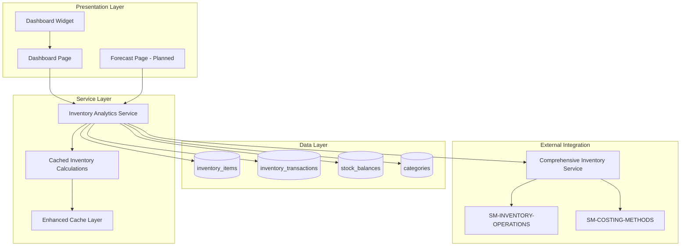
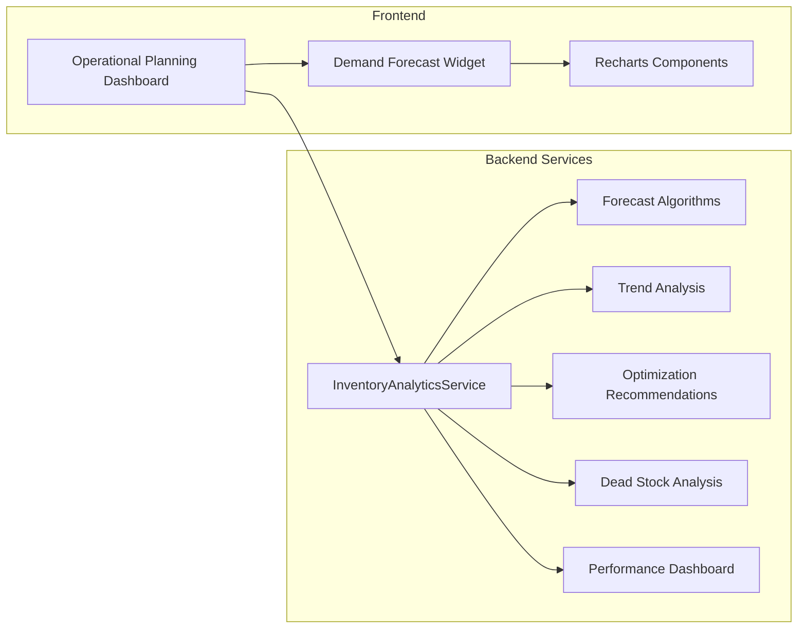
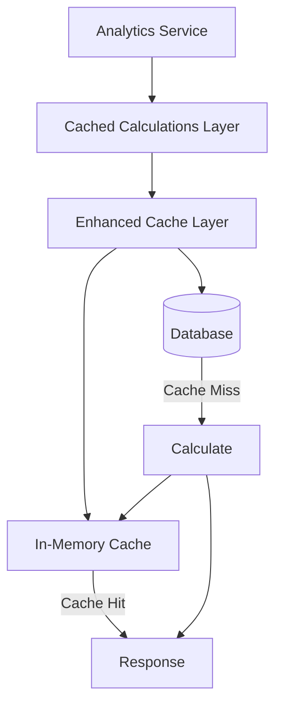

# Technical Specification: Demand Forecasting

## Document Information
- **Module**: Operational Planning
- **Component**: Demand Forecasting
- **Version**: 1.0.0
- **Last Updated**: 2025-12-05
- **Status**: Active - For Implementation

## Related Documents
- [Business Requirements](./BR-demand-forecasting.md) - Functional and business rules
- [Use Cases](./UC-demand-forecasting.md) - User workflows and scenarios
- [Data Definition](./DD-demand-forecasting.md) - Database entity descriptions
- [Flow Diagrams](./FD-demand-forecasting.md) - Visual workflow diagrams
- [Validations](./VAL-demand-forecasting.md) - Validation rules
- [Inventory Operations Shared Method](../../shared-methods/inventory-operations/SM-inventory-operations.md) - Inventory transaction patterns
- [Costing Methods Shared Method](../../shared-methods/inventory-valuation/SM-costing-methods.md) - FIFO/AVG costing integration

## Document History

| Version | Date | Author | Changes |
|---------|------|--------|---------|
| 1.0.0 | 2025-12-05 | Documentation Team | Initial version |

---

## 1. System Architecture

### 1.1 High-Level Architecture



### 1.2 Component Architecture



---

## 2. Service Layer

### 2.1 InventoryAnalyticsService

**Location**: `lib/services/inventory/inventory-analytics-service.ts`

**Purpose**: Provides advanced analytics and forecasting capabilities for inventory management.

**Dependencies**:
- Prisma Client (database access)
- ComprehensiveInventoryService (inventory operations)
- CachedInventoryCalculations (caching layer)
- EnhancedCacheLayer (cache management)

### 2.2 Service Methods

| Method | Purpose | Input | Output |
|--------|---------|-------|--------|
| `generateInventoryForecast` | Generate demand forecasts | itemIds, forecastDays, method | InventoryForecast[] |
| `performTrendAnalysis` | Analyze consumption trends | itemIds, startDate, endDate | InventoryTrendAnalysis[] |
| `generateOptimizationRecommendations` | Generate optimization suggestions | itemIds, targetServiceLevel | InventoryOptimization[] |
| `analyzeDeadStock` | Identify dead stock items | thresholdDays, locationIds | DeadStockAnalysis[] |
| `generatePerformanceDashboard` | Generate KPI dashboard | periodDays, locationIds | InventoryPerformanceDashboard |

### 2.3 Private Helper Methods

| Method | Purpose |
|--------|---------|
| `extractConsumptionData` | Extract consumption quantities from transactions |
| `calculateMovingAverageForecast` | 30-day rolling average forecast |
| `calculateExponentialSmoothingForecast` | Alpha=0.3 weighted forecast |
| `calculateLinearRegressionForecast` | Least squares trend forecast |
| `calculateSeasonalForecast` | Seasonal pattern-adjusted forecast |
| `calculateDemandVariability` | Coefficient of variation calculation |
| `calculateSafetyStock` | Safety stock for 95% service level |
| `assessForecastRisk` | Risk level assessment (low/medium/high) |
| `calculateStandardDeviation` | Statistical standard deviation |
| `detectSeasonalPattern` | Monthly seasonal pattern detection |
| `calculateTrendFactor` | Trend direction and magnitude |

---

## 3. Algorithm Specifications

### 3.1 Moving Average Forecast

**Description**: Simple moving average using 30-day window or available data.

**Formula**:
```
Average = Σ(daily_consumption) / window_size
Projected_Demand = Average × forecast_days
```

**Parameters**:
- Window Size: min(30, available_data_length)
- Accuracy: Calculated from standard deviation ratio

**Characteristics**:
- Simple and reliable baseline
- Best for stable demand patterns
- Less responsive to recent changes

### 3.2 Exponential Smoothing Forecast

**Description**: Weighted average giving more importance to recent data.

**Formula**:
```
Forecast[t] = α × Actual[t] + (1-α) × Forecast[t-1]
where α = 0.3
```

**Parameters**:
- Alpha (α): 0.3 (moderate responsiveness)
- Initial forecast: First data point

**Characteristics**:
- More responsive to trends
- Good for trending demand
- Single parameter simplicity

### 3.3 Linear Regression Forecast

**Description**: Trend-based forecasting using least squares regression.

**Formula**:
```
y = mx + b
where:
  m = (n×Σxy - Σx×Σy) / (n×Σx² - (Σx)²)
  b = (Σy - m×Σx) / n
```

**Parameters**:
- Slope (m): Rate of change
- Intercept (b): Baseline demand
- Trend Factor: 1 ± (slope × 0.1)

**Characteristics**:
- Captures linear trends
- Requires minimum 2 data points
- Best for consistent growth/decline

### 3.4 Seasonal Decomposition Forecast

**Description**: Decomposes data into trend and seasonal components.

**Formula**:
```
Forecast = Base_Forecast × Seasonality_Factor × Trend_Factor
```

**Parameters**:
- Season Length: 30 days (monthly)
- Minimum Data: 60 days (2 complete seasons)
- Seasonality Factor: Ratio to overall average

**Characteristics**:
- Captures repeating patterns
- Requires sufficient historical data
- Falls back to linear regression if insufficient data

### 3.5 Safety Stock Calculation

**Formula**:
```
Safety_Stock = Projected_Demand × Demand_Variability × 1.65
```

**Service Level Factor**:
- 1.65 corresponds to 95% service level
- Based on normal distribution Z-score

### 3.6 Risk Assessment

**Risk Score Formula**:
```
Risk_Score = (1 - Accuracy) + Variability + (Ending_Stock < 0 ? 1 : 0)
```

**Risk Levels**:
- LOW: Risk_Score < 0.8
- MEDIUM: 0.8 ≤ Risk_Score ≤ 1.5
- HIGH: Risk_Score > 1.5

---

## 4. Data Access Patterns

### 4.1 Database Queries

**Forecast Generation**:
```sql
-- Retrieve items with transaction history
SELECT i.*, t.*, sb.*
FROM inventory_items i
LEFT JOIN inventory_transactions t ON i.id = t.item_id
LEFT JOIN stock_balances sb ON i.id = sb.item_id
WHERE i.is_active = true
  AND t.transaction_date >= (NOW() - INTERVAL '365 days')
ORDER BY t.transaction_date ASC
```

**Dead Stock Analysis**:
```sql
-- Items with no recent movement
SELECT i.*, MAX(t.transaction_date) as last_movement
FROM inventory_items i
LEFT JOIN inventory_transactions t ON i.id = t.item_id
  AND t.transaction_type IN ('ISSUE', 'TRANSFER_OUT', 'WASTE')
JOIN stock_balances sb ON i.id = sb.item_id
WHERE i.is_active = true
  AND sb.quantity_on_hand > 0
GROUP BY i.id
HAVING MAX(t.transaction_date) < (NOW() - INTERVAL '90 days')
   OR MAX(t.transaction_date) IS NULL
```

### 4.2 Transaction Types

| Type | Direction | Used In |
|------|-----------|---------|
| ISSUE | Out | Consumption analysis |
| TRANSFER_OUT | Out | Consumption analysis |
| WASTE | Out | Consumption analysis |
| RECEIPT | In | Not in consumption |
| ADJUSTMENT | Both | Contextual |

---

## 5. Caching Strategy

### 5.1 Cache Architecture



### 5.2 Cache Configuration

| Operation | Cache Duration | Invalidation Trigger |
|-----------|---------------|---------------------|
| Forecast | 1 hour | New transactions |
| Trend Analysis | 4 hours | Daily refresh |
| Optimization | 2 hours | Stock changes |
| Dead Stock | 24 hours | Daily refresh |
| Dashboard | 15 minutes | Any stock change |

### 5.3 Cache Key Structure

```
forecast:{itemIds}:{method}:{days}:{hash}
trend:{itemIds}:{startDate}:{endDate}:{hash}
optimization:{itemIds}:{serviceLevel}:{hash}
deadstock:{threshold}:{locationIds}:{hash}
dashboard:{period}:{locationIds}:{hash}
```

---

## 6. Integration Points

### 6.1 Shared Method: SM-INVENTORY-OPERATIONS

**Integration Purpose**: Real-time stock balance queries and transaction recording.

**Used Methods**:
- `getBalance(itemId, locationId)` - Current stock levels
- `getTransactionHistory(itemId, dateRange)` - Historical consumption
- `validateAvailability(itemId, quantity)` - Stock checks

**Integration Pattern**:
```
InventoryAnalyticsService
  └── ComprehensiveInventoryService
        └── SM-INVENTORY-OPERATIONS
              ├── Inventory Balance Service
              └── Transaction Recording Service
```

### 6.2 Shared Method: SM-COSTING-METHODS

**Integration Purpose**: Cost calculations for inventory valuation.

**Used Methods**:
- `getFIFOCost(itemId, locationId)` - FIFO unit cost
- `getPeriodicAverageCost(itemId, period)` - Average cost
- `getCostVariance(itemId, period1, period2)` - Cost trend

**Integration Pattern**:
```
InventoryAnalyticsService
  └── Cost Trend Analysis
        └── SM-COSTING-METHODS
              ├── FIFO Cost Calculation
              └── Periodic Average Calculation
```

---

## 7. Frontend Components

### 7.1 Dashboard Widget

**Location**: `app/(main)/operational-planning/page.tsx`

**Component**: Demand Forecast vs Actual Widget

**Technology**:
- React 18 with TypeScript
- Recharts library for visualization
- React Beautiful DND for drag-and-drop

**Features**:
- 7-day rolling forecast vs actual chart
- Dual-line visualization
- Variance highlighting (>10%)
- Draggable widget positioning

### 7.2 Data Structure

```typescript
const demandForecastData = [
  { day: 'Mon', forecast: 1000, actual: 950 },
  { day: 'Tue', forecast: 1200, actual: 1150 },
  { day: 'Wed', forecast: 1100, actual: 1200 },
  { day: 'Thu', forecast: 1300, actual: 1250 },
  { day: 'Fri', forecast: 1500, actual: 1450 },
  { day: 'Sat', forecast: 1800, actual: 1700 },
  { day: 'Sun', forecast: 1600, actual: 1550 }
]
```

### 7.3 Chart Configuration

```typescript
<LineChart data={demandForecastData}>
  <XAxis dataKey="day" />
  <YAxis />
  <Tooltip />
  <Legend />
  <Line type="monotone" dataKey="forecast" stroke="#8884d8" name="Forecast" />
  <Line type="monotone" dataKey="actual" stroke="#82ca9d" name="Actual" />
</LineChart>
```

---

## 8. Performance Requirements

### 8.1 Response Time Targets

| Operation | Target | Max Items |
|-----------|--------|-----------|
| Forecast Generation | < 5 seconds | 1000 |
| Trend Analysis | < 10 seconds | 500 |
| Optimization | < 5 seconds | 500 |
| Dead Stock | < 3 seconds | All |
| Dashboard | < 3 seconds | All |
| Widget Render | < 500ms | 7 days |

### 8.2 Scalability Limits

| Metric | Limit |
|--------|-------|
| Inventory Items | 50,000 |
| Transaction History | 365 days |
| Concurrent Users | 50 |
| Batch Size | 100 items |

### 8.3 Optimization Techniques

- **Batch Processing**: Process items in batches of 100
- **Parallel Queries**: Independent database queries run concurrently
- **Data Limiting**: Transaction history limited to relevant period
- **Index Optimization**: Queries use transaction_date indexes
- **Result Caching**: Computed results cached for reuse

---

## 9. Error Handling

### 9.1 Result Pattern

All service methods return `AnalyticsResult<T>`:

```typescript
interface AnalyticsResult<T> {
  success: boolean
  data?: T
  error?: string
  metadata?: {
    calculationTime?: number
    dataPoints?: number
    confidence?: number
    lastUpdated?: Date
    nextUpdate?: Date
  }
}
```

### 9.2 Error Categories

| Error Type | Handling | User Message |
|------------|----------|--------------|
| No Data | Return empty result | "No data available for analysis" |
| Timeout | Return partial result | "Calculation timed out, showing partial results" |
| Invalid Input | Reject request | "Invalid parameters: [details]" |
| Database Error | Log and return error | "Unable to retrieve data, please try again" |
| Calculation Error | Log and skip item | "Some items could not be analyzed" |

### 9.3 Fallback Strategies

| Scenario | Fallback |
|----------|----------|
| Insufficient data for seasonal | Use linear regression |
| No transaction history | Return zero forecast with warning |
| Cache unavailable | Calculate in real-time |
| Service timeout | Return cached results if available |

---

## 10. Security Requirements

### 10.1 Access Control

| Role | Forecast | Trends | Optimization | Dead Stock | Dashboard |
|------|----------|--------|--------------|------------|-----------|
| Inventory Manager | Full | Full | Full | View | Full |
| Operations Manager | View | View | View | - | Full |
| Financial Controller | View | View | Full | Full | Full |
| Purchasing Manager | View | View | View | - | View |
| General Manager | View | View | View | View | Full |
| Storekeeper | View (Location) | - | - | - | View (Location) |

### 10.2 Data Protection

- Cost data requires finance role for detailed view
- Location filtering enforced based on user permissions
- Audit trail maintained for all analytics requests
- No PII in analytics calculations

---

## 11. Monitoring and Logging

### 11.1 Metrics to Track

| Metric | Type | Purpose |
|--------|------|---------|
| Calculation Time | Histogram | Performance monitoring |
| Cache Hit Rate | Counter | Cache effectiveness |
| Error Rate | Counter | Reliability monitoring |
| Data Points Processed | Counter | Throughput tracking |
| Forecast Accuracy | Gauge | Quality monitoring |

### 11.2 Log Events

| Event | Level | Data |
|-------|-------|------|
| Forecast Generated | INFO | method, items, duration |
| Cache Hit | DEBUG | key, age |
| Cache Miss | DEBUG | key |
| Calculation Error | ERROR | item, error, stack |
| Timeout | WARN | operation, duration |

---

## 12. Future Enhancements

### 12.1 Phase 2 (Planned)

- Dedicated demand forecasting page UI
- Server actions for forecast generation
- Mock data for development/testing
- User-configurable algorithm parameters

### 12.2 Phase 3 (Roadmap)

- Machine learning models integration
- Event-driven demand adjustments
- Automatic reorder point updates
- POS sales data integration

---

**Document End**
