# Inventory Planning - Flow Diagrams

## Document Information

| Field | Value |
|-------|-------|
| Module | Inventory Planning |
| Version | 1.0.0 |
| Last Updated | 2025-12-06 |
| Status | Draft |
| Diagram Format | Mermaid 8.8.2 Compatible |

---

## 1. Module Navigation Flow

### 1.1 Inventory Planning Navigation

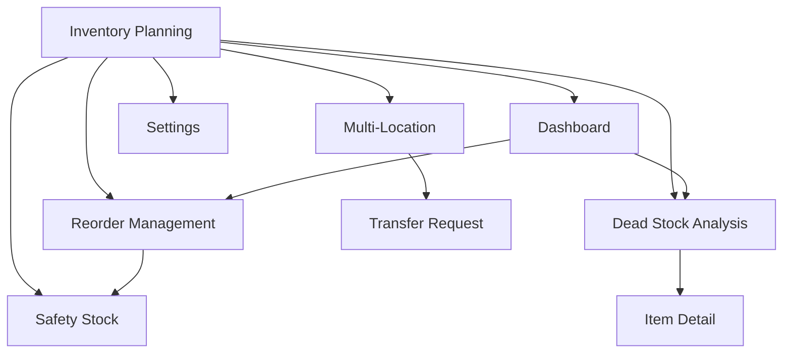

---

## 2. Dashboard Flow

### 2.1 Dashboard Load Flow

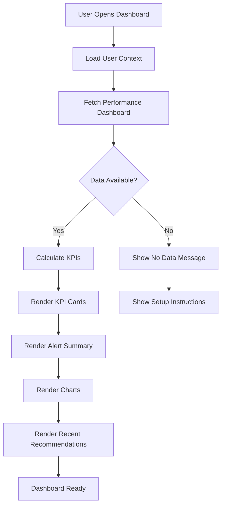

### 2.2 Dashboard Interaction Flow

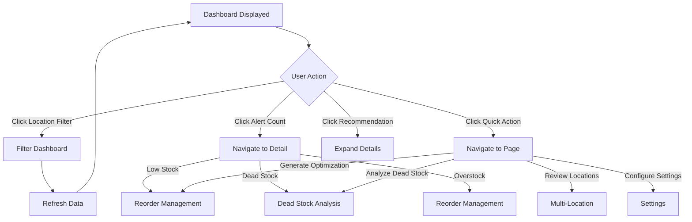

---

## 3. Optimization Flow

### 3.1 Generate Optimization Recommendations

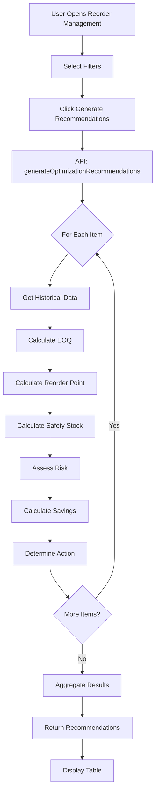

### 3.2 EOQ Calculation Detail

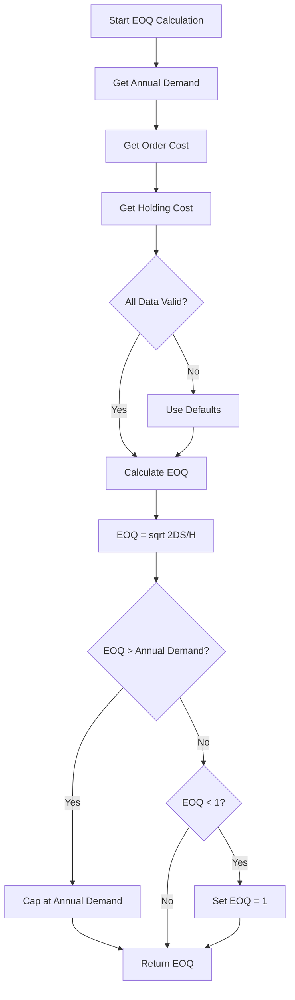

### 3.3 Apply Recommendations Flow

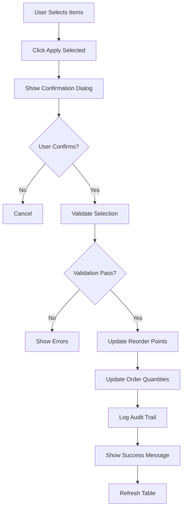

---

## 4. Dead Stock Analysis Flow

### 4.1 Dead Stock Identification

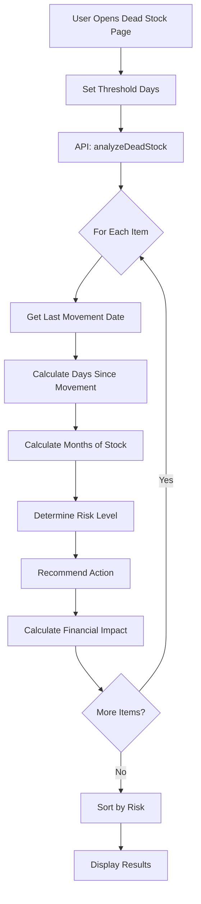

### 4.2 Risk Classification Logic

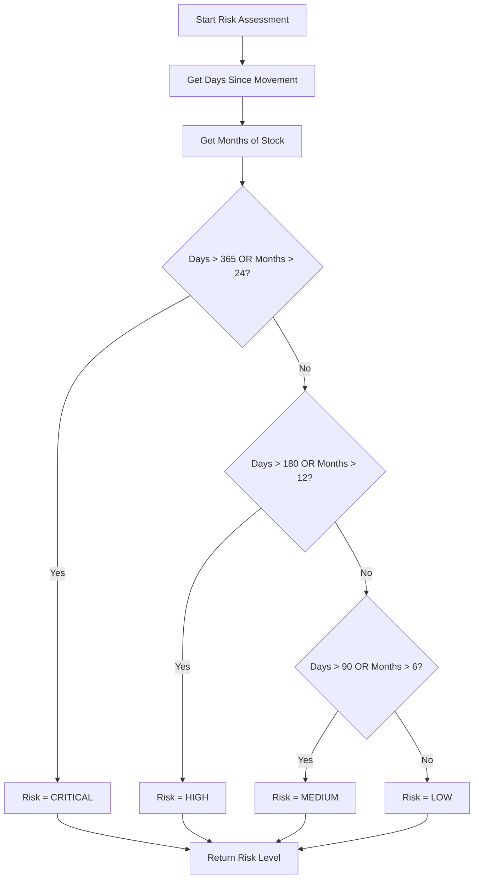

### 4.3 Dead Stock Action Flow

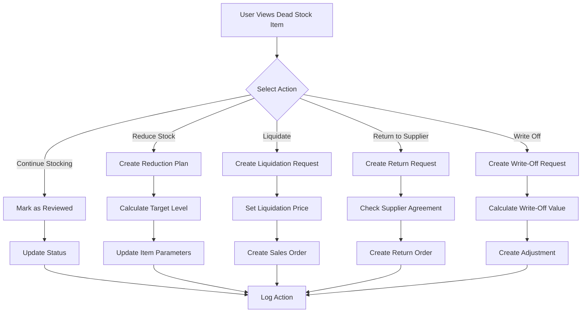

---

## 5. Safety Stock Flow

### 5.1 Safety Stock Calculation

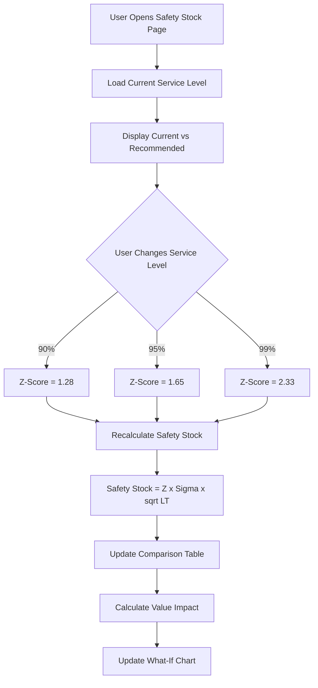

### 5.2 Apply Safety Stock Changes

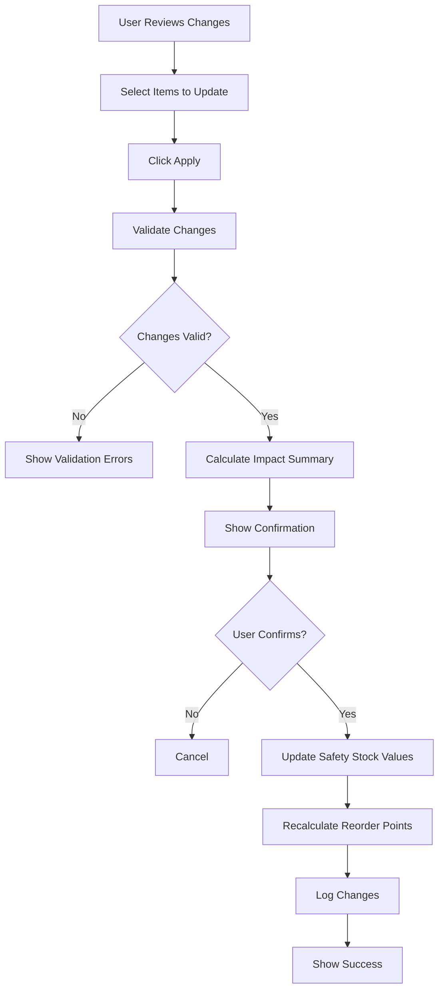

---

## 6. Multi-Location Flow

### 6.1 Location Performance Analysis

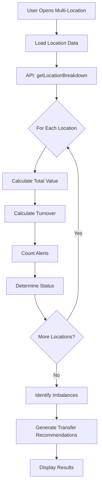

### 6.2 Transfer Recommendation Logic

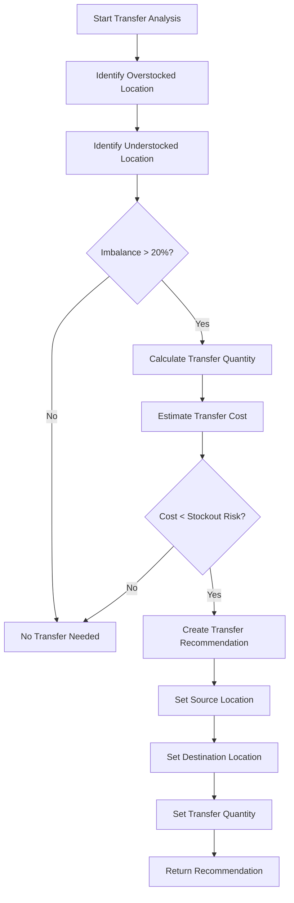

---

## 7. Settings Configuration Flow

### 7.1 Save Settings Flow

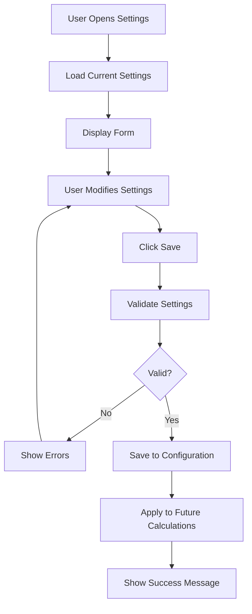

---

## 8. Integration Flows

### 8.1 Demand Forecasting Integration

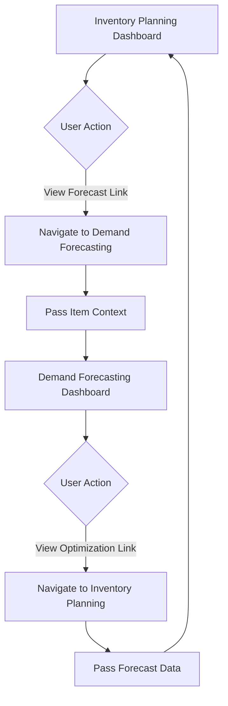

### 8.2 Inventory Management Integration

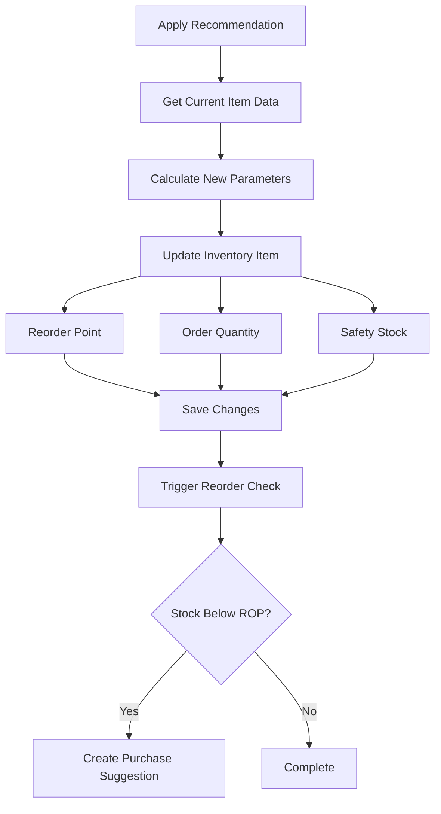

---

## 9. Error Handling Flows

### 9.1 API Error Flow

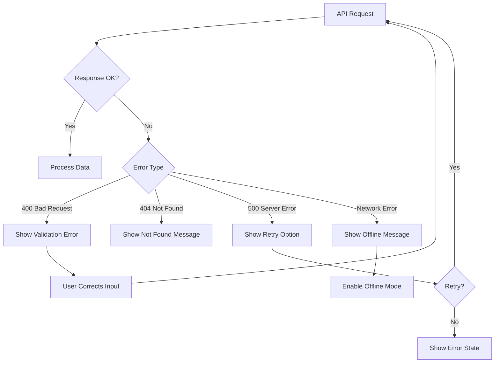

### 9.2 Data Validation Flow

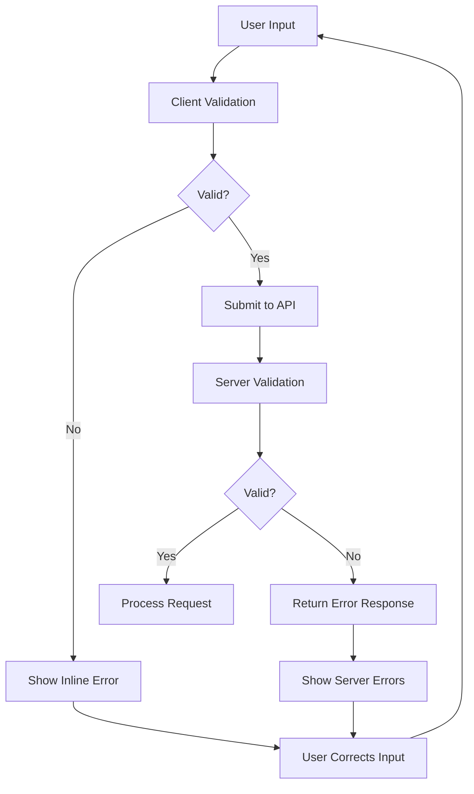

---

## 10. State Management Flow

### 10.1 Filter State Flow

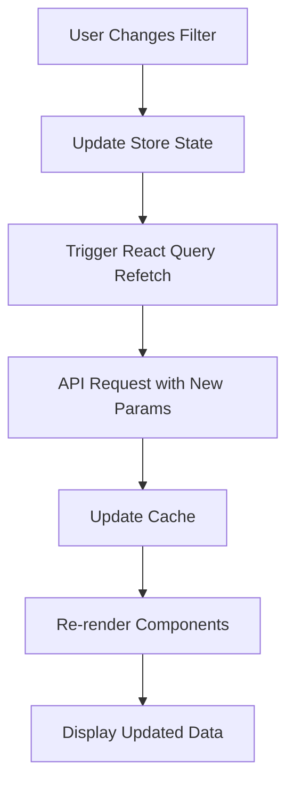

### 10.2 Selection State Flow

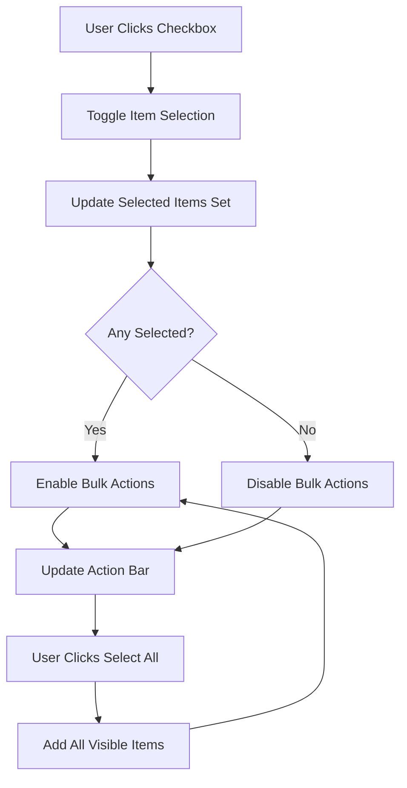

---

**Document End**
