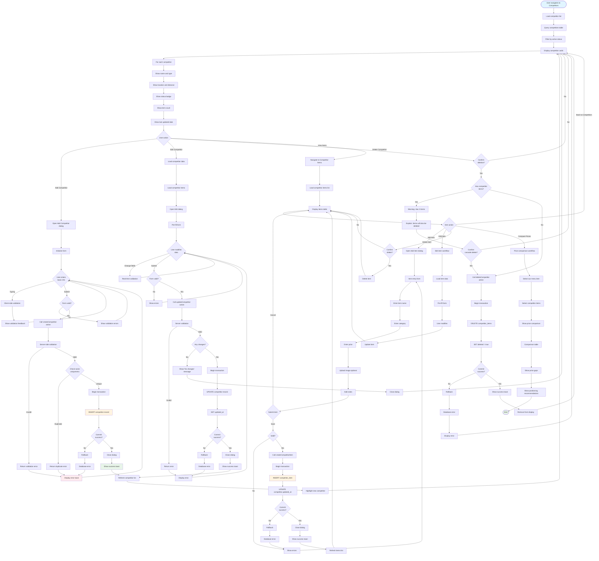
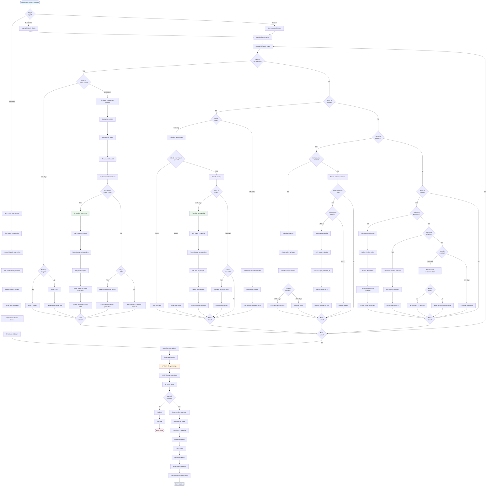

# Menu Engineering - Flow Diagrams (FD)

## Document Information
- **Document Type**: Flow Diagrams Document
- **Module**: Operational Planning > Menu Engineering
- **Version**: 1.1.0
- **Last Updated**: 2025-01-05

## Document History

| Version | Date | Author | Changes |
|---------|------|--------|---------|
| 1.1.0 | 2025-12-10 | Documentation Team | Standardized reference number format (XXX-YYMM-NNNN) |
| 1.1 | 2025-01-05 | System | Added implementation status section, verified Mermaid 8.8.2 compatibility |
| 1.0 | 2024-01-15 | System | Initial creation with 10 comprehensive flow diagrams |

## ⚠️ Implementation Status

**Current State**: SUBSTANTIAL IMPLEMENTATION (~70-80% Complete)

This flow diagram document illustrates the Menu Engineering module's workflows. **See [BR-menu-engineering.md](./BR-menu-engineering.md) Implementation Status section** for detailed breakdown of what EXISTS vs what's PROPOSED.

**Implemented Workflows**:
- ✅ Dashboard data loading and display
- ✅ Menu performance analysis (Boston Matrix classification)
- ✅ Sales data import from POS systems
- ✅ Cost alert creation and monitoring
- ✅ Recipe performance tracking
- ✅ Price optimization calculations

**Mermaid Compatibility**: All diagrams use `stateDiagram-v2` syntax compatible with Mermaid 8.8.2.

**NOTE**: All workflows shown in this document are actively implemented in UI components and API routes. Database persistence and advanced automation workflows are in design phase.

---

## 1. Dashboard Data Loading and Display Workflow

```mermaid
flowchart TD
    Start([User navigates to Menu Engineering]) --> InitPage[Initialize page]
    InitPage --> SetDefaultFilters[Set default filters]
    SetDefaultFilters --> DefaultDate{Use default<br>date range?}
    DefaultDate -->|Yes| SetLast30Days[Set date range: Last 30 days]
    DefaultDate -->|No| LoadSavedFilters[Load saved filter preferences]
    SetLast30Days --> SetLocation
    LoadSavedFilters --> SetLocation[Set location filter if applicable]

    SetLocation --> CheckCache{Check Redis<br>cache}
    CheckCache -->|Cache hit| LoadFromCache[Load cached dashboard data]
    LoadFromCache --> ValidateCache{Cache valid<br>and fresh?}
    ValidateCache -->|Yes| DisplayData[Display dashboard data]
    ValidateCache -->|No| FetchFromDB

    CheckCache -->|Cache miss| FetchFromDB[Call getDashboardData action]
    FetchFromDB --> QuerySales[Query sales_transactions table]
    QuerySales --> FilterByPeriod[Filter by date range]
    FilterByPeriod --> FilterByLocation{Location<br>selected?}
    FilterByLocation -->|Yes| ApplyLocationFilter[Apply location filter]
    FilterByLocation -->|No| AllLocations[Include all locations]
    ApplyLocationFilter --> JoinData
    AllLocations --> JoinData[Join with menu items, recipes]

    JoinData --> GroupBySales[Group sales by menu item]
    GroupBySales --> CalcMetrics[Calculate metrics]
    CalcMetrics --> CalcUnits[Calculate total units sold]
    CalcUnits --> CalcRevenue[Calculate total revenue]
    CalcRevenue --> CalcMenuMix[Calculate menu mix percentages]
    CalcMenuMix --> CalcContribution[Calculate contribution margins]
    CalcContribution --> ClassifyItems[Classify items into quadrants]
    ClassifyItems --> DetectTrends[Detect performance trends]
    DetectTrends --> CalcKPIs[Calculate dashboard KPIs]

    CalcKPIs --> CacheResults[Cache results in Redis]
    CacheResults --> DisplayData

    DisplayData --> RenderKPIs[Render KPI cards]
    RenderKPIs --> KPI1[Total Items: Count]
    RenderKPIs --> KPI2[Stars: Count & %]
    RenderKPIs --> KPI3[Avg Contribution Margin: $X]
    RenderKPIs --> KPI4[Total Revenue: $Y]

    KPI1 --> RenderMatrix[Render Menu Engineering Matrix]
    KPI2 --> RenderMatrix
    KPI3 --> RenderMatrix
    KPI4 --> RenderMatrix

    RenderMatrix --> PlotItems[Plot items on scatter chart]
    PlotItems --> DrawQuadrants[Draw quadrant lines]
    DrawQuadrants --> ColorCode[Color code by classification]
    ColorCode --> SizeByVolume[Size bubbles by sales volume]

    SizeByVolume --> RenderPerfTable[Render performance table]
    RenderPerfTable --> SortByClassification[Default sort: Classification]
    SortByClassification --> DisplayTable[Display item rows]

    DisplayTable --> RenderRecommendations[Render top recommendations]
    RenderRecommendations --> FilterCritical[Filter critical priority]
    FilterCritical --> Top5Recs[Display top 5 recommendations]

    Top5Recs --> RenderTrends[Render trends chart]
    RenderTrends --> GroupByWeek[Group sales by week]
    GroupByWeek --> PlotTrendLines[Plot trend lines]
    PlotTrendLines --> ShowLegend[Show classification legend]

    ShowLegend --> EnableInteractions[Enable user interactions]
    EnableInteractions --> HoverTooltips[Enable hover tooltips]
    HoverTooltips --> ClickDetails[Enable click for details]
    ClickDetails --> FilterControls[Enable filter controls]
    FilterControls --> ExportButtons[Enable export buttons]

    ExportButtons --> ListenChanges[Listen for filter changes]
    ListenChanges --> UserAction{User action?}

    UserAction -->|Change Date Range| UpdateDateFilter[Update date range]
    UpdateDateFilter --> InvalidateCache[Invalidate cache]
    InvalidateCache --> FetchFromDB

    UserAction -->|Change Location| UpdateLocationFilter[Update location filter]
    UpdateLocationFilter --> InvalidateCache

    UserAction -->|Change Category| UpdateCategoryFilter[Update category filter]
    UpdateCategoryFilter --> FilterDisplay[Filter displayed items]
    FilterDisplay --> RenderMatrix

    UserAction -->|Click Item| ViewItemDetails[Navigate to item details]
    ViewItemDetails --> End([End])

    UserAction -->|Click Recommendation| ViewRecommendation[Show recommendation details]
    ViewRecommendation --> End

    UserAction -->|Export Data| ExportFlow[Start export workflow]
    ExportFlow --> End

    UserAction -->|Refresh| InvalidateCache

    UserAction -->|No Action| IdleState[Idle state]
    IdleState --> AutoRefresh{Auto-refresh<br>interval?}
    AutoRefresh -->|Every 5 min| InvalidateCache
    AutoRefresh -->|No| ListenChanges

    style Start fill:#e1f5ff
    style CalcMetrics fill:#fff4e1
    style DisplayData fill:#e8f5e9
    style End fill:#e8f5e9
```



---

## 2. Menu Engineering Matrix Calculation Workflow

```mermaid
flowchart TD
    Start([Matrix Calculation Triggered]) --> FetchSalesData[Fetch sales data for period]
    FetchSalesData --> ValidatePeriod{Valid date<br>range?}
    ValidatePeriod -->|No| ErrorInvalidPeriod[Error: Invalid date range]
    ErrorInvalidPeriod --> End([End - Error])

    ValidatePeriod -->|Yes| CheckDataExists{Sales data<br>exists?}
    CheckDataExists -->|No| EmptyState[Return empty matrix state]
    EmptyState --> End

    CheckDataExists -->|Yes| GroupByItem[Group sales by menu item]
    GroupByItem --> FilterActive[Filter active items only]
    FilterActive --> CalcItemSales[For each item: Calculate sales metrics]

    CalcItemSales --> CountUnits[Count total units sold]
    CountUnits --> SumRevenue[Sum total revenue]
    SumRevenue --> SumCost[Sum total cost]
    SumCost --> CalcVelocity[Velocity = Units / Days in period]
    CalcVelocity --> NextItem1{More<br>items?}
    NextItem1 -->|Yes| CalcItemSales
    NextItem1 -->|No| CalcTotals[Calculate totals]

    CalcTotals --> TotalUnits[Total Units = SUM all units]
    TotalUnits --> TotalRevenue[Total Revenue = SUM all revenue]
    TotalRevenue --> TotalItems[Total Active Items = COUNT items]
    TotalItems --> CalcMenuMix[Calculate menu mix percentages]

    CalcMenuMix --> ForEachItem1[For each item]
    ForEachItem1 --> ActualMix[Actual Mix% = Item Units / Total Units × 100]
    ActualMix --> ExpectedMix[Expected Mix% = 100 / Total Items]
    ExpectedMix --> MixVariance[Mix Variance = Actual - Expected]
    MixVariance --> PopularityIndex[Popularity Index = Actual / Expected]
    PopularityIndex --> NextItem2{More<br>items?}
    NextItem2 -->|Yes| ForEachItem1
    NextItem2 -->|No| CalcProfitability[Calculate profitability metrics]

    CalcProfitability --> ForEachItem2[For each item]
    ForEachItem2 --> GetSellingPrice[Get current selling price]
    GetSellingPrice --> GetFoodCost[Get food cost from recipe]
    GetFoodCost --> CheckFoodCost{Food cost<br>available?}
    CheckFoodCost -->|No| EstimateCost[Estimate cost from historical data]
    CheckFoodCost -->|Yes| CalcCM[CM = Selling Price - Food Cost]
    EstimateCost --> CalcCM

    CalcCM --> CalcCMPercent[CM% = CM / Selling Price × 100]
    CalcCMPercent --> WeightedCM[Weighted CM = CM × Actual Mix% / 100]
    WeightedCM --> TotalContribution[Total Contribution = CM × Units]
    TotalContribution --> NextItem3{More<br>items?}
    NextItem3 -->|Yes| ForEachItem2
    NextItem3 -->|No| CalcAverages[Calculate averages]

    CalcAverages --> AvgCM[Avg CM = SUM(CM) / Total Items]
    AvgCM --> PopularityThreshold[Popularity Threshold = 0.7 × Expected Mix%]
    PopularityThreshold --> ClassifyItems[Classify items into quadrants]

    ClassifyItems --> ForEachItem3[For each item]
    ForEachItem3 --> CheckProfitability{CM ≥<br>Avg CM?}
    CheckProfitability -->|Yes| CheckPopularityHigh{Actual Mix% ≥<br>Threshold?}
    CheckPopularity -->|No| CheckPopularityLow{Actual Mix% ≥<br>Threshold?}

    CheckPopularityHigh -->|Yes| ClassifyStar[Classification = Star]
    CheckPopularityHigh -->|No| ClassifyPuzzle[Classification = Puzzle]

    CheckPopularityLow -->|Yes| ClassifyPlowhorse[Classification = Plowhorse]
    CheckPopularityLow -->|No| ClassifyDog[Classification = Dog]

    ClassifyStar --> SetProperties
    ClassifyPuzzle --> SetProperties
    ClassifyPlowhorse --> SetProperties
    ClassifyDog --> SetProperties[Set classification properties]

    SetProperties --> SetColor[Set color code]
    SetColor --> SetIcon[Set icon]
    SetIcon --> SetQuadrant[Set quadrant coordinates]
    SetQuadrant --> NextItem4{More<br>items?}
    NextItem4 -->|Yes| ForEachItem3
    NextItem4 -->|No| CalcQuadrantStats[Calculate quadrant statistics]

    CalcQuadrantStats --> CountStars[Count Stars]
    CountStars --> CountPlowhorses[Count Plowhorses]
    CountPlowhorses --> CountPuzzles[Count Puzzles]
    CountPuzzles --> CountDogs[Count Dogs]
    CountDogs --> CalcPercentages[Calculate classification percentages]

    CalcPercentages --> StarsPercent[Stars% = Stars / Total × 100]
    StarsPercent --> PlowhorsesPercent[Plowhorses% = Plowhorses / Total × 100]
    PlowhorsesPercent --> PuzzlesPercent[Puzzles% = Puzzles / Total × 100]
    PuzzlesPercent --> DogsPercent[Dogs% = Dogs / Total × 100]

    DogsPercent --> CalcContributions[Calculate contribution by quadrant]
    CalcContributions --> StarsContribution[Stars Total Contribution]
    StarsContribution --> PlowhorsesContribution[Plowhorses Total Contribution]
    PlowhorsesContribution --> PuzzlesContribution[Puzzles Total Contribution]
    PuzzlesContribution --> DogsContribution[Dogs Total Contribution]

    DogsContribution --> PrepareMatrixData[Prepare matrix visualization data]
    PrepareMatrixData --> SetAxes[Set X-axis: Menu Mix% Y-axis: CM]
    SetAxes --> SetThresholdLines[Set threshold lines]
    SetThresholdLines --> VerticalLine[Vertical: Popularity Threshold]
    VerticalLine --> HorizontalLine[Horizontal: Avg CM]
    HorizontalLine --> PreparePoints[Prepare item plot points]

    PreparePoints --> ForEachItem4[For each item]
    ForEachItem4 --> CreatePoint[Create plot point]
    CreatePoint --> SetXCoord[X = Actual Menu Mix%]
    SetXCoord --> SetYCoord[Y = Contribution Margin]
    SetYCoord --> SetSize[Size = Units sold or revenue]
    SetSize --> SetColorPoint[Color = Classification]
    SetColorPoint --> SetLabel[Label = Item name]
    SetLabel --> SetTooltip[Tooltip = Detailed metrics]
    SetTooltip --> NextItem5{More<br>items?}
    NextItem5 -->|Yes| ForEachItem4
    NextItem5 -->|No| SaveToDatabase[Save performance records]

    SaveToDatabase --> CheckExisting{Record exists<br>for period?}
    CheckExisting -->|Yes| UpdateRecord[UPDATE existing record]
    CheckExisting -->|No| InsertRecord[INSERT new record]
    UpdateRecord --> SaveSuccess
    InsertRecord --> SaveSuccess{Save<br>success?}

    SaveSuccess -->|No| LogError[Log database error]
    LogError --> ReturnData
    SaveSuccess -->|Yes| ReturnData[Return matrix data]

    ReturnData --> ReturnStruct[Return data structure]
    ReturnStruct --> MatrixPoints[items: Array of plot points]
    MatrixPoints --> Thresholds[thresholds: Avg CM, Popularity]
    Thresholds --> Quadrants[quadrants: Classification counts]
    Quadrants --> Stats[statistics: Overall metrics]
    Stats --> EndSuccess([End - Success])

    style Start fill:#e1f5ff
    style ClassifyItems fill:#fff4e1
    style ReturnData fill:#e8f5e9
    style EndSuccess fill:#e8f5e9
    style ErrorInvalidPeriod fill:#ffebee
```

---

## 3. Generate Strategic Recommendations Workflow

```mermaid
flowchart TD
    Start([Recommendation Engine Triggered]) --> TriggerType{Trigger<br>type?}
    TriggerType -->|Scheduled| CheckSchedule[Check scheduled run time]
    TriggerType -->|Manual| UserInitiated[User clicked Generate]
    TriggerType -->|Automated| ItemUpdate[Item performance updated]

    CheckSchedule --> NightlyRun[Nightly run at 2 AM]
    UserInitiated --> FetchPerformance
    ItemUpdate --> FetchPerformance
    NightlyRun --> FetchPerformance[Fetch item performance data]

    FetchPerformance --> GetRecentPeriod[Get last 30 days performance]
    GetRecentPeriod --> GetHistorical[Get historical trends 90 days]
    GetHistorical --> FilterActive[Filter active items]
    FilterActive --> LoadExisting[Load existing recommendations]

    LoadExisting --> AnalyzeItems[For each menu item]
    AnalyzeItems --> GetClassification{Current<br>classification?}

    GetClassification -->|Star| AnalyzeStar[Analyze Star item]
    GetClassification -->|Plowhorse| AnalyzePlowhorse[Analyze Plowhorse item]
    GetClassification -->|Puzzle| AnalyzePuzzle[Analyze Puzzle item]
    GetClassification -->|Dog| AnalyzeDog[Analyze Dog item]

    AnalyzeStar --> CheckStarTrend{Performance<br>trend?}
    CheckStarTrend -->|Declining| RecStarAlert[Alert: Star at risk]
    RecStarAlert --> RecStarMaintain[Recommend: Maintain prominence]
    RecStarMaintain --> Priority1[Priority: High]
    Priority1 --> EstimateImpact1

    CheckStarTrend -->|Stable/Growing| RecStarGrow[Recommend: Capitalize on success]
    RecStarGrow --> RecStarPremium[Consider premium variations]
    RecStarPremium --> Priority2[Priority: Medium]
    Priority2 --> EstimateImpact1[Estimate revenue impact]

    AnalyzePlowhorse --> CheckPlowTrend{Margin<br>improvement?}
    CheckPlowTrend -->|Possible| RecPlowPrice[Recommend: Test price increase]
    RecPlowPrice --> CalcPriceIncrease[Calculate optimal increase]
    CalcPriceIncrease --> SimulateImpact[Simulate demand impact]
    SimulateImpact --> Priority3[Priority: High]
    Priority3 --> EstimateImpact2

    CheckPlowTrend -->|Limited| RecPlowCost[Recommend: Reduce costs]
    RecPlowCost --> AnalyzeRecipe[Analyze recipe costs]
    AnalyzeRecipe --> SuggestSubstitutions[Suggest ingredient substitutions]
    SuggestSubstitutions --> RecPlowBundle[Recommend: Bundle strategy]
    RecPlowBundle --> Priority4[Priority: High]
    Priority4 --> EstimateImpact2[Estimate margin impact]

    AnalyzePuzzle --> CheckPuzzleAge{Days in<br>Puzzle?}
    CheckPuzzleAge -->|<30 days| RecPuzzleMonitor[Recommend: Monitor performance]
    RecPuzzleMonitor --> Priority5[Priority: Low]
    Priority5 --> EstimateImpact3

    CheckPuzzleAge -->|30-90 days| RecPuzzleReposition[Recommend: Reposition]
    RecPuzzleReposition --> RecPuzzleMenu[Reposition on menu]
    RecPuzzleMenu --> RecPuzzleDescription[Improve description]
    RecPuzzleDescription --> RecPuzzlePromo[Launch promotional campaign]
    RecPuzzlePromo --> Priority6[Priority: Medium]
    Priority6 --> EstimateImpact3

    CheckPuzzleAge -->|>90 days| RecPuzzleAction[Recommend: Decisive action]
    RecPuzzleAction --> RecPuzzleDiscount[Test limited-time promotion]
    RecPuzzleDiscount --> RecPuzzleBundle2[Bundle with Star items]
    RecPuzzleBundle2 --> Priority7[Priority: High]
    Priority7 --> EstimateImpact3[Estimate sales impact]

    AnalyzeDog --> CheckDogAge{Days in<br>Dog?}
    CheckDogAge -->|<30 days| RecDogWait[Recommend: Wait and observe]
    RecDogWait --> Priority8[Priority: Low]
    Priority8 --> EstimateImpact4

    CheckDogAge -->|30-60 days| RecDogImprove[Recommend: Improvement attempt]
    RecDogImprove --> RecDogRevise[Revise recipe]
    RecDogRevise --> RecDogRelaunch[Relaunch with promotion]
    RecDogRelaunch --> Priority9[Priority: Medium]
    Priority9 --> EstimateImpact4

    CheckDogAge -->|>60 days| RecDogRemove[Recommend: Remove from menu]
    RecDogRemove --> CheckExceptions{Exceptions<br>apply?}
    CheckExceptions -->|Signature| MarkException[Mark exception: Signature item]
    CheckExceptions -->|Dietary| MarkException2[Mark exception: Dietary necessity]
    CheckExceptions -->|Seasonal| MarkException3[Mark exception: Seasonal item]
    CheckExceptions -->|None| Priority10[Priority: Critical]

    MarkException --> Priority11[Priority: Medium]
    MarkException2 --> Priority11
    MarkException3 --> Priority11
    Priority10 --> EstimateImpact4
    Priority11 --> EstimateImpact4[Estimate impact]

    EstimateImpact1 --> CreateRec1[Create recommendation record]
    EstimateImpact2 --> CreateRec1
    EstimateImpact3 --> CreateRec1
    EstimateImpact4 --> CreateRec1

    CreateRec1 --> SetRecType[Set recommendation type]
    SetRecType --> SetStrategy[Set strategic action]
    SetStrategy --> SetImplSteps[Set implementation steps]
    SetImplSteps --> SetExpectedOutcome[Set expected outcome]
    SetExpectedOutcome --> SetTimeline[Set timeline]
    SetTimeline --> SetEffortLevel[Set effort level]
    SetEffortLevel --> NextItem{More<br>items?}

    NextItem -->|Yes| AnalyzeItems
    NextItem -->|No| RankRecommendations[Rank all recommendations]

    RankRecommendations --> SortByCritical[Sort by priority]
    SortByCritical --> Critical[Critical priority first]
    Critical --> High[High priority second]
    High --> Medium[Medium priority third]
    Medium --> Low[Low priority last]

    Low --> GroupByType[Group by type]
    GroupByType --> TypePricing[Pricing recommendations]
    TypePricing --> TypePosition[Positioning recommendations]
    TypePosition --> TypePromotion[Promotion recommendations]
    TypePromotion --> TypeRemoval[Removal recommendations]

    TypeRemoval --> SaveRecommendations[Save to database]
    SaveRecommendations --> BeginTransaction[Begin transaction]
    BeginTransaction --> ArchiveOld[Archive old recommendations]
    ArchiveOld --> InsertNew[INSERT new recommendations]
    InsertNew --> CommitTrans{Commit<br>success?}

    CommitTrans -->|No| Rollback[Rollback transaction]
    Rollback --> LogError[Log error]
    LogError --> End([End - Error])

    CommitTrans -->|Yes| SendNotifications[Send notifications]
    SendNotifications --> NotifyManagers[Notify department managers]
    NotifyManagers --> NotifyCritical[Email critical recommendations]
    NotifyCritical --> NotifyDashboard[Update dashboard alerts]

    NotifyDashboard --> GenerateReport[Generate recommendation report]
    GenerateReport --> ReportSummary[Executive summary]
    ReportSummary --> ReportDetails[Detailed recommendations]
    ReportDetails --> ReportImpact[Impact projections]
    ReportImpact --> SaveReport[Save report PDF]

    SaveReport --> UpdateTimestamp[Update last_generated_at]
    UpdateTimestamp --> EndSuccess([End - Success])

    style Start fill:#e1f5ff
    style AnalyzeItems fill:#fff4e1
    style SaveRecommendations fill:#e8f5e9
    style EndSuccess fill:#e8f5e9
    style End fill:#ffebee
```



---

## 4. Apply Price Optimization Workflow

```mermaid
flowchart TD
    Start([User selects Price Optimization]) --> SelectItem[Select menu item]
    SelectItem --> LoadItemData[Load item performance data]
    LoadItemData --> GetCurrentPrice[Get current selling price]
    GetCurrentPrice --> GetFoodCost[Get food cost]
    GetFoodCost --> GetHistoricalSales[Get 90-day sales history]
    GetHistoricalSales --> DisplayCurrent[Display current metrics]

    DisplayCurrent --> ShowPrice[Current Price: $X]
    ShowPrice --> ShowCM[Current CM: $Y Y%]
    ShowCM --> ShowVolume[Current Volume: Z units/month]
    ShowVolume --> ShowClassification[Current Classification: Type]

    ShowClassification --> ShowOptimizer[Display price optimization tool]
    ShowOptimizer --> CalcOptimal[Calculate optimal price]
    CalcOptimal --> GetTargetMargin[Get target food cost %]
    GetTargetMargin --> FormulOptimal[Optimal = Food Cost / Target%]
    FormulOptimal --> CalcBreakEven[Calculate break-even price]
    CalcBreakEven --> FormulBreakEven[Break-even = Food Cost / 100%]
    FormulBreakEven --> CalcPsychological[Calculate psychological pricing]
    CalcPsychological --> RoundToNines[Round to .99 or .95]

    RoundToNines --> CalcCompetitive[Analyze competitive pricing]
    CalcCompetitive --> GetCompetitorPrices[Get competitor prices for similar]
    GetCompetitorPrices --> CalcPricePosition[Calculate price position]
    CalcPricePosition --> ShowPriceRange[Show suggested price range]

    ShowPriceRange --> MinPrice[Min: Break-even price]
    MinPrice --> MaxPrice[Max: Market ceiling]
    MaxPrice --> RecommendedPrice[Recommended: Optimal with psychology]

    RecommendedPrice --> DisplaySlider[Display price adjustment slider]
    DisplaySlider --> UserAdjust{User adjusts<br>price}
    UserAdjust -->|Move slider| NewPrice[Update proposed price]
    NewPrice --> RecalcMetrics[Recalculate projected metrics]

    RecalcMetrics --> ProjCM[Projected CM = New Price - Food Cost]
    ProjCM --> ProjCMPercent[Projected CM% = CM / New Price × 100]
    ProjCMPercent --> EstimateDemand[Estimate demand elasticity]
    EstimateDemand --> CheckIncrease{Price<br>increase?}

    CheckIncrease -->|Yes| CalcElasticity[Apply demand elasticity]
    CalcElasticity --> ReduceVolume[Projected Volume = Current × 1 - Elasticity × Increase%]
    ReduceVolume --> ProjRevenue

    CheckIncrease -->|No| IncreaseVolume[Projected Volume = Current × 1 + Elasticity × Decrease%]
    IncreaseVolume --> ProjRevenue[Projected Revenue = Price × Volume]

    ProjRevenue --> ProjContribution[Projected Total Contribution]
    ProjContribution --> CompareMetrics[Compare to current]
    CompareMetrics --> DeltaRevenue[Δ Revenue: $X +Y%]
    DeltaRevenue --> DeltaMargin[Δ Margin: $A +B%]
    DeltaMargin --> DeltaVolume[Δ Volume: C units +D%]

    DeltaVolume --> ShowVisualization[Show impact visualization]
    ShowVisualization --> BeforeAfter[Before/After comparison chart]
    BeforeAfter --> MatrixImpact[Matrix position change]
    MatrixImpact --> ClassificationChange{Classification<br>will change?}
    ClassificationChange -->|Yes| ShowClassChange[Highlight new classification]
    ClassificationChange -->|No| UserDecision
    ShowClassChange --> UserDecision{User decision}

    UserDecision -->|Adjust More| UserAdjust
    UserDecision -->|Cancel| End([End - Cancelled])
    UserDecision -->|Apply| ValidatePrice{Price meets<br>constraints?}

    ValidatePrice -->|Below minimum| ErrorMinPrice[Error: Below break-even]
    ErrorMinPrice --> UserAdjust
    ValidatePrice -->|Above maximum| WarnMaxPrice[Warning: Above market ceiling]
    WarnMaxPrice --> ConfirmOverride{User confirms<br>override?}
    ConfirmOverride -->|No| UserAdjust
    ConfirmOverride -->|Yes| CheckApproval

    ValidatePrice -->|Valid| CheckApproval{Requires<br>approval?}
    CheckApproval -->|Yes| DetermineApprover[Determine approver]
    DetermineApprover --> CheckIncrease2{Increase<br>>10%?}
    CheckIncrease2 -->|Yes| RequireManager[Require: Financial Manager]
    CheckIncrease2 -->|No| CheckDecrease{Decrease<br>>10%?}
    CheckDecrease -->|Yes| RequireManager
    CheckDecrease -->|No| RequireDept[Require: Department Manager]

    RequireManager --> CreateApprovalReq
    RequireDept --> CreateApprovalReq[Create approval request]
    CreateApprovalReq --> SetReqDetails[Set request details]
    SetReqDetails --> AttachAnalysis[Attach impact analysis]
    AttachAnalysis --> SetJustification[Add justification notes]
    SetJustification --> SaveRequest[Save request record]

    SaveRequest --> NotifyApprover[Notify approver]
    NotifyApprover --> EmailApprover[Send email notification]
    EmailApprover --> DashboardAlert[Create dashboard alert]
    DashboardAlert --> WaitApproval[Wait for approval]

    WaitApproval --> ShowPendingStatus[Show: Pending approval status]
    ShowPendingStatus --> UserNotified[Notify user: Awaiting approval]
    UserNotified --> End

    CheckApproval -->|No| ApplyImmediate[Apply price change immediately]
    ApplyImmediate --> BeginTransaction[Begin database transaction]
    BeginTransaction --> UpdatePrice[UPDATE menu_items SET price]
    UpdatePrice --> RecordHistory[INSERT price_history record]
    RecordHistory --> RecordChange[Record old/new price, reason, user]
    RecordChange --> InvalidatePerf[Invalidate performance cache]
    InvalidatePerf --> TriggerRecalc[Trigger matrix recalculation]

    TriggerRecalc --> CommitTrans{Commit<br>success?}
    CommitTrans -->|No| Rollback[Rollback transaction]
    Rollback --> LogError[Log error]
    LogError --> ErrorDisplay[Display error toast]
    ErrorDisplay --> End

    CommitTrans -->|Yes| RevalidatePath[Revalidate menu paths]
    RevalidatePath --> NotifyPOS[Notify POS system]
    NotifyPOS --> SendPriceUpdate[Send price update via API]
    SendPriceUpdate --> ConfirmPOS{POS confirms<br>update?}
    ConfirmPOS -->|No| WarnPOSFail[Warning: POS update failed]
    WarnPOSFail --> LogPOSError[Log POS error]
    LogPOSError --> ManualSyncReq[Require manual POS sync]
    ManualSyncReq --> ShowSuccess

    ConfirmPOS -->|Yes| ShowSuccess[Show success message]
    ShowSuccess --> HighlightChange[Highlight price change]
    HighlightChange --> RefreshMatrix[Refresh matrix display]
    RefreshMatrix --> EndSuccess([End - Success])

    style Start fill:#e1f5ff
    style UpdatePrice fill:#fff4e1
    style ShowSuccess fill:#e8f5e9
    style EndSuccess fill:#e8f5e9
    style End fill:#f5f5f5
    style ErrorMinPrice fill:#ffebee
    style WarnMaxPrice fill:#fff9c4
```



---

## 5. Manage Competitor Data Workflow



---

## 6. Track Item Lifecycle Workflow



---

## 7. Run Menu Optimization Experiment Workflow

```mermaid
flowchart TD
    Start([User creates A/B experiment]) --> SelectType{Experiment<br>type?}
    SelectType -->|Price Test| PriceExperiment[Price optimization test]
    SelectType -->|Position Test| PositionExperiment[Menu position test]
    SelectType -->|Description Test| DescriptionExperiment[Description test]
    SelectType -->|Bundle Test| BundleExperiment[Bundle test]

    PriceExperiment --> DefineGoal[Define experiment goal]
    PositionExperiment --> DefineGoal
    DescriptionExperiment --> DefineGoal
    BundleExperiment --> DefineGoal

    DefineGoal --> SetObjective[Set primary objective]
    SetObjective --> ObjOptions{Objective}
    ObjOptions -->|Revenue| MaxRevenue[Maximize total revenue]
    ObjOptions -->|Margin| MaxMargin[Maximize contribution margin]
    ObjOptions -->|Volume| MaxVolume[Maximize sales volume]
    ObjOptions -->|Mix| OptimizeMix[Optimize menu mix balance]

    MaxRevenue --> SetSecondary
    MaxMargin --> SetSecondary
    MaxVolume --> SetSecondary
    OptimizeMix --> SetSecondary[Set secondary metrics]

    SetSecondary --> AddMetrics[Add tracking metrics]
    AddMetrics --> MetricRevenue[Track: Revenue per day]
    MetricRevenue --> MetricVolume[Track: Units sold per day]
    MetricVolume --> MetricMargin[Track: Avg contribution margin]
    MetricMargin --> MetricMix[Track: Menu mix percentage]
    MetricMix --> MetricConversion[Track: Conversion rate]

    MetricConversion --> SelectItems[Select menu items]
    SelectItems --> ItemSelection{Selection<br>method}
    ItemSelection -->|Single Item| SelectOne[Select one item]
    ItemSelection -->|Multiple Items| SelectMultiple[Select multiple items]
    ItemSelection -->|Category| SelectCategory[Select entire category]

    SelectOne --> CreateVariants
    SelectMultiple --> CreateVariants
    SelectCategory --> CreateVariants[Create experiment variants]

    CreateVariants --> VariantCount{Number of<br>variants?}
    VariantCount -->|2| ABTest[A/B Test 50/50 split]
    VariantCount -->|3| ABCTest[A/B/C Test 33/33/33 split]
    VariantCount -->|4| ABCDTest[A/B/C/D Test 25/25/25/25 split]

    ABTest --> DefineControl
    ABCTest --> DefineControl
    ABCDTest --> DefineControl[Define control variant]

    DefineControl --> SetControlA[Variant A Control]
    SetControlA --> CurrentSettings[Use current settings]
    CurrentSettings --> ControlPrice[Current price]
    ControlPrice --> ControlPosition[Current menu position]
    ControlPosition --> ControlDesc[Current description]

    ControlDesc --> DefineVariantB[Define Variant B]
    DefineVariantB --> VarBType{Variant B<br>change}
    VarBType -->|Price| VarBPrice[Set new price]
    VarBType -->|Position| VarBPosition[Set new position]
    VarBType -->|Description| VarBDescription[Set new description]
    VarBType -->|Bundle| VarBBundle[Define bundle items]

    VarBPrice --> VarBName
    VarBPosition --> VarBName
    VarBDescription --> VarBName
    VarBBundle --> VarBName[Set variant name]

    VarBName --> MoreVariants{More<br>variants?}
    MoreVariants -->|Yes| DefineVariantC[Define Variant C]
    DefineVariantC --> VarCChanges[Set variant C changes]
    VarCChanges --> DefineVariantD{Variant D<br>needed?}
    DefineVariantD -->|Yes| VarDChanges[Set variant D changes]
    DefineVariantD -->|No| ConfigTraffic
    VarDChanges --> ConfigTraffic

    MoreVariants -->|No| ConfigTraffic[Configure traffic split]
    ConfigTraffic --> DefaultSplit{Use default<br>split?}
    DefaultSplit -->|Yes| EqualSplit[Equal traffic distribution]
    DefaultSplit -->|No| CustomSplit[Custom traffic percentages]

    EqualSplit --> ValidateSplit
    CustomSplit --> EnterPercent[Enter percentages for each]
    EnterPercent --> CheckTotal{Total =<br>100%?}
    CheckTotal -->|No| ErrorSplit[Error: Must total 100%]
    ErrorSplit --> EnterPercent
    CheckTotal -->|Yes| ValidateSplit[Validate traffic split]

    ValidateSplit --> SetDuration[Set experiment duration]
    SetDuration --> SelectDays{Duration<br>in days}
    SelectDays -->|7| OneWeek[1 week minimum]
    SelectDays -->|14| TwoWeeks[2 weeks recommended]
    SelectDays -->|30| OneMonth[1 month for seasonality]
    SelectDays -->|Custom| CustomDays[Enter custom duration]

    OneWeek --> SetSignificance
    TwoWeeks --> SetSignificance
    OneMonth --> SetSignificance
    CustomDays --> SetSignificance[Set statistical significance]

    SetSignificance --> DefaultConf[Default: 95% confidence]
    DefaultConf --> MinSampleSize[Calculate minimum sample size]
    MinSampleSize --> EstimateSample[Based on current traffic]
    EstimateSample --> CheckFeasible{Duration<br>feasible?}
    CheckFeasible -->|No| WarnDuration[Warning: Insufficient traffic]
    WarnDuration --> SuggestLonger[Suggest longer duration]
    SuggestLonger --> UserAdjust{User adjusts?}
    UserAdjust -->|Yes| SetDuration
    UserAdjust -->|No| OverrideFeasibility[Override feasibility check]

    CheckFeasible -->|Yes| SetStartDate
    OverrideFeasibility --> SetStartDate[Set start date and time]
    SetStartDate --> StartOptions{Start<br>when?}
    StartOptions -->|Immediately| StartNow[Start: Now]
    StartOptions -->|Scheduled| ScheduleStart[Schedule start date/time]

    StartNow --> SetEndDate
    ScheduleStart --> SetEndDate[Calculate end date]
    SetEndDate --> AddDuration[End = Start + Duration days]

    AddDuration --> SetLocations{Apply to<br>locations?}
    SetLocations -->|All| AllLocations[All locations]
    SetLocations -->|Specific| SelectLocations[Select specific locations]

    AllLocations --> SetNotifications
    SelectLocations --> SetNotifications[Configure notifications]
    SetNotifications --> NotifyStart[Notify on start]
    NotifyStart --> NotifyMilestone[Notify at 50% completion]
    NotifyMilestone --> NotifyEnd[Notify on end]
    NotifyEnd --> NotifySignificant[Notify if significant result early]

    NotifySignificant --> ReviewSettings[Review experiment settings]
    ReviewSettings --> DisplaySummary[Display summary]
    DisplaySummary --> SummaryType[Type: Price/Position/Etc]
    SummaryType --> SummaryGoal[Goal: Objective]
    SummaryGoal --> SummaryItems[Items: X items]
    SummaryItems --> SummaryVariants[Variants: A/B/C/D]
    SummaryVariants --> SummaryDuration[Duration: X days]
    SummaryDuration --> SummaryLocations[Locations: All/Specific]

    SummaryLocations --> UserConfirm{User confirms?}
    UserConfirm -->|No| UserEdit{Edit what?}
    UserEdit -->|Goal| DefineGoal
    UserEdit -->|Items| SelectItems
    UserEdit -->|Variants| CreateVariants
    UserEdit -->|Duration| SetDuration
    UserEdit -->|Cancel| End([End - Cancelled])

    UserConfirm -->|Yes| SaveExperiment[Save experiment]
    SaveExperiment --> BeginTransaction[Begin transaction]
    BeginTransaction --> InsertExperiment[INSERT experiment record]
    InsertExperiment --> InsertVariants[INSERT variant records]
    InsertVariants --> InsertTrafficSplit[INSERT traffic_split config]
    InsertTrafficSplit --> CheckStartNow{Start<br>immediately?}

    CheckStartNow -->|Yes| SetStatusActive[SET status = active]
    SetStatusActive --> RecordStartTime[Record started_at]
    RecordStartTime --> CommitTrans

    CheckStartNow -->|No| SetStatusScheduled[SET status = scheduled]
    SetStatusScheduled --> CommitTrans{Commit<br>success?}

    CommitTrans -->|No| Rollback[Rollback]
    Rollback --> LogError[Log error]
    LogError --> ErrorDisplay[Display error]
    ErrorDisplay --> End

    CommitTrans -->|Yes| CheckActive{Status =<br>active?}
    CheckActive -->|Yes| ActivateVariants[Activate variants]
    CheckActive -->|No| ScheduleActivation[Schedule activation job]

    ActivateVariants --> ApplyChanges[Apply variant changes]
    ApplyChanges --> UpdatePrices{Price<br>changes?}
    UpdatePrices -->|Yes| UpdatePricingTable[UPDATE menu_items prices]
    UpdatePrices -->|No| UpdatePositions
    UpdatePricingTable --> UpdatePositions{Position<br>changes?}
    UpdatePositions -->|Yes| UpdateMenuPositions[UPDATE menu positions]
    UpdatePositions -->|No| UpdateDescriptions
    UpdateMenuPositions --> UpdateDescriptions{Description<br>changes?}
    UpdateDescriptions -->|Yes| UpdateMenuDescriptions[UPDATE descriptions]
    UpdateDescriptions -->|No| NotifyPOS
    UpdateMenuDescriptions --> NotifyPOS[Notify POS system]

    NotifyPOS --> StartTracking[Start tracking]
    StartTracking --> InitTracking[Initialize tracking tables]
    InitTracking --> TrackSales[Track sales per variant]
    TrackSales --> TrackMetrics[Track all defined metrics]
    TrackMetrics --> ScheduleAnalysis[Schedule periodic analysis]

    ScheduleAnalysis --> AnalysisFreq[Daily analysis at 6 AM]
    AnalysisFreq --> ShowSuccess[Show success message]
    ShowSuccess --> ShowExpStatus[Show: Experiment started]
    ShowExpStatus --> LinkToDashboard[Link to experiment dashboard]

    ScheduleActivation --> ShowScheduledSuccess[Show: Experiment scheduled]
    ShowScheduledSuccess --> LinkToDashboard
    LinkToDashboard --> EndSuccess([End - Success])

    style Start fill:#e1f5ff
    style InsertExperiment fill:#fff4e1
    style ActivateVariants fill:#e8f5e9
    style EndSuccess fill:#e8f5e9
    style End fill:#f5f5f5
    style ErrorSplit fill:#ffebee
```



---

## 8. Generate Sales Forecast Workflow

```mermaid
flowchart TD
    Start([Forecast Generation Triggered]) --> TriggerType{Trigger<br>type?}
    TriggerType -->|Scheduled| DailyForecast[Daily forecast at 3 AM]
    TriggerType -->|Manual| UserRequested[User requested forecast]
    TriggerType -->|Event| EventBased[Event-based trigger]

    DailyForecast --> SelectItems
    UserRequested --> SelectItems
    EventBased --> SelectItems[Select items to forecast]

    SelectItems --> ItemScope{Forecast<br>scope?}
    ItemScope -->|All Active| AllItems[All active menu items]
    ItemScope -->|Category| CategoryItems[Items in selected category]
    ItemScope -->|Classification| ClassItems[Items by classification]
    ItemScope -->|Specific| SpecificItems[Specific selected items]

    AllItems --> SetTimeframe
    CategoryItems --> SetTimeframe
    ClassItems --> SetTimeframe
    SpecificItems --> SetTimeframe[Set forecast timeframe]

    SetTimeframe --> TimeOptions{Forecast<br>period?}
    TimeOptions -->|Next Week| NextWeek[7-day forecast]
    TimeOptions -->|Next Month| NextMonth[30-day forecast]
    TimeOptions -->|Next Quarter| NextQuarter[90-day forecast]
    TimeOptions -->|Custom| CustomPeriod[Custom date range]

    NextWeek --> SelectMethod
    NextMonth --> SelectMethod
    NextQuarter --> SelectMethod
    CustomPeriod --> SelectMethod[Select forecasting method]

    SelectMethod --> MethodOptions{Method}
    MethodOptions -->|Moving Avg| MovingAverage[Simple moving average]
    MethodOptions -->|Exponential| ExponentialSmoothing[Exponential smoothing]
    MethodOptions -->|Seasonal| SeasonalDecomp[Seasonal decomposition]
    MethodOptions -->|ML| MachineLearning[Machine learning model]

    MovingAverage --> SetWindow[Set moving average window]
    SetWindow --> WindowDays[Default: 30 days]
    WindowDays --> FetchHistorical

    ExponentialSmoothing --> SetAlpha[Set smoothing parameter α]
    SetAlpha --> DefaultAlpha[Default: α = 0.3]
    DefaultAlpha --> FetchHistorical

    SeasonalDecomp --> RequireHistory{Sufficient<br>history?}
    RequireHistory -->|<1 year| WarnInsufficient[Warning: Insufficient data]
    WarnInsufficient --> FallbackMethod[Fallback to exponential smoothing]
    FallbackMethod --> FetchHistorical
    RequireHistory -->|≥1 year| FetchHistorical

    MachineLearning --> LoadMLModel[Load trained ML model]
    LoadMLModel --> CheckModel{Model<br>available?}
    CheckModel -->|No| TrainModel[Train new model]
    TrainModel --> FetchHistorical
    CheckModel -->|Yes| FetchHistorical[Fetch historical sales data]

    FetchHistorical --> TimeRange[Determine required history]
    TimeRange --> MovingAvgHistory{Method =<br>Moving Avg?}
    MovingAvgHistory -->|Yes| GetLastNDays[Get last N days window × 2]
    MovingAvgHistory -->|No| ExponentialHistory{Method =<br>Exponential?}
    ExponentialHistory -->|Yes| GetLast90Days[Get last 90 days]
    ExponentialHistory -->|No| SeasonalHistory{Method =<br>Seasonal?}
    SeasonalHistory -->|Yes| GetLastYear[Get last 365+ days]
    SeasonalHistory -->|No| GetLast180Days[Get last 180 days for ML]

    GetLastNDays --> QuerySales
    GetLast90Days --> QuerySales
    GetLastYear --> QuerySales
    GetLast180Days --> QuerySales[Query sales data]

    QuerySales --> FilterByItem[Filter by selected items]
    FilterByItem --> GroupByDay[Group by date]
    GroupByDay --> CalcDailySales[Calculate daily unit sales]
    CalcDailySales --> HandleMissing{Missing<br>days?}
    HandleMissing -->|Yes| FillZeros[Fill missing days with 0]
    HandleMissing -->|No| CheckDataQuality
    FillZeros --> CheckDataQuality[Check data quality]

    CheckDataQuality --> SufficientData{Sufficient<br>data points?}
    SufficientData -->|No| ErrorInsufficient[Error: Insufficient data]
    ErrorInsufficient --> End([End - Error])

    SufficientData -->|Yes| DetectOutliers[Detect outliers]
    DetectOutliers --> IQRMethod[Use IQR method]
    IQRMethod --> MarkOutliers[Mark outliers]
    MarkOutliers --> UserChoice{Handle<br>outliers?}
    UserChoice -->|Remove| RemoveOutliers[Remove outliers]
    UserChoice -->|Keep| KeepOutliers[Keep all data]
    UserChoice -->|Adjust| AdjustOutliers[Adjust to threshold]

    RemoveOutliers --> ApplyMethod
    KeepOutliers --> ApplyMethod
    AdjustOutliers --> ApplyMethod[Apply forecasting method]

    ApplyMethod --> CheckMethod{Method}
    CheckMethod -->|Moving Avg| CalcMovingAvg[Calculate moving average]
    CalcMovingAvg --> ForEachDay1[For each forecast day]
    ForEachDay1 --> AvgLastN[Avg = SUM last N days / N]
    AvgLastN --> ForecastDay1[Forecast = Avg]
    ForecastDay1 --> NextDay1{More<br>days?}
    NextDay1 -->|Yes| ForEachDay1
    NextDay1 -->|No| CalculateConfidence

    CheckMethod -->|Exponential| CalcExponential[Apply exponential smoothing]
    CalcExponential --> InitSmooth[Initialize: S₀ = first value]
    InitSmooth --> ForEachDay2[For each forecast day]
    ForEachDay2 --> SmoothFormula[Sₜ = α × Yₜ + 1 - α × Sₜ₋₁]
    SmoothFormula --> ForecastDay2[Forecast = Sₜ]
    ForecastDay2 --> NextDay2{More<br>days?}
    NextDay2 -->|Yes| ForEachDay2
    NextDay2 -->|No| CalculateConfidence

    CheckMethod -->|Seasonal| DecomposeSeasonal[Decompose seasonal components]
    DecomposeSeasonal --> ExtractTrend[Extract trend component]
    ExtractTrend --> ExtractSeasonal[Extract seasonal component]
    ExtractSeasonal --> ExtractResidual[Extract residual component]
    ExtractResidual --> RecomposeForecast[Recompose for forecast period]
    RecomposeForecast --> ForEachDay3[For each forecast day]
    ForEachDay3 --> ApplyTrend[Apply trend]
    ApplyTrend --> ApplySeason[Apply seasonal factor]
    ApplySeason --> ForecastDay3[Forecast = Trend × Seasonal]
    ForecastDay3 --> NextDay3{More<br>days?}
    NextDay3 -->|Yes| ForEachDay3
    NextDay3 -->|No| CalculateConfidence

    CheckMethod -->|ML| PrepareFeatures[Prepare feature matrix]
    PrepareFeatures --> FeatureDOW[Feature: Day of week]
    FeatureDOW --> FeatureMonth[Feature: Month]
    FeatureMonth --> FeatureHoliday[Feature: Holidays]
    FeatureHoliday --> FeatureEvents[Feature: Events]
    FeatureEvents --> FeatureLag[Feature: Lag values]
    FeatureLag --> FeaturePromo[Feature: Promotions]
    FeaturePromo --> FeedModel[Feed to ML model]
    FeedModel --> PredictML[Generate predictions]
    PredictML --> CalculateConfidence[Calculate confidence intervals]

    CalculateConfidence --> CalcStdDev[Calculate std deviation]
    CalcStdDev --> CalcVariance[Calculate forecast variance]
    CalcVariance --> Confidence95[95% CI = Forecast ± 1.96 × σ]
    Confidence95 --> LowerBound[Lower bound]
    LowerBound --> UpperBound[Upper bound]

    UpperBound --> ValidateForecast[Validate forecasts]
    ValidateForecast --> CheckNegative{Negative<br>values?}
    CheckNegative -->|Yes| SetZero[Set to 0 minimum]
    CheckNegative -->|No| CheckRealistic
    SetZero --> CheckRealistic{Values<br>realistic?}
    CheckRealistic -->|No| AdjustForecast[Apply business rules]
    AdjustForecast --> CapMaximum[Cap at historical maximum × 1.5]
    CapMaximum --> FloorMinimum[Floor at historical minimum × 0.5]
    FloorMinimum --> EnrichForecast
    CheckRealistic -->|Yes| EnrichForecast[Enrich with additional data]

    EnrichForecast --> AddRevenueForecast[Calculate revenue forecast]
    AddRevenueForecast --> RevenueCalc[Revenue = Units × Current Price]
    RevenueCalc --> AddMarginForecast[Calculate margin forecast]
    AddMarginForecast --> MarginCalc[Margin = Units × CM]
    MarginCalc --> AddMenuMixForecast[Calculate menu mix forecast]
    AddMenuMixForecast --> MixCalc[Menu Mix = Units / Total Units]

    MixCalc --> CheckAccuracy{Historical<br>accuracy available?}
    CheckAccuracy -->|Yes| CalcMAPE[Calculate MAPE]
    CalcMAPE --> MAPEFormula[MAPE = AVG Actual - Forecast / Actual × 100]
    MAPEFormula --> StoreAccuracy[Store accuracy metrics]
    StoreAccuracy --> SaveForecast
    CheckAccuracy -->|No| SaveForecast[Save forecast to database]

    SaveForecast --> BeginTransaction[Begin transaction]
    BeginTransaction --> CheckExisting{Forecast exists<br>for period?}
    CheckExisting -->|Yes| UpdateForecast[UPDATE existing forecast]
    CheckExisting -->|No| InsertForecast[INSERT new forecast]

    UpdateForecast --> RecordVersion
    InsertForecast --> RecordVersion[Record forecast version]
    RecordVersion --> StoreMetadata[Store metadata]
    StoreMetadata --> MetaMethod[Method used]
    MetaMethod --> MetaParams[Parameters]
    MetaParams --> MetaGenerated[Generated at timestamp]
    MetaGenerated --> MetaAccuracy[Accuracy metrics]

    MetaAccuracy --> CommitTrans{Commit<br>success?}
    CommitTrans -->|No| Rollback[Rollback]
    Rollback --> LogError[Log error]
    LogError --> End

    CommitTrans -->|Yes| GenerateVisuals[Generate visualizations]
    GenerateVisuals --> TimeSeriesChart[Time series chart]
    TimeSeriesChart --> HistoricalLine[Historical actuals line]
    HistoricalLine --> ForecastLine[Forecast line]
    ForecastLine --> ConfidenceBand[Confidence interval band]
    ConfidenceBand --> TrendIndicator[Trend indicators]

    TrendIndicator --> ComparisonTable[Comparison table]
    ComparisonTable --> TablePeriod[Period Forecast LB UB]
    TablePeriod --> TablePercentChange[% Change vs previous]
    TablePercentChange --> TableClassification[Projected classification]

    TableClassification --> GenerateReport[Generate forecast report]
    GenerateReport --> ReportSummary[Executive summary]
    ReportSummary --> ReportHighlights[Key highlights]
    ReportHighlights --> ReportRisks[Risk factors]
    ReportRisks --> ReportActions[Recommended actions]

    ReportActions --> NotifyUsers[Notify stakeholders]
    NotifyUsers --> EmailManagers[Email department managers]
    EmailManagers --> DashboardUpdate[Update dashboard]
    DashboardUpdate --> ShowSuccess[Show success message]
    ShowSuccess --> DisplayForecast[Display forecast visualization]
    DisplayForecast --> EndSuccess([End - Success])

    style Start fill:#e1f5ff
    style InsertForecast fill:#fff4e1
    style GenerateVisuals fill:#e8f5e9
    style EndSuccess fill:#e8f5e9
    style End fill:#ffebee
    style ErrorInsufficient fill:#ffebee
```



---

## 9. Bulk Update Menu Items Workflow

```mermaid
flowchart TD
    Start([User clicks Bulk Update]) --> SelectItems[Select items to update]
    SelectItems --> SelectionMethod{Selection<br>method?}

    SelectionMethod -->|Manual| CheckboxSelect[Checkbox selection]
    CheckboxSelect --> UserChecks{User checks<br>items}
    UserChecks --> CountSelected[Count selected items]
    CountSelected --> ShowCount[Show: X items selected]
    ShowCount --> ConfirmSelection{Confirm<br>selection?}
    ConfirmSelection -->|No| UserChecks
    ConfirmSelection -->|Yes| SelectUpdateType

    SelectionMethod -->|Filter| FilterBased[Filter-based selection]
    FilterBased --> SelectFilters[Apply filters]
    SelectFilters --> FilterCategory{By category?}
    FilterCategory -->|Yes| ApplyCategoryFilter[Apply category filter]
    FilterCategory -->|No| FilterClass
    ApplyCategoryFilter --> FilterClass{By classification?}
    FilterClass -->|Yes| ApplyClassFilter[Apply classification filter]
    FilterClass -->|No| FilterStatus
    ApplyClassFilter --> FilterStatus{By status?}
    FilterStatus -->|Yes| ApplyStatusFilter[Apply status filter]
    FilterStatus -->|No| ExecuteFilters
    ApplyStatusFilter --> ExecuteFilters[Execute filters]
    ExecuteFilters --> ShowFiltered[Show filtered items]
    ShowFiltered --> CountFiltered[Count: Y items]
    CountFiltered --> ReviewFiltered{Review<br>selection?}
    ReviewFiltered -->|Adjust| SelectFilters
    ReviewFiltered -->|Confirm| SelectUpdateType

    SelectionMethod -->|Classification| ClassificationBased[By classification]
    ClassificationBased --> SelectClass{Select<br>classification}
    SelectClass -->|Stars| SelectStars[Select all Stars]
    SelectClass -->|Plowhorses| SelectPlowhorses[Select all Plowhorses]
    SelectClass -->|Puzzles| SelectPuzzles[Select all Puzzles]
    SelectClass -->|Dogs| SelectDogs[Select all Dogs]
    SelectStars --> SelectUpdateType
    SelectPlowhorses --> SelectUpdateType
    SelectPuzzles --> SelectUpdateType
    SelectDogs --> SelectUpdateType

    SelectUpdateType[Select update type] --> UpdateOptions{Update<br>type?}

    UpdateOptions -->|Price| BulkPrice[Bulk price adjustment]
    BulkPrice --> PriceMethod{Adjustment<br>method?}
    PriceMethod -->|Percentage| PercentIncrease[Percentage increase/decrease]
    PercentIncrease --> EnterPercent[Enter percentage +/-]
    EnterPercent --> ShowPricePreview[Show preview]
    ShowPricePreview --> TableOldNew[Table: Old Price → New Price]
    TableOldNew --> ValidatePrice

    PriceMethod -->|Fixed Amount| FixedAmount[Fixed amount change]
    FixedAmount --> EnterAmount[Enter amount +/- $]
    EnterAmount --> ShowAmountPreview[Show preview]
    ShowAmountPreview --> ValidatePrice

    PriceMethod -->|Set Margin| SetMargin[Set target food cost %]
    SetMargin --> EnterTargetMargin[Enter target %]
    EnterTargetMargin --> CalcNewPrices[Calculate prices]
    CalcNewPrices --> PriceFormula[Price = Food Cost / Target%]
    PriceFormula --> ApplyPsychPricing[Apply psychological pricing]
    ApplyPsychPricing --> ShowMarginPreview[Show preview]
    ShowMarginPreview --> ValidatePrice{Validate<br>prices?}

    ValidatePrice -->|Invalid| ShowPriceErrors[Show validation errors]
    ShowPriceErrors --> PriceMethod
    ValidatePrice -->|Valid| CheckApprovalPrice{Requires<br>approval?}
    CheckApprovalPrice -->|Yes| RequestApprovalPrice[Request approval]
    RequestApprovalPrice --> PendingStatus
    CheckApprovalPrice -->|No| ApplyBulkUpdate

    UpdateOptions -->|Category| BulkCategory[Bulk category change]
    BulkCategory --> SelectNewCategory[Select new category]
    SelectNewCategory --> ConfirmCategoryChange{Confirm<br>change?}
    ConfirmCategoryChange -->|No| End([End - Cancelled])
    ConfirmCategoryChange -->|Yes| ApplyBulkUpdate

    UpdateOptions -->|Status| BulkStatus[Bulk status change]
    BulkStatus --> StatusChange{New status}
    StatusChange -->|Active| SetActive[Set status: active]
    StatusChange -->|Seasonal| SetSeasonal[Set status: seasonal]
    StatusChange -->|Discontinued| SetDiscontinued[Set status: discontinued]
    SetActive --> ApplyBulkUpdate
    SetSeasonal --> SetSeasonDates[Set season dates]
    SetSeasonDates --> ApplyBulkUpdate
    SetDiscontinued --> WarnDiscontinue[Warning: Discontinue items]
    WarnDiscontinue --> ConfirmDiscontinue{Confirm?}
    ConfirmDiscontinue -->|No| End
    ConfirmDiscontinue -->|Yes| ApplyBulkUpdate

    UpdateOptions -->|Tags| BulkTags[Bulk tag management]
    BulkTags --> TagOperation{Operation}
    TagOperation -->|Add| AddTags[Add tags to items]
    AddTags --> SelectTags[Select tags to add]
    SelectTags --> ApplyBulkUpdate
    TagOperation -->|Remove| RemoveTags[Remove tags from items]
    RemoveTags --> SelectRemoveTags[Select tags to remove]
    SelectRemoveTags --> ApplyBulkUpdate
    TagOperation -->|Replace| ReplaceTags[Replace existing tags]
    ReplaceTags --> SelectOldTags[Select tags to replace]
    SelectOldTags --> SelectNewTags[Select new tags]
    SelectNewTags --> ApplyBulkUpdate

    UpdateOptions -->|Cost| BulkCostUpdate[Bulk cost parameters]
    BulkCostUpdate --> CostParam{Cost<br>parameter}
    CostParam -->|Labor| UpdateLabor[Update labor percentage]
    UpdateLabor --> EnterLaborPercent[Enter new labor %]
    EnterLaborPercent --> ApplyBulkUpdate
    CostParam -->|Overhead| UpdateOverhead[Update overhead percentage]
    UpdateOverhead --> EnterOverheadPercent[Enter new overhead %]
    EnterOverheadPercent --> ApplyBulkUpdate

    ApplyBulkUpdate[Apply bulk update] --> ValidateBulk{Validate all<br>changes?}
    ValidateBulk -->|Invalid| ShowBulkErrors[Show errors by item]
    ShowBulkErrors --> FixErrors{Fix errors}
    FixErrors -->|Yes| SelectUpdateType
    FixErrors -->|No| End

    ValidateBulk -->|Valid| ShowSummary[Show update summary]
    ShowSummary --> SummaryItems[Items to update: X]
    SummaryItems --> SummaryType[Update type: Type]
    SummaryType --> SummaryChange[Changes: Description]
    SummaryChange --> SummaryImpact[Estimated impact]
    SummaryImpact --> UserFinalConfirm{Final<br>confirmation?}

    UserFinalConfirm -->|No| End
    UserFinalConfirm -->|Yes| BeginTransaction[Begin transaction]
    BeginTransaction --> CreateBatch[Create batch record]
    CreateBatch --> BatchMeta[Record batch metadata]
    BatchMeta --> BatchUser[Created by user]
    BatchUser --> BatchTimestamp[Timestamp]
    BatchTimestamp --> BatchCount[Item count]

    BatchCount --> ProcessItems[Process each item]
    ProcessItems --> ItemLoop[For each item]
    ItemLoop --> UpdateItem[UPDATE menu item]
    UpdateItem --> RecordChange[INSERT change history]
    RecordChange --> ItemSuccess{Success?}
    ItemSuccess -->|No| ItemError[Record error]
    ItemError --> ContinueOrStop{Continue<br>processing?}
    ContinueOrStop -->|No| Rollback[Rollback transaction]
    Rollback --> LogBulkError[Log batch error]
    LogBulkError --> End
    ContinueOrStop -->|Yes| NextItem

    ItemSuccess -->|Yes| IncrementSuccess[Increment success count]
    IncrementSuccess --> NextItem{More<br>items?}
    NextItem -->|Yes| ItemLoop
    NextItem -->|No| RecalculateCosts[Recalculate costs if needed]

    RecalculateCosts --> InvalidateCaches[Invalidate caches]
    InvalidateCaches --> CachePerformance[Invalidate performance cache]
    CachePerformance --> CacheMatrix[Invalidate matrix cache]
    CacheMatrix --> CommitTrans{Commit<br>success?}

    CommitTrans -->|No| Rollback
    CommitTrans -->|Yes| UpdateBatchStatus[Update batch status: completed]
    UpdateBatchStatus --> NotifyPOS[Notify POS system]
    NotifyPOS --> SendBulkUpdate[Send bulk update API call]
    SendBulkUpdate --> POSResponse{POS<br>confirms?}
    POSResponse -->|No| WarnPOSSync[Warning: POS sync issue]
    WarnPOSSync --> LogPOSIssue[Log POS sync issue]
    LogPOSIssue --> ShowPartialSuccess

    POSResponse -->|Yes| ShowSuccessMsg[Show success message]
    ShowSuccessMsg --> SuccessCount[Updated X of Y items]
    SuccessCount --> ShowPartialSuccess{All<br>successful?}
    ShowPartialSuccess -->|No| ListErrors[List failed items]
    ListErrors --> OfferRetry[Offer retry option]
    OfferRetry --> EndPartial

    ShowPartialSuccess -->|Yes| RefreshDisplay[Refresh display]
    RefreshDisplay --> HighlightUpdated[Highlight updated items]
    HighlightUpdated --> RevalidatePaths[Revalidate paths]
    RevalidatePaths --> EndSuccess([End - Success])

    PendingStatus[Show: Pending approval] --> EndPending([End - Pending Approval])

    style Start fill:#e1f5ff
    style UpdateItem fill:#fff4e1
    style ShowSuccessMsg fill:#e8f5e9
    style EndSuccess fill:#e8f5e9
    style End fill:#f5f5f5
    style EndPartial fill:#fff9c4
    style ShowBulkErrors fill:#ffebee
```



---

## 10. Error Recovery Workflow

```mermaid
flowchart TD
    Start([Error Detected]) --> ErrorType{Error<br>type?}

    ErrorType -->|Network| NetworkError[Network error]
    NetworkError --> CheckConnectivity[Check connectivity]
    CheckConnectivity --> Ping{Ping<br>successful?}
    Ping -->|No| OfflineMode[Enter offline mode]
    OfflineMode --> QueueOperations[Queue operations]
    QueueOperations --> ShowOfflineMsg[Show: Working offline]
    ShowOfflineMsg --> WaitReconnect[Wait for reconnection]
    WaitReconnect --> RetryPing[Retry connectivity check]
    RetryPing --> Ping
    Ping -->|Yes| RetryOperation[Retry failed operation]
    RetryOperation --> OperationSuccess1{Success?}
    OperationSuccess1 -->|Yes| ClearError1[Clear error state]
    ClearError1 --> End([End - Recovered])
    OperationSuccess1 -->|No| IncrementRetry1[Increment retry count]
    IncrementRetry1 --> CheckRetryLimit1{Retry count<br><3?}
    CheckRetryLimit1 -->|Yes| ExponentialBackoff1[Exponential backoff]
    ExponentialBackoff1 --> RetryOperation
    CheckRetryLimit1 -->|No| ShowPermanentError1[Show: Permanent error]
    ShowPermanentError1 --> LogError1[Log error]
    LogError1 --> End

    ErrorType -->|Database| DatabaseError[Database error]
    DatabaseError --> CheckDBType{DB error<br>type?}
    CheckDBType -->|Connection| DBConnection[Connection error]
    DBConnection --> CheckPool[Check connection pool]
    CheckPool --> PoolExhausted{Pool<br>exhausted?}
    PoolExhausted -->|Yes| WaitForConnection[Wait for available connection]
    WaitForConnection --> Timeout{Timeout?}
    Timeout -->|Yes| ShowDBError[Show: Database timeout]
    ShowDBError --> LogDBError[Log DB error]
    LogDBError --> End
    Timeout -->|No| RetryDB[Retry DB operation]
    RetryDB --> DBSuccess{Success?}
    DBSuccess -->|Yes| End
    DBSuccess -->|No| WaitForConnection

    PoolExhausted -->|No| CheckDBHealth[Check DB health]
    CheckDBHealth --> DBHealthy{DB<br>healthy?}
    DBHealthy -->|No| AlertDBA[Alert DBA]
    AlertDBA --> ShowMaintenanceMode[Show: Maintenance mode]
    ShowMaintenanceMode --> End
    DBHealthy -->|Yes| RetryDB

    CheckDBType -->|Constraint| ConstraintViolation[Constraint violation]
    ConstraintViolation --> ParseConstraint[Parse constraint error]
    ParseConstraint --> UniqueViolation{Unique<br>violation?}
    UniqueViolation -->|Yes| ShowDuplicateError[Show: Duplicate entry]
    ShowDuplicateError --> SuggestFix[Suggest: Use different value]
    SuggestFix --> End
    UniqueViolation -->|No| ForeignKeyViolation{Foreign key<br>violation?}
    ForeignKeyViolation -->|Yes| ShowFKError[Show: Referenced record missing]
    ShowFKError --> SuggestCreate[Suggest: Create parent record first]
    SuggestCreate --> End
    ForeignKeyViolation -->|No| CheckConstraint{Check<br>constraint?}
    CheckConstraint -->|Yes| ShowCheckError[Show: Invalid value]
    ShowCheckError --> ExplainConstraint[Explain constraint rule]
    ExplainConstraint --> End
    CheckConstraint -->|No| ShowGenericDBError[Show: Generic DB error]
    ShowGenericDBError --> LogDBError

    CheckDBType -->|Deadlock| DeadlockError[Deadlock detected]
    DeadlockError --> RollbackTrans[Rollback transaction]
    RollbackTrans --> WaitRandom[Wait random interval]
    WaitRandom --> RetryTrans[Retry transaction]
    RetryTrans --> TransSuccess{Success?}
    TransSuccess -->|Yes| End
    TransSuccess -->|No| IncrementRetryDB[Increment retry count]
    IncrementRetryDB --> CheckRetryLimitDB{Retry<br><5?}
    CheckRetryLimitDB -->|Yes| RollbackTrans
    CheckRetryLimitDB -->|No| ShowDeadlockError[Show: Transaction failed]
    ShowDeadlockError --> LogDBError

    ErrorType -->|Validation| ValidationError[Validation error]
    ValidationError --> ParseValidation[Parse validation errors]
    ParseValidation --> GroupByField[Group errors by field]
    GroupByField --> ShowFieldErrors[Show errors on fields]
    ShowFieldErrors --> HighlightInvalid[Highlight invalid fields]
    HighlightInvalid --> FocusFirst[Focus first invalid field]
    FocusFirst --> WaitUserFix[Wait for user correction]
    WaitUserFix --> UserFixesField[User fixes field]
    UserFixesField --> RevalidateField[Revalidate field]
    RevalidateField --> FieldValid{Field<br>valid?}
    FieldValid -->|No| ShowFieldError[Show field error]
    ShowFieldError --> WaitUserFix
    FieldValid -->|Yes| ClearFieldError[Clear field error]
    ClearFieldError --> AllFieldsValid{All fields<br>valid?}
    AllFieldsValid -->|No| WaitUserFix
    AllFieldsValid -->|Yes| End

    ErrorType -->|POS Sync| POSSyncError[POS sync error]
    POSSyncError --> CheckPOSConnection{POS<br>reachable?}
    CheckPOSConnection -->|No| QueuePOSUpdate[Queue POS update]
    QueuePOSUpdate --> ScheduleRetry[Schedule retry in 5 min]
    ScheduleRetry --> ShowPOSWarning[Show: POS will sync later]
    ShowPOSWarning --> EnableManualSync[Enable manual sync button]
    EnableManualSync --> End
    CheckPOSConnection -->|Yes| CheckPOSError{POS error<br>type?}
    CheckPOSError -->|Auth| POSAuthError[POS authentication failed]
    POSAuthError --> RefreshPOSToken[Refresh API token]
    RefreshPOSToken --> RetryPOS[Retry POS sync]
    RetryPOS --> POSSuccess2{Success?}
    POSSuccess2 -->|Yes| End
    POSSuccess2 -->|No| AlertPOSAdmin[Alert POS administrator]
    AlertPOSAdmin --> End
    CheckPOSError -->|Data| POSDataError[POS data error]
    POSDataError --> ValidatePOSData[Validate data format]
    ValidatePOSData --> TransformData[Transform to POS format]
    TransformData --> RetryPOS
    CheckPOSError -->|Other| LogPOSError[Log POS error]
    LogPOSError --> ManualIntervention[Require manual intervention]
    ManualIntervention --> End

    ErrorType -->|Cache| CacheError[Cache error]
    CacheError --> CheckRedis{Redis<br>available?}
    CheckRedis -->|No| BypassCache[Bypass cache]
    BypassCache --> FetchFromDB[Fetch from database directly]
    FetchFromDB --> ShowCacheWarning[Show: Cache unavailable]
    ShowCacheWarning --> End
    CheckRedis -->|Yes| ClearCacheKey[Clear corrupted cache key]
    ClearCacheKey --> RefreshCache[Refresh from source]
    RefreshCache --> End

    ErrorType -->|Calculation| CalculationError[Calculation error]
    CalculationError --> CheckDivideZero{Divide by<br>zero?}
    CheckDivideZero -->|Yes| HandleZero[Handle zero case]
    HandleZero --> SetDefault[Set default value]
    SetDefault --> LogCalcError[Log calculation error]
    LogCalcError --> End
    CheckDivideZero -->|No| CheckOverflow{Numeric<br>overflow?}
    CheckOverflow -->|Yes| CapValue[Cap to maximum]
    CapValue --> ShowWarningCalc[Show: Value capped]
    ShowWarningCalc --> LogCalcError
    CheckOverflow -->|No| CheckNaN{NaN<br>detected?}
    CheckNaN -->|Yes| SetZero[Set to zero]
    SetZero --> LogCalcError
    CheckNaN -->|No| UnknownCalcError[Unknown calculation error]
    UnknownCalcError --> LogCalcError

    ErrorType -->|Permission| PermissionError[Permission denied]
    PermissionError --> CheckAuth{User<br>authenticated?}
    CheckAuth -->|No| RedirectLogin[Redirect to login]
    RedirectLogin --> End
    CheckAuth -->|Yes| CheckRole{Has required<br>role?}
    CheckRole -->|No| ShowPermissionError[Show: Insufficient permissions]
    ShowPermissionError --> SuggestContact[Suggest: Contact administrator]
    SuggestContact --> LogPermissionError[Log permission error]
    LogPermissionError --> End
    CheckRole -->|Yes| CheckResourceAccess{Has resource<br>access?}
    CheckResourceAccess -->|No| ShowAccessError[Show: No access to resource]
    ShowAccessError --> LogPermissionError
    CheckResourceAccess -->|Yes| UnexpectedPermError[Unexpected permission error]
    UnexpectedPermError --> LogPermissionError

    ErrorType -->|Unknown| UnknownError[Unknown error]
    UnknownError --> CaptureError[Capture error details]
    CaptureError --> ErrorStack[Stack trace]
    ErrorStack --> ErrorContext[Error context]
    ErrorContext --> ErrorTimestamp[Timestamp]
    ErrorTimestamp --> SendToSentry[Send to error tracking]
    SendToSentry --> ShowGenericError[Show: Something went wrong]
    ShowGenericError --> OfferReload[Offer: Reload page]
    OfferReload --> LogUnknownError[Log error]
    LogUnknownError --> End

    style Start fill:#ffebee
    style End fill:#e8f5e9
    style RetryOperation fill:#fff4e1
    style OfflineMode fill:#fff9c4
    style ShowPermanentError1 fill:#ffebee
```



---

## Related Documents

- **BR-menu-engineering.md**: Business Requirements specification
- **UC-menu-engineering.md**: Use Cases specification
- **TS-menu-engineering.md**: Technical Specification
- **DS-menu-engineering.md**: Data Schema specification
- **VAL-menu-engineering.md**: Validations specification

---

## Notes

- All workflows follow Next.js 14 App Router patterns with Server Actions
- Real-time updates use WebSocket integration where applicable
- Caching strategies implemented with Redis (5-minute TTL for dashboards)
- Error handling follows graceful degradation patterns
- All database operations wrapped in transactions for data integrity
- POS system integration with fallback mechanisms
- Approval workflows integrated for price changes >10%
- Statistical significance calculations for A/B experiments
- Multiple forecasting methods with automatic fallback
- Bulk operations support batch processing with error recovery

---

**End of Flow Diagrams Document**
