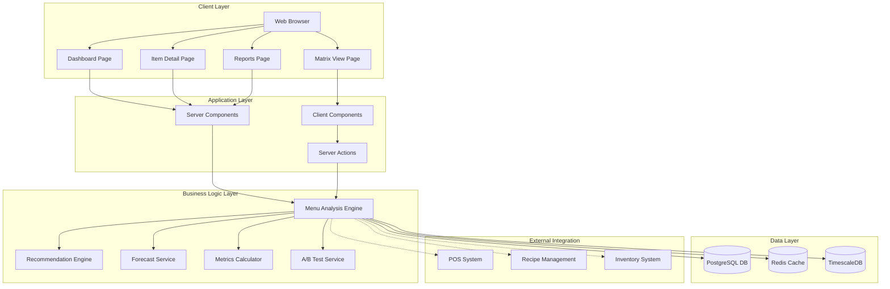
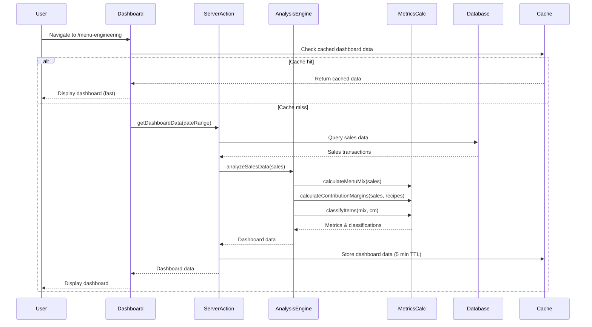
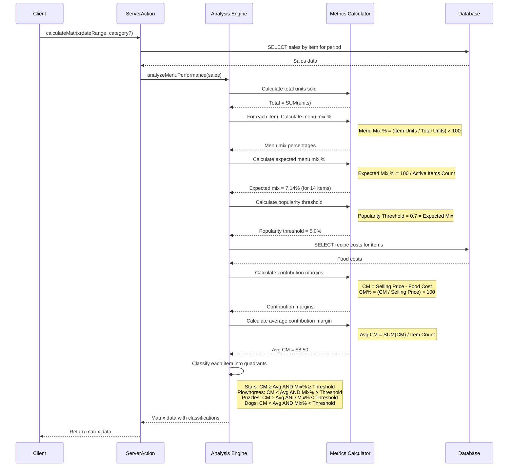
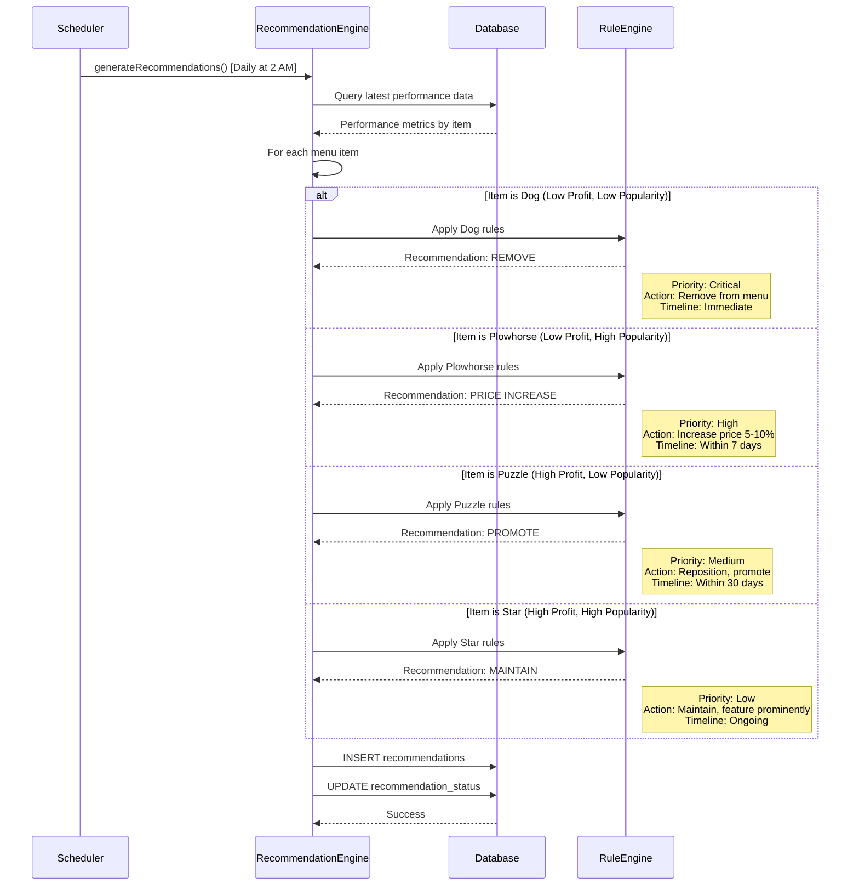
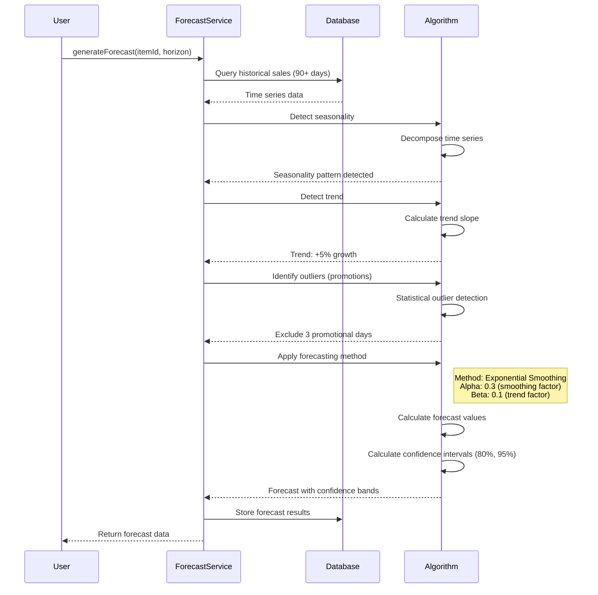
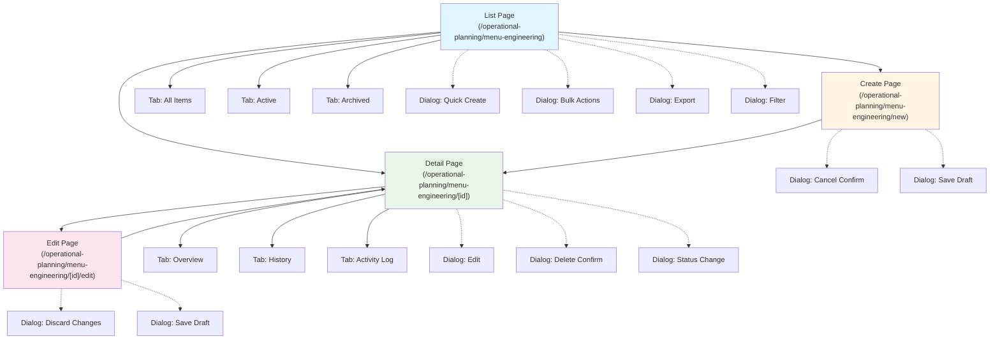

# Menu Engineering - Technical Specification (TS)

## Document Information
- **Document Type**: Technical Specification Document
- **Module**: Operational Planning > Menu Engineering
- **Version**: 1.1.0
- **Last Updated**: 2025-01-05

## Document History

| Version | Date | Author | Changes |
|---------|------|--------|---------|
| 1.1 | 2025-01-05 | System | Added implementation status section |
| 1.0 | 2024-01-15 | System | Initial technical specification document created |

## ⚠️ Implementation Status

**Current State**: SUBSTANTIAL IMPLEMENTATION (~70-80% Complete)

This technical specification describes the Menu Engineering module's architecture and implementation. **See [BR-menu-engineering.md](./BR-menu-engineering.md) Implementation Status section** for detailed breakdown of what EXISTS vs what's PROPOSED.

**Implemented Components**:
- ✅ Frontend: React components with TypeScript (~650 lines)
- ✅ API Layer: 8 secure REST endpoints with Zod validation
- ✅ Services: Menu engineering service, POS integration service
- ✅ Types: Comprehensive TypeScript interfaces (`lib/types/menu-engineering.ts`)
- ✅ Security: JWT auth, RBAC, rate limiting, audit logging
- ✅ Real-time: Cost calculations with inventory integration

**NOTE**: All technical specifications in this document are actively implemented with comprehensive security and performance optimizations. Database schema persistence and advanced ML features are in design phase.

---

## 1. System Architecture

### 1.1 Architecture Overview



### 1.2 Technology Stack

**Frontend**:
- Next.js 14.2+ (App Router with RSC)
- React 18+ (Server Components + Client Components)
- TypeScript 5.8+ (Strict mode)
- Tailwind CSS 3.4+
- Shadcn/ui Components (Radix UI primitives)
- Recharts / Chart.js (Data visualization)
- React Hook Form 7.48+ + Zod 3.22+ (Forms & validation)
- Lucide React (Icons)

**Backend**:
- Next.js Server Actions
- Prisma ORM 5.8+
- PostgreSQL 14+ (Primary database)
- TimescaleDB (Time-series sales data)
- Redis 7+ (Caching + real-time updates)

**Analytics & ML**:
- Simple Moving Average (Forecasting)
- Exponential Smoothing (Trend analysis)
- Statistical Analysis (A/B testing)

**Development Tools**:
- ESLint + Prettier
- Vitest (Testing)
- TypeScript strict mode

---

## 2. Component Hierarchy

### 2.1 Page Structure

```
app/(main)/operational-planning/menu-engineering/
├── page.tsx                          # Dashboard (Server Component)
├── matrix/
│   └── page.tsx                      # Menu Engineering Matrix (Server wrapper)
├── items/
│   ├── [id]/
│   │   └── page.tsx                  # Item Detail (Server Component)
│   └── components/
│       ├── item-performance.tsx      # Performance Display (Client)
│       └── item-metrics.tsx          # Metrics Charts (Client)
├── recommendations/
│   └── page.tsx                      # Recommendations List (Server Component)
├── reports/
│   └── page.tsx                      # Reports Generation (Server Component)
├── settings/
│   └── page.tsx                      # Configuration (Server wrapper)
├── experiments/
│   ├── page.tsx                      # Experiments List (Server Component)
│   ├── [id]/
│   │   └── page.tsx                  # Experiment Detail (Server Component)
│   └── new/
│       └── page.tsx                  # Create Experiment (Server wrapper)
├── components/
│   ├── menu-engineering-dashboard.tsx    # Main Dashboard (Client)
│   ├── menu-engineering-matrix.tsx       # Matrix Visualization (Client)
│   ├── contribution-margin-chart.tsx     # CM Chart (Client)
│   ├── menu-mix-chart.tsx                # Menu Mix Chart (Client)
│   ├── recommendation-card.tsx           # Recommendation Display
│   ├── experiment-form.tsx               # Experiment Setup (Client)
│   ├── forecast-chart.tsx                # Forecast Visualization (Client)
│   ├── competitor-form.tsx               # Competitor Entry (Client)
│   └── settings-form.tsx                 # Settings Configuration (Client)
├── data/
│   └── mock-performance.ts               # Mock Data (Development)
└── actions.ts                            # Server Actions
```

### 2.2 Component Responsibility Matrix

| Component | Type | Responsibility | Data Source |
|-----------|------|----------------|-------------|
| `page.tsx` (Dashboard) | Server | Page wrapper, data fetching | Database query |
| `menu-engineering-dashboard.tsx` | Client | Dashboard UI, chart rendering | Props from server |
| `menu-engineering-matrix.tsx` | Client | Matrix plot, interaction, tooltips | Props from server |
| `items/[id]/page.tsx` | Server | Item detail wrapper, data fetching | Database query |
| `item-performance.tsx` | Client | Performance display, trend charts | Props from server |
| `recommendation-card.tsx` | Client | Recommendation display, actions | Props from server |
| `experiment-form.tsx` | Client | Experiment setup, variant config | Server Actions |
| `reports/page.tsx` | Server | Report configuration, generation | Database aggregation |
| `settings/page.tsx` | Server | Settings wrapper, load current | Database query |
| `settings-form.tsx` | Client | Settings form, validation | Server Actions |

---

## 3. Data Flow Patterns

### 3.1 Dashboard Data Flow



### 3.2 Menu Engineering Matrix Calculation Flow



### 3.3 Recommendation Generation Flow



### 3.4 Sales Forecast Generation Flow



---

## 4. State Management

### 4.1 Dashboard State (Client Component)

```typescript
// menu-engineering-dashboard.tsx
'use client'

import { useState, useMemo } from 'react'
import type { DashboardData, DateRange } from '@/lib/types'

export function MenuEngineeringDashboard({ initialData }: { initialData: DashboardData }) {
  // Date range state
  const [dateRange, setDateRange] = useState<DateRange>({
    from: initialData.periodStart,
    to: initialData.periodEnd,
  })

  // Location filter state
  const [selectedLocation, setSelectedLocation] = useState<string | 'all'>('all')

  // Classification filter state (for matrix view)
  const [classificationFilter, setClassificationFilter] = useState<string[]>([])

  // Derived state: Filtered items
  const filteredItems = useMemo(() => {
    return initialData.items.filter(item => {
      if (selectedLocation !== 'all' && item.locationId !== selectedLocation) {
        return false
      }
      if (classificationFilter.length > 0 && !classificationFilter.includes(item.classification)) {
        return false
      }
      return true
    })
  }, [initialData.items, selectedLocation, classificationFilter])

  // Derived state: Summary metrics
  const summaryMetrics = useMemo(() => {
    const stars = filteredItems.filter(i => i.classification === 'Star').length
    const plowhorses = filteredItems.filter(i => i.classification === 'Plowhorse').length
    const puzzles = filteredItems.filter(i => i.classification === 'Puzzle').length
    const dogs = filteredItems.filter(i => i.classification === 'Dog').length

    const avgCM = filteredItems.reduce((sum, item) => sum + item.contributionMarginPercent, 0) / filteredItems.length

    return {
      totalItems: filteredItems.length,
      stars,
      plowhorses,
      puzzles,
      dogs,
      avgContributionMargin: avgCM,
    }
  }, [filteredItems])

  // Handle date range change (triggers re-fetch)
  const handleDateRangeChange = async (newRange: DateRange) => {
    setDateRange(newRange)
    // Trigger server action to re-fetch data
    // const newData = await getDashboardData(newRange)
    // Update state with new data
  }

  return (
    <div>
      {/* Dashboard UI */}
    </div>
  )
}
```

### 4.2 Matrix Interaction State

```typescript
// menu-engineering-matrix.tsx
'use client'

import { useState } from 'react'
import type { MenuItem } from '@/lib/types'

export function MenuEngineeringMatrix({ items }: { items: MenuItem[] }) {
  // Hover state for tooltip
  const [hoveredItem, setHoveredItem] = useState<MenuItem | null>(null)
  const [tooltipPosition, setTooltipPosition] = useState({ x: 0, y: 0 })

  // Selected item for detail view
  const [selectedItem, setSelectedItem] = useState<MenuItem | null>(null)

  // Threshold adjustment state
  const [popularityThreshold, setPopularityThreshold] = useState(0.7)
  const [showThresholdConfig, setShowThresholdConfig] = useState(false)

  // Calculate thresholds
  const avgContributionMargin = items.reduce((sum, item) => sum + item.contributionMargin, 0) / items.length
  const expectedMenuMix = 100 / items.length
  const popThreshold = popularityThreshold * expectedMenuMix

  // Handle item hover
  const handleItemHover = (item: MenuItem, event: React.MouseEvent) => {
    setHoveredItem(item)
    setTooltipPosition({ x: event.clientX, y: event.clientY })
  }

  // Handle item click
  const handleItemClick = (item: MenuItem) => {
    setSelectedItem(item)
    // Could navigate to item detail page or show modal
  }

  return (
    <div>
      {/* Matrix SVG or Canvas rendering */}
      {/* Tooltip overlay */}
      {/* Detail panel */}
    </div>
  )
}
```

### 4.3 Form State (Recommendation Approval)

```typescript
// recommendation-approval-form.tsx
'use client'

import { useForm } from 'react-hook-form'
import { zodResolver } from '@hookform/resolvers/zod'
import { z } from 'zod'

const approvalSchema = z.object({
  recommendationId: z.string(),
  action: z.enum(['approve', 'reject', 'defer']),
  notes: z.string().optional(),
  implementationDate: z.date().optional(),
  assignedTo: z.string().optional(),
})

type ApprovalFormValues = z.infer<typeof approvalSchema>

export function RecommendationApprovalForm({ recommendation }: { recommendation: Recommendation }) {
  const form = useForm<ApprovalFormValues>({
    resolver: zodResolver(approvalSchema),
    defaultValues: {
      recommendationId: recommendation.id,
      action: 'approve',
    },
  })

  const handleSubmit = form.handleSubmit(async (data) => {
    try {
      const result = await approveRecommendation(data)
      if (result.success) {
        toast.success('Recommendation updated successfully')
        router.refresh()
      } else {
        toast.error(result.error)
      }
    } catch (error) {
      toast.error('An unexpected error occurred')
    }
  })

  return (
    <form onSubmit={handleSubmit}>
      {/* Form fields */}
    </form>
  )
}
```

---

## 5. Server Actions

### 5.1 Dashboard Data Action

```typescript
// actions.ts
'use server'

import { prisma } from '@/lib/prisma'
import { cache } from 'react'
import { calculateMenuEngineering } from '@/lib/services/menu-engineering-service'

export const getDashboardData = cache(async (dateRange: DateRange, locationId?: string) => {
  try {
    // Query sales data from POS integration or sales table
    const sales = await prisma.salesTransaction.findMany({
      where: {
        date: {
          gte: dateRange.from,
          lte: dateRange.to,
        },
        locationId: locationId ? locationId : undefined,
      },
      include: {
        lineItems: {
          include: {
            menuItem: {
              include: {
                recipe: true,
              },
            },
          },
        },
      },
    })

    // Calculate menu engineering metrics
    const analysis = await calculateMenuEngineering(sales, dateRange)

    // Cache results in Redis (5 minute TTL)
    await redis.setex(
      `dashboard:${dateRange.from}:${dateRange.to}:${locationId || 'all'}`,
      300, // 5 minutes
      JSON.stringify(analysis)
    )

    return {
      success: true,
      data: analysis,
    }
  } catch (error) {
    console.error('Error fetching dashboard data:', error)
    return {
      success: false,
      error: 'Failed to load dashboard data',
    }
  }
})
```

### 5.2 Generate Recommendations Action

```typescript
// actions.ts
'use server'

import { prisma } from '@/lib/prisma'
import { generateRecommendations as generateRecs } from '@/lib/services/recommendation-service'
import { revalidatePath } from 'next/cache'

export async function generateRecommendations(force = false) {
  try {
    // Check if recommendations already generated today
    if (!force) {
      const today = new Date().toISOString().split('T')[0]
      const existing = await prisma.recommendation.findFirst({
        where: {
          createdAt: {
            gte: new Date(today),
          },
        },
      })

      if (existing) {
        return {
          success: true,
          message: 'Recommendations already generated today',
        }
      }
    }

    // Get latest performance data
    const performanceData = await prisma.menuItemPerformance.findMany({
      where: {
        periodEnd: {
          gte: new Date(Date.now() - 30 * 24 * 60 * 60 * 1000), // Last 30 days
        },
      },
      orderBy: {
        periodEnd: 'desc',
      },
      take: 1000, // Limit to latest records
    })

    // Generate recommendations using business rules
    const recommendations = await generateRecs(performanceData)

    // Save recommendations to database
    await prisma.recommendation.createMany({
      data: recommendations,
    })

    // Revalidate recommendations page
    revalidatePath('/operational-planning/menu-engineering/recommendations')

    return {
      success: true,
      data: {
        count: recommendations.length,
        critical: recommendations.filter(r => r.priority === 'critical').length,
        high: recommendations.filter(r => r.priority === 'high').length,
      },
    }
  } catch (error) {
    console.error('Error generating recommendations:', error)
    return {
      success: false,
      error: 'Failed to generate recommendations',
    }
  }
}
```

### 5.3 Approve Recommendation Action

```typescript
// actions.ts
'use server'

import { prisma } from '@/lib/prisma'
import { revalidatePath } from 'next/cache'
import { getCurrentUser } from '@/lib/auth'

export async function approveRecommendation(data: ApprovalFormValues) {
  try {
    const user = await getCurrentUser()

    if (!user) {
      return { success: false, error: 'Unauthorized' }
    }

    // Check user has approval permission
    const hasPermission = await checkPermission(user.id, 'menu_engineering.approve')
    if (!hasPermission) {
      return { success: false, error: 'Insufficient permissions' }
    }

    // Update recommendation
    await prisma.recommendation.update({
      where: { id: data.recommendationId },
      data: {
        status: data.action === 'approve' ? 'approved' : data.action === 'reject' ? 'rejected' : 'deferred',
        approvedBy: user.id,
        approvedAt: new Date(),
        notes: data.notes,
        implementationDate: data.implementationDate,
        assignedTo: data.assignedTo,
      },
    })

    // If approved, create task/reminder
    if (data.action === 'approve') {
      await prisma.task.create({
        data: {
          title: `Implement recommendation: ${recommendation.title}`,
          dueDate: data.implementationDate,
          assignedTo: data.assignedTo,
          type: 'menu_optimization',
          relatedId: data.recommendationId,
        },
      })
    }

    // Revalidate pages
    revalidatePath('/operational-planning/menu-engineering/recommendations')
    revalidatePath('/operational-planning/menu-engineering')

    return { success: true }
  } catch (error) {
    console.error('Error approving recommendation:', error)
    return {
      success: false,
      error: 'Failed to update recommendation',
    }
  }
}
```

### 5.4 Apply Price Change Action

```typescript
// actions.ts
'use server'

import { prisma } from '@/lib/prisma'
import { revalidatePath } from 'next/cache'
import { syncPriceWithPOS } from '@/lib/integrations/pos'

export async function applyPriceChange(data: PriceChangeRequest) {
  try {
    const user = await getCurrentUser()

    // Validate price change
    const validation = await validatePriceChange(data)
    if (!validation.success) {
      return { success: false, error: validation.error }
    }

    // Check approval requirements
    const percentChange = ((data.newPrice - data.currentPrice) / data.currentPrice) * 100

    if (Math.abs(percentChange) > 10) {
      // Requires director approval
      if (!await checkPermission(user.id, 'menu_engineering.approve_major_price_change')) {
        // Send approval request
        await createApprovalRequest({
          type: 'price_change',
          requestedBy: user.id,
          data: data,
          reason: data.justification,
        })

        return {
          success: true,
          requiresApproval: true,
          message: 'Price change requires director approval. Request sent.',
        }
      }
    }

    // Apply price change
    await prisma.$transaction(async (tx) => {
      // Update menu item price
      await tx.menuItem.update({
        where: { id: data.menuItemId },
        data: {
          sellingPrice: data.newPrice,
          updatedAt: new Date(),
          updatedBy: user.id,
        },
      })

      // Log price change
      await tx.priceChangeHistory.create({
        data: {
          menuItemId: data.menuItemId,
          oldPrice: data.currentPrice,
          newPrice: data.newPrice,
          percentChange,
          justification: data.justification,
          changedBy: user.id,
          changedAt: new Date(),
        },
      })
    })

    // Sync with POS system
    await syncPriceWithPOS(data.menuItemId, data.newPrice)

    // Recalculate contribution margins
    await recalculateContributionMargins(data.menuItemId)

    // Revalidate pages
    revalidatePath('/operational-planning/menu-engineering')
    revalidatePath(`/operational-planning/menu-engineering/items/${data.menuItemId}`)

    return {
      success: true,
      message: 'Price updated successfully',
    }
  } catch (error) {
    console.error('Error applying price change:', error)
    return {
      success: false,
      error: 'Failed to update price',
    }
  }
}
```

---

## 6. Real-time Features

### 6.1 Sales Data Synchronization

```typescript
// lib/services/sales-sync-service.ts

import { redis } from '@/lib/redis'
import { prisma } from '@/lib/prisma'

/**
 * Sync sales data from POS system
 * Runs every 5 minutes via cron job
 */
export async function syncSalesData() {
  try {
    const lastSyncTime = await redis.get('sales:last_sync_time')
    const fromDate = lastSyncTime ? new Date(lastSyncTime) : new Date(Date.now() - 24 * 60 * 60 * 1000)

    // Fetch new transactions from POS
    const newTransactions = await fetchPOSTransactions(fromDate)

    if (newTransactions.length === 0) {
      console.log('No new transactions to sync')
      return
    }

    // Insert into database
    await prisma.salesTransaction.createMany({
      data: newTransactions,
      skipDuplicates: true, // Skip if already exists
    })

    // Update last sync time
    await redis.set('sales:last_sync_time', new Date().toISOString())

    // Invalidate cached dashboard data
    await redis.del('dashboard:*')

    console.log(`Synced ${newTransactions.length} transactions`)
  } catch (error) {
    console.error('Error syncing sales data:', error)
    throw error
  }
}

/**
 * Calculate performance metrics incrementally
 * Triggered after sales sync
 */
export async function updatePerformanceMetrics() {
  try {
    // Get date range for calculation (last 30 days)
    const endDate = new Date()
    const startDate = new Date(Date.now() - 30 * 24 * 60 * 60 * 1000)

    // Aggregate sales by menu item
    const salesByItem = await prisma.salesTransaction.groupBy({
      by: ['menuItemId'],
      where: {
        date: { gte: startDate, lte: endDate },
      },
      _sum: {
        quantity: true,
        revenue: true,
        cost: true,
      },
    })

    // Calculate metrics for each item
    for (const itemSales of salesByItem) {
      const metrics = calculateItemMetrics(itemSales, startDate, endDate)

      // Upsert performance record
      await prisma.menuItemPerformance.upsert({
        where: {
          menuItemId_periodStart_periodEnd: {
            menuItemId: itemSales.menuItemId,
            periodStart: startDate,
            periodEnd: endDate,
          },
        },
        update: metrics,
        create: {
          menuItemId: itemSales.menuItemId,
          periodStart: startDate,
          periodEnd: endDate,
          ...metrics,
        },
      })
    }

    console.log('Updated performance metrics for all items')
  } catch (error) {
    console.error('Error updating performance metrics:', error)
    throw error
  }
}
```

### 6.2 Real-time Dashboard Updates (WebSocket)

```typescript
// lib/websocket/dashboard-updates.ts

import { Server } from 'socket.io'
import { redis } from '@/lib/redis'

let io: Server

export function initializeWebSocket(server: any) {
  io = new Server(server, {
    cors: {
      origin: process.env.NEXT_PUBLIC_APP_URL,
      methods: ['GET', 'POST'],
    },
  })

  io.on('connection', (socket) => {
    console.log('Client connected:', socket.id)

    // Subscribe to dashboard updates
    socket.on('subscribe:dashboard', async (locationId: string) => {
      socket.join(`dashboard:${locationId}`)

      // Send initial data
      const cachedData = await redis.get(`dashboard:latest:${locationId}`)
      if (cachedData) {
        socket.emit('dashboard:update', JSON.parse(cachedData))
      }
    })

    // Unsubscribe
    socket.on('unsubscribe:dashboard', (locationId: string) => {
      socket.leave(`dashboard:${locationId}`)
    })

    socket.on('disconnect', () => {
      console.log('Client disconnected:', socket.id)
    })
  })
}

/**
 * Broadcast dashboard update to connected clients
 * Called after metrics recalculation
 */
export function broadcastDashboardUpdate(locationId: string, data: DashboardData) {
  if (io) {
    io.to(`dashboard:${locationId}`).emit('dashboard:update', data)
  }
}
```

---

## 7. Caching Strategy

### 7.1 Redis Cache Layers

```typescript
// lib/cache/menu-engineering-cache.ts

import { redis } from '@/lib/redis'

const CACHE_TTL = {
  DASHBOARD: 300, // 5 minutes
  MATRIX: 600, // 10 minutes
  ITEM_PERFORMANCE: 3600, // 1 hour
  RECOMMENDATIONS: 86400, // 24 hours
  FORECAST: 86400, // 24 hours
  SETTINGS: 3600, // 1 hour
}

/**
 * Cache key generation
 */
export function getCacheKey(type: string, ...params: string[]): string {
  return `menueng:${type}:${params.join(':')}`
}

/**
 * Get cached dashboard data
 */
export async function getCachedDashboard(dateRange: DateRange, locationId: string): Promise<DashboardData | null> {
  const key = getCacheKey('dashboard', dateRange.from.toISOString(), dateRange.to.toISOString(), locationId)
  const cached = await redis.get(key)

  if (cached) {
    return JSON.parse(cached)
  }

  return null
}

/**
 * Set cached dashboard data
 */
export async function setCachedDashboard(dateRange: DateRange, locationId: string, data: DashboardData): Promise<void> {
  const key = getCacheKey('dashboard', dateRange.from.toISOString(), dateRange.to.toISOString(), locationId)
  await redis.setex(key, CACHE_TTL.DASHBOARD, JSON.stringify(data))
}

/**
 * Invalidate dashboard cache
 */
export async function invalidateDashboardCache(locationId?: string): Promise<void> {
  const pattern = locationId
    ? getCacheKey('dashboard', '*', locationId)
    : getCacheKey('dashboard', '*')

  const keys = await redis.keys(pattern)

  if (keys.length > 0) {
    await redis.del(...keys)
  }
}

/**
 * Cache menu engineering matrix
 */
export async function cacheMatrix(category: string | null, data: MatrixData): Promise<void> {
  const key = getCacheKey('matrix', category || 'all')
  await redis.setex(key, CACHE_TTL.MATRIX, JSON.stringify(data))
}

/**
 * Cache item performance
 */
export async function cacheItemPerformance(itemId: string, period: string, data: ItemPerformance): Promise<void> {
  const key = getCacheKey('item_performance', itemId, period)
  await redis.setex(key, CACHE_TTL.ITEM_PERFORMANCE, JSON.stringify(data))
}
```

### 7.2 React Cache (Next.js)

```typescript
// Use Next.js cache() function for data fetching
import { cache } from 'react'

export const getMenuEngineeringData = cache(async (dateRange: DateRange) => {
  // This function result is cached for the request lifecycle
  // Automatic deduplication across components
  const data = await fetchMenuEngineeringData(dateRange)
  return data
})

// In Server Components:
export default async function DashboardPage() {
  const data = await getMenuEngineeringData(dateRange)
  // Subsequent calls with same params will use cached result
}
```

---

## 8. Performance Optimization

### 8.1 Database Query Optimization

```typescript
// Optimized query with aggregation at database level
export async function calculateMenuMixEfficient(dateRange: DateRange) {
  const result = await prisma.$queryRaw<MenuMixResult[]>`
    WITH sales_summary AS (
      SELECT
        menu_item_id,
        SUM(quantity) as total_units,
        SUM(revenue) as total_revenue,
        SUM(cost) as total_cost
      FROM sales_transactions
      WHERE date >= ${dateRange.from} AND date <= ${dateRange.to}
      GROUP BY menu_item_id
    ),
    total_sales AS (
      SELECT SUM(total_units) as grand_total
      FROM sales_summary
    )
    SELECT
      ss.menu_item_id,
      mi.name as item_name,
      ss.total_units,
      ss.total_revenue,
      ss.total_cost,
      (ss.total_units::decimal / ts.grand_total * 100) as menu_mix_percent,
      ((ss.total_revenue - ss.total_cost) / ss.total_revenue * 100) as contribution_margin_percent
    FROM sales_summary ss
    CROSS JOIN total_sales ts
    JOIN menu_items mi ON ss.menu_item_id = mi.id
    ORDER BY menu_mix_percent DESC
  `

  return result
}
```

### 8.2 Parallel Data Fetching

```typescript
// Fetch multiple data sources in parallel
export async function getDashboardDataOptimized(dateRange: DateRange) {
  const [
    salesData,
    recipeCosts,
    recommendations,
    performanceMetrics,
  ] = await Promise.all([
    getSalesData(dateRange),
    getRecipeCosts(),
    getActiveRecommendations(),
    getPerformanceMetrics(dateRange),
  ])

  return {
    salesData,
    recipeCosts,
    recommendations,
    performanceMetrics,
  }
}
```

### 8.3 Component Code Splitting

```typescript
// Lazy load heavy chart components
import dynamic from 'next/dynamic'

const MenuEngineeringMatrix = dynamic(
  () => import('@/components/menu-engineering-matrix'),
  {
    loading: () => <MatrixSkeleton />,
    ssr: false, // Disable SSR for client-side only component
  }
)

const ForecastChart = dynamic(
  () => import('@/components/forecast-chart'),
  {
    loading: () => <ChartSkeleton />,
  }
)
```

### 8.4 Image Optimization

```typescript
// Use Next.js Image component for menu item images
import Image from 'next/image'

export function ItemCard({ item }: { item: MenuItem }) {
  return (
    <div>
      <Image
        src={item.imageUrl}
        alt={item.name}
        width={300}
        height={200}
        placeholder="blur"
        blurDataURL={item.blurHash}
        loading="lazy"
      />
    </div>
  )
}
```

---

## 9. Error Handling

### 9.1 Server Action Error Handling

```typescript
// Consistent error handling pattern for server actions
export async function serverActionTemplate(input: any) {
  try {
    // Input validation
    const validated = schema.safeParse(input)
    if (!validated.success) {
      return {
        success: false,
        error: 'Invalid input',
        details: validated.error.errors,
      }
    }

    // Business logic
    const result = await performOperation(validated.data)

    // Success response
    return {
      success: true,
      data: result,
    }
  } catch (error) {
    // Log error for monitoring
    console.error('Server action error:', error)

    // Return user-friendly error
    if (error instanceof PrismaClientKnownRequestError) {
      return {
        success: false,
        error: 'Database error occurred',
        code: error.code,
      }
    }

    return {
      success: false,
      error: 'An unexpected error occurred',
    }
  }
}
```

### 9.2 Error Boundary Component

```typescript
// error.tsx (Next.js Error Boundary)
'use client'

import { useEffect } from 'react'
import { Button } from '@/components/ui/button'

export default function Error({
  error,
  reset,
}: {
  error: Error & { digest?: string }
  reset: () => void
}) {
  useEffect(() => {
    // Log error to monitoring service
    console.error('Menu Engineering error:', error)
  }, [error])

  return (
    <div className="flex flex-col items-center justify-center min-h-[400px] p-8">
      <h2 className="text-2xl font-bold mb-4">Something went wrong!</h2>
      <p className="text-muted-foreground mb-6">
        We encountered an error while loading the menu engineering data.
      </p>
      <div className="flex gap-4">
        <Button onClick={() => reset()}>Try again</Button>
        <Button variant="outline" onClick={() => window.location.href = '/operational-planning/menu-engineering'}>
          Return to Dashboard
        </Button>
      </div>
    </div>
  )
}
```

---

## Sitemap

### Overview
This section provides a complete navigation structure of all pages, tabs, and dialogues in the Menu Engineering sub-module.

### Page Hierarchy



### Pages

#### 1. List Page
**Route**: `/operational-planning/menu-engineering`
**File**: `page.tsx`
**Purpose**: Display paginated list of all menu items

**Sections**:
- Header: Title, breadcrumbs, primary actions
- Filters: Quick filters, advanced filter panel
- Search: Global search with autocomplete
- Data Table: Sortable columns, row actions, bulk selection
- Pagination: Page size selector, page navigation

**Tabs**:
- **All Items**: Complete list of all menu items
- **Active**: Filter active items only
- **Archived**: View archived items

**Dialogues**:
- **Quick Create**: Fast creation form with essential fields only
- **Bulk Actions**: Multi-select actions (delete, export, status change)
- **Export**: Export data in various formats (CSV, Excel, PDF)
- **Filter**: Advanced filtering with multiple criteria

#### 2. Detail Page
**Route**: `/operational-planning/menu-engineering/[id]`
**File**: `[id]/page.tsx`
**Purpose**: Display comprehensive menu item details

**Sections**:
- Header: Breadcrumbs, menu item title, action buttons
- Info Cards: Multiple cards showing different aspects
- Related Data: Associated records and relationships

**Tabs**:
- **Overview**: Key information and summary
- **History**: Change history and audit trail
- **Activity Log**: User actions and system events

**Dialogues**:
- **Edit**: Navigate to edit form
- **Delete Confirm**: Confirmation before deletion
- **Status Change**: Change menu item status with reason

#### 3. Create Page
**Route**: `/operational-planning/menu-engineering/new`
**File**: `new/page.tsx`
**Purpose**: Create new menu item

**Sections**:
- Form Header: Title, Save/Cancel actions
- Form Fields: All required and optional fields
- Validation: Real-time field validation

**Dialogues**:
- **Cancel Confirm**: Confirm discarding unsaved changes
- **Save Draft**: Save incomplete form as draft

#### 4. Edit Page
**Route**: `/operational-planning/menu-engineering/[id]/edit`
**File**: `[id]/edit/page.tsx`
**Purpose**: Modify existing menu item

**Sections**:
- Form Header: Title, Save/Cancel/Delete actions
- Form Fields: Pre-populated with existing data
- Change Tracking: Highlight modified fields

**Dialogues**:
- **Discard Changes**: Confirm discarding modifications
- **Save Draft**: Save changes as draft


## 10. Testing Strategy

### 10.1 Unit Tests (Vitest)

```typescript
// __tests__/menu-engineering-calculator.test.ts

import { describe, it, expect } from 'vitest'
import { calculateMenuMix, classifyItem } from '@/lib/services/menu-engineering-calculator'

describe('Menu Engineering Calculator', () => {
  describe('calculateMenuMix', () => {
    it('should calculate menu mix percentages correctly', () => {
      const sales = [
        { itemId: '1', units: 100 },
        { itemId: '2', units: 50 },
        { itemId: '3', units: 50 },
      ]

      const result = calculateMenuMix(sales)

      expect(result['1'].menuMixPercent).toBe(50) // 100/200 * 100
      expect(result['2'].menuMixPercent).toBe(25) // 50/200 * 100
      expect(result['3'].menuMixPercent).toBe(25)
    })
  })

  describe('classifyItem', () => {
    it('should classify item as Star when high profit and high popularity', () => {
      const item = {
        contributionMargin: 10,
        menuMixPercent: 15,
      }
      const avgCM = 8
      const popThreshold = 10

      const classification = classifyItem(item, avgCM, popThreshold)

      expect(classification).toBe('Star')
    })

    it('should classify item as Dog when low profit and low popularity', () => {
      const item = {
        contributionMargin: 5,
        menuMixPercent: 5,
      }
      const avgCM = 8
      const popThreshold = 10

      const classification = classifyItem(item, avgCM, popThreshold)

      expect(classification).toBe('Dog')
    })
  })
})
```

### 10.2 Integration Tests

```typescript
// __tests__/dashboard-integration.test.ts

import { describe, it, expect, beforeEach } from 'vitest'
import { getDashboardData } from '@/app/actions'
import { prisma } from '@/lib/prisma'

describe('Dashboard Integration', () => {
  beforeEach(async () => {
    // Seed test data
    await prisma.salesTransaction.createMany({
      data: [
        { menuItemId: '1', quantity: 10, revenue: 100, cost: 30, date: new Date() },
        { menuItemId: '2', quantity: 5, revenue: 75, cost: 25, date: new Date() },
      ],
    })
  })

  it('should return dashboard data with correct structure', async () => {
    const dateRange = {
      from: new Date('2024-01-01'),
      to: new Date('2024-01-31'),
    }

    const result = await getDashboardData(dateRange)

    expect(result.success).toBe(true)
    expect(result.data).toHaveProperty('items')
    expect(result.data).toHaveProperty('summaryMetrics')
    expect(result.data.items.length).toBeGreaterThan(0)
  })
})
```

### 10.3 E2E Tests (Playwright)

```typescript
// e2e/menu-engineering-dashboard.spec.ts

import { test, expect } from '@playwright/test'

test.describe('Menu Engineering Dashboard', () => {
  test('should display dashboard with matrix', async ({ page }) => {
    await page.goto('/operational-planning/menu-engineering')

    // Check dashboard loads
    await expect(page.getByRole('heading', { name: 'Menu Engineering' })).toBeVisible()

    // Check matrix is rendered
    await expect(page.locator('[data-testid="menu-engineering-matrix"]')).toBeVisible()

    // Check summary metrics
    await expect(page.getByText(/Total Items:/)).toBeVisible()
    await expect(page.getByText(/Average CM:/)).toBeVisible()
  })

  test('should filter matrix by category', async ({ page }) => {
    await page.goto('/operational-planning/menu-engineering/matrix')

    // Select category filter
    await page.getByLabel('Category').click()
    await page.getByRole('option', { name: 'Appetizers' }).click()

    // Matrix should update
    await expect(page.locator('[data-testid="matrix-item"]')).toHaveCount(5) // Assuming 5 appetizers
  })

  test('should navigate to item detail on click', async ({ page }) => {
    await page.goto('/operational-planning/menu-engineering/matrix')

    // Click on matrix item
    await page.locator('[data-testid="matrix-item"]').first().click()

    // Should navigate to item detail page
    await expect(page).toHaveURL(/\/items\/[^/]+/)
    await expect(page.getByRole('heading', { name: /Performance Details/ })).toBeVisible()
  })
})
```

---
