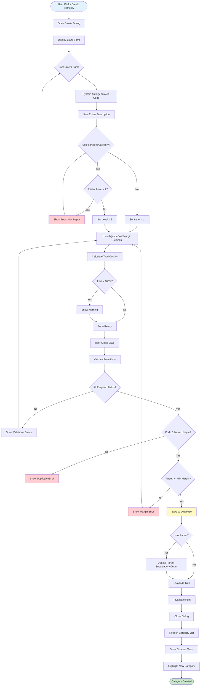
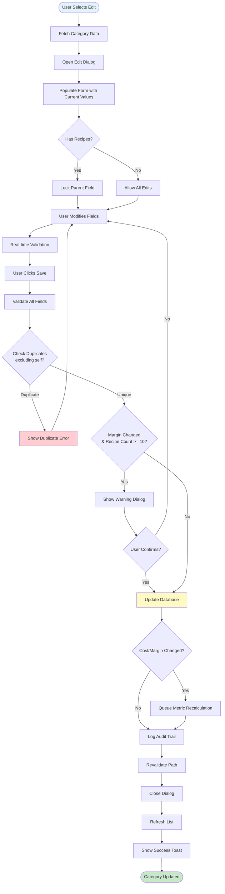
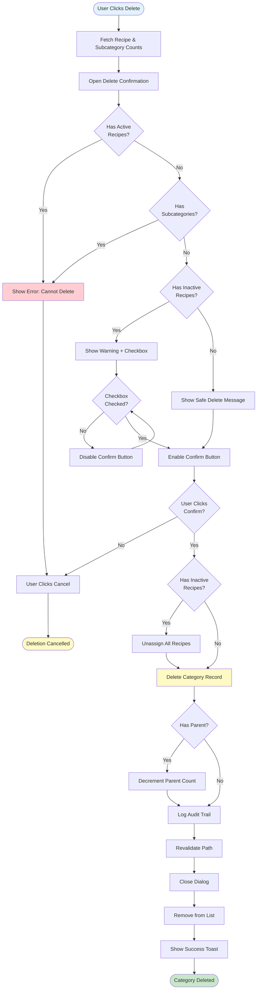
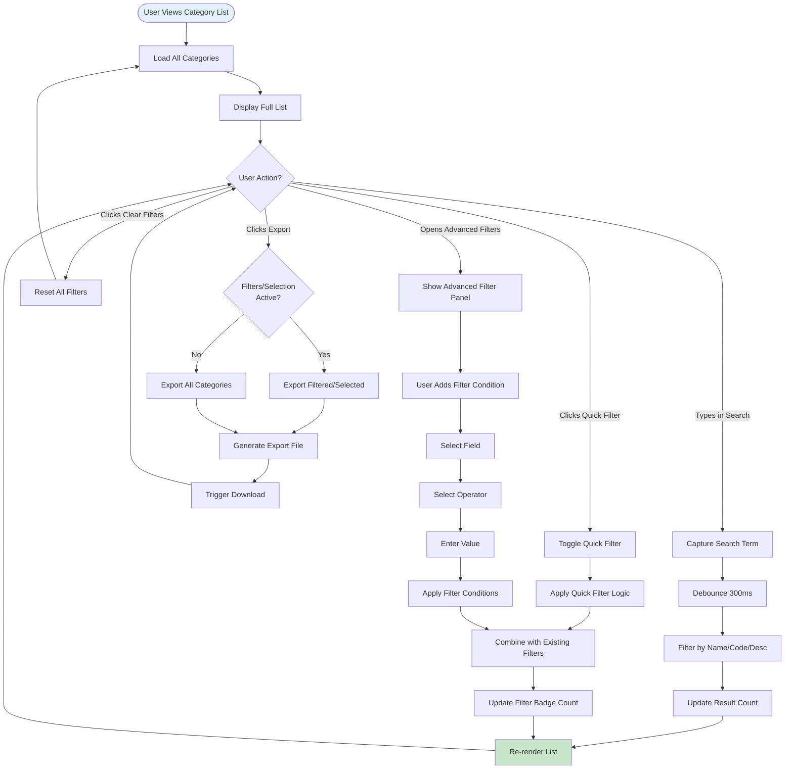
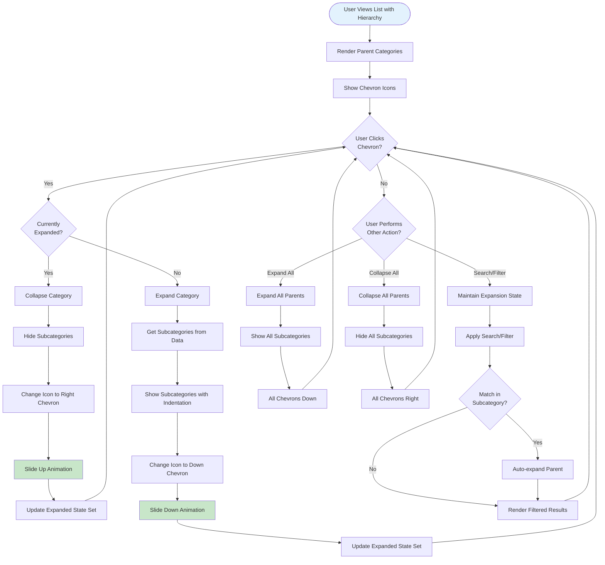
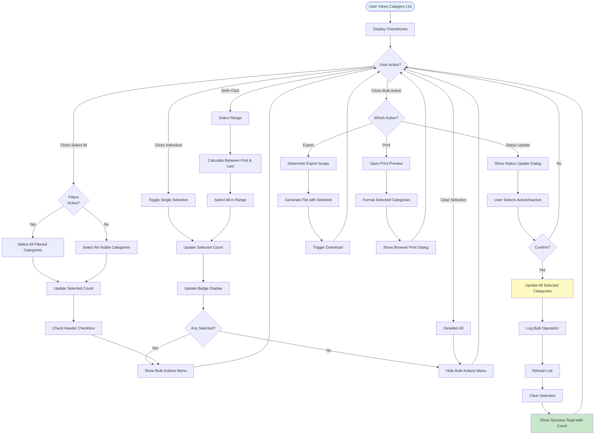
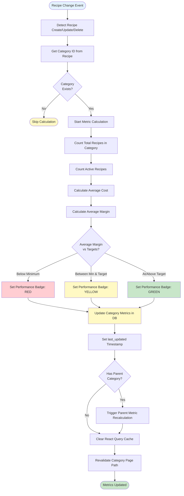
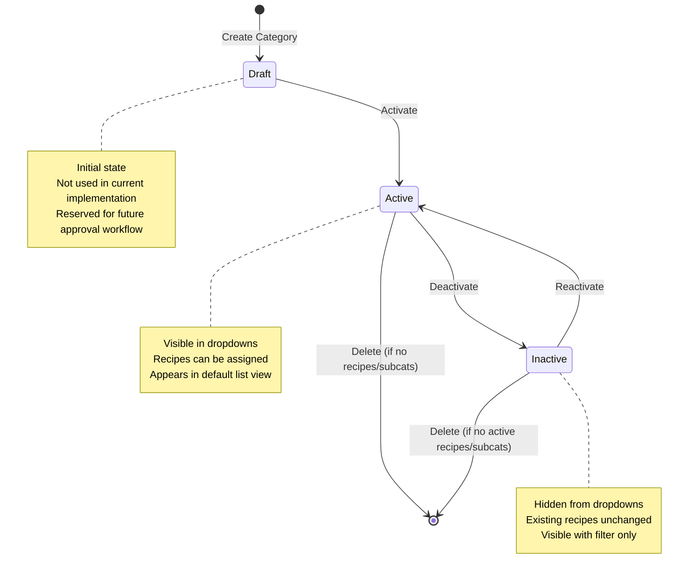
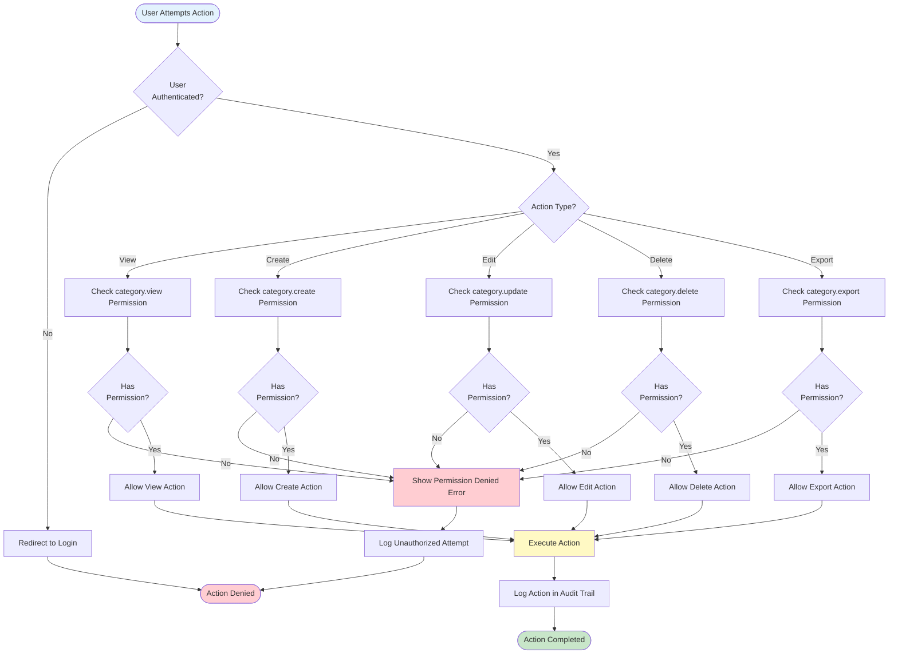
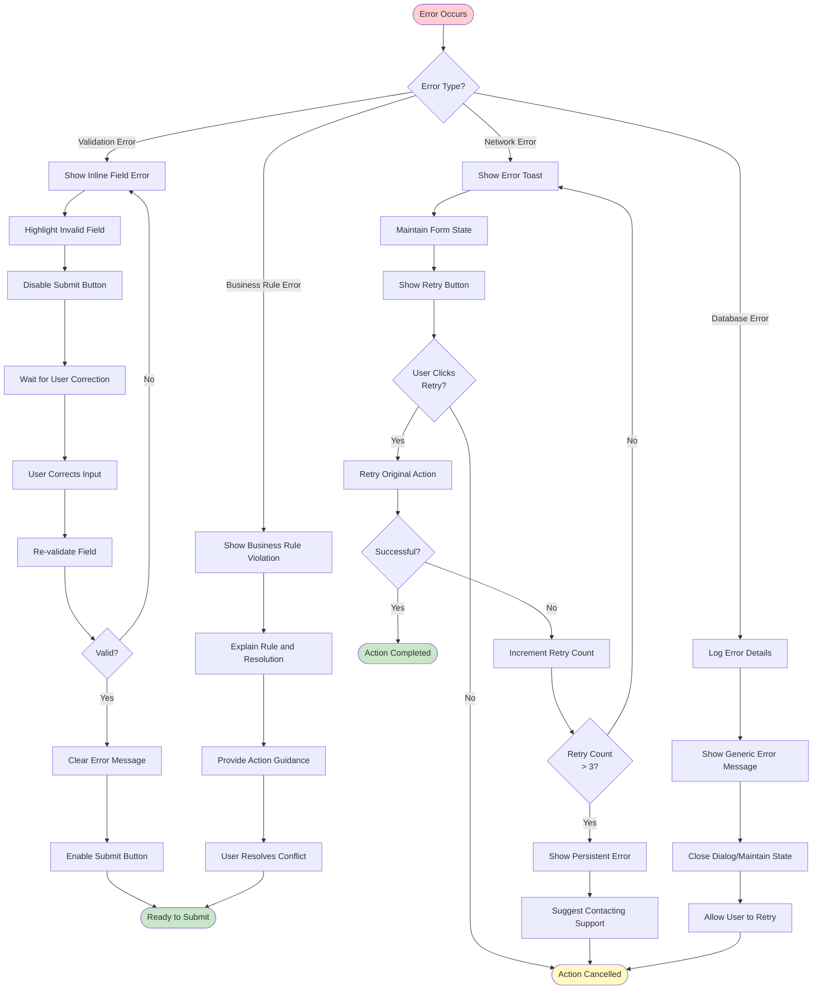

# Flow Diagrams: Recipe Categories

**Module**: Operational Planning > Recipe Management > Categories
**Version**: 1.0
**Last Updated**: 2025-01-11
**Status**: Active

## Document History

| Version | Date | Author | Changes |
|---------|------|--------|---------|
| 1.1.0 | 2025-12-10 | Documentation Team | Standardized reference number format (XXX-YYMM-NNNN) |
| 1.0.0 | 2025-11-19 | Documentation Team | Initial version |
---

## 1. Create Category Workflow

---

## 2. Edit Category Workflow

---

## 3. Delete Category Workflow

---

## 4. Search and Filter Workflow

---

## 5. Hierarchy Expansion Workflow

---

## 6. Bulk Selection and Actions Workflow

---

## 7. Metric Calculation Workflow

---

## 8. Category Status Lifecycle

---

## 9. Permission-Based Action Flow

---

## 10. Error Recovery Flow

---

## Document Control

**Prepared By**: Development Team
**Reviewed By**: UX Designer, Technical Lead
**Approved By**: Product Owner
**Version History**:
- v1.0 (2025-01-11): Initial flow diagrams based on prototype implementation
