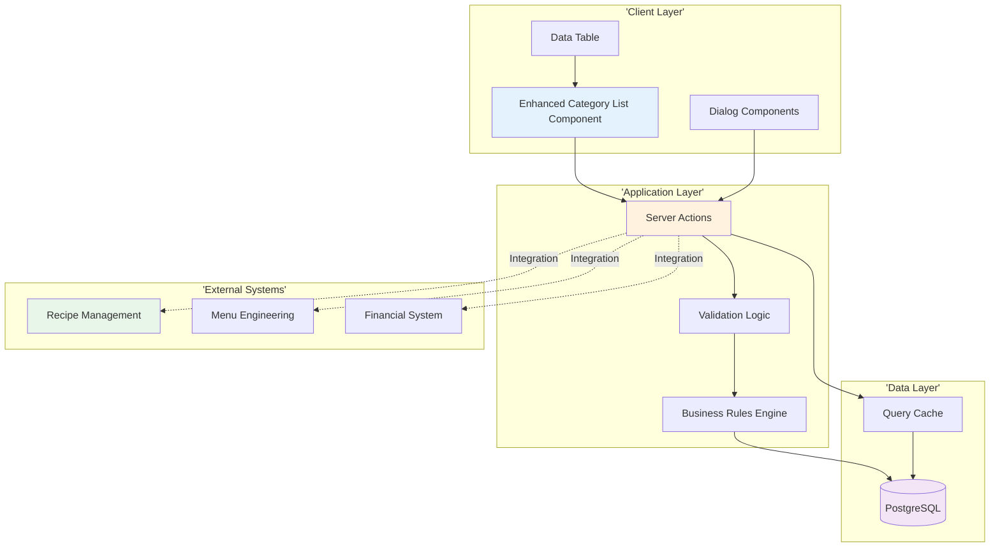
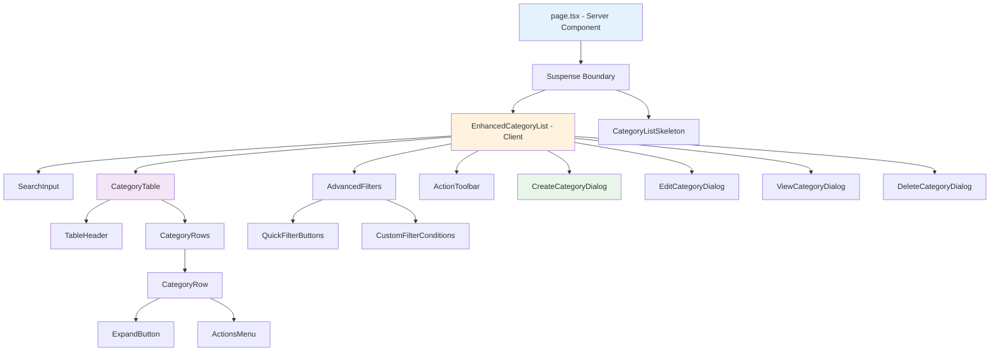
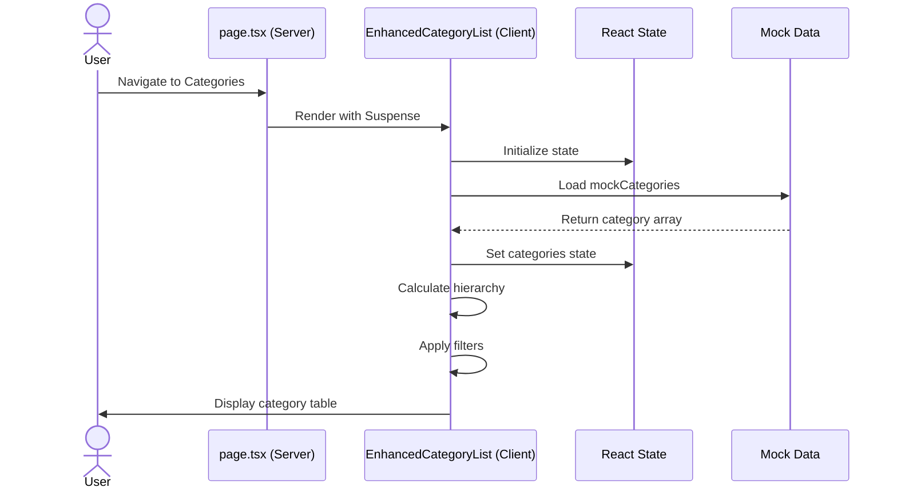
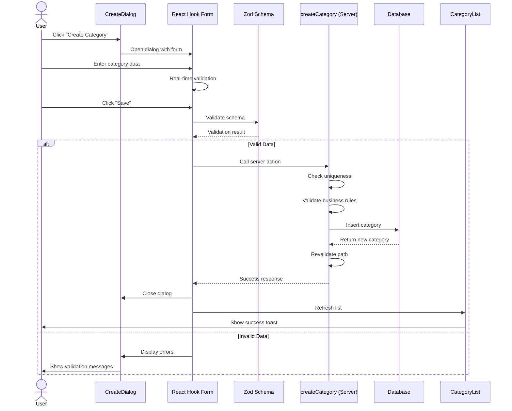
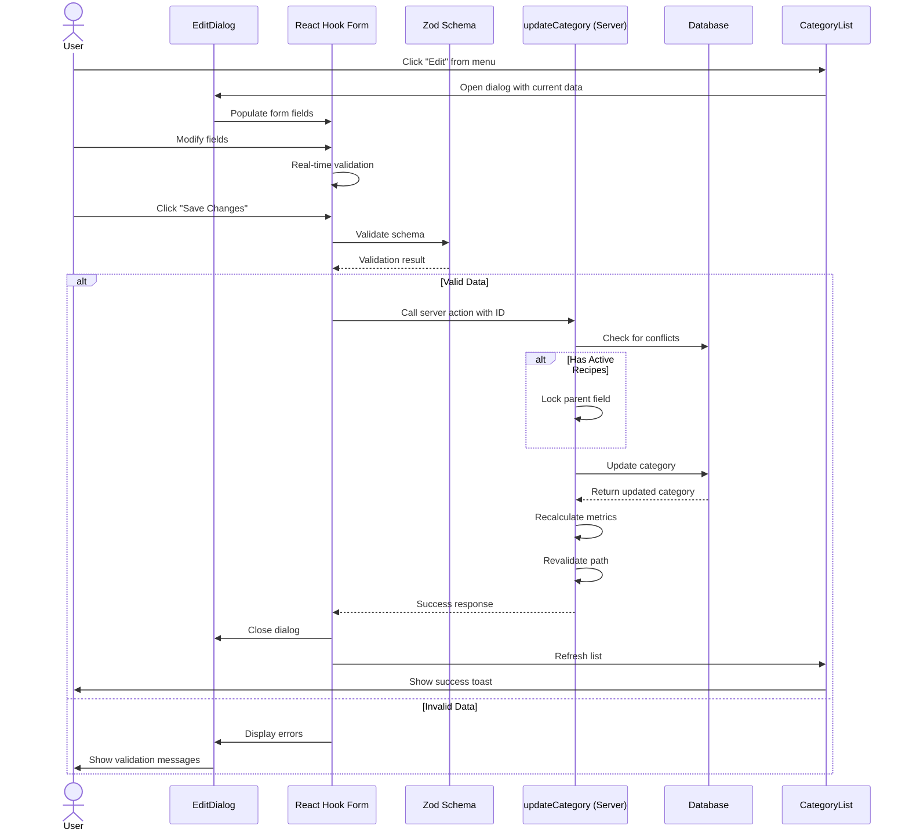
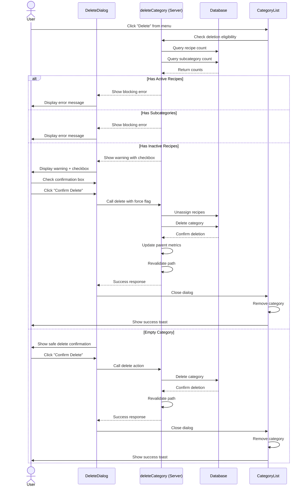
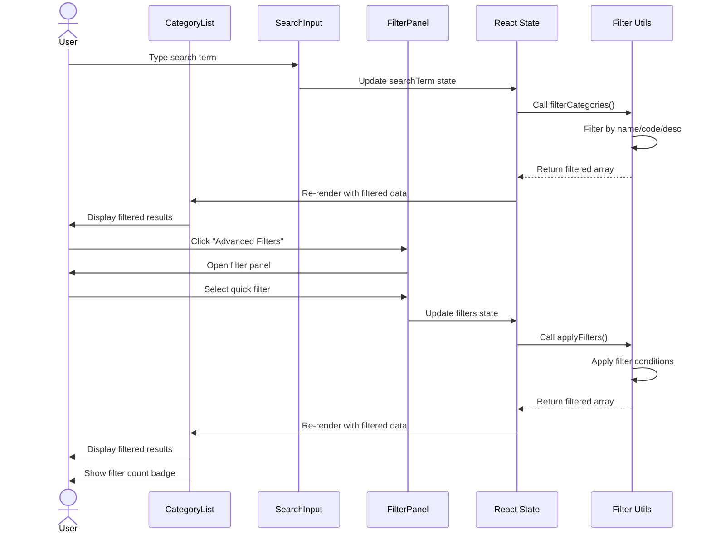

# Technical Specification: Recipe Categories

**Module**: Operational Planning > Recipe Management > Categories
**Version**: 1.0
**Last Updated**: 2025-01-11
**Status**: Active

## Document History

| Version | Date | Author | Changes |
|---------|------|--------|---------|
| 1.1.0 | 2025-12-10 | Documentation Team | Standardized reference number format (XXX-YYMM-NNNN) |
| 1.0.0 | 2025-11-19 | Documentation Team | Initial version |
---

## 1. System Architecture

### 1.1 Architecture Overview



The Recipe Categories module follows Next.js 14 App Router architecture with:
- **Client Components**: React components with "use client" directive for interactive UI
- **Server Actions**: Server-side functions for data mutations and queries
- **Server Components**: Default RSC pattern for initial data loading
- **Database Layer**: Prisma ORM with PostgreSQL for data persistence

### 1.2 Technology Stack

| Layer | Technology | Version | Purpose |
|-------|------------|---------|---------|
| Frontend Framework | Next.js (App Router) | 14.2+ | Full-stack React framework |
| UI Library | React | 18+ | Component-based UI |
| Language | TypeScript | 5.8+ | Type-safe development |
| UI Components | Shadcn/ui | Latest | Accessible component library |
| Styling | Tailwind CSS | 3.4+ | Utility-first CSS |
| Database | PostgreSQL | 14+ | Relational database |
| ORM | Prisma | 5.8+ | Type-safe database client |
| State Management | Zustand | 4.4+ | Lightweight state management |
| Server State | React Query | 5+ | Server state caching |
| Form Handling | React Hook Form | 7.48+ | Form state and validation |
| Schema Validation | Zod | 3.22+ | Runtime type validation |
| Icons | Lucide React | Latest | Icon library |

---

## 2. Component Structure

### 2.1 Directory Organization

```
app/(main)/operational-planning/recipe-management/categories/
├── page.tsx                          # Main page (Server Component)
├── components/
│   ├── enhanced-category-list.tsx    # Main list component (Client)
│   ├── category-list.tsx             # Simple list view
│   ├── create-category-dialog.tsx    # Creation dialog
│   ├── edit-category-dialog.tsx      # Edit dialog
│   ├── view-category-dialog.tsx      # View details dialog
│   ├── delete-category-dialog.tsx    # Deletion confirmation
│   ├── category-filters.tsx          # Advanced filter panel
│   ├── category-metrics.tsx          # Performance metrics display
│   └── category-hierarchy-tree.tsx   # Tree view component
├── actions/
│   ├── create-category.ts            # Create server action
│   ├── update-category.ts            # Update server action
│   ├── delete-category.ts            # Delete server action
│   └── get-categories.ts             # Query server action
├── data/
│   └── mock-categories.ts            # Mock data for development
├── types/
│   └── category.ts                   # TypeScript interfaces
└── lib/
    ├── validations.ts                # Zod schemas
    ├── utils.ts                      # Utility functions
    └── constants.ts                  # Constants and enums
```

### 2.2 Component Hierarchy



---

## 3. Page Structure and Routing

### 3.1 Primary Routes

| Route | Component Type | Purpose | Data Source |
|-------|---------------|---------|-------------|
| `/operational-planning/recipe-management/categories` | Server Component | Category list page | Server-side data fetch |
| N/A (Modal) | Client Component | Create category dialog | Client state |
| N/A (Modal) | Client Component | Edit category dialog | Client state + server action |
| N/A (Modal) | Client Component | View category dialog | Client state |
| N/A (Modal) | Client Component | Delete confirmation dialog | Client state + server action |

### 3.2 Page Structure (page.tsx)

The main categories page is a Server Component that:
1. Wraps content in Suspense boundary for streaming
2. Renders EnhancedCategoryList as Client Component
3. Provides CategoryListSkeleton as fallback during loading
4. Implements responsive layout with proper padding
5. No direct data fetching (delegated to Client Component)

**Rendering Strategy**: Server Component wrapper with Client Component for interactivity

---

## 4. Data Flows

### 4.1 Load Categories Flow



**Current Implementation**: Uses mock data from local file
**Future Implementation**: Replace with server action to fetch from database

### 4.2 Create Category Flow



### 4.3 Edit Category Flow



### 4.4 Delete Category Flow



### 4.5 Filter and Search Flow



---

## 5. State Management

### 5.1 Local Component State (useState)

The EnhancedCategoryList component manages:

| State Variable | Type | Purpose |
|----------------|------|---------|
| `categories` | `RecipeCategory[]` | Complete category dataset |
| `searchTerm` | `string` | Current search query |
| `expandedCategories` | `Set<string>` | IDs of expanded parent categories |
| `selectedCategories` | `string[]` | IDs of selected categories (bulk) |
| `filters` | `FilterState` | Advanced filter configuration |
| `quickFilters` | `string[]` | Active quick filter buttons |
| `filterConditions` | `FilterCondition[]` | Custom filter conditions |
| `viewMode` | `'list' \| 'card'` | Current view mode |
| `isCreateDialogOpen` | `boolean` | Create dialog visibility |
| `isEditDialogOpen` | `boolean` | Edit dialog visibility |
| `isViewDialogOpen` | `boolean` | View dialog visibility |
| `isDeleteDialogOpen` | `boolean` | Delete dialog visibility |
| `selectedCategory` | `RecipeCategory \| null` | Category being viewed/edited/deleted |
| `formData` | `Partial<RecipeCategory>` | Form input values |

### 5.2 Server State Management (React Query)

**Future Implementation** (when migrating from mock data):

```
useQuery:
- key: ['categories']
- fetcher: getCategories()
- staleTime: 5 minutes
- cacheTime: 30 minutes
- refetchOnWindowFocus: true

useMutation:
- createCategory: invalidates ['categories']
- updateCategory: invalidates ['categories'] and ['category', id]
- deleteCategory: invalidates ['categories']
```

### 5.3 Form State Management (React Hook Form)

Each dialog form uses React Hook Form with:
- Zod resolver for schema validation
- Default values from selected category (edit/view)
- Real-time validation on blur
- Submit handler calling server actions
- Error state management

---

## 6. Component Descriptions

### 6.1 EnhancedCategoryList (Main Component)

**Type**: Client Component
**File**: `components/enhanced-category-list.tsx`

**Responsibilities**:
- Render hierarchical category table with expand/collapse
- Manage search, filtering, and sorting logic
- Handle bulk selection with checkboxes
- Coordinate CRUD dialog modals
- Display performance metrics and badges
- Provide view mode toggle (list/card)
- Export functionality for selected/filtered data

**Key Features**:
- Real-time search across name/code/description
- Advanced filtering with custom conditions
- Quick filter preset buttons
- Expand/collapse hierarchy animation
- Bulk select with shift-key range selection
- Responsive table layout
- Skeleton loading states

**Props**: None (standalone page component)

**State Management**: 14 local state variables (see 5.1)

### 6.2 CreateCategoryDialog

**Type**: Client Component
**File**: `components/create-category-dialog.tsx`

**Responsibilities**:
- Render modal dialog with category creation form
- Validate inputs with Zod schema
- Auto-generate category code from name
- Set default cost and margin values
- Call createCategory server action
- Display success/error messages
- Close on successful creation

**Form Fields**:
- Name (required, text)
- Code (required, text, auto-generated)
- Description (required, textarea)
- Parent Category (optional, dropdown)
- Status (toggle, default: active)
- Sort Order (number)
- Labor Cost % (number, default: 30)
- Overhead % (number, default: 20)
- Target Food Cost % (number, default: 30)
- Minimum Margin % (number, default: 65)
- Target Margin % (number, default: 70)

**Validation**: Real-time validation on blur, final validation on submit

### 6.3 EditCategoryDialog

**Type**: Client Component
**File**: `components/edit-category-dialog.tsx`

**Responsibilities**:
- Pre-populate form with current category values
- Allow editing all fields except metrics
- Lock parent field if category has recipes
- Show warning for margin changes affecting many recipes
- Call updateCategory server action
- Display success/error messages
- Close on successful update

**Special Behaviors**:
- Parent dropdown disabled if `recipeCount > 0`
- Warning dialog if margin changes and `recipeCount >= 10`
- Real-time cost percentage total calculation
- Validation excludes current category from uniqueness checks

### 6.4 ViewCategoryDialog

**Type**: Client Component
**File**: `components/view-category-dialog.tsx`

**Responsibilities**:
- Display all category information in read-only format
- Format percentages, currency, and dates appropriately
- Show status badge with color coding
- Display parent category name or "None"
- Provide "Edit" button to transition to edit mode
- Calculate and show achievable margin
- Display performance metrics with badges

**Layout Sections**:
- Basic Information (name, code, description, status, parent, level)
- Cost Configuration (labor%, overhead%, food cost%, total%)
- Margin Targets (minimum%, target%, achievable%)
- Performance Metrics (recipe counts, average cost, average margin)
- Audit Information (last updated, updated by)

### 6.5 DeleteCategoryDialog

**Type**: Client Component
**File**: `components/delete-category-dialog.tsx`

**Responsibilities**:
- Display category deletion impact
- Check for blocking conditions (active recipes, subcategories)
- Show warning for categories with inactive recipes
- Require checkbox confirmation for force deletion
- Call deleteCategory server action
- Display success/error messages
- Close on successful deletion or cancellation

**Deletion Logic**:
- Block if `activeRecipeCount > 0`
- Block if `subcategoryCount > 0`
- Warn if `inactiveRecipeCount > 0` (allow with confirmation)
- Safe delete if all counts are 0

---

## 7. Server Action Descriptions

### 7.1 createCategory

**File**: `actions/create-category.ts`
**Type**: Server Action
**HTTP Method**: POST (implicit)

**Purpose**: Create new recipe category with validation

**Inputs**:
```
{
  name: string (required)
  code: string (required, unique)
  description: string (required)
  parentId: string | null
  status: 'active' | 'inactive'
  sortOrder: number
  defaultCostSettings: {
    laborCostPercentage: number
    overheadPercentage: number
    targetFoodCostPercentage: number
  }
  defaultMargins: {
    minimumMargin: number
    targetMargin: number
  }
}
```

**Outputs**:
```
Success: {
  success: true
  data: RecipeCategory
  message: string
}

Failure: {
  success: false
  error: string
  code: string
}
```

**Process Flow**:
1. Validate user permissions (require category.create)
2. Validate input schema with Zod
3. Check code uniqueness in database
4. Check name uniqueness in database
5. If parent specified, validate parent exists and level < 3
6. Calculate level from parent (1 if no parent, parent.level + 1)
7. Insert category record with current timestamp
8. Update parent subcategory count if applicable
9. Log creation in audit trail
10. Revalidate path `/operational-planning/recipe-management/categories`
11. Return success response with new category

**Error Scenarios**:
- Permission denied → 403 error
- Invalid input → Zod validation errors
- Duplicate code → "Code already exists" error
- Duplicate name → "Name already exists" error
- Invalid parent → "Parent not found" error
- Level 3 attempt → "Max hierarchy depth" error
- Database error → Generic "Creation failed" error

### 7.2 updateCategory

**File**: `actions/update-category.ts`
**Type**: Server Action
**HTTP Method**: PUT (implicit)

**Purpose**: Update existing recipe category with validation

**Inputs**:
```
{
  id: string (required)
  ...same fields as create
}
```

**Outputs**: Same as createCategory

**Process Flow**:
1. Validate user permissions (require category.update)
2. Validate input schema with Zod
3. Fetch existing category from database
4. Check code uniqueness (excluding current category)
5. Check name uniqueness (excluding current category)
6. Check if has recipes → lock parent field
7. If margin changes and recipeCount >= 10 → require confirmation flag
8. Update category record with current timestamp
9. If parent changed, update old and new parent counts
10. If cost/margin changed, queue metrics recalculation
11. Log update in audit trail
12. Revalidate path
13. Return success response with updated category

**Error Scenarios**: Similar to createCategory plus:
- Category not found → 404 error
- Parent change with recipes → "Cannot change parent" error
- Margin change without confirmation → "Confirmation required" error
- Concurrent modification → "Version conflict" error

### 7.3 deleteCategory

**File**: `actions/delete-category.ts`
**Type**: Server Action
**HTTP Method**: DELETE (implicit)

**Purpose**: Delete recipe category with safety checks

**Inputs**:
```
{
  id: string (required)
  force: boolean (optional, default: false)
}
```

**Outputs**:
```
Success: {
  success: true
  message: string
}

Failure: {
  success: false
  error: string
  code: string
}
```

**Process Flow**:
1. Validate user permissions (require category.delete)
2. Fetch category with recipe counts
3. Check active recipes → block deletion
4. Check subcategories → block deletion
5. If inactive recipes and force=true → unassign recipes
6. Delete category record
7. Update parent subcategory count if applicable
8. Log deletion in audit trail
9. Revalidate path
10. Return success response

**Error Scenarios**:
- Permission denied → 403 error
- Category not found → 404 error
- Has active recipes → "Cannot delete - has active recipes" error
- Has subcategories → "Cannot delete - has subcategories" error
- Has inactive recipes without force → "Confirmation required" error
- Database error → Generic "Deletion failed" error

### 7.4 getCategories (Future)

**File**: `actions/get-categories.ts`
**Type**: Server Action (Query)
**HTTP Method**: GET (implicit)

**Purpose**: Fetch all categories with optional filtering

**Inputs**:
```
{
  status?: 'active' | 'inactive' | 'all'
  search?: string
  parentId?: string | null
  includeMetrics?: boolean (default: true)
}
```

**Outputs**:
```
Success: {
  success: true
  data: RecipeCategory[]
  total: number
}
```

**Process Flow**:
1. Build query with filters
2. Include parent relationship if needed
3. Calculate metrics if requested
4. Order by sortOrder, then name
5. Return category array

---

## 8. Integration Points

### 8.1 Recipe Management Integration

**Direction**: Bidirectional

**Inbound Dependencies**:
- Recipes are assigned to categories
- Recipe creation inherits category default settings
- Recipe updates may trigger category metric recalculation

**Outbound Dependencies**:
- Category deletion checks for recipe assignments
- Category metrics aggregate from recipe data
- Category status affects recipe assignment dropdown visibility

**Data Exchange**:
```
Category → Recipe:
- defaultCostSettings (inherited on recipe creation)
- defaultMargins (inherited on recipe creation)
- categoryId (foreign key relationship)

Recipe → Category:
- recipeCount (calculated)
- activeRecipeCount (calculated)
- averageCost (calculated from recipe costs)
- averageMargin (calculated from recipe margins)
```

**Synchronization**:
- Recipe create/update/delete triggers category metrics recalculation
- Background job recalculates metrics every 5 minutes
- Metrics cached with 1-minute TTL

### 8.2 Menu Engineering Integration

**Direction**: Outbound (Category → Menu)

**Purpose**: Menu analysis groups items by category

**Data Exchange**:
```
Category → Menu Engineering:
- categoryId (for grouping menu items)
- categoryName (for display in reports)
- targetMargin (for profitability benchmarking)
- minimumMargin (for threshold alerts)
```

**Use Cases**:
- Menu engineering matrix groups by category
- Category-level profitability analysis
- Margin performance comparison across categories
- Portfolio optimization recommendations

### 8.3 Financial System Integration

**Direction**: Outbound (Category → Finance)

**Purpose**: Category cost and margin data feed financial reports

**Data Exchange**:
```
Category → Finance:
- defaultCostSettings (for budget planning)
- averageCost (for actual vs planned analysis)
- averageMargin (for profitability tracking)
- categoryLevel performance (for department reporting)
```

**Use Cases**:
- Food cost percentage by category
- Margin contribution by category
- Cost variance alerts when category averages deviate
- Category-level P&L reporting

### 8.4 User Management Integration

**Direction**: Inbound (User → Category)

**Purpose**: Permission-based access control

**Permissions Required**:
| Action | Permission | Roles |
|--------|------------|-------|
| View | `category.view` | All kitchen staff |
| Create | `category.create` | Head Chef, Kitchen Manager |
| Edit | `category.update` | Head Chef, Kitchen Manager |
| Delete | `category.delete` | Head Chef only |
| Export | `category.export` | Kitchen Manager, Head Chef |

**Audit Trail**:
- All create/update/delete operations logged with user ID
- Audit log includes timestamp, action type, and changed fields
- Retention period: 7 years (compliance requirement)

---

## 9. Performance Optimization

### 9.1 Database Indexing

**Recommended Indexes**:
```
RecipeCategory:
- PRIMARY KEY (id)
- UNIQUE INDEX (code)
- UNIQUE INDEX (name)
- INDEX (parentId) - for hierarchy queries
- INDEX (status) - for filtering
- INDEX (sortOrder, name) - for sorted queries
- COMPOSITE INDEX (status, parentId) - for filtered hierarchy
```

### 9.2 Query Optimization

**Category List Query**:
- Fetch all categories in single query (small dataset)
- Include parent relationship with JOIN
- Calculate metrics with aggregation subqueries
- Cache result for 5 minutes
- Use database views for complex metric calculations

**Hierarchy Rendering**:
- Build hierarchy tree in memory (fast for <1000 categories)
- Use Map for O(1) parent lookups
- Lazy-load subcategories only when expanded (future optimization)

### 9.3 Client-Side Optimization

**Search and Filter**:
- Debounce search input (300ms delay)
- Memoize filtered results with useMemo
- Use Set for expanded categories (O(1) lookup)
- Virtual scrolling for >100 categories (future enhancement)

**Component Optimization**:
- Memoize heavy computations with useMemo
- Memoize callback functions with useCallback
- Split large components into smaller memoized components
- Use React.memo for pure components (category rows)

### 9.4 Caching Strategy

**React Query Cache**:
- Query key: `['categories', status, search]`
- Stale time: 5 minutes
- Cache time: 30 minutes
- Background refetch on window focus
- Invalidate on mutations (create/update/delete)

**Server-Side Cache**:
- Prisma query caching enabled
- Metric calculation results cached (1 minute TTL)
- Full-text search results cached (5 minutes TTL)

---

## 10. Security Considerations

### 10.1 Authorization

- All server actions validate user permissions before execution
- Row-level security checks for multi-tenant scenarios
- Audit trail logs all access and modifications
- Permission checks use role-based access control (RBAC)

### 10.2 Input Validation

- All inputs validated with Zod schemas (client and server)
- SQL injection prevented by Prisma parameterized queries
- XSS prevention through React's automatic escaping
- CSRF protection via Next.js token validation

### 10.3 Data Protection

- Sensitive metrics visible only to authorized roles
- Export functionality requires explicit permission
- Database credentials stored in environment variables
- Audit logs encrypted at rest

---

## 11. Error Handling

### 11.1 Client-Side Error Handling

**Validation Errors**:
- Display inline below form fields
- Highlight invalid fields in red
- Disable submit button until valid
- Show field-specific error messages

**Network Errors**:
- Display toast notification with error message
- Maintain form state for retry
- Provide "Retry" button
- Log errors to monitoring service

**UI Errors**:
- Error boundary catches component errors
- Display friendly error message
- Provide "Reload Page" button
- Log stack trace to monitoring service

### 11.2 Server-Side Error Handling

**Database Errors**:
- Catch Prisma errors and transform to user-friendly messages
- Rollback transactions on failure
- Log detailed error for troubleshooting
- Return generic error to client (avoid exposing internals)

**Business Logic Errors**:
- Validate business rules before database operations
- Return specific error codes and messages
- Include resolution suggestions
- Log rule violations for analysis

---

## 12. Testing Strategy

### 12.1 Unit Tests

**Component Tests**:
- Render tests for all components
- User interaction tests (click, type, select)
- State management tests
- Prop validation tests
- Accessibility tests

**Utility Function Tests**:
- Filter logic tests with various inputs
- Sort logic tests
- Validation schema tests
- Calculation function tests

### 12.2 Integration Tests

**CRUD Flow Tests**:
- Create category end-to-end
- Edit category end-to-end
- Delete category end-to-end
- Search and filter functionality
- Bulk operations

**API Tests**:
- Server action tests with mock database
- Validation tests for all actions
- Error scenario tests
- Permission tests

### 12.3 End-to-End Tests

**User Workflows**:
- Complete category management workflow
- Hierarchy manipulation
- Bulk operations and exports
- Error recovery scenarios

**Performance Tests**:
- Load time with 500 categories
- Search response time
- Filter application time
- Concurrent user scenarios

---

## 13. Deployment Considerations

### 13.1 Database Migration

**Initial Setup**:
1. Create RecipeCategory table with Prisma schema
2. Create indexes for performance
3. Seed initial categories (if applicable)
4. Migrate mock data to database

**Migration Script**:
- Run Prisma migrations: `npx prisma migrate dev`
- Generate Prisma client: `npx prisma generate`
- Seed data: `npx prisma db seed`

### 13.2 Environment Configuration

**Required Environment Variables**:
```
DATABASE_URL=postgresql://...
NEXT_PUBLIC_API_URL=https://...
```

### 13.3 Monitoring and Observability

**Metrics to Track**:
- Category CRUD operation latency
- Search/filter performance
- Error rates by operation type
- Database query performance
- User adoption metrics

**Logging**:
- All server actions log execution
- Error logs with stack traces
- Audit logs for compliance
- Performance logs for optimization

---

## 14. Future Enhancements

### 14.1 Performance Enhancements

- Implement virtual scrolling for large datasets
- Add pagination for category list
- Optimize bundle size with code splitting
- Implement service worker for offline support

### 14.2 Feature Enhancements

- Category templates for common cuisines
- Bulk import from Excel with validation
- Analytics dashboard for category performance
- AI-suggested categorization based on recipe attributes
- Multi-language support for category names

### 14.3 Integration Enhancements

- Real-time collaboration with WebSockets
- Integration with external inventory systems
- POS system integration for sales data
- Automated cost alerts based on supplier price changes

---

## Sitemap

### Overview
This section provides a complete navigation structure of all pages, tabs, and dialogues in the Recipe Categories sub-module.

### Page Hierarchy

```mermaid
graph TD
    ListPage['List Page<br>(/operational-planning/recipe-management/categories)']
    CreatePage['Create Page<br>(/operational-planning/recipe-management/categories/new)']
    DetailPage["Detail Page<br>(/operational-planning/recipe-management/categories/[id])"]
    EditPage["Edit Page<br>(/operational-planning/recipe-management/categories/[id]/edit)"]

    %% List Page Tabs
    ListPage --> ListTab1['Tab: All Items']
    ListPage --> ListTab2['Tab: Active']
    ListPage --> ListTab3['Tab: Archived']

    %% List Page Dialogues
    ListPage -.-> ListDialog1['Dialog: Quick Create']
    ListPage -.-> ListDialog2['Dialog: Bulk Actions']
    ListPage -.-> ListDialog3['Dialog: Export']
    ListPage -.-> ListDialog4['Dialog: Filter']

    %% Detail Page Tabs
    DetailPage --> DetailTab1['Tab: Overview']
    DetailPage --> DetailTab2['Tab: History']
    DetailPage --> DetailTab3['Tab: Activity Log']

    %% Detail Page Dialogues
    DetailPage -.-> DetailDialog1['Dialog: Edit']
    DetailPage -.-> DetailDialog2['Dialog: Delete Confirm']
    DetailPage -.-> DetailDialog3['Dialog: Status Change']

    %% Create/Edit Dialogues
    CreatePage -.-> CreateDialog1['Dialog: Cancel Confirm']
    CreatePage -.-> CreateDialog2['Dialog: Save Draft']

    EditPage -.-> EditDialog1['Dialog: Discard Changes']
    EditPage -.-> EditDialog2['Dialog: Save Draft']

    %% Navigation Flow
    ListPage --> DetailPage
    ListPage --> CreatePage
    DetailPage --> EditPage
    CreatePage --> DetailPage
    EditPage --> DetailPage

    style ListPage fill:#e1f5ff
    style CreatePage fill:#fff4e1
    style DetailPage fill:#e8f5e9
    style EditPage fill:#fce4ec
```

### Pages

#### 1. List Page
**Route**: `/operational-planning/recipe-management/categories`
**File**: `page.tsx`
**Purpose**: Display paginated list of all recipe categories

**Sections**:
- Header: Title, breadcrumbs, primary actions
- Filters: Quick filters, advanced filter panel
- Search: Global search with autocomplete
- Data Table: Sortable columns, row actions, bulk selection
- Pagination: Page size selector, page navigation

**Tabs**:
- **All Items**: Complete list of all recipe categories
- **Active**: Filter active items only
- **Archived**: View archived items

**Dialogues**:
- **Quick Create**: Fast creation form with essential fields only
- **Bulk Actions**: Multi-select actions (delete, export, status change)
- **Export**: Export data in various formats (CSV, Excel, PDF)
- **Filter**: Advanced filtering with multiple criteria

#### 2. Detail Page
**Route**: `/operational-planning/recipe-management/categories/[id]`
**File**: `[id]/page.tsx`
**Purpose**: Display comprehensive recipe category details

**Sections**:
- Header: Breadcrumbs, recipe category title, action buttons
- Info Cards: Multiple cards showing different aspects
- Related Data: Associated records and relationships

**Tabs**:
- **Overview**: Key information and summary
- **History**: Change history and audit trail
- **Activity Log**: User actions and system events

**Dialogues**:
- **Edit**: Navigate to edit form
- **Delete Confirm**: Confirmation before deletion
- **Status Change**: Change recipe category status with reason

#### 3. Create Page
**Route**: `/operational-planning/recipe-management/categories/new`
**File**: `new/page.tsx`
**Purpose**: Create new recipe category

**Sections**:
- Form Header: Title, Save/Cancel actions
- Form Fields: All required and optional fields
- Validation: Real-time field validation

**Dialogues**:
- **Cancel Confirm**: Confirm discarding unsaved changes
- **Save Draft**: Save incomplete form as draft

#### 4. Edit Page
**Route**: `/operational-planning/recipe-management/categories/[id]/edit`
**File**: `[id]/edit/page.tsx`
**Purpose**: Modify existing recipe category

**Sections**:
- Form Header: Title, Save/Cancel/Delete actions
- Form Fields: Pre-populated with existing data
- Change Tracking: Highlight modified fields

**Dialogues**:
- **Discard Changes**: Confirm discarding modifications
- **Save Draft**: Save changes as draft


## Document Control

**Prepared By**: Development Team
**Reviewed By**: Lead Developer, Solutions Architect
**Approved By**: Technical Lead
**Version History**:
- v1.0 (2025-01-11): Initial technical specification based on prototype implementation
