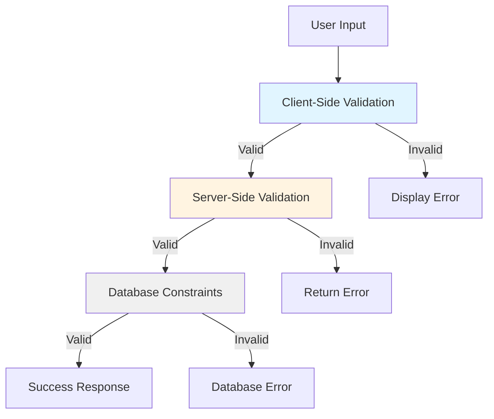

# Recipe Category Management - Validations (VAL)

## Document Information
- **Document Type**: Validations Specification
- **Module**: Operational Planning > Recipe Management > Categories
- **Version**: 1.0
- **Last Updated**: 2024-01-15
- **Related Documents**:
  - [BR-categories.md](./BR-categories.md) - Business Requirements
  - [UC-categories.md](./UC-categories.md) - Use Cases
  - [TS-categories.md](./TS-categories.md) - Technical Specification
  - [DS-categories.md](./DS-categories.md) - Data Schema
  - [FD-categories.md](./FD-categories.md) - Flow Diagrams

## Document History

| Version | Date | Author | Changes |
|---------|------|--------|---------|
| 1.1.0 | 2025-12-10 | Documentation Team | Standardized reference number format (XXX-YYMM-NNNN) |
| 1.0 | 2024-01-15 | System | Initial validation specification created |

---

## 1. Overview

### 1.1 Purpose
This document defines comprehensive validation rules for the Recipe Category Management system across all layers:
- **Client-Side Validation**: Immediate user feedback using Zod schemas and React Hook Form
- **Server-Side Validation**: Security-focused validation in server actions
- **Database Constraints**: Data integrity enforcement at the database level
- **Business Rule Validation**: Complex business logic validation

### 1.2 Validation Layers



### 1.3 Validation Strategy
- **Defense in Depth**: Multiple validation layers prevent invalid data
- **Fail Fast**: Client-side validation provides immediate feedback
- **Security Focus**: Server-side validation prevents malicious input
- **Data Integrity**: Database constraints ensure consistency
- **User Experience**: Clear, actionable error messages

---

## 2. Client-Side Validation (Zod Schemas)

### 2.1 Base Category Schema

```typescript
import { z } from "zod"

// Percentage validation schema (0-100)
const percentageSchema = z
  .number({ required_error: "Percentage is required" })
  .min(0, "Percentage cannot be negative")
  .max(100, "Percentage cannot exceed 100")
  .multipleOf(0.01, "Percentage must have at most 2 decimal places")

// Money validation schema (non-negative)
const moneySchema = z
  .number({ required_error: "Amount is required" })
  .min(0, "Amount cannot be negative")
  .multipleOf(0.01, "Amount must have at most 2 decimal places")

// Category status enum
const categoryStatusSchema = z.enum(['active', 'inactive'], {
  required_error: "Status is required",
  invalid_type_error: "Invalid status value"
})

// Cost settings nested schema
const costSettingsSchema = z.object({
  laborCostPercentage: percentageSchema
    .default(30)
    .refine((val) => val >= 0 && val <= 50, {
      message: "Labor cost should typically be between 0% and 50%"
    }),
  overheadPercentage: percentageSchema
    .default(20)
    .refine((val) => val >= 0 && val <= 40, {
      message: "Overhead should typically be between 0% and 40%"
    }),
  targetFoodCostPercentage: percentageSchema
    .default(30)
    .refine((val) => val >= 20 && val <= 50, {
      message: "Food cost should typically be between 20% and 50%"
    })
}).refine((data) => {
  const total = data.laborCostPercentage + data.overheadPercentage + data.targetFoodCostPercentage
  return total <= 100
}, {
  message: "Total of all cost percentages cannot exceed 100%",
  path: ['targetFoodCostPercentage'] // Show error on last field
})

// Margin settings nested schema
const marginSettingsSchema = z.object({
  minimumMargin: percentageSchema
    .default(60)
    .refine((val) => val >= 40, {
      message: "Minimum margin should be at least 40% for sustainability"
    }),
  targetMargin: percentageSchema
    .default(70)
}).refine((data) => {
  return data.targetMargin >= data.minimumMargin
}, {
  message: "Target margin must be greater than or equal to minimum margin",
  path: ['targetMargin']
})

// Base category schema
export const categorySchema = z.object({
  name: z
    .string({ required_error: "Category name is required" })
    .min(2, "Name must be at least 2 characters")
    .max(100, "Name cannot exceed 100 characters")
    .regex(/^[a-zA-Z0-9\s\-&'()]+$/, {
      message: "Name can only contain letters, numbers, spaces, hyphens, ampersands, apostrophes, and parentheses"
    })
    .trim(),

  code: z
    .string({ required_error: "Category code is required" })
    .min(2, "Code must be at least 2 characters")
    .max(20, "Code cannot exceed 20 characters")
    .regex(/^[A-Z0-9\-_]+$/, {
      message: "Code must be uppercase letters, numbers, hyphens, or underscores only"
    })
    .trim(),

  description: z
    .string({ required_error: "Description is required" })
    .min(10, "Description must be at least 10 characters")
    .max(500, "Description cannot exceed 500 characters")
    .trim(),

  parentId: z
    .string()
    .nullable()
    .optional(),

  status: categoryStatusSchema.default('active'),

  sortOrder: z
    .number()
    .int("Sort order must be a whole number")
    .min(0, "Sort order cannot be negative")
    .default(0),

  defaultCostSettings: costSettingsSchema,

  defaultMargins: marginSettingsSchema
})

export type CategoryFormData = z.infer<typeof categorySchema>
```

### 2.2 Create Category Schema

```typescript
export const createCategorySchema = categorySchema.extend({
  parentId: z
    .string()
    .nullable()
    .optional()
    .refine((val) => {
      // Additional validation for parent category if needed
      return true
    }, {
      message: "Invalid parent category"
    })
})

export type CreateCategoryInput = z.infer<typeof createCategorySchema>
```

### 2.3 Update Category Schema

```typescript
export const updateCategorySchema = categorySchema.extend({
  id: z
    .string({ required_error: "Category ID is required" })
    .min(1, "Invalid category ID"),

  parentId: z
    .string()
    .nullable()
    .optional()
    .refine((val, ctx) => {
      // Prevent circular reference (validated on server too)
      const categoryId = ctx.parent.id
      if (val === categoryId) {
        return false
      }
      return true
    }, {
      message: "Category cannot be its own parent"
    })
})

export type UpdateCategoryInput = z.infer<typeof updateCategorySchema>
```

### 2.4 Delete Category Schema

```typescript
export const deleteCategorySchema = z.object({
  id: z
    .string({ required_error: "Category ID is required" })
    .min(1, "Invalid category ID"),

  force: z
    .boolean()
    .optional()
    .default(false)
    .describe("Force delete even with warnings")
})

export type DeleteCategoryInput = z.infer<typeof deleteCategorySchema>
```

### 2.5 Filter Schema

```typescript
export const categoryFilterSchema = z.object({
  searchTerm: z
    .string()
    .max(100, "Search term too long")
    .optional(),

  status: z
    .array(categoryStatusSchema)
    .optional(),

  hasParent: z
    .boolean()
    .nullable()
    .optional(),

  parentId: z
    .string()
    .nullable()
    .optional(),

  minRecipes: z
    .number()
    .int()
    .min(0)
    .nullable()
    .optional(),

  maxRecipes: z
    .number()
    .int()
    .min(0)
    .nullable()
    .optional(),

  minMargin: z
    .number()
    .min(0)
    .max(100)
    .nullable()
    .optional(),

  maxMargin: z
    .number()
    .min(0)
    .max(100)
    .nullable()
    .optional()
}).refine((data) => {
  if (data.minRecipes !== null && data.maxRecipes !== null) {
    return data.minRecipes <= data.maxRecipes
  }
  return true
}, {
  message: "Minimum recipes cannot be greater than maximum recipes",
  path: ['maxRecipes']
}).refine((data) => {
  if (data.minMargin !== null && data.maxMargin !== null) {
    return data.minMargin <= data.maxMargin
  }
  return true
}, {
  message: "Minimum margin cannot be greater than maximum margin",
  path: ['maxMargin']
})

export type CategoryFilter = z.infer<typeof categoryFilterSchema>
```

---

## 3. Server-Side Validation

### 3.1 Create Category Validation

```typescript
import { createCategorySchema } from '@/lib/validations/category'
import { prisma } from '@/lib/prisma'

export async function validateCreateCategory(
  input: unknown
): Promise<{ success: true; data: CreateCategoryInput } | { success: false; error: string }> {

  // 1. Schema validation
  const parsed = createCategorySchema.safeParse(input)
  if (!parsed.success) {
    return {
      success: false,
      error: parsed.error.errors[0]?.message || "Invalid input data"
    }
  }

  const data = parsed.data

  // 2. Check code uniqueness
  const existingCode = await prisma.recipeCategory.findUnique({
    where: { code: data.code },
    select: { id: true, name: true }
  })

  if (existingCode) {
    return {
      success: false,
      error: `Category code "${data.code}" is already used by "${existingCode.name}"`
    }
  }

  // 3. Check name uniqueness (case-insensitive)
  const existingName = await prisma.recipeCategory.findFirst({
    where: {
      name: {
        equals: data.name,
        mode: 'insensitive'
      }
    },
    select: { id: true, code: true }
  })

  if (existingName) {
    return {
      success: false,
      error: `Category name "${data.name}" is already used (code: ${existingName.code})`
    }
  }

  // 4. Validate parent category if specified
  if (data.parentId) {
    const parent = await prisma.recipeCategory.findUnique({
      where: { id: data.parentId },
      select: { id: true, level: true, status: true }
    })

    if (!parent) {
      return {
        success: false,
        error: "Parent category not found"
      }
    }

    if (parent.level !== 1) {
      return {
        success: false,
        error: "Cannot create subcategory under another subcategory (max 2 levels)"
      }
    }

    if (parent.status === 'inactive') {
      return {
        success: false,
        error: "Cannot create subcategory under an inactive parent"
      }
    }
  }

  // 5. Validate cost percentages total
  const { laborCostPercentage, overheadPercentage, targetFoodCostPercentage } = data.defaultCostSettings
  const totalCost = laborCostPercentage + overheadPercentage + targetFoodCostPercentage

  if (totalCost > 100) {
    return {
      success: false,
      error: `Total cost percentages (${totalCost}%) exceed 100%`
    }
  }

  // 6. Warning for high total cost (doesn't block creation)
  if (totalCost > 85) {
    // This would be logged or returned as a warning
    console.warn(`High total cost percentage: ${totalCost}% for category "${data.name}"`)
  }

  // 7. Validate margin relationship
  if (data.defaultMargins.targetMargin < data.defaultMargins.minimumMargin) {
    return {
      success: false,
      error: "Target margin cannot be less than minimum margin"
    }
  }

  return { success: true, data }
}
```

### 3.2 Update Category Validation

```typescript
export async function validateUpdateCategory(
  input: unknown
): Promise<{ success: true; data: UpdateCategoryInput } | { success: false; error: string }> {

  // 1. Schema validation
  const parsed = updateCategorySchema.safeParse(input)
  if (!parsed.success) {
    return {
      success: false,
      error: parsed.error.errors[0]?.message || "Invalid input data"
    }
  }

  const data = parsed.data

  // 2. Check category exists
  const existing = await prisma.recipeCategory.findUnique({
    where: { id: data.id },
    include: {
      subcategories: {
        select: { id: true }
      },
      recipes: {
        where: { status: 'active' },
        select: { id: true }
      }
    }
  })

  if (!existing) {
    return {
      success: false,
      error: "Category not found"
    }
  }

  // 3. Check code uniqueness (excluding current category)
  if (data.code !== existing.code) {
    const codeConflict = await prisma.recipeCategory.findFirst({
      where: {
        code: data.code,
        id: { not: data.id }
      }
    })

    if (codeConflict) {
      return {
        success: false,
        error: `Category code "${data.code}" is already in use`
      }
    }
  }

  // 4. Check name uniqueness (excluding current category)
  if (data.name.toLowerCase() !== existing.name.toLowerCase()) {
    const nameConflict = await prisma.recipeCategory.findFirst({
      where: {
        name: {
          equals: data.name,
          mode: 'insensitive'
        },
        id: { not: data.id }
      }
    })

    if (nameConflict) {
      return {
        success: false,
        error: `Category name "${data.name}" is already in use`
      }
    }
  }

  // 5. Validate parent change
  if (data.parentId !== existing.parentId) {
    // Cannot change parent if category has subcategories
    if (existing.subcategories.length > 0) {
      return {
        success: false,
        error: "Cannot change parent of category with subcategories"
      }
    }

    // Validate new parent
    if (data.parentId) {
      // Prevent circular reference
      if (data.parentId === data.id) {
        return {
          success: false,
          error: "Category cannot be its own parent"
        }
      }

      // Check if new parent exists and is level 1
      const newParent = await prisma.recipeCategory.findUnique({
        where: { id: data.parentId },
        select: { level: true, status: true }
      })

      if (!newParent) {
        return {
          success: false,
          error: "New parent category not found"
        }
      }

      if (newParent.level !== 1) {
        return {
          success: false,
          error: "Cannot set a subcategory as parent (max 2 levels)"
        }
      }

      if (newParent.status === 'inactive') {
        return {
          success: false,
          error: "Cannot move category under an inactive parent"
        }
      }
    }
  }

  // 6. Validate status change
  if (data.status === 'inactive' && existing.status === 'active') {
    // Cannot deactivate if has active recipes
    if (existing.recipes.length > 0) {
      return {
        success: false,
        error: `Cannot deactivate category with ${existing.recipes.length} active recipe(s)`
      }
    }

    // Cannot deactivate if has active subcategories
    const activeSubcategories = await prisma.recipeCategory.count({
      where: {
        parentId: data.id,
        status: 'active'
      }
    })

    if (activeSubcategories > 0) {
      return {
        success: false,
        error: `Cannot deactivate category with ${activeSubcategories} active subcategory(ies)`
      }
    }
  }

  // 7. Validate cost settings
  const { laborCostPercentage, overheadPercentage, targetFoodCostPercentage } = data.defaultCostSettings
  const totalCost = laborCostPercentage + overheadPercentage + targetFoodCostPercentage

  if (totalCost > 100) {
    return {
      success: false,
      error: `Total cost percentages (${totalCost}%) exceed 100%`
    }
  }

  // 8. Validate margin relationship
  if (data.defaultMargins.targetMargin < data.defaultMargins.minimumMargin) {
    return {
      success: false,
      error: "Target margin cannot be less than minimum margin"
    }
  }

  return { success: true, data }
}
```

### 3.3 Delete Category Validation

```typescript
export async function validateDeleteCategory(
  input: unknown
): Promise<{ success: true; data: DeleteCategoryInput; warnings?: string[] } | { success: false; error: string }> {

  // 1. Schema validation
  const parsed = deleteCategorySchema.safeParse(input)
  if (!parsed.success) {
    return {
      success: false,
      error: parsed.error.errors[0]?.message || "Invalid input data"
    }
  }

  const data = parsed.data
  const warnings: string[] = []

  // 2. Check category exists
  const category = await prisma.recipeCategory.findUnique({
    where: { id: data.id },
    include: {
      subcategories: {
        select: { id: true, name: true, status: true }
      },
      recipes: {
        select: { id: true, recipeCode: true, status: true }
      }
    }
  })

  if (!category) {
    return {
      success: false,
      error: "Category not found"
    }
  }

  // 3. Check for active recipes (BLOCKING)
  const activeRecipes = category.recipes.filter(r => r.status === 'active')
  if (activeRecipes.length > 0) {
    return {
      success: false,
      error: `Cannot delete category with ${activeRecipes.length} active recipe(s). Please deactivate or reassign recipes first.`
    }
  }

  // 4. Check for inactive recipes (WARNING)
  const inactiveRecipes = category.recipes.filter(r => r.status === 'inactive')
  if (inactiveRecipes.length > 0) {
    warnings.push(`Category has ${inactiveRecipes.length} inactive recipe(s) that will be reassigned to "Uncategorized"`)
  }

  // 5. Check for subcategories (WARNING)
  if (category.subcategories.length > 0) {
    const activeSubcategories = category.subcategories.filter(s => s.status === 'active')
    if (activeSubcategories.length > 0) {
      warnings.push(`Category has ${activeSubcategories.length} active subcategory(ies) that will be converted to top-level categories`)
    }

    const inactiveSubcategories = category.subcategories.filter(s => s.status === 'inactive')
    if (inactiveSubcategories.length > 0) {
      warnings.push(`Category has ${inactiveSubcategories.length} inactive subcategory(ies) that will be converted to top-level categories`)
    }
  }

  // 6. Check if force delete is required for warnings
  if (warnings.length > 0 && !data.force) {
    return {
      success: false,
      error: `Deletion requires confirmation due to: ${warnings.join('; ')}. Set force=true to proceed.`
    }
  }

  return {
    success: true,
    data,
    warnings: warnings.length > 0 ? warnings : undefined
  }
}
```

---

## 4. Database Constraints

### 4.1 Table Constraints

```sql
-- Primary key constraint
ALTER TABLE recipe_categories
  ADD CONSTRAINT pk_recipe_categories PRIMARY KEY (id);

-- Unique constraints
ALTER TABLE recipe_categories
  ADD CONSTRAINT uq_category_code UNIQUE (code);

ALTER TABLE recipe_categories
  ADD CONSTRAINT uq_category_name UNIQUE (name);

-- Foreign key constraints
ALTER TABLE recipe_categories
  ADD CONSTRAINT fk_category_parent
  FOREIGN KEY (parent_id)
  REFERENCES recipe_categories(id)
  ON DELETE RESTRICT;

ALTER TABLE recipe_categories
  ADD CONSTRAINT fk_category_creator
  FOREIGN KEY (created_by)
  REFERENCES users(id)
  ON DELETE RESTRICT;

ALTER TABLE recipe_categories
  ADD CONSTRAINT fk_category_updater
  FOREIGN KEY (updated_by)
  REFERENCES users(id)
  ON DELETE RESTRICT;

-- Check constraints
ALTER TABLE recipe_categories
  ADD CONSTRAINT chk_category_level
  CHECK (level IN (1, 2));

ALTER TABLE recipe_categories
  ADD CONSTRAINT chk_category_status
  CHECK (status IN ('active', 'inactive'));

ALTER TABLE recipe_categories
  ADD CONSTRAINT chk_category_sort_order
  CHECK (sort_order >= 0);

ALTER TABLE recipe_categories
  ADD CONSTRAINT chk_recipe_count
  CHECK (recipe_count >= 0);

ALTER TABLE recipe_categories
  ADD CONSTRAINT chk_active_recipe_count
  CHECK (active_recipe_count >= 0 AND active_recipe_count <= recipe_count);

ALTER TABLE recipe_categories
  ADD CONSTRAINT chk_average_cost
  CHECK (average_cost IS NULL OR average_cost >= 0);

ALTER TABLE recipe_categories
  ADD CONSTRAINT chk_average_margin
  CHECK (average_margin IS NULL OR (average_margin >= 0 AND average_margin <= 100));

-- Hierarchy constraint (level 1 has no parent, level 2 has parent)
ALTER TABLE recipe_categories
  ADD CONSTRAINT chk_hierarchy_level
  CHECK (
    (level = 1 AND parent_id IS NULL) OR
    (level = 2 AND parent_id IS NOT NULL)
  );

-- Name length constraint
ALTER TABLE recipe_categories
  ADD CONSTRAINT chk_name_length
  CHECK (LENGTH(TRIM(name)) >= 2);

-- Code format constraint (uppercase letters, numbers, hyphens, underscores)
ALTER TABLE recipe_categories
  ADD CONSTRAINT chk_code_format
  CHECK (code ~ '^[A-Z0-9\-_]+$');

-- Description length constraint
ALTER TABLE recipe_categories
  ADD CONSTRAINT chk_description_length
  CHECK (LENGTH(TRIM(description)) >= 10);
```

### 4.2 Database Triggers

```sql
-- Trigger to prevent circular parent references
CREATE OR REPLACE FUNCTION check_category_circular_reference()
RETURNS TRIGGER AS $$
DECLARE
  current_parent_id VARCHAR(30);
  visited_ids VARCHAR(30)[];
BEGIN
  -- Only check if parent_id is being set or changed
  IF NEW.parent_id IS NULL THEN
    RETURN NEW;
  END IF;

  -- Cannot be own parent
  IF NEW.id = NEW.parent_id THEN
    RAISE EXCEPTION 'Category cannot be its own parent';
  END IF;

  -- Check for circular reference by traversing parent chain
  current_parent_id := NEW.parent_id;
  visited_ids := ARRAY[NEW.id];

  WHILE current_parent_id IS NOT NULL LOOP
    -- Check if we've seen this ID before (circular reference)
    IF current_parent_id = ANY(visited_ids) THEN
      RAISE EXCEPTION 'Circular parent reference detected';
    END IF;

    -- Add to visited
    visited_ids := array_append(visited_ids, current_parent_id);

    -- Get next parent
    SELECT parent_id INTO current_parent_id
    FROM recipe_categories
    WHERE id = current_parent_id;
  END LOOP;

  RETURN NEW;
END;
$$ LANGUAGE plpgsql;

CREATE TRIGGER trg_check_circular_reference
  BEFORE INSERT OR UPDATE ON recipe_categories
  FOR EACH ROW
  EXECUTE FUNCTION check_category_circular_reference();

-- Trigger to update updated_at timestamp
CREATE OR REPLACE FUNCTION update_category_timestamp()
RETURNS TRIGGER AS $$
BEGIN
  NEW.updated_at := CURRENT_TIMESTAMP;
  NEW.last_updated := CURRENT_TIMESTAMP;
  RETURN NEW;
END;
$$ LANGUAGE plpgsql;

CREATE TRIGGER trg_update_category_timestamp
  BEFORE UPDATE ON recipe_categories
  FOR EACH ROW
  EXECUTE FUNCTION update_category_timestamp();

-- Trigger to validate JSONB structure for cost settings
CREATE OR REPLACE FUNCTION validate_cost_settings()
RETURNS TRIGGER AS $$
DECLARE
  labor_pct NUMERIC;
  overhead_pct NUMERIC;
  food_cost_pct NUMERIC;
  total_pct NUMERIC;
BEGIN
  -- Extract percentages from JSONB
  labor_pct := (NEW.default_cost_settings->>'laborCostPercentage')::NUMERIC;
  overhead_pct := (NEW.default_cost_settings->>'overheadPercentage')::NUMERIC;
  food_cost_pct := (NEW.default_cost_settings->>'targetFoodCostPercentage')::NUMERIC;

  -- Validate individual percentages
  IF labor_pct < 0 OR labor_pct > 100 THEN
    RAISE EXCEPTION 'Labor cost percentage must be between 0 and 100';
  END IF;

  IF overhead_pct < 0 OR overhead_pct > 100 THEN
    RAISE EXCEPTION 'Overhead percentage must be between 0 and 100';
  END IF;

  IF food_cost_pct < 0 OR food_cost_pct > 100 THEN
    RAISE EXCEPTION 'Food cost percentage must be between 0 and 100';
  END IF;

  -- Validate total doesn't exceed 100%
  total_pct := labor_pct + overhead_pct + food_cost_pct;
  IF total_pct > 100 THEN
    RAISE EXCEPTION 'Total cost percentages (%) exceed 100%%', total_pct;
  END IF;

  RETURN NEW;
END;
$$ LANGUAGE plpgsql;

CREATE TRIGGER trg_validate_cost_settings
  BEFORE INSERT OR UPDATE ON recipe_categories
  FOR EACH ROW
  EXECUTE FUNCTION validate_cost_settings();

-- Trigger to validate margin settings
CREATE OR REPLACE FUNCTION validate_margin_settings()
RETURNS TRIGGER AS $$
DECLARE
  min_margin NUMERIC;
  target_margin NUMERIC;
BEGIN
  -- Extract margins from JSONB
  min_margin := (NEW.default_margins->>'minimumMargin')::NUMERIC;
  target_margin := (NEW.default_margins->>'targetMargin')::NUMERIC;

  -- Validate individual margins
  IF min_margin < 0 OR min_margin > 100 THEN
    RAISE EXCEPTION 'Minimum margin must be between 0 and 100';
  END IF;

  IF target_margin < 0 OR target_margin > 100 THEN
    RAISE EXCEPTION 'Target margin must be between 0 and 100';
  END IF;

  -- Validate target >= minimum
  IF target_margin < min_margin THEN
    RAISE EXCEPTION 'Target margin (%) must be greater than or equal to minimum margin (%)',
      target_margin, min_margin;
  END IF;

  RETURN NEW;
END;
$$ LANGUAGE plpgsql;

CREATE TRIGGER trg_validate_margin_settings
  BEFORE INSERT OR UPDATE ON recipe_categories
  FOR EACH ROW
  EXECUTE FUNCTION validate_margin_settings();
```

---

## 5. Field-Level Validation Rules

### 5.1 Name Field

| Rule | Type | Description | Error Message |
|------|------|-------------|---------------|
| Required | Client/Server | Cannot be null or empty | "Category name is required" |
| Min Length | Client/Server | At least 2 characters | "Name must be at least 2 characters" |
| Max Length | Client/Server/DB | Maximum 100 characters | "Name cannot exceed 100 characters" |
| Format | Client/Server | Letters, numbers, spaces, hyphens, &, ', () | "Name can only contain letters, numbers, spaces, hyphens, ampersands, apostrophes, and parentheses" |
| Trim | Client/Server | Remove leading/trailing whitespace | Applied automatically |
| Uniqueness | Server/DB | No duplicate names (case-insensitive) | "Category name '{name}' is already used" |

**Valid Examples**:
- "Appetizers"
- "Main Courses - Seafood"
- "Desserts & Sweets"
- "Chef's Special (Limited)"

**Invalid Examples**:
- "A" (too short)
- "Desserts@Special" (invalid character @)
- "Main_Courses" (underscore not allowed)

### 5.2 Code Field

| Rule | Type | Description | Error Message |
|------|------|-------------|---------------|
| Required | Client/Server | Cannot be null or empty | "Category code is required" |
| Min Length | Client/Server | At least 2 characters | "Code must be at least 2 characters" |
| Max Length | Client/Server/DB | Maximum 20 characters | "Code cannot exceed 20 characters" |
| Format | Client/Server/DB | Uppercase letters, numbers, hyphens, underscores | "Code must be uppercase letters, numbers, hyphens, or underscores only" |
| Trim | Client/Server | Remove leading/trailing whitespace | Applied automatically |
| Uniqueness | Server/DB | No duplicate codes | "Category code '{code}' is already used" |

**Valid Examples**:
- "APP"
- "MAIN-SEAFOOD"
- "DESSERT_01"
- "CHEF-SPECIAL"

**Invalid Examples**:
- "app" (must be uppercase)
- "Main Courses" (no spaces)
- "DESSERT@01" (invalid character @)

### 5.3 Description Field

| Rule | Type | Description | Error Message |
|------|------|-------------|---------------|
| Required | Client/Server | Cannot be null or empty | "Description is required" |
| Min Length | Client/Server/DB | At least 10 characters | "Description must be at least 10 characters" |
| Max Length | Client/Server | Maximum 500 characters | "Description cannot exceed 500 characters" |
| Trim | Client/Server | Remove leading/trailing whitespace | Applied automatically |

### 5.4 Parent ID Field

| Rule | Type | Description | Error Message |
|------|------|-------------|---------------|
| Optional | Client/Server | Can be null for top-level categories | N/A |
| Existence | Server | Parent must exist if specified | "Parent category not found" |
| Level Check | Server/DB | Parent must be level 1 | "Cannot create subcategory under another subcategory (max 2 levels)" |
| Self-Reference | Server/DB | Cannot be same as category ID | "Category cannot be its own parent" |
| Circular Reference | Server/DB | Cannot create circular hierarchy | "Circular parent reference detected" |
| Active Status | Server | Parent must be active | "Cannot create subcategory under an inactive parent" |

### 5.5 Status Field

| Rule | Type | Description | Error Message |
|------|------|-------------|---------------|
| Required | Client/Server | Cannot be null | "Status is required" |
| Enum Values | Client/Server/DB | Must be 'active' or 'inactive' | "Invalid status value" |
| Deactivation Check | Server | Cannot deactivate with active recipes | "Cannot deactivate category with {count} active recipe(s)" |
| Subcategory Check | Server | Cannot deactivate with active subcategories | "Cannot deactivate category with {count} active subcategory(ies)" |

### 5.6 Sort Order Field

| Rule | Type | Description | Error Message |
|------|------|-------------|---------------|
| Optional | Client/Server | Defaults to 0 if not provided | N/A |
| Integer | Client/Server | Must be whole number | "Sort order must be a whole number" |
| Non-Negative | Client/Server/DB | Cannot be negative | "Sort order cannot be negative" |

### 5.7 Cost Settings Fields

#### Labor Cost Percentage
| Rule | Type | Description | Error Message |
|------|------|-------------|---------------|
| Required | Client/Server | Cannot be null | "Labor cost percentage is required" |
| Range | Client/Server/DB | 0-100 | "Labor cost percentage must be between 0 and 100" |
| Decimal Precision | Client/Server | Max 2 decimal places | "Labor cost percentage must have at most 2 decimal places" |
| Practical Range | Client | Warning if outside 0-50% | "Labor cost should typically be between 0% and 50%" |

#### Overhead Percentage
| Rule | Type | Description | Error Message |
|------|------|-------------|---------------|
| Required | Client/Server | Cannot be null | "Overhead percentage is required" |
| Range | Client/Server/DB | 0-100 | "Overhead percentage must be between 0 and 100" |
| Decimal Precision | Client/Server | Max 2 decimal places | "Overhead percentage must have at most 2 decimal places" |
| Practical Range | Client | Warning if outside 0-40% | "Overhead should typically be between 0% and 40%" |

#### Target Food Cost Percentage
| Rule | Type | Description | Error Message |
|------|------|-------------|---------------|
| Required | Client/Server | Cannot be null | "Food cost percentage is required" |
| Range | Client/Server/DB | 0-100 | "Food cost percentage must be between 0 and 100" |
| Decimal Precision | Client/Server | Max 2 decimal places | "Food cost percentage must have at most 2 decimal places" |
| Practical Range | Client | Warning if outside 20-50% | "Food cost should typically be between 20% and 50%" |

#### Total Cost Validation
| Rule | Type | Description | Error Message |
|------|------|-------------|---------------|
| Sum Check | Client/Server/DB | Labor + Overhead + Food Cost ≤ 100% | "Total of all cost percentages cannot exceed 100%" |
| Warning Threshold | Client/Server | Warning if total > 85% | "High total cost percentage: {total}%" |

### 5.8 Margin Settings Fields

#### Minimum Margin
| Rule | Type | Description | Error Message |
|------|------|-------------|---------------|
| Required | Client/Server | Cannot be null | "Minimum margin is required" |
| Range | Client/Server/DB | 0-100 | "Minimum margin must be between 0 and 100" |
| Decimal Precision | Client/Server | Max 2 decimal places | "Minimum margin must have at most 2 decimal places" |
| Business Minimum | Client | Warning if < 40% | "Minimum margin should be at least 40% for sustainability" |

#### Target Margin
| Rule | Type | Description | Error Message |
|------|------|-------------|---------------|
| Required | Client/Server | Cannot be null | "Target margin is required" |
| Range | Client/Server/DB | 0-100 | "Target margin must be between 0 and 100" |
| Decimal Precision | Client/Server | Max 2 decimal places | "Target margin must have at most 2 decimal places" |
| Relationship | Client/Server/DB | Target ≥ Minimum | "Target margin must be greater than or equal to minimum margin" |

### 5.9 Metric Fields (Read-Only)

#### Recipe Count
| Rule | Type | Description | Error Message |
|------|------|-------------|---------------|
| Auto-Calculated | Server/DB | Cannot be manually set | N/A |
| Non-Negative | DB | Must be ≥ 0 | Enforced by database |

#### Active Recipe Count
| Rule | Type | Description | Error Message |
|------|------|-------------|---------------|
| Auto-Calculated | Server/DB | Cannot be manually set | N/A |
| Range | DB | 0 ≤ Active ≤ Total | Enforced by database |

#### Average Cost
| Rule | Type | Description | Error Message |
|------|------|-------------|---------------|
| Auto-Calculated | Server/DB | Cannot be manually set | N/A |
| Non-Negative | DB | Must be ≥ 0 if not null | Enforced by database |
| Nullable | DB | NULL if no recipes | Allowed |

#### Average Margin
| Rule | Type | Description | Error Message |
|------|------|-------------|---------------|
| Auto-Calculated | Server/DB | Cannot be manually set | N/A |
| Range | DB | 0-100 if not null | Enforced by database |
| Nullable | DB | NULL if no recipes | Allowed |

---

## 6. Business Rule Validations

### 6.1 BR-CAT-003: Hierarchy Depth Limit

**Rule**: Category hierarchy cannot exceed 2 levels (parent and subcategory)

**Validation Points**:
1. **Client**: Disable parent selection for level 2 categories
2. **Server**: Check parent level before allowing assignment
3. **Database**: Constraint on level + parent_id relationship

**Validation Logic**:
```typescript
async function validateHierarchyDepth(categoryId: string, newParentId: string | null) {
  if (!newParentId) {
    return { valid: true }
  }

  const parent = await prisma.recipeCategory.findUnique({
    where: { id: newParentId },
    select: { level: true }
  })

  if (!parent) {
    return { valid: false, error: "Parent category not found" }
  }

  if (parent.level !== 1) {
    return {
      valid: false,
      error: "Cannot create subcategory under another subcategory (max 2 levels)"
    }
  }

  return { valid: true }
}
```

### 6.2 BR-CAT-004: Parent Category Change Restrictions

**Rule**: Cannot change parent category if the category has subcategories

**Validation Points**:
1. **Client**: Disable parent field if category has subcategories
2. **Server**: Check for subcategories before allowing parent change

**Validation Logic**:
```typescript
async function validateParentChange(
  categoryId: string,
  currentParentId: string | null,
  newParentId: string | null
) {
  if (currentParentId === newParentId) {
    return { valid: true } // No change
  }

  const subcategoryCount = await prisma.recipeCategory.count({
    where: { parentId: categoryId }
  })

  if (subcategoryCount > 0) {
    return {
      valid: false,
      error: `Cannot change parent of category with ${subcategoryCount} subcategory(ies)`
    }
  }

  return { valid: true }
}
```

### 6.3 BR-CAT-005: Deletion with Active Recipes (BLOCKING)

**Rule**: Cannot delete category with active recipes

**Validation Points**:
1. **Client**: Display warning and block delete button
2. **Server**: Check for active recipes before deletion

**Validation Logic**:
```typescript
async function validateDeletionWithRecipes(categoryId: string) {
  const activeRecipeCount = await prisma.recipe.count({
    where: {
      categoryId: categoryId,
      status: 'active'
    }
  })

  if (activeRecipeCount > 0) {
    return {
      valid: false,
      error: `Cannot delete category with ${activeRecipeCount} active recipe(s). Please deactivate or reassign recipes first.`
    }
  }

  // Check for inactive recipes (warning only)
  const inactiveRecipeCount = await prisma.recipe.count({
    where: {
      categoryId: categoryId,
      status: 'inactive'
    }
  })

  if (inactiveRecipeCount > 0) {
    return {
      valid: true,
      warning: `Category has ${inactiveRecipeCount} inactive recipe(s) that will be reassigned`
    }
  }

  return { valid: true }
}
```

### 6.4 BR-CAT-009: Margin Relationship Validation

**Rule**: Target margin must be greater than or equal to minimum margin

**Validation Points**:
1. **Client**: Real-time validation as user types
2. **Server**: Validation before save
3. **Database**: Trigger validation on JSONB field

**Validation Logic**:
```typescript
function validateMarginRelationship(minimumMargin: number, targetMargin: number) {
  if (targetMargin < minimumMargin) {
    return {
      valid: false,
      error: `Target margin (${targetMargin}%) must be greater than or equal to minimum margin (${minimumMargin}%)`
    }
  }

  return { valid: true }
}
```

### 6.5 BR-CAT-010: Cost Percentage Total Limit

**Rule**: Sum of labor cost, overhead, and target food cost percentages cannot exceed 100%

**Validation Points**:
1. **Client**: Real-time calculation and validation
2. **Server**: Validation before save
3. **Database**: Trigger validation on JSONB field

**Validation Logic**:
```typescript
function validateCostPercentageTotal(
  laborCost: number,
  overhead: number,
  foodCost: number
) {
  const total = laborCost + overhead + foodCost

  if (total > 100) {
    return {
      valid: false,
      error: `Total cost percentages (${total.toFixed(2)}%) exceed 100%`
    }
  }

  // Warning for high totals
  if (total > 85) {
    return {
      valid: true,
      warning: `High total cost percentage: ${total.toFixed(2)}% (recommended: ≤85%)`
    }
  }

  return { valid: true }
}
```

### 6.6 BR-CAT-015: Status Change with Active Subcategories

**Rule**: Cannot deactivate category with active subcategories

**Validation Logic**:
```typescript
async function validateStatusChange(categoryId: string, newStatus: string) {
  if (newStatus === 'inactive') {
    const activeSubcategories = await prisma.recipeCategory.count({
      where: {
        parentId: categoryId,
        status: 'active'
      }
    })

    if (activeSubcategories > 0) {
      return {
        valid: false,
        error: `Cannot deactivate category with ${activeSubcategories} active subcategory(ies)`
      }
    }
  }

  return { valid: true }
}
```

---

## 7. Error Messages

### 7.1 Error Message Standards

**Principles**:
- **Clear**: Explain what went wrong in plain language
- **Actionable**: Tell user how to fix the issue
- **Contextual**: Include relevant details (names, values, counts)
- **Consistent**: Use consistent terminology and formatting
- **User-Friendly**: Avoid technical jargon

### 7.2 Error Message Templates

#### Validation Errors
```typescript
export const validationErrors = {
  // Required fields
  required: (field: string) => `${field} is required`,

  // Length constraints
  minLength: (field: string, min: number) =>
    `${field} must be at least ${min} character${min === 1 ? '' : 's'}`,
  maxLength: (field: string, max: number) =>
    `${field} cannot exceed ${max} characters`,

  // Format constraints
  invalidFormat: (field: string, expected: string) =>
    `${field} format is invalid. Expected: ${expected}`,

  // Range constraints
  outOfRange: (field: string, min: number, max: number) =>
    `${field} must be between ${min} and ${max}`,

  // Uniqueness constraints
  duplicate: (field: string, value: string) =>
    `${field} "${value}" is already in use`,

  // Relationship constraints
  notFound: (entity: string) => `${entity} not found`,
  invalidReference: (field: string, entity: string) =>
    `Invalid ${field}. ${entity} not found`,
}
```

#### Business Rule Errors
```typescript
export const businessRuleErrors = {
  // Hierarchy
  maxDepthExceeded: (maxLevel: number) =>
    `Category hierarchy cannot exceed ${maxLevel} levels`,
  circularReference: () =>
    "Circular parent reference detected. A category cannot be its own ancestor",
  selfParent: () =>
    "A category cannot be its own parent",

  // Deletion
  hasActiveRecipes: (count: number) =>
    `Cannot delete category with ${count} active recipe${count === 1 ? '' : 's'}. ` +
    `Please deactivate or reassign recipes first.`,
  hasSubcategories: (count: number) =>
    `Cannot delete category with ${count} subcategory${count === 1 ? 'y' : 'ies'}. ` +
    `Subcategories will be converted to top-level categories.`,

  // Status changes
  deactivateWithActiveRecipes: (count: number) =>
    `Cannot deactivate category with ${count} active recipe${count === 1 ? '' : 's'}`,
  deactivateWithActiveSubcategories: (count: number) =>
    `Cannot deactivate category with ${count} active subcategory${count === 1 ? 'y' : 'ies'}`,
  inactiveParent: () =>
    "Cannot create or move category under an inactive parent",

  // Cost and margin
  totalCostExceeds100: (total: number) =>
    `Total cost percentages (${total.toFixed(2)}%) cannot exceed 100%`,
  targetLessThanMinimum: (target: number, minimum: number) =>
    `Target margin (${target}%) must be greater than or equal to minimum margin (${minimum}%)`,

  // Permissions
  permissionDenied: (action: string) =>
    `You don't have permission to ${action} categories`,
}
```

#### Warning Messages
```typescript
export const warningMessages = {
  highTotalCost: (total: number) =>
    `⚠️ Total cost percentage (${total.toFixed(2)}%) is high. Recommended: ≤85%`,
  lowMinimumMargin: (margin: number) =>
    `⚠️ Minimum margin (${margin}%) is below recommended 40% for sustainability`,
  inactiveRecipesExist: (count: number) =>
    `⚠️ Category has ${count} inactive recipe${count === 1 ? '' : 's'} that will be affected`,
}
```

### 7.3 Error Display Examples

**Form Validation Error**:
```tsx
<FormField
  control={form.control}
  name="code"
  render={({ field }) => (
    <FormItem>
      <FormLabel>Category Code</FormLabel>
      <FormControl>
        <Input {...field} placeholder="APP" />
      </FormControl>
      <FormMessage />
      {/* Error: 'Category code 'APP' is already in use' */}
    </FormItem>
  )}
/>
```

**Server Action Error**:
```tsx
const handleSubmit = async (data: CategoryFormData) => {
  const result = await createCategory(data)

  if (!result.success) {
    toast({
      variant: "destructive",
      title: "Failed to create category",
      description: result.error, // "Total cost percentages (92.00%) exceed 100%"
    })
    return
  }

  toast({
    title: "Category created",
    description: `"${data.name}" has been created successfully.`,
  })
}
```

**Confirmation Dialog with Warnings**:
```tsx
<AlertDialog>
  <AlertDialogContent>
    <AlertDialogHeader>
      <AlertDialogTitle>Delete Category?</AlertDialogTitle>
      <AlertDialogDescription>
        Are you sure you want to delete "{category.name}"?

        {warnings.length > 0 && (
          <div className="mt-4 space-y-2">
            <p className="font-semibold">Warnings:</p>
            {warnings.map((warning, i) => (
              <p key={i} className="text-amber-600">⚠️ {warning}</p>
            ))}
          </div>
        )}
      </AlertDialogDescription>
    </AlertDialogHeader>
    <AlertDialogFooter>
      <AlertDialogCancel>Cancel</AlertDialogCancel>
      <AlertDialogAction onClick={handleDelete}>
        Delete Anyway
      </AlertDialogAction>
    </AlertDialogFooter>
  </AlertDialogContent>
</AlertDialog>
```

---

## 8. Integration with React Hook Form

### 8.1 Form Setup

```typescript
import { useForm } from "react-hook-form"
import { zodResolver } from "@hookform/resolvers/zod"
import { createCategorySchema, type CreateCategoryInput } from "@/lib/validations/category"

export function CreateCategoryForm() {
  const form = useForm<CreateCategoryInput>({
    resolver: zodResolver(createCategorySchema),
    defaultValues: {
      name: "",
      code: "",
      description: "",
      parentId: null,
      status: "active",
      sortOrder: 0,
      defaultCostSettings: {
        laborCostPercentage: 30,
        overheadPercentage: 20,
        targetFoodCostPercentage: 30
      },
      defaultMargins: {
        minimumMargin: 60,
        targetMargin: 70
      }
    },
    mode: "onChange", // Validate on change for immediate feedback
  })

  // Watch cost percentages for real-time total calculation
  const laborCost = form.watch("defaultCostSettings.laborCostPercentage")
  const overhead = form.watch("defaultCostSettings.overheadPercentage")
  const foodCost = form.watch("defaultCostSettings.targetFoodCostPercentage")
  const totalCost = laborCost + overhead + foodCost

  // Watch margins for relationship validation
  const minMargin = form.watch("defaultMargins.minimumMargin")
  const targetMargin = form.watch("defaultMargins.targetMargin")

  return (
    <Form {...form}>
      <form onSubmit={form.handleSubmit(onSubmit)} className="space-y-6">
        {/* Form fields */}
      </form>
    </Form>
  )
}
```

### 8.2 Real-Time Validation Display

```typescript
// Cost percentage total indicator
<div className="flex items-center justify-between">
  <span className="text-sm text-muted-foreground">Total Cost:</span>
  <span className={cn(
    "text-sm font-medium",
    totalCost > 100 ? "text-destructive" :
    totalCost > 85 ? "text-amber-600" :
    "text-green-600"
  )}>
    {totalCost.toFixed(2)}%
    {totalCost > 100 && ' (exceeds 100%)'}
    {totalCost > 85 && totalCost <= 100 && ' (high)'}
  </span>
</div>

// Margin relationship indicator
{targetMargin < minMargin && (
  <Alert variant="destructive">
    <AlertCircle className="h-4 w-4" />
    <AlertDescription>
      Target margin must be greater than or equal to minimum margin
    </AlertDescription>
  </Alert>
)}
```

### 8.3 Async Validation (Uniqueness Checks)

```typescript
import { useDebouncedCallback } from "use-debounce"

export function CreateCategoryForm() {
  const form = useForm<CreateCategoryInput>({
    resolver: zodResolver(createCategorySchema),
  })

  const [codeAvailable, setCodeAvailable] = useState<boolean | null>(null)
  const [nameAvailable, setNameAvailable] = useState<boolean | null>(null)

  // Debounced uniqueness check for code
  const checkCodeUniqueness = useDebouncedCallback(async (code: string) => {
    if (code.length < 2) {
      setCodeAvailable(null)
      return
    }

    const result = await checkCategoryCodeExists(code)
    setCodeAvailable(!result.exists)
  }, 500)

  // Debounced uniqueness check for name
  const checkNameUniqueness = useDebouncedCallback(async (name: string) => {
    if (name.length < 2) {
      setNameAvailable(null)
      return
    }

    const result = await checkCategoryNameExists(name)
    setNameAvailable(!result.exists)
  }, 500)

  return (
    <Form {...form}>
      <FormField
        control={form.control}
        name="code"
        render={({ field }) => (
          <FormItem>
            <FormLabel>Category Code</FormLabel>
            <FormControl>
              <div className="relative">
                <Input
                  {...field}
                  onChange={(e) => {
                    field.onChange(e)
                    checkCodeUniqueness(e.target.value)
                  }}
                />
                {codeAvailable === false && (
                  <AlertCircle className="absolute right-3 top-3 h-4 w-4 text-destructive" />
                )}
                {codeAvailable === true && (
                  <Check className="absolute right-3 top-3 h-4 w-4 text-green-600" />
                )}
              </div>
            </FormControl>
            <FormMessage />
            {codeAvailable === false && (
              <p className="text-sm text-destructive">
                Code already in use
              </p>
            )}
          </FormItem>
        )}
      />
    </Form>
  )
}
```

---

## 9. Validation Test Cases

### 9.1 Create Category Tests

```typescript
describe("Create Category Validation", () => {
  describe("Name Field", () => {
    it("should reject empty name", async () => {
      const input = { ...validCategoryInput, name: "" }
      const result = createCategorySchema.safeParse(input)
      expect(result.success).toBe(false)
      expect(result.error?.errors[0]?.message).toBe("Category name is required")
    })

    it("should reject name shorter than 2 characters", async () => {
      const input = { ...validCategoryInput, name: "A" }
      const result = createCategorySchema.safeParse(input)
      expect(result.success).toBe(false)
      expect(result.error?.errors[0]?.message).toBe("Name must be at least 2 characters")
    })

    it("should reject name longer than 100 characters", async () => {
      const input = { ...validCategoryInput, name: "A".repeat(101) }
      const result = createCategorySchema.safeParse(input)
      expect(result.success).toBe(false)
      expect(result.error?.errors[0]?.message).toBe("Name cannot exceed 100 characters")
    })

    it("should reject name with invalid characters", async () => {
      const input = { ...validCategoryInput, name: "Invalid@Name" }
      const result = createCategorySchema.safeParse(input)
      expect(result.success).toBe(false)
    })

    it("should accept valid name", async () => {
      const input = { ...validCategoryInput, name: "Main Courses - Seafood" }
      const result = createCategorySchema.safeParse(input)
      expect(result.success).toBe(true)
    })
  })

  describe("Code Field", () => {
    it("should reject lowercase code", async () => {
      const input = { ...validCategoryInput, code: "app" }
      const result = createCategorySchema.safeParse(input)
      expect(result.success).toBe(false)
    })

    it("should reject code with spaces", async () => {
      const input = { ...validCategoryInput, code: "MAIN COURSE" }
      const result = createCategorySchema.safeParse(input)
      expect(result.success).toBe(false)
    })

    it("should accept valid code", async () => {
      const input = { ...validCategoryInput, code: "MAIN-SEAFOOD" }
      const result = createCategorySchema.safeParse(input)
      expect(result.success).toBe(true)
    })
  })

  describe("Cost Settings", () => {
    it("should reject total cost exceeding 100%", async () => {
      const input = {
        ...validCategoryInput,
        defaultCostSettings: {
          laborCostPercentage: 40,
          overheadPercentage: 35,
          targetFoodCostPercentage: 30 // Total: 105%
        }
      }
      const result = createCategorySchema.safeParse(input)
      expect(result.success).toBe(false)
      expect(result.error?.errors[0]?.message).toContain("cannot exceed 100%")
    })

    it("should accept valid cost settings", async () => {
      const input = {
        ...validCategoryInput,
        defaultCostSettings: {
          laborCostPercentage: 30,
          overheadPercentage: 20,
          targetFoodCostPercentage: 30 // Total: 80%
        }
      }
      const result = createCategorySchema.safeParse(input)
      expect(result.success).toBe(true)
    })
  })

  describe("Margin Settings", () => {
    it("should reject target margin less than minimum", async () => {
      const input = {
        ...validCategoryInput,
        defaultMargins: {
          minimumMargin: 70,
          targetMargin: 60
        }
      }
      const result = createCategorySchema.safeParse(input)
      expect(result.success).toBe(false)
      expect(result.error?.errors[0]?.message).toContain("Target margin must be greater than")
    })

    it("should accept equal margins", async () => {
      const input = {
        ...validCategoryInput,
        defaultMargins: {
          minimumMargin: 65,
          targetMargin: 65
        }
      }
      const result = createCategorySchema.safeParse(input)
      expect(result.success).toBe(true)
    })
  })
})
```

### 9.2 Update Category Tests

```typescript
describe("Update Category Validation", () => {
  describe("Parent Change", () => {
    it("should reject parent change when category has subcategories", async () => {
      const category = await createCategoryWithSubcategories()
      const input = {
        id: category.id,
        ...validCategoryInput,
        parentId: "new-parent-id"
      }

      const result = await validateUpdateCategory(input)
      expect(result.success).toBe(false)
      expect(result.error).toContain("Cannot change parent of category with")
    })

    it("should reject level 2 category as parent", async () => {
      const level2Category = await createSubcategory()
      const input = {
        id: "test-id",
        ...validCategoryInput,
        parentId: level2Category.id
      }

      const result = await validateUpdateCategory(input)
      expect(result.success).toBe(false)
      expect(result.error).toContain("Cannot set a subcategory as parent")
    })

    it("should reject self as parent", async () => {
      const input = {
        id: "test-id",
        ...validCategoryInput,
        parentId: "test-id"
      }

      const result = await validateUpdateCategory(input)
      expect(result.success).toBe(false)
      expect(result.error).toContain("cannot be its own parent")
    })
  })

  describe("Status Change", () => {
    it("should reject deactivation with active recipes", async () => {
      const category = await createCategoryWithActiveRecipes(5)
      const input = {
        id: category.id,
        ...validCategoryInput,
        status: 'inactive' as const
      }

      const result = await validateUpdateCategory(input)
      expect(result.success).toBe(false)
      expect(result.error).toContain("Cannot deactivate category with 5 active recipe")
    })
  })
})
```

### 9.3 Delete Category Tests

```typescript
describe("Delete Category Validation", () => {
  it("should block deletion with active recipes", async () => {
    const category = await createCategoryWithActiveRecipes(3)
    const input = { id: category.id, force: false }

    const result = await validateDeleteCategory(input)
    expect(result.success).toBe(false)
    expect(result.error).toContain("Cannot delete category with 3 active recipe")
  })

  it("should warn about inactive recipes", async () => {
    const category = await createCategoryWithInactiveRecipes(2)
    const input = { id: category.id, force: false }

    const result = await validateDeleteCategory(input)
    expect(result.success).toBe(false)
    expect(result.error).toContain("Set force=true to proceed")
  })

  it("should allow force deletion with warnings", async () => {
    const category = await createCategoryWithInactiveRecipes(2)
    const input = { id: category.id, force: true }

    const result = await validateDeleteCategory(input)
    expect(result.success).toBe(true)
    expect(result.warnings).toBeDefined()
    expect(result.warnings?.[0]).toContain("inactive recipe")
  })
})
```

---

## 10. Performance Considerations

### 10.1 Validation Performance Optimization

**Client-Side Optimizations**:
- **Debounce Async Validations**: 500ms delay for uniqueness checks
- **Memoize Validation Results**: Cache validation outcomes for unchanged inputs
- **Progressive Validation**: Validate fields individually as user types
- **Lazy Validation**: Skip expensive validations until form submission

**Server-Side Optimizations**:
- **Single Database Query**: Combine uniqueness checks where possible
- **Indexed Lookups**: Use database indexes for code and name fields
- **Selective Field Selection**: Only select required fields for validation
- **Validation Short-Circuiting**: Stop validation chain on first error

### 10.2 Validation Caching

```typescript
import { LRUCache } from "lru-cache"

// Cache for validation results (client-side)
const validationCache = new LRUCache<string, boolean>({
  max: 500,
  ttl: 1000 * 60 * 5, // 5 minutes
})

export async function checkCodeUniqueness(code: string): Promise<boolean> {
  const cacheKey = `code:${code.toUpperCase()}`

  // Check cache first
  const cached = validationCache.get(cacheKey)
  if (cached !== undefined) {
    return cached
  }

  // Perform validation
  const exists = await prisma.recipeCategory.findUnique({
    where: { code },
    select: { id: true }
  })

  const isUnique = !exists
  validationCache.set(cacheKey, isUnique)

  return isUnique
}
```

### 10.3 Batch Validation

```typescript
export async function validateMultipleCategories(
  categories: CreateCategoryInput[]
): Promise<ValidationResult[]> {
  // Collect all codes and names for single query
  const codes = categories.map(c => c.code)
  const names = categories.map(c => c.name)

  // Single query to check all duplicates
  const existing = await prisma.recipeCategory.findMany({
    where: {
      OR: [
        { code: { in: codes } },
        { name: { in: names.map(n => n.toLowerCase()) } }
      ]
    },
    select: { code: true, name: true }
  })

  // Map results back to individual validations
  return categories.map(category => {
    const codeExists = existing.some(e => e.code === category.code)
    const nameExists = existing.some(e =>
      e.name.toLowerCase() === category.name.toLowerCase()
    )

    if (codeExists) {
      return { valid: false, error: `Code "${category.code}" already exists` }
    }
    if (nameExists) {
      return { valid: false, error: `Name "${category.name}" already exists` }
    }

    return { valid: true }
  })
}
```

---

## 11. Security Considerations

### 11.1 Input Sanitization

```typescript
import DOMPurify from 'isomorphic-dompurify'

function sanitizeInput(input: string): string {
  // Remove HTML tags
  const sanitized = DOMPurify.sanitize(input, { ALLOWED_TAGS: [] })

  // Trim whitespace
  return sanitized.trim()
}

export function sanitizeCategoryInput(input: CreateCategoryInput): CreateCategoryInput {
  return {
    ...input,
    name: sanitizeInput(input.name),
    code: sanitizeInput(input.code).toUpperCase(),
    description: sanitizeInput(input.description),
  }
}
```

### 11.2 SQL Injection Prevention

All validations use Prisma ORM with parameterized queries. No raw SQL is executed with user input.

```typescript
// SAFE: Prisma parameterizes queries
const category = await prisma.recipeCategory.findUnique({
  where: { code: userInput } // Automatically sanitized by Prisma
})

// UNSAFE: Never do this
// const category = await prisma.$queryRaw`SELECT * FROM categories WHERE code = ${userInput}`
```

### 11.3 XSS Prevention

- All user input is sanitized before storage
- React automatically escapes JSX output
- Content Security Policy headers prevent inline scripts

### 11.4 Permission Checks

```typescript
export async function validatePermissions(
  userId: string,
  action: 'create' | 'update' | 'delete' | 'view'
): Promise<boolean> {
  const user = await prisma.user.findUnique({
    where: { id: userId },
    include: { role: true }
  })

  if (!user) {
    return false
  }

  const requiredPermissions = {
    create: ['category.create'],
    update: ['category.update'],
    delete: ['category.delete'],
    view: ['category.view']
  }

  return user.role.permissions.some(p =>
    requiredPermissions[action].includes(p)
  )
}
```

---

## 12. Related Documentation

- **[BR-categories.md](./BR-categories.md)** - Business Requirements and Rules
- **[UC-categories.md](./UC-categories.md)** - Use Cases and User Flows
- **[TS-categories.md](./TS-categories.md)** - Technical Implementation Details
- **[DS-categories.md](./DS-categories.md)** - Database Schema and Relationships
- **[FD-categories.md](./FD-categories.md)** - Flow Diagrams and Process Flows

---
