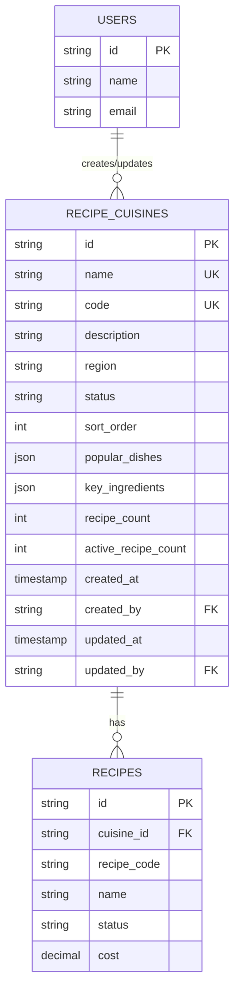

# Recipe Cuisine Types - Data Definition (DS)

## Document Information
- **Document Type**: Data Schema Document
- **Module**: Operational Planning > Recipe Management > Cuisine Types
- **Version**: 1.0
- **Last Updated**: 2024-01-15
- **Related Documents**:
  - [BR-cuisine-types.md](./BR-cuisine-types.md) - Business Requirements
  - [TS-cuisine-types.md](./TS-cuisine-types.md) - Technical Specification

## Document History

| Version | Date | Author | Changes |
|---------|------|--------|---------|
| 1.0 | 2024-01-15 | System | Initial data schema document created |

---

## 1. Database Schema

| 1.1.0 | 2025-11-15 | Documentation Team | Migrated from DS to DD format |

### 1.1 PostgreSQL Table Definition

```sql
CREATE TABLE recipe_cuisines (
  -- Identity
  id VARCHAR(30) PRIMARY KEY,

  -- Basic Information
  name VARCHAR(100) NOT NULL UNIQUE,
  code VARCHAR(20) NOT NULL UNIQUE,
  description TEXT NOT NULL,
  region VARCHAR(50) NOT NULL,

  -- Status & Ordering
  status VARCHAR(20) NOT NULL DEFAULT 'active',
  sort_order INTEGER NOT NULL DEFAULT 0,

  -- Characteristics (JSONB)
  popular_dishes JSONB NOT NULL DEFAULT '[]',
  key_ingredients JSONB NOT NULL DEFAULT '[]',

  -- Metrics (Calculated)
  recipe_count INTEGER NOT NULL DEFAULT 0,
  active_recipe_count INTEGER NOT NULL DEFAULT 0,

  -- Audit Trail
  created_at TIMESTAMP NOT NULL DEFAULT CURRENT_TIMESTAMP,
  created_by VARCHAR(30) NOT NULL,
  updated_at TIMESTAMP NOT NULL DEFAULT CURRENT_TIMESTAMP,
  updated_by VARCHAR(30) NOT NULL,
  last_updated TIMESTAMP NOT NULL DEFAULT CURRENT_TIMESTAMP,

  -- Constraints
  CONSTRAINT chk_cuisine_status CHECK (status IN ('active', 'inactive')),
  CONSTRAINT chk_cuisine_region CHECK (region IN ('Asia', 'Europe', 'Americas', 'Africa', 'Middle East', 'Oceania')),
  CONSTRAINT chk_sort_order CHECK (sort_order >= 0),
  CONSTRAINT chk_recipe_count CHECK (recipe_count >= 0),
  CONSTRAINT chk_active_recipe_count CHECK (active_recipe_count >= 0 AND active_recipe_count <= recipe_count),
  CONSTRAINT chk_code_format CHECK (code ~ '^[A-Z0-9\-_]+$'),
  CONSTRAINT chk_description_length CHECK (LENGTH(TRIM(description)) >= 10),

  -- Foreign Keys
  CONSTRAINT fk_cuisine_creator FOREIGN KEY (created_by) REFERENCES users(id) ON DELETE RESTRICT,
  CONSTRAINT fk_cuisine_updater FOREIGN KEY (updated_by) REFERENCES users(id) ON DELETE RESTRICT
);

-- Indexes
CREATE INDEX idx_recipe_cuisines_status ON recipe_cuisines(status);
CREATE INDEX idx_recipe_cuisines_region ON recipe_cuisines(region);
CREATE INDEX idx_recipe_cuisines_sort_order ON recipe_cuisines(sort_order);
CREATE INDEX idx_recipe_cuisines_recipe_count ON recipe_cuisines(recipe_count);
CREATE INDEX idx_recipe_cuisines_name_gin ON recipe_cuisines USING gin(name gin_trgm_ops);
CREATE INDEX idx_recipe_cuisines_code_gin ON recipe_cuisines USING gin(code gin_trgm_ops);
```

### 1.2 Prisma Schema

```prisma
model RecipeCuisine {
  id              String   @id @default(cuid())

  // Basic Information
  name            String   @unique @db.VarChar(100)
  code            String   @unique @db.VarChar(20)
  description     String   @db.Text
  region          CuisineRegion

  // Status & Ordering
  status          CuisineStatus @default(ACTIVE)
  sortOrder       Int      @default(0) @map("sort_order")

  // Characteristics
  popularDishes   Json     @default("[]") @map("popular_dishes")
  keyIngredients  Json     @default("[]") @map("key_ingredients")

  // Metrics (Calculated)
  recipeCount         Int      @default(0) @map("recipe_count")
  activeRecipeCount   Int      @default(0) @map("active_recipe_count")

  // Relationships
  recipes         Recipe[]

  // Audit Trail
  createdAt       DateTime @default(now()) @map("created_at")
  createdBy       String   @map("created_by")
  creator         User     @relation("CuisineCreator", fields: [createdBy], references: [id], onDelete: Restrict)

  updatedAt       DateTime @updatedAt @map("updated_at")
  updatedBy       String   @map("updated_by")
  updater         User     @relation("CuisineUpdater", fields: [updatedBy], references: [id], onDelete: Restrict)

  lastUpdated     DateTime @default(now()) @map("last_updated")

  @@map("recipe_cuisines")
  @@index([status])
  @@index([region])
  @@index([sortOrder])
  @@index([recipeCount])
}

enum CuisineStatus {
  ACTIVE   @map("active")
  INACTIVE @map("inactive")
}

enum CuisineRegion {
  ASIA         @map("Asia")
  EUROPE       @map("Europe")
  AMERICAS     @map("Americas")
  AFRICA       @map("Africa")
  MIDDLE_EAST  @map("Middle East")
  OCEANIA      @map("Oceania")
}
```

---

## 2. TypeScript Interfaces

### 2.1 Main Entity Interface

```typescript
export interface RecipeCuisine {
  // Identity
  id: string

  // Basic Information
  name: string
  code: string
  description: string
  region: CuisineRegion

  // Status & Ordering
  status: CuisineStatus
  sortOrder: number

  // Characteristics
  popularDishes: string[]
  keyIngredients: string[]

  // Metrics (Read-Only)
  recipeCount: number
  activeRecipeCount: number

  // Audit Trail
  createdAt: Date
  createdBy: string
  updatedAt: Date
  updatedBy: string
  lastUpdated: string // Formatted date string
}

export type CuisineStatus = 'active' | 'inactive'

export type CuisineRegion =
  | 'Asia'
  | 'Europe'
  | 'Americas'
  | 'Africa'
  | 'Middle East'
  | 'Oceania'
```

### 2.2 Input/Output Models

```typescript
// Create Cuisine Input
export interface CreateCuisineInput {
  name: string
  code: string
  description: string
  region: CuisineRegion
  status?: CuisineStatus
  sortOrder?: number
  popularDishes?: string[]
  keyIngredients?: string[]
}

// Update Cuisine Input
export interface UpdateCuisineInput {
  id: string
  name?: string
  code?: string
  description?: string
  region?: CuisineRegion
  status?: CuisineStatus
  sortOrder?: number
  popularDishes?: string[]
  keyIngredients?: string[]
}

// Delete Cuisine Input
export interface DeleteCuisineInput {
  id: string
  force?: boolean
}

// Filter Criteria
export interface CuisineFilterCriteria {
  searchTerm?: string
  regions?: CuisineRegion[]
  status?: CuisineStatus[]
  hasRecipes?: boolean
  minRecipes?: number
  maxRecipes?: number
  customFilters?: FilterCondition[]
}

// Filter Condition (for advanced filters)
export interface FilterCondition {
  id: string
  field: keyof RecipeCuisine
  operator: FilterOperator
  value: string
}

export type FilterOperator =
  | 'contains'
  | 'equals'
  | 'notEquals'
  | 'greaterThan'
  | 'lessThan'
  | 'isEmpty'
  | 'isNotEmpty'
```

---

## 3. Entity Relationships

### 3.1 Relationship Diagram



### 3.2 Relationship Descriptions

**RecipeCuisine → Recipe** (One-to-Many):
- **Type**: One cuisine can have many recipes
- **Cardinality**: 1:N
- **Foreign Key**: `recipes.cuisine_id → recipe_cuisines.id`
- **Delete Rule**: RESTRICT (cannot delete cuisine with active recipes)
- **Business Rule**: Cuisine metrics (recipe_count) calculated from this relationship

**User → RecipeCuisine** (One-to-Many, Creator):
- **Type**: One user can create many cuisines
- **Cardinality**: 1:N
- **Foreign Key**: `recipe_cuisines.created_by → users.id`
- **Delete Rule**: RESTRICT (preserve audit trail)

**User → RecipeCuisine** (One-to-Many, Updater):
- **Type**: One user can update many cuisines
- **Cardinality**: 1:N
- **Foreign Key**: `recipe_cuisines.updated_by → users.id`
- **Delete Rule**: RESTRICT (preserve audit trail)

---

## 4. Data Examples

### 4.1 Sample Records

```json
[
  {
    "id": "clx1a2b3c4d5e6f7g8h9i0j1",
    "name": "Italian",
    "code": "ITA",
    "description": "Traditional Italian cuisine with regional specialties including pasta, pizza, and risotto",
    "region": "Europe",
    "status": "active",
    "sortOrder": 1,
    "popularDishes": ["Pizza Margherita", 'Pasta Carbonara', 'Risotto Milanese', 'Tiramisu'],
    "keyIngredients": ["Olive Oil", "Tomatoes", 'Basil', 'Parmesan', 'Pasta'],
    "recipeCount": 45,
    "activeRecipeCount": 38,
    "createdAt": "2024-01-01T00:00:00.000Z",
    "createdBy": "user123",
    "updatedAt": "2024-01-15T10:30:00.000Z",
    "updatedBy": "user123",
    "lastUpdated": "2024-01-15"
  },
  {
    "id": "clx1a2b3c4d5e6f7g8h9i0j2",
    "name": "Thai",
    "code": "THA",
    "description": "Flavorful Thai cooking traditions featuring aromatic herbs, spices, and balance of sweet, sour, salty, and spicy",
    "region": "Asia",
    "status": "active",
    "sortOrder": 2,
    "popularDishes": ["Pad Thai", 'Green Curry', 'Tom Yum Soup', 'Mango Sticky Rice'],
    "keyIngredients": ["Lemongrass", "Coconut Milk", "Fish Sauce", 'Thai Basil', 'Galangal', 'Kaffir Lime Leaves'],
    "recipeCount": 45,
    "activeRecipeCount": 40,
    "createdAt": "2024-01-02T00:00:00.000Z",
    "createdBy": "user456",
    "updatedAt": "2024-01-15T11:45:00.000Z",
    "updatedBy": "user456",
    "lastUpdated": "2024-01-15"
  },
  {
    "id": "clx1a2b3c4d5e6f7g8h9i0j3",
    "name": "Mexican",
    "code": "MEX",
    "description": "Vibrant Mexican food culture with pre-Hispanic and Spanish influences, featuring corn, beans, and chiles",
    "region": "Americas",
    "status": "active",
    "sortOrder": 3,
    "popularDishes": ["Tacos al Pastor", "Enchiladas", 'Mole', 'Guacamole', 'Tamales'],
    "keyIngredients": ["Corn", "Chili Peppers", "Cilantro", 'Lime', 'Avocado', 'Beans'],
    "recipeCount": 35,
    "activeRecipeCount": 30,
    "createdAt": "2024-01-03T00:00:00.000Z",
    "createdBy": "user789",
    "updatedAt": "2024-01-14T09:20:00.000Z",
    "updatedBy": "user789",
    "lastUpdated": "2024-01-14"
  }
]
```

---

## 5. Data Constraints & Validation

### 5.1 Field-Level Constraints

| Field | Type | Constraints | Validation |
|-------|------|-------------|------------|
| id | VARCHAR(30) | PRIMARY KEY, NOT NULL | Auto-generated CUID |
| name | VARCHAR(100) | UNIQUE, NOT NULL, 2-100 chars | Pattern: `^[a-zA-Z0-9\s\-&'()]+$` |
| code | VARCHAR(20) | UNIQUE, NOT NULL, 2-20 chars, uppercase | Pattern: `^[A-Z0-9\-_]+$` |
| description | TEXT | NOT NULL, ≥10 chars | Minimum length enforced |
| region | VARCHAR(50) | NOT NULL, ENUM | Must be valid region |
| status | VARCHAR(20) | NOT NULL, DEFAULT 'active', ENUM | 'active' or 'inactive' |
| sortOrder | INTEGER | NOT NULL, DEFAULT 0, ≥0 | Non-negative integer |
| popularDishes | JSONB | NOT NULL, DEFAULT '[]' | Array of strings, max 20 items |
| keyIngredients | JSONB | NOT NULL, DEFAULT '[]' | Array of strings, max 30 items |
| recipeCount | INTEGER | NOT NULL, DEFAULT 0, ≥0 | Auto-calculated |
| activeRecipeCount | INTEGER | NOT NULL, DEFAULT 0, ≥0, ≤recipeCount | Auto-calculated |
| createdAt | TIMESTAMP | NOT NULL, DEFAULT NOW() | Auto-set on creation |
| createdBy | VARCHAR(30) | NOT NULL, FK to users | Valid user ID |
| updatedAt | TIMESTAMP | NOT NULL, DEFAULT NOW() | Auto-updated |
| updatedBy | VARCHAR(30) | NOT NULL, FK to users | Valid user ID |
| lastUpdated | TIMESTAMP | NOT NULL, DEFAULT NOW() | Formatted date |

### 5.2 Table-Level Constraints

```sql
-- Unique Constraints
ALTER TABLE recipe_cuisines ADD CONSTRAINT uq_cuisine_name UNIQUE (name);
ALTER TABLE recipe_cuisines ADD CONSTRAINT uq_cuisine_code UNIQUE (code);

-- Check Constraints
ALTER TABLE recipe_cuisines ADD CONSTRAINT chk_cuisine_status
  CHECK (status IN ('active', 'inactive'));

ALTER TABLE recipe_cuisines ADD CONSTRAINT chk_cuisine_region
  CHECK (region IN ('Asia', 'Europe', 'Americas', 'Africa', 'Middle East', 'Oceania'));

ALTER TABLE recipe_cuisines ADD CONSTRAINT chk_sort_order
  CHECK (sort_order >= 0);

ALTER TABLE recipe_cuisines ADD CONSTRAINT chk_recipe_count
  CHECK (recipe_count >= 0);

ALTER TABLE recipe_cuisines ADD CONSTRAINT chk_active_recipe_count
  CHECK (active_recipe_count >= 0 AND active_recipe_count <= recipe_count);

ALTER TABLE recipe_cuisines ADD CONSTRAINT chk_code_format
  CHECK (code ~ '^[A-Z0-9\-_]+$');

ALTER TABLE recipe_cuisines ADD CONSTRAINT chk_description_length
  CHECK (LENGTH(TRIM(description)) >= 10);
```

---

## 6. Database Migrations

### 6.1 Initial Migration

```sql
-- Migration: 20240115000000_create_recipe_cuisines
-- Description: Create recipe_cuisines table with all constraints and indexes

BEGIN;

-- Create table
CREATE TABLE recipe_cuisines (
  id VARCHAR(30) PRIMARY KEY,
  name VARCHAR(100) NOT NULL UNIQUE,
  code VARCHAR(20) NOT NULL UNIQUE,
  description TEXT NOT NULL,
  region VARCHAR(50) NOT NULL,
  status VARCHAR(20) NOT NULL DEFAULT 'active',
  sort_order INTEGER NOT NULL DEFAULT 0,
  popular_dishes JSONB NOT NULL DEFAULT '[]',
  key_ingredients JSONB NOT NULL DEFAULT '[]',
  recipe_count INTEGER NOT NULL DEFAULT 0,
  active_recipe_count INTEGER NOT NULL DEFAULT 0,
  created_at TIMESTAMP NOT NULL DEFAULT CURRENT_TIMESTAMP,
  created_by VARCHAR(30) NOT NULL,
  updated_at TIMESTAMP NOT NULL DEFAULT CURRENT_TIMESTAMP,
  updated_by VARCHAR(30) NOT NULL,
  last_updated TIMESTAMP NOT NULL DEFAULT CURRENT_TIMESTAMP,

  CONSTRAINT chk_cuisine_status CHECK (status IN ('active', 'inactive')),
  CONSTRAINT chk_cuisine_region CHECK (region IN ('Asia', 'Europe', 'Americas', 'Africa', 'Middle East', 'Oceania')),
  CONSTRAINT chk_sort_order CHECK (sort_order >= 0),
  CONSTRAINT chk_recipe_count CHECK (recipe_count >= 0),
  CONSTRAINT chk_active_recipe_count CHECK (active_recipe_count >= 0 AND active_recipe_count <= recipe_count),
  CONSTRAINT chk_code_format CHECK (code ~ '^[A-Z0-9\-_]+$'),
  CONSTRAINT chk_description_length CHECK (LENGTH(TRIM(description)) >= 10),

  CONSTRAINT fk_cuisine_creator FOREIGN KEY (created_by) REFERENCES users(id) ON DELETE RESTRICT,
  CONSTRAINT fk_cuisine_updater FOREIGN KEY (updated_by) REFERENCES users(id) ON DELETE RESTRICT
);

-- Create indexes
CREATE INDEX idx_recipe_cuisines_status ON recipe_cuisines(status);
CREATE INDEX idx_recipe_cuisines_region ON recipe_cuisines(region);
CREATE INDEX idx_recipe_cuisines_sort_order ON recipe_cuisines(sort_order);
CREATE INDEX idx_recipe_cuisines_recipe_count ON recipe_cuisines(recipe_count);

-- Create GIN indexes for text search (requires pg_trgm extension)
CREATE EXTENSION IF NOT EXISTS pg_trgm;
CREATE INDEX idx_recipe_cuisines_name_gin ON recipe_cuisines USING gin(name gin_trgm_ops);
CREATE INDEX idx_recipe_cuisines_code_gin ON recipe_cuisines USING gin(code gin_trgm_ops);

COMMIT;
```

### 6.2 Seed Data Migration

```sql
-- Migration: 20240115000001_seed_recipe_cuisines
-- Description: Insert default cuisine types

INSERT INTO recipe_cuisines (
  id, name, code, description, region, status, sort_order,
  popular_dishes, key_ingredients, recipe_count, active_recipe_count,
  created_by, updated_by
) VALUES
  (
    'clx_uncategorized',
    'Uncategorized',
    'UNCAT',
    'Uncategorized recipes that do not belong to a specific cuisine type',
    'Asia',
    'active',
    9999,
    '[]',
    '[]',
    0,
    0,
    'system',
    'system'
  ),
  (
    'clx_italian',
    'Italian',
    'ITA',
    'Traditional Italian cuisine with regional specialties including pasta, pizza, and risotto',
    'Europe',
    'active',
    1,
    '["Pizza Margherita", 'Pasta Carbonara', 'Risotto Milanese', 'Tiramisu']',
    '["Olive Oil", "Tomatoes", 'Basil', 'Parmesan', 'Pasta']',
    0,
    0,
    'system',
    'system'
  ),
  (
    'clx_chinese',
    'Chinese',
    'CHN',
    'Diverse Chinese culinary traditions with regional variations including Cantonese, Sichuan, and Hunan styles',
    'Asia',
    'active',
    2,
    '["Dim Sum", 'Peking Duck', 'Kung Pao Chicken', 'Spring Rolls']',
    '["Soy Sauce", "Ginger", 'Garlic', 'Rice Vinegar', 'Sesame Oil']',
    0,
    0,
    'system',
    'system'
  );
```

---

## 7. Database Triggers

### 7.1 Update Timestamp Trigger

```sql
CREATE OR REPLACE FUNCTION update_cuisine_timestamp()
RETURNS TRIGGER AS $$
BEGIN
  NEW.updated_at := CURRENT_TIMESTAMP;
  NEW.last_updated := CURRENT_TIMESTAMP;
  RETURN NEW;
END;
$$ LANGUAGE plpgsql;

CREATE TRIGGER trg_update_cuisine_timestamp
  BEFORE UPDATE ON recipe_cuisines
  FOR EACH ROW
  EXECUTE FUNCTION update_cuisine_timestamp();
```

### 7.2 Recipe Count Update Triggers

```sql
-- Trigger when recipe is created
CREATE OR REPLACE FUNCTION update_cuisine_count_on_recipe_insert()
RETURNS TRIGGER AS $$
BEGIN
  UPDATE recipe_cuisines
  SET
    recipe_count = recipe_count + 1,
    active_recipe_count = active_recipe_count + CASE WHEN NEW.status = 'active' THEN 1 ELSE 0 END
  WHERE id = NEW.cuisine_id;
  RETURN NEW;
END;
$$ LANGUAGE plpgsql;

CREATE TRIGGER trg_update_cuisine_count_on_recipe_insert
  AFTER INSERT ON recipes
  FOR EACH ROW
  EXECUTE FUNCTION update_cuisine_count_on_recipe_insert();

-- Trigger when recipe is updated
CREATE OR REPLACE FUNCTION update_cuisine_count_on_recipe_update()
RETURNS TRIGGER AS $$
BEGIN
  -- If cuisine changed
  IF OLD.cuisine_id != NEW.cuisine_id THEN
    -- Decrement old cuisine
    UPDATE recipe_cuisines
    SET
      recipe_count = recipe_count - 1,
      active_recipe_count = active_recipe_count - CASE WHEN OLD.status = 'active' THEN 1 ELSE 0 END
    WHERE id = OLD.cuisine_id;

    -- Increment new cuisine
    UPDATE recipe_cuisines
    SET
      recipe_count = recipe_count + 1,
      active_recipe_count = active_recipe_count + CASE WHEN NEW.status = 'active' THEN 1 ELSE 0 END
    WHERE id = NEW.cuisine_id;

  -- If only status changed
  ELSIF OLD.status != NEW.status THEN
    UPDATE recipe_cuisines
    SET active_recipe_count = active_recipe_count + CASE
      WHEN NEW.status = 'active' THEN 1
      ELSE -1
    END
    WHERE id = NEW.cuisine_id;
  END IF;

  RETURN NEW;
END;
$$ LANGUAGE plpgsql;

CREATE TRIGGER trg_update_cuisine_count_on_recipe_update
  AFTER UPDATE ON recipes
  FOR EACH ROW
  WHEN (OLD.cuisine_id != NEW.cuisine_id OR OLD.status != NEW.status)
  EXECUTE FUNCTION update_cuisine_count_on_recipe_update();

-- Trigger when recipe is deleted
CREATE OR REPLACE FUNCTION update_cuisine_count_on_recipe_delete()
RETURNS TRIGGER AS $$
BEGIN
  UPDATE recipe_cuisines
  SET
    recipe_count = recipe_count - 1,
    active_recipe_count = active_recipe_count - CASE WHEN OLD.status = 'active' THEN 1 ELSE 0 END
  WHERE id = OLD.cuisine_id;
  RETURN OLD;
END;
$$ LANGUAGE plpgsql;

CREATE TRIGGER trg_update_cuisine_count_on_recipe_delete
  AFTER DELETE ON recipes
  FOR EACH ROW
  EXECUTE FUNCTION update_cuisine_count_on_recipe_delete();
```

---

## 8. Query Examples

### 8.1 Common Queries

```sql
-- Get all active cuisines sorted by sort order
SELECT *
FROM recipe_cuisines
WHERE status = 'active'
ORDER BY sort_order ASC, name ASC;

-- Search cuisines by name or code (case-insensitive)
SELECT *
FROM recipe_cuisines
WHERE name ILIKE '%thai%' OR code ILIKE '%thai%';

-- Get cuisines by region
SELECT *
FROM recipe_cuisines
WHERE region = 'Asia'
AND status = 'active'
ORDER BY sort_order ASC;

-- Get cuisines with recipes
SELECT *
FROM recipe_cuisines
WHERE recipe_count > 0
ORDER BY recipe_count DESC;

-- Get cuisine with recipe details
SELECT
  c.*,
  COUNT(r.id) as total_recipes,
  COUNT(CASE WHEN r.status = 'active' THEN 1 END) as active_recipes
FROM recipe_cuisines c
LEFT JOIN recipes r ON r.cuisine_id = c.id
WHERE c.id = 'clx_italian'
GROUP BY c.id;
```

---
