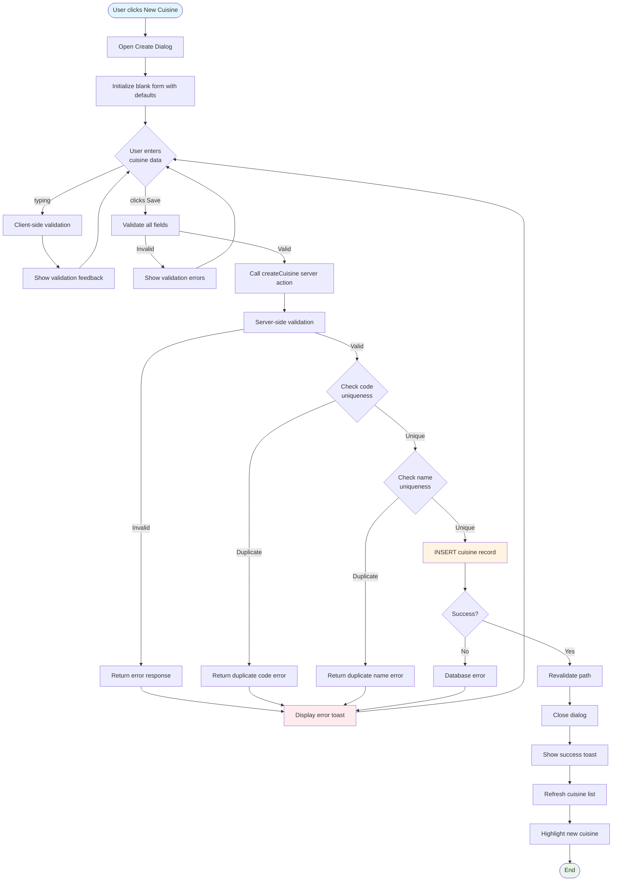
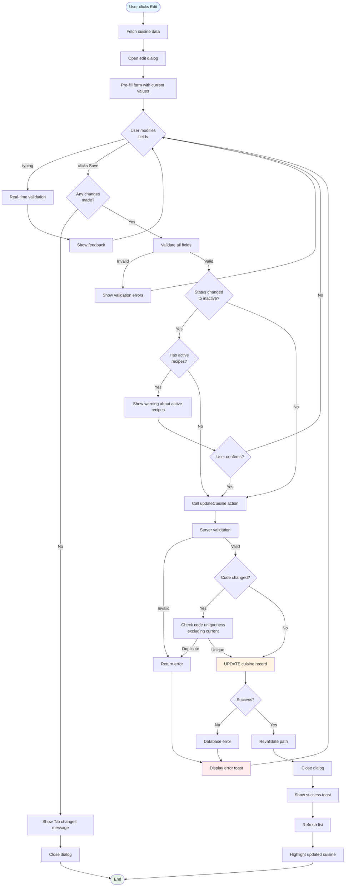
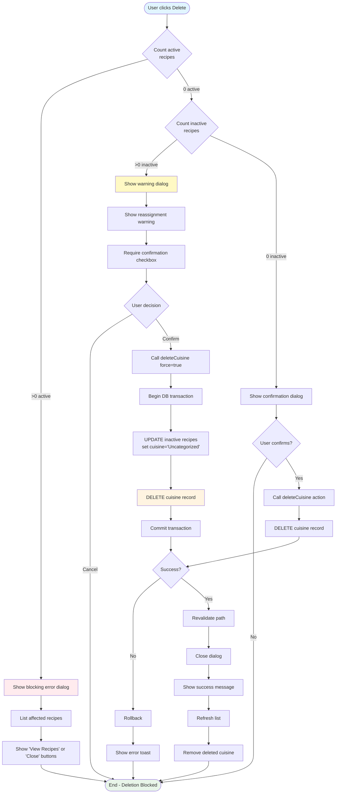
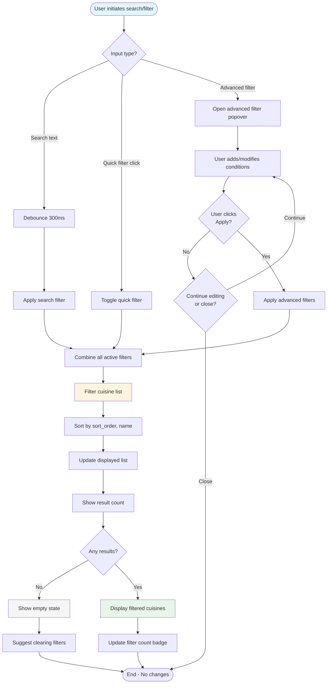
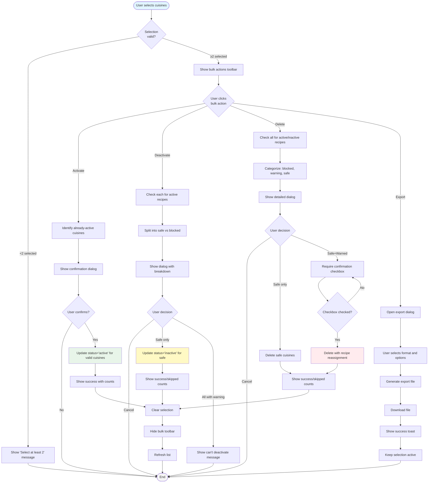
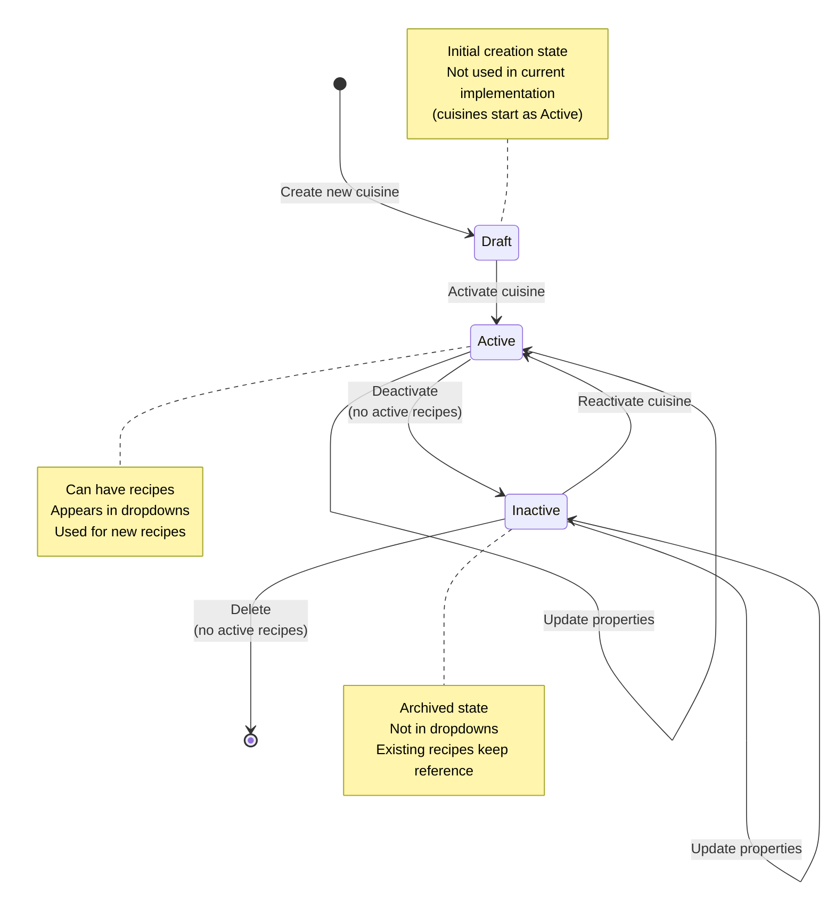
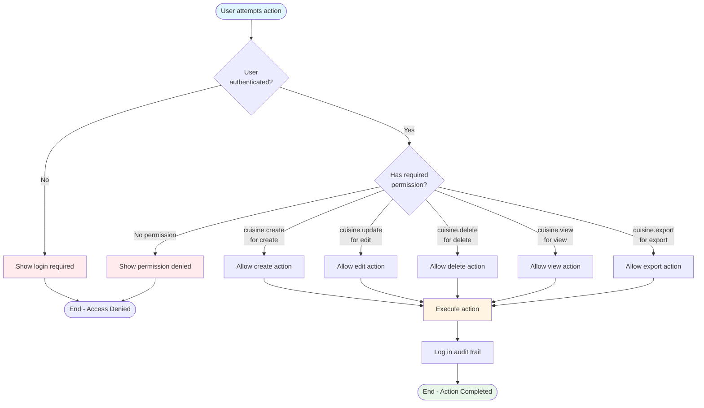
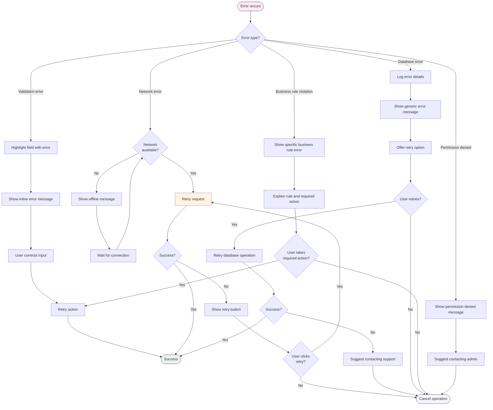

# Recipe Cuisine Types - Flow Diagrams (FD)

## Document Information
- **Document Type**: Flow Diagrams Document
- **Module**: Operational Planning > Recipe Management > Cuisine Types
- **Version**: 1.0
- **Last Updated**: 2024-01-15

## Document History

| Version | Date | Author | Changes |
|---------|------|--------|---------|
| 1.1.0 | 2025-12-10 | Documentation Team | Standardized reference number format (XXX-YYMM-NNNN) |
| 1.0 | 2024-01-15 | System | Initial flow diagrams document created |

---

## 1. Create Cuisine Workflow

---

## 2. Edit Cuisine Workflow

---

## 3. Delete Cuisine Workflow

---

## 4. Search and Filter Workflow

---

## 5. Bulk Operations Workflow

---

## 6. Cuisine Status Lifecycle

---

## 7. Permission-Based Action Flow

---

## 8. Error Recovery Flow

---
