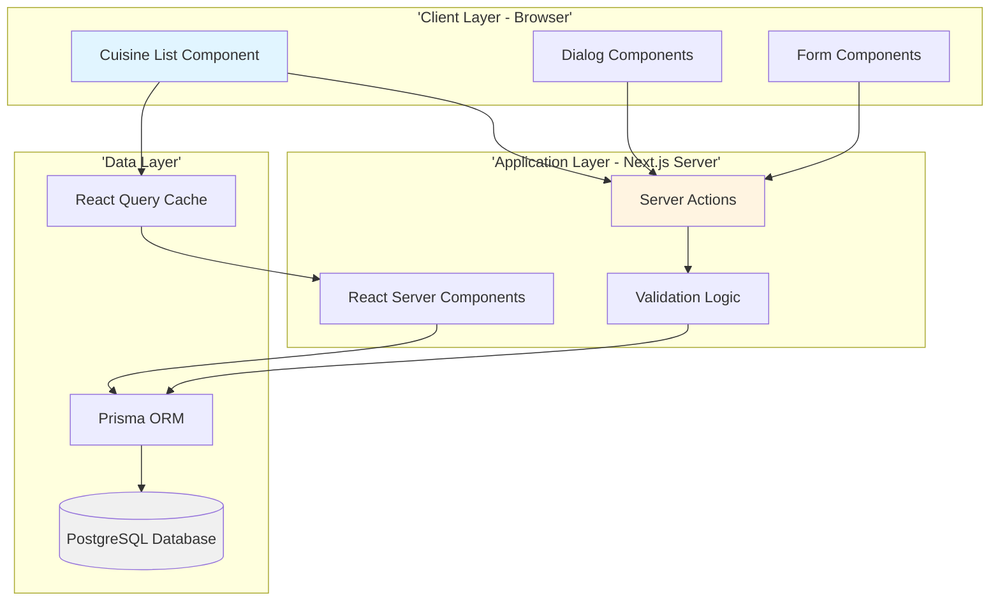
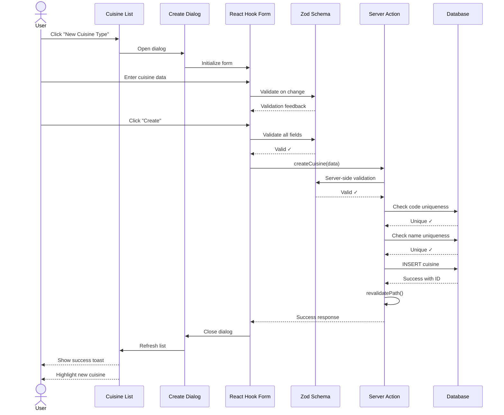
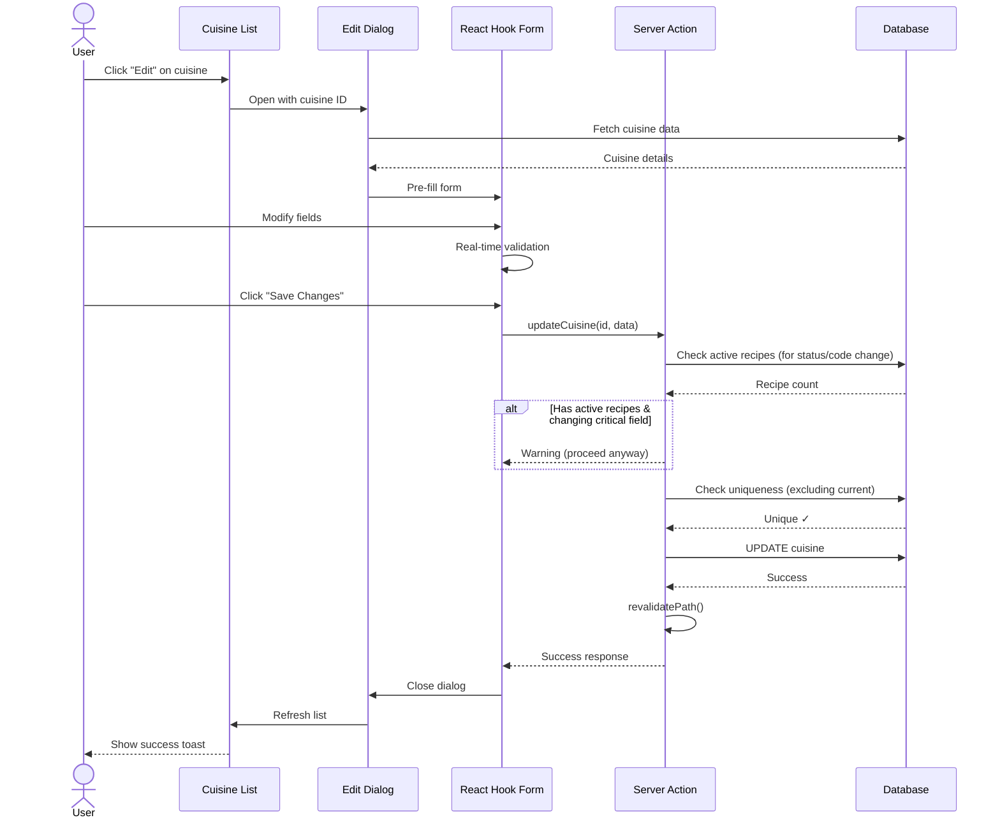
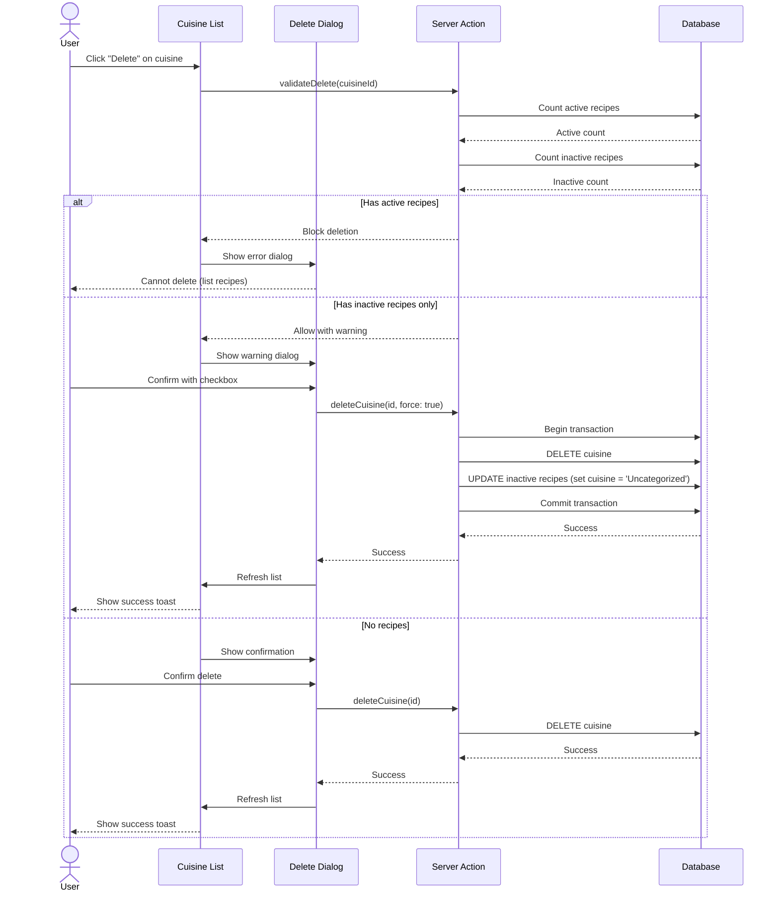
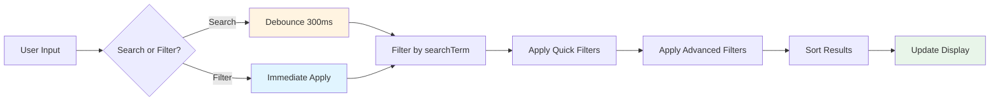

# Recipe Cuisine Types - Technical Specification (TS)

## Document Information
- **Document Type**: Technical Specification
- **Module**: Operational Planning > Recipe Management > Cuisine Types
- **Version**: 1.0
- **Last Updated**: 2024-01-15
- **Related Documents**:
  - [BR-cuisine-types.md](./BR-cuisine-types.md) - Business Requirements
  - [UC-cuisine-types.md](./UC-cuisine-types.md) - Use Cases

## Document History

| Version | Date | Author | Changes |
|---------|------|--------|---------|
| 1.1.0 | 2025-12-10 | Documentation Team | Standardized reference number format (XXX-YYMM-NNNN) |
| 1.0 | 2024-01-15 | System | Initial technical specification created |

---

## 1. System Architecture

### 1.1 Overview
The Cuisine Types system follows Next.js 14 App Router architecture with Server Components, client-side interactivity, and server actions for data mutations.

### 1.2 Architecture Diagram



### 1.3 Technology Stack

**Frontend**:
- Next.js 14.2+ (App Router)
- React 18+ (Server Components + Client Components)
- TypeScript 5.8+ (strict mode)
- Tailwind CSS 3.4+
- Shadcn/ui components (Radix UI primitives)
- Lucide React icons
- React Hook Form 7.48+
- Zod 3.22+ (validation)

**State Management**:
- React useState (local component state)
- React Query 5+ (server state, caching)
- Zustand 4.4+ (global UI state)

**Backend**:
- Next.js Server Actions
- Prisma ORM 5.8+
- PostgreSQL 14+

---

## 2. Component Structure

### 2.1 Component Hierarchy

```
app/(main)/operational-planning/recipe-management/cuisine-types/
├── page.tsx (Server Component)
│   └── Suspense
│       ├── CuisineList (Client Component)
│       └── CuisineListSkeleton (Loading State)
│
└── components/
    ├── cuisine-list.tsx (Main Client Component)
    │   ├── SearchInput
    │   ├── QuickFilters
    │   ├── AdvancedFilterPopover
    │   ├── BulkActionsToolbar
    │   ├── CuisineTable
    │   ├── CuisineGrid
    │   ├── CreateCuisineDialog
    │   ├── EditCuisineDialog
    │   ├── DeleteCuisineDialog
    │   └── ViewCuisineDialog
    └── ... (other components)

data/
└── mock-cuisines.ts (Mock Data - temporary)

actions/
└── cuisine-actions.ts (Server Actions)

lib/
├── types/recipe.ts (TypeScript Types)
└── validations/cuisine.ts (Zod Schemas)
```

### 2.2 Component Responsibilities

**page.tsx** (Server Component):
- Render layout structure
- Provide Suspense boundary
- Handle initial data loading (future)
- SEO metadata

**CuisineList** (Client Component):
- State management (search, filters, selections)
- User interactions
- Dialog management
- Real-time filtering and sorting
- View mode toggle (list/grid)

**CuisineTable** (Presentational):
- Render table layout
- Handle row interactions
- Display data in structured format

**CuisineGrid** (Presentational):
- Render card-based grid
- Responsive layout
- Card interactions

**CreateCuisineDialog** (Form Component):
- Form state management
- Validation
- Submission handling
- Error display

**EditCuisineDialog** (Form Component):
- Pre-fill with existing data
- Form state management
- Validation
- Update submission

**DeleteCuisineDialog** (Confirmation):
- Safety checks display
- Confirmation handling
- Warning messages

**ViewCuisineDialog** (Display):
- Read-only cuisine details
- Related recipes list
- Actions (Edit, Delete)

---

## 3. Page Structure

### 3.1 Server Component (page.tsx)

```typescript
// app/(main)/operational-planning/recipe-management/cuisine-types/page.tsx
import { Suspense } from "react"
import { CuisineList } from "./components/cuisine-list"
import { CuisineListSkeleton } from "./components/cuisine-list-skeleton"

export const metadata = {
  title: "Recipe Cuisine Types | Carmen ERP",
  description: "Manage recipe cuisine types and classifications"
}

export default function CuisineTypesPage() {
  return (
    <div className="h-full flex flex-col gap-4 p-4 md:p-6">
      <Suspense fallback={<CuisineListSkeleton />}>
        <CuisineList />
      </Suspense>
    </div>
  )
}
```

### 3.2 Client Component Structure

```typescript
// app/(main)/operational-planning/recipe-management/cuisine-types/components/cuisine-list.tsx
"use client"

import { useState, useMemo } from "react"
import { RecipeCuisine, mockCuisines } from "../data/mock-cuisines"

interface FilterState {
  searchTerm: string
  quickFilters: string[]
  advancedFilters: FilterCondition[]
}

export function CuisineList() {
  // State
  const [cuisines] = useState<RecipeCuisine[]>(mockCuisines)
  const [searchTerm, setSearchTerm] = useState("")
  const [quickFilters, setQuickFilters] = useState<string[]>([])
  const [filterConditions, setFilterConditions] = useState<FilterCondition[]>([])
  const [selectedCuisines, setSelectedCuisines] = useState<string[]>([])
  const [viewMode, setViewMode] = useState<'list' | 'grid'>('list')
  const [dialogs, setDialogs] = useState({
    create: false,
    edit: false,
    delete: false,
    view: false
  })

  // Filtered and sorted data
  const filteredCuisines = useMemo(() => {
    return cuisines
      .filter(cuisine => matchesSearch(cuisine, searchTerm))
      .filter(cuisine => matchesQuickFilters(cuisine, quickFilters))
      .filter(cuisine => matchesAdvancedFilters(cuisine, filterConditions))
      .sort((a, b) => a.sortOrder - b.sortOrder || a.name.localeCompare(b.name))
  }, [cuisines, searchTerm, quickFilters, filterConditions])

  // Render
  return (
    <div className="space-y-6">
      {/* Header */}
      <CuisineHeader onCreateClick={() => setDialogs(d => ({ ...d, create: true }))} />

      {/* Search and Filters */}
      <CuisineFilters
        searchTerm={searchTerm}
        onSearchChange={setSearchTerm}
        quickFilters={quickFilters}
        onQuickFilterToggle={handleQuickFilterToggle}
        filterConditions={filterConditions}
        onFilterConditionsChange={setFilterConditions}
        viewMode={viewMode}
        onViewModeChange={setViewMode}
      />

      {/* Bulk Actions */}
      {selectedCuisines.length > 0 && (
        <BulkActionsToolbar
          selectedCount={selectedCuisines.length}
          onClearSelection={() => setSelectedCuisines([])}
          onBulkAction={handleBulkAction}
        />
      )}

      {/* List or Grid View */}
      {viewMode === 'list' ? (
        <CuisineTable
          cuisines={filteredCuisines}
          selectedCuisines={selectedCuisines}
          onSelectionChange={handleSelectionChange}
          onEdit={handleEdit}
          onDelete={handleDelete}
          onView={handleView}
        />
      ) : (
        <CuisineGrid
          cuisines={filteredCuisines}
          selectedCuisines={selectedCuisines}
          onSelectionChange={handleSelectionChange}
          onEdit={handleEdit}
          onDelete={handleDelete}
        />
      )}

      {/* Dialogs */}
      <CreateCuisineDialog
        open={dialogs.create}
        onClose={() => setDialogs(d => ({ ...d, create: false }))}
        onSuccess={handleCreateSuccess}
      />

      <EditCuisineDialog
        open={dialogs.edit}
        cuisine={selectedCuisine}
        onClose={() => setDialogs(d => ({ ...d, edit: false }))}
        onSuccess={handleEditSuccess}
      />

      <DeleteCuisineDialog
        open={dialogs.delete}
        cuisine={selectedCuisine}
        onClose={() => setDialogs(d => ({ ...d, delete: false }))}
        onSuccess={handleDeleteSuccess}
      />

      <ViewCuisineDialog
        open={dialogs.view}
        cuisine={selectedCuisine}
        onClose={() => setDialogs(d => ({ ...d, view: false }))}
        onEdit={handleEdit}
        onDelete={handleDelete}
      />
    </div>
  )
}
```

---

## 4. Data Flow

### 4.1 Create Cuisine Flow



### 4.2 Edit Cuisine Flow



### 4.3 Delete Cuisine Flow



### 4.4 Filter & Search Flow



---

## 5. State Management

### 5.1 Local State (useState)

**Search & Filter State**:
```typescript
const [searchTerm, setSearchTerm] = useState<string>("")
const [quickFilters, setQuickFilters] = useState<string[]>([])
const [filterConditions, setFilterConditions] = useState<FilterCondition[]>([])
```

**Selection State**:
```typescript
const [selectedCuisines, setSelectedCuisines] = useState<string[]>([])
```

**View State**:
```typescript
const [viewMode, setViewMode] = useState<'list' | 'grid'>('list')
```

**Dialog State**:
```typescript
const [dialogs, setDialogs] = useState({
  create: false,
  edit: false,
  delete: false,
  view: false
})
const [selectedCuisine, setSelectedCuisine] = useState<RecipeCuisine | null>(null)
```

**Loading & Error State**:
```typescript
const [isLoading, setIsLoading] = useState<boolean>(false)
const [error, setError] = useState<string | null>(null)
```

### 5.2 Server State (React Query) - Future Implementation

```typescript
import { useQuery, useMutation, useQueryClient } from '@tanstack/react-query'

// Fetch cuisines
const { data: cuisines, isLoading, error } = useQuery({
  queryKey: ['cuisines'],
  queryFn: async () => {
    const response = await fetch('/api/cuisines')
    return response.json()
  },
  staleTime: 5 * 60 * 1000, // 5 minutes
})

// Create cuisine mutation
const createMutation = useMutation({
  mutationFn: async (data: CreateCuisineInput) => {
    return await createCuisine(data)
  },
  onSuccess: () => {
    queryClient.invalidateQueries({ queryKey: ['cuisines'] })
    toast.success('Cuisine created successfully')
  },
  onError: (error) => {
    toast.error(error.message)
  }
})
```

### 5.3 Global UI State (Zustand) - If Needed

```typescript
// store/ui-store.ts
import { create } from 'zustand'

interface UIState {
  sidebarCollapsed: boolean
  cuisineViewMode: 'list' | 'grid'
  cuisineFilters: FilterState

  setSidebarCollapsed: (collapsed: boolean) => void
  setCuisineViewMode: (mode: 'list' | 'grid') => void
  setCuisineFilters: (filters: FilterState) => void
}

export const useUIStore = create<UIState>((set) => ({
  sidebarCollapsed: false,
  cuisineViewMode: 'list',
  cuisineFilters: {},

  setSidebarCollapsed: (collapsed) => set({ sidebarCollapsed: collapsed }),
  setCuisineViewMode: (mode) => set({ cuisineViewMode: mode }),
  setCuisineFilters: (filters) => set({ cuisineFilters: filters }),
}))
```

---

## 6. Server Actions

### 6.1 Create Cuisine Action

```typescript
// app/actions/cuisine-actions.ts
'use server'

import { revalidatePath } from 'next/cache'
import { prisma } from '@/lib/prisma'
import { createCuisineSchema, type CreateCuisineInput } from '@/lib/validations/cuisine'
import { getServerSession } from '@/lib/auth'

export async function createCuisine(input: CreateCuisineInput) {
  try {
    // 1. Check authentication
    const session = await getServerSession()
    if (!session) {
      return { success: false, error: 'Unauthorized' }
    }

    // 2. Check permissions
    if (!session.user.permissions.includes('cuisine.create')) {
      return { success: false, error: 'Permission denied' }
    }

    // 3. Validate input
    const validated = createCuisineSchema.safeParse(input)
    if (!validated.success) {
      return {
        success: false,
        error: validated.error.errors[0]?.message || 'Invalid input'
      }
    }

    const data = validated.data

    // 4. Check code uniqueness
    const existingCode = await prisma.recipeCuisine.findUnique({
      where: { code: data.code },
      select: { id: true, name: true }
    })

    if (existingCode) {
      return {
        success: false,
        error: `Cuisine code "${data.code}" is already used by "${existingCode.name}"`
      }
    }

    // 5. Check name uniqueness (case-insensitive)
    const existingName = await prisma.recipeCuisine.findFirst({
      where: {
        name: {
          equals: data.name,
          mode: 'insensitive'
        }
      },
      select: { id: true, code: true }
    })

    if (existingName) {
      return {
        success: false,
        error: `Cuisine name "${data.name}" is already in use (code: ${existingName.code})`
      }
    }

    // 6. Create cuisine
    const cuisine = await prisma.recipeCuisine.create({
      data: {
        name: data.name,
        code: data.code,
        description: data.description,
        region: data.region,
        status: data.status || 'active',
        sortOrder: data.sortOrder || 0,
        popularDishes: data.popularDishes || [],
        keyIngredients: data.keyIngredients || [],
        recipeCount: 0,
        activeRecipeCount: 0,
        createdBy: session.user.id,
        updatedBy: session.user.id,
      }
    })

    // 7. Revalidate
    revalidatePath('/operational-planning/recipe-management/cuisine-types')

    return {
      success: true,
      data: cuisine
    }

  } catch (error) {
    console.error('Create cuisine error:', error)
    return {
      success: false,
      error: 'Failed to create cuisine. Please try again.'
    }
  }
}
```

### 6.2 Update Cuisine Action

```typescript
export async function updateCuisine(id: string, input: UpdateCuisineInput) {
  try {
    const session = await getServerSession()
    if (!session?.user.permissions.includes('cuisine.update')) {
      return { success: false, error: 'Permission denied' }
    }

    // Validate input
    const validated = updateCuisineSchema.safeParse({ id, ...input })
    if (!validated.success) {
      return { success: false, error: validated.error.errors[0]?.message }
    }

    // Check existence
    const existing = await prisma.recipeCuisine.findUnique({
      where: { id },
      include: {
        recipes: {
          where: { status: 'active' },
          select: { id: true }
        }
      }
    })

    if (!existing) {
      return { success: false, error: 'Cuisine not found' }
    }

    // Warn if changing code/status with active recipes
    if (existing.recipes.length > 0) {
      if (input.code && input.code !== existing.code) {
        // Log warning but allow
        console.warn(`Changing code for cuisine with ${existing.recipes.length} active recipes`)
      }
      if (input.status === 'inactive' && existing.status === 'active') {
        // Log warning but allow
        console.warn(`Deactivating cuisine with ${existing.recipes.length} active recipes`)
      }
    }

    // Check uniqueness (excluding current cuisine)
    if (input.code && input.code !== existing.code) {
      const codeExists = await prisma.recipeCuisine.findFirst({
        where: { code: input.code, id: { not: id } }
      })
      if (codeExists) {
        return { success: false, error: `Code "${input.code}" is already in use` }
      }
    }

    if (input.name && input.name.toLowerCase() !== existing.name.toLowerCase()) {
      const nameExists = await prisma.recipeCuisine.findFirst({
        where: {
          name: { equals: input.name, mode: 'insensitive' },
          id: { not: id }
        }
      })
      if (nameExists) {
        return { success: false, error: `Name "${input.name}" is already in use` }
      }
    }

    // Update cuisine
    const updated = await prisma.recipeCuisine.update({
      where: { id },
      data: {
        ...input,
        updatedBy: session.user.id,
        lastUpdated: new Date()
      }
    })

    revalidatePath('/operational-planning/recipe-management/cuisine-types')

    return { success: true, data: updated }

  } catch (error) {
    console.error('Update cuisine error:', error)
    return { success: false, error: 'Failed to update cuisine' }
  }
}
```

### 6.3 Delete Cuisine Action

```typescript
export async function deleteCuisine(id: string, force = false) {
  try {
    const session = await getServerSession()
    if (!session?.user.permissions.includes('cuisine.delete')) {
      return { success: false, error: 'Permission denied' }
    }

    // Check existence and recipe associations
    const cuisine = await prisma.recipeCuisine.findUnique({
      where: { id },
      include: {
        recipes: {
          select: { id: true, recipeCode: true, status: true }
        }
      }
    })

    if (!cuisine) {
      return { success: false, error: 'Cuisine not found' }
    }

    // Check for active recipes (BLOCKING)
    const activeRecipes = cuisine.recipes.filter(r => r.status === 'active')
    if (activeRecipes.length > 0) {
      return {
        success: false,
        error: `Cannot delete cuisine with ${activeRecipes.length} active recipe(s). Please reassign or deactivate recipes first.`,
        blocked: true
      }
    }

    // Check for inactive recipes (WARNING)
    const inactiveRecipes = cuisine.recipes.filter(r => r.status === 'inactive')
    if (inactiveRecipes.length > 0 && !force) {
      return {
        success: false,
        error: `This cuisine has ${inactiveRecipes.length} inactive recipe(s) that will be reassigned. Set force=true to proceed.`,
        requiresForce: true,
        inactiveCount: inactiveRecipes.length
      }
    }

    // Delete cuisine (with transaction if reassigning recipes)
    if (inactiveRecipes.length > 0) {
      await prisma.$transaction([
        // Reassign inactive recipes to "Uncategorized"
        prisma.recipe.updateMany({
          where: { cuisineId: id, status: 'inactive' },
          data: { cuisineId: 'uncategorized' } // Assumes "Uncategorized" cuisine exists
        }),
        // Delete cuisine
        prisma.recipeCuisine.delete({
          where: { id }
        })
      ])
    } else {
      await prisma.recipeCuisine.delete({
        where: { id }
      })
    }

    revalidatePath('/operational-planning/recipe-management/cuisine-types')

    return {
      success: true,
      message: inactiveRecipes.length > 0
        ? `Cuisine deleted. ${inactiveRecipes.length} inactive recipes reassigned.`
        : 'Cuisine deleted successfully'
    }

  } catch (error) {
    console.error('Delete cuisine error:', error)
    return { success: false, error: 'Failed to delete cuisine' }
  }
}
```

### 6.4 Get Cuisines Action (Query)

```typescript
export async function getCuisines(filters?: CuisineFilterCriteria) {
  try {
    const session = await getServerSession()
    if (!session?.user.permissions.includes('cuisine.view')) {
      return { success: false, error: 'Permission denied' }
    }

    const where: any = {}

    // Apply filters
    if (filters?.searchTerm) {
      where.OR = [
        { name: { contains: filters.searchTerm, mode: 'insensitive' } },
        { code: { contains: filters.searchTerm, mode: 'insensitive' } }
      ]
    }

    if (filters?.regions && filters.regions.length > 0) {
      where.region = { in: filters.regions }
    }

    if (filters?.status && filters.status.length > 0) {
      where.status = { in: filters.status }
    }

    if (filters?.hasRecipes !== undefined) {
      where.recipeCount = filters.hasRecipes ? { gt: 0 } : 0
    }

    if (filters?.minRecipes !== undefined) {
      where.recipeCount = { ...where.recipeCount, gte: filters.minRecipes }
    }

    if (filters?.maxRecipes !== undefined) {
      where.recipeCount = { ...where.recipeCount, lte: filters.maxRecipes }
    }

    // Fetch cuisines
    const cuisines = await prisma.recipeCuisine.findMany({
      where,
      orderBy: [
        { sortOrder: 'asc' },
        { name: 'asc' }
      ]
    })

    return { success: true, data: cuisines }

  } catch (error) {
    console.error('Get cuisines error:', error)
    return { success: false, error: 'Failed to fetch cuisines' }
  }
}
```

---

## 7. Form Components

### 7.1 Create/Edit Form with React Hook Form

```typescript
import { useForm } from 'react-hook-form'
import { zodResolver } from '@hookform/resolvers/zod'
import { createCuisineSchema, type CreateCuisineInput } from '@/lib/validations/cuisine'

interface CuisineFormProps {
  initialData?: RecipeCuisine
  onSubmit: (data: CreateCuisineInput) => Promise<void>
  onCancel: () => void
}

export function CuisineForm({ initialData, onSubmit, onCancel }: CuisineFormProps) {
  const form = useForm<CreateCuisineInput>({
    resolver: zodResolver(createCuisineSchema),
    defaultValues: initialData || {
      name: '',
      code: '',
      description: '',
      region: 'Asia',
      status: 'active',
      sortOrder: 0,
      popularDishes: [],
      keyIngredients: []
    },
    mode: 'onChange' // Real-time validation
  })

  const [isSubmitting, setIsSubmitting] = useState(false)

  const handleSubmit = async (data: CreateCuisineInput) => {
    setIsSubmitting(true)
    try {
      await onSubmit(data)
    } finally {
      setIsSubmitting(false)
    }
  }

  return (
    <Form {...form}>
      <form onSubmit={form.handleSubmit(handleSubmit)} className="space-y-6">
        {/* Name Field */}
        <FormField
          control={form.control}
          name="name"
          render={({ field }) => (
            <FormItem>
              <FormLabel>Name</FormLabel>
              <FormControl>
                <Input {...field} placeholder="e.g., Italian" />
              </FormControl>
              <FormMessage />
            </FormItem>
          )}
        />

        {/* Code Field */}
        <FormField
          control={form.control}
          name="code"
          render={({ field }) => (
            <FormItem>
              <FormLabel>Code</FormLabel>
              <FormControl>
                <Input
                  {...field}
                  placeholder="e.g., ITA"
                  onChange={(e) => field.onChange(e.target.value.toUpperCase())}
                />
              </FormControl>
              <FormDescription>
                Unique uppercase code (letters, numbers, hyphens, underscores)
              </FormDescription>
              <FormMessage />
            </FormItem>
          )}
        />

        {/* Description Field */}
        <FormField
          control={form.control}
          name="description"
          render={({ field }) => (
            <FormItem>
              <FormLabel>Description</FormLabel>
              <FormControl>
                <Textarea {...field} rows={3} />
              </FormControl>
              <FormDescription>
                Minimum 10 characters
              </FormDescription>
              <FormMessage />
            </FormItem>
          )}
        />

        {/* Region Field */}
        <FormField
          control={form.control}
          name="region"
          render={({ field }) => (
            <FormItem>
              <FormLabel>Region</FormLabel>
              <Select onValueChange={field.onChange} defaultValue={field.value}>
                <FormControl>
                  <SelectTrigger>
                    <SelectValue placeholder="Select region" />
                  </SelectTrigger>
                </FormControl>
                <SelectContent>
                  <SelectItem value="Asia">Asia</SelectItem>
                  <SelectItem value="Europe">Europe</SelectItem>
                  <SelectItem value="Americas">Americas</SelectItem>
                  <SelectItem value="Africa">Africa</SelectItem>
                  <SelectItem value="Middle East">Middle East</SelectItem>
                  <SelectItem value="Oceania">Oceania</SelectItem>
                </SelectContent>
              </Select>
              <FormMessage />
            </FormItem>
          )}
        />

        {/* Status Field */}
        <FormField
          control={form.control}
          name="status"
          render={({ field }) => (
            <FormItem>
              <FormLabel>Status</FormLabel>
              <Select onValueChange={field.onChange} defaultValue={field.value}>
                <FormControl>
                  <SelectTrigger>
                    <SelectValue />
                  </SelectTrigger>
                </FormControl>
                <SelectContent>
                  <SelectItem value="active">Active</SelectItem>
                  <SelectItem value="inactive">Inactive</SelectItem>
                </SelectContent>
              </Select>
              <FormMessage />
            </FormItem>
          )}
        />

        {/* Popular Dishes Field */}
        <FormField
          control={form.control}
          name="popularDishes"
          render={({ field }) => (
            <FormItem>
              <FormLabel>Popular Dishes</FormLabel>
              <FormControl>
                <Input
                  value={field.value?.join(', ') || ''}
                  onChange={(e) => {
                    const dishes = e.target.value
                      .split(',')
                      .map(d => d.trim())
                      .filter(d => d.length > 0)
                    field.onChange(dishes)
                  }}
                  placeholder="e.g., Pizza, Pasta, Risotto"
                />
              </FormControl>
              <FormDescription>
                Comma-separated list (maximum 20)
              </FormDescription>
              <FormMessage />
            </FormItem>
          )}
        />

        {/* Key Ingredients Field */}
        <FormField
          control={form.control}
          name="keyIngredients"
          render={({ field }) => (
            <FormItem>
              <FormLabel>Key Ingredients</FormLabel>
              <FormControl>
                <Input
                  value={field.value?.join(', ') || ''}
                  onChange={(e) => {
                    const ingredients = e.target.value
                      .split(',')
                      .map(i => i.trim())
                      .filter(i => i.length > 0)
                    field.onChange(ingredients)
                  }}
                  placeholder="e.g., Olive Oil, Tomatoes, Basil"
                />
              </FormControl>
              <FormDescription>
                Comma-separated list (maximum 30)
              </FormDescription>
              <FormMessage />
            </FormItem>
          )}
        />

        {/* Actions */}
        <DialogFooter>
          <Button type="button" variant="outline" onClick={onCancel}>
            Cancel
          </Button>
          <Button type="submit" disabled={isSubmitting}>
            {isSubmitting ? 'Saving...' : initialData ? 'Save Changes' : 'Create Cuisine'}
          </Button>
        </DialogFooter>
      </form>
    </Form>
  )
}
```

---

## 8. Integration Points

### 8.1 Recipe Management System
**Integration**: Bidirectional

**Data Flow**:
- Cuisines available for recipe assignment
- Recipe changes trigger cuisine metric updates

**API Calls**:
```typescript
// Get cuisines for recipe form
const { data: cuisines } = useQuery(['cuisines'], getCuisines)

// Update cuisine metrics when recipe status changes
await updateCuisineMetrics(cuisineId)
```

### 8.2 Menu Engineering System
**Integration**: One-way (Cuisine → Menu)

**Data Flow**:
- Cuisine types used for menu analysis
- Regional information aids menu planning

---

## 9. Performance Optimization

### 9.1 Memoization

```typescript
const filteredCuisines = useMemo(() => {
  return cuisines
    .filter(matchesSearch)
    .filter(matchesFilters)
    .sort(sortFunction)
}, [cuisines, searchTerm, filters])
```

### 9.2 Debouncing

```typescript
import { useDebouncedCallback } from 'use-debounce'

const debouncedSearch = useDebouncedCallback(
  (value: string) => setSearchTerm(value),
  300
)
```

### 9.3 Code Splitting

```typescript
const ExportDialog = dynamic(() => import('./export-dialog'), {
  loading: () => <Skeleton className="h-96" />
})
```

---

## Sitemap

### Overview
This section provides a complete navigation structure of all pages, tabs, and dialogues in the Cuisine Types sub-module.

### Page Hierarchy

```mermaid
graph TD
    ListPage['List Page<br>(/operational-planning/recipe-management/cuisine-types)']
    CreatePage['Create Page<br>(/operational-planning/recipe-management/cuisine-types/new)']
    DetailPage["Detail Page<br>(/operational-planning/recipe-management/cuisine-types/[id])"]
    EditPage["Edit Page<br>(/operational-planning/recipe-management/cuisine-types/[id]/edit)"]

    %% List Page Tabs
    ListPage --> ListTab1['Tab: All Items']
    ListPage --> ListTab2['Tab: Active']
    ListPage --> ListTab3['Tab: Archived']

    %% List Page Dialogues
    ListPage -.-> ListDialog1['Dialog: Quick Create']
    ListPage -.-> ListDialog2['Dialog: Bulk Actions']
    ListPage -.-> ListDialog3['Dialog: Export']
    ListPage -.-> ListDialog4['Dialog: Filter']

    %% Detail Page Tabs
    DetailPage --> DetailTab1['Tab: Overview']
    DetailPage --> DetailTab2['Tab: History']
    DetailPage --> DetailTab3['Tab: Activity Log']

    %% Detail Page Dialogues
    DetailPage -.-> DetailDialog1['Dialog: Edit']
    DetailPage -.-> DetailDialog2['Dialog: Delete Confirm']
    DetailPage -.-> DetailDialog3['Dialog: Status Change']

    %% Create/Edit Dialogues
    CreatePage -.-> CreateDialog1['Dialog: Cancel Confirm']
    CreatePage -.-> CreateDialog2['Dialog: Save Draft']

    EditPage -.-> EditDialog1['Dialog: Discard Changes']
    EditPage -.-> EditDialog2['Dialog: Save Draft']

    %% Navigation Flow
    ListPage --> DetailPage
    ListPage --> CreatePage
    DetailPage --> EditPage
    CreatePage --> DetailPage
    EditPage --> DetailPage

    style ListPage fill:#e1f5ff
    style CreatePage fill:#fff4e1
    style DetailPage fill:#e8f5e9
    style EditPage fill:#fce4ec
```

### Pages

#### 1. List Page
**Route**: `/operational-planning/recipe-management/cuisine-types`
**File**: `page.tsx`
**Purpose**: Display paginated list of all cuisine types

**Sections**:
- Header: Title, breadcrumbs, primary actions
- Filters: Quick filters, advanced filter panel
- Search: Global search with autocomplete
- Data Table: Sortable columns, row actions, bulk selection
- Pagination: Page size selector, page navigation

**Tabs**:
- **All Items**: Complete list of all cuisine types
- **Active**: Filter active items only
- **Archived**: View archived items

**Dialogues**:
- **Quick Create**: Fast creation form with essential fields only
- **Bulk Actions**: Multi-select actions (delete, export, status change)
- **Export**: Export data in various formats (CSV, Excel, PDF)
- **Filter**: Advanced filtering with multiple criteria

#### 2. Detail Page
**Route**: `/operational-planning/recipe-management/cuisine-types/[id]`
**File**: `[id]/page.tsx`
**Purpose**: Display comprehensive cuisine type details

**Sections**:
- Header: Breadcrumbs, cuisine type title, action buttons
- Info Cards: Multiple cards showing different aspects
- Related Data: Associated records and relationships

**Tabs**:
- **Overview**: Key information and summary
- **History**: Change history and audit trail
- **Activity Log**: User actions and system events

**Dialogues**:
- **Edit**: Navigate to edit form
- **Delete Confirm**: Confirmation before deletion
- **Status Change**: Change cuisine type status with reason

#### 3. Create Page
**Route**: `/operational-planning/recipe-management/cuisine-types/new`
**File**: `new/page.tsx`
**Purpose**: Create new cuisine type

**Sections**:
- Form Header: Title, Save/Cancel actions
- Form Fields: All required and optional fields
- Validation: Real-time field validation

**Dialogues**:
- **Cancel Confirm**: Confirm discarding unsaved changes
- **Save Draft**: Save incomplete form as draft

#### 4. Edit Page
**Route**: `/operational-planning/recipe-management/cuisine-types/[id]/edit`
**File**: `[id]/edit/page.tsx`
**Purpose**: Modify existing cuisine type

**Sections**:
- Form Header: Title, Save/Cancel/Delete actions
- Form Fields: Pre-populated with existing data
- Change Tracking: Highlight modified fields

**Dialogues**:
- **Discard Changes**: Confirm discarding modifications
- **Save Draft**: Save changes as draft


## 10. Security Considerations

- Server-side permission checks on all actions
- Input validation on client and server
- SQL injection prevention via Prisma ORM
- XSS prevention via React escaping
- CSRF protection via Next.js

---
