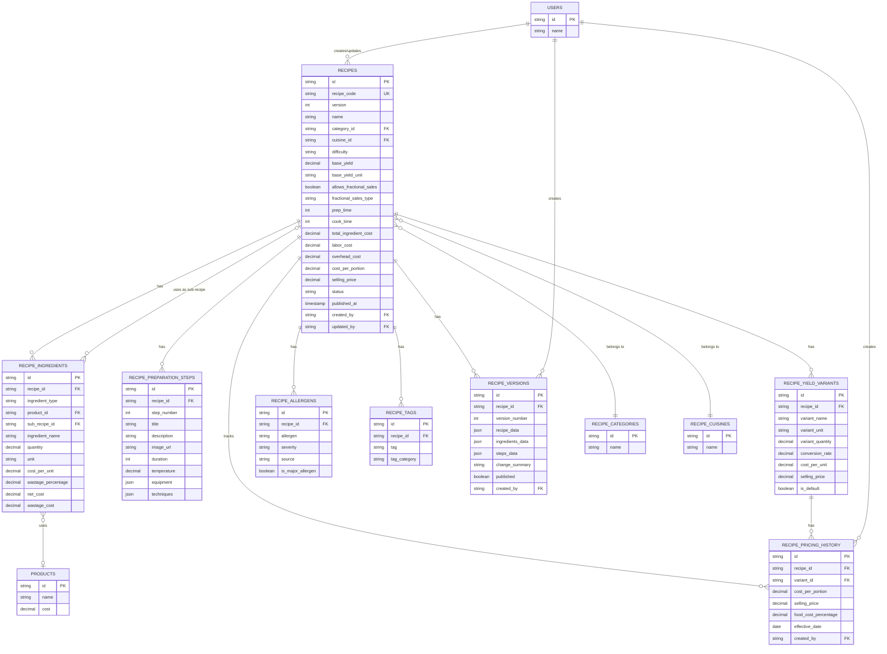

# Recipe Management - Data Definition (DS)

## Document Information
- **Document Type**: Data Schema Document
- **Module**: Operational Planning > Recipe Management > Recipes
- **Version**: 1.0
- **Last Updated**: 2024-01-15
- **Related Documents**:
  - [BR-recipes.md](./BR-recipes.md) - Business Requirements
  - [UC-recipes.md](./UC-recipes.md) - Use Cases
  - [TS-recipes.md](./TS-recipes.md) - Technical Specification

## Document History

| Version | Date | Author | Changes |
|---------|------|--------|---------|
| 1.0 | 2024-01-15 | System | Initial data schema document created for Recipe Management |

---

## 1. Database Schema
| 1.1.0 | 2025-11-15 | Documentation Team | Migrated from DS to DD format |

### 1.1 Main Recipe Table

```sql
CREATE TABLE recipes (
  -- Identity
  id VARCHAR(30) PRIMARY KEY,
  recipe_code VARCHAR(30) NOT NULL UNIQUE,
  version INTEGER NOT NULL DEFAULT 1,

  -- Basic Information
  name VARCHAR(200) NOT NULL,
  description TEXT NOT NULL,
  image_url VARCHAR(500),

  -- Classification
  category_id VARCHAR(30) NOT NULL,
  cuisine_id VARCHAR(30) NOT NULL,
  difficulty VARCHAR(20) NOT NULL DEFAULT 'medium',

  -- Yield Configuration
  base_yield DECIMAL(10, 3) NOT NULL DEFAULT 1,
  base_yield_unit VARCHAR(50) NOT NULL,
  allows_fractional_sales BOOLEAN NOT NULL DEFAULT false,
  fractional_sales_type VARCHAR(50),
  default_variant_id VARCHAR(30),

  -- Timing (minutes)
  prep_time INTEGER NOT NULL DEFAULT 0,
  cook_time INTEGER NOT NULL DEFAULT 0,
  total_time INTEGER GENERATED ALWAYS AS (prep_time + cook_time) STORED,

  -- Cost Analysis (calculated)
  total_ingredient_cost DECIMAL(12, 2) NOT NULL DEFAULT 0,
  labor_cost DECIMAL(12, 2) NOT NULL DEFAULT 0,
  overhead_cost DECIMAL(12, 2) NOT NULL DEFAULT 0,
  total_cost DECIMAL(12, 2) GENERATED ALWAYS AS (total_ingredient_cost + labor_cost + overhead_cost) STORED,
  cost_per_portion DECIMAL(12, 2) NOT NULL DEFAULT 0,

  -- Pricing
  suggested_price DECIMAL(12, 2),
  selling_price DECIMAL(12, 2),
  target_food_cost_percentage DECIMAL(5, 2) NOT NULL DEFAULT 33.00,
  actual_food_cost_percentage DECIMAL(5, 2),
  gross_margin DECIMAL(12, 2),
  gross_margin_percentage DECIMAL(5, 2),

  -- Cost Percentages (for calculation)
  labor_cost_percentage DECIMAL(5, 2) NOT NULL DEFAULT 30.00,
  overhead_percentage DECIMAL(5, 2) NOT NULL DEFAULT 20.00,

  -- Environmental
  carbon_footprint DECIMAL(10, 3) NOT NULL DEFAULT 0,

  -- Inventory
  deduct_from_stock BOOLEAN NOT NULL DEFAULT true,

  -- Status & Lifecycle
  status VARCHAR(20) NOT NULL DEFAULT 'draft',
  published_at TIMESTAMP,
  archived_at TIMESTAMP,

  -- Audit Trail
  created_at TIMESTAMP NOT NULL DEFAULT CURRENT_TIMESTAMP,
  created_by VARCHAR(30) NOT NULL,
  updated_at TIMESTAMP NOT NULL DEFAULT CURRENT_TIMESTAMP,
  updated_by VARCHAR(30) NOT NULL,
  deleted BOOLEAN NOT NULL DEFAULT false,

  -- Constraints
  CONSTRAINT chk_recipe_difficulty CHECK (difficulty IN ('easy', 'medium', 'hard')),
  CONSTRAINT chk_recipe_status CHECK (status IN ('draft', 'published', 'archived')),
  CONSTRAINT chk_fractional_sales_type CHECK (fractional_sales_type IN ('pizza-slice', 'cake-slice', 'bottle-glass', 'portion-control', 'custom') OR fractional_sales_type IS NULL),
  CONSTRAINT chk_base_yield CHECK (base_yield > 0),
  CONSTRAINT chk_prep_time CHECK (prep_time >= 0),
  CONSTRAINT chk_cook_time CHECK (cook_time >= 0),
  CONSTRAINT chk_costs CHECK (total_ingredient_cost >= 0 AND labor_cost >= 0 AND overhead_cost >= 0),
  CONSTRAINT chk_percentages CHECK (
    target_food_cost_percentage BETWEEN 0 AND 100
    AND labor_cost_percentage BETWEEN 0 AND 100
    AND overhead_percentage BETWEEN 0 AND 100
  ),
  CONSTRAINT chk_carbon_footprint CHECK (carbon_footprint >= 0),
  CONSTRAINT chk_version CHECK (version >= 1),

  -- Foreign Keys
  CONSTRAINT fk_recipe_category FOREIGN KEY (category_id) REFERENCES recipe_categories(id) ON DELETE RESTRICT,
  CONSTRAINT fk_recipe_cuisine FOREIGN KEY (cuisine_id) REFERENCES recipe_cuisines(id) ON DELETE RESTRICT,
  CONSTRAINT fk_recipe_creator FOREIGN KEY (created_by) REFERENCES users(id) ON DELETE RESTRICT,
  CONSTRAINT fk_recipe_updater FOREIGN KEY (updated_by) REFERENCES users(id) ON DELETE RESTRICT,
  CONSTRAINT fk_recipe_default_variant FOREIGN KEY (default_variant_id) REFERENCES recipe_yield_variants(id) ON DELETE SET NULL
);

-- Indexes
CREATE INDEX idx_recipes_status ON recipes(status) WHERE deleted = false;
CREATE INDEX idx_recipes_category ON recipes(category_id) WHERE deleted = false;
CREATE INDEX idx_recipes_cuisine ON recipes(cuisine_id) WHERE deleted = false;
CREATE INDEX idx_recipes_difficulty ON recipes(difficulty);
CREATE INDEX idx_recipes_created_by ON recipes(created_by);
CREATE INDEX idx_recipes_recipe_code ON recipes(recipe_code);
CREATE INDEX idx_recipes_deleted ON recipes(deleted);
CREATE INDEX idx_recipes_published_at ON recipes(published_at) WHERE status = 'published';

-- Full-text search index
CREATE INDEX idx_recipes_name_gin ON recipes USING gin(name gin_trgm_ops) WHERE deleted = false;
CREATE INDEX idx_recipes_description_gin ON recipes USING gin(description gin_trgm_ops) WHERE deleted = false;
```

### 1.2 Recipe Ingredients Table

```sql
CREATE TABLE recipe_ingredients (
  -- Identity
  id VARCHAR(30) PRIMARY KEY,
  recipe_id VARCHAR(30) NOT NULL,

  -- Ingredient Reference
  ingredient_type VARCHAR(20) NOT NULL, -- 'product' or 'recipe'
  product_id VARCHAR(30), -- If ingredient_type = 'product'
  sub_recipe_id VARCHAR(30), -- If ingredient_type = 'recipe'
  ingredient_name VARCHAR(200) NOT NULL,

  -- Quantity
  quantity DECIMAL(10, 3) NOT NULL,
  unit VARCHAR(50) NOT NULL,

  -- Inventory Tracking
  inventory_quantity DECIMAL(10, 3),
  inventory_unit VARCHAR(50),

  -- Costing
  cost_per_unit DECIMAL(12, 2) NOT NULL DEFAULT 0,
  wastage_percentage DECIMAL(5, 2) NOT NULL DEFAULT 0,
  net_cost DECIMAL(12, 2) NOT NULL DEFAULT 0,
  wastage_cost DECIMAL(12, 2) NOT NULL DEFAULT 0,
  total_cost DECIMAL(12, 2) GENERATED ALWAYS AS (net_cost + wastage_cost) STORED,

  -- Additional Info
  notes TEXT,
  order_index INTEGER NOT NULL DEFAULT 0,

  -- Audit
  created_at TIMESTAMP NOT NULL DEFAULT CURRENT_TIMESTAMP,
  updated_at TIMESTAMP NOT NULL DEFAULT CURRENT_TIMESTAMP,

  -- Constraints
  CONSTRAINT chk_ingredient_type CHECK (ingredient_type IN ('product', 'recipe')),
  CONSTRAINT chk_quantity CHECK (quantity > 0),
  CONSTRAINT chk_wastage CHECK (wastage_percentage >= 0 AND wastage_percentage <= 100),
  CONSTRAINT chk_ingredient_costs CHECK (cost_per_unit >= 0 AND net_cost >= 0 AND wastage_cost >= 0),
  CONSTRAINT chk_product_or_recipe CHECK (
    (ingredient_type = 'product' AND product_id IS NOT NULL AND sub_recipe_id IS NULL) OR
    (ingredient_type = 'recipe' AND sub_recipe_id IS NOT NULL AND product_id IS NULL)
  ),

  -- Foreign Keys
  CONSTRAINT fk_ingredient_recipe FOREIGN KEY (recipe_id) REFERENCES recipes(id) ON DELETE CASCADE,
  CONSTRAINT fk_ingredient_product FOREIGN KEY (product_id) REFERENCES products(id) ON DELETE RESTRICT,
  CONSTRAINT fk_ingredient_sub_recipe FOREIGN KEY (sub_recipe_id) REFERENCES recipes(id) ON DELETE RESTRICT
);

-- Indexes
CREATE INDEX idx_recipe_ingredients_recipe ON recipe_ingredients(recipe_id);
CREATE INDEX idx_recipe_ingredients_product ON recipe_ingredients(product_id);
CREATE INDEX idx_recipe_ingredients_sub_recipe ON recipe_ingredients(sub_recipe_id);
CREATE INDEX idx_recipe_ingredients_type ON recipe_ingredients(ingredient_type);
CREATE INDEX idx_recipe_ingredients_order ON recipe_ingredients(recipe_id, order_index);
```

### 1.3 Recipe Preparation Steps Table

```sql
CREATE TABLE recipe_preparation_steps (
  -- Identity
  id VARCHAR(30) PRIMARY KEY,
  recipe_id VARCHAR(30) NOT NULL,

  -- Step Details
  step_number INTEGER NOT NULL,
  title VARCHAR(200),
  description TEXT NOT NULL,

  -- Media
  image_url VARCHAR(500),
  video_url VARCHAR(500),

  -- Timing & Conditions
  duration INTEGER, -- minutes
  temperature DECIMAL(5, 1), -- degrees (C or F based on settings)
  temperature_unit VARCHAR(10) DEFAULT 'C',

  -- Resources
  equipment JSONB NOT NULL DEFAULT '[]', -- Array of equipment names
  techniques JSONB NOT NULL DEFAULT '[]', -- Array of technique names

  -- Tips & Notes
  chef_notes TEXT,
  safety_warnings TEXT,

  -- Audit
  created_at TIMESTAMP NOT NULL DEFAULT CURRENT_TIMESTAMP,
  updated_at TIMESTAMP NOT NULL DEFAULT CURRENT_TIMESTAMP,

  -- Constraints
  CONSTRAINT chk_step_number CHECK (step_number > 0),
  CONSTRAINT chk_duration CHECK (duration IS NULL OR duration >= 0),
  CONSTRAINT chk_temperature CHECK (temperature IS NULL OR temperature BETWEEN -50 AND 500),
  CONSTRAINT chk_temperature_unit CHECK (temperature_unit IN ('C', 'F')),

  -- Foreign Keys
  CONSTRAINT fk_step_recipe FOREIGN KEY (recipe_id) REFERENCES recipes(id) ON DELETE CASCADE,

  -- Unique step number per recipe
  UNIQUE (recipe_id, step_number)
);

-- Indexes
CREATE INDEX idx_preparation_steps_recipe ON recipe_preparation_steps(recipe_id);
CREATE INDEX idx_preparation_steps_order ON recipe_preparation_steps(recipe_id, step_number);
```

### 1.4 Recipe Yield Variants Table

```sql
CREATE TABLE recipe_yield_variants (
  -- Identity
  id VARCHAR(30) PRIMARY KEY,
  recipe_id VARCHAR(30) NOT NULL,

  -- Variant Details
  variant_name VARCHAR(100) NOT NULL,
  variant_unit VARCHAR(50) NOT NULL,
  variant_quantity DECIMAL(10, 3) NOT NULL,
  conversion_rate DECIMAL(5, 4) NOT NULL, -- 0.0001 to 1.0000

  -- Pricing
  cost_per_unit DECIMAL(12, 2) NOT NULL,
  selling_price DECIMAL(12, 2),
  food_cost_percentage DECIMAL(5, 2),
  gross_margin DECIMAL(12, 2),

  -- Properties
  is_default BOOLEAN NOT NULL DEFAULT false,
  shelf_life INTEGER, -- hours
  wastage_rate DECIMAL(5, 2),

  -- Ordering Constraints
  min_order_quantity INTEGER,
  max_order_quantity INTEGER,

  -- Audit
  created_at TIMESTAMP NOT NULL DEFAULT CURRENT_TIMESTAMP,
  updated_at TIMESTAMP NOT NULL DEFAULT CURRENT_TIMESTAMP,

  -- Constraints
  CONSTRAINT chk_variant_quantity CHECK (variant_quantity > 0),
  CONSTRAINT chk_conversion_rate CHECK (conversion_rate > 0 AND conversion_rate <= 1),
  CONSTRAINT chk_variant_costs CHECK (cost_per_unit >= 0),
  CONSTRAINT chk_shelf_life CHECK (shelf_life IS NULL OR shelf_life > 0),
  CONSTRAINT chk_wastage_rate CHECK (wastage_rate IS NULL OR (wastage_rate >= 0 AND wastage_rate <= 100)),
  CONSTRAINT chk_order_quantities CHECK (
    (min_order_quantity IS NULL OR min_order_quantity > 0) AND
    (max_order_quantity IS NULL OR max_order_quantity > 0) AND
    (min_order_quantity IS NULL OR max_order_quantity IS NULL OR min_order_quantity <= max_order_quantity)
  ),

  -- Foreign Keys
  CONSTRAINT fk_variant_recipe FOREIGN KEY (recipe_id) REFERENCES recipes(id) ON DELETE CASCADE
);

-- Indexes
CREATE INDEX idx_yield_variants_recipe ON recipe_yield_variants(recipe_id);
CREATE INDEX idx_yield_variants_default ON recipe_yield_variants(recipe_id, is_default);

-- Ensure only one default variant per recipe
CREATE UNIQUE INDEX idx_yield_variants_unique_default ON recipe_yield_variants(recipe_id) WHERE is_default = true;
```

### 1.5 Recipe Allergens Table

```sql
CREATE TABLE recipe_allergens (
  -- Identity
  id VARCHAR(30) PRIMARY KEY,
  recipe_id VARCHAR(30) NOT NULL,
  allergen VARCHAR(100) NOT NULL,

  -- Severity & Source
  severity VARCHAR(20) DEFAULT 'present',
  source VARCHAR(200), -- Which ingredient contains this allergen

  -- FDA Major Allergens
  is_major_allergen BOOLEAN NOT NULL DEFAULT false,

  -- Cross-Contamination Risk
  cross_contamination_risk VARCHAR(20) DEFAULT 'low',

  -- Audit
  created_at TIMESTAMP NOT NULL DEFAULT CURRENT_TIMESTAMP,

  -- Constraints
  CONSTRAINT chk_allergen_severity CHECK (severity IN ('trace', 'may_contain', 'present', 'high')),
  CONSTRAINT chk_contamination_risk CHECK (cross_contamination_risk IN ('none', 'low', 'medium', 'high')),

  -- Foreign Keys
  CONSTRAINT fk_allergen_recipe FOREIGN KEY (recipe_id) REFERENCES recipes(id) ON DELETE CASCADE,

  -- Unique allergen per recipe
  UNIQUE (recipe_id, allergen)
);

-- Indexes
CREATE INDEX idx_recipe_allergens_recipe ON recipe_allergens(recipe_id);
CREATE INDEX idx_recipe_allergens_allergen ON recipe_allergens(allergen);
CREATE INDEX idx_recipe_allergens_major ON recipe_allergens(is_major_allergen);
```

### 1.6 Recipe Tags Table

```sql
CREATE TABLE recipe_tags (
  -- Identity
  id VARCHAR(30) PRIMARY KEY,
  recipe_id VARCHAR(30) NOT NULL,
  tag VARCHAR(100) NOT NULL,

  -- Tag Category
  tag_category VARCHAR(50), -- 'dietary', 'meal-type', 'season', 'cuisine-style', 'custom'

  -- Audit
  created_at TIMESTAMP NOT NULL DEFAULT CURRENT_TIMESTAMP,

  -- Constraints
  CONSTRAINT chk_tag_category CHECK (tag_category IN ('dietary', 'meal-type', 'season', 'cuisine-style', 'cooking-method', 'occasion', 'custom') OR tag_category IS NULL),

  -- Foreign Keys
  CONSTRAINT fk_tag_recipe FOREIGN KEY (recipe_id) REFERENCES recipes(id) ON DELETE CASCADE,

  -- Unique tag per recipe
  UNIQUE (recipe_id, tag)
);

-- Indexes
CREATE INDEX idx_recipe_tags_recipe ON recipe_tags(recipe_id);
CREATE INDEX idx_recipe_tags_tag ON recipe_tags(tag);
CREATE INDEX idx_recipe_tags_category ON recipe_tags(tag_category);
```

### 1.7 Recipe Versions Table

```sql
CREATE TABLE recipe_versions (
  -- Identity
  id VARCHAR(30) PRIMARY KEY,
  recipe_id VARCHAR(30) NOT NULL,
  version_number INTEGER NOT NULL,

  -- Version Data (JSONB snapshot of entire recipe)
  recipe_data JSONB NOT NULL,
  ingredients_data JSONB NOT NULL,
  steps_data JSONB NOT NULL,
  variants_data JSONB NOT NULL,

  -- Version Metadata
  change_summary TEXT,
  published BOOLEAN NOT NULL DEFAULT false,

  -- Audit
  created_at TIMESTAMP NOT NULL DEFAULT CURRENT_TIMESTAMP,
  created_by VARCHAR(30) NOT NULL,

  -- Foreign Keys
  CONSTRAINT fk_version_recipe FOREIGN KEY (recipe_id) REFERENCES recipes(id) ON DELETE CASCADE,
  CONSTRAINT fk_version_creator FOREIGN KEY (created_by) REFERENCES users(id) ON DELETE RESTRICT,

  -- Unique version number per recipe
  UNIQUE (recipe_id, version_number)
);

-- Indexes
CREATE INDEX idx_recipe_versions_recipe ON recipe_versions(recipe_id);
CREATE INDEX idx_recipe_versions_published ON recipe_versions(recipe_id, published);
CREATE INDEX idx_recipe_versions_number ON recipe_versions(recipe_id, version_number DESC);
```

### 1.8 Recipe Pricing History Table

```sql
CREATE TABLE recipe_pricing_history (
  -- Identity
  id VARCHAR(30) PRIMARY KEY,
  recipe_id VARCHAR(30) NOT NULL,
  variant_id VARCHAR(30),

  -- Pricing Snapshot
  cost_per_portion DECIMAL(12, 2) NOT NULL,
  selling_price DECIMAL(12, 2) NOT NULL,
  food_cost_percentage DECIMAL(5, 2) NOT NULL,
  gross_margin DECIMAL(12, 2) NOT NULL,

  -- Market Analysis
  competitor_avg_price DECIMAL(12, 2),
  competitor_min_price DECIMAL(12, 2),
  competitor_max_price DECIMAL(12, 2),

  -- Change Reason
  change_reason TEXT,
  effective_date DATE NOT NULL,

  -- Audit
  created_at TIMESTAMP NOT NULL DEFAULT CURRENT_TIMESTAMP,
  created_by VARCHAR(30) NOT NULL,

  -- Foreign Keys
  CONSTRAINT fk_pricing_recipe FOREIGN KEY (recipe_id) REFERENCES recipes(id) ON DELETE CASCADE,
  CONSTRAINT fk_pricing_variant FOREIGN KEY (variant_id) REFERENCES recipe_yield_variants(id) ON DELETE CASCADE,
  CONSTRAINT fk_pricing_creator FOREIGN KEY (created_by) REFERENCES users(id) ON DELETE RESTRICT
);

-- Indexes
CREATE INDEX idx_pricing_history_recipe ON recipe_pricing_history(recipe_id);
CREATE INDEX idx_pricing_history_variant ON recipe_pricing_history(variant_id);
CREATE INDEX idx_pricing_history_date ON recipe_pricing_history(effective_date DESC);
```

---

## 2. Prisma Schema

### 2.1 Main Recipe Model

```prisma
model Recipe {
  id              String   @id @default(cuid())
  recipeCode      String   @unique @map("recipe_code") @db.VarChar(30)
  version         Int      @default(1)

  // Basic Information
  name            String   @db.VarChar(200)
  description     String   @db.Text
  imageUrl        String?  @map("image_url") @db.VarChar(500)

  // Classification
  categoryId      String   @map("category_id")
  category        RecipeCategory @relation(fields: [categoryId], references: [id], onDelete: Restrict)

  cuisineId       String   @map("cuisine_id")
  cuisine         RecipeCuisine @relation(fields: [cuisineId], references: [id], onDelete: Restrict)

  difficulty      RecipeDifficulty @default(MEDIUM)

  // Yield Configuration
  baseYield                 Decimal  @map("base_yield") @db.Decimal(10, 3)
  baseYieldUnit             String   @map("base_yield_unit") @db.VarChar(50)
  allowsFractionalSales     Boolean  @default(false) @map("allows_fractional_sales")
  fractionalSalesType       FractionalSalesType? @map("fractional_sales_type")
  defaultVariantId          String?  @map("default_variant_id")

  // Timing
  prepTime        Int      @default(0) @map("prep_time")
  cookTime        Int      @default(0) @map("cook_time")

  // Cost Analysis
  totalIngredientCost       Decimal  @default(0) @map("total_ingredient_cost") @db.Decimal(12, 2)
  laborCost                 Decimal  @default(0) @map("labor_cost") @db.Decimal(12, 2)
  overheadCost              Decimal  @default(0) @map("overhead_cost") @db.Decimal(12, 2)
  costPerPortion            Decimal  @default(0) @map("cost_per_portion") @db.Decimal(12, 2)

  // Pricing
  suggestedPrice            Decimal? @map("suggested_price") @db.Decimal(12, 2)
  sellingPrice              Decimal? @map("selling_price") @db.Decimal(12, 2)
  targetFoodCostPercentage  Decimal  @default(33.00) @map("target_food_cost_percentage") @db.Decimal(5, 2)
  actualFoodCostPercentage  Decimal? @map("actual_food_cost_percentage") @db.Decimal(5, 2)
  grossMargin               Decimal? @map("gross_margin") @db.Decimal(12, 2)
  grossMarginPercentage     Decimal? @map("gross_margin_percentage") @db.Decimal(5, 2)

  // Cost Percentages
  laborCostPercentage       Decimal  @default(30.00) @map("labor_cost_percentage") @db.Decimal(5, 2)
  overheadPercentage        Decimal  @default(20.00) @map("overhead_percentage") @db.Decimal(5, 2)

  // Environmental
  carbonFootprint           Decimal  @default(0) @map("carbon_footprint") @db.Decimal(10, 3)

  // Inventory
  deductFromStock           Boolean  @default(true) @map("deduct_from_stock")

  // Status
  status          RecipeStatus @default(DRAFT)
  publishedAt     DateTime? @map("published_at")
  archivedAt      DateTime? @map("archived_at")

  // Relationships
  ingredients     RecipeIngredient[]
  steps           RecipePreparationStep[]
  yieldVariants   RecipeYieldVariant[]
  allergens       RecipeAllergen[]
  tags            RecipeTag[]
  versions        RecipeVersion[]
  pricingHistory  RecipePricingHistory[]

  // Recipes using this as sub-recipe
  usedInRecipes   RecipeIngredient[] @relation("SubRecipeIngredients")

  // Audit Trail
  createdAt       DateTime @default(now()) @map("created_at")
  createdBy       String   @map("created_by")
  creator         User     @relation("RecipeCreator", fields: [createdBy], references: [id], onDelete: Restrict)

  updatedAt       DateTime @updatedAt @map("updated_at")
  updatedBy       String   @map("updated_by")
  updater         User     @relation("RecipeUpdater", fields: [updatedBy], references: [id], onDelete: Restrict)

  deleted         Boolean  @default(false)

  @@map("recipes")
  @@index([status, deleted])
  @@index([categoryId])
  @@index([cuisineId])
  @@index([difficulty])
  @@index([createdBy])
  @@index([recipeCode])
  @@index([deleted])
  @@index([publishedAt])
}

enum RecipeDifficulty {
  EASY   @map("easy")
  MEDIUM @map("medium")
  HARD   @map("hard")
}

enum RecipeStatus {
  DRAFT     @map("draft")
  PUBLISHED @map("published")
  ARCHIVED  @map("archived")
}

enum FractionalSalesType {
  PIZZA_SLICE       @map("pizza-slice")
  CAKE_SLICE        @map("cake-slice")
  BOTTLE_GLASS      @map("bottle-glass")
  PORTION_CONTROL   @map("portion-control")
  CUSTOM            @map("custom")
}
```

### 2.2 Recipe Ingredient Model

```prisma
model RecipeIngredient {
  id              String   @id @default(cuid())
  recipeId        String   @map("recipe_id")
  recipe          Recipe   @relation(fields: [recipeId], references: [id], onDelete: Cascade)

  // Ingredient Reference
  ingredientType  IngredientType @map("ingredient_type")
  productId       String?  @map("product_id")
  product         Product? @relation(fields: [productId], references: [id], onDelete: Restrict)

  subRecipeId     String?  @map("sub_recipe_id")
  subRecipe       Recipe?  @relation("SubRecipeIngredients", fields: [subRecipeId], references: [id], onDelete: Restrict)

  ingredientName  String   @map("ingredient_name") @db.VarChar(200)

  // Quantity
  quantity        Decimal  @db.Decimal(10, 3)
  unit            String   @db.VarChar(50)

  // Inventory
  inventoryQuantity Decimal? @map("inventory_quantity") @db.Decimal(10, 3)
  inventoryUnit     String?  @map("inventory_unit") @db.VarChar(50)

  // Costing
  costPerUnit       Decimal  @default(0) @map("cost_per_unit") @db.Decimal(12, 2)
  wastagePercentage Decimal  @default(0) @map("wastage_percentage") @db.Decimal(5, 2)
  netCost           Decimal  @default(0) @map("net_cost") @db.Decimal(12, 2)
  wastageCost       Decimal  @default(0) @map("wastage_cost") @db.Decimal(12, 2)

  // Additional
  notes         String?  @db.Text
  orderIndex    Int      @default(0) @map("order_index")

  // Audit
  createdAt     DateTime @default(now()) @map("created_at")
  updatedAt     DateTime @updatedAt @map("updated_at")

  @@map("recipe_ingredients")
  @@index([recipeId])
  @@index([productId])
  @@index([subRecipeId])
  @@index([ingredientType])
  @@index([recipeId, orderIndex])
}

enum IngredientType {
  PRODUCT @map("product")
  RECIPE  @map("recipe")
}
```

### 2.3 Recipe Preparation Step Model

```prisma
model RecipePreparationStep {
  id              String   @id @default(cuid())
  recipeId        String   @map("recipe_id")
  recipe          Recipe   @relation(fields: [recipeId], references: [id], onDelete: Cascade)

  // Step Details
  stepNumber      Int      @map("step_number")
  title           String?  @db.VarChar(200)
  description     String   @db.Text

  // Media
  imageUrl        String?  @map("image_url") @db.VarChar(500)
  videoUrl        String?  @map("video_url") @db.VarChar(500)

  // Timing & Conditions
  duration        Int?     // minutes
  temperature     Decimal? @db.Decimal(5, 1)
  temperatureUnit String?  @default("C") @map("temperature_unit") @db.VarChar(10)

  // Resources
  equipment       Json     @default("[]")
  techniques      Json     @default("[]")

  // Tips & Notes
  chefNotes       String?  @map("chef_notes") @db.Text
  safetyWarnings  String?  @map("safety_warnings") @db.Text

  // Audit
  createdAt       DateTime @default(now()) @map("created_at")
  updatedAt       DateTime @updatedAt @map("updated_at")

  @@unique([recipeId, stepNumber])
  @@map("recipe_preparation_steps")
  @@index([recipeId])
  @@index([recipeId, stepNumber])
}
```

### 2.4 Recipe Yield Variant Model

```prisma
model RecipeYieldVariant {
  id              String   @id @default(cuid())
  recipeId        String   @map("recipe_id")
  recipe          Recipe   @relation(fields: [recipeId], references: [id], onDelete: Cascade)

  // Variant Details
  variantName     String   @map("variant_name") @db.VarChar(100)
  variantUnit     String   @map("variant_unit") @db.VarChar(50)
  variantQuantity Decimal  @map("variant_quantity") @db.Decimal(10, 3)
  conversionRate  Decimal  @map("conversion_rate") @db.Decimal(5, 4)

  // Pricing
  costPerUnit           Decimal  @map("cost_per_unit") @db.Decimal(12, 2)
  sellingPrice          Decimal? @map("selling_price") @db.Decimal(12, 2)
  foodCostPercentage    Decimal? @map("food_cost_percentage") @db.Decimal(5, 2)
  grossMargin           Decimal? @map("gross_margin") @db.Decimal(12, 2)

  // Properties
  isDefault       Boolean  @default(false) @map("is_default")
  shelfLife       Int?     @map("shelf_life") // hours
  wastageRate     Decimal? @map("wastage_rate") @db.Decimal(5, 2)

  // Ordering Constraints
  minOrderQuantity Int?   @map("min_order_quantity")
  maxOrderQuantity Int?   @map("max_order_quantity")

  // Relationships
  pricingHistory  RecipePricingHistory[]

  // Audit
  createdAt       DateTime @default(now()) @map("created_at")
  updatedAt       DateTime @updatedAt @map("updated_at")

  @@map("recipe_yield_variants")
  @@index([recipeId])
  @@index([recipeId, isDefault])
}
```

### 2.5 Recipe Allergen Model

```prisma
model RecipeAllergen {
  id              String   @id @default(cuid())
  recipeId        String   @map("recipe_id")
  recipe          Recipe   @relation(fields: [recipeId], references: [id], onDelete: Cascade)

  allergen        String   @db.VarChar(100)

  // Severity & Source
  severity        AllergenSeverity @default(PRESENT)
  source          String?  @db.VarChar(200)
  isMajorAllergen Boolean  @default(false) @map("is_major_allergen")

  // Cross-Contamination
  crossContaminationRisk ContaminationRisk @default(LOW) @map("cross_contamination_risk")

  // Audit
  createdAt       DateTime @default(now()) @map("created_at")

  @@unique([recipeId, allergen])
  @@map("recipe_allergens")
  @@index([recipeId])
  @@index([allergen])
  @@index([isMajorAllergen])
}

enum AllergenSeverity {
  TRACE       @map("trace")
  MAY_CONTAIN @map("may_contain")
  PRESENT     @map("present")
  HIGH        @map("high")
}

enum ContaminationRisk {
  NONE   @map("none")
  LOW    @map("low")
  MEDIUM @map("medium")
  HIGH   @map("high")
}
```

### 2.6 Recipe Tag Model

```prisma
model RecipeTag {
  id              String   @id @default(cuid())
  recipeId        String   @map("recipe_id")
  recipe          Recipe   @relation(fields: [recipeId], references: [id], onDelete: Cascade)

  tag             String   @db.VarChar(100)
  tagCategory     TagCategory? @map("tag_category")

  // Audit
  createdAt       DateTime @default(now()) @map("created_at")

  @@unique([recipeId, tag])
  @@map("recipe_tags")
  @@index([recipeId])
  @@index([tag])
  @@index([tagCategory])
}

enum TagCategory {
  DIETARY         @map("dietary")
  MEAL_TYPE       @map("meal-type")
  SEASON          @map("season")
  CUISINE_STYLE   @map("cuisine-style")
  COOKING_METHOD  @map("cooking-method")
  OCCASION        @map("occasion")
  CUSTOM          @map("custom")
}
```

### 2.7 Recipe Version Model

```prisma
model RecipeVersion {
  id              String   @id @default(cuid())
  recipeId        String   @map("recipe_id")
  recipe          Recipe   @relation(fields: [recipeId], references: [id], onDelete: Cascade)

  versionNumber   Int      @map("version_number")

  // Version Data
  recipeData      Json     @map("recipe_data")
  ingredientsData Json     @map("ingredients_data")
  stepsData       Json     @map("steps_data")
  variantsData    Json     @map("variants_data")

  // Metadata
  changeSummary   String?  @map("change_summary") @db.Text
  published       Boolean  @default(false)

  // Audit
  createdAt       DateTime @default(now()) @map("created_at")
  createdBy       String   @map("created_by")
  creator         User     @relation("VersionCreator", fields: [createdBy], references: [id], onDelete: Restrict)

  @@unique([recipeId, versionNumber])
  @@map("recipe_versions")
  @@index([recipeId])
  @@index([recipeId, published])
  @@index([recipeId, versionNumber])
}
```

### 2.8 Recipe Pricing History Model

```prisma
model RecipePricingHistory {
  id              String   @id @default(cuid())
  recipeId        String   @map("recipe_id")
  recipe          Recipe   @relation(fields: [recipeId], references: [id], onDelete: Cascade)

  variantId       String?  @map("variant_id")
  variant         RecipeYieldVariant? @relation(fields: [variantId], references: [id], onDelete: Cascade)

  // Pricing Snapshot
  costPerPortion        Decimal  @map("cost_per_portion") @db.Decimal(12, 2)
  sellingPrice          Decimal  @map("selling_price") @db.Decimal(12, 2)
  foodCostPercentage    Decimal  @map("food_cost_percentage") @db.Decimal(5, 2)
  grossMargin           Decimal  @map("gross_margin") @db.Decimal(12, 2)

  // Market Analysis
  competitorAvgPrice    Decimal? @map("competitor_avg_price") @db.Decimal(12, 2)
  competitorMinPrice    Decimal? @map("competitor_min_price") @db.Decimal(12, 2)
  competitorMaxPrice    Decimal? @map("competitor_max_price") @db.Decimal(12, 2)

  // Change Reason
  changeReason    String?  @map("change_reason") @db.Text
  effectiveDate   DateTime @map("effective_date") @db.Date

  // Audit
  createdAt       DateTime @default(now()) @map("created_at")
  createdBy       String   @map("created_by")
  creator         User     @relation("PricingCreator", fields: [createdBy], references: [id], onDelete: Restrict)

  @@map("recipe_pricing_history")
  @@index([recipeId])
  @@index([variantId])
  @@index([effectiveDate])
}
```

---

## 3. TypeScript Interfaces

### 3.1 Main Recipe Interface

```typescript
export interface Recipe {
  // Identity
  id: string
  recipeCode: string
  version: number

  // Basic Information
  name: string
  description: string
  imageUrl: string | null

  // Classification
  categoryId: string
  category?: RecipeCategory
  cuisineId: string
  cuisine?: RecipeCuisine
  difficulty: 'easy' | 'medium' | 'hard'

  // Yield Configuration
  baseYield: number
  baseYieldUnit: string
  allowsFractionalSales: boolean
  fractionalSalesType: FractionalSalesType | null
  defaultVariantId: string | null

  // Timing
  prepTime: number // minutes
  cookTime: number // minutes
  totalTime: number // calculated

  // Cost Analysis
  totalIngredientCost: number
  laborCost: number
  overheadCost: number
  totalCost: number // calculated
  costPerPortion: number

  // Pricing
  suggestedPrice: number | null
  sellingPrice: number | null
  targetFoodCostPercentage: number
  actualFoodCostPercentage: number | null
  grossMargin: number | null
  grossMarginPercentage: number | null

  // Cost Percentages
  laborCostPercentage: number
  overheadPercentage: number

  // Environmental
  carbonFootprint: number

  // Inventory
  deductFromStock: boolean

  // Status
  status: 'draft' | 'published' | 'archived'
  publishedAt: Date | null
  archivedAt: Date | null

  // Relationships
  ingredients: RecipeIngredient[]
  steps: RecipePreparationStep[]
  yieldVariants: RecipeYieldVariant[]
  allergens: RecipeAllergen[]
  tags: RecipeTag[]

  // Audit
  createdAt: Date
  createdBy: string
  updatedAt: Date
  updatedBy: string
  deleted: boolean
}

export type FractionalSalesType =
  | 'pizza-slice'
  | 'cake-slice'
  | 'bottle-glass'
  | 'portion-control'
  | 'custom'
```

### 3.2 Recipe Ingredient Interface

```typescript
export interface RecipeIngredient {
  id: string
  recipeId: string

  // Ingredient Reference
  ingredientType: 'product' | 'recipe'
  productId: string | null
  product?: Product
  subRecipeId: string | null
  subRecipe?: Recipe
  ingredientName: string

  // Quantity
  quantity: number
  unit: string

  // Inventory
  inventoryQuantity: number | null
  inventoryUnit: string | null

  // Costing
  costPerUnit: number
  wastagePercentage: number
  netCost: number
  wastageCost: number
  totalCost: number // calculated

  // Additional
  notes: string | null
  orderIndex: number

  // Audit
  createdAt: Date
  updatedAt: Date
}
```

### 3.3 Recipe Preparation Step Interface

```typescript
export interface RecipePreparationStep {
  id: string
  recipeId: string

  // Step Details
  stepNumber: number
  title: string | null
  description: string

  // Media
  imageUrl: string | null
  videoUrl: string | null

  // Timing & Conditions
  duration: number | null // minutes
  temperature: number | null
  temperatureUnit: string

  // Resources
  equipment: string[]
  techniques: string[]

  // Tips & Notes
  chefNotes: string | null
  safetyWarnings: string | null

  // Audit
  createdAt: Date
  updatedAt: Date
}
```

### 3.4 Recipe Yield Variant Interface

```typescript
export interface RecipeYieldVariant {
  id: string
  recipeId: string

  // Variant Details
  variantName: string
  variantUnit: string
  variantQuantity: number
  conversionRate: number // 0.0001 to 1.0000

  // Pricing
  costPerUnit: number
  sellingPrice: number | null
  foodCostPercentage: number | null
  grossMargin: number | null

  // Properties
  isDefault: boolean
  shelfLife: number | null // hours
  wastageRate: number | null

  // Ordering Constraints
  minOrderQuantity: number | null
  maxOrderQuantity: number | null

  // Audit
  createdAt: Date
  updatedAt: Date
}
```

### 3.5 Recipe Allergen Interface

```typescript
export interface RecipeAllergen {
  id: string
  recipeId: string
  allergen: string

  // Severity & Source
  severity: 'trace' | 'may_contain' | 'present' | 'high'
  source: string | null
  isMajorAllergen: boolean

  // Cross-Contamination
  crossContaminationRisk: 'none' | 'low' | 'medium' | 'high'

  // Audit
  createdAt: Date
}

// FDA Major Allergens
export const FDA_MAJOR_ALLERGENS = [
  'Milk',
  'Eggs',
  'Fish',
  'Shellfish',
  'Tree Nuts',
  'Peanuts',
  'Wheat',
  'Soybeans',
  'Sesame',
] as const

export type FDAMajorAllergen = typeof FDA_MAJOR_ALLERGENS[number]
```

### 3.6 Recipe Tag Interface

```typescript
export interface RecipeTag {
  id: string
  recipeId: string
  tag: string
  tagCategory: TagCategory | null

  // Audit
  createdAt: Date
}

export type TagCategory =
  | 'dietary'
  | 'meal-type'
  | 'season'
  | 'cuisine-style'
  | 'cooking-method'
  | 'occasion'
  | 'custom'
```

### 3.7 Input/Output Models

```typescript
// Create Recipe Input
export interface CreateRecipeInput {
  // Basic Information
  name: string
  description: string
  imageUrl?: string

  // Classification
  categoryId: string
  cuisineId: string
  difficulty?: 'easy' | 'medium' | 'hard'

  // Yield
  baseYield: number
  baseYieldUnit: string
  allowsFractionalSales?: boolean
  fractionalSalesType?: FractionalSalesType

  // Timing
  prepTime: number
  cookTime: number

  // Cost Percentages
  laborCostPercentage?: number
  overheadPercentage?: number
  targetFoodCostPercentage?: number

  // Pricing
  sellingPrice?: number

  // Inventory
  deductFromStock?: boolean

  // Relationships
  ingredients: CreateIngredientInput[]
  steps: CreateStepInput[]
  yieldVariants?: CreateYieldVariantInput[]
  allergens?: string[]
  tags?: string[]
}

export interface CreateIngredientInput {
  ingredientType: 'product' | 'recipe'
  productId?: string
  subRecipeId?: string
  quantity: number
  unit: string
  wastagePercentage?: number
  notes?: string
}

export interface CreateStepInput {
  stepNumber: number
  title?: string
  description: string
  imageUrl?: string
  videoUrl?: string
  duration?: number
  temperature?: number
  temperatureUnit?: string
  equipment?: string[]
  techniques?: string[]
  chefNotes?: string
  safetyWarnings?: string
}

export interface CreateYieldVariantInput {
  variantName: string
  variantUnit: string
  variantQuantity: number
  conversionRate: number
  sellingPrice?: number
  isDefault?: boolean
  shelfLife?: number
  wastageRate?: number
  minOrderQuantity?: number
  maxOrderQuantity?: number
}

// Update Recipe Input
export interface UpdateRecipeInput {
  id: string
  name?: string
  description?: string
  imageUrl?: string
  categoryId?: string
  cuisineId?: string
  difficulty?: 'easy' | 'medium' | 'hard'
  baseYield?: number
  baseYieldUnit?: string
  allowsFractionalSales?: boolean
  fractionalSalesType?: FractionalSalesType
  prepTime?: number
  cookTime?: number
  laborCostPercentage?: number
  overheadPercentage?: number
  targetFoodCostPercentage?: number
  sellingPrice?: number
  deductFromStock?: boolean

  // Relationships updated separately via dedicated endpoints
  ingredients?: CreateIngredientInput[]
  steps?: CreateStepInput[]
  yieldVariants?: CreateYieldVariantInput[]
  allergens?: string[]
  tags?: string[]
}

// Cost Calculation Result
export interface CostCalculationResult {
  totalIngredientCost: number
  ingredientCostBreakdown: IngredientCostBreakdown[]
  laborCost: number
  overheadCost: number
  totalCost: number
  costPerPortion: number
  actualFoodCostPercentage: number
  grossMargin: number
  grossMarginPercentage: number
  suggestedPrice: number
}

export interface IngredientCostBreakdown {
  ingredientId: string
  ingredientName: string
  quantity: number
  unit: string
  costPerUnit: number
  netCost: number
  wastagePercentage: number
  wastageCost: number
  totalCost: number
}

// Filter Criteria
export interface RecipeFilterCriteria {
  searchTerm?: string
  categories?: string[]
  cuisines?: string[]
  difficulties?: Array<'easy' | 'medium' | 'hard'>
  status?: Array<'draft' | 'published' | 'archived'>
  hasMedia?: boolean
  allergens?: string[]
  tags?: string[]
  minCost?: number
  maxCost?: number
  minPrepTime?: number
  maxPrepTime?: number
  customFilters?: FilterCondition[]
}

export interface FilterCondition {
  id: string
  field: keyof Recipe
  operator: FilterOperator
  value: string
}

export type FilterOperator =
  | 'contains'
  | 'equals'
  | 'notEquals'
  | 'greaterThan'
  | 'lessThan'
  | 'greaterThanOrEqual'
  | 'lessThanOrEqual'
  | 'isEmpty'
  | 'isNotEmpty'
  | 'in'
  | 'notIn'
```

---

## 4. Entity Relationships

### 4.1 Relationship Diagram



### 4.2 Relationship Descriptions

**Recipe → RecipeCategory** (Many-to-One):
- **Cardinality**: N:1
- **Foreign Key**: `recipes.category_id → recipe_categories.id`
- **Delete Rule**: RESTRICT (cannot delete category with recipes)
- **Business Rule**: Recipe must belong to exactly one category

**Recipe → RecipeCuisine** (Many-to-One):
- **Cardinality**: N:1
- **Foreign Key**: `recipes.cuisine_id → recipe_cuisines.id`
- **Delete Rule**: RESTRICT (cannot delete cuisine with recipes)
- **Business Rule**: Recipe must belong to exactly one cuisine

**Recipe → RecipeIngredient** (One-to-Many):
- **Cardinality**: 1:N
- **Foreign Key**: `recipe_ingredients.recipe_id → recipes.id`
- **Delete Rule**: CASCADE (delete ingredients when recipe deleted)
- **Business Rule**: Recipe must have at least one ingredient

**RecipeIngredient → Product** (Many-to-One, Optional):
- **Cardinality**: N:1
- **Foreign Key**: `recipe_ingredients.product_id → products.id`
- **Delete Rule**: RESTRICT (cannot delete product used in recipes)
- **Business Rule**: Set when ingredient_type = 'product'

**RecipeIngredient → Recipe (Sub-Recipe)** (Many-to-One, Optional):
- **Cardinality**: N:1 (self-referencing)
- **Foreign Key**: `recipe_ingredients.sub_recipe_id → recipes.id`
- **Delete Rule**: RESTRICT (cannot delete recipe used as sub-recipe)
- **Business Rule**: Set when ingredient_type = 'recipe'
- **Circular Dependency Prevention**: Maximum 3-level nesting depth

**Recipe → RecipePreparationStep** (One-to-Many):
- **Cardinality**: 1:N
- **Foreign Key**: `recipe_preparation_steps.recipe_id → recipes.id`
- **Delete Rule**: CASCADE
- **Business Rule**: Steps must be sequentially numbered

**Recipe → RecipeYieldVariant** (One-to-Many):
- **Cardinality**: 1:N
- **Foreign Key**: `recipe_yield_variants.recipe_id → recipes.id`
- **Delete Rule**: CASCADE
- **Business Rule**: Exactly one variant must be marked as default if fractional sales enabled

**Recipe → RecipeAllergen** (One-to-Many):
- **Cardinality**: 1:N
- **Foreign Key**: `recipe_allergens.recipe_id → recipes.id`
- **Delete Rule**: CASCADE
- **Business Rule**: Unique allergen per recipe

**Recipe → RecipeTag** (One-to-Many):
- **Cardinality**: 1:N
- **Foreign Key**: `recipe_tags.recipe_id → recipes.id`
- **Delete Rule**: CASCADE
- **Business Rule**: Unique tag per recipe

**Recipe → RecipeVersion** (One-to-Many):
- **Cardinality**: 1:N
- **Foreign Key**: `recipe_versions.recipe_id → recipes.id`
- **Delete Rule**: CASCADE
- **Business Rule**: Version numbers must be sequential and unique per recipe

**Recipe → RecipePricingHistory** (One-to-Many):
- **Cardinality**: 1:N
- **Foreign Key**: `recipe_pricing_history.recipe_id → recipes.id`
- **Delete Rule**: CASCADE
- **Business Rule**: Track all pricing changes over time

**RecipeYieldVariant → RecipePricingHistory** (One-to-Many):
- **Cardinality**: 1:N
- **Foreign Key**: `recipe_pricing_history.variant_id → recipe_yield_variants.id`
- **Delete Rule**: CASCADE
- **Business Rule**: Optional - pricing can be tracked per variant

**User → Recipe (Creator)** (One-to-Many):
- **Cardinality**: 1:N
- **Foreign Key**: `recipes.created_by → users.id`
- **Delete Rule**: RESTRICT (preserve audit trail)

**User → Recipe (Updater)** (One-to-Many):
- **Cardinality**: 1:N
- **Foreign Key**: `recipes.updated_by → users.id`
- **Delete Rule**: RESTRICT (preserve audit trail)

---

## 5. Data Examples

### 5.1 Sample Recipe with All Relationships

```json
{
  "id": "clx_recipe_001",
  "recipeCode": "RCP-001",
  "version": 1,
  "name": "Margherita Pizza",
  "description": "Classic Italian pizza with tomato sauce, mozzarella cheese, and fresh basil",
  "imageUrl": "https://example.com/margherita-pizza.jpg",
  "categoryId": "clx_cat_pizza",
  "cuisineId": "clx_italian",
  "difficulty": "medium",
  "baseYield": 1,
  "baseYieldUnit": "whole pizza",
  "allowsFractionalSales": true,
  "fractionalSalesType": "pizza-slice",
  "defaultVariantId": "clx_variant_001",
  "prepTime": 30,
  "cookTime": 15,
  "totalTime": 45,
  "totalIngredientCost": 4.85,
  "laborCost": 1.46,
  "overheadCost": 0.97,
  "totalCost": 7.28,
  "costPerPortion": 7.28,
  "suggestedPrice": 22.06,
  "sellingPrice": 24.99,
  "targetFoodCostPercentage": 33.00,
  "actualFoodCostPercentage": 29.13,
  "grossMargin": 17.71,
  "grossMarginPercentage": 70.87,
  "laborCostPercentage": 30.00,
  "overheadPercentage": 20.00,
  "carbonFootprint": 2.5,
  "deductFromStock": true,
  "status": "published",
  "publishedAt": "2024-01-15T10:00:00.000Z",
  "archivedAt": null,
  "createdAt": "2024-01-10T08:00:00.000Z",
  "createdBy": "user123",
  "updatedAt": "2024-01-15T10:00:00.000Z",
  "updatedBy": "user123",
  "deleted": false,

  "ingredients": [
    {
      "id": "clx_ing_001",
      "recipeId": "clx_recipe_001",
      "ingredientType": "product",
      "productId": "prod_pizza_dough",
      "subRecipeId": null,
      "ingredientName": "Pizza Dough",
      "quantity": 250,
      "unit": "g",
      "inventoryQuantity": 500,
      "inventoryUnit": "g",
      "costPerUnit": 0.008,
      "wastagePercentage": 5,
      "netCost": 2.00,
      "wastageCost": 0.10,
      "totalCost": 2.10,
      "notes": "Fresh daily",
      "orderIndex": 0
    },
    {
      "id": "clx_ing_002",
      "recipeId": "clx_recipe_001",
      "ingredientType": "recipe",
      "productId": null,
      "subRecipeId": "clx_recipe_tomato_sauce",
      "ingredientName": "Tomato Sauce",
      "quantity": 150,
      "unit": "ml",
      "inventoryQuantity": null,
      "inventoryUnit": null,
      "costPerUnit": 0.005,
      "wastagePercentage": 2,
      "netCost": 0.75,
      "wastageCost": 0.02,
      "totalCost": 0.77,
      "notes": "House-made sauce",
      "orderIndex": 1
    },
    {
      "id": "clx_ing_003",
      "recipeId": "clx_recipe_001",
      "ingredientType": "product",
      "productId": "prod_mozzarella",
      "subRecipeId": null,
      "ingredientName": "Fresh Mozzarella",
      "quantity": 200,
      "unit": "g",
      "inventoryQuantity": 1000,
      "inventoryUnit": "g",
      "costPerUnit": 0.015,
      "wastagePercentage": 3,
      "netCost": 3.00,
      "wastageCost": 0.09,
      "totalCost": 3.09,
      "notes": "Premium grade",
      "orderIndex": 2
    },
    {
      "id": "clx_ing_004",
      "recipeId": "clx_recipe_001",
      "ingredientType": "product",
      "productId": "prod_basil",
      "subRecipeId": null,
      "ingredientName": "Fresh Basil",
      "quantity": 10,
      "unit": "leaves",
      "inventoryQuantity": 100,
      "inventoryUnit": "g",
      "costPerUnit": 0.05,
      "wastagePercentage": 10,
      "netCost": 0.50,
      "wastageCost": 0.05,
      "totalCost": 0.55,
      "notes": null,
      "orderIndex": 3
    }
  ],

  "steps": [
    {
      "id": "clx_step_001",
      "recipeId": "clx_recipe_001",
      "stepNumber": 1,
      "title": "Prepare Dough",
      "description": "Roll out pizza dough to 12-inch diameter on floured surface",
      "imageUrl": "https://example.com/step1.jpg",
      "videoUrl": null,
      "duration": 5,
      "temperature": null,
      "temperatureUnit": "C",
      "equipment": ['Rolling Pin', 'Floured Surface'],
      "techniques": ['Rolling', 'Stretching'],
      "chefNotes": "Don't overwork the dough to maintain airiness",
      "safetyWarnings": null
    },
    {
      "id": "clx_step_002",
      "recipeId": "clx_recipe_001",
      "stepNumber": 2,
      "title": "Add Sauce",
      "description": "Spread tomato sauce evenly over dough, leaving 1-inch border",
      "imageUrl": "https://example.com/step2.jpg",
      "videoUrl": null,
      "duration": 2,
      "temperature": null,
      "temperatureUnit": "C",
      "equipment": ['Ladle', 'Spoon'],
      "techniques": ['Spreading'],
      "chefNotes": "Use circular motions for even distribution",
      "safetyWarnings": null
    },
    {
      "id": "clx_step_003",
      "recipeId": "clx_recipe_001",
      "stepNumber": 3,
      "title": "Add Cheese",
      "description": "Tear mozzarella into pieces and distribute evenly over sauce",
      "imageUrl": "https://example.com/step3.jpg",
      "videoUrl": null,
      "duration": 3,
      "temperature": null,
      "temperatureUnit": "C",
      "equipment": [],
      "techniques": ['Hand Tearing'],
      "chefNotes": "Hand-torn cheese melts better than sliced",
      "safetyWarnings": null
    },
    {
      "id": "clx_step_004",
      "recipeId": "clx_recipe_001",
      "stepNumber": 4,
      "title": "Bake",
      "description": "Place pizza on preheated pizza stone and bake until crust is golden and cheese is bubbly",
      "imageUrl": "https://example.com/step4.jpg",
      "videoUrl": null,
      "duration": 12,
      "temperature": 250,
      "temperatureUnit": "C",
      "equipment": ['Pizza Stone', 'Pizza Oven'],
      "techniques": ['Oven Baking'],
      "chefNotes": "Rotate halfway through for even cooking",
      "safetyWarnings": "Use oven mitts when handling hot stone"
    },
    {
      "id": "clx_step_005",
      "recipeId": "clx_recipe_001",
      "stepNumber": 5,
      "title": "Garnish and Serve",
      "description": "Remove from oven, add fresh basil leaves, drizzle with olive oil if desired, slice and serve",
      "imageUrl": "https://example.com/step5.jpg",
      "videoUrl": null,
      "duration": 3,
      "temperature": null,
      "temperatureUnit": "C",
      "equipment": ['Pizza Cutter'],
      "techniques": ['Slicing', 'Garnishing'],
      "chefNotes": "Add basil after baking to preserve color and aroma",
      "safetyWarnings": "Allow to cool 2 minutes before slicing"
    }
  ],

  "yieldVariants": [
    {
      "id": "clx_variant_001",
      "recipeId": "clx_recipe_001",
      "variantName": "Whole Pizza",
      "variantUnit": "whole",
      "variantQuantity": 1,
      "conversionRate": 1.0,
      "costPerUnit": 7.28,
      "sellingPrice": 24.99,
      "foodCostPercentage": 29.13,
      "grossMargin": 17.71,
      "isDefault": true,
      "shelfLife": 2,
      "wastageRate": 5,
      "minOrderQuantity": 1,
      "maxOrderQuantity": null
    },
    {
      "id": "clx_variant_002",
      "recipeId": "clx_recipe_001",
      "variantName": "Half Pizza",
      "variantUnit": "half",
      "variantQuantity": 0.5,
      "conversionRate": 0.5,
      "costPerUnit": 3.64,
      "sellingPrice": 13.99,
      "foodCostPercentage": 26.02,
      "grossMargin": 10.35,
      "isDefault": false,
      "shelfLife": 2,
      "wastageRate": 5,
      "minOrderQuantity": 1,
      "maxOrderQuantity": null
    },
    {
      "id": "clx_variant_003",
      "recipeId": "clx_recipe_001",
      "variantName": "Slice",
      "variantUnit": "slice",
      "variantQuantity": 0.125,
      "conversionRate": 0.125,
      "costPerUnit": 0.91,
      "sellingPrice": 3.99,
      "foodCostPercentage": 22.81,
      "grossMargin": 3.08,
      "isDefault": false,
      "shelfLife": 1,
      "wastageRate": 8,
      "minOrderQuantity": 1,
      "maxOrderQuantity": 8
    }
  ],

  "allergens": [
    {
      "id": "clx_allergen_001",
      "recipeId": "clx_recipe_001",
      "allergen": "Wheat",
      "severity": "present",
      "source": "Pizza Dough",
      "isMajorAllergen": true,
      "crossContaminationRisk": "low"
    },
    {
      "id": "clx_allergen_002",
      "recipeId": "clx_recipe_001",
      "allergen": "Milk",
      "severity": "present",
      "source": "Mozzarella Cheese",
      "isMajorAllergen": true,
      "crossContaminationRisk": "low"
    }
  ],

  "tags": [
    {
      "id": "clx_tag_001",
      "recipeId": "clx_recipe_001",
      "tag": "Vegetarian",
      "tagCategory": "dietary"
    },
    {
      "id": "clx_tag_002",
      "recipeId": "clx_recipe_001",
      "tag": "Lunch",
      "tagCategory": "meal-type"
    },
    {
      "id": "clx_tag_003",
      "recipeId": "clx_recipe_001",
      "tag": "Dinner",
      "tagCategory": "meal-type"
    },
    {
      "id": "clx_tag_004",
      "recipeId": "clx_recipe_001",
      "tag": "Kid-Friendly",
      "tagCategory": "custom"
    }
  ]
}
```

---

## 6. Data Constraints & Validation

### 6.1 Recipe Table Constraints

| Field | Type | Constraints | Validation |
|-------|------|-------------|------------|
| id | VARCHAR(30) | PRIMARY KEY, NOT NULL | Auto-generated CUID |
| recipeCode | VARCHAR(30) | UNIQUE, NOT NULL | Pattern: `^RCP-[0-9]{3,6}$` |
| version | INTEGER | NOT NULL, ≥1 | Sequential versioning |
| name | VARCHAR(200) | NOT NULL, 2-200 chars | Pattern: `^[a-zA-Z0-9\s\-&'().,]+$` |
| description | TEXT | NOT NULL, ≥10 chars | Minimum length enforced |
| imageUrl | VARCHAR(500) | NULL | Valid URL format |
| categoryId | VARCHAR(30) | NOT NULL, FK | Must exist in recipe_categories |
| cuisineId | VARCHAR(30) | NOT NULL, FK | Must exist in recipe_cuisines |
| difficulty | VARCHAR(20) | NOT NULL, ENUM | 'easy', 'medium', or 'hard' |
| baseYield | DECIMAL(10,3) | NOT NULL, >0 | Positive decimal |
| baseYieldUnit | VARCHAR(50) | NOT NULL | Standard units only |
| allowsFractionalSales | BOOLEAN | NOT NULL, DEFAULT false | Boolean flag |
| fractionalSalesType | VARCHAR(50) | NULL, ENUM | Valid type if fractional sales enabled |
| prepTime | INTEGER | NOT NULL, ≥0 | Minutes, non-negative |
| cookTime | INTEGER | NOT NULL, ≥0 | Minutes, non-negative |
| totalIngredientCost | DECIMAL(12,2) | NOT NULL, ≥0 | Calculated, non-negative |
| laborCost | DECIMAL(12,2) | NOT NULL, ≥0 | Calculated, non-negative |
| overheadCost | DECIMAL(12,2) | NOT NULL, ≥0 | Calculated, non-negative |
| costPerPortion | DECIMAL(12,2) | NOT NULL, ≥0 | Calculated, non-negative |
| sellingPrice | DECIMAL(12,2) | NULL, ≥0 | Non-negative if set |
| targetFoodCostPercentage | DECIMAL(5,2) | NOT NULL, 0-100 | Valid percentage |
| laborCostPercentage | DECIMAL(5,2) | NOT NULL, 0-100 | Valid percentage |
| overheadPercentage | DECIMAL(5,2) | NOT NULL, 0-100 | Valid percentage |
| carbonFootprint | DECIMAL(10,3) | NOT NULL, ≥0 | Non-negative |
| deductFromStock | BOOLEAN | NOT NULL, DEFAULT true | Boolean flag |
| status | VARCHAR(20) | NOT NULL, ENUM, DEFAULT 'draft' | 'draft', 'published', or 'archived' |
| publishedAt | TIMESTAMP | NULL | Set when status = 'published' |
| deleted | BOOLEAN | NOT NULL, DEFAULT false | Soft delete flag |

### 6.2 Business Rule Constraints

```sql
-- Ensure fractional sales type is set when fractional sales enabled
ALTER TABLE recipes ADD CONSTRAINT chk_fractional_sales_consistency
  CHECK (
    (allows_fractional_sales = false AND fractional_sales_type IS NULL) OR
    (allows_fractional_sales = true AND fractional_sales_type IS NOT NULL)
  );

-- Ensure published recipes have a published_at timestamp
ALTER TABLE recipes ADD CONSTRAINT chk_published_timestamp
  CHECK (
    (status != 'published' OR published_at IS NOT NULL)
  );

-- Ensure archived recipes have an archived_at timestamp
ALTER TABLE recipes ADD CONSTRAINT chk_archived_timestamp
  CHECK (
    (status != 'archived' OR archived_at IS NOT NULL)
  );

-- Ensure actual food cost percentage is calculated if selling price exists
ALTER TABLE recipes ADD CONSTRAINT chk_food_cost_calculation
  CHECK (
    (selling_price IS NULL OR actual_food_cost_percentage IS NOT NULL)
  );

-- Recipe code format validation
ALTER TABLE recipes ADD CONSTRAINT chk_recipe_code_format
  CHECK (recipe_code ~ '^RCP-[0-9]{3,6}$');
```

### 6.3 Recipe Ingredient Constraints

```sql
-- Ensure quantity is positive
ALTER TABLE recipe_ingredients ADD CONSTRAINT chk_ingredient_quantity
  CHECK (quantity > 0);

-- Ensure wastage percentage is between 0 and 100
ALTER TABLE recipe_ingredients ADD CONSTRAINT chk_ingredient_wastage
  CHECK (wastage_percentage >= 0 AND wastage_percentage <= 100);

-- Ensure either product_id or sub_recipe_id is set based on ingredient_type
ALTER TABLE recipe_ingredients ADD CONSTRAINT chk_ingredient_reference
  CHECK (
    (ingredient_type = 'product' AND product_id IS NOT NULL AND sub_recipe_id IS NULL) OR
    (ingredient_type = 'recipe' AND sub_recipe_id IS NOT NULL AND product_id IS NULL)
  );

-- Cost consistency check
ALTER TABLE recipe_ingredients ADD CONSTRAINT chk_ingredient_costs
  CHECK (
    cost_per_unit >= 0 AND
    net_cost >= 0 AND
    wastage_cost >= 0
  );
```

### 6.4 Recipe Yield Variant Constraints

```sql
-- Ensure conversion rate is between 0 and 1
ALTER TABLE recipe_yield_variants ADD CONSTRAINT chk_variant_conversion_rate
  CHECK (conversion_rate > 0 AND conversion_rate <= 1);

-- Ensure quantities are positive
ALTER TABLE recipe_yield_variants ADD CONSTRAINT chk_variant_quantities
  CHECK (variant_quantity > 0);

-- Ensure order quantity constraints are logical
ALTER TABLE recipe_yield_variants ADD CONSTRAINT chk_variant_order_quantities
  CHECK (
    (min_order_quantity IS NULL OR min_order_quantity > 0) AND
    (max_order_quantity IS NULL OR max_order_quantity > 0) AND
    (min_order_quantity IS NULL OR max_order_quantity IS NULL OR min_order_quantity <= max_order_quantity)
  );
```

---

## 7. Database Migrations

### 7.1 Initial Migration - Recipes Table

```sql
-- Migration: 20240115000000_create_recipes
-- Description: Create recipes table with all constraints and indexes

BEGIN;

CREATE TABLE recipes (
  id VARCHAR(30) PRIMARY KEY,
  recipe_code VARCHAR(30) NOT NULL UNIQUE,
  version INTEGER NOT NULL DEFAULT 1,
  name VARCHAR(200) NOT NULL,
  description TEXT NOT NULL,
  image_url VARCHAR(500),
  category_id VARCHAR(30) NOT NULL,
  cuisine_id VARCHAR(30) NOT NULL,
  difficulty VARCHAR(20) NOT NULL DEFAULT 'medium',
  base_yield DECIMAL(10, 3) NOT NULL DEFAULT 1,
  base_yield_unit VARCHAR(50) NOT NULL,
  allows_fractional_sales BOOLEAN NOT NULL DEFAULT false,
  fractional_sales_type VARCHAR(50),
  default_variant_id VARCHAR(30),
  prep_time INTEGER NOT NULL DEFAULT 0,
  cook_time INTEGER NOT NULL DEFAULT 0,
  total_time INTEGER GENERATED ALWAYS AS (prep_time + cook_time) STORED,
  total_ingredient_cost DECIMAL(12, 2) NOT NULL DEFAULT 0,
  labor_cost DECIMAL(12, 2) NOT NULL DEFAULT 0,
  overhead_cost DECIMAL(12, 2) NOT NULL DEFAULT 0,
  total_cost DECIMAL(12, 2) GENERATED ALWAYS AS (total_ingredient_cost + labor_cost + overhead_cost) STORED,
  cost_per_portion DECIMAL(12, 2) NOT NULL DEFAULT 0,
  suggested_price DECIMAL(12, 2),
  selling_price DECIMAL(12, 2),
  target_food_cost_percentage DECIMAL(5, 2) NOT NULL DEFAULT 33.00,
  actual_food_cost_percentage DECIMAL(5, 2),
  gross_margin DECIMAL(12, 2),
  gross_margin_percentage DECIMAL(5, 2),
  labor_cost_percentage DECIMAL(5, 2) NOT NULL DEFAULT 30.00,
  overhead_percentage DECIMAL(5, 2) NOT NULL DEFAULT 20.00,
  carbon_footprint DECIMAL(10, 3) NOT NULL DEFAULT 0,
  deduct_from_stock BOOLEAN NOT NULL DEFAULT true,
  status VARCHAR(20) NOT NULL DEFAULT 'draft',
  published_at TIMESTAMP,
  archived_at TIMESTAMP,
  created_at TIMESTAMP NOT NULL DEFAULT CURRENT_TIMESTAMP,
  created_by VARCHAR(30) NOT NULL,
  updated_at TIMESTAMP NOT NULL DEFAULT CURRENT_TIMESTAMP,
  updated_by VARCHAR(30) NOT NULL,
  deleted BOOLEAN NOT NULL DEFAULT false,

  CONSTRAINT chk_recipe_difficulty CHECK (difficulty IN ('easy', 'medium', 'hard')),
  CONSTRAINT chk_recipe_status CHECK (status IN ('draft', 'published', 'archived')),
  CONSTRAINT chk_fractional_sales_type CHECK (fractional_sales_type IN ('pizza-slice', 'cake-slice', 'bottle-glass', 'portion-control', 'custom') OR fractional_sales_type IS NULL),
  CONSTRAINT chk_base_yield CHECK (base_yield > 0),
  CONSTRAINT chk_prep_time CHECK (prep_time >= 0),
  CONSTRAINT chk_cook_time CHECK (cook_time >= 0),
  CONSTRAINT chk_costs CHECK (total_ingredient_cost >= 0 AND labor_cost >= 0 AND overhead_cost >= 0),
  CONSTRAINT chk_percentages CHECK (
    target_food_cost_percentage BETWEEN 0 AND 100
    AND labor_cost_percentage BETWEEN 0 AND 100
    AND overhead_percentage BETWEEN 0 AND 100
  ),
  CONSTRAINT chk_carbon_footprint CHECK (carbon_footprint >= 0),
  CONSTRAINT chk_version CHECK (version >= 1),
  CONSTRAINT chk_recipe_code_format CHECK (recipe_code ~ '^RCP-[0-9]{3,6}$'),

  CONSTRAINT fk_recipe_category FOREIGN KEY (category_id) REFERENCES recipe_categories(id) ON DELETE RESTRICT,
  CONSTRAINT fk_recipe_cuisine FOREIGN KEY (cuisine_id) REFERENCES recipe_cuisines(id) ON DELETE RESTRICT,
  CONSTRAINT fk_recipe_creator FOREIGN KEY (created_by) REFERENCES users(id) ON DELETE RESTRICT,
  CONSTRAINT fk_recipe_updater FOREIGN KEY (updated_by) REFERENCES users(id) ON DELETE RESTRICT
);

-- Create indexes
CREATE INDEX idx_recipes_status ON recipes(status) WHERE deleted = false;
CREATE INDEX idx_recipes_category ON recipes(category_id) WHERE deleted = false;
CREATE INDEX idx_recipes_cuisine ON recipes(cuisine_id) WHERE deleted = false;
CREATE INDEX idx_recipes_difficulty ON recipes(difficulty);
CREATE INDEX idx_recipes_created_by ON recipes(created_by);
CREATE INDEX idx_recipes_recipe_code ON recipes(recipe_code);
CREATE INDEX idx_recipes_deleted ON recipes(deleted);
CREATE INDEX idx_recipes_published_at ON recipes(published_at) WHERE status = 'published';

-- Create GIN indexes for full-text search
CREATE EXTENSION IF NOT EXISTS pg_trgm;
CREATE INDEX idx_recipes_name_gin ON recipes USING gin(name gin_trgm_ops) WHERE deleted = false;
CREATE INDEX idx_recipes_description_gin ON recipes USING gin(description gin_trgm_ops) WHERE deleted = false;

COMMIT;
```

### 7.2 Related Tables Migration

```sql
-- Migration: 20240115000001_create_recipe_related_tables
-- Description: Create all related tables for recipes

BEGIN;

-- Recipe Ingredients Table
CREATE TABLE recipe_ingredients (
  id VARCHAR(30) PRIMARY KEY,
  recipe_id VARCHAR(30) NOT NULL,
  ingredient_type VARCHAR(20) NOT NULL,
  product_id VARCHAR(30),
  sub_recipe_id VARCHAR(30),
  ingredient_name VARCHAR(200) NOT NULL,
  quantity DECIMAL(10, 3) NOT NULL,
  unit VARCHAR(50) NOT NULL,
  inventory_quantity DECIMAL(10, 3),
  inventory_unit VARCHAR(50),
  cost_per_unit DECIMAL(12, 2) NOT NULL DEFAULT 0,
  wastage_percentage DECIMAL(5, 2) NOT NULL DEFAULT 0,
  net_cost DECIMAL(12, 2) NOT NULL DEFAULT 0,
  wastage_cost DECIMAL(12, 2) NOT NULL DEFAULT 0,
  total_cost DECIMAL(12, 2) GENERATED ALWAYS AS (net_cost + wastage_cost) STORED,
  notes TEXT,
  order_index INTEGER NOT NULL DEFAULT 0,
  created_at TIMESTAMP NOT NULL DEFAULT CURRENT_TIMESTAMP,
  updated_at TIMESTAMP NOT NULL DEFAULT CURRENT_TIMESTAMP,

  CONSTRAINT chk_ingredient_type CHECK (ingredient_type IN ('product', 'recipe')),
  CONSTRAINT chk_quantity CHECK (quantity > 0),
  CONSTRAINT chk_wastage CHECK (wastage_percentage >= 0 AND wastage_percentage <= 100),
  CONSTRAINT chk_ingredient_costs CHECK (cost_per_unit >= 0 AND net_cost >= 0 AND wastage_cost >= 0),
  CONSTRAINT chk_product_or_recipe CHECK (
    (ingredient_type = 'product' AND product_id IS NOT NULL AND sub_recipe_id IS NULL) OR
    (ingredient_type = 'recipe' AND sub_recipe_id IS NOT NULL AND product_id IS NULL)
  ),

  CONSTRAINT fk_ingredient_recipe FOREIGN KEY (recipe_id) REFERENCES recipes(id) ON DELETE CASCADE,
  CONSTRAINT fk_ingredient_product FOREIGN KEY (product_id) REFERENCES products(id) ON DELETE RESTRICT,
  CONSTRAINT fk_ingredient_sub_recipe FOREIGN KEY (sub_recipe_id) REFERENCES recipes(id) ON DELETE RESTRICT
);

CREATE INDEX idx_recipe_ingredients_recipe ON recipe_ingredients(recipe_id);
CREATE INDEX idx_recipe_ingredients_product ON recipe_ingredients(product_id);
CREATE INDEX idx_recipe_ingredients_sub_recipe ON recipe_ingredients(sub_recipe_id);
CREATE INDEX idx_recipe_ingredients_type ON recipe_ingredients(ingredient_type);
CREATE INDEX idx_recipe_ingredients_order ON recipe_ingredients(recipe_id, order_index);

-- Recipe Preparation Steps Table
CREATE TABLE recipe_preparation_steps (
  id VARCHAR(30) PRIMARY KEY,
  recipe_id VARCHAR(30) NOT NULL,
  step_number INTEGER NOT NULL,
  title VARCHAR(200),
  description TEXT NOT NULL,
  image_url VARCHAR(500),
  video_url VARCHAR(500),
  duration INTEGER,
  temperature DECIMAL(5, 1),
  temperature_unit VARCHAR(10) DEFAULT 'C',
  equipment JSONB NOT NULL DEFAULT '[]',
  techniques JSONB NOT NULL DEFAULT '[]',
  chef_notes TEXT,
  safety_warnings TEXT,
  created_at TIMESTAMP NOT NULL DEFAULT CURRENT_TIMESTAMP,
  updated_at TIMESTAMP NOT NULL DEFAULT CURRENT_TIMESTAMP,

  CONSTRAINT chk_step_number CHECK (step_number > 0),
  CONSTRAINT chk_duration CHECK (duration IS NULL OR duration >= 0),
  CONSTRAINT chk_temperature CHECK (temperature IS NULL OR temperature BETWEEN -50 AND 500),
  CONSTRAINT chk_temperature_unit CHECK (temperature_unit IN ('C', 'F')),

  CONSTRAINT fk_step_recipe FOREIGN KEY (recipe_id) REFERENCES recipes(id) ON DELETE CASCADE,

  UNIQUE (recipe_id, step_number)
);

CREATE INDEX idx_preparation_steps_recipe ON recipe_preparation_steps(recipe_id);
CREATE INDEX idx_preparation_steps_order ON recipe_preparation_steps(recipe_id, step_number);

-- Recipe Yield Variants Table
CREATE TABLE recipe_yield_variants (
  id VARCHAR(30) PRIMARY KEY,
  recipe_id VARCHAR(30) NOT NULL,
  variant_name VARCHAR(100) NOT NULL,
  variant_unit VARCHAR(50) NOT NULL,
  variant_quantity DECIMAL(10, 3) NOT NULL,
  conversion_rate DECIMAL(5, 4) NOT NULL,
  cost_per_unit DECIMAL(12, 2) NOT NULL,
  selling_price DECIMAL(12, 2),
  food_cost_percentage DECIMAL(5, 2),
  gross_margin DECIMAL(12, 2),
  is_default BOOLEAN NOT NULL DEFAULT false,
  shelf_life INTEGER,
  wastage_rate DECIMAL(5, 2),
  min_order_quantity INTEGER,
  max_order_quantity INTEGER,
  created_at TIMESTAMP NOT NULL DEFAULT CURRENT_TIMESTAMP,
  updated_at TIMESTAMP NOT NULL DEFAULT CURRENT_TIMESTAMP,

  CONSTRAINT chk_variant_quantity CHECK (variant_quantity > 0),
  CONSTRAINT chk_conversion_rate CHECK (conversion_rate > 0 AND conversion_rate <= 1),
  CONSTRAINT chk_variant_costs CHECK (cost_per_unit >= 0),
  CONSTRAINT chk_shelf_life CHECK (shelf_life IS NULL OR shelf_life > 0),
  CONSTRAINT chk_wastage_rate CHECK (wastage_rate IS NULL OR (wastage_rate >= 0 AND wastage_rate <= 100)),
  CONSTRAINT chk_order_quantities CHECK (
    (min_order_quantity IS NULL OR min_order_quantity > 0) AND
    (max_order_quantity IS NULL OR max_order_quantity > 0) AND
    (min_order_quantity IS NULL OR max_order_quantity IS NULL OR min_order_quantity <= max_order_quantity)
  ),

  CONSTRAINT fk_variant_recipe FOREIGN KEY (recipe_id) REFERENCES recipes(id) ON DELETE CASCADE
);

CREATE INDEX idx_yield_variants_recipe ON recipe_yield_variants(recipe_id);
CREATE INDEX idx_yield_variants_default ON recipe_yield_variants(recipe_id, is_default);
CREATE UNIQUE INDEX idx_yield_variants_unique_default ON recipe_yield_variants(recipe_id) WHERE is_default = true;

-- Recipe Allergens Table
CREATE TABLE recipe_allergens (
  id VARCHAR(30) PRIMARY KEY,
  recipe_id VARCHAR(30) NOT NULL,
  allergen VARCHAR(100) NOT NULL,
  severity VARCHAR(20) DEFAULT 'present',
  source VARCHAR(200),
  is_major_allergen BOOLEAN NOT NULL DEFAULT false,
  cross_contamination_risk VARCHAR(20) DEFAULT 'low',
  created_at TIMESTAMP NOT NULL DEFAULT CURRENT_TIMESTAMP,

  CONSTRAINT chk_allergen_severity CHECK (severity IN ('trace', 'may_contain', 'present', 'high')),
  CONSTRAINT chk_contamination_risk CHECK (cross_contamination_risk IN ('none', 'low', 'medium', 'high')),

  CONSTRAINT fk_allergen_recipe FOREIGN KEY (recipe_id) REFERENCES recipes(id) ON DELETE CASCADE,

  UNIQUE (recipe_id, allergen)
);

CREATE INDEX idx_recipe_allergens_recipe ON recipe_allergens(recipe_id);
CREATE INDEX idx_recipe_allergens_allergen ON recipe_allergens(allergen);
CREATE INDEX idx_recipe_allergens_major ON recipe_allergens(is_major_allergen);

-- Recipe Tags Table
CREATE TABLE recipe_tags (
  id VARCHAR(30) PRIMARY KEY,
  recipe_id VARCHAR(30) NOT NULL,
  tag VARCHAR(100) NOT NULL,
  tag_category VARCHAR(50),
  created_at TIMESTAMP NOT NULL DEFAULT CURRENT_TIMESTAMP,

  CONSTRAINT chk_tag_category CHECK (tag_category IN ('dietary', 'meal-type', 'season', 'cuisine-style', 'cooking-method', 'occasion', 'custom') OR tag_category IS NULL),

  CONSTRAINT fk_tag_recipe FOREIGN KEY (recipe_id) REFERENCES recipes(id) ON DELETE CASCADE,

  UNIQUE (recipe_id, tag)
);

CREATE INDEX idx_recipe_tags_recipe ON recipe_tags(recipe_id);
CREATE INDEX idx_recipe_tags_tag ON recipe_tags(tag);
CREATE INDEX idx_recipe_tags_category ON recipe_tags(tag_category);

-- Recipe Versions Table
CREATE TABLE recipe_versions (
  id VARCHAR(30) PRIMARY KEY,
  recipe_id VARCHAR(30) NOT NULL,
  version_number INTEGER NOT NULL,
  recipe_data JSONB NOT NULL,
  ingredients_data JSONB NOT NULL,
  steps_data JSONB NOT NULL,
  variants_data JSONB NOT NULL,
  change_summary TEXT,
  published BOOLEAN NOT NULL DEFAULT false,
  created_at TIMESTAMP NOT NULL DEFAULT CURRENT_TIMESTAMP,
  created_by VARCHAR(30) NOT NULL,

  CONSTRAINT fk_version_recipe FOREIGN KEY (recipe_id) REFERENCES recipes(id) ON DELETE CASCADE,
  CONSTRAINT fk_version_creator FOREIGN KEY (created_by) REFERENCES users(id) ON DELETE RESTRICT,

  UNIQUE (recipe_id, version_number)
);

CREATE INDEX idx_recipe_versions_recipe ON recipe_versions(recipe_id);
CREATE INDEX idx_recipe_versions_published ON recipe_versions(recipe_id, published);
CREATE INDEX idx_recipe_versions_number ON recipe_versions(recipe_id, version_number DESC);

-- Recipe Pricing History Table
CREATE TABLE recipe_pricing_history (
  id VARCHAR(30) PRIMARY KEY,
  recipe_id VARCHAR(30) NOT NULL,
  variant_id VARCHAR(30),
  cost_per_portion DECIMAL(12, 2) NOT NULL,
  selling_price DECIMAL(12, 2) NOT NULL,
  food_cost_percentage DECIMAL(5, 2) NOT NULL,
  gross_margin DECIMAL(12, 2) NOT NULL,
  competitor_avg_price DECIMAL(12, 2),
  competitor_min_price DECIMAL(12, 2),
  competitor_max_price DECIMAL(12, 2),
  change_reason TEXT,
  effective_date DATE NOT NULL,
  created_at TIMESTAMP NOT NULL DEFAULT CURRENT_TIMESTAMP,
  created_by VARCHAR(30) NOT NULL,

  CONSTRAINT fk_pricing_recipe FOREIGN KEY (recipe_id) REFERENCES recipes(id) ON DELETE CASCADE,
  CONSTRAINT fk_pricing_variant FOREIGN KEY (variant_id) REFERENCES recipe_yield_variants(id) ON DELETE CASCADE,
  CONSTRAINT fk_pricing_creator FOREIGN KEY (created_by) REFERENCES users(id) ON DELETE RESTRICT
);

CREATE INDEX idx_pricing_history_recipe ON recipe_pricing_history(recipe_id);
CREATE INDEX idx_pricing_history_variant ON recipe_pricing_history(variant_id);
CREATE INDEX idx_pricing_history_date ON recipe_pricing_history(effective_date DESC);

COMMIT;
```

---

## 8. Database Triggers

### 8.1 Update Timestamp Triggers

```sql
-- Trigger: Update recipe timestamps
CREATE OR REPLACE FUNCTION update_recipe_timestamp()
RETURNS TRIGGER AS $$
BEGIN
  NEW.updated_at := CURRENT_TIMESTAMP;
  RETURN NEW;
END;
$$ LANGUAGE plpgsql;

CREATE TRIGGER trg_update_recipe_timestamp
  BEFORE UPDATE ON recipes
  FOR EACH ROW
  EXECUTE FUNCTION update_recipe_timestamp();

-- Trigger: Update recipe ingredient timestamps
CREATE OR REPLACE FUNCTION update_recipe_ingredient_timestamp()
RETURNS TRIGGER AS $$
BEGIN
  NEW.updated_at := CURRENT_TIMESTAMP;
  RETURN NEW;
END;
$$ LANGUAGE plpgsql;

CREATE TRIGGER trg_update_recipe_ingredient_timestamp
  BEFORE UPDATE ON recipe_ingredients
  FOR EACH ROW
  EXECUTE FUNCTION update_recipe_ingredient_timestamp();

-- Trigger: Update recipe preparation step timestamps
CREATE OR REPLACE FUNCTION update_recipe_step_timestamp()
RETURNS TRIGGER AS $$
BEGIN
  NEW.updated_at := CURRENT_TIMESTAMP;
  RETURN NEW;
END;
$$ LANGUAGE plpgsql;

CREATE TRIGGER trg_update_recipe_step_timestamp
  BEFORE UPDATE ON recipe_preparation_steps
  FOR EACH ROW
  EXECUTE FUNCTION update_recipe_step_timestamp();
```

### 8.2 Cost Calculation Triggers

```sql
-- Trigger: Recalculate recipe costs when ingredients change
CREATE OR REPLACE FUNCTION recalculate_recipe_costs()
RETURNS TRIGGER AS $$
DECLARE
  v_total_ingredient_cost DECIMAL(12, 2);
  v_labor_cost DECIMAL(12, 2);
  v_overhead_cost DECIMAL(12, 2);
  v_labor_percentage DECIMAL(5, 2);
  v_overhead_percentage DECIMAL(5, 2);
  v_base_yield DECIMAL(10, 3);
BEGIN
  -- Get current cost percentages and yield
  SELECT labor_cost_percentage, overhead_percentage, base_yield
  INTO v_labor_percentage, v_overhead_percentage, v_base_yield
  FROM recipes
  WHERE id = COALESCE(NEW.recipe_id, OLD.recipe_id);

  -- Calculate total ingredient cost
  SELECT COALESCE(SUM(total_cost), 0)
  INTO v_total_ingredient_cost
  FROM recipe_ingredients
  WHERE recipe_id = COALESCE(NEW.recipe_id, OLD.recipe_id);

  -- Calculate labor and overhead
  v_labor_cost := v_total_ingredient_cost * (v_labor_percentage / 100);
  v_overhead_cost := v_total_ingredient_cost * (v_overhead_percentage / 100);

  -- Update recipe costs
  UPDATE recipes
  SET
    total_ingredient_cost = v_total_ingredient_cost,
    labor_cost = v_labor_cost,
    overhead_cost = v_overhead_cost,
    cost_per_portion = (v_total_ingredient_cost + v_labor_cost + v_overhead_cost) / v_base_yield,
    updated_at = CURRENT_TIMESTAMP
  WHERE id = COALESCE(NEW.recipe_id, OLD.recipe_id);

  RETURN COALESCE(NEW, OLD);
END;
$$ LANGUAGE plpgsql;

CREATE TRIGGER trg_recalculate_costs_on_ingredient_insert
  AFTER INSERT ON recipe_ingredients
  FOR EACH ROW
  EXECUTE FUNCTION recalculate_recipe_costs();

CREATE TRIGGER trg_recalculate_costs_on_ingredient_update
  AFTER UPDATE ON recipe_ingredients
  FOR EACH ROW
  WHEN (OLD.total_cost != NEW.total_cost)
  EXECUTE FUNCTION recalculate_recipe_costs();

CREATE TRIGGER trg_recalculate_costs_on_ingredient_delete
  AFTER DELETE ON recipe_ingredients
  FOR EACH ROW
  EXECUTE FUNCTION recalculate_recipe_costs();
```

### 8.3 Recipe Status Triggers

```sql
-- Trigger: Set published_at when status changes to published
CREATE OR REPLACE FUNCTION set_recipe_published_timestamp()
RETURNS TRIGGER AS $$
BEGIN
  IF NEW.status = 'published' AND OLD.status != 'published' THEN
    NEW.published_at := CURRENT_TIMESTAMP;
  END IF;
  RETURN NEW;
END;
$$ LANGUAGE plpgsql;

CREATE TRIGGER trg_set_recipe_published_timestamp
  BEFORE UPDATE ON recipes
  FOR EACH ROW
  WHEN (OLD.status IS DISTINCT FROM NEW.status)
  EXECUTE FUNCTION set_recipe_published_timestamp();

-- Trigger: Set archived_at when status changes to archived
CREATE OR REPLACE FUNCTION set_recipe_archived_timestamp()
RETURNS TRIGGER AS $$
BEGIN
  IF NEW.status = 'archived' AND OLD.status != 'archived' THEN
    NEW.archived_at := CURRENT_TIMESTAMP;
  END IF;
  RETURN NEW;
END;
$$ LANGUAGE plpgsql;

CREATE TRIGGER trg_set_recipe_archived_timestamp
  BEFORE UPDATE ON recipes
  FOR EACH ROW
  WHEN (OLD.status IS DISTINCT FROM NEW.status)
  EXECUTE FUNCTION set_recipe_archived_timestamp();
```

### 8.4 Version History Triggers

```sql
-- Trigger: Create version snapshot when recipe is published
CREATE OR REPLACE FUNCTION create_recipe_version_snapshot()
RETURNS TRIGGER AS $$
BEGIN
  IF NEW.status = 'published' AND OLD.status != 'published' THEN
    INSERT INTO recipe_versions (
      recipe_id,
      version_number,
      recipe_data,
      ingredients_data,
      steps_data,
      variants_data,
      published,
      created_by
    ) VALUES (
      NEW.id,
      NEW.version,
      row_to_json(NEW.*),
      (SELECT json_agg(row_to_json(ri.*)) FROM recipe_ingredients ri WHERE ri.recipe_id = NEW.id),
      (SELECT json_agg(row_to_json(rs.*)) FROM recipe_preparation_steps rs WHERE rs.recipe_id = NEW.id),
      (SELECT json_agg(row_to_json(rv.*)) FROM recipe_yield_variants rv WHERE rv.recipe_id = NEW.id),
      true,
      NEW.updated_by
    );
  END IF;
  RETURN NEW;
END;
$$ LANGUAGE plpgsql;

CREATE TRIGGER trg_create_recipe_version_snapshot
  AFTER UPDATE ON recipes
  FOR EACH ROW
  WHEN (OLD.status IS DISTINCT FROM NEW.status)
  EXECUTE FUNCTION create_recipe_version_snapshot();
```

---

## 9. Query Examples

### 9.1 Common Queries

```sql
-- Get all published recipes with their categories and cuisines
SELECT
  r.*,
  c.name as category_name,
  cu.name as cuisine_name
FROM recipes r
INNER JOIN recipe_categories c ON r.category_id = c.id
INNER JOIN recipe_cuisines cu ON r.cuisine_id = cu.id
WHERE r.status = 'published'
  AND r.deleted = false
ORDER BY r.created_at DESC;

-- Get recipe with all related data
SELECT
  r.*,
  json_agg(DISTINCT ri.*) as ingredients,
  json_agg(DISTINCT rs.*) as steps,
  json_agg(DISTINCT rv.*) as yield_variants,
  json_agg(DISTINCT ra.*) as allergens,
  json_agg(DISTINCT rt.*) as tags
FROM recipes r
LEFT JOIN recipe_ingredients ri ON ri.recipe_id = r.id
LEFT JOIN recipe_preparation_steps rs ON rs.recipe_id = r.id
LEFT JOIN recipe_yield_variants rv ON rv.recipe_id = r.id
LEFT JOIN recipe_allergens ra ON ra.recipe_id = r.id
LEFT JOIN recipe_tags rt ON rt.recipe_id = r.id
WHERE r.id = 'clx_recipe_001'
GROUP BY r.id;

-- Search recipes by name or description
SELECT *
FROM recipes
WHERE (name ILIKE '%pizza%' OR description ILIKE '%pizza%')
  AND status = 'published'
  AND deleted = false
ORDER BY name ASC;

-- Get recipes by category
SELECT r.*, c.name as category_name
FROM recipes r
INNER JOIN recipe_categories c ON r.category_id = c.id
WHERE c.id = 'clx_cat_pizza'
  AND r.status = 'published'
  AND r.deleted = false
ORDER BY r.name ASC;

-- Get recipes by cuisine
SELECT r.*, cu.name as cuisine_name
FROM recipes r
INNER JOIN recipe_cuisines cu ON r.cuisine_id = cu.id
WHERE cu.id = 'clx_italian'
  AND r.status = 'published'
  AND r.deleted = false
ORDER BY r.name ASC;

-- Get recipes by difficulty
SELECT *
FROM recipes
WHERE difficulty = 'easy'
  AND status = 'published'
  AND deleted = false
ORDER BY name ASC;

-- Get recipes with specific allergen
SELECT DISTINCT r.*
FROM recipes r
INNER JOIN recipe_allergens ra ON ra.recipe_id = r.id
WHERE ra.allergen = 'Milk'
  AND r.status = 'published'
  AND r.deleted = false;

-- Get recipes with specific tag
SELECT DISTINCT r.*
FROM recipes r
INNER JOIN recipe_tags rt ON rt.recipe_id = r.id
WHERE rt.tag = 'Vegetarian'
  AND r.status = 'published'
  AND r.deleted = false;

-- Get recipes within cost range
SELECT *
FROM recipes
WHERE cost_per_portion BETWEEN 5.00 AND 10.00
  AND status = 'published'
  AND deleted = false
ORDER BY cost_per_portion ASC;

-- Get recipes with high gross margin
SELECT *
FROM recipes
WHERE gross_margin_percentage >= 70
  AND status = 'published'
  AND deleted = false
ORDER BY gross_margin_percentage DESC;

-- Get recipes using a specific product as ingredient
SELECT DISTINCT r.*
FROM recipes r
INNER JOIN recipe_ingredients ri ON ri.recipe_id = r.id
WHERE ri.product_id = 'prod_mozzarella'
  AND r.deleted = false;

-- Get recipes using a specific recipe as sub-recipe
SELECT DISTINCT r.*
FROM recipes r
INNER JOIN recipe_ingredients ri ON ri.recipe_id = r.id
WHERE ri.sub_recipe_id = 'clx_recipe_tomato_sauce'
  AND r.deleted = false;

-- Get recipe cost breakdown
SELECT
  r.id,
  r.name,
  r.total_ingredient_cost,
  r.labor_cost,
  r.overhead_cost,
  r.total_cost,
  r.cost_per_portion,
  r.selling_price,
  r.actual_food_cost_percentage,
  r.gross_margin,
  r.gross_margin_percentage
FROM recipes r
WHERE r.id = 'clx_recipe_001';

-- Get recipe ingredient cost breakdown
SELECT
  ri.ingredient_name,
  ri.quantity,
  ri.unit,
  ri.cost_per_unit,
  ri.net_cost,
  ri.wastage_percentage,
  ri.wastage_cost,
  ri.total_cost
FROM recipe_ingredients ri
WHERE ri.recipe_id = 'clx_recipe_001'
ORDER BY ri.order_index ASC;
```

### 9.2 Advanced Queries

```sql
-- Find circular recipe dependencies (recipes using themselves as sub-recipes)
WITH RECURSIVE recipe_tree AS (
  SELECT
    id,
    recipe_code,
    name,
    id as root_recipe_id,
    ARRAY[id] as path,
    1 as depth
  FROM recipes
  WHERE deleted = false

  UNION ALL

  SELECT
    r.id,
    r.recipe_code,
    r.name,
    rt.root_recipe_id,
    rt.path || r.id,
    rt.depth + 1
  FROM recipes r
  INNER JOIN recipe_ingredients ri ON ri.recipe_id = rt.id
  INNER JOIN recipe_tree rt ON ri.sub_recipe_id = r.id
  WHERE NOT r.id = ANY(rt.path)
    AND rt.depth < 10
    AND r.deleted = false
)
SELECT DISTINCT
  root_recipe_id,
  id as dependent_recipe_id,
  path,
  depth
FROM recipe_tree
WHERE id = root_recipe_id
  AND depth > 1;

-- Get recipe version history
SELECT
  rv.version_number,
  rv.change_summary,
  rv.published,
  rv.created_at,
  u.name as created_by_name
FROM recipe_versions rv
INNER JOIN users u ON u.id = rv.created_by
WHERE rv.recipe_id = 'clx_recipe_001'
ORDER BY rv.version_number DESC;

-- Get recipe pricing history with trends
SELECT
  rph.effective_date,
  rph.cost_per_portion,
  rph.selling_price,
  rph.food_cost_percentage,
  rph.gross_margin,
  rph.competitor_avg_price,
  rph.change_reason,
  LAG(rph.selling_price) OVER (ORDER BY rph.effective_date) as previous_price,
  (rph.selling_price - LAG(rph.selling_price) OVER (ORDER BY rph.effective_date)) / LAG(rph.selling_price) OVER (ORDER BY rph.effective_date) * 100 as price_change_percentage
FROM recipe_pricing_history rph
WHERE rph.recipe_id = 'clx_recipe_001'
ORDER BY rph.effective_date DESC;

-- Get most popular recipes by yield variant sales
SELECT
  r.id,
  r.name,
  rv.variant_name,
  COUNT(oi.id) as times_ordered
FROM recipes r
INNER JOIN recipe_yield_variants rv ON rv.recipe_id = r.id
LEFT JOIN order_items oi ON oi.recipe_id = r.id AND oi.variant_id = rv.id
WHERE r.status = 'published'
  AND r.deleted = false
GROUP BY r.id, r.name, rv.variant_name
ORDER BY times_ordered DESC
LIMIT 10;

-- Get recipes with highest carbon footprint
SELECT
  r.id,
  r.name,
  r.carbon_footprint,
  c.name as category_name,
  cu.name as cuisine_name
FROM recipes r
INNER JOIN recipe_categories c ON r.category_id = c.id
INNER JOIN recipe_cuisines cu ON r.cuisine_id = cu.id
WHERE r.status = 'published'
  AND r.deleted = false
ORDER BY r.carbon_footprint DESC
LIMIT 10;

-- Get recipes with low profitability (high food cost percentage)
SELECT
  r.id,
  r.name,
  r.cost_per_portion,
  r.selling_price,
  r.actual_food_cost_percentage,
  r.gross_margin,
  r.target_food_cost_percentage,
  (r.actual_food_cost_percentage - r.target_food_cost_percentage) as variance
FROM recipes r
WHERE r.status = 'published'
  AND r.selling_price IS NOT NULL
  AND r.actual_food_cost_percentage > r.target_food_cost_percentage
  AND r.deleted = false
ORDER BY variance DESC;
```

---
