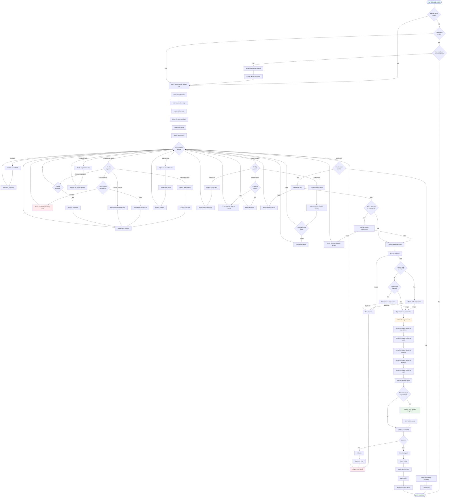
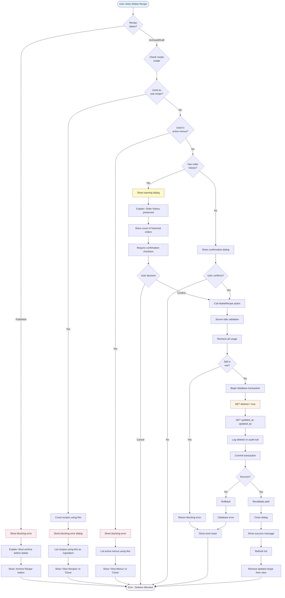
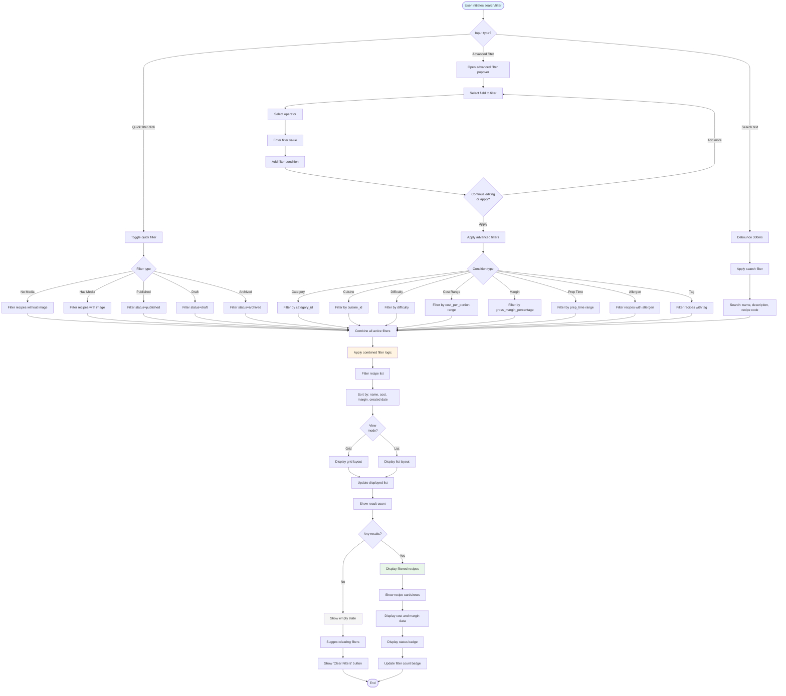
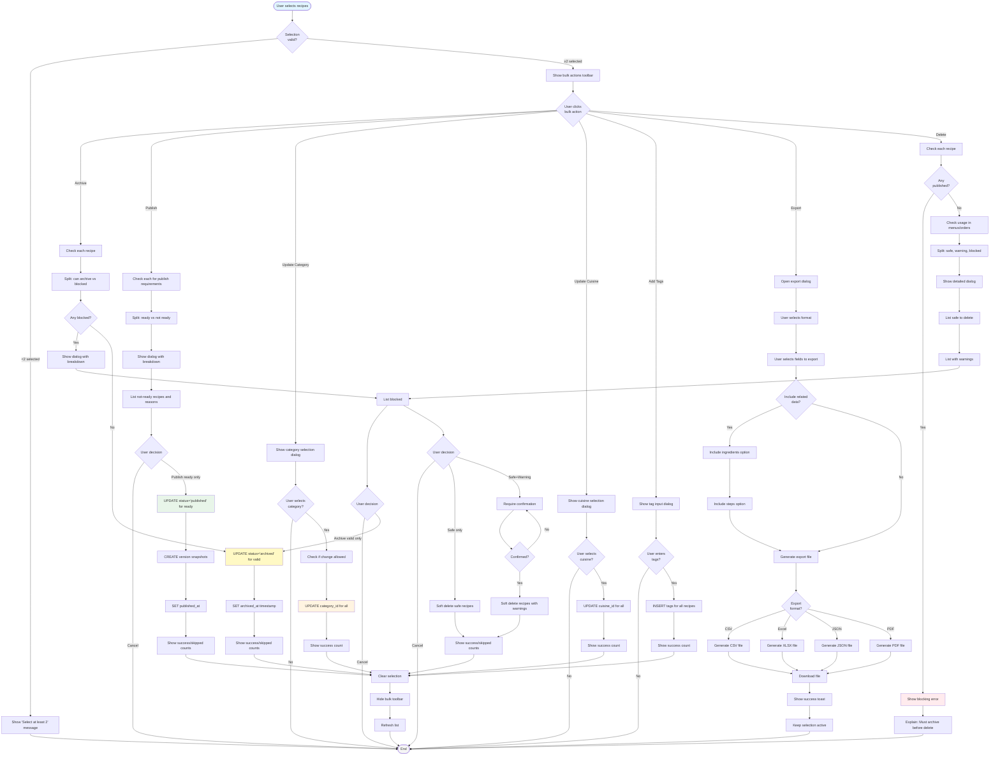
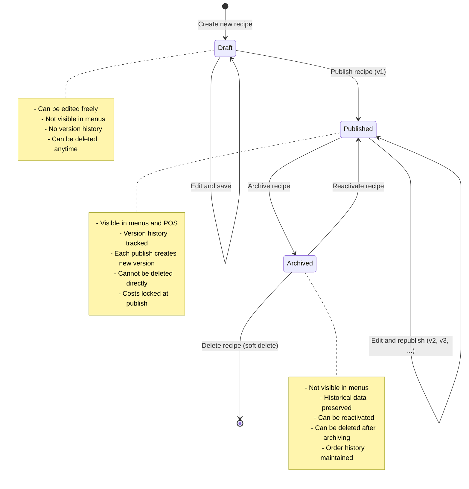
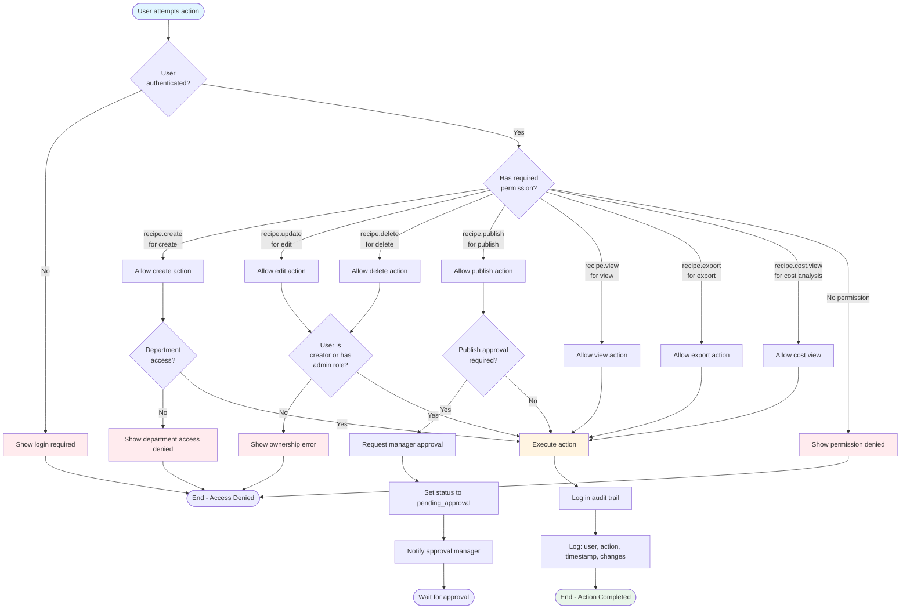
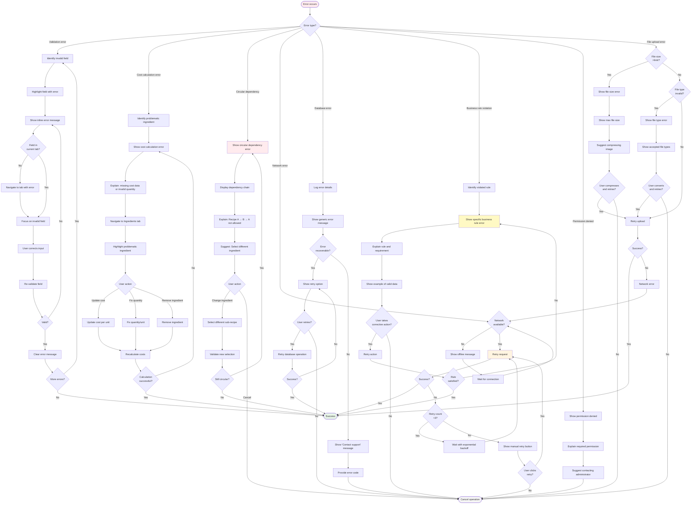

# Recipe Management - Flow Diagrams (FD)

## Document Information
- **Document Type**: Flow Diagrams Document
- **Module**: Operational Planning > Recipe Management > Recipes
- **Version**: 1.0
- **Last Updated**: 2024-01-15

## Document History

| Version | Date | Author | Changes |
|---------|------|--------|---------|
| 1.1.0 | 2025-12-10 | Documentation Team | Standardized reference number format (XXX-YYMM-NNNN) |
| 1.0 | 2024-01-15 | System | Initial flow diagrams document created for Recipe Management |

---

## 1. Create Recipe Workflow

```mermaid
flowchart TD
    Start([User clicks New Recipe]) --> OpenDialog[Open Create Dialog]
    OpenDialog --> InitForm[Initialize multi-tab form]
    InitForm --> BasicTab[Display Basic Information tab]

    BasicTab --> UserBasic{User enters<br>basic info}
    UserBasic -->|typing| ClientVal[Client-side validation]
    ClientVal --> ShowFeedback[Show validation feedback]
    ShowFeedback --> UserBasic

    UserBasic -->|clicks Ingredients tab| IngredientsTab[Navigate to Ingredients tab]
    IngredientsTab --> AddIngredient{User adds<br>ingredients}
    AddIngredient -->|Add Product| ProductSearch[Search product inventory]
    ProductSearch --> ProductSelect[Select product]
    ProductSelect --> LoadProductCost[Load product cost data]
    LoadProductCost --> EnterQuantity[Enter quantity and wastage]
    EnterQuantity --> CalcIngredientCost[Calculate ingredient cost]
    CalcIngredientCost --> UpdateRecipeCost[Update total recipe cost]
    UpdateRecipeCost --> AddIngredient

    AddIngredient -->|Add Recipe| RecipeSearch[Search existing recipes]
    RecipeSearch --> RecipeSelect[Select recipe]
    RecipeSelect --> CheckCircular{Check circular<br>dependency}
    CheckCircular -->|Circular detected| ShowCircularError[Show circular dependency error]
    ShowCircularError --> AddIngredient
    CheckCircular -->|Valid| CheckNesting{Check nesting<br>depth}
    CheckNesting -->|>3 levels| ShowDepthError[Show max depth error]
    ShowDepthError --> AddIngredient
    CheckNesting -->|Valid| LoadSubRecipeCost[Load sub-recipe cost]
    LoadSubRecipeCost --> EnterQuantity

    AddIngredient -->|clicks Preparation tab| PreparationTab[Navigate to Preparation tab]
    PreparationTab --> AddStep{User adds<br>preparation steps}
    AddStep -->|Add Step| StepForm[Enter step details]
    StepForm --> UploadMedia[Upload image/video optional]
    UploadMedia --> AddEquipment[Add equipment and techniques]
    AddEquipment --> AddStep

    AddStep -->|clicks Cost Analysis tab| CostTab[Navigate to Cost Analysis tab]
    CostTab --> ShowCostBreakdown[Display cost breakdown]
    ShowCostBreakdown --> AdjustPercentages{User adjusts<br>percentages}
    AdjustPercentages -->|Labor/Overhead| RecalcCosts[Recalculate all costs]
    RecalcCosts --> UpdateMargins[Update margins and suggested price]
    UpdateMargins --> ShowCostBreakdown

    AdjustPercentages -->|Set Selling Price| EnterPrice[Enter selling price]
    EnterPrice --> CalcFoodCost[Calculate actual food cost %]
    CalcFoodCost --> ValidateMargin{Margin meets<br>target?}
    ValidateMargin -->|No| ShowMarginWarning[Show margin warning]
    ShowMarginWarning --> AdjustPercentages
    ValidateMargin -->|Yes| ShowCostBreakdown

    AdjustPercentages -->|clicks Details tab| DetailsTab[Navigate to Details tab]
    DetailsTab --> ConfigureYield{Configure yield<br>variants?}
    ConfigureYield -->|Yes| EnableFractional[Enable fractional sales]
    EnableFractional --> SelectType[Select fractional sales type]
    SelectType --> AddVariants[Add yield variants]
    AddVariants --> SetConversion[Set conversion rates]
    SetConversion --> SetVariantPricing[Set variant pricing]
    SetVariantPricing --> SetDefaultVariant[Mark default variant]
    SetDefaultVariant --> ValidateVariants{Validate variant<br>pricing logic}
    ValidateVariants -->|Invalid| ShowVariantError[Show pricing logic error]
    ShowVariantError --> AddVariants
    ValidateVariants -->|Valid| AddAllergens

    ConfigureYield -->|No| AddAllergens[Add allergens and tags]
    AddAllergens --> SelectAllergens[Select allergens from list]
    SelectAllergens --> MarkMajorAllergens[Mark FDA major allergens]
    MarkMajorAllergens --> AddTags[Add tags with categories]
    AddTags --> UserSubmit{User clicks<br>Save/Publish}

    UserSubmit -->|Save as Draft| ValidateMinimum[Validate minimum requirements]
    ValidateMinimum -->|Invalid| ShowErrors[Show validation errors]
    ShowErrors --> UserBasic
    ValidateMinimum -->|Valid| CallCreateDraft[Call createRecipe action status=draft]
    CallCreateDraft --> ServerValDraft[Server-side validation]

    UserSubmit -->|Publish| ValidateComplete[Validate complete requirements]
    ValidateComplete -->|Invalid| ShowPublishErrors[Show publish validation errors]
    ShowPublishErrors --> UserBasic
    ValidateComplete -->|Valid| ConfirmPublish{User confirms<br>publish?}
    ConfirmPublish -->|No| UserBasic
    ConfirmPublish -->|Yes| CallCreatePublish[Call createRecipe action status=published]
    CallCreatePublish --> ServerValPublish[Server-side validation]

    ServerValDraft -->|Invalid| ReturnError[Return error response]
    ServerValPublish -->|Invalid| ReturnError
    ReturnError --> DisplayError[Display error toast]
    DisplayError --> UserBasic

    ServerValDraft -->|Valid| CheckRecipeCode{Check recipe code<br>uniqueness}
    ServerValPublish -->|Valid| CheckRecipeCode
    CheckRecipeCode -->|Duplicate| DupCode[Return duplicate code error]
    DupCode --> DisplayError

    CheckRecipeCode -->|Unique| CheckRecipeName{Check recipe name<br>uniqueness}
    CheckRecipeName -->|Duplicate| DupName[Return duplicate name error]
    DupName --> DisplayError

    CheckRecipeName -->|Unique| BeginTransaction[Begin database transaction]
    BeginTransaction --> CreateRecipeRecord[INSERT recipe record]
    CreateRecipeRecord --> CreateIngredients[INSERT recipe ingredients]
    CreateIngredients --> CreateSteps[INSERT preparation steps]
    CreateSteps --> CreateVariants{Has yield<br>variants?}
    CreateVariants -->|Yes| InsertVariants[INSERT yield variants]
    CreateVariants -->|No| CreateAllergens
    InsertVariants --> CreateAllergens[INSERT allergens]
    CreateAllergens --> CreateTags[INSERT tags]
    CreateTags --> CheckPublished{Status =<br>published?}

    CheckPublished -->|Yes| CreateVersion[INSERT version snapshot]
    CreateVersion --> SetPublishedAt[SET published_at timestamp]
    SetPublishedAt --> CommitTransaction
    CheckPublished -->|No| CommitTransaction[Commit transaction]

    CommitTransaction --> Success{Success?}
    Success -->|No| Rollback[Rollback transaction]
    Rollback --> DBError[Database error]
    DBError --> DisplayError

    Success -->|Yes| Revalidate[Revalidate path]
    Revalidate --> CloseDialog[Close dialog]
    CloseDialog --> ShowSuccess[Show success toast]
    ShowSuccess --> RefreshList[Refresh recipe list]
    RefreshList --> HighlightNew[Highlight new recipe]
    HighlightNew --> End([End])

    style Start fill:#e1f5ff
    style CreateRecipeRecord fill:#fff4e1
    style CreateVersion fill:#e8f5e9
    style End fill:#e8f5e9
    style DisplayError fill:#ffebee
    style ShowCircularError fill:#ffebee
    style ShowDepthError fill:#ffebee
```



---

## 2. Edit Recipe Workflow



---

## 3. Delete Recipe Workflow



---

## 4. Cost Calculation Workflow

```mermaid
flowchart TD
    Start([Cost Calculation Triggered]) --> TriggerSource{Trigger<br>source?}

    TriggerSource -->|Ingredient Added| NewIngredient[New ingredient added]
    TriggerSource -->|Ingredient Modified| ModIngredient[Ingredient quantity/cost changed]
    TriggerSource -->|Ingredient Removed| DelIngredient[Ingredient removed]
    TriggerSource -->|Cost % Changed| PercentChange[Labor/overhead % changed]
    TriggerSource -->|Yield Changed| YieldChange[Base yield changed]
    TriggerSource -->|Price Changed| PriceChange[Selling price changed]

    NewIngredient --> GetIngredientData[Get ingredient data]
    ModIngredient --> GetIngredientData
    DelIngredient --> GetIngredientData
    PercentChange --> GetIngredientData
    YieldChange --> GetIngredientData
    PriceChange --> GetIngredientData

    GetIngredientData --> CheckType{Ingredient<br>type?}
    CheckType -->|Product| GetProductCost[Get product cost from inventory]
    GetProductCost --> CalcProductCost[Cost = Quantity × Cost per Unit]
    CalcProductCost --> CalcWastage

    CheckType -->|Recipe| GetSubRecipeCost[Get sub-recipe total cost]
    GetSubRecipeCost --> CheckNested{Sub-recipe has<br>sub-recipes?}
    CheckNested -->|Yes| RecursiveCalc[Recursive cost calculation]
    RecursiveCalc --> CheckDepth{Depth<br>>3?}
    CheckDepth -->|Yes| ErrorMaxDepth[Error: Max nesting depth]
    ErrorMaxDepth --> End([End - Error])
    CheckDepth -->|No| CalcSubRecipeCost[Calculate nested costs]
    CalcSubRecipeCost --> CalcWastage
    CheckNested -->|No| CalcSubRecipeCost

    CalcWastage[Calculate wastage cost] --> WastageFormula[Wastage = Net Cost × Wastage%]
    WastageFormula --> TotalIngredient[Total Ingredient = Net + Wastage]
    TotalIngredient --> NextIngredient{More<br>ingredients?}
    NextIngredient -->|Yes| GetIngredientData
    NextIngredient -->|No| SumIngredients[Sum all ingredient costs]

    SumIngredients --> CalcLabor[Labor Cost = Total Ingredient × Labor%]
    CalcLabor --> CalcOverhead[Overhead = Total Ingredient × Overhead%]
    CalcOverhead --> CalcTotal[Total Cost = Ingredients + Labor + Overhead]
    CalcTotal --> CalcPortion[Cost per Portion = Total Cost / Yield]
    CalcPortion --> CheckPrice{Selling price<br>exists?}

    CheckPrice -->|Yes| CalcFoodCost[Food Cost% = Cost per Portion / Price × 100]
    CalcFoodCost --> CalcMargin[Gross Margin = Price - Cost per Portion]
    CalcMargin --> CalcMarginPercent[Margin% = Margin / Price × 100]
    CalcMarginPercent --> CheckTarget{Meets target<br>food cost?}
    CheckTarget -->|No| FlagWarning[Flag margin warning]
    FlagWarning --> CalcSuggested
    CheckTarget -->|Yes| CalcSuggested[Suggested Price = Cost / Target%]

    CheckPrice -->|No| CalcSuggested
    CalcSuggested --> CheckVariants{Has yield<br>variants?}
    CheckVariants -->|Yes| CalcVariantCost[For each variant]
    CalcVariantCost --> VariantCost[Variant Cost = Total Cost × Conversion Rate]
    VariantCost --> VariantMargin{Variant price<br>set?}
    VariantMargin -->|Yes| CalcVariantMargin[Calculate variant margin]
    CalcVariantMargin --> NextVariant{More<br>variants?}
    VariantMargin -->|No| NextVariant
    NextVariant -->|Yes| CalcVariantCost
    NextVariant -->|No| UpdateUI

    CheckVariants -->|No| UpdateUI[Update UI with all costs]
    UpdateUI --> UpdateCostTab[Update Cost Analysis tab]
    UpdateCostTab --> UpdateIngredientList[Update ingredient cost column]
    UpdateIngredientList --> UpdateVariantPrices[Update variant pricing]
    UpdateVariantPrices --> HighlightChanges[Highlight changed values]
    HighlightChanges --> CheckWarnings{Any cost<br>warnings?}
    CheckWarnings -->|Yes| ShowWarningBadge[Show warning badge]
    ShowWarningBadge --> EndSuccess
    CheckWarnings -->|No| EndSuccess([End - Success])

    style Start fill:#e1f5ff
    style CalcTotal fill:#fff4e1
    style EndSuccess fill:#e8f5e9
    style ErrorMaxDepth fill:#ffebee
    style FlagWarning fill:#fff9c4
```



---

## 5. Publish Recipe Workflow

```mermaid
flowchart TD
    Start([User clicks Publish]) --> CheckStatus{Current<br>status?}
    CheckStatus -->|Already Published| InfoMsg[Show 'Already published' message]
    InfoMsg --> End([End])

    CheckStatus -->|Draft/Archived| ShowPublishDialog[Show publish confirmation dialog]
    ShowPublishDialog --> DisplayChecklist[Display pre-publish checklist]
    DisplayChecklist --> CheckBasic{Basic info<br>complete?}
    CheckBasic -->|No| ShowBasicError[✗ Basic information incomplete]
    ShowBasicError --> DisablePublish
    CheckBasic -->|Yes| ShowBasicOK[✓ Basic information complete]
    ShowBasicOK --> CheckIngredients

    CheckIngredients{Has<br>ingredients?}
    CheckIngredients -->|No| ShowIngError[✗ Must have at least 1 ingredient]
    ShowIngError --> DisablePublish
    CheckIngredients -->|Yes| ShowIngOK[✓ Ingredients added]
    ShowIngOK --> CheckSteps

    CheckSteps{Has<br>prep steps?}
    CheckSteps -->|No| ShowStepError[✗ Must have at least 1 step]
    ShowStepError --> DisablePublish
    CheckSteps -->|Yes| ShowStepOK[✓ Preparation steps added]
    ShowStepOK --> CheckCosts

    CheckCosts{Costs<br>calculated?}
    CheckCosts -->|No| ShowCostError[✗ Costs must be calculated]
    ShowCostError --> DisablePublish
    CheckCosts -->|Yes| ShowCostOK[✓ Costs calculated]
    ShowCostOK --> CheckPrice

    CheckPrice{Selling price<br>set?}
    CheckPrice -->|No| WarnPrice[⚠ Recommended: Set selling price]
    WarnPrice --> EnablePublish
    CheckPrice -->|Yes| ShowPriceOK[✓ Selling price set]
    ShowPriceOK --> CheckMargin

    CheckMargin{Margin meets<br>target?}
    CheckMargin -->|No| WarnMargin[⚠ Warning: Margin below target]
    WarnMargin --> EnablePublish
    CheckMargin -->|Yes| ShowMarginOK[✓ Margin meets target]
    ShowMarginOK --> CheckVariants

    CheckVariants{Has yield<br>variants?}
    CheckVariants -->|Yes| CheckDefault{Default variant<br>marked?}
    CheckDefault -->|No| ShowVariantError[✗ Must mark default variant]
    ShowVariantError --> DisablePublish
    CheckDefault -->|Yes| ShowVariantOK[✓ Yield variants configured]
    ShowVariantOK --> CheckImage
    CheckVariants -->|No| CheckImage

    CheckImage{Has<br>image?}
    CheckImage -->|No| WarnImage[⚠ Recommended: Add recipe image]
    WarnImage --> EnablePublish
    CheckImage -->|Yes| ShowImageOK[✓ Recipe image added]
    ShowImageOK --> EnablePublish

    DisablePublish[Disable Publish button] --> ShowFixErrors[Show 'Fix errors to publish']
    ShowFixErrors --> End

    EnablePublish[Enable Publish button] --> UserConfirm{User clicks<br>Publish?}
    UserConfirm -->|No| End
    UserConfirm -->|Yes| ShowVersionDialog{First<br>publish?}

    ShowVersionDialog -->|Yes| VersionOne[Version will be 1]
    VersionOne --> CallPublish
    ShowVersionDialog -->|No| ShowVersionIncrement[Show version increment dialog]
    ShowVersionIncrement --> EnterChangeSummary[User enters change summary]
    EnterChangeSummary --> IncrementVersion[Increment version number]
    IncrementVersion --> CallPublish[Call publishRecipe action]

    CallPublish --> ServerVal[Server-side validation]
    ServerVal --> RecheckRequirements[Revalidate all requirements]
    RecheckRequirements --> RequirementsMet{All requirements<br>met?}
    RequirementsMet -->|No| ReturnError[Return validation error]
    ReturnError --> DisplayError[Display error toast]
    DisplayError --> End

    RequirementsMet -->|Yes| BeginTransaction[Begin database transaction]
    BeginTransaction --> UpdateStatus[UPDATE status = 'published']
    UpdateStatus --> SetPublishedAt[SET published_at = NOW()]
    SetPublishedAt --> CreateVersionSnapshot[INSERT version snapshot]
    CreateVersionSnapshot --> SnapshotRecipe[Snapshot recipe data]
    SnapshotRecipe --> SnapshotIngredients[Snapshot ingredients data]
    SnapshotIngredients --> SnapshotSteps[Snapshot steps data]
    SnapshotSteps --> SnapshotVariants[Snapshot variants data]
    SnapshotVariants --> MarkVersionPublished[Mark version as published]
    MarkVersionPublished --> CreatePricingHistory{Price<br>changed?}

    CreatePricingHistory -->|Yes| InsertPricingHistory[INSERT pricing history record]
    InsertPricingHistory --> CommitTransaction
    CreatePricingHistory -->|No| CommitTransaction[Commit transaction]

    CommitTransaction --> Success{Success?}
    Success -->|No| Rollback[Rollback]
    Rollback --> DBError[Database error]
    DBError --> DisplayError

    Success -->|Yes| Revalidate[Revalidate path]
    Revalidate --> CloseDialog[Close dialog]
    CloseDialog --> ShowSuccess[Show success toast with version]
    ShowSuccess --> RefreshList[Refresh recipe list]
    RefreshList --> HighlightPublished[Highlight published recipe]
    HighlightPublished --> EndSuccess([End - Published])

    style Start fill:#e1f5ff
    style ShowBasicOK fill:#e8f5e9
    style ShowIngOK fill:#e8f5e9
    style ShowStepOK fill:#e8f5e9
    style ShowCostOK fill:#e8f5e9
    style ShowPriceOK fill:#e8f5e9
    style ShowMarginOK fill:#e8f5e9
    style ShowVariantOK fill:#e8f5e9
    style ShowImageOK fill:#e8f5e9
    style ShowBasicError fill:#ffebee
    style ShowIngError fill:#ffebee
    style ShowStepError fill:#ffebee
    style ShowCostError fill:#ffebee
    style ShowVariantError fill:#ffebee
    style WarnPrice fill:#fff9c4
    style WarnMargin fill:#fff9c4
    style WarnImage fill:#fff9c4
    style UpdateStatus fill:#fff4e1
    style EndSuccess fill:#e8f5e9
```

---

## 6. Search and Filter Workflow



---

## 7. Clone Recipe Workflow

```mermaid
flowchart TD
    Start([User clicks Clone Recipe]) --> ConfirmClone{User confirms<br>clone?}
    ConfirmClone -->|No| End([End - Cancelled])
    ConfirmClone -->|Yes| FetchSource[Fetch source recipe with all data]

    FetchSource --> LoadIngredients[Load all ingredients]
    LoadIngredients --> LoadSteps[Load all preparation steps]
    LoadSteps --> LoadVariants[Load all yield variants]
    LoadVariants --> LoadAllergens[Load allergens and tags]
    LoadAllergens --> OpenDialog[Open clone dialog]

    OpenDialog --> PreFillForm[Pre-fill form with cloned data]
    PreFillForm --> ModifyName[Modify name: 'Copy of [Original Name]']
    ModifyName --> GenerateNewCode[Generate new recipe code]
    GenerateNewCode --> SetDraft[Set status to 'draft']
    SetDraft --> ResetMetrics[Reset: version=1, published_at=null]
    ResetMetrics --> ResetAudit[Reset audit trail to current user]

    ResetAudit --> UserReview{User reviews<br>cloned data}
    UserReview -->|Modify| EditClone[User edits any fields]
    EditClone --> RealTimeVal[Real-time validation]
    RealTimeVal --> UserReview

    UserReview -->|Save| ValidateAll[Validate all fields]
    ValidateAll -->|Invalid| ShowError[Show validation errors]
    ShowError --> UserReview

    ValidateAll -->|Valid| CallClone[Call cloneRecipe action]
    CallClone --> ServerVal[Server-side validation]
    ServerVal -->|Invalid| ReturnError[Return error]
    ReturnError --> DisplayError[Display error toast]
    DisplayError --> UserReview

    ServerVal -->|Valid| CheckCodeUnique{Recipe code<br>unique?}
    CheckCodeUnique -->|No| RegenerateCode[Regenerate code with suffix]
    RegenerateCode --> CheckCodeUnique
    CheckCodeUnique -->|Yes| CheckNameUnique{Recipe name<br>unique?}
    CheckNameUnique -->|No| DupName[Return duplicate name error]
    DupName --> DisplayError

    CheckNameUnique -->|Yes| BeginTransaction[Begin database transaction]
    BeginTransaction --> CreateNewRecipe[INSERT new recipe record]
    CreateNewRecipe --> CloneIngredients[INSERT cloned ingredients]
    CloneIngredients --> CloneSteps[INSERT cloned steps]
    CloneSteps --> CloneVariants{Has yield<br>variants?}
    CloneVariants -->|Yes| InsertVariants[INSERT cloned variants]
    InsertVariants --> CloneAllergens
    CloneVariants -->|No| CloneAllergens[INSERT cloned allergens]
    CloneAllergens --> CloneTags[INSERT cloned tags]
    CloneTags --> RecalcCosts[Recalculate all costs]
    RecalcCosts --> CommitTransaction[Commit transaction]

    CommitTransaction --> Success{Success?}
    Success -->|No| Rollback[Rollback]
    Rollback --> DBError[Database error]
    DBError --> DisplayError

    Success -->|Yes| Revalidate[Revalidate path]
    Revalidate --> CloseDialog[Close dialog]
    CloseDialog --> ShowSuccess[Show success toast]
    ShowSuccess --> RefreshList[Refresh recipe list]
    RefreshList --> NavigateToClone[Navigate to cloned recipe]
    NavigateToClone --> HighlightClone[Highlight cloned recipe]
    HighlightClone --> End

    style Start fill:#e1f5ff
    style CreateNewRecipe fill:#fff4e1
    style NavigateToClone fill:#e8f5e9
    style End fill:#f5f5f5
    style DisplayError fill:#ffebee
```

---

## 8. Bulk Operations Workflow



---

## 9. Recipe Status Lifecycle



---

## 10. Yield Variant Configuration Workflow

```mermaid
flowchart TD
    Start([User configures yield variants]) --> CheckEnabled{Fractional sales<br>enabled?}
    CheckEnabled -->|No| EnableFractional[Enable fractional sales]
    EnableFractional --> SelectType[Select fractional sales type]
    SelectType --> TypeOptions{Type<br>selected}

    CheckEnabled -->|Yes| AddVariant[Add yield variant]

    TypeOptions -->|Pizza Slice| SuggestPizza[Suggest: Slice 1/8, Half 1/2, Whole 1]
    TypeOptions -->|Cake Slice| SuggestCake[Suggest: Slice 1/16, Quarter 1/4, Half 1/2, Whole 1]
    TypeOptions -->|Bottle/Glass| SuggestBottle[Suggest: Glass portions from bottle]
    TypeOptions -->|Portion Control| SuggestPortion[Suggest: Standard serving sizes]
    TypeOptions -->|Custom| CustomVariants[Custom variant configuration]
    SuggestPizza --> AddVariant
    SuggestCake --> AddVariant
    SuggestBottle --> AddVariant
    SuggestPortion --> AddVariant
    CustomVariants --> AddVariant

    AddVariant --> VariantForm[Open variant form]
    VariantForm --> EnterName[Enter variant name]
    EnterName --> EnterUnit[Enter variant unit]
    EnterUnit --> EnterQuantity[Enter variant quantity]
    EnterQuantity --> EnterConversion[Enter conversion rate 0.01-1.0]
    EnterConversion --> ValidateConversion{Conversion<br>valid?}
    ValidateConversion -->|No| ShowConversionError[Show conversion rate error]
    ShowConversionError --> EnterConversion
    ValidateConversion -->|Yes| CalcVariantCost[Calculate variant cost]

    CalcVariantCost --> CostFormula[Variant Cost = Total Recipe Cost × Conversion]
    CostFormula --> EnterPrice{Enter selling<br>price?}
    EnterPrice -->|Yes| InputPrice[Input variant selling price]
    InputPrice --> CalcVariantMargin[Calculate variant margin]
    CalcVariantMargin --> ValidateMargin{Margin<br>reasonable?}
    ValidateMargin -->|No| WarnMargin[Warn about low margin]
    WarnMargin --> CheckLogic
    ValidateMargin -->|Yes| CheckLogic

    EnterPrice -->|No| CheckLogic{Check pricing<br>logic}
    CheckLogic --> CompareVariants[Compare all variant prices]
    CompareVariants --> LogicCheck{8 slices cost<br>> whole?}
    LogicCheck -->|Yes| ShowLogicWarning[Show pricing logic warning]
    ShowLogicWarning --> SuggestAdjust[Suggest price adjustments]
    SuggestAdjust --> UserFixPrice{User adjusts<br>prices?}
    UserFixPrice -->|Yes| InputPrice
    UserFixPrice -->|No| ProceedWarning[Proceed with warning]
    ProceedWarning --> OptionalFields
    LogicCheck -->|No| OptionalFields

    OptionalFields[Configure optional fields] --> EnterShelfLife[Enter shelf life hours]
    EnterShelfLife --> EnterWastage[Enter wastage rate]
    EnterWastage --> EnterOrderLimits[Enter min/max order quantity]
    EnterOrderLimits --> SetDefault{Set as<br>default?}

    SetDefault -->|Yes| CheckExistingDefault{Existing default<br>exists?}
    CheckExistingDefault -->|Yes| ConfirmDefaultChange{Change<br>default?}
    ConfirmDefaultChange -->|No| SetDefault
    ConfirmDefaultChange -->|Yes| UnmarkOldDefault[Unmark old default]
    UnmarkOldDefault --> MarkNewDefault[Mark new default]
    CheckExistingDefault -->|No| MarkNewDefault
    MarkNewDefault --> SaveVariant

    SetDefault -->|No| SaveVariant[Save variant]
    SaveVariant --> AddMore{Add more<br>variants?}
    AddMore -->|Yes| AddVariant
    AddMore -->|No| ValidateAllVariants[Validate all variants]

    ValidateAllVariants --> CheckDefaultExists{Has default<br>variant?}
    CheckDefaultExists -->|No| ShowDefaultError[Error: Must mark one as default]
    ShowDefaultError --> SelectDefault[Select variant to mark default]
    SelectDefault --> MarkNewDefault

    CheckDefaultExists -->|Yes| ShowVariantSummary[Show variant summary table]
    ShowVariantSummary --> DisplayConversions[Display conversion rates]
    DisplayConversions --> DisplayPricing[Display pricing breakdown]
    DisplayPricing --> DisplayMargins[Display margins]
    DisplayMargins --> HighlightDefault[Highlight default variant]
    HighlightDefault --> UserComplete{User completes<br>configuration?}

    UserComplete -->|Edit| SelectVariant[Select variant to edit]
    SelectVariant --> VariantForm
    UserComplete -->|Delete| SelectDeleteVariant[Select variant to delete]
    SelectDeleteVariant --> CheckDeleteDefault{Deleting<br>default?}
    CheckDeleteDefault -->|Yes| ShowDeleteDefaultError[Cannot delete default variant]
    ShowDeleteDefaultError --> UserComplete
    CheckDeleteDefault -->|No| ConfirmDelete{Confirm<br>delete?}
    ConfirmDelete -->|No| UserComplete
    ConfirmDelete -->|Yes| RemoveVariant[Remove variant]
    RemoveVariant --> UserComplete

    UserComplete -->|Save| SaveAllVariants[Save all variants to recipe]
    SaveAllVariants --> UpdateRecipeFlag[Update recipe: allows_fractional_sales=true]
    UpdateRecipeFlag --> SetDefaultVariantId[Set default_variant_id]
    SetDefaultVariantId --> End([End - Success])

    style Start fill:#e1f5ff
    style CalcVariantCost fill:#fff4e1
    style ShowLogicWarning fill:#fff9c4
    style ShowDefaultError fill:#ffebee
    style ShowDeleteDefaultError fill:#ffebee
    style End fill:#e8f5e9
```



---

## 11. Permission-Based Action Flow



---

## 12. Error Recovery Flow



---
