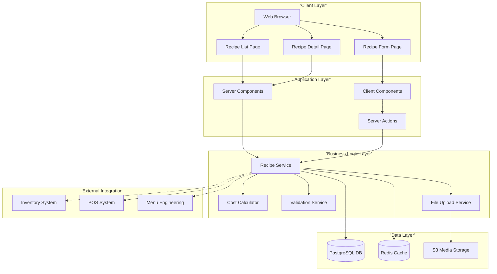
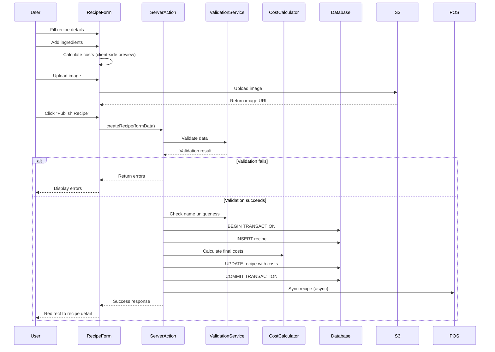
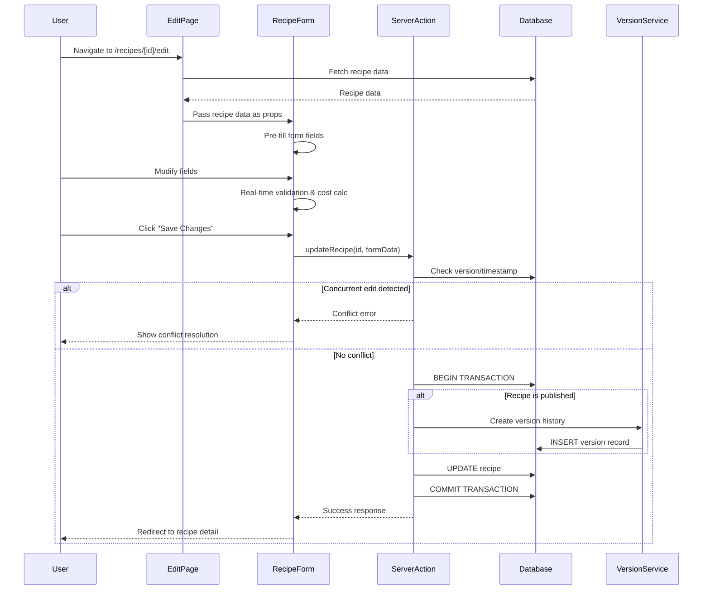
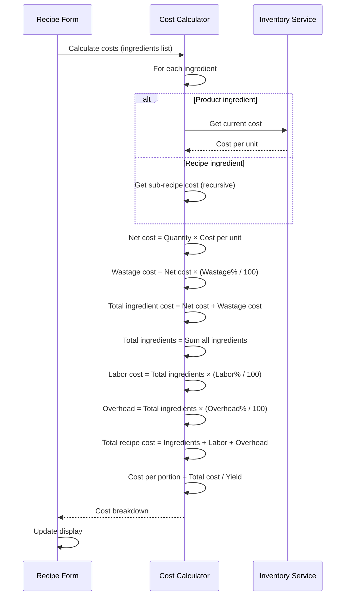

# Recipe Management - Technical Specification (TS)

## Document Information
- **Document Type**: Technical Specification Document
- **Module**: Operational Planning > Recipe Management > Recipes
- **Version**: 1.0
- **Last Updated**: 2024-01-15

## Document History

| Version | Date | Author | Changes |
|---------|------|--------|---------|
| 1.1.0 | 2025-12-10 | Documentation Team | Standardized reference number format (XXX-YYMM-NNNN) |
| 1.0 | 2024-01-15 | System | Initial technical specification document created |

---

## 1. System Architecture

### 1.1 Architecture Overview



### 1.2 Technology Stack

**Frontend**:
- Next.js 14.2+ (App Router)
- React 18+ (Server Components + Client Components)
- TypeScript 5.8+
- Tailwind CSS 3.4+
- Shadcn/ui Components (Radix UI primitives)
- React Hook Form 7.48+
- Zod 3.22+ (Validation)
- Lucide React (Icons)

**Backend**:
- Next.js Server Actions (Replaces traditional API routes)
- Prisma ORM 5.8+
- PostgreSQL 14+
- Redis (Caching layer, optional)
- AWS S3 / CloudFlare R2 (Media storage)

**Development Tools**:
- ESLint + Prettier
- Vitest (Testing)
- TypeScript strict mode

---

## 2. Component Hierarchy

### 2.1 Page Structure

```
app/(main)/operational-planning/recipe-management/recipes/
├── page.tsx                          # Recipe List (Server Component)
├── [id]/
│   ├── page.tsx                      # Recipe Detail (Server Component)
│   └── edit/
│       └── page.tsx                  # Recipe Edit (Server Component wrapper)
├── new/
│   └── page.tsx                      # Recipe Create (Server Component wrapper)
├── components/
│   ├── recipe-list-new.tsx           # Main List (Client Component)
│   ├── recipe-card.tsx               # Card Display
│   ├── recipe-card-compact.tsx       # Compact Card
│   ├── recipe-form.tsx               # Main Form (Client Component)
│   ├── recipe-image.tsx              # Image Upload
│   ├── recipe-list-skeleton.tsx      # Loading State
│   ├── recipe-form-skeleton.tsx      # Form Loading
│   └── recipe-view-skeleton.tsx      # Detail Loading
├── data/
│   └── mock-recipes.ts               # Mock Data (Development)
└── actions.ts                        # Server Actions
```

### 2.2 Component Responsibility Matrix

| Component | Type | Responsibility | Data Fetching |
|-----------|------|----------------|---------------|
| `page.tsx` (List) | Server | Page wrapper, Suspense boundary | No (delegates to Client) |
| `recipe-list-new.tsx` | Client | List rendering, search, filters, selection | Uses mock data (will use Server Actions) |
| `recipe-card.tsx` | Client | Individual recipe display (grid) | Props from parent |
| `recipe-form.tsx` | Client | Form state, validation, submission | Server Actions for save |
| `[id]/page.tsx` | Server | Detail wrapper, Suspense | Fetches recipe data |
| `[id]/edit/page.tsx` | Server | Edit wrapper, pre-loads data | Fetches recipe, passes to form |
| `new/page.tsx` | Server | Create wrapper, provides context | No data fetching |

---

## 3. Data Flow Patterns

### 3.1 Recipe Creation Flow



### 3.2 Recipe Edit Flow



### 3.3 Cost Calculation Flow



---

## 4. State Management

### 4.1 Form State Management (React Hook Form)

```typescript
// recipe-form.tsx
import { useForm } from 'react-hook-form'
import { zodResolver } from '@hookform/resolvers/zod'
import { recipeSchema } from './validation'

export function RecipeForm({ initialData }: RecipeFormProps) {
  const form = useForm<RecipeFormValues>({
    resolver: zodResolver(recipeSchema),
    defaultValues: initialData || {
      name: '',
      description: '',
      category: '',
      cuisine: '',
      status: 'draft',
      yield: 1,
      yieldUnit: 'portions',
      prepTime: 0,
      cookTime: 0,
      ingredients: [],
      steps: [],
      targetFoodCost: 33,
      laborCostPercentage: 30,
      overheadPercentage: 20,
      // ... other fields
    },
  })

  const handleSubmit = form.handleSubmit(async (data) => {
    try {
      if (initialData?.id) {
        // Update existing recipe
        const result = await updateRecipe(initialData.id, data)
        if (result.success) {
          toast.success('Recipe updated successfully')
          router.push(`/operational-planning/recipe-management/recipes/${initialData.id}`)
        } else {
          toast.error(result.error)
        }
      } else {
        // Create new recipe
        const result = await createRecipe(data)
        if (result.success) {
          toast.success('Recipe created successfully')
          router.push(`/operational-planning/recipe-management/recipes/${result.data.id}`)
        } else {
          toast.error(result.error)
        }
      }
    } catch (error) {
      toast.error('An unexpected error occurred')
    }
  })

  return (
    <form onSubmit={handleSubmit}>
      {/* Form fields */}
    </form>
  )
}
```

### 4.2 Local UI State (useState)

```typescript
// recipe-list-new.tsx
export default function RecipeList() {
  // View mode toggle
  const [viewMode, setViewMode] = useState<'grid' | 'list'>('grid')

  // Search and filters
  const [searchTerm, setSearchTerm] = useState('')
  const [quickFilters, setQuickFilters] = useState<string[]>([])
  const [filterConditions, setFilterConditions] = useState<FilterCondition[]>([])

  // Selection state
  const [selectedRecipes, setSelectedRecipes] = useState<string[]>([])

  // Filtered data (derived state)
  const filteredRecipes = useMemo(() => {
    return recipes.filter(recipe => {
      // Search filter
      if (searchTerm && !recipe.name.toLowerCase().includes(searchTerm.toLowerCase())) {
        return false
      }

      // Quick filters
      if (quickFilters.includes('noMedia') && recipe.hasMedia) return false
      if (quickFilters.includes('hasMedia') && !recipe.hasMedia) return false
      if (quickFilters.includes('active') && recipe.status !== 'published') return false
      if (quickFilters.includes('draft') && recipe.status !== 'draft') return false

      // Advanced filters
      for (const condition of filterConditions) {
        // Apply filter logic
      }

      return true
    })
  }, [recipes, searchTerm, quickFilters, filterConditions])

  return (
    <div>
      {/* List UI */}
    </div>
  )
}
```

### 4.3 Server State (Future: React Query)

```typescript
// Future implementation with React Query
import { useQuery, useMutation, useQueryClient } from '@tanstack/react-query'

export function useRecipes(filters?: RecipeFilters) {
  return useQuery({
    queryKey: ['recipes', filters],
    queryFn: () => getRecipes(filters),
  })
}

export function useRecipe(id: string) {
  return useQuery({
    queryKey: ['recipes', id],
    queryFn: () => getRecipe(id),
  })
}

export function useCreateRecipe() {
  const queryClient = useQueryClient()

  return useMutation({
    mutationFn: createRecipe,
    onSuccess: () => {
      queryClient.invalidateQueries({ queryKey: ['recipes'] })
    },
  })
}

export function useUpdateRecipe() {
  const queryClient = useQueryClient()

  return useMutation({
    mutationFn: ({ id, data }: { id: string; data: RecipeInput }) =>
      updateRecipe(id, data),
    onSuccess: (_, variables) => {
      queryClient.invalidateQueries({ queryKey: ['recipes'] })
      queryClient.invalidateQueries({ queryKey: ['recipes', variables.id] })
    },
  })
}
```

---

## 5. Server Actions Implementation

### 5.1 Recipe CRUD Actions

```typescript
// app/(main)/operational-planning/recipe-management/recipes/actions.ts
'use server'

import { revalidatePath } from 'next/cache'
import { getServerSession } from 'next-auth'
import { prisma } from '@/lib/prisma'
import { recipeSchema, publishRecipeSchema } from './validation'
import { calculateRecipeCosts } from '@/lib/cost-calculator'
import { checkRecipeNameUnique } from '@/lib/validation'

export async function createRecipe(input: CreateRecipeInput) {
  try {
    // 1. Authentication check
    const session = await getServerSession()
    if (!session?.user) {
      return { success: false, error: 'Unauthorized' }
    }

    // 2. Permission check
    if (!session.user.permissions.includes('recipe.create')) {
      return { success: false, error: 'Permission denied' }
    }

    // 3. Validation
    const validated = recipeSchema.safeParse(input)
    if (!validated.success) {
      return {
        success: false,
        error: 'Validation failed',
        errors: validated.error.errors,
      }
    }

    // 4. Business rules validation
    const isNameUnique = await checkRecipeNameUnique(validated.data.name)
    if (!isNameUnique) {
      return {
        success: false,
        error: 'Recipe name already exists',
      }
    }

    // 5. Cost calculation
    const costs = await calculateRecipeCosts(validated.data)

    // 6. Database transaction
    const recipe = await prisma.$transaction(async (tx) => {
      // Create recipe
      const newRecipe = await tx.recipe.create({
        data: {
          ...validated.data,
          costPerPortion: costs.costPerPortion,
          totalCost: costs.totalCost,
          foodCostPercentage: costs.foodCostPercentage,
          grossProfit: costs.grossProfit,
          grossMargin: costs.grossMargin,
          createdBy: session.user.id,
          updatedBy: session.user.id,
        },
      })

      // Create ingredients
      if (validated.data.ingredients.length > 0) {
        await tx.recipeIngredient.createMany({
          data: validated.data.ingredients.map((ing, index) => ({
            recipeId: newRecipe.id,
            ...ing,
            order: index,
          })),
        })
      }

      // Create steps
      if (validated.data.steps.length > 0) {
        await tx.preparationStep.createMany({
          data: validated.data.steps.map((step) => ({
            recipeId: newRecipe.id,
            ...step,
          })),
        })
      }

      return newRecipe
    })

    // 7. Revalidate
    revalidatePath('/operational-planning/recipe-management/recipes')

    // 8. Return success
    return {
      success: true,
      data: recipe,
    }
  } catch (error) {
    console.error('Create recipe error:', error)
    return {
      success: false,
      error: 'Failed to create recipe',
    }
  }
}

export async function updateRecipe(id: string, input: UpdateRecipeInput) {
  try {
    const session = await getServerSession()
    if (!session?.user) {
      return { success: false, error: 'Unauthorized' }
    }

    if (!session.user.permissions.includes('recipe.edit')) {
      return { success: false, error: 'Permission denied' }
    }

    // Fetch existing recipe
    const existingRecipe = await prisma.recipe.findUnique({
      where: { id },
      include: { ingredients: true, steps: true },
    })

    if (!existingRecipe) {
      return { success: false, error: 'Recipe not found' }
    }

    // Validation
    const validated = recipeSchema.safeParse(input)
    if (!validated.success) {
      return {
        success: false,
        error: 'Validation failed',
        errors: validated.error.errors,
      }
    }

    // Check name uniqueness (exclude current recipe)
    if (validated.data.name !== existingRecipe.name) {
      const isNameUnique = await checkRecipeNameUnique(validated.data.name, id)
      if (!isNameUnique) {
        return { success: false, error: 'Recipe name already exists' }
      }
    }

    // Recalculate costs
    const costs = await calculateRecipeCosts(validated.data)

    // Database transaction
    const recipe = await prisma.$transaction(async (tx) => {
      // If published, create version history
      if (existingRecipe.status === 'published') {
        await tx.recipeVersion.create({
          data: {
            recipeId: id,
            versionNumber: existingRecipe.versionNumber || 1,
            data: existingRecipe,
            createdBy: session.user.id,
          },
        })
      }

      // Update recipe
      const updatedRecipe = await tx.recipe.update({
        where: { id },
        data: {
          ...validated.data,
          costPerPortion: costs.costPerPortion,
          totalCost: costs.totalCost,
          foodCostPercentage: costs.foodCostPercentage,
          grossProfit: costs.grossProfit,
          grossMargin: costs.grossMargin,
          versionNumber: existingRecipe.status === 'published'
            ? (existingRecipe.versionNumber || 1) + 1
            : existingRecipe.versionNumber,
          updatedBy: session.user.id,
          updatedAt: new Date(),
        },
      })

      // Update ingredients (delete + recreate for simplicity)
      await tx.recipeIngredient.deleteMany({ where: { recipeId: id } })
      if (validated.data.ingredients.length > 0) {
        await tx.recipeIngredient.createMany({
          data: validated.data.ingredients.map((ing, index) => ({
            recipeId: id,
            ...ing,
            order: index,
          })),
        })
      }

      // Update steps (delete + recreate)
      await tx.preparationStep.deleteMany({ where: { recipeId: id } })
      if (validated.data.steps.length > 0) {
        await tx.preparationStep.createMany({
          data: validated.data.steps.map((step) => ({
            recipeId: id,
            ...step,
          })),
        })
      }

      return updatedRecipe
    })

    // Revalidate
    revalidatePath('/operational-planning/recipe-management/recipes')
    revalidatePath(`/operational-planning/recipe-management/recipes/${id}`)

    return {
      success: true,
      data: recipe,
    }
  } catch (error) {
    console.error('Update recipe error:', error)
    return {
      success: false,
      error: 'Failed to update recipe',
    }
  }
}

export async function deleteRecipe(id: string, force: boolean = false) {
  try {
    const session = await getServerSession()
    if (!session?.user) {
      return { success: false, error: 'Unauthorized' }
    }

    if (!session.user.permissions.includes('recipe.delete')) {
      return { success: false, error: 'Permission denied' }
    }

    // Safety checks
    const usageCheck = await checkRecipeUsage(id)

    if (usageCheck.inActiveMenus && !force) {
      return {
        success: false,
        error: 'Recipe is used in active menus',
        details: usageCheck,
      }
    }

    if (usageCheck.inProduction && !force) {
      return {
        success: false,
        error: 'Recipe has active production orders',
        details: usageCheck,
      }
    }

    if (usageCheck.asSubRecipe && !force) {
      return {
        success: false,
        error: 'Recipe is used in other recipes',
        details: usageCheck,
      }
    }

    // Soft delete
    await prisma.recipe.update({
      where: { id },
      data: {
        deleted: true,
        deletedAt: new Date(),
        deletedBy: session.user.id,
      },
    })

    // Revalidate
    revalidatePath('/operational-planning/recipe-management/recipes')

    return { success: true }
  } catch (error) {
    console.error('Delete recipe error:', error)
    return {
      success: false,
      error: 'Failed to delete recipe',
    }
  }
}

export async function publishRecipe(id: string) {
  try {
    const session = await getServerSession()
    if (!session?.user) {
      return { success: false, error: 'Unauthorized' }
    }

    if (!session.user.permissions.includes('recipe.publish')) {
      return { success: false, error: 'Permission denied' }
    }

    // Fetch recipe
    const recipe = await prisma.recipe.findUnique({
      where: { id },
      include: { ingredients: true, steps: true },
    })

    if (!recipe) {
      return { success: false, error: 'Recipe not found' }
    }

    // Validate publish requirements
    const publishValidation = publishRecipeSchema.safeParse(recipe)
    if (!publishValidation.success) {
      return {
        success: false,
        error: 'Recipe not ready for publishing',
        errors: publishValidation.error.errors,
      }
    }

    // Update status
    await prisma.recipe.update({
      where: { id },
      data: {
        status: 'published',
        publishedAt: new Date(),
        publishedBy: session.user.id,
        versionNumber: 1,
      },
    })

    // Trigger POS sync (async job)
    await syncRecipeToPOS(id)

    // Revalidate
    revalidatePath('/operational-planning/recipe-management/recipes')
    revalidatePath(`/operational-planning/recipe-management/recipes/${id}`)

    return { success: true }
  } catch (error) {
    console.error('Publish recipe error:', error)
    return {
      success: false,
      error: 'Failed to publish recipe',
    }
  }
}

// Helper functions
async function checkRecipeUsage(id: string) {
  const [menuItems, productionOrders, parentRecipes] = await Promise.all([
    prisma.menuItem.count({ where: { recipeId: id, status: 'active' } }),
    prisma.productionOrder.count({ where: { recipeId: id, status: { in: ['pending', 'in_progress'] } } }),
    prisma.recipeIngredient.count({ where: { ingredientId: id, type: 'recipe' } }),
  ])

  return {
    inActiveMenus: menuItems > 0,
    inProduction: productionOrders > 0,
    asSubRecipe: parentRecipes > 0,
  }
}

async function syncRecipeToPOS(id: string) {
  // Queue background job for POS sync
  // Implementation depends on job queue system
  console.log(`Queuing POS sync for recipe ${id}`)
}
```

---

## 6. Integration Points

### 6.1 Inventory Integration

```typescript
// lib/integrations/inventory.ts

export async function getIngredientCost(ingredientId: string): Promise<number> {
  const ingredient = await prisma.inventoryItem.findUnique({
    where: { id: ingredientId },
    select: {
      costPerUnit: true,
      lastPurchasePrice: true,
      averageCost: true,
    },
  })

  if (!ingredient) {
    throw new Error(`Ingredient ${ingredientId} not found`)
  }

  // Use most recent cost or average
  return ingredient.lastPurchasePrice || ingredient.averageCost || 0
}

export async function checkIngredientAvailability(
  ingredientId: string,
  quantityNeeded: number
): Promise<{ available: boolean; currentQty: number }> {
  const ingredient = await prisma.inventoryItem.findUnique({
    where: { id: ingredientId },
    select: { quantityOnHand: true },
  })

  if (!ingredient) {
    return { available: false, currentQty: 0 }
  }

  return {
    available: ingredient.quantityOnHand >= quantityNeeded,
    currentQty: ingredient.quantityOnHand,
  }
}

export async function deductIngredientFromStock(
  ingredientId: string,
  quantity: number,
  recipeId: string
): Promise<void> {
  await prisma.$transaction(async (tx) => {
    // Deduct from inventory
    await tx.inventoryItem.update({
      where: { id: ingredientId },
      data: {
        quantityOnHand: {
          decrement: quantity,
        },
      },
    })

    // Create transaction log
    await tx.inventoryTransaction.create({
      data: {
        itemId: ingredientId,
        type: 'usage',
        quantity: -quantity,
        reference: `Recipe ${recipeId}`,
        createdBy: 'system',
      },
    })
  })
}
```

### 6.2 POS Integration

```typescript
// lib/integrations/pos.ts

export async function syncRecipeToPOS(recipeId: string): Promise<void> {
  const recipe = await prisma.recipe.findUnique({
    where: { id: recipeId },
    include: {
      category: true,
      cuisine: true,
      yieldVariants: true,
      allergens: true,
    },
  })

  if (!recipe) {
    throw new Error('Recipe not found')
  }

  // Transform to POS format
  const posItem = {
    id: recipe.id,
    name: recipe.name,
    category: recipe.category.name,
    price: recipe.sellingPrice,
    cost: recipe.costPerPortion,
    variants: recipe.yieldVariants.map(v => ({
      id: v.id,
      name: v.name,
      price: v.sellingPrice,
      cost: v.costPerUnit,
    })),
    allergens: recipe.allergens.map(a => a.name),
    image: recipe.image,
    status: recipe.status === 'published' ? 'active' : 'inactive',
  }

  // Send to POS API (implementation depends on POS system)
  await fetch(`${process.env.POS_API_URL}/items`, {
    method: 'POST',
    headers: {
      'Content-Type': 'application/json',
      'Authorization': `Bearer ${process.env.POS_API_KEY}`,
    },
    body: JSON.stringify(posItem),
  })
}
```

---

## 7. Performance Optimization

### 7.1 Caching Strategy

```typescript
// lib/cache.ts
import { Redis } from 'ioredis'

const redis = new Redis(process.env.REDIS_URL)

export async function getCachedRecipe(id: string) {
  const cached = await redis.get(`recipe:${id}`)
  if (cached) {
    return JSON.parse(cached)
  }
  return null
}

export async function setCachedRecipe(id: string, data: any, ttl: number = 3600) {
  await redis.setex(`recipe:${id}`, ttl, JSON.stringify(data))
}

export async function invalidateRecipeCache(id: string) {
  await redis.del(`recipe:${id}`)
}

export async function invalidateRecipeListCache() {
  const keys = await redis.keys('recipes:list:*')
  if (keys.length > 0) {
    await redis.del(...keys)
  }
}
```

### 7.2 Image Optimization

```typescript
// lib/image-upload.ts
import { S3Client, PutObjectCommand } from '@aws-sdk/client-s3'
import sharp from 'sharp'

const s3 = new S3Client({ region: process.env.AWS_REGION })

export async function uploadRecipeImage(
  file: File,
  recipeId: string
): Promise<string> {
  // Read file buffer
  const buffer = Buffer.from(await file.arrayBuffer())

  // Optimize image
  const optimized = await sharp(buffer)
    .resize(1200, 800, { fit: 'inside', withoutEnlargement: true })
    .jpeg({ quality: 85, progressive: true })
    .toBuffer()

  // Generate thumbnail
  const thumbnail = await sharp(buffer)
    .resize(400, 300, { fit: 'cover' })
    .jpeg({ quality: 80 })
    .toBuffer()

  // Upload main image
  const mainKey = `recipes/${recipeId}/main.jpg`
  await s3.send(new PutObjectCommand({
    Bucket: process.env.S3_BUCKET,
    Key: mainKey,
    Body: optimized,
    ContentType: 'image/jpeg',
    CacheControl: 'public, max-age=31536000',
  }))

  // Upload thumbnail
  const thumbnailKey = `recipes/${recipeId}/thumbnail.jpg`
  await s3.send(new PutObjectCommand({
    Bucket: process.env.S3_BUCKET,
    Key: thumbnailKey,
    Body: thumbnail,
    ContentType: 'image/jpeg',
    CacheControl: 'public, max-age=31536000',
  }))

  return `https://${process.env.CDN_DOMAIN}/${mainKey}`
}
```

### 7.3 Database Query Optimization

```typescript
// Efficient recipe list query with pagination and filtering
export async function getRecipes(params: {
  page?: number
  limit?: number
  search?: string
  category?: string
  cuisine?: string
  status?: string
}) {
  const { page = 1, limit = 50, search, category, cuisine, status } = params
  const skip = (page - 1) * limit

  const where = {
    deleted: false,
    ...(search && {
      OR: [
        { name: { contains: search, mode: 'insensitive' } },
        { description: { contains: search, mode: 'insensitive' } },
      ],
    }),
    ...(category && { categoryId: category }),
    ...(cuisine && { cuisineId: cuisine }),
    ...(status && { status }),
  }

  const [recipes, total] = await prisma.$transaction([
    prisma.recipe.findMany({
      where,
      include: {
        category: { select: { id: true, name: true } },
        cuisine: { select: { id: true, name: true } },
        _count: {
          select: {
            ingredients: true,
            steps: true,
          },
        },
      },
      orderBy: { updatedAt: 'desc' },
      skip,
      take: limit,
    }),
    prisma.recipe.count({ where }),
  ])

  return {
    recipes,
    pagination: {
      page,
      limit,
      total,
      pages: Math.ceil(total / limit),
    },
  }
}
```

---

## 8. Security Considerations

### 8.1 Input Validation

```typescript
// lib/validation/recipe-schemas.ts
import { z } from 'zod'

export const recipeSchema = z.object({
  name: z.string().min(2).max(200),
  description: z.string().min(10).max(1000),
  categoryId: z.string().uuid(),
  cuisineId: z.string().uuid(),
  status: z.enum(['draft', 'published']),
  yield: z.number().int().positive(),
  yieldUnit: z.string().min(1).max(50),
  prepTime: z.number().int().min(0).max(1000),
  cookTime: z.number().int().min(0).max(1000),
  difficulty: z.enum(['easy', 'medium', 'hard']),
  targetFoodCost: z.number().min(15).max(50),
  laborCostPercentage: z.number().min(0).max(100),
  overheadPercentage: z.number().min(0).max(100),
  sellingPrice: z.number().positive(),
  ingredients: z.array(z.object({
    id: z.string(),
    type: z.enum(['product', 'recipe']),
    quantity: z.number().positive(),
    unit: z.string(),
    wastage: z.number().min(0).max(50),
  })).min(1),
  steps: z.array(z.object({
    order: z.number().int().positive(),
    description: z.string().min(10).max(1000),
    duration: z.number().int().positive().optional(),
    temperature: z.number().min(0).max(500).optional(),
    equipments: z.array(z.string()).optional(),
  })).min(1),
  allergens: z.array(z.string()).optional(),
  tags: z.array(z.string()).optional(),
}).refine((data) => {
  // Business rule: Total percentages <= 100%
  return (data.laborCostPercentage + data.overheadPercentage + data.targetFoodCost) <= 100
}, {
  message: 'Total cost percentages cannot exceed 100%',
})

export const publishRecipeSchema = recipeSchema.extend({
  image: z.string().url(),
  ingredients: z.array(z.any()).min(1),
  steps: z.array(z.any()).min(1),
})
```

### 8.2 Permission Checks

```typescript
// middleware/permissions.ts
export function requirePermission(permission: string) {
  return async (session: Session | null) => {
    if (!session?.user) {
      throw new Error('Unauthorized')
    }

    if (!session.user.permissions.includes(permission)) {
      throw new Error('Permission denied')
    }

    return session.user
  }
}

// Usage in Server Actions
export async function createRecipe(input: CreateRecipeInput) {
  const user = await requirePermission('recipe.create')(await getServerSession())
  // ... rest of function
}
```

---

## Sitemap

### Overview
This section provides a complete navigation structure of all pages, tabs, and dialogues in the Recipes sub-module.

### Page Hierarchy

```mermaid
graph TD
    ListPage['List Page<br>(/operational-planning/recipe-management/recipes)']
    CreatePage['Create Page<br>(/operational-planning/recipe-management/recipes/new)']
    DetailPage["Detail Page<br>(/operational-planning/recipe-management/recipes/[id])"]
    EditPage["Edit Page<br>(/operational-planning/recipe-management/recipes/[id]/edit)"]

    %% List Page Tabs
    ListPage --> ListTab1['Tab: All Items']
    ListPage --> ListTab2['Tab: Active']
    ListPage --> ListTab3['Tab: Archived']

    %% List Page Dialogues
    ListPage -.-> ListDialog1['Dialog: Quick Create']
    ListPage -.-> ListDialog2['Dialog: Bulk Actions']
    ListPage -.-> ListDialog3['Dialog: Export']
    ListPage -.-> ListDialog4['Dialog: Filter']

    %% Detail Page Tabs
    DetailPage --> DetailTab1['Tab: Overview']
    DetailPage --> DetailTab2['Tab: History']
    DetailPage --> DetailTab3['Tab: Activity Log']

    %% Detail Page Dialogues
    DetailPage -.-> DetailDialog1['Dialog: Edit']
    DetailPage -.-> DetailDialog2['Dialog: Delete Confirm']
    DetailPage -.-> DetailDialog3['Dialog: Status Change']

    %% Create/Edit Dialogues
    CreatePage -.-> CreateDialog1['Dialog: Cancel Confirm']
    CreatePage -.-> CreateDialog2['Dialog: Save Draft']

    EditPage -.-> EditDialog1['Dialog: Discard Changes']
    EditPage -.-> EditDialog2['Dialog: Save Draft']

    %% Navigation Flow
    ListPage --> DetailPage
    ListPage --> CreatePage
    DetailPage --> EditPage
    CreatePage --> DetailPage
    EditPage --> DetailPage

    style ListPage fill:#e1f5ff
    style CreatePage fill:#fff4e1
    style DetailPage fill:#e8f5e9
    style EditPage fill:#fce4ec
```

### Pages

#### 1. List Page
**Route**: `/operational-planning/recipe-management/recipes`
**File**: `page.tsx`
**Purpose**: Display paginated list of all recipes

**Sections**:
- Header: Title, breadcrumbs, primary actions
- Filters: Quick filters, advanced filter panel
- Search: Global search with autocomplete
- Data Table: Sortable columns, row actions, bulk selection
- Pagination: Page size selector, page navigation

**Tabs**:
- **All Items**: Complete list of all recipes
- **Active**: Filter active items only
- **Archived**: View archived items

**Dialogues**:
- **Quick Create**: Fast creation form with essential fields only
- **Bulk Actions**: Multi-select actions (delete, export, status change)
- **Export**: Export data in various formats (CSV, Excel, PDF)
- **Filter**: Advanced filtering with multiple criteria

#### 2. Detail Page
**Route**: `/operational-planning/recipe-management/recipes/[id]`
**File**: `[id]/page.tsx`
**Purpose**: Display comprehensive recipe details

**Sections**:
- Header: Breadcrumbs, recipe title, action buttons
- Info Cards: Multiple cards showing different aspects
- Related Data: Associated records and relationships

**Tabs**:
- **Overview**: Key information and summary
- **History**: Change history and audit trail
- **Activity Log**: User actions and system events

**Dialogues**:
- **Edit**: Navigate to edit form
- **Delete Confirm**: Confirmation before deletion
- **Status Change**: Change recipe status with reason

#### 3. Create Page
**Route**: `/operational-planning/recipe-management/recipes/new`
**File**: `new/page.tsx`
**Purpose**: Create new recipe

**Sections**:
- Form Header: Title, Save/Cancel actions
- Form Fields: All required and optional fields
- Validation: Real-time field validation

**Dialogues**:
- **Cancel Confirm**: Confirm discarding unsaved changes
- **Save Draft**: Save incomplete form as draft

#### 4. Edit Page
**Route**: `/operational-planning/recipe-management/recipes/[id]/edit`
**File**: `[id]/edit/page.tsx`
**Purpose**: Modify existing recipe

**Sections**:
- Form Header: Title, Save/Cancel/Delete actions
- Form Fields: Pre-populated with existing data
- Change Tracking: Highlight modified fields

**Dialogues**:
- **Discard Changes**: Confirm discarding modifications
- **Save Draft**: Save changes as draft


## 9. Testing Strategy

### 9.1 Unit Tests

```typescript
// __tests__/lib/cost-calculator.test.ts
import { describe, it, expect } from 'vitest'
import { calculateRecipeCosts } from '@/lib/cost-calculator'

describe('Cost Calculator', () => {
  it('calculates total ingredient cost correctly', async () => {
    const recipe = {
      ingredients: [
        { quantity: 500, costPerUnit: 0.02, wastage: 5 },
        { quantity: 200, costPerUnit: 0.015, wastage: 8 },
      ],
      yield: 4,
      laborCostPercentage: 30,
      overheadPercentage: 20,
    }

    const costs = await calculateRecipeCosts(recipe)

    expect(costs.totalIngredientCost).toBeCloseTo(13.74, 2)
    expect(costs.laborCost).toBeCloseTo(4.12, 2)
    expect(costs.overheadCost).toBeCloseTo(2.75, 2)
    expect(costs.totalCost).toBeCloseTo(20.61, 2)
    expect(costs.costPerPortion).toBeCloseTo(5.15, 2)
  })

  it('handles wastage percentage correctly', async () => {
    const ingredient = {
      quantity: 100,
      costPerUnit: 1.0,
      wastage: 10,
    }

    const netCost = ingredient.quantity * ingredient.costPerUnit
    const wastageCost = netCost * (ingredient.wastage / 100)
    const totalCost = netCost + wastageCost

    expect(netCost).toBe(100)
    expect(wastageCost).toBe(10)
    expect(totalCost).toBe(110)
  })
})
```

---
