# Flow Diagrams: Credit Note

## Module Information
- **Module**: Procurement
- **Sub-Module**: Credit Note
- **Version**: 1.0.6
- **Last Updated**: 2025-12-03
- **Owner**: Procurement Team
- **Status**: Approved

## Document History
| Version | Date | Author | Changes |
|---------|------|--------|---------|
| 1.1.0 | 2025-12-10 | Documentation Team | Standardized reference number format (XXX-YYMM-NNNN) |
| 1.0.6 | 2025-12-03 | Documentation Team | Mermaid 8.8.2 compatibility: Fixed all flowchart diagrams - removed colons, special characters, and list syntax from node labels |
| 1.0.5 | 2025-12-03 | Documentation Team | Mermaid 8.8.2 compatibility: Removed unsupported note syntax from state diagram, converted to table format |
| 1.0.4 | 2025-12-03 | Documentation Team | Updated to support configurable costing method (FIFO or Periodic Average) per system settings |
| 1.0.2 | 2025-12-03 | Documentation Team | Added Backend Server Action Flow Diagrams per BR-BE-001 through BR-BE-014 |
| 1.0.1 | 2025-12-03 | Documentation Team | Document history update for consistency across documentation set |
| 1.0.0 | 2025-01-11 | Documentation Team | Initial version from workflow analysis |

---

## Overview

This document provides visual representations of the key workflows, data flows, and state transitions in the Credit Note module. The diagrams illustrate two primary credit types (quantity returns with inventory costing and amount discounts), credit note lifecycle state transitions, commitment workflows with journal entry generation, and system integrations discovered in the actual codebase. The inventory costing method (FIFO or Periodic Average) is configurable at the system level.

**Related Documents**:
- [Business Requirements](./BR-credit-note.md)
- [Use Cases](./UC-credit-note.md)
- [Technical Specification](./TS-credit-note.md)
- [Data Definition](./DD-credit-note.md)
- [Validations](./VAL-credit-note.md)

---

## Diagram Index

| Diagram | Type | Purpose | Complexity |
|---------|------|---------|------------|
| [Quantity Return Creation](#quantity-return-credit-note-creation-flow) | Process | Create credit note with physical returns and inventory costing | High |
| [Amount Discount Creation](#amount-discount-credit-note-creation-flow) | Process | Create credit note for pricing adjustments | Medium |
| [Credit Note State Transitions](#credit-note-state-transition-diagram) | State | Status lifecycle management | Medium |
| [Commitment Workflow](#commitment-workflow) | Workflow | Commit to GL with journal entries | High |
| [Inventory Costing Calculation](#inventory-costing-calculation-flow) | Process | Calculate inventory cost (FIFO or Periodic Average) | High |
| [System Integration](#system-integration-flow) | Integration | Module integrations on commitment | High |
| [Server Action CRUD Flow](#server-action-crud-flow) | Backend | Server-side CRUD operations | High |
| [Commitment Transaction Flow](#commitment-transaction-flow) | Backend | Atomic commitment with integrations | High |
| [Void Transaction Flow](#void-transaction-flow) | Backend | Reversing entries and rollback | High |
| [Vendor and GRN Fetch Flow](#vendor-and-grn-fetch-flow) | Backend | Data fetching for selection | Medium |
| [Audit Logging Flow](#audit-logging-flow) | Backend | Immutable audit trail operations | Medium |

---

## Quantity Return Credit Note Creation Flow

**Purpose**: Document the complete workflow for creating a quantity-based credit note from GRN with lot selection and inventory costing (FIFO or Periodic Average)

**Actors**: Purchasing Staff, Receiving Clerk, System

**Trigger**: User clicks "New Credit Note" button

```mermaid
flowchart TD
    Start([User clicks<br>New Credit Note]) --> SelectVendor[Select Vendor]

    SelectVendor --> LoadVendors[System loads<br>vendor list]
    LoadVendors --> DisplayVendors[Display vendor<br>selection dialog]

    DisplayVendors --> PickVendor[User selects vendor]
    PickVendor --> LoadGRNs[System loads GRNs<br>for vendor]

    LoadGRNs --> DisplayGRNs[Display GRN<br>selection dialog]
    DisplayGRNs --> SelectGRN{Select<br>GRN?}

    SelectGRN -->|Yes| PickGRN[User selects GRN]
    SelectGRN -->|No skip| ItemSelect

    PickGRN --> LoadItems[System loads<br>GRN items]
    LoadItems --> ItemSelect[Display item and lot<br>selection dialog]

    ItemSelect --> SelectType{Select Credit Type}
    SelectType -->|Quantity Return| ExpandItem[User expands item<br>to view lots]

    ExpandItem --> LoadLots[System loads<br>inventory lots<br>for item]
    LoadLots --> DisplayLots[Display available lots<br>Lot number and<br>Receive date and<br>Available qty]

    DisplayLots --> CheckLot[User checks<br>lot selection<br>checkboxes]
    CheckLot --> EnterQty[User enters<br>return quantity<br>per lot]

    EnterQty --> ValidateQty{Qty within<br>available?}
    ValidateQty -->|No| ShowError1[Display error<br>Exceeds available]
    ShowError1 --> EnterQty

    ValidateQty -->|Yes| CalcCost[System calculates<br>inventory costs]

    CalcCost --> DisplayCost[Display cost summary<br>in expandable section]
    DisplayCost --> EnterDiscount{Enter<br>discount?}

    EnterDiscount -->|Yes| AddDiscount[User enters<br>discount amount]
    EnterDiscount -->|No| SaveLots
    AddDiscount --> SaveLots[User saves<br>lot selections]

    SaveLots --> EnterHeader[User enters header<br>Document date and<br>Invoice references]

    EnterHeader --> CalcTax[System calculates<br>tax amounts]
    CalcTax --> Validate{Validation<br>passed?}

    Validate -->|No| ShowErrors[Display<br>validation errors]
    ShowErrors --> EnterHeader

    Validate -->|Yes| GenNumber[System generates<br>CN number]
    GenNumber --> SetStatus[Set status to DRAFT]
    SetStatus --> SaveCN[(Save credit note)]

    SaveCN --> NavDetail[Navigate to<br>detail page]
    NavDetail --> Success([Credit Note Created<br>Successfully])

    style Start fill:#cce5ff,stroke:#0066cc,stroke-width:2px,color:#000
    style Success fill:#ccffcc,stroke:#00cc00,stroke-width:2px,color:#000
    style ShowError1 fill:#ffcccc,stroke:#cc0000,stroke-width:2px,color:#000
    style ShowErrors fill:#ffe0b3,stroke:#cc6600,stroke-width:2px,color:#000
    style SaveCN fill:#e0ccff,stroke:#6600cc,stroke-width:2px,color:#000
    style CalcCost fill:#e8e8e8,stroke:#333,stroke-width:2px,color:#000
```

**Flow Steps**:

1. **Start**: User navigates to credit note list and clicks "New Credit Note" button
2. **Select Vendor**: System navigates to vendor selection page
3. **Load Vendors**: System retrieves all active vendors
4. **Display Vendors**: Vendor selection dialog shows vendor cards with name, code, contact
5. **Pick Vendor**: User selects vendor via radio button
6. **Load GRNs**: System filters GRNs for selected vendor
7. **Display GRNs**: GRN selection dialog shows GRN number, date, invoice, amount
8. **Select GRN**: User chooses to select GRN or skip for standalone credit
9. **Pick GRN**: User selects GRN from list
10. **Load Items**: System retrieves GRN items
11. **Item Selection**: Item/lot selection dialog opens
12. **Select Type**: User selects "Quantity Return" credit type
13. **Expand Item**: User clicks to expand item row and view available lots
14. **Load Lots**: System queries inventory for available lots for this product
15. **Display Lots**: Table shows lot details with checkboxes
16. **Check Lot**: User selects one or more lots via checkboxes
17. **Enter Quantity**: User enters return quantity for each selected lot
18. **Validate Quantity**: System checks quantity doesn't exceed lot available quantity
19. **Calculate Inventory Cost**: System performs inventory costing calculation based on configured method:
    - **FIFO method**: Weighted average cost = Σ(lot qty × lot cost) / total qty
    - **Periodic Average method**: Period average cost = Total Inventory Value / Total Quantity
    - Current unit cost from product/GRN
    - Cost variance = current cost - calculated unit cost
    - Return amount = return qty × current cost
    - COGS = return qty × calculated unit cost
    - Realized gain/loss = return amount - COGS
20. **Display Cost Summary**: Cost summary shown in expandable section with all calculations
21. **Enter Discount**: Optionally add discount amount
22. **Save Lots**: User saves item/lot selections
23. **Enter Header**: User fills credit note header fields
24. **Calculate Tax**: System applies tax rate and calculates tax amount
25. **Validation**: System validates all required fields and business rules
26. **Generate Number**: Assign unique sequential CN number
27. **Set Status**: Initial status is DRAFT
28. **Save**: Persist credit note data
29. **Navigate**: Route to detail page for review
30. **Success**: Quantity return credit note created

**Exception Handling**:
- No GRNs available: Allow manual entry without GRN reference
- No lots available: Display error, cannot proceed with quantity return
- Quantity exceeds available: Inline error, require correction
- Validation failures: Field-level errors with highlighting

---

## Amount Discount Credit Note Creation Flow

**Purpose**: Document the workflow for creating amount-based credit note for pricing adjustments without physical returns

**Actors**: Purchasing Staff, System

**Trigger**: User clicks "New Credit Note" button

```mermaid
flowchart TD
    Start([User clicks<br>New Credit Note]) --> SelectVendor[Select Vendor]

    SelectVendor --> LoadVendors[System loads<br>vendor list]
    LoadVendors --> PickVendor[User selects vendor]

    PickVendor --> LoadGRNs[System loads GRNs<br>for vendor]
    LoadGRNs --> SelectGRN{Select<br>GRN?}

    SelectGRN -->|Yes| PickGRN[User selects GRN]
    SelectGRN -->|No skip| ItemSelect

    PickGRN --> LoadItems[System loads<br>GRN items]
    LoadItems --> ItemSelect[Display item<br>selection dialog]

    ItemSelect --> SelectType{Select Credit Type}
    SelectType -->|Amount Discount| SelectItem[User selects<br>product or item]

    SelectItem --> EnterAmount[User enters<br>discount amount]
    EnterAmount --> EnterPrice{Enter unit<br>price adj?}

    EnterPrice -->|Yes| AddPrice[User enters<br>adjusted unit price]
    EnterPrice -->|No| CalcTax
    AddPrice --> CalcTax[System calculates<br>tax on discount]

    CalcTax --> AddMore{Add more<br>items?}
    AddMore -->|Yes| SelectItem
    AddMore -->|No| EnterHeader[User enters header<br>Document date and<br>Invoice references and<br>Tax invoice ref and<br>Credit reason and<br>Description]

    EnterHeader --> Validate{Validation<br>passed?}
    Validate -->|No| ShowErrors[Display<br>validation errors]
    ShowErrors --> EnterHeader

    Validate -->|Yes| CheckAmount{Discount exceeds<br>invoice amt?}
    CheckAmount -->|Yes| WarnAmount[Display warning<br>Exceeds invoice]
    WarnAmount --> Confirm{User<br>confirms?}
    Confirm -->|No| EnterHeader
    Confirm -->|Yes| GenNumber
    CheckAmount -->|No| GenNumber

    GenNumber[System generates<br>CN number<br>CN-YYMM-NNNN]
    GenNumber --> SetStatus[Set status to DRAFT]
    SetStatus --> SaveCN[(Save credit note)]

    SaveCN --> NavDetail[Navigate to<br>detail page]
    NavDetail --> Success([Credit Note Created<br>Successfully])

    style Start fill:#cce5ff,stroke:#0066cc,stroke-width:2px,color:#000
    style Success fill:#ccffcc,stroke:#00cc00,stroke-width:2px,color:#000
    style ShowErrors fill:#ffe0b3,stroke:#cc6600,stroke-width:2px,color:#000
    style WarnAmount fill:#ffe0b3,stroke:#cc6600,stroke-width:2px,color:#000
    style SaveCN fill:#e0ccff,stroke:#6600cc,stroke-width:2px,color:#000
```

**Flow Steps**:

1. **Start**: User clicks "New Credit Note" from list page
2. **Select Vendor**: Navigate to vendor selection
3. **Load Vendors**: Retrieve active vendors
4. **Pick Vendor**: User selects vendor
5. **Load GRNs**: Optional - retrieve GRNs for reference
6. **Select GRN**: User can select GRN or skip
7. **Load Items**: If GRN selected, load items for reference
8. **Item Selection**: Display item selection dialog
9. **Select Type**: User chooses "Amount Discount" credit type
10. **Select Item**: User picks product from GRN items or catalog
11. **Enter Amount**: User enters discount amount (not quantity)
12. **Enter Price Adjustment**: Optionally enter adjusted unit price
13. **Calculate Tax**: System calculates tax on discount amount
14. **Add More**: User can add multiple items with discounts
15. **Enter Header**: Fill credit note header information
16. **Validation**: System validates required fields
17. **Check Amount**: Compare total discount to original invoice amount
18. **Warn Amount**: If exceeds invoice, show warning
19. **User Confirms**: Allow proceeding or go back to correct
20. **Generate Number**: Assign CN number
21. **Set Status**: DRAFT status
22. **Save**: Persist credit note
23. **Navigate**: Go to detail page
24. **Success**: Amount discount credit note created

**Key Differences from Quantity Return**:
- No lot selection required
- No inventory costing calculation
- No stock movements will be generated
- Focus on discount amounts, not quantities
- Simpler workflow, fewer validation steps

---

## Credit Note State Transition Diagram

**Purpose**: Document the valid status transitions and rules governing credit note lifecycle

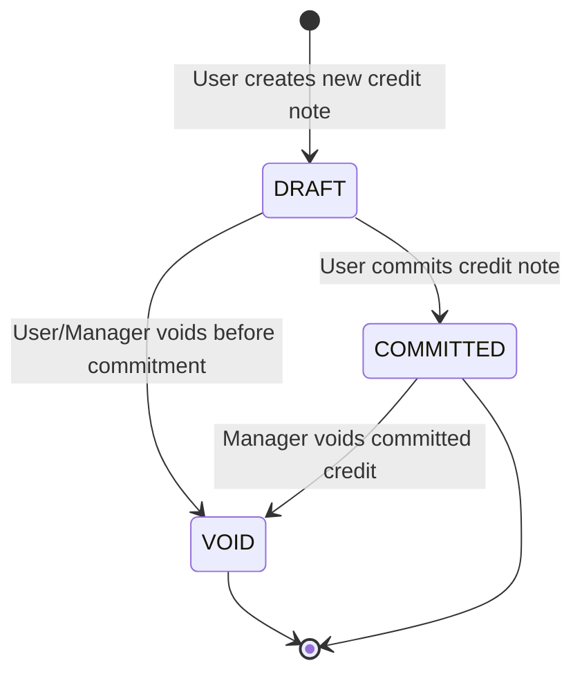

**Status Properties Table**:

| Status | Editable | Deletable | Financial Impact | Stock Movements | Journal Entries | Can Commit |
|--------|----------|-----------|------------------|-----------------|-----------------|------------|
| DRAFT | Yes | Yes | None | None | None | Yes (direct) |
| COMMITTED | No (Immutable) | No | Yes | Generated (qty returns) | Posted | N/A |
| VOID | No (Read-only) | No (Preserved) | None | Reversing entries if was committed | Reversing entries if was committed | N/A |

**Status Descriptions**:

**DRAFT**:
- Initial state when credit note first created
- Fully editable - all fields and items can be modified
- Can be deleted without restriction
- No approval required - can be committed directly
- No impact on financials or inventory
- Common for work-in-progress credits

**COMMITTED**:
- Credit note committed to general ledger
- Immutable - no edits allowed
- Cannot be deleted (must void instead)
- Journal entries created and posted
- Stock movements generated (for quantity returns)
- Vendor payable balance reduced
- Can only be voided (with reversals)

**VOID**:
- Cancelled credit note
- Read-only - cannot edit or delete
- Preserved for audit trail
- If previously COMMITTED, reversing entries created
- If never committed, just marked void
- Void reason recorded and visible
- No financial or inventory impact

**Transition Rules**:
- DRAFT → COMMITTED: All required fields complete, at least one item, lot selections (for qty returns), GL accounts configured, accounting period open
- COMMITTED → VOID: Manager permission required, void reason mandatory
- DRAFT → VOID: Manager permission (for cancellation before commitment)

---

## Commitment Workflow

**Purpose**: Document the commitment process with journal entry and stock movement generation

**Actors**: Finance Team, Procurement Manager, System

**Trigger**: User clicks "Commit" button on draft credit note

```mermaid
flowchart TD
    Start([User clicks Commit]) --> ValidateStatus{Status is<br>DRAFT?}

    ValidateStatus -->|No| ShowError1[Display error<br>Must be in draft status]
    ShowError1 --> End1([Remain in current status])

    ValidateStatus -->|Yes| EnterDate{Enter custom<br>commitment date?}

    EnterDate -->|Yes| InputDate[User enters<br>commitment date]
    EnterDate -->|No| UseDocDate[Use document date]
    InputDate --> ValidatePeriod
    UseDocDate --> ValidatePeriod

    ValidatePeriod{Accounting<br>period open?}
    ValidatePeriod -->|No| ShowError2[Display error<br>Period closed for date]
    ShowError2 --> End2([Remain DRAFT])

    ValidatePeriod -->|Yes| ValidateGL{GL accounts<br>configured?}
    ValidateGL -->|No| ShowError3[Display error<br>Missing GL configuration]
    ShowError3 --> End3([Remain DRAFT])

    ValidateGL -->|Yes| ValidateVendor{Vendor account<br>active?}
    ValidateVendor -->|No| ShowError4[Display error<br>Inactive vendor account]
    ShowError4 --> End4([Remain DRAFT])

    ValidateVendor -->|Yes| GenJournals[System generates<br>journal entries]

    GenJournals --> Primary[PRIMARY ENTRIES<br>1 DR Accounts Payable<br>2 CR Inventory qty returns<br>3 CR Input VAT]

    Primary --> CheckVariance{Cost variance<br>exists?}

    CheckVariance -->|Yes| Inventory[INVENTORY ENTRIES<br>4 DR or CR Cost Variance]
    CheckVariance -->|No| ValidateBalance
    Inventory --> ValidateBalance

    ValidateBalance{Total DR equals<br>Total CR?}
    ValidateBalance -->|No| ShowError5[Display error<br>Journal imbalance]
    ShowError5 --> End5([Remain DRAFT])

    ValidateBalance -->|Yes| CheckType{Credit type is<br>QUANTITY_RETURN?}

    CheckType -->|Yes| GenStock[System generates<br>stock movements]
    GenStock --> StockDetails[For each item<br>Transaction type CN Return<br>Location INV or CON<br>Lot number and<br>Qty Negative value and<br>Unit cost calculated and<br>Reference CN number]
    StockDetails --> CommitAll

    CheckType -->|No AMOUNT_DISCOUNT| CommitAll

    CommitAll[Commit all transactions<br>atomically]
    CommitAll --> PostJE[Post journal entries<br>to Finance module]

    PostJE --> PostStock{Stock movements?}
    PostStock -->|Yes| PostInv[Post stock movements<br>to Inventory module]
    PostStock -->|No| UpdatePayable
    PostInv --> UpdatePayable

    UpdatePayable[Reduce vendor<br>payable balance]
    UpdatePayable --> SetCommitted[Set status to COMMITTED]
    SetCommitted --> AssignRef[Assign commitment reference<br>and commitment date]

    AssignRef --> LockCN[Lock credit note<br>from edits]
    LockCN --> LogCommit[Log commitment in<br>audit trail]
    LogCommit --> NotifyUsers[Notify finance team<br>and requester]
    NotifyUsers --> Success([Status COMMITTED<br>Commitment complete])

    style Start fill:#cce5ff,stroke:#0066cc,stroke-width:2px,color:#000
    style Success fill:#ccffcc,stroke:#00cc00,stroke-width:2px,color:#000
    style End1 fill:#ffe0b3,stroke:#cc6600,stroke-width:2px,color:#000
    style End2 fill:#ffe0b3,stroke:#cc6600,stroke-width:2px,color:#000
    style End3 fill:#ffe0b3,stroke:#cc6600,stroke-width:2px,color:#000
    style End4 fill:#ffe0b3,stroke:#cc6600,stroke-width:2px,color:#000
    style End5 fill:#ffe0b3,stroke:#cc6600,stroke-width:2px,color:#000
    style ShowError1 fill:#ffcccc,stroke:#cc0000,stroke-width:2px,color:#000
    style ShowError2 fill:#ffcccc,stroke:#cc0000,stroke-width:2px,color:#000
    style ShowError3 fill:#ffcccc,stroke:#cc0000,stroke-width:2px,color:#000
    style ShowError4 fill:#ffcccc,stroke:#cc0000,stroke-width:2px,color:#000
    style ShowError5 fill:#ffcccc,stroke:#cc0000,stroke-width:2px,color:#000
```

**Journal Entry Structure**:

**Primary Entries Group**:
1. **DR Accounts Payable (2100)**: Credit total amount
   - Reduces vendor payable balance
   - Department: Purchasing (PUR)

2. **CR Inventory (1140)**: Net inventory value (quantity returns only)
   - Reduces inventory value
   - Department: Warehouse (WHS)
   - Amount: Σ(return qty × calculated unit cost)

3. **CR Input VAT (1240)**: Tax amount
   - Reduces input VAT credit
   - Department: Accounting (ACC)
   - Tax code: VAT with rate

**Inventory Entries Group** (if cost variance exists):
4. **DR/CR Cost Variance Account**: Variance amount
   - Department: Warehouse (WHS)
   - Amount: (current cost - calculated unit cost) × return qty
   - DR if loss (current < calculated), CR if gain (current > calculated)

**Workflow Steps**:

1. **Start**: User clicks "Commit" button
2. **Validate Status**: Must be DRAFT
3. **Enter Date**: Optionally enter custom commitment date
4. **Validate Period**: Accounting period must be open for commitment date
5. **Validate GL**: All required GL accounts must be configured
6. **Validate Vendor**: Vendor account must be active
7. **Generate Journals**: System creates journal entry structure
8. **Primary Entries**: Create main GL entries
9. **Check Variance**: If cost variance exists (qty returns)
10. **Inventory Entries**: Create cost variance entries if applicable
11. **Validate Balance**: Total debits must equal total credits
12. **Check Type**: If quantity return, generate stock movements
13. **Generate Stock**: Create negative stock movement records
14. **Stock Details**: For each item/lot, create movement with lot number, negative qty, calculated unit cost
15. **Commit All**: Atomic transaction - all or nothing
16. **Post JE**: Post journal entries to Finance module
17. **Post Stock**: Post stock movements to Inventory module (if applicable)
18. **Update Payable**: Reduce vendor payable balance in Vendor module
19. **Set Committed**: Change status to COMMITTED
20. **Assign Reference**: Assign commitment date and journal voucher reference
21. **Lock**: Make credit note immutable
22. **Log**: Record commitment in audit trail with all details
23. **Notify**: Send email to finance team and requester
24. **Success**: Credit note committed successfully

**Error Handling**:
- If any validation fails: display error, remain in DRAFT status
- If journal imbalance: log error, notify administrator
- If inventory posting fails: rollback journal entries, remain DRAFT
- All operations are atomic (all succeed or all rollback)

---

## Inventory Costing Calculation Flow

**Purpose**: Document the inventory cost calculation for quantity returns using configured costing method (FIFO or Periodic Average)

**Actors**: System

**Trigger**: User selects lots and enters return quantities

**Note**: The costing method is configured at the system level (System Administration → Inventory Settings). The flow below shows both methods.

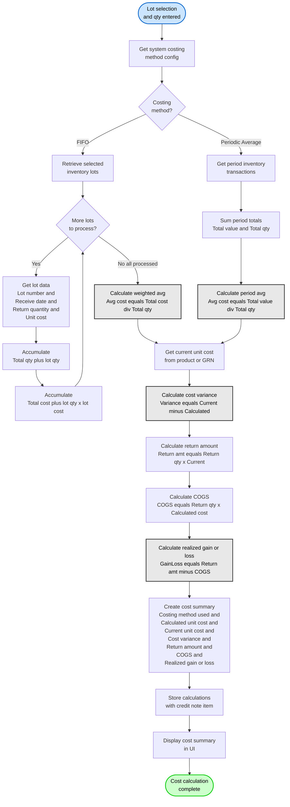

**Example 1: FIFO Costing Method**

**Scenario**: Returning 15 units, selected from 2 lots:
- Lot A: 5 units @ $387.50 (received 2024-05-23)
- Lot B: 10 units @ $400.00 (received 2024-09-15)
- Current cost: $400.00

**Calculations**:
1. **Total Received Qty**: 5 + 10 = 15 units
2. **Total Cost**: (5 × $387.50) + (10 × $400.00) = $1,937.50 + $4,000.00 = $5,937.50
3. **Weighted Avg Cost**: $5,937.50 / 15 = $395.83
4. **Current Unit Cost**: $400.00
5. **Cost Variance**: $400.00 - $395.83 = $4.17 per unit (loss on return)
6. **Return Amount**: 15 × $400.00 = $6,000.00
7. **COGS**: 15 × $395.83 = $5,937.50
8. **Realized Gain/Loss**: $6,000.00 - $5,937.50 = $62.50 (gain)

**Example 2: Periodic Average Costing Method**

**Scenario**: Returning 15 units
- Period inventory value: $50,000.00
- Period inventory quantity: 125 units
- Current cost: $400.00

**Calculations**:
1. **Period Average Cost**: $50,000.00 / 125 = $400.00
2. **Current Unit Cost**: $400.00
3. **Cost Variance**: $400.00 - $400.00 = $0.00 per unit (no variance)
4. **Return Amount**: 15 × $400.00 = $6,000.00
5. **COGS**: 15 × $400.00 = $6,000.00
6. **Realized Gain/Loss**: $6,000.00 - $6,000.00 = $0.00

**Business Rules**:
- Costing method configured at system level (FIFO or Periodic Average)
- For FIFO: All selected lots must have unit cost data
- For Periodic Average: Period transaction history required
- Calculated cost rounded to 2 decimal places for currency, 4 for costs
- Negative variance = gain (current cost lower than calculated)
- Positive variance = loss (current cost higher than calculated)
- Realized gain/loss impacts gross margin reporting

---

## System Integration Flow

**Purpose**: Document system integrations triggered when credit note is committed

**Actors**: Finance Module, Inventory Module, System

**Trigger**: Credit note commitment completes successfully

```mermaid
flowchart TD
    Start([Credit note<br>status to COMMITTED]) --> CheckType{Credit type?}

    CheckType -->|QUANTITY_RETURN| FinanceInt
    CheckType -->|AMOUNT_DISCOUNT| FinanceInt

    FinanceInt[Finance Module<br>Integration]
    FinanceInt --> PostJE[Post journal entries<br>to general ledger]

    PostJE --> UpdateAP[Update Accounts Payable<br>DR vendor account<br>Reduce payable balance]

    UpdateAP --> UpdateInventoryGL{Quantity<br>return?}
    UpdateInventoryGL -->|Yes| UpdateInvGL[Update Inventory GL<br>CR inventory account<br>Reduce inventory value]
    UpdateInventoryGL -->|No| UpdateVAT
    UpdateInvGL --> UpdateVAT

    UpdateVAT[Update Input VAT<br>CR input VAT account<br>Reduce tax credit]

    UpdateVAT --> CheckVarianceGL{Cost variance<br>exists?}
    CheckVarianceGL -->|Yes| UpdateVarianceGL[Update Cost Variance<br>DR or CR variance account]
    CheckVarianceGL -->|No| AssignJV
    UpdateVarianceGL --> AssignJV

    AssignJV[Assign journal<br>voucher reference]
    AssignJV --> FinanceComplete[Finance integration<br>complete]

    FinanceComplete --> CheckQty{Quantity<br>return?}

    CheckQty -->|Yes| InventoryInt[Inventory Module<br>Integration]
    CheckQty -->|No| NotifyComplete

    InventoryInt --> PostStock[Post stock movements<br>to inventory system]

    PostStock --> UpdateLots[Update inventory lots<br>Reduce available qty<br>per lot selected]

    UpdateLots --> UpdateLocations[Update location balances<br>Reduce qty per location]

    UpdateLocations --> UpdateValuation[Update inventory valuation<br>Reduce total value<br>by calculated cost]

    UpdateValuation --> RecordTrans[Record transaction history<br>Type CN Return<br>Reference CN number<br>Lots Applied lots]

    RecordTrans --> InventoryComplete[Inventory integration<br>complete]

    InventoryComplete --> NotifyComplete[Send notifications<br>Finance team and<br>Requester and<br>Accounts payable]

    NotifyComplete --> AuditLog[Record in audit trail<br>Posting timestamp and<br>Journal voucher ref and<br>Stock movements ref and<br>User who posted]

    AuditLog --> Success([Integration complete])

    style Start fill:#cce5ff,stroke:#0066cc,stroke-width:2px,color:#000
    style Success fill:#ccffcc,stroke:#00cc00,stroke-width:2px,color:#000
    style FinanceInt fill:#e0ccff,stroke:#6600cc,stroke-width:2px,color:#000
    style InventoryInt fill:#e0ccff,stroke:#6600cc,stroke-width:2px,color:#000
```

**Integration Points**:

**Finance Module**:
- **GL Posting**: Post journal entries to general ledger
- **Accounts Payable**: Reduce vendor payable balance by credit amount
- **Inventory GL**: Reduce inventory asset value (quantity returns only)
- **Input VAT**: Reduce input tax credit by tax amount
- **Cost Variance**: Record cost variance gain/loss (if applicable)
- **Journal Voucher**: Generate journal voucher reference for traceability

**Inventory Module** (Quantity Returns Only):
- **Stock Movements**: Post negative stock movement transactions
- **Lot Balances**: Reduce available quantity per lot selected
- **Location Balances**: Reduce inventory quantity per storage location
- **Inventory Valuation**: Reduce total inventory value by calculated cost
- **Transaction History**: Record credit note return in lot/location history

**Vendor Module** (Indirect):
- **Payable Balance**: Reduced via Finance module AP update
- **Vendor Credits**: Applied to vendor account for future payment offsets

**Integration Sequence**:
1. Finance module integration first (GL entries)
2. Inventory module integration second (stock movements)
3. All integrations atomic (all succeed or all rollback)
4. Notifications sent after all integrations complete
5. Audit logging captures all integration results

**Error Handling**:
- If Finance integration fails: Rollback credit note commitment, remain DRAFT
- If Inventory integration fails: Rollback Finance integration and commitment, remain DRAFT
- All operations atomic to prevent partial updates
- Detailed error logging for troubleshooting
- Administrator notification for integration failures

---

## Backend Server Action Flow Diagrams

This section documents the server-side workflows for backend requirements BR-BE-001 through BR-BE-014.

---

## Server Action CRUD Flow

**Purpose**: Document server-side Create, Read, Update, Delete operations for credit notes

**Actors**: Server Actions, Database, Validation Service, Audit Logger

**Reference**: BR-BE-001, TS-BE-001

```mermaid
flowchart TD
    subgraph CreateFlow['CREATE Credit Note']
        C1([createCreditNote<br>server action]) --> C2[Validate input data]
        C2 --> C3{Validation<br>passed?}
        C3 -->|No| C4[Return validation<br>errors]
        C3 -->|Yes| C5[Generate CN number<br>CN-YYMM-NNNN]
        C5 --> C6{Credit type?}
        C6 -->|QUANTITY_RETURN| C7[Calculate inventory<br>costs per method]
        C6 -->|AMOUNT_DISCOUNT| C8[Skip costing]
        C7 --> C9
        C8 --> C9[Calculate tax<br>amounts]
        C9 --> C10[(Insert credit_notes<br>record)]
        C10 --> C11[(Insert credit_note_items<br>records)]
        C11 --> C12{Qty return?}
        C12 -->|Yes| C13[(Insert applied_lots<br>records)]
        C12 -->|No| C14
        C13 --> C14[Log CREATE in<br>audit trail]
        C14 --> C15[Return created<br>credit note]
    end

    subgraph ReadFlow['READ Credit Note']
        R1([getCreditNote<br>server action]) --> R2[Validate user<br>read permission]
        R2 --> R3{Has access?}
        R3 -->|No| R4[Return 403<br>Forbidden]
        R3 -->|Yes| R5[(Fetch credit_notes<br>header)]
        R5 --> R6[(Fetch items with<br>product details)]
        R6 --> R7{Qty return?}
        R7 -->|Yes| R8[(Fetch applied_lots)]
        R7 -->|No| R9
        R8 --> R9[(Fetch attachments)]
        R9 --> R10{Status is<br>COMMITTED?}
        R10 -->|Yes| R11[(Fetch journal<br>entries)]
        R10 -->|No| R12
        R11 --> R12[Assemble complete<br>credit note]
        R12 --> R13[Return credit note<br>with relations]
    end

    subgraph UpdateFlow['UPDATE Credit Note']
        U1([updateCreditNote<br>server action]) --> U2{Status is<br>DRAFT?}
        U2 -->|No| U3[Return error<br>Only draft editable]
        U2 -->|Yes| U4[Validate edit<br>permission]
        U4 --> U5{Has permission?}
        U5 -->|No| U6[Return 403]
        U5 -->|Yes| U7[Validate input<br>data]
        U7 --> U8{Lots changed?}
        U8 -->|Yes| U9[Recalculate costs]
        U8 -->|No| U10
        U9 --> U10{Items changed?}
        U10 -->|Yes| U11[Recalculate tax]
        U10 -->|No| U12
        U11 --> U12[(Update records<br>in transaction)]
        U12 --> U13[Log UPDATE with<br>old and new values]
        U13 --> U14[Return updated<br>credit note]
    end

    subgraph DeleteFlow['DELETE Credit Note']
        D1([deleteCreditNote<br>server action]) --> D2{Status is<br>DRAFT?}
        D2 -->|No| D3[Return error<br>Cannot delete]
        D2 -->|Yes| D4[Validate delete<br>permission]
        D4 --> D5[Delete attachments<br>from storage]
        D5 --> D6[(Soft delete<br>Set deletedAt)]
        D6 --> D7[Log DELETE in<br>audit trail]
        D7 --> D8[Return success]
    end

    style C1 fill:#cce5ff,stroke:#0066cc,stroke-width:2px,color:#000
    style R1 fill:#cce5ff,stroke:#0066cc,stroke-width:2px,color:#000
    style U1 fill:#cce5ff,stroke:#0066cc,stroke-width:2px,color:#000
    style D1 fill:#cce5ff,stroke:#0066cc,stroke-width:2px,color:#000
    style C15 fill:#ccffcc,stroke:#00cc00,stroke-width:2px,color:#000
    style R13 fill:#ccffcc,stroke:#00cc00,stroke-width:2px,color:#000
    style U14 fill:#ccffcc,stroke:#00cc00,stroke-width:2px,color:#000
    style D8 fill:#ccffcc,stroke:#00cc00,stroke-width:2px,color:#000
    style C4 fill:#ffcccc,stroke:#cc0000,stroke-width:2px,color:#000
    style R4 fill:#ffcccc,stroke:#cc0000,stroke-width:2px,color:#000
    style U3 fill:#ffcccc,stroke:#cc0000,stroke-width:2px,color:#000
    style D3 fill:#ffcccc,stroke:#cc0000,stroke-width:2px,color:#000
```

**CRUD Operations Summary**:

| Operation | Validation | Transaction | Audit Log |
|-----------|------------|-------------|-----------|
| Create | Field + business rules | Single atomic | CREATE action |
| Read | User permission + location access | Read-only | None |
| Update | Status DRAFT + permission | Single atomic | UPDATE with diff |
| Delete | Status DRAFT + permission | Soft delete | DELETE action |

---

## Commitment Transaction Flow

**Purpose**: Document the atomic server-side commitment transaction

**Actors**: Server Action, Database, Finance Module, Inventory Module, Audit Logger

**Reference**: BR-BE-003, TS-BE-003

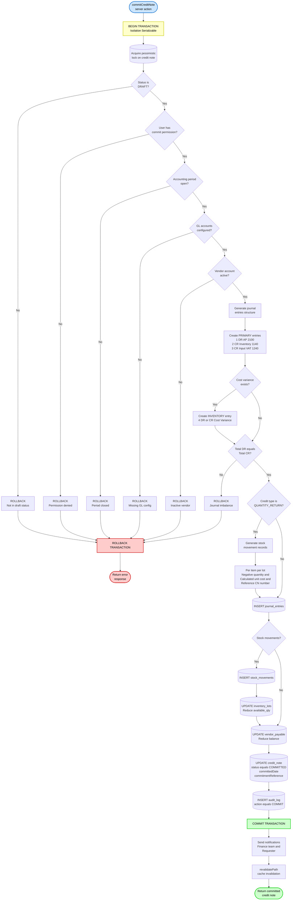

**Transaction Properties**:

| Property | Value | Rationale |
|----------|-------|-----------|
| Isolation Level | Serializable | Prevent concurrent commitment |
| Locking | Pessimistic | Exclusive lock during transaction |
| Atomicity | All-or-nothing | Rollback on any failure |
| Consistency | Validated | Journal balance check |
| Durability | Committed | Persisted on success |

---

## Void Transaction Flow

**Purpose**: Document the atomic server-side void transaction with reversing entries

**Actors**: Server Action, Database, Finance Module, Inventory Module, Audit Logger

**Reference**: BR-BE-004, TS-BE-004

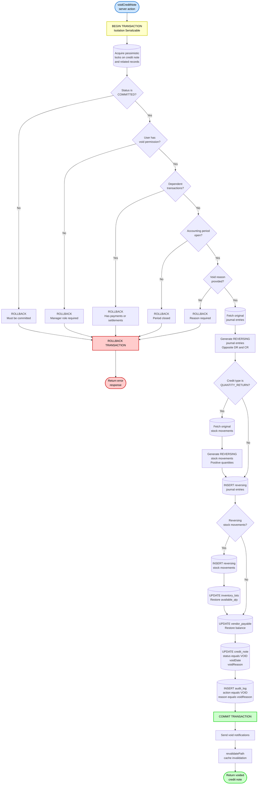

**Reversing Entry Rules**:

| Original Entry | Reversing Entry |
|----------------|-----------------|
| DR Account X, Amount Y | CR Account X, Amount Y |
| CR Account X, Amount Y | DR Account X, Amount Y |
| Negative stock qty | Positive stock qty |

---

## Vendor and GRN Fetch Flow

**Purpose**: Document server-side data fetching for vendor and GRN selection

**Actors**: Server Actions, Database, Access Control

**Reference**: BR-BE-002, TS-BE-002

```mermaid
flowchart TD
    subgraph VendorSearch['searchVendors Action']
        VS1([searchVendors<br>server action]) --> VS2[Parse search<br>input parameters]
        VS2 --> VS3[Build query with<br>name or code filter]
        VS3 --> VS4[Apply active<br>status filter]
        VS4 --> VS5[Apply user<br>access restrictions]
        VS5 --> VS6[(Execute paginated<br>query)]
        VS6 --> VS7[Map to<br>VendorSummary]
        VS7 --> VS8[Return search<br>response with<br>pagination]
    end

    subgraph GRNSearch['searchGRNsByVendor Action']
        GS1([searchGRNsByVendor<br>server action]) --> GS2[Validate vendor ID<br>provided]
        GS2 --> GS3{Vendor ID<br>valid?}
        GS3 -->|No| GS4[Return error<br>Invalid vendor]
        GS3 -->|Yes| GS5[Build query<br>by vendor ID]
        GS5 --> GS6[Apply search term<br>to GRN number or invoice]
        GS6 --> GS7[Apply date range<br>filter]
        GS7 --> GS8[Filter status equals<br>POSTED only]
        GS8 --> GS9[(Execute paginated<br>query)]
        GS9 --> GS10[Map to<br>GRNSummary]
        GS10 --> GS11[Return search<br>response]
    end

    subgraph GRNItems['getGRNItemsWithLots Action']
        GI1([getGRNItemsWithLots<br>server action]) --> GI2[(Fetch GRN<br>items)]
        GI2 --> GI3[For each item]
        GI3 --> GI4[(Fetch inventory lots<br>where available qty gt 0)]
        GI4 --> GI5[Include lot cost<br>for costing]
        GI5 --> GI6{More items?}
        GI6 -->|Yes| GI3
        GI6 -->|No| GI7[Return items<br>with lot arrays]
    end

    subgraph LotsByProduct['getAvailableLotsByProduct Action']
        LP1([getAvailableLotsByProduct<br>server action]) --> LP2[(Query inventory<br>lots for product)]
        LP2 --> LP3{Location<br>filter?}
        LP3 -->|Yes| LP4[Filter by<br>location ID]
        LP3 -->|No| LP5
        LP4 --> LP5[Filter where<br>available qty gt 0]
        LP5 --> LP6[Order by receive<br>date ASC]
        LP6 --> LP7[Return lot list<br>with costs]
    end

    style VS1 fill:#cce5ff,stroke:#0066cc,stroke-width:2px,color:#000
    style GS1 fill:#cce5ff,stroke:#0066cc,stroke-width:2px,color:#000
    style GI1 fill:#cce5ff,stroke:#0066cc,stroke-width:2px,color:#000
    style LP1 fill:#cce5ff,stroke:#0066cc,stroke-width:2px,color:#000
    style VS8 fill:#ccffcc,stroke:#00cc00,stroke-width:2px,color:#000
    style GS11 fill:#ccffcc,stroke:#00cc00,stroke-width:2px,color:#000
    style GI7 fill:#ccffcc,stroke:#00cc00,stroke-width:2px,color:#000
    style LP7 fill:#ccffcc,stroke:#00cc00,stroke-width:2px,color:#000
    style GS4 fill:#ffcccc,stroke:#cc0000,stroke-width:2px,color:#000
```

**Data Access Patterns**:

| Action | Index Used | Access Control |
|--------|------------|----------------|
| searchVendors | vendor_name, vendor_code | User's vendor access |
| searchGRNsByVendor | vendor_id, grn_number | Posted GRNs only |
| getGRNItemsWithLots | grn_id, product_id | Via GRN access |
| getAvailableLotsByProduct | product_id, location_id | Lot availability |

---

## Audit Logging Flow

**Purpose**: Document immutable audit trail operations for all credit note actions

**Actors**: Audit Logger Service, Database

**Reference**: BR-BE-010, TS-BE-010

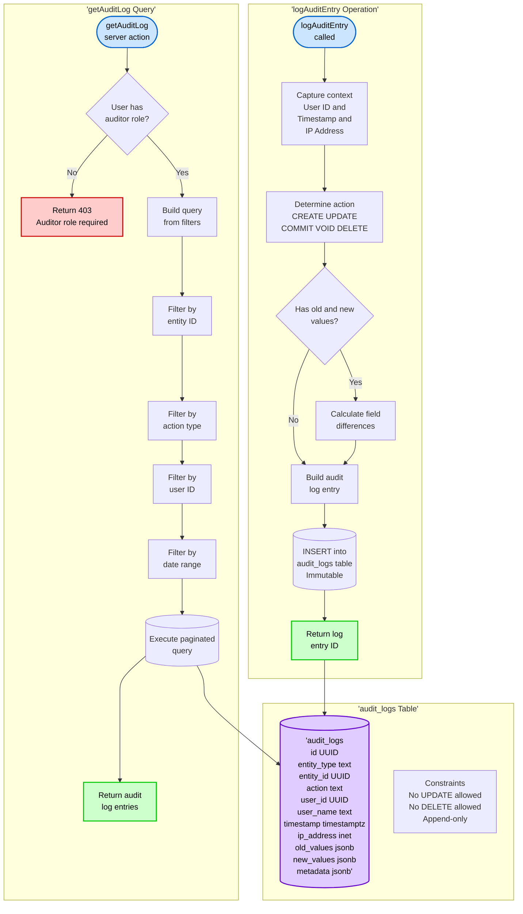

**Audit Log Actions**:

| Action | Trigger | Data Captured |
|--------|---------|---------------|
| CREATE | Credit note created | All field values |
| UPDATE | Draft modified | Old/new field values |
| COMMIT | Committed to GL | Commitment date, reference |
| VOID | Credit note voided | Void reason, date |
| DELETE | Soft deleted | Deletion timestamp |

**Immutability Enforcement**:
- Database trigger prevents UPDATE on audit_logs
- Database trigger prevents DELETE on audit_logs
- Append-only design for compliance
- Retention: 7 years minimum per policy

---

## Summary

**Key Workflows Documented**:
1. **Quantity Return Creation**: Complex flow with vendor/GRN/lot selection, inventory costing (FIFO or Periodic Average)
2. **Amount Discount Creation**: Simpler flow for pricing adjustments without returns
3. **State Transitions**: Three status states (DRAFT, COMMITTED, VOID) with defined transition rules
4. **Commitment Workflow**: GL posting with journal entry and stock movement generation
5. **Inventory Costing Calculation**: Cost calculation using configured method (FIFO or Periodic Average) for accurate inventory valuation
6. **System Integration**: Finance and inventory module integrations on commitment

**Backend Server Action Workflows** (BR-BE-001 through BR-BE-014):
7. **Server Action CRUD Flow**: Create, Read, Update, Delete operations with validation and audit
8. **Commitment Transaction Flow**: Atomic transaction with journal entries, stock movements, and rollback
9. **Void Transaction Flow**: Reversing entries generation with full transaction rollback
10. **Vendor and GRN Fetch Flow**: Data fetching for selection workflows
11. **Audit Logging Flow**: Immutable audit trail operations

**Process Complexity**:
- Quantity returns: High complexity (lot selection, inventory costing, inventory updates)
- Amount discounts: Medium complexity (simpler, no inventory impact)
- Commitment: High complexity (multi-system integration, atomic transactions)
- Backend transactions: High complexity (serializable isolation, pessimistic locking)

**Integration Points**:
- GRN Module: Source data for credit notes
- Inventory Module: Lot data, stock movement posting
- Finance Module: GL posting, vendor payable updates
- Vendor Module: Payable balance adjustments
- Audit Module: Immutable audit trail logging

---

**Document Control**:
- **Classification**: Internal Use
- **Distribution**: Development Team, Procurement Team, Finance Team, Business Analysts
- **Review Cycle**: Quarterly or when workflows change
- **Approval**: Business Process Owner, Technical Lead

**End of Document**
