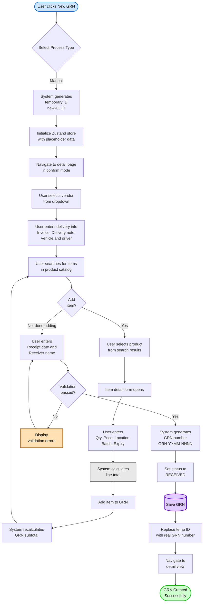
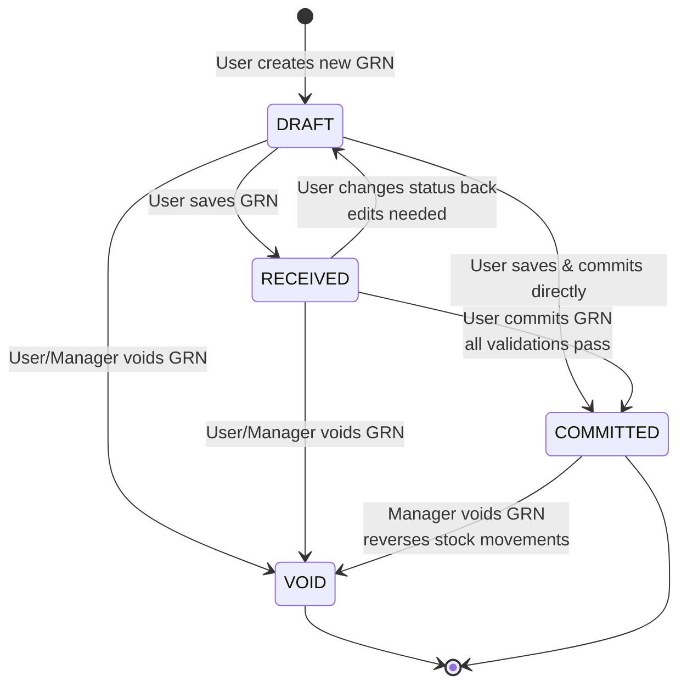
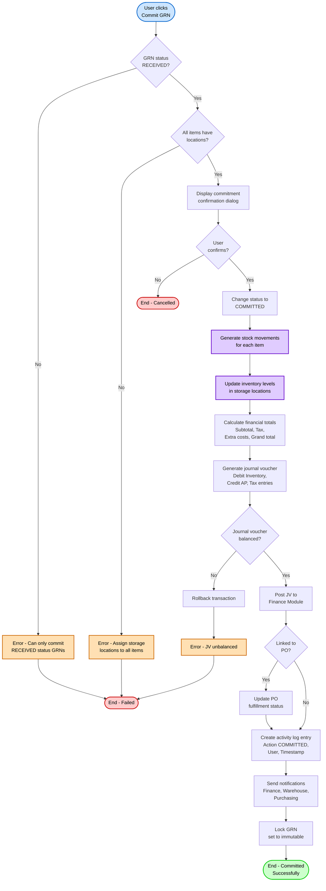
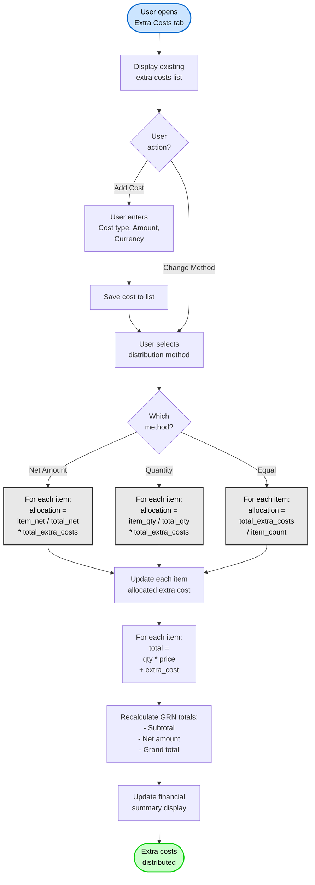
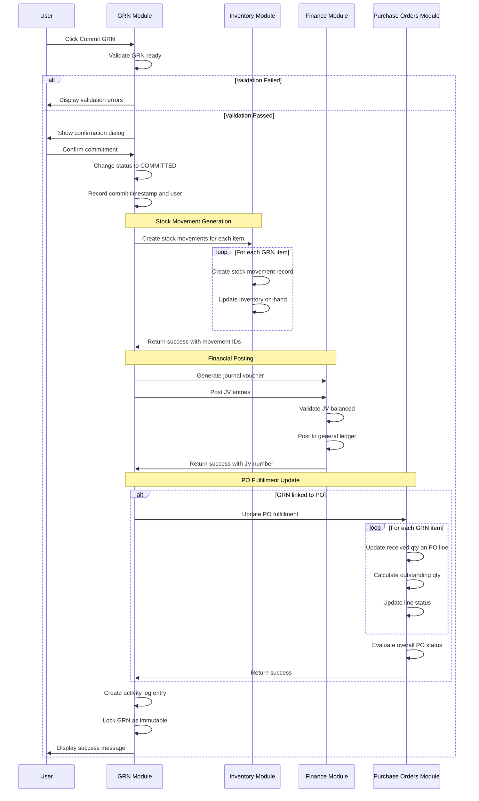

# Flow Diagrams: Goods Received Note

## Module Information
- **Module**: Procurement
- **Sub-Module**: Goods Received Note (GRN)
- **Version**: 1.0.5
- **Last Updated**: 2025-12-03
- **Owner**: Procurement Team
- **Status**: Approved

## Document History
| Version | Date | Author | Changes |
|---------|------|--------|---------|
| 1.1.0 | 2025-12-10 | Documentation Team | Standardized reference number format (XXX-YYMM-NNNN) |
| 1.0.5 | 2025-12-03 | Documentation Team | Added costing method context (FIFO or Periodic Average configurable at system level) |
| 1.0.4 | 2025-12-03 | Documentation Team | Mermaid 8.8.2 compatibility: Removed colons, equals signs, and parentheses from flowchart node labels in Diagrams 1, 2, 4, 5 |
| 1.0.3 | 2025-12-03 | Documentation Team | Mermaid 8.8.2 compatibility: Removed parentheses from sequenceDiagram messages, replaced special characters in flowcharts |
| 1.0.2 | 2025-12-03 | Documentation Team | Mermaid 8.8.2 compatibility: Removed unsupported note syntax from state diagram, converted to table format |
| 1.0.1 | 2025-12-03 | Documentation Team | Verified coverage against BR requirements (FR-GRN-001 to FR-GRN-017) |
| 1.0.0 | 2025-01-11 | Documentation Team | Initial version from workflow analysis |

---

## Overview

This document provides visual representations of the key workflows, data flows, and state transitions in the Goods Received Note module. The diagrams illustrate two primary creation workflows (PO-based and manual), GRN lifecycle state transitions, item management processes, commitment workflows, and system integrations discovered in the actual codebase.

**Related Documents**:
- [Business Requirements](./BR-goods-received-note.md)
- [Use Cases](./UC-goods-received-note.md)
- [Technical Specification](./TS-goods-received-note.md)
- [Data Definition](./DD-goods-received-note.md)
- [Validations](./VAL-goods-received-note.md)

---

## Diagram Index

| Diagram | Type | Purpose | Complexity |
|---------|------|---------|------------|
| [PO-Based GRN Creation](#po-based-grn-creation-flow) | Process | Create GRN from purchase order | High |
| [Manual GRN Creation](#manual-grn-creation-flow) | Process | Create standalone GRN | Medium |
| [GRN State Transitions](#grn-state-transition-diagram) | State | Status lifecycle management | Medium |
| [GRN Commitment](#grn-commitment-workflow) | Workflow | Finalize GRN and update inventory | High |
| [Extra Cost Distribution](#extra-cost-distribution-flow) | Process | Allocate additional costs to items | Medium |
| [System Integration](#system-integration-flow) | Integration | Module integrations on commitment | High |

---

## PO-Based GRN Creation Flow

**Purpose**: Document the complete workflow for creating a Goods Received Note from existing Purchase Orders

**Multi-PO Support**: A single GRN can receive items from multiple POs. Each line item stores its own PO reference (purchaseOrderId, purchaseOrderItemId) rather than a single PO at header level.

**Actors**: Receiving Clerk, Purchasing Staff, System

**Trigger**: User clicks "New GRN" button and selects "From PO" option

```mermaid
flowchart TD
    Start([User clicks New GRN]) --> Select{Select Process Type}
    Select -->|From PO| VendorSelect[Select Vendor]

    VendorSelect --> LoadPOs[System loads<br>pending POs for vendor]
    LoadPOs --> DisplayPOs[Display pending<br>PO list]

    DisplayPOs --> SelectPO[User selects<br>PO lines to receive<br>from one or more POs]
    SelectPO --> CreateGRN[System creates GRN<br>with line-level PO references]

    CreateGRN --> PrePopulate[Pre-populate<br>Vendor info, Items,<br>Ordered qty, Prices]

    PrePopulate --> EnterQty[User enters<br>received quantities]
    EnterQty --> AutoDisc[System auto-detects<br>discrepancies]

    AutoDisc --> CheckDisc{Has<br>discrepancies?}
    CheckDisc -->|Yes| FlagItems[Flag items<br>with discrepancy indicator]
    CheckDisc -->|No| EnterDelivery
    FlagItems --> EnterDelivery[User enters delivery info<br>Invoice, Delivery note,<br>Vehicle and driver]

    EnterDelivery --> Validate{Validation<br>passed?}
    Validate -->|No| ShowErrors[Display<br>validation errors]
    ShowErrors --> EnterQty

    Validate -->|Yes| GenNumber[System generates<br>GRN number<br>GRN-YYMM-NNNN]
    GenNumber --> SetStatus[Set status to<br>RECEIVED]

    SetStatus --> SaveGRN[(Save GRN to<br>Zustand store)]
    SaveGRN --> NavDetail[Navigate to<br>GRN detail page]
    NavDetail --> Success([GRN Created<br>Successfully])

    style Start fill:#cce5ff,stroke:#0066cc,stroke-width:2px,color:#000
    style Success fill:#ccffcc,stroke:#00cc00,stroke-width:2px,color:#000
    style ShowErrors fill:#ffe0b3,stroke:#cc6600,stroke-width:2px,color:#000
    style FlagItems fill:#ffe0b3,stroke:#cc6600,stroke-width:2px,color:#000
    style SaveGRN fill:#e0ccff,stroke:#6600cc,stroke-width:2px,color:#000
```

**Flow Steps**:

1. **Start**: User navigates to GRN list and clicks "New GRN" button
2. **Select Process Type**: Dialog appears with two options: "From PO" or "Manual"
3. **User selects "From PO"**: Routes to PO-based creation workflow
4. **Vendor Selection**: System navigates to `/goods-received-note/new/vendor-selection` page
5. **Load POs**: System filters purchase orders for selected vendor with status allowing receipt
6. **Display POs**: Pending PO list shown with PO number, date, items, amounts
7. **Select PO Lines**: User selects one or more PO lines to receive (checkboxes)
8. **Create GRN**: System creates new GRN object in Zustand store
9. **Pre-populate**: System fills GRN with PO data (vendor, items, ordered quantities, prices)
10. **Enter Quantities**: User enters actual received, rejected, damaged quantities for each item
11. **Auto-detect Discrepancies**: System compares received vs ordered, flags mismatches
12. **Flag Items**: Items with discrepancies get visual indicator and hasDiscrepancy flag set
13. **Enter Delivery Info**: User enters invoice number/date, delivery note, vehicle, driver
14. **Validation**: System validates required fields, quantity rules, date constraints
    - If invalid: Show specific error messages, return to entry
    - If valid: Continue to save
15. **Generate GRN Number**: System assigns unique sequential number GRN-2401-001
16. **Set Status**: GRN status set to RECEIVED (skipping DRAFT for PO-based)
17. **Save GRN**: Data saved to Zustand store (future: database via server action)
18. **Navigate**: Route to GRN detail page for review and further actions
19. **Success**: GRN created and ready for review or commitment

**Exception Handling**:
- No pending POs for vendor: Display message, allow manual GRN creation
- Validation failures: Inline error messages, prevent save
- PO already fully received: Warning message, allow over-receipt with confirmation

---

## Manual GRN Creation Flow

**Purpose**: Document the workflow for creating a standalone GRN without a purchase order reference

**Actors**: Receiving Clerk, Purchasing Staff, System

**Trigger**: User clicks "New GRN" button and selects "Manual" option

**Flow Steps**:

1. **Start**: User clicks "New GRN" button from list page
2. **Select Process Type**: Dialog with "From PO" or "Manual" options
3. **User selects "Manual"**: Routes to manual creation workflow
4. **Generate Temporary ID**: System creates temporary ID like "new-123e4567-e89b-12d3..."
5. **Initialize Store**: Zustand store initialized with placeholder GRN data
6. **Navigate**: Route to `/goods-received-note/[tempId]?mode=confirm`
7. **Select Vendor**: User picks vendor from dropdown (not pre-populated)
8. **Enter Delivery Info**: User manually enters invoice details, delivery note, vehicle, driver
9. **Search Items**: User searches product catalog by name, code, or description
10. **Add Item Loop**: User repeatedly adds items until all received goods documented
11. **Select Product**: User picks product from search results
12. **Item Form**: Item detail dialog opens for detailed entry
13. **Enter Item Details**: User enters quantities, price, location, traceability info
14. **Calculate Line**: System computes item total = quantity × price
15. **Add to List**: Item added to GRN items array
16. **Update Total**: GRN subtotal recalculated as sum of all item totals
17. **Done Adding**: User finished adding all items
18. **Enter Receipt Info**: User enters receipt date and receiver name
19. **Validation**: System validates required fields, business rules
    - At least one item required
    - All items must have storage locations
    - Quantities must be > 0
20. **Generate GRN Number**: Assign real GRN number
21. **Set Status**: Status set to RECEIVED
22. **Save**: Data persisted (currently: Zustand store, future: database)
23. **Update ID**: Temp ID replaced with real GRN number
24. **Navigate**: Route to detail page with real GRN ID
25. **Success**: Manual GRN created successfully

**Exception Handling**:
- Item not in catalog: User must contact admin to add product first
- Missing required fields: Inline validation errors with field highlighting
- No items added: Prevent save with error "At least one item required"

---

## GRN State Transition Diagram

**Purpose**: Document the valid status transitions and rules governing GRN lifecycle

**Status Properties**:

| Status | Editable | Deletable | Inventory Impact | Stock Movements | Journal Voucher |
|--------|----------|-----------|------------------|-----------------|-----------------|
| DRAFT | Yes | Yes | None | None | - |
| RECEIVED | Yes | No (can void) | None | None | - |
| COMMITTED | No (Immutable) | No (can void) | Yes | Generated | Posted |
| VOID | No (Read-only) | No (Preserved) | None | Reversing entries if was committed | - |

**Status Descriptions**:

**DRAFT**:
- Initial state when GRN first created
- Fully editable - all fields can be modified
- Can be deleted without restriction
- No impact on inventory or finances
- Common for work-in-progress receiving

**RECEIVED**:
- Goods physically received and documented
- Still editable for corrections
- Cannot be deleted (must void instead)
- No inventory or financial impact yet
- Awaiting final review and commitment

**COMMITTED**:
- GRN finalized and locked
- Immutable - no edits allowed
- Stock movements generated and inventory updated
- Journal voucher posted to finance
- Can only be voided (with reversals)
- Permanent record of goods receipt

**VOID**:
- Cancelled GRN preserved for audit
- Read-only - cannot edit or delete
- No inventory or financial impact
- If previously COMMITTED, reversing entries created
- Reason for void recorded in notes/activity log

**Transition Rules**:
- DRAFT → RECEIVED: Basic validation (vendor, items, quantities)
- DRAFT/RECEIVED → COMMITTED: Full validation (locations assigned)
- Any → VOID: Manager permission required (except DRAFT)
- COMMITTED → VOID: Generates reversing stock movements and journal entries
- No transitions allowed FROM VOID or COMMITTED except VOID

---

## GRN Commitment Workflow

**Purpose**: Document the workflow for finalizing a GRN, including validations, stock movements, and financial postings

**Actors**: Warehouse Staff, Procurement Manager, Inventory System, Finance System

**Trigger**: User clicks "Commit GRN" button on RECEIVED status GRN

**Flow Steps**:

1. **Start**: User clicks "Commit GRN" button
2. **Check Status**: Verify GRN status is RECEIVED
3. **Check Locations**: Verify all items have storage locations assigned
4. **Confirmation**: Display dialog with commitment impact summary
5. **User Confirms**: User reviews and confirms commitment
6. **Change Status**: Update GRN status to COMMITTED
7. **Generate Stock Movements**: Create stock movement record for each item
    - Movement type: RECEIPT
    - From: Receiving area
    - To: Assigned storage location
    - Quantity: Received quantity
    - Cost: Unit price + allocated extra cost
8. **Update Inventory**: Increment on-hand quantities in storage locations; create inventory layers with unit cost for valuation (used by system-configured costing method: FIFO or Periodic Average, set in System Administration → Inventory Settings)
9. **Calculate Finance**: Compute all financial totals with tax and extra costs
10. **Generate JV**: Create journal voucher with balanced entries
11. **Validate JV**: Ensure total debits = total credits
12. **Post JV**: Submit journal voucher to Finance Module
13. **Update PO**: If linked to PO, update fulfillment quantities and status
14. **Log Activity**: Record commitment event in activity log
15. **Notify**: Send notifications to finance, warehouse, purchasing teams
16. **Lock GRN**: Set GRN to immutable state
17. **Success**: Commitment complete, GRN now read-only

**Rollback Scenarios**:
- Stock movement generation fails: Rollback status change
- Inventory update fails: Rollback stock movements and status
- Journal voucher unbalanced: Rollback all changes
- Finance posting fails: Rollback all changes

---

## Extra Cost Distribution Flow

**Purpose**: Document how extra costs (freight, handling, insurance) are allocated across received items

**Actors**: Purchasing Staff, System

**Trigger**: User adds extra cost or changes distribution method

**Distribution Methods**:

**By Net Amount** (Proportional to item value):
- Formula: `item_allocation = (item_net_amount ÷ total_net_amount) × total_extra_costs`
- Use case: Distributes costs proportional to item value
- Example: Item worth $1000 gets more freight allocation than item worth $100

**By Quantity** (Proportional to item quantity):
- Formula: `item_allocation = (item_quantity ÷ total_quantity) × total_extra_costs`
- Use case: Distributes costs proportional to quantity received
- Example: 50 units gets more allocation than 10 units

**Equal Distribution** (Same for all items):
- Formula: `item_allocation = total_extra_costs ÷ item_count`
- Use case: Each item gets equal share regardless of value or quantity
- Example: 3 items split $300 freight = $100 each

---

## System Integration Flow

**Purpose**: Document the system-to-system integrations triggered when GRN is committed

**Actors**: GRN Module, Inventory Module, Finance Module, PO Module

**Trigger**: GRN status changes to COMMITTED

**Integration Points**:

**1. Inventory Module Integration**:
- **Trigger**: GRN committed
- **Data Sent**: Item ID, quantity, location, cost, lot/batch numbers
- **Actions**: Generate stock movements, update on-hand quantities
- **Response**: Stock movement IDs, updated inventory levels
- **Rollback**: If fails, revert GRN status

**2. Finance Module Integration**:
- **Trigger**: GRN committed
- **Data Sent**: Financial totals, GL account codes, tax amounts, departments
- **Actions**: Create journal voucher, post to GL, update AP
- **Response**: Journal voucher number, posting confirmation
- **Rollback**: If fails, reverse stock movements, revert GRN status

**3. Purchase Orders Module Integration**:
- **Trigger**: GRN committed (only for PO-based GRNs)
- **Data Sent**: PO ID, PO line IDs, received quantities
- **Actions**: Update PO line fulfillment, calculate outstanding quantities, update PO status
- **Response**: Updated PO status (Partially/Fully Received)
- **Rollback**: Non-critical - if fails, log warning but allow GRN commitment

---

## Appendix

### Diagram Color Coding

- **Blue**: Start/trigger points
- **Green**: Success/completion points
- **Red**: Failure/error end points
- **Orange**: Error handling/warnings
- **Gray**: Standard processing steps
- **Purple**: Database/persistence operations

### Related Documents
- [Business Requirements](./BR-goods-received-note.md)
- [Use Cases](./UC-goods-received-note.md)
- [Technical Specification](./TS-goods-received-note.md)
- [Data Definition](./DD-goods-received-note.md)
- [Validations](./VAL-goods-received-note.md)

---

**Document End**

> 📝 **Note to Reviewers**:
> - All workflows documented from actual code analysis
> - Mermaid diagrams represent implemented flows
> - No fictional workflows added
> - Review diagrams against actual user journeys
