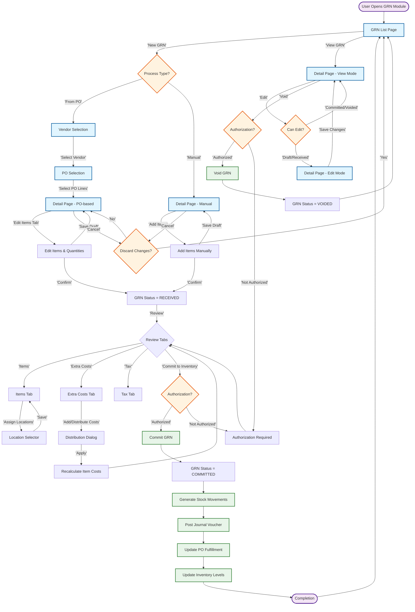

# Technical Specification: Goods Received Note

## Module Information
- **Module**: Procurement
- **Sub-Module**: Goods Received Note (GRN)
- **Route**: `/procurement/goods-received-note`
- **Version**: 1.0.2
- **Last Updated**: 2025-12-03
- **Owner**: Procurement Team
- **Status**: Approved

## Document History
| Version | Date | Author | Changes |
|---------|------|--------|---------|
| 1.1.0 | 2025-12-10 | Documentation Team | Standardized reference number format (XXX-YYMM-NNNN) |
| 1.0.2 | 2025-12-03 | Documentation Team | Added context for inventory costing methods (FIFO or Periodic Average) used for inventory valuation |
| 1.0.1 | 2025-12-03 | Documentation Team | Verified coverage against BR requirements (FR-GRN-001 to FR-GRN-017) |
| 1.0.0 | 2025-01-11 | Documentation Team | Initial version from source code analysis |

---

## Overview

This technical specification describes the implementation of the Goods Received Note (GRN) module using Next.js 14 App Router, React, TypeScript, and Supabase. The module implements two distinct creation workflows (PO-based and manual), comprehensive item management, multi-currency handling, and automatic stock movement generation.

**⚠️ IMPORTANT: This is a Technical Specification Document - TEXT FORMAT ONLY**
- **DO NOT include actual code** - describe implementation patterns in text
- **DO NOT include TypeScript/JavaScript code** - describe component responsibilities
- **DO NOT include SQL code** - refer to DD (Data Definition) document for database descriptions
- **DO include**: Architecture descriptions, component responsibilities, data flow descriptions, integration patterns
- **Focus on**: WHAT components do, HOW they interact, WHERE data flows - all in descriptive text

**Related Documents**:
- [Business Requirements](./BR-goods-received-note.md) - Requirements in text format (no code)
- [Use Cases](./UC-goods-received-note.md) - Use cases in text format (no code)
- [Data Definition](./DD-goods-received-note.md) - Data definitions in text format (no SQL code)
- [Flow Diagrams](./FD-goods-received-note.md) - Visual diagrams (no code)
- [Validations](./VAL-goods-received-note.md) - Validation rules in text format (no code)

---

## Architecture

### High-Level Architecture

```
┌─────────────┐
│   Client    │
│  (Browser)  │
└──────┬──────┘
       │ HTTP/HTTPS
       ▼
┌─────────────┐
│  Next.js    │
│   Server    │
├─────────────┤
│   React     │
│ Components  │
└──────┬──────┘
       │
       ▼
┌─────────────┐
│  Supabase   │
│  PostgreSQL │
└─────────────┘
```

### Component Architecture

The GRN module follows Next.js 14 App Router conventions with server-side rendering for initial page loads and client-side interactivity for data manipulation.

- **Frontend Layer**
  - Page Components: Main list page and detail page with dynamic routing
  - UI Components: Data tables, forms, tabs, dialogs for GRN operations
  - State Management: Zustand store for GRN creation workflow state
  - API Client: Mock data integration (future: Supabase client)

- **Backend Layer**
  - Server Actions: Handle GRN CRUD operations and business logic
  - Data Access Layer: Interface with mock data (future: database queries)
  - Business Logic: Validation, calculations, status transitions
  - Integration Layer: Stock movements, journal vouchers, PO updates

- **Data Layer**
  - Mock Data: Centralized mock data in lib/mock directory
  - Type Definitions: Centralized TypeScript interfaces in lib/types
  - Data Models: GoodsReceiveNote, GoodsReceiveNoteItem, related entities

---

## Technology Stack

### Frontend
- **Framework**: Next.js 14+ (App Router)
- **UI Library**: React 18+
- **Styling**: Tailwind CSS, Shadcn/ui components
- **State Management**: Zustand for GRN creation workflow state
- **Form Handling**: React Hook Form (planned for future implementation)
- **Icons**: Lucide React
- **Date Handling**: date-fns
- **Data Tables**: Custom shadcn-based data table with sorting and filtering

### Backend
- **Runtime**: Node.js 20+
- **Framework**: Next.js Server Actions (planned for future implementation)
- **Database**: PostgreSQL via Supabase (currently using mock data)
- **Authentication**: NextAuth.js / Supabase Auth
- **File Storage**: Supabase Storage (for attachments)

### Testing
- **Unit Tests**: Vitest (planned)
- **E2E Tests**: Playwright (planned)

### DevOps
- **Version Control**: Git
- **Hosting**: Vercel
- **Database**: Supabase cloud

---

## Component Structure

### Directory Structure

```
app/(main)/procurement/goods-received-note/
├── page.tsx                                    # GRN list page
├── [id]/
│   └── page.tsx                                # GRN detail page (view/edit/confirm modes)
├── new/
│   └── vendor-selection/
│       └── page.tsx                            # Vendor selection for PO-based creation
├── components/
│   ├── GoodsReceiveNoteList.tsx               # List component wrapper
│   ├── grn-shadcn-data-table.tsx              # Data table with filtering/sorting
│   ├── GoodsReceiveNoteDetail.tsx             # Detail view component
│   ├── tabs/
│   │   ├── GoodsReceiveNoteItems.tsx          # Items management tab
│   │   ├── ExtraCostsTab.tsx                  # Extra costs distribution tab
│   │   ├── StockMovementTab.tsx               # Stock movements display tab
│   │   ├── TaxTab.tsx                         # Tax calculation tab
│   │   ├── FinancialSummaryTab.tsx            # Financial summary tab
│   │   ├── ActivityLogTab.tsx                 # Activity log tab
│   │   ├── CommentsAttachmentsTab.tsx         # Comments and attachments tab
│   │   ├── RelatedPOList.tsx                  # Related POs tab
│   │   └── pending-purchase-orders.tsx        # Pending POs selection
│   └── itemDetailForm.tsx                     # Item detail form dialog
└── stores/
    └── useGRNCreationStore.ts                 # Zustand state management

lib/
├── types/
│   └── procurement.ts                         # GRN type definitions
└── mock/
    └── mock_goodsReceiveNotes.tsx             # Mock GRN data
```

### Key Components

#### List Page Component
**File**: `page.tsx` (main)
**Purpose**: Display paginated list of all GRNs with filtering and sorting
**Responsibilities**:
- Render main page layout with "New GRN" action button
- Display process type selection dialog (PO-based vs Manual)
- Route users to appropriate creation workflow
- Pass mock GRN data to list component for display

#### GRN List Component
**File**: `components/GoodsReceiveNoteList.tsx`
**Purpose**: Wrapper component that delegates to data table
**Responsibilities**:
- Load mock GRN data from centralized mock data file
- Pass data to shadcn-based data table component
- Handle data table wrapper responsibilities

#### Data Table Component
**File**: `components/grn-shadcn-data-table.tsx`
**Purpose**: Feature-rich data table with integrated sorting, filtering, and pagination
**Responsibilities**:
- Display GRN records in sortable columns
- Provide column-based filtering (status, vendor, date range)
- Support search across GRN number, vendor name, invoice number
- Render status badges with color coding
- Provide row actions (view, edit, void)
- Handle pagination with configurable page sizes
- Maintain filter and sort state

#### Detail Page Component
**File**: `[id]/page.tsx`
**Purpose**: Dynamic route handler for GRN detail view and editing
**Responsibilities**:
- Handle three ID scenarios: new records (new-*), deprecated flow (0), existing records
- Load GRN data from mock data store or Zustand creation store
- Support multiple modes via query parameter: view, edit, confirm, add
- Render detail component with appropriate mode
- Handle navigation between modes

#### Detail View Component
**File**: `components/GoodsReceiveNoteDetail.tsx`
**Purpose**: Main GRN detail interface with tabbed navigation
**Responsibilities**:
- Display GRN header with key information (number, status, vendor, dates)
- Render tabbed interface for different aspects of GRN
- Manage tab state and switching between tabs
- Handle edit mode toggling for DRAFT and RECEIVED status
- Provide action buttons (Save, Commit, Void) based on status and permissions
- Display status badge with appropriate color

#### Items Management Tab
**File**: `components/tabs/GoodsReceiveNoteItems.tsx`
**Purpose**: Manage received items with quantities, pricing, and attributes
**Responsibilities**:
- Display items in editable table format
- Support add, edit, delete operations on items
- Provide item detail form dialog for detailed editing
- Display item fields: code, name, quantities (ordered, delivered, received, rejected, damaged)
- Show discrepancy flags, storage locations
- Calculate and display line totals
- Handle batch/lot number entry
- Support item selection from product catalog via search

#### Extra Costs Tab
**File**: `components/tabs/ExtraCostsTab.tsx`
**Purpose**: Manage additional costs and distribution to items
**Responsibilities**:
- Display list of extra costs with type, amount, currency
- Provide add/delete operations for extra costs
- Support distribution method selection (net amount, quantity, equal)
- Calculate cost distribution across items based on selected method
- Update item costs when distribution method changes
- Display total extra costs
- Handle multi-currency extra costs with exchange rates

#### Stock Movement Tab
**File**: `components/tabs/StockMovementTab.tsx`
**Purpose**: Display generated stock movements after GRN commitment
**Responsibilities**:
- Show stock movements created from committed GRN
- Display movement details: item, quantity, from/to locations, cost
- Show before/after stock levels
- Display movement timestamps
- Read-only view of system-generated data

#### Financial Summary Tab
**File**: `components/tabs/FinancialSummaryTab.tsx`
**Purpose**: Display comprehensive financial calculations and journal voucher
**Responsibilities**:
- Display subtotal, discount, net amount, tax, extra costs, total
- Show multi-currency amounts (transaction and base currency)
- Display journal voucher entries if GRN committed
- Show GL account codes, departments, debit/credit amounts
- Validate journal voucher is balanced
- Display exchange rate and currency conversions

#### Activity Log Tab
**File**: `components/tabs/ActivityLogTab.tsx`
**Purpose**: Display chronological audit trail of GRN activities
**Responsibilities**:
- Show all GRN events (creation, modifications, status changes)
- Display activity type, description, user, timestamp
- Sort activities in reverse chronological order (newest first)
- Read-only display (no editing or deletion)
- Provide activity filtering or search (future enhancement)

#### Comments and Attachments Tab
**File**: `components/tabs/CommentsAttachmentsTab.tsx`
**Purpose**: Manage user comments and file attachments
**Responsibilities**:
- Display existing comments with user and timestamp
- Provide comment input field and add functionality
- Display attachment list with file names and download links
- Handle file upload for attachments (delivery notes, photos)
- Validate file types and sizes
- Store attachment URLs

---

## Data Flow

### Read Operations

```
User navigates to GRN List
    ↓
Page Component loads
    ↓
Component imports mock data from lib/mock
    ↓
Mock data passed to List Component
    ↓
Data Table Component receives data
    ↓
User applies filters/sorting
    ↓
Component filters/sorts data in memory
    ↓
Filtered results displayed to user
```

### Write Operations (Current Mock Implementation)

```
User fills GRN form
    ↓
Form Validation (Client-side)
    ↓
Data stored in Zustand store (temporary)
    ↓
User saves GRN
    ↓
System generates GRN number
    ↓
Data would be posted to server action (future)
    ↓
Currently: Data only in memory (not persisted)
    ↓
UI updates with success message
    ↓
Navigation to detail view
```

### PO-Based GRN Creation Flow

```
User clicks "New GRN" → selects "From PO"
    ↓
Navigation to vendor selection page
    ↓
User selects vendor
    ↓
System filters pending POs for vendor
    ↓
User selects PO lines to receive
    ↓
System pre-populates GRN with PO data
    ↓
Zustand store holds GRN creation state
    ↓
User enters received quantities
    ↓
System calculates discrepancies
    ↓
User completes delivery information
    ↓
User saves → GRN created with RECEIVED status
    ↓
Navigation to detail view for review
```

### Manual GRN Creation Flow

```
User clicks "New GRN" → selects "Manual"
    ↓
System generates temporary ID (new-UUID)
    ↓
Navigation to detail page in confirm mode
    ↓
Zustand store initialized with placeholder data
    ↓
User selects vendor manually
    ↓
User searches and adds items from catalog
    ↓
User enters quantities, prices, locations
    ↓
System calculates totals
    ↓
User saves → GRN created with RECEIVED status
    ↓
Detail view updates with real GRN number
```

---

## State Management

### Global State (Zustand)

**Store**: `useGRNCreationStore`
**Purpose**: Manage temporary state during GRN creation workflow
**State Properties**:
- processType: 'po' or 'manual'
- newlyCreatedGRNData: Temporary GRN object for manual creation
- setProcessType: Method to set workflow type
- setNewlyCreatedGRNData: Method to store temporary GRN
- reset: Method to clear store after workflow completion

**Usage**: Store persists GRN creation state as user navigates between vendor selection, PO selection, and GRN confirmation pages. Cleared after GRN successfully created.

### Local State

Components use React useState for:
- Tab selection in detail view
- Edit mode toggling
- Form field values
- Filter and sort state in data table
- Dialog open/close states
- Loading and error states

---

## Component Interactions

### List Page Interaction Flow

User opens list page → Page component loads mock data → GoodsReceiveNoteList component receives data → grn-shadcn-data-table renders table with filters → User applies filter → Component updates display → User clicks GRN row → Navigation to detail page with GRN ID

### Detail Page Interaction Flow

User opens detail page → Page component checks ID type (new vs existing) → Loads data from mock store or Zustand → GoodsReceiveNoteDetail component renders with mode → User switches tabs → Tab component loads → User edits data → Local state updates → User saves → Zustand store or mock data updates → UI refreshes

### Item Management Interaction Flow

User opens Items tab → GoodsReceiveNoteItems component displays items → User clicks "Add Item" → Item search dialog opens → User selects item → itemDetailForm dialog opens → User fills quantities, location → User saves → Item added to GRN → Subtotal recalculated → Table updates

### Extra Cost Distribution Flow

User opens Extra Costs tab → ExtraCostsTab displays costs → User adds extra cost → User selects distribution method → Component calculates distribution formula → Each item's cost updated with allocation → Financial summary recalculates → User sees updated totals

---

## Sitemap

### Overview

This section provides a complete navigation structure of all pages, tabs, and dialogues in the Goods Received Note (GRN) sub-module. The sitemap helps developers understand the complete user interface structure and navigation flows for receiving goods against purchase orders or manually.

### Enhanced Page Hierarchy

```mermaid
graph TB
    subgraph 'GRN Module Pages'
        List['🏠 List Page<br>/procurement/goods-received-note']
        VendorSelect['📋 Vendor Selection<br>/procurement/goods-received-note/new/vendor-selection']
        POSelect['📦 PO Selection<br>/procurement/goods-received-note/new/po-selection']
        Detail["📄 Detail Page<br>/procurement/goods-received-note/[id]"]

        List --> |'New GRN → From PO'| VendorSelect
        List --> |'New GRN → Manual'| Detail
        VendorSelect --> |'Select Vendor'| POSelect
        POSelect --> |'Select PO Lines'| Detail
        List --> |'View GRN'| Detail
    end

    subgraph 'List Page Tabs'
        L1['All GRNs']
        L2['My GRNs']
        L3['Draft']
        L4['Received']
        L5['Committed']
        L6['Voided']
    end

    subgraph 'Detail Page Tabs'
        D1['GRN Items']
        D2['Extra Costs']
        D3['Tax']
        D4['Stock Movement']
        D5['Financial Summary']
        D6['Activity Log']
        D7['Comments & Attachments']
        D8['Related POs']
    end

    subgraph 'Dialog Types'
        Modal['🔲 Modal Dialogs<br>(21 types)']
        Drawer['📱 Drawer Dialogs<br>(1 type)']
        Toast['📬 Toast Notifications<br>(6 types)']
    end

    List -.-> L1 & L2 & L3 & L4 & L5 & L6
    Detail -.-> D1 & D2 & D3 & D4 & D5 & D6 & D7 & D8

    classDef page fill:#e1f5ff,stroke:#01579b,stroke-width:2px
    classDef tab fill:#f3e5f5,stroke:#4a148c,stroke-width:1px
    classDef dialog fill:#fff3e0,stroke:#e65100,stroke-width:1px

    class List,VendorSelect,POSelect,Detail page
    class L1,L2,L3,L4,L5,L6,D1,D2,D3,D4,D5,D6,D7,D8 tab
    class Modal,Drawer,Toast dialog
```

### Pages

#### 1. List Page
**Route**: `/procurement/goods-received-note`

**Purpose**: View and manage all goods received notes with filtering and search capabilities.

**Tabs**:

##### Tab 1.1: All GRNs
- **Purpose**: Display complete list of all GRNs regardless of status
- **Columns**: GRN Number, Date, Vendor, Invoice No, Total Amount, Currency, Status, Actions
- **Features**:
  - Sort by any column (date, vendor, amount, status)
  - Search by GRN number, vendor name, invoice number
  - Filter by status (Draft, Received, Committed, Voided)
  - Filter by date range (received date)
  - Filter by vendor
  - Filter by currency
  - Export to CSV/Excel
- **Actions**:
  - View GRN details
  - Edit GRN (if Draft or Received)
  - Void GRN (if Committed, requires authorization)
  - Print GRN document
  - Duplicate GRN

##### Tab 1.2: My GRNs
- **Purpose**: Display GRNs created by or assigned to current user
- **Filter**: Automatically filtered to current user's GRNs
- **Features**: Same as All GRNs tab
- **Use Case**: Quick access for receiving clerks to their own work

##### Tab 1.3: Draft
- **Purpose**: Display GRNs in draft status (not yet confirmed)
- **Filter**: Status = DRAFT
- **Indicator**: Draft badge (gray)
- **Actions**: Edit, Delete, Confirm
- **Use Case**: Resume incomplete GRN entries

##### Tab 1.4: Received
- **Purpose**: Display GRNs confirmed but not yet committed to inventory
- **Filter**: Status = RECEIVED
- **Indicator**: Received badge (blue)
- **Actions**: View, Edit, Commit, Void
- **Use Case**: Warehouse staff can review and commit to inventory

##### Tab 1.5: Committed
- **Purpose**: Display GRNs committed to inventory and finance
- **Filter**: Status = COMMITTED
- **Indicator**: Committed badge (green)
- **Actions**: View, Print, Void (with authorization)
- **Use Case**: Track completed receipts, generate stock movements

##### Tab 1.6: Voided
- **Purpose**: Display cancelled GRNs (historical record)
- **Filter**: Status = VOIDED
- **Indicator**: Voided badge (red)
- **Actions**: View only (read-only)
- **Use Case**: Audit trail and historical reference

**Page Actions**:
- **New GRN** button → Opens process type selection dialog
- **Bulk Actions** menu (for selected GRNs):
  - Export selected
  - Print selected
  - Bulk void (with authorization)
- **Filter Settings** drawer → Advanced filtering options
- **Column Preferences** dialog → Customize visible columns

**Dialogs**:
- Process Type Selection (Modal): Choose "From PO" or "Manual" creation workflow
- Filter Settings (Drawer): Advanced filters with date pickers and multi-select
- Column Preferences (Modal): Show/hide columns, reorder columns
- Bulk Actions (Modal): Confirm bulk operations with preview
- Export Options (Modal): Select format (CSV, Excel, PDF) and data range
- Void Confirmation (Modal): Enter void reason and authorization code

---

#### 2. Vendor Selection Page
**Route**: `/procurement/goods-received-note/new/vendor-selection`

**Purpose**: Select vendor when creating GRN from purchase order (PO-based workflow).

**Layout**: Single form page with vendor selection

**Key Components**:
- **Vendor Search**: Autocomplete search by vendor code or name
- **Vendor List**: Display all active vendors with recent PO counts
- **Vendor Details Preview**: Show vendor contact info, payment terms, pending POs
- **Recent GRNs**: Display recent GRNs for selected vendor (last 5)

**Workflow**:
1. User searches or selects vendor from list
2. System displays vendor details and pending PO count
3. User confirms vendor selection
4. System navigates to PO selection page with vendor context

**Dialogs**:
- Vendor Details (Modal): Expanded vendor information with contacts and terms
- Create New Vendor (Modal): Quick vendor creation form (if vendor not found)
- Cancel Confirmation (Modal): Confirm cancellation and return to list

**Navigation**:
- **Back** button → Returns to GRN list page
- **Next** button (enabled after vendor selection) → Proceeds to PO selection
- **Cancel** button → Confirms cancellation and returns to list

---

#### 3. PO Selection Page
**Route**: `/procurement/goods-received-note/new/po-selection`

**Purpose**: Select purchase order lines to receive (PO-based workflow continuation).

**Layout**: Multi-section page with PO list and line item selection

**Key Components**:
- **Pending POs List**: Display all pending/partially received POs for selected vendor
- **PO Line Items Table**: Show line items for selected PO with quantities
- **Quantity Entry**: Enter received, rejected, damaged quantities per line
- **Delivery Information**: Enter delivery note, vehicle, driver details
- **Selection Summary**: Show total items, quantities, and estimated value

**Workflow**:
1. User sees list of pending POs for vendor (filtered automatically)
2. User selects one or multiple POs to receive against
3. System displays line items for selected PO(s)
4. User checks items to receive and enters quantities
5. User enters delivery information
6. User proceeds to GRN detail page for final confirmation

**Validation**:
- At least one PO line must be selected
- Received quantity must be > 0 for selected lines
- Received + Rejected + Damaged = Delivered quantity
- Delivery note number required

**Dialogs**:
- PO Details (Modal): Full PO information with terms and conditions
- Line Item Details (Modal): Detailed item info with specifications and history
- Delivery Information (Modal): Comprehensive delivery details form
- Discard Changes (Modal): Confirm navigation away with unsaved selections
- Previous GRNs (Modal): Show previous receipts against this PO

**Navigation**:
- **Back** button → Returns to vendor selection
- **Next** button (enabled after selection) → Proceeds to GRN detail page
- **Cancel** button → Confirms cancellation and returns to list

---

#### 4. Detail Page (View/Edit/Confirm Mode)
**Route**: `/procurement/goods-received-note/[id]`

**Purpose**: View, edit, or confirm GRN details with comprehensive information across tabs.

**Query Parameters**:
- `mode=view` (default): Read-only view of existing GRN
- `mode=edit`: Editable mode for Draft or Received GRNs
- `mode=confirm`: Initial confirmation mode for new manual GRN

**Header Section**:
- **GRN Number**: Auto-generated or "New GRN" for unsaved
- **Status Badge**: Color-coded status (Draft, Received, Committed, Voided)
- **Key Info**: Vendor name, GRN date, invoice number, total amount
- **Action Buttons** (context-aware):
  - Save Draft (Draft status)
  - Confirm GRN (Draft status)
  - Edit (Received/Committed status, permission-based)
  - Commit to Inventory (Received status, warehouse permission)
  - Void GRN (Committed status, manager permission)
  - Print GRN
  - Export to PDF

**Tabs**:

##### Tab 4.1: GRN Items
- **Purpose**: Manage received items with quantities, pricing, and discrepancies
- **Table Columns**:
  - Item Code & Name (with product image thumbnail)
  - UOM (Unit of Measure)
  - Ordered Qty (from PO, if applicable)
  - Delivered Qty (actual delivery quantity)
  - Received Qty (accepted quantity) - editable
  - Rejected Qty (not accepted) - editable
  - Damaged Qty (damaged in transit) - editable
  - Unit Price (from PO or manual entry)
  - Discount % and Amount
  - Tax % and Amount
  - Line Total (calculated)
  - Storage Location (dropdown) - required before commit
  - Batch/Lot Number (if tracked)
  - Expiry Date (if applicable)
  - Discrepancy Flag (auto-detected)
- **Inline Editing**: Edit quantities, prices, locations directly in table
- **Validation**:
  - Received + Rejected + Damaged = Delivered
  - Received Qty > 0
  - Storage location required before commit
  - Expiry date > Manufacturing date (if both present)
- **Actions**:
  - Add Item (manual GRN only)
  - Remove Item
  - Edit Item Details (opens detailed form dialog)
  - View Item History (previous receipts)
  - Quick Adjust (adjust quantities with reason)

**Dialogs for Tab 4.1**:
- Add Item (Modal): Search and select item from product catalog
- Item Details Form (Modal): Comprehensive item editing with all fields, specifications, images
- Item History (Modal): Previous GRN history for this item
- Quick Adjust (Modal): Quick quantity adjustment with reason and notes
- Batch/Lot Entry (Modal): Enter batch number, manufacturing date, expiry date
- Location Selector (Modal): Visual warehouse location picker with stock levels
- Discard Changes (Modal): Confirm discard when navigating away with unsaved changes

##### Tab 4.2: Extra Costs
- **Purpose**: Manage additional costs (freight, insurance, customs) and distribute to items
- **Extra Costs Table**:
  - Cost Type (dropdown: Freight, Insurance, Customs, Handling, Other)
  - Description
  - Amount
  - Currency (can differ from GRN currency)
  - Exchange Rate (if different currency)
  - GL Account Code (for accounting)
  - Distribution Method (Net Amount, Quantity, Equal, Manual)
- **Distribution Summary**: Show how extra costs are allocated across items
- **Total Extra Costs**: Sum of all extra costs in base currency
- **Features**:
  - Add/remove extra costs
  - Multi-currency support with exchange rates
  - Automatic distribution calculation based on selected method
  - Manual distribution override per item
  - Preview distribution before applying

**Distribution Methods**:
- **Net Amount**: Distribute based on item net amounts (proportional)
- **Quantity**: Distribute based on received quantities
- **Equal**: Distribute equally across all items
- **Manual**: Enter custom allocation per item

**Dialogs for Tab 4.2**:
- Add Extra Cost (Modal): Form to enter cost type, amount, currency, GL account
- Distribution Preview (Modal): Preview cost allocation before applying
- Manual Distribution (Modal): Enter custom allocation per item with visual breakdown
- Currency Conversion (Modal): Enter/edit exchange rate with rate history

##### Tab 4.3: Tax
- **Purpose**: Review and manage tax calculations for the GRN
- **Tax Summary**:
  - Subtotal (sum of all item line totals before tax)
  - Total Discount Amount
  - Net Amount (subtotal - discount)
  - Total Tax Amount (sum of all tax types)
  - Extra Costs Total
  - Grand Total (net + tax + extra costs)
- **Tax Breakdown Table**:
  - Tax Type (VAT, Sales Tax, Import Duty, Excise Tax)
  - Tax Rate %
  - Taxable Amount (base for calculation)
  - Tax Amount (calculated)
  - GL Account Code
- **Item-Level Tax Details**: Expandable section showing tax per item
- **Features**:
  - Automatic tax calculation based on vendor and item tax codes
  - Multiple tax types support (compound taxes)
  - Manual tax override (with authorization)
  - Tax exemption handling
  - Read-only display (calculated automatically)

**Dialogs for Tab 4.3**:
- Tax Details (Modal): Detailed tax calculation breakdown with formulas
- Tax Override (Modal): Enter manual tax amount with authorization code and reason
- Tax Exemption (Modal): Apply tax exemption with certificate number and validity

##### Tab 4.4: Stock Movement
- **Purpose**: Display auto-generated stock movements after GRN commitment (read-only)
- **Availability**: Only visible after GRN status = COMMITTED
- **Movement Table Columns**:
  - Movement ID & Date
  - Item Code & Name
  - From Location (usually "Receiving Dock" or "In Transit")
  - To Location (target storage location from GRN)
  - Quantity Moved
  - UOM
  - Unit Cost (including distributed extra costs)
  - Total Value
  - Before Stock Level (in target location)
  - After Stock Level (in target location)
  - Movement Type (GRN Receipt)
  - Reference (GRN number)
- **Summary Metrics**:
  - Total Items Moved
  - Total Quantity Moved
  - Total Value Added to Inventory
  - Locations Affected (count of distinct locations)
- **Features**:
  - View movement details
  - Track stock levels before/after
  - Link to inventory transaction log
  - Read-only (system-generated, cannot edit)

**Dialogs for Tab 4.4**:
- Movement Details (Modal): Comprehensive movement information with timestamps, user, and notes
- Stock Level History (Modal): Historical stock levels for the location and item
- Location Map (Modal): Visual warehouse map showing affected locations

##### Tab 4.5: Financial Summary
- **Purpose**: Display comprehensive financial calculations and journal voucher posting
- **Financial Summary Section**:
  - Subtotal (sum of item line totals)
  - Discount Amount
  - Net Amount (subtotal - discount)
  - Tax Amount (by tax type)
  - Extra Costs (freight, insurance, customs)
  - Grand Total
  - Currency and Exchange Rate
  - Base Currency Equivalent
- **Payment Terms**: Display vendor payment terms and due date
- **Journal Voucher Section** (visible after commitment):
  - Voucher Number and Date
  - Posting Status
  - Journal Entries Table:
    - Account Code & Name
    - Department/Cost Center
    - Description
    - Debit Amount
    - Credit Amount
  - Total Debits = Total Credits (validation)
- **Typical Journal Entries**:
  - Debit: Inventory Asset Account (net amount + extra costs)
  - Debit: VAT Input Account (recoverable tax)
  - Debit: Freight/Insurance Expense (extra costs to expense)
  - Credit: Accounts Payable (vendor liability for grand total)
- **Features**:
  - Multi-currency display (transaction and base currency)
  - Journal voucher auto-generation on commit
  - Validate journal balance before posting
  - Read-only journal entries (system-generated)

**Dialogs for Tab 4.5**:
- Financial Details (Modal): Detailed breakdown of all calculations with formulas
- Journal Voucher (Modal): Full journal voucher with posting details, GL accounts, departments
- Payment Terms (Modal): Vendor payment terms, due date calculation, early payment discounts
- Currency Conversion (Modal): Exchange rate details with rate source and date

##### Tab 4.6: Activity Log
- **Purpose**: Display chronological audit trail of all GRN activities
- **Log Entry Format**:
  - Timestamp (date and time)
  - User (name and role)
  - Action Type (Created, Modified, Status Changed, Committed, Voided, Printed)
  - Description (detailed action description)
  - Changed Fields (what was changed)
  - Old Value → New Value (for modifications)
  - IP Address and Device (optional, for security)
- **Filtering**:
  - Filter by action type
  - Filter by user
  - Filter by date range
  - Search by description
- **Features**:
  - Reverse chronological order (newest first)
  - Auto-refresh on activity changes
  - Export activity log to PDF/CSV
  - Read-only (cannot edit or delete activities)
  - Expandable entries for detailed field changes

**Dialogs for Tab 4.6**:
- Activity Details (Modal): Expanded view of activity with all changed fields and metadata
- User Details (Modal): User information who performed the activity
- Export Activity Log (Modal): Select date range and format for export

##### Tab 4.7: Comments & Attachments
- **Purpose**: Manage user comments and file attachments for collaborative work
- **Comments Section**:
  - Display all comments in chronological order
  - Each comment shows: User, timestamp, comment text
  - Add new comment: Text input with character counter (max 1000 chars)
  - Edit own comments (within 5 minutes of posting)
  - Delete own comments (with confirmation)
  - @mention users for notifications (planned)
  - Rich text formatting: bold, italic, bullet lists (planned)
- **Attachments Section**:
  - Display all attachments with file icons
  - File details: Name, size, upload date, uploaded by
  - File types supported: PDF, images (JPG, PNG), Excel, Word (max 10MB per file)
  - Upload new files: Drag-and-drop or file picker
  - Download attachments
  - Preview images inline
  - Delete attachments (uploader or manager only)
- **Common Attachments**:
  - Delivery note (scanned or photo)
  - Invoice copy
  - Packing list
  - Photos of damaged items
  - Customs clearance documents
- **Features**:
  - Multiple file upload (up to 10 files at once)
  - File type validation
  - Virus scanning (planned)
  - Thumbnail preview for images
  - Download all as ZIP

**Dialogs for Tab 4.7**:
- Add Comment (Modal): Rich text editor for comment entry with formatting options
- Edit Comment (Modal): Edit existing comment within time limit
- Upload Attachments (Modal): File picker with drag-and-drop, file type filter, progress bar
- File Preview (Modal): Full-size image preview or PDF viewer
- Delete Confirmation (Modal): Confirm deletion of comment or attachment

##### Tab 4.8: Related POs
- **Purpose**: Display purchase orders linked to this GRN (especially for PO-based GRNs)
- **PO List Table**:
  - PO Number (link to PO detail page)
  - PO Date
  - PO Status
  - Total PO Amount
  - Items from this PO (count)
  - Received Qty vs Ordered Qty (per PO)
  - Fulfillment Status (Not Started, Partially Received, Fully Received)
  - Remaining to Receive (quantity and value)
- **Summary Metrics**:
  - Total POs linked
  - Total items received from POs
  - Total value of PO items in this GRN
  - Fulfillment percentage
- **Features**:
  - Quick navigation to linked PO detail page
  - View PO-to-GRN line item mapping
  - Display previous GRNs against same PO
  - Calculate remaining quantities to receive
  - Read-only (reference information)

**Dialogs for Tab 4.8**:
- PO Details (Modal): Full PO information with line items and terms
- Line Item Mapping (Modal): Show which GRN items correspond to which PO lines
- Previous GRNs (Modal): History of previous receipts against this PO
- Remaining Items (Modal): List of PO items not yet fully received

---

### Dialog Types Summary

**Modal Dialogs** (21 types - require user action, block interaction):
1. **Process Type Selection**: Choose PO-based or manual GRN creation
2. **Vendor Details**: Expanded vendor information with contacts
3. **Create New Vendor**: Quick vendor creation form
4. **Cancel Confirmation**: Confirm cancellation and discard changes
5. **PO Details**: Full PO information and line items
6. **Line Item Details**: Detailed item specifications and history
7. **Delivery Information**: Comprehensive delivery details entry
8. **Discard Changes**: Confirm navigation with unsaved changes
9. **Add Item**: Search and select item from catalog
10. **Item Details Form**: Comprehensive item editing with all fields
11. **Item History**: Previous GRN history for item
12. **Quick Adjust**: Quick quantity adjustment with reason
13. **Batch/Lot Entry**: Enter batch/lot details and expiry
14. **Location Selector**: Visual warehouse location picker
15. **Add Extra Cost**: Enter extra cost details
16. **Distribution Preview**: Preview cost allocation before applying
17. **Manual Distribution**: Enter custom cost allocation per item
18. **Currency Conversion**: Enter/edit exchange rate
19. **Tax Override**: Manual tax override with authorization
20. **Print GRN**: Print options and preview
21. **Void Confirmation**: Enter void reason and authorization

**Drawer Dialogs** (1 type - side panel, can interact with page):
1. **Filter Settings**: Advanced filtering with date pickers and multi-select (slides from right)

**Toast Notifications** (6 types - auto-dismiss feedback):
1. **Draft Saved**: "Draft saved successfully" (success, 3s)
2. **GRN Confirmed**: "GRN [number] confirmed and ready to commit" (success, 5s)
3. **GRN Committed**: "GRN committed, stock movements and journal entries created" (success, 5s)
4. **GRN Voided**: "GRN voided successfully" (info, 3s)
5. **Error**: "Operation failed: [error message]" (error, 5s, manual dismiss)
6. **Validation Warning**: "Please fix validation errors before saving" (warning, 4s)

---

### Navigation Flow Diagram



---

### User Journey Examples

#### Journey 1: Create GRN from Purchase Order (PO-Based Workflow)

**Scenario**: Warehouse staff receives delivery of kitchen supplies ordered via PO-2501-0123.

**Steps**:

1. **Access GRN Module**
   - User navigates to `/procurement/goods-received-note`
   - List page displays with "All GRNs" tab active
   - User clicks "New GRN" button

2. **Select Process Type**
   - Process Type Selection dialog opens
   - User selects "From PO" option
   - System navigates to vendor selection page

3. **Select Vendor**
   - User arrives at `/procurement/goods-received-note/new/vendor-selection`
   - User searches for "ABC Kitchen Supplies"
   - System displays vendor details and shows "3 pending POs"
   - User clicks "Next" to proceed

4. **Select Purchase Order Lines**
   - System navigates to PO selection page
   - System displays 3 pending POs for ABC Kitchen Supplies
   - User selects PO-2501-0123 (Kitchen Equipment order)
   - System displays 15 line items from the PO
   - User checks 12 items that were actually delivered
   - For each item, user enters:
     - Delivered Qty: 50 units (from delivery note)
     - Received Qty: 48 units (2 damaged items)
     - Damaged Qty: 2 units (boxes crushed in transit)
   - System auto-flags discrepancy (ordered 50, received 48)

5. **Enter Delivery Information**
   - User clicks "Delivery Information" button
   - Delivery Information dialog opens
   - User enters:
     - Delivery Note No: DN-ABC-45678
     - Vehicle No: XYZ-1234
     - Driver Name: John Smith
     - Delivery Date: 2025-01-15 10:30 AM
   - User clicks "Save" to close dialog

6. **Proceed to GRN Detail**
   - User clicks "Next" button
   - System creates temporary GRN with ID "new-uuid-123"
   - System navigates to `/procurement/goods-received-note/new-uuid-123?mode=confirm`
   - Detail page opens in confirm mode with Items tab active

7. **Review and Assign Storage Locations**
   - User reviews 12 items in Items tab
   - User clicks "Location" dropdown for each item
   - User assigns:
     - 8 items → "Main Kitchen Storage"
     - 4 items → "Dry Goods Storage"
   - System validates all items have locations assigned

8. **Add Extra Costs**
   - User switches to "Extra Costs" tab
   - User clicks "Add Extra Cost" button
   - Add Extra Cost dialog opens
   - User enters:
     - Cost Type: Freight
     - Amount: $150.00
     - Currency: USD (same as GRN)
     - Distribution Method: Net Amount (proportional)
   - User saves extra cost
   - System calculates distribution across 12 items
   - System recalculates item costs with distributed freight

9. **Review Financial Summary**
   - User switches to "Financial Summary" tab
   - System displays:
     - Subtotal: $5,200.00
     - Discount: $104.00 (2% early payment discount)
     - Net Amount: $5,096.00
     - Tax (10% VAT): $509.60
     - Extra Costs (Freight): $150.00
     - Grand Total: $5,755.60
   - User confirms amounts match delivery note and invoice

10. **Confirm and Commit GRN**
    - User clicks "Confirm GRN" button
    - System validates:
      - All items have storage locations ✓
      - Quantities are valid ✓
      - Financial calculations correct ✓
    - System saves GRN with status = RECEIVED
    - System generates GRN number: GRN-2501-0156
    - User clicks "Commit to Inventory" button
    - System changes status to COMMITTED
    - System generates 12 stock movement records
    - System posts journal voucher with entries:
      - Debit: Inventory Asset $5,246.00
      - Debit: VAT Input $509.60
      - Credit: Accounts Payable $5,755.60
    - System updates PO-2501-0123 fulfillment (12 of 15 items received)
    - Success toast: "GRN-2501-0156 committed successfully"
    - User can view Stock Movement tab and Financial Summary tab

**Duration**: ~10-15 minutes

**Key Features Used**:
- PO-based creation workflow
- Vendor and PO selection
- Discrepancy detection and flagging
- Storage location assignment
- Extra cost distribution
- Multi-tab review
- Commitment to inventory and finance

---

#### Journey 2: Create Manual GRN for Urgent Purchase

**Scenario**: Maintenance manager receives urgent repair parts purchased locally without a PO due to emergency equipment breakdown.

**Steps**:

1. **Access GRN Module**
   - User navigates to `/procurement/goods-received-note`
   - List page displays
   - User clicks "New GRN" button

2. **Select Manual Process**
   - Process Type Selection dialog opens
   - User selects "Manual" option
   - System generates temporary ID "new-uuid-789"
   - System navigates to `/procurement/goods-received-note/new-uuid-789?mode=confirm`
   - Detail page opens with empty Items tab

3. **Select Vendor**
   - User sees vendor selection field (empty)
   - User clicks vendor dropdown
   - User searches "Local Hardware Store"
   - Vendor not found in system
   - User clicks "Create New Vendor" link
   - Create New Vendor dialog opens
   - User enters:
     - Vendor Name: Local Hardware Store
     - Contact: Mark Johnson
     - Phone: 555-0123
     - Tax ID: 12-3456789
   - System creates vendor and assigns code: VEN-2501-0234
   - Vendor selected automatically

4. **Add Items Manually**
   - User clicks "Add Item" button in Items tab
   - Add Item dialog opens with product catalog search
   - User searches "motor bearing"
   - User selects "Industrial Motor Bearing - 50mm"
   - Item Details Form dialog opens
   - User enters:
     - Ordered Qty: 0 (no PO, so leave empty)
     - Delivered Qty: 4 units
     - Received Qty: 4 units (all good)
     - Rejected Qty: 0
     - Damaged Qty: 0
     - Unit Price: $85.00
     - Discount: 0%
     - Tax: 10% VAT
     - Storage Location: Maintenance Storage
     - Batch/Lot: N/A (not tracked)
   - User saves item
   - User repeats for 3 more items:
     - Electrical Wire - 10m roll: 2 units @ $25.00 each
     - Copper Connectors - Set of 10: 3 units @ $15.00 each
     - Insulation Tape - Roll: 5 units @ $3.00 each
   - Total 4 different items added

5. **Enter GRN Header Information**
   - User enters GRN details:
     - GRN Date: 2025-01-15 (today)
     - Invoice Number: LHS-2501-0089
     - Delivery Note: DN-LHS-123
     - Received By: (auto-filled with current user)
     - Notes: "Emergency purchase for production line motor repair"

6. **Review Financial Calculation**
   - System calculates automatically:
     - Item 1: 4 × $85.00 = $340.00
     - Item 2: 2 × $25.00 = $50.00
     - Item 3: 3 × $15.00 = $45.00
     - Item 4: 5 × $3.00 = $15.00
     - Subtotal: $450.00
     - Tax (10%): $45.00
     - Total: $495.00
   - User switches to Financial Summary tab to verify
   - Amounts correct

7. **Add Delivery Photo Attachment**
   - User switches to Comments & Attachments tab
   - User clicks "Upload Attachment" button
   - Upload dialog opens
   - User drags delivery receipt photo (photo from phone)
   - User drags photo of packaged items
   - Files upload successfully (2 attachments)
   - User adds comment: "Items urgently needed for Line 3 motor repair"

8. **Save as Draft**
   - User clicks "Save Draft" button
   - System validates basic fields
   - System saves GRN with status = DRAFT
   - System generates temporary GRN number: GRN-DRAFT-0789
   - Success toast: "Draft saved successfully"

9. **Get Manager Approval** (Offline Step)
   - User contacts procurement manager for approval
   - Manager reviews GRN draft on their device
   - Manager approves emergency purchase verbally
   - User returns to complete GRN

10. **Confirm and Commit**
    - User navigates to GRN-DRAFT-0789
    - User clicks "Edit" button to re-open
    - User clicks "Confirm GRN" button
    - System validates all fields complete
    - System changes status to RECEIVED
    - System assigns final GRN number: GRN-2501-0157
    - User clicks "Commit to Inventory" button
    - System requires authorization for manual GRN (over $100)
    - User enters manager authorization code: MGR-AUTH-456
    - System validates authorization
    - System commits GRN:
      - Status = COMMITTED
      - Generates 4 stock movements to Maintenance Storage
      - Posts journal voucher
      - Updates inventory levels
    - Success toast: "GRN-2501-0157 committed successfully"

**Duration**: ~8-12 minutes

**Key Features Used**:
- Manual GRN creation workflow
- Quick vendor creation
- Manual item addition from catalog
- Draft save functionality
- Photo attachment upload
- Authorization requirement for manual GRN
- Comments for audit trail

---

#### Journey 3: Handle Partial Receipt with Damaged Items

**Scenario**: Receiving clerk receives partial delivery of office supplies. Some items are damaged in transit and some items are short-shipped.

**Steps**:

1. **Create GRN from PO**
   - User follows standard PO-based workflow (Journey 1, steps 1-6)
   - User selects PO-2501-0145 (Office Supplies order)
   - PO has 20 line items (various office supplies)

2. **Partial Delivery Detected**
   - User notes delivery only includes 15 of 20 items
   - User checks only 15 items in PO selection
   - System marks 5 items as "not delivered"
   - User proceeds to GRN detail page

3. **Review Item 1 - Damaged in Transit**
   - User reviews "Copy Paper - Box of 5 Reams" item
   - Delivered Qty: 20 boxes
   - User finds 3 boxes water damaged (warehouse leak during transit)
   - User enters:
     - Received Qty: 17 boxes (good condition)
     - Rejected Qty: 0
     - Damaged Qty: 3 boxes (water damage)
   - System flags discrepancy (ordered 20, received 17)
   - User clicks item row to open Item Details Form
   - User adds note: "3 boxes water damaged during transit, sent photos to vendor"
   - User uploads 2 photos showing water-damaged packaging

4. **Review Item 2 - Short-Shipped**
   - User reviews "Stapler - Heavy Duty" item
   - Delivered Qty: 8 units (short-shipped)
   - User notes PO ordered 15 units but only 8 delivered
   - User enters:
     - Received Qty: 8 units (all in good condition)
     - Rejected Qty: 0
     - Damaged Qty: 0
   - System flags discrepancy (ordered 15, delivered 8)
   - User adds note: "Short-shipped - only 8 of 15 delivered. Vendor to send remaining 7 units."

5. **Review Item 3 - Damaged Packaging**
   - User reviews "File Folders - Box of 100" item
   - Delivered Qty: 10 boxes
   - User finds 2 boxes with torn packaging (contents intact)
   - User enters:
     - Received Qty: 8 boxes (pristine condition)
     - Rejected Qty: 0
     - Damaged Qty: 2 boxes (packaging torn, but contents usable)
   - System flags discrepancy
   - User adds note: "2 boxes with torn packaging - contents intact and usable"

6. **Complete Remaining Items**
   - User reviews and enters quantities for remaining 12 items
   - 10 items fully accepted (no issues)
   - 2 more items have discrepancies:
     - Pens: 2 boxes damaged (received 48, damaged 2)
     - Notebooks: Short-shipped (ordered 30, received 25)

7. **Assign Storage Locations**
   - User assigns all accepted items to appropriate storage:
     - Paper supplies → Supply Room A
     - Office equipment → Supply Room B
     - Small items → Central Storage
   - System validates all items have locations assigned

8. **Document Damaged Items**
   - User switches to Comments & Attachments tab
   - User uploads 4 photos:
     - 2 photos of water-damaged boxes
     - 1 photo of torn packaging
     - 1 photo of damaged pen boxes
   - User adds comment: "Partial receipt with damages. Total damaged: 7 units. Total short-shipped: 22 units. Vendor notified for credit note and re-shipment."

9. **Add Vendor Communication Note**
   - User adds another comment: "Contacted vendor at 11:00 AM. Vendor agrees to issue credit note for damaged items (estimated $85.50) and will ship remaining items within 3 days. Credit note to reference GRN number."

10. **Review Financial Impact**
    - User switches to Financial Summary tab
    - System calculates:
      - Original PO Total: $1,850.00 (based on ordered quantities)
      - Actual Receipt Total: $1,764.50 (accepted items only)
      - Damaged/Short Items Value: $85.50
      - Tax recalculated based on accepted items
    - User verifies amounts

11. **Confirm and Commit**
    - User clicks "Confirm GRN" button
    - System validates all items have locations
    - System saves GRN with status = RECEIVED
    - GRN Number: GRN-2501-0158
    - User clicks "Commit to Inventory" button
    - System commits GRN:
      - Generates stock movements only for accepted items
      - Posts journal voucher for $1,764.50 (accepted amount only)
      - Updates inventory levels in assigned storage locations
      - Updates PO-2501-0145 as "Partially Received"
      - Flags PO for vendor follow-up (credit note and re-shipment required)
    - Success toast: "GRN-2501-0158 committed. Damaged/Short items: 29 units ($85.50)"

12. **Follow-up Actions** (After Commitment)
    - User views Related POs tab
    - System shows PO-2501-0145 with "Partially Received" status
    - System shows remaining items not yet received (5 items + 22 short-shipped)
    - User notes in activity log: "Credit note and re-shipment pending"
    - User creates calendar reminder for credit note and delivery follow-up
    - System sends email notification to Procurement Manager about damages and short-shipment

**Duration**: ~15-20 minutes (due to damage documentation)

**Key Features Used**:
- Partial receipt workflow
- Rejected and damaged quantity tracking
- Discrepancy flagging and documentation
- Photo attachment for damage evidence
- Storage location assignment
- Financial recalculation for partial receipt
- Partial PO fulfillment tracking
- Vendor communication documentation
- Credit note and re-shipment follow-up tracking

---

### Accessibility Notes

#### Keyboard Navigation
- **Tab**: Navigate through form fields, buttons, and interactive elements
- **Shift + Tab**: Navigate backwards
- **Enter**: Activate buttons, open dialogs, select dropdown items
- **Escape**: Close dialogs, cancel operations, exit edit mode
- **Arrow Keys**: Navigate within tables, lists, and dropdowns
  - ↑↓ Navigate table rows
  - ←→ Navigate between tabs
- **Space**: Toggle checkboxes, open dropdown menus
- **Ctrl/Cmd + S**: Quick save (draft or changes)
- **Ctrl/Cmd + P**: Print GRN
- **Ctrl/Cmd + F**: Focus search field in list page
- **Ctrl/Cmd + N**: Open "New GRN" dialog (from list page)
- **Page Up/Down**: Navigate through long lists or tables
- **Home/End**: Jump to first/last item in lists

#### Screen Reader Support
- **ARIA Labels**: All interactive elements have descriptive labels
  - "GRN Number: GRN-2501-0156"
  - "Received Quantity: 48 units"
  - "Commit to Inventory button - requires authorization"
- **Status Announcements**: Real-time feedback for actions
  - "Draft saved successfully"
  - "GRN committed to inventory"
  - "Validation error: Storage location required for all items"
- **Table Navigation**: Screen readers announce row and column headers
  - "Row 1 of 12, Item Code: ITM-001, Item Name: Motor Bearing"
- **Dialog Announcements**: Announce dialog open/close and purpose
  - "Add Item dialog opened"
  - "Process Type Selection dialog closed"
- **Tab Announcements**: Announce tab changes
  - "Items tab selected, showing 12 items"
- **Error Messages**: Associate error messages with form fields
  - "Received Quantity field: Error - Must be greater than 0"
- **Progress Indicators**: Announce progress for multi-step workflows
  - "Step 2 of 3: Select Purchase Order Lines"

#### Visual Accessibility
- **Color Contrast**: All text meets WCAG 2.1 AA standards (4.5:1 for normal text, 3:1 for large text)
- **Status Colors** (with sufficient contrast and additional indicators):
  - Draft: Gray badge with "Draft" text
  - Received: Blue badge with "Received" text and icon
  - Committed: Green badge with "Committed" text and checkmark
  - Voided: Red badge with "Voided" text and X icon
- **Focus Indicators**: 2px solid blue outline on focused elements
- **Error States**: Red border + error icon + error message text (not color alone)
- **Required Fields**: Marked with asterisk (*) and "(required)" text, not color alone
- **Discrepancy Flags**: Yellow warning icon + "Discrepancy" label, not color alone
- **High Contrast Mode**: All interface elements remain visible and functional
- **Text Resize**: Interface remains usable at 200% text size
- **Font Size**: Minimum 14px for body text, 16px for interactive elements

#### Mobile Accessibility
- **Touch Targets**: Minimum 44x44 pixels for all interactive elements
- **Swipe Gestures**: Swipe left/right to navigate between tabs (with visible buttons as alternative)
- **Pinch to Zoom**: Enabled for images and tables
- **Screen Rotation**: Supports both portrait and landscape orientations
- **Voice Input**: Compatible with mobile voice input for text fields
- **Responsive Breakpoints**: Optimized layouts for:
  - Mobile: 320px - 767px (single column, stacked tabs)
  - Tablet: 768px - 1023px (two columns, side-by-side tabs)
  - Desktop: 1024px+ (full multi-column layout)

---

## Data Validation

### Client-Side Validation

Implemented in components using conditional rendering and validation logic:

- **Required Fields**: Component checks for empty values before enabling save
- **Quantity Validation**: Ensures received quantity > 0, rejected + damaged ≤ delivered
- **Date Validation**: Receipt date cannot be future, expiry after manufacturing date
- **Location Validation**: All items must have storage location before commitment
- **Currency Validation**: Exchange rate > 0 for currency conversions
- **File Validation**: Attachment size ≤ 10MB, supported formats only

### Business Rule Validation

Components enforce business rules through conditional logic:

- **Status Transitions**: Edit buttons disabled for COMMITTED/VOID status
- **GRN Numbering**: System generates unique GRN-YYMM-NNNN format numbers
- **Discrepancy Detection**: Auto-flags items where delivered ≠ ordered
- **Financial Calculations**: Validates journal voucher balance before posting

---

## Security Implementation

### Authentication

Currently using mock authentication with user context:
- User context provides authentication state
- User role determines available actions
- Session management via NextAuth.js framework

### Authorization

Role-based access control implemented:
- **Receiving Clerk**: Can create, edit DRAFT/RECEIVED GRNs
- **Purchasing Staff**: Can create, edit, view all GRNs
- **Warehouse Staff**: Can edit items, assign locations, commit GRNs
- **Procurement Manager**: Can void GRNs, approve high-value commitments
- **Finance Team**: Read-only access to financial data

Components conditionally render action buttons based on user role.

### Data Protection

- **Input Validation**: All user inputs validated before processing
- **XSS Protection**: React automatically escapes rendered content
- **Type Safety**: TypeScript ensures type correctness throughout application

---

## Error Handling

### Client-Side Error Handling

Components implement error handling patterns:

**Try-Catch Pattern**: Future server action calls will be wrapped in try-catch blocks

**User Feedback**: Toast notifications planned for success and error messages

**Error Display**: Inline validation errors on form fields

**Error Types Handled**:
- Validation errors: Display field-specific messages
- Data loading errors: Show error state with retry option
- Navigation errors: Redirect to safe fallback page

### Current Mock Implementation

Since data operations are in-memory with mock data:
- No actual persistence failures
- Validation errors caught before state updates
- Missing data results in empty states or default values

---

## Performance Optimization

### Frontend Optimization

- **Code Splitting**: Each tab component lazy loaded on demand
- **Memoization**: Data table uses useMemo for filtered/sorted results
- **Conditional Rendering**: Tabs render content only when active
- **Virtual Scrolling**: Planned for large item lists
- **Debouncing**: Search inputs debounced to reduce re-renders

### Data Loading

Current mock implementation loads all data immediately:
- Future: Implement pagination for list page
- Future: Load GRN details on-demand per tab
- Future: Implement caching for repeated data access

### Calculation Optimization

- Financial totals calculated only when relevant data changes
- Extra cost distribution recalculated only on method change or cost updates
- Discrepancy detection runs once on item quantity change

---

## Integration Points

### Purchase Orders Module Integration

**Integration Pattern**: Component imports and filters mock purchase order data

**Data Exchange**:
- GRN receives: PO ID, PO number, vendor, items, ordered quantities, prices
- PO receives (future): Received quantities, fulfillment status updates

**Trigger Points**:
- User selects "From PO" creation workflow
- System loads pending POs for selected vendor
- User selects PO lines to receive
- GRN creation links to source PO
- GRN commitment updates PO fulfillment status

### Inventory Management Module Integration

**Integration Pattern**: Future server action will call inventory API

**Data Exchange**:
- Inventory receives: Item IDs, received quantities, storage locations, costs
- Stock movements generated with from/to locations
- Inventory levels updated in target locations
- Inventory layers created with unit cost for valuation (used by system-configured costing method: FIFO or Periodic Average)

**Trigger Points**:
- GRN status changes to COMMITTED
- System generates stock movement records
- Inventory on-hand quantities updated atomically

### Finance Module Integration

**Integration Pattern**: Future server action will post journal voucher

**Data Exchange**:
- Finance receives: Journal voucher with GL codes, amounts, departments
- Debit entries for inventory and expenses
- Credit entries for accounts payable

**Trigger Points**:
- GRN status changes to COMMITTED
- System calculates financial totals with tax and extra costs
- Journal voucher generated and posted
- Accounts payable updated for vendor payment

---

## Deployment Configuration

### Environment Variables

```
# Database (Future)
DATABASE_URL="postgresql://..."
DIRECT_URL="postgresql://..."

# Authentication
NEXTAUTH_SECRET="..."
NEXTAUTH_URL="..."

# Supabase
NEXT_PUBLIC_SUPABASE_URL="..."
NEXT_PUBLIC_SUPABASE_ANON_KEY="..."
```

### Build Configuration

Next.js configuration includes:
- TypeScript strict mode enabled
- App Router with server components as default
- Client components marked with 'use client' directive
- Absolute imports with '@/' prefix

---

## Testing Strategy

### Unit Tests (Planned)

**Location**: `__tests__/unit/`
**Framework**: Vitest
**Coverage Target**: >80%
**Focus**:
- Test validation logic in components
- Test calculation functions (totals, distributions, discrepancies)
- Test state management (Zustand store)
- Test utility functions

### Integration Tests (Planned)

**Location**: `__tests__/integration/`
**Framework**: Vitest with test database
**Focus**:
- Test complete GRN creation workflows
- Test data persistence and retrieval
- Test status transitions and business rules
- Test integration with PO, inventory, finance modules

### E2E Tests (Planned)

**Location**: `e2e/`
**Framework**: Playwright
**Focus**:
- Test PO-based GRN creation end-to-end
- Test manual GRN creation end-to-end
- Test item management, extra costs, commitment
- Test responsive design across devices

---

## Dependencies

### npm Packages

| Package | Version | Purpose |
|---------|---------|---------|
| react | ^18.0.0 | UI library |
| next | ^14.0.0 | Framework |
| typescript | ^5.8.2 | Type safety |
| zustand | ^4.0.0 | State management |
| tailwindcss | ^3.0.0 | Styling |
| lucide-react | ^0.0.0 | Icons |
| date-fns | ^2.0.0 | Date utilities |
| @radix-ui/* | ^1.0.0 | UI primitives |

### Internal Dependencies

- **Centralized Types**: lib/types/procurement.ts for all GRN type definitions
- **Centralized Mock Data**: lib/mock/mock_goodsReceiveNotes.tsx for test data
- **User Context**: lib/context/user-context.tsx for authentication and authorization
- **UI Components**: components/ui/* for shadcn components
- **Utility Functions**: lib/utils.ts for common utilities

---

## Migration Path

### Current State (Mock Data)

- GRN data stored in mock file: lib/mock/mock_goodsReceiveNotes.tsx
- No persistence - data resets on page refresh
- All operations client-side only
- No actual integration with PO, inventory, or finance modules

### Phase 1: Database Integration

- Replace mock data with Supabase queries
- Implement server actions for CRUD operations
- Add database transactions for data consistency
- Implement proper error handling and logging

### Phase 2: Module Integration

- Implement PO fulfillment updates via API calls
- Implement stock movement generation via inventory API
- Implement journal voucher posting via finance API
- Add webhook or event-based integration patterns

### Phase 3: Feature Enhancements

- Add form validation with Zod schemas
- Implement file upload for attachments via Supabase Storage
- Add real-time updates for collaborative editing
- Implement audit log with full activity tracking
- Add email notifications for commitments

---

## Monitoring and Logging

### Application Logging (Planned)

Future implementation will log:
- Info level: GRN creation, commitment, void operations
- Warning level: Discrepancies, validation failures, over receipts
- Error level: Integration failures, data inconsistencies
- Debug level: State changes, calculation steps (development only)

**Log Structure**: Timestamp, log level, user ID, GRN ID, operation, message, error details

### Performance Monitoring (Planned)

- Page load times for list and detail pages
- Component render performance
- Data loading and calculation times
- Integration API response times

---

## Technical Debt

| Item | Priority | Effort | Notes |
|------|----------|--------|-------|
| Replace mock data with database | High | Large | Required for production deployment |
| Implement server actions | High | Large | Required for data persistence |
| Add form validation with Zod | Medium | Medium | Improve data quality |
| Implement file upload | Medium | Small | Enable attachment functionality |
| Add unit tests | Medium | Large | Improve code reliability |
| Implement E2E tests | Low | Medium | Catch integration issues |

---

## Appendix

### Related Documents
- [Business Requirements](./BR-goods-received-note.md)
- [Use Cases](./UC-goods-received-note.md)
- [Data Definition](./DD-goods-received-note.md)
- [Flow Diagrams](./FD-goods-received-note.md)
- [Validations](./VAL-goods-received-note.md)

### Useful Commands

```bash
# Development
npm run dev

# Type checking
npm run checktypes

# Linting
npm run lint

# Build
npm run build
```

---

**Document End**

> 📝 **Note to Authors**:
> - This document describes implementation patterns, not code
> - All component descriptions based on actual codebase structure
> - Mock data implementation clearly marked as temporary
> - Migration path documented for production readiness
